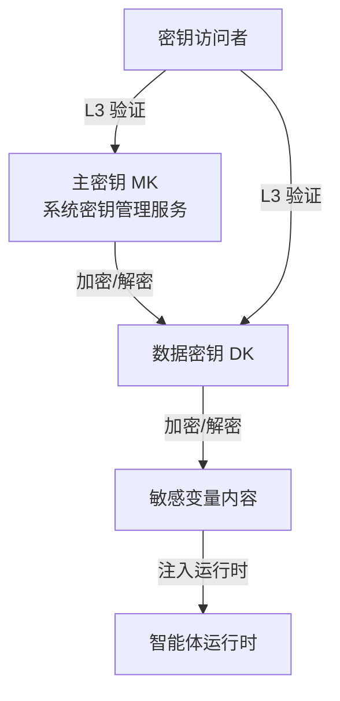
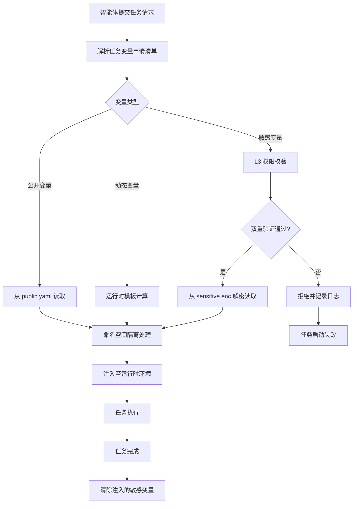

# 环境变量管理规范

本规范定义智能体协作过程中所使用的环境变量集中存储、分类管理、加密保护与注入策略，确保环境变量的安全性、可控性与最小暴露。所有智能体在执行变量读写、敏感信息访问与变量注入操作时，必须遵循本规范。

## 集中式环境变量存储机制

### 存储位置

环境变量采用集中式存储，统一存放于 `.agents/worlds/environments/variables/` 目录下，按环境与分类组织。

### 目录结构

```
.agents/worlds/environments/variables/
├── common/                    # 跨环境共享变量
│   ├── public.yaml            # 公开变量
│   └── dynamic.yaml           # 动态变量定义
├── dev/                       # 开发环境变量
│   ├── public.yaml            # 公开变量
│   ├── sensitive.enc          # 敏感变量（加密）
│   └── dynamic.yaml           # 动态变量定义
├── test/                      # 测试环境变量
│   ├── public.yaml
│   ├── sensitive.enc
│   └── dynamic.yaml
└── prod/                      # 生产环境变量
    ├── public.yaml
    ├── sensitive.enc
    └── dynamic.yaml
```

### 文件格式

| 文件扩展名 | 格式 | 说明 |
|---|---|---|
| `.yaml` | YAML | 公开变量与动态变量定义，明文存储 |
| `.enc` | 加密文本 | 敏感变量，使用加密算法加密存储 |

### 公开变量文件示例

```yaml
# dev/public.yaml
public:
  APP_NAME: "ai-collaboration"
  APP_VERSION: "1.0.0"
  API_BASE_URL: "http://localhost:3000/api"
  LOG_LEVEL: "debug"
  CACHE_TTL: "300"
```

## 变量分类

环境变量按敏感度分为三类，对应不同的存储与访问策略。

| 类别 | 标识 | 敏感度 | 存储方式 | 访问权限 | 典型变量 |
|---|---|---|---|---|---|
| 公开变量 | public | 低 | 明文 YAML | L1 | APP_NAME、API_BASE_URL、LOG_LEVEL |
| 敏感变量 | sensitive | 高 | 加密存储 | L3 | API_KEY、DB_PASSWORD、SECRET_TOKEN |
| 动态变量 | dynamic | 中 | 模板定义 + 运行时计算 | L2 | TIMESTAMP、RANDOM_ID、TASK_HASH |

### 公开变量

公开变量为不涉及敏感信息的配置项，可被所有智能体读取。

| 属性 | 说明 |
|---|---|
| 存储格式 | YAML 明文 |
| 读取权限 | L1（所有角色默认拥有） |
| 写入权限 | L2（team-admin 显式授予） |
| 注入策略 | 自动注入至运行时环境 |

### 敏感变量

敏感变量为涉及安全凭证、密钥等敏感信息的配置项，须加密存储。

| 属性 | 说明 |
|---|---|
| 存储格式 | 加密文本（.enc） |
| 读取权限 | L3（双重验证 + 操作日志） |
| 写入权限 | L3（双重验证 + 影响评估） |
| 注入策略 | 按需注入，仅注入当前任务所需变量 |

### 动态变量

动态变量为运行时计算的变量，通过模板定义在运行时生成具体值。

```yaml
# dev/dynamic.yaml
dynamic:
  TIMESTAMP:
    template: "{{ now | date '20060102-150405' }}"
    description: "当前时间戳"
  TASK_HASH:
    template: "{{ sha256 .TaskID | truncate 8 }}"
    description: "任务 ID 的哈希摘要"
  RUNTIME_ID:
    template: "{{ env 'dev' }}-{{ random 8 }}"
    description: "运行时唯一标识"
```

## 敏感变量加密存储机制

### 加密算法

| 项目 | 规范 |
|---|---|
| 加密算法 | AES-256-GCM |
| 密钥派生 | PBKDF2（迭代次数 100000） |
| 密钥长度 | 256 位 |
| 向量长度 | 96 位 |
| 认证标签 | 128 位 |

### 密钥管理

| 密钥类型 | 存储位置 | 访问权限 | 说明 |
|---|---|---|---|
| 主密钥（MK） | 系统密钥管理服务 | L3 + orchestrator | 用于加密数据密钥 |
| 数据密钥（DK） | 加密后存于 `.enc` 文件头 | L3 | 用于加密变量内容 |

### 密钥层级结构



### 解密权限

敏感变量解密须满足以下条件：

1. **权限级别**：操作者须拥有 L3 特权权限。
2. **双重验证**：须通过双重身份验证。
3. **任务关联**：解密请求须关联具体任务 ID。
4. **操作日志**：所有解密操作须记录审计日志。
5. **有效期**：解密后的变量仅在当前任务执行期间有效，任务结束后自动清除。

## 环境变量注入策略

### 注入时机

| 时机 | 说明 | 注入变量类型 |
|---|---|---|
| 环境切换时 | 环境切换完成后注入基础变量 | 公开变量 |
| 任务启动时 | 任务执行前注入任务所需变量 | 公开变量 + 敏感变量（按需） |
| 运行时计算 | 动态变量在运行时按需计算 | 动态变量 |

### 注入方式

| 注入方式 | 适用场景 | 说明 |
|---|---|---|
| 进程环境变量 | 命令执行 | 通过 `env` 参数注入至子进程 |
| 配置上下文 | 配置加载 | 注入至配置上下文供智能体读取 |
| 临时文件 | 大型变量 | 写入临时文件，路径通过环境变量传递 |

### 命名空间隔离

环境变量按命名空间隔离，避免不同环境、不同任务的变量冲突。

| 命名空间 | 前缀 | 示例 |
|---|---|---|
| 全局变量 | `AI_` | `AI_APP_NAME` |
| 环境变量 | `AI_<ENV>_` | `AI_DEV_API_URL` |
| 任务变量 | `AI_TASK_<TASK_ID>_` | `AI_TASK_001_DB_PASSWORD` |

## 最小暴露原则

### 原则定义

最小暴露原则要求环境变量注入时仅包含当前任务所需的最小变量集合，避免过度暴露敏感信息。

### 暴露控制规则

| 规则 | 说明 |
|---|---|
| 按需注入 | 仅注入任务声明所需的变量 |
| 最小权限 | 敏感变量仅授予完成任务所必需的最小权限 |
| 临时有效 | 注入的敏感变量仅在任务执行期间有效 |
| 自动清理 | 任务结束后自动清除注入的敏感变量 |
| 禁止继承 | 注入的变量不可被任务派生的子任务继承，须重新申请 |

### 任务变量申请清单

智能体在执行任务前须声明所需变量清单：

```yaml
# 任务变量申请清单示例
task_id: "task-2026-001"
environment: "dev"
required_variables:
  public:
    - APP_NAME
    - API_BASE_URL
  sensitive:
    - name: DB_PASSWORD
      reason: "访问开发数据库执行数据迁移"
      scope: "database.connect"
  dynamic:
    - TIMESTAMP
    - TASK_HASH
```

## 变量注入流程



## 使用约束

1. **禁止硬编码**：禁止在代码或配置文件中硬编码敏感变量，须通过加密存储机制管理。
2. **禁止日志输出**：禁止在日志、错误信息中输出敏感变量的明文值。
3. **禁止跨环境共享**：敏感变量禁止跨环境共享，每个环境须独立配置。
4. **变量命名规范**：变量名须使用大写字母与下划线，遵循命名空间前缀规则。
5. **变量变更审计**：所有变量变更（新增、修改、删除）须记录审计日志，保留期不少于 90 天。
6. **密钥轮换**：主密钥须每 90 天轮换一次，数据密钥须每 30 天轮换一次。
7. **变量引用校验**：任务执行前须校验申请清单中的变量是否全部存在，缺失任一变量则任务启动失败。
