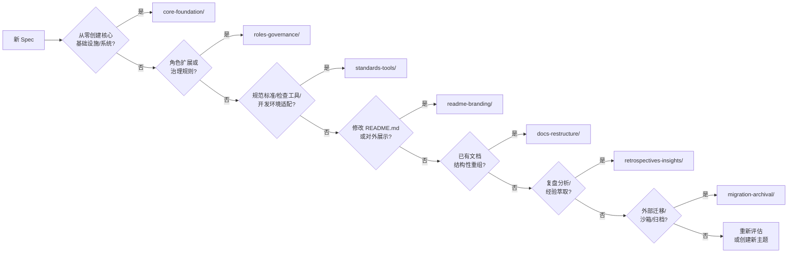

# Specs 全局执行看板

本目录是 SpecWeave 项目所有规格文档（spec）的指挥中心，按 7 大主题分类组织。本文档提供全局执行状态总览、待办事项追踪、里程碑路线图与跨主题依赖关系。

---

## 📊 全局状态总览

| 主题目录 | Spec 数 | 已完成 | 进行中 | 待启动 | 完成率 | 看板 |
|---|---|---|---|---|---|---|
| [core-foundation/](core-foundation/README.md) | 7 | 7 | 0 | 0 | 100% | [查看](core-foundation/README.md) |
| [roles-governance/](roles-governance/README.md) | 8 | 8 | 0 | 0 | 100% | [查看](roles-governance/README.md) |
| [standards-tools/](standards-tools/README.md) | 18 | 12 | 2 | 4 | 67% | [查看](standards-tools/README.md) |
| [readme-branding/](readme-branding/README.md) | 4 | 4 | 0 | 0 | 100% | [查看](readme-branding/README.md) |
| [docs-restructure/](docs-restructure/README.md) | 8 | 8 | 0 | 0 | 100% | [查看](docs-restructure/README.md) |
| [retrospectives-insights/](retrospectives-insights/README.md) | 10 | 10 | 0 | 0 | 100% | [查看](retrospectives-insights/README.md) |
| [migration-archival/](migration-archival/README.md) | 3 | 3 | 0 | 0 | 100% | [查看](migration-archival/README.md) |
| **合计** | **58** | **52** | **2** | **4** | **90%** | — |

**状态图例**：✅ 已完成 | 🔧 进行中 | 📋 待启动

---

## ⚠️ 待办事项汇总

### 进行中（2 项）

- [ ] [explore-forum-auto-posting](standards-tools/explore-forum-auto-posting/)：forum.trae.cn 论坛自动化操作（知识库文档已完成，Skill封装与收尾待完成）
- [ ] [markdown-as-interface-research](standards-tools/markdown-as-interface-research/)：Markdown即接口深度研究（Parser/Validator/Generator已完成，测试生成器/验证案例/研究报告待完成）

### 待启动（4 项）

- [ ] [migrate-toml-frontmatter-to-yaml](standards-tools/migrate-toml-frontmatter-to-yaml/)：TOML→YAML frontmatter 全面迁移
- [ ] [create-tvm-ffi-wiki-tutorial](standards-tools/create-tvm-ffi-wiki-tutorial/)：TVM FFI 完整 Wiki 教程（源码研究+官方文档学习+16章节教程编写）
- [ ] [sensitive-info-sanitization-audit](standards-tools/sensitive-info-sanitization-audit/)：项目全面敏感信息脱敏检查与自动化检测工具
- [ ] [check-academic-sources](standards-tools/check-academic-sources/)：学术来源自动验证脚本（CrossRef API元数据验证、DOI存在性检查、标题/作者/年份一致性比对）

---

## 🏁 里程碑路线图

### 已完成里程碑

```mermaid
timeline
    title SpecWeave 规格文档演进历程
    section 基础奠基期
        初始化        : Git 仓库初始化 + .gitignore 配置
        核心契约      : AGENTS.md 全局契约 + .agents/ 目录骨架创建
        角色体系      : 5 个核心角色定义 + 系统提示词 + Few-shot
        工具协议      : 4 类工具规范 + 4 个协作协议 + 3 个标准工作流
    section 规范建设期
        一致性检查    : check-spec-consistency 工具 v1.0-v1.2
        命名规范      : 文件命名标准化（kebab-case + 中英文分离）
        Spec 框架     : spec-standards-enhancement 标准化框架 v1.1 完成
        IDE 适配      : Trae IDE 项目适配优化
    section 品牌文档期
        品牌定位      : README 定位词选型（SpecWeave）
        蓝图规划      : README 蓝图与亮点补充
        系统规划      : 八大自我治理模块章节
        协作场景      : 角色协作场景（中心化/去中心化）
    section 知识沉淀期
        文档重组      : 复盘文档原子化重构（18个模块）
        复盘体系      : 复盘报告 5 主题分类 + 重复内容优化
        经验萃取      : 硬编码复盘 + 方法论分析报告
        洞察重组      : 竹简悟道洞察库重组 + 原子提交
        治理细分      : project-governance 报告二级主题分类（19份报告）
    section 体系完善期
        角色扩展      : 联合创始者标记 + 哲思引导者角色
        治理规则      : 硬编码治理规则体系（5大模块）
        协作环境      : worlds/ 协作环境子目录
        同步机制      : AGENTS.md 与 .agents 一致性同步
    section 迁移归档期
        内容萃取      : xinet 沙箱内容萃取与归档方案
        迁移落地      : xinet 多项目迁移计划
        分类整理      : specs 目录 7 主题分类重组
        任务看板      : 三层任务清单体系建立
```



### 后续规划（待补充）

- [x] 补充 `docs-restructure-zhujian-wudao` tasks.md 并执行 ✅
- [x] 补充 `insights-reorganization` tasks.md 并执行 ✅
- [ ] 各主题目录 README 持续维护与更新
- [ ] （待新增）应用开发工作流（apps/ 目录相关 spec）
- [ ] （待新增）CI/CD 自动化检查流水线

---

## 🔗 跨主题依赖关系

```mermaid
flowchart TD
    subgraph "✅ 核心基础 core-foundation"
        CA[create-agents-md-and-config]
        KMS[knowledge-management-system]
        PES[prompt-extraction-system]
        CAD[create-apps-directory]
        CW[create-worlds-collaboration-environment]
        CFE[create-first-principles-exercises]
        CSD[create-sphinx-docs]
    end
    subgraph "✅ 角色治理 roles-governance"
        ACM[add-cofounder-role-marker]
        APH[add-philosopher-role]
        AHGR[add-hardcode-governance-rules]
        ADSG[add-development-stage-guardrails]
        SAM[sync-agents-md-with-agents-folder]
    end
    subgraph "✅ 标准工具 standards-tools"
        SSE["spec-standards-enhancement<br>✅ v1.1"]
        SFNC[standardize-file-naming-convention]
        CSC[check-spec-consistency]
        OTPA[optimize-trae-project-adaptation]
        RSL[refactor-scripts-shared-lib]
        ASM[analyze-script-merging]
        EVCF[establish-vendor-collaboration-framework]
        EFAP[explore-forum-auto-posting]
        AVFG[adjust-vendor-flexloop-governance]
        FWTCE[fix-windows-terminal-chinese-encoding]
        EMMS[establish-mermaid-management-system]
        MAIR[markdown-as-interface-research]
        ATIM[add-tuya-ipc-minimal-closed-loop-guide]
    end
    subgraph "✅ 品牌展示 readme-branding"
        SRPW[select-readme-positioning-word]
        ORB[optimize-readme-with-blueprint]
        ASP[add-system-planning-to-readme]
        ATCS[add-team-collaboration-scenario-to-readme]
    end
    subgraph "✅ 文档重组 docs-restructure"
        RRD["refactor-retrospective-docs<br>✅ 完成"]
        RRR["restructure-retrospective-reports-by-topic<br>✅ 完成"]
        RDO["reports-duplication-optimization<br>✅ 完成"]
        DRZ["docs-restructure-zhujian-wudao<br>✅ 完成"]
        IR["insights-reorganization<br>✅ 完成"]
        PGR["project-governance-reports-reorg<br>✅ 完成"]
    end
    subgraph "✅ 复盘洞察 retrospectives-insights"
        RASS[retrospective-agents-spec-system]
        RSPT[retrospective-system-planning-task]
        HRS[hardcode-retrospective-system]
        CRIR[commit-retrospective-insights-reorg]
        MAR[methodology-analysis-report]
    end
    subgraph "✅ 迁移归档 migration-archival"
        XCEA[xinet-content-extraction-and-archiving]
        PXPM[plan-xinet-project-migration]
    end
    CA --> CW
    CA --> ACM
    CA --> SAM
    CA --> ORB
    CA --> RASS
    CW --> ATCS
    ATCS --> SAM
    ATCS --> RSPT
    ASP --> ATCS
    ASP --> RSPT
    ORB --> ASP
    AHGR --> HRS
    HRS --> AHGR
    AHGR --> ADSG
    IR --> CRIR
    RRD --> RRR
    RRR --> RDO
    RDO --> PGR
    DRZ --> IR
    XCEA --> PXPM
    EVCF --> EFAP
    EFAP --> AVFG
    style SSE fill:#d4edda,stroke:#28a745
    style CA fill:#d4edda,stroke:#28a745
    style KMS fill:#d4edda,stroke:#28a745
    style PES fill:#d4edda,stroke:#28a745
    style CAD fill:#d4edda,stroke:#28a745
    style CW fill:#d4edda,stroke:#28a745
    style CFE fill:#d4edda,stroke:#28a745
    style CSD fill:#d4edda,stroke:#28a745
    style ACM fill:#d4edda,stroke:#28a745
    style APH fill:#d4edda,stroke:#28a745
    style AHGR fill:#d4edda,stroke:#28a745
    style SAM fill:#d4edda,stroke:#28a745
    style SFNC fill:#d4edda,stroke:#28a745
    style CSC fill:#d4edda,stroke:#28a745
    style OTPA fill:#d4edda,stroke:#28a745
    style SRPW fill:#d4edda,stroke:#28a745
    style ORB fill:#d4edda,stroke:#28a745
    style ASP fill:#d4edda,stroke:#28a745
    style ATCS fill:#d4edda,stroke:#28a745
    style RASS fill:#d4edda,stroke:#28a745
    style RSPT fill:#d4edda,stroke:#28a745
    style HRS fill:#d4edda,stroke:#28a745
    style CRIR fill:#d4edda,stroke:#28a745
    style MAR fill:#d4edda,stroke:#28a745
    style XCEA fill:#d4edda,stroke:#28a745
    style PXPM fill:#d4edda,stroke:#28a745
    style RRD fill:#d4edda,stroke:#28a745
    style RRR fill:#d4edda,stroke:#28a745
    style RDO fill:#d4edda,stroke:#28a745
    style DRZ fill:#d4edda,stroke:#28a745
    style IR fill:#d4edda,stroke:#28a745
    style PGR fill:#d4edda,stroke:#28a745
    style RSL fill:#d4edda,stroke:#28a745
    style ASM fill:#d4edda,stroke:#28a745
    style EVCF fill:#d4edda,stroke:#28a745
    style EFAP fill:#d4edda,stroke:#28a745
    style AVFG fill:#d4edda,stroke:#28a745
    style ADSG fill:#d4edda,stroke:#28a745
    style FWTCE fill:#d4edda,stroke:#28a745
    style EMMS fill:#d4edda,stroke:#28a745
    style MAIR fill:#d4edda,stroke:#28a745
    style ATIM fill:#d4edda,stroke:#28a745
```



---

## 📁 主题分类定义与边界

### 1. [core-foundation/](core-foundation/README.md) — 核心体系基础
**定义**：项目核心基础设施、系统架构、核心功能模块的创建与配置类 spec。
**边界**：包含从零开始创建的基础性目录结构、核心系统、管理体系；不包含对已有体系的增量修改或角色扩展。
**任务模板**：[core-foundation-task-template.md](../../.agents/templates/theme-templates/core-foundation-task-template.md)

### 2. [roles-governance/](roles-governance/README.md) — 角色与治理体系
**定义**：智能体角色定义扩展、权限标记、治理规则体系、索引同步相关 spec。
**边界**：包含角色新增、角色特殊标记、治理规则建立、入口文档同步维护；不包含核心体系初始创建。
**任务模板**：[roles-governance-task-template.md](../../.agents/templates/theme-templates/roles-governance-task-template.md)

### 3. [standards-tools/](standards-tools/README.md) — 规范标准与工具链
**定义**：文档编写标准、命名规范、自动化检查/验证工具、IDE 适配优化相关 spec。
**边界**：包含质量保障工具、规范执行工具、开发环境适配；不包含业务功能系统或文档结构重组。
**任务模板**：[standards-tools-task-template.md](../../.agents/templates/theme-templates/standards-tools-task-template.md)

### 4. [readme-branding/](readme-branding/README.md) — README 与品牌定位
**定义**：项目对外展示窗口 README.md 的演进、品牌定位词选型、蓝图与场景展示相关 spec。
**边界**：仅包含面向人类读者的入口文档优化；不包含 .agents/ 内部规范文档或技术文档重组。
**任务模板**：[readme-branding-task-template.md](../../.agents/templates/theme-templates/readme-branding-task-template.md)

### 5. [docs-restructure/](docs-restructure/README.md) — 文档体系重组
**定义**：对已有文档进行原子化拆分、主题分类、目录重构、重复消除、命名统一等结构性整理的 spec。
**边界**：包含纯文档结构调整（不改变实质内容）；不包含内容新增或功能变更。
**任务模板**：[docs-restructure-task-template.md](../../.agents/templates/theme-templates/docs-restructure-task-template.md)

### 6. [retrospectives-insights/](retrospectives-insights/README.md) — 复盘与洞察萃取
**定义**：对已完成任务/项目进行系统性复盘、问题诊断、经验萃取、方法论分析的 spec。
**边界**：包含回顾性分析与知识沉淀类 spec；不包含文档结构调整或规范制定。
**任务模板**：[retrospectives-insights-task-template.md](../../.agents/templates/theme-templates/retrospectives-insights-task-template.md)

### 7. [migration-archival/](migration-archival/README.md) — 迁移与归档
**定义**：外部内容引入、沙箱治理、历史项目迁移、归档体系建立相关 spec。
**边界**：包含跨项目/跨目录的内容迁移、归档、安全治理；不包含项目内部文档重组。
**任务模板**：[migration-archival-task-template.md](../../.agents/templates/theme-templates/migration-archival-task-template.md)

---

## 🆕 新增 Spec 指南

### 归类决策树

创建新 spec 时，按以下顺序判断归属主题：



### 创建流程

1. **选择主题目录**：参照上述决策树
2. **创建 spec 目录**：使用 kebab-case 命名，动词开头（如 `add-xxx`、`create-xxx`、`optimize-xxx`）
3. **参考主题模板**：使用对应主题的任务模板编写 tasks.md
4. **编写三个核心文件**：
   - `spec.md`：需求规格说明
   - `tasks.md`：任务分解清单（参考主题模板）
   - `checklist.md`：验收检查清单
5. **更新主题 README**：在对应主题的 README.md 中登记新 spec，更新看板状态
6. **更新本看板**：如涉及新增主题或待办事项，同步更新本文件

---

## 📋 目录结构

```
.trae/specs/
├── README.md                                   # 本文件（全局执行看板）
├── core-foundation/                            # ✅ 核心体系基础
│   ├── README.md                               # 主题执行看板
│   ├── create-agents-md-and-config/
│   ├── create-apps-directory/
│   ├── create-first-principles-exercises/
│   ├── create-sphinx-docs/
│   ├── create-worlds-collaboration-environment/
│   ├── knowledge-management-system/
│   └── prompt-extraction-system/
├── roles-governance/                           # ✅ 角色与治理体系
│   ├── README.md                               # 主题执行看板
│   ├── add-cofounder-role-marker/
│   ├── add-development-stage-guardrails/
│   ├── add-hardcode-governance-rules/
│   ├── add-philosopher-role/
│   └── sync-agents-md-with-agents-folder/
├── standards-tools/                            # 🔧 规范标准与工具链（进行中）
│   ├── README.md                               # 主题执行看板
│   ├── add-tuya-ipc-minimal-closed-loop-guide/
│   ├── adjust-vendor-flexloop-governance/
│   ├── analyze-script-merging/
│   ├── check-academic-sources/
│   ├── check-spec-consistency/
│   ├── create-tvm-ffi-wiki-tutorial/
│   ├── establish-mermaid-management-system/
│   ├── establish-vendor-collaboration-framework/
│   ├── explore-forum-auto-posting/
│   ├── fix-windows-terminal-chinese-encoding/
│   ├── generate-first-principles-knowledge-graph/
│   ├── markdown-as-interface-research/
│   ├── migrate-toml-frontmatter-to-yaml/
│   ├── optimize-trae-project-adaptation/
│   ├── refactor-scripts-shared-lib/
│   ├── sensitive-info-sanitization-audit/
│   ├── spec-standards-enhancement/
│   └── standardize-file-naming-convention/
├── readme-branding/                            # ✅ README 与品牌
│   ├── README.md                               # 主题执行看板
│   ├── add-system-planning-to-readme/
│   ├── add-team-collaboration-scenario-to-readme/
│   ├── optimize-readme-with-blueprint/
│   └── select-readme-positioning-word/
├── docs-restructure/                           # ✅ 文档体系重组
│   ├── README.md                               # 主题执行看板
│   ├── docs-restructure-zhujian-wudao/
│   ├── insights-reorganization/
│   ├── project-governance-reports-reorg/
│   ├── refactor-retrospective-docs/
│   ├── reports-duplication-optimization/
│   └── restructure-retrospective-reports-by-topic/
├── retrospectives-insights/                    # ✅ 复盘与洞察萃取
│   ├── README.md                               # 主题执行看板
│   ├── commit-retrospective-insights-reorg/
│   ├── hardcode-retrospective-system/
│   ├── methodology-analysis-report/
│   ├── retrospective-agents-spec-system/
│   ├── retrospective-system-planning-task/
│   └── analyze-yihuakaitian-meeting-record/
└── migration-archival/                         # ✅ 迁移与归档
    ├── README.md                               # 主题执行看板
    ├── plan-xinet-project-migration/
    └── xinet-content-extraction-and-archiving/
```
