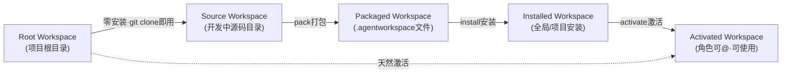
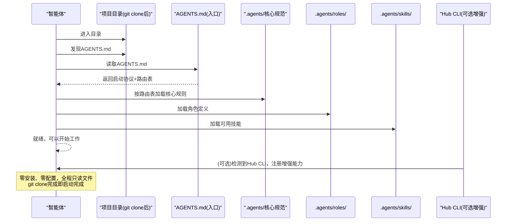
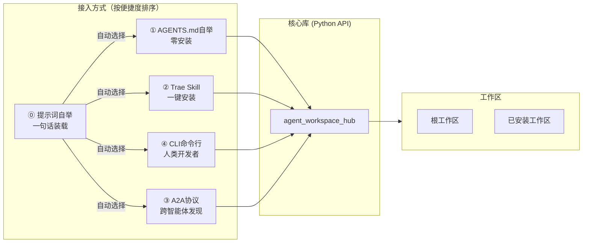
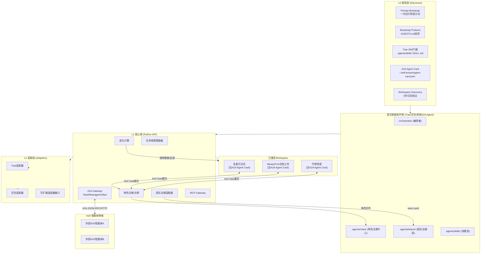

# Agent Workspace Hub - 智能体工作区枢纽系统 - Product Requirement Document

## Overview
- **Summary**: 设计并实现**Agent Workspace（智能体工作区）**体系——一个四层架构的智能体协作生态：
  - **L0 发现层**：根工作区自举协议（git clone零安装即用）+ **Trae Skill门面**（智能体可直接安装使用）+ **A2A协议支持**（跨智能体发现与通信）
  - **L1 包格式层**：标准化Workspace包格式（Agent Card + workspace.yaml + 角色/技能/工作流/知识库）
  - **L2 生命周期管理层**：Workspace管理器（bootstrap/pack/install/uninstall/activate/deactivate/upgrade/evolve）
  - **L3 治理与适配层**：.agents/roles+teams集成 + MCP/豆包/外部平台适配器
  最终实现：(1) 项目本身作为Trae Skill可被智能体一键安装；(2) 工作区自动暴露A2A Agent Card，支持跨智能体发现和任务委托；(3) 兼容MCP工具协议。参考实现在`apps/agent-workspace-hub/`，Skill门面在`.agents/skills/agent-workspace-hub/`。
- **Purpose**: 解决智能体能力复用的七大本质矛盾：
  0. **零安装vs可管理**：git clone下来智能体就能直接工作，但也支持通过Hub CLI高级管理
  0.5 **Skill即入口vsA2A即网络**：既是Trae Skill可被直接安装使用，又通过A2A协议成为智能体网络上的可发现节点
  1. **隔离vs协作**：智能体需要独立沙箱，但又需要灵活@交互和A2A任务委托
  2. **标准化vs进化**：统一包格式保证可移植性，同时支持自主迭代进化
  3. **中心化vs去中心化**：平台管理生命周期，工作区内角色@协作为主，A2A实现跨智能体对等通信
  4. **内部治理vs外部注入**：一套资产在SpecWeave内通过roles/teams治理，可导出给豆包，也可通过A2A被任何兼容智能体发现
  5. **静态安装vs动态成长**：包是活的环境，可在使用中自主学习进化
- **Target Users**: 
  - **智能体本身**：通过Skill安装或A2A发现自动获得Workspace管理能力
  - **AI生态构建者**：构建可插拔智能体生态，兼容Skill/A2A/MCP多种接入方式
  - **项目维护者**：项目git clone后智能体零安装即可理解协作
  - **团队管理者**：管理智能体工作区的权限、共享、协作
  - **智能体开发者**：开发可打包、可安装、可被A2A发现的智能体应用

## Goals
- **G0**: 定义**工作区发现与自举协议**：任意包含规范文件的项目，git clone后智能体无需安装任何工具即可识别、理解并开始协作（零安装可用）
- **G0.2**: 支持**一句话提示词装载（Prompt Bootstrap）**：用户只需将一段引导提示词发给任意支持工具调用的智能体，智能体即可自动完成项目获取、环境检测、装载和就绪验证，无需用户手动操作git clone或安装
- **G0.5**: 创建**Trae Skill门面**：在`.agents/skills/agent-workspace-hub/`下创建标准Skill，智能体安装此Skill后即可获得完整的Workspace管理能力（无需手动安装CLI）
- **G0.8**: 支持**A2A协议v1.0**：
  - 每个激活的Workspace自动生成标准A2A Agent Card（`/.well-known/agent-card.json`）
  - 支持A2A Task生命周期（tasks/send、tasks/get、tasks/cancel）
  - 支持A2A Message和Artifact交换
  - @角色交互可桥接为A2A任务委托
  - 兼容Signed Agent Card（v1.0特性）
- **G1**: 定义**Agent Workspace**作为一等抽象：每个工作区是一个自治单元，包含自己的角色、团队、技能、工作流、知识库、记忆和进化规则
- **G2**: 实现Workspace包格式规范（`workspace.yaml` manifest + A2A Agent Card + 目录结构），支持声明式定义工作区的一切要素
- **G3**: 实现Workspace生命周期管理：作为Python库可被Skill直接调用，同时提供CLI作为增强
- **G4**: 实现**自动角色注册**：Workspace安装时自动将其角色注册到`.agents/roles/`，支持`@角色名`直接召唤，与现有角色体系无缝集成
- **G5**: 集成现有`.agents/teams/`治理体系：Workspace作为"虚拟团队"被管理，复用RBAC权限、V1/V2/V3验证、操作留痕
- **G6**: 实现工作区隔离与交互机制：每个Workspace有独立边界，但通过@消息和A2A协议安全交互
- **G7**: 支持工作区**自主进化**：在使用过程中可自动沉淀知识、生成新技能、甚至触发角色创建
- **G8**: 提供多协议外部适配器：Trae原生、MCP Server、A2A Agent、豆包插件
- **G9**: 将SpecWeave本身改造为符合自举协议的"根工作区"，验证零安装+Skill+A2A可用
- **G10**: 提供至少3个参考Workspace示例（竹简悟道、WeasyPrint文档工坊、复盘方法论工作区），每个示例都有Agent Card可被A2A发现

## Non-Goals (Out of Scope)
- 不做中心化公网Workspace市场（首期仅支持本地/共享文件夹registry）
- 不做在线支付、商业化计费
- 不实现大模型推理运行时本身，只做智能体环境的打包、部署、治理、进化框架
- 不绑定特定大模型厂商，保持模型中立
- 首期不做GUI管理界面，仅提供CLI和API
- 不替换现有`.agents/roles/`和`.agents/teams/`，而是在其基础上扩展，向后100%兼容

## Background & Context
- SpecWeave已有成熟的**角色体系**（`.agents/roles/`：6个标准角色+YAML/TOML绑定+@协作机制）和**团队治理体系**（`.agents/teams/`：team-admin/RBAC权限/V1-V3验证/角色自动创建流程），这是极其宝贵的治理资产，新系统必须复用而非重建
- 当前已有Skill雏形（`.agents/skills/`、竹简悟道的`.agents/skills/`），但缺少：环境隔离、生命周期管理、自动角色注册、自主进化、外部导出
- 业界参考：
  - VS Code Extension Host：扩展隔离+贡献点机制
  - npm/node_modules：依赖树+隔离+生命周期脚本
  - Docker：容器隔离+镜像打包+分层升级
  - MCP (Model Context Protocol)：工具/资源/Prompt标准化，我们兼容MCP
  - ChatGPT GPTs/GPT Store：自定义GPT打包分发，但缺少多角色协作和团队治理
- 核心洞察：**每个可安装的智能体能力不应该是一个"技能"（工具），而应该是一个"工作区"（环境）**——就像公司雇佣的不只是一个工具，而是一个有角色分工、有工作流程、有知识积累的团队。当你安装"竹简悟道"工作区时，你得到的不只是一个"洞察写作函数"，而是哲学家角色+洞察写作技能+帛书知识库+体道工作流+七重约束的完整环境，其中"哲学家"角色自动注册，你可以直接`@哲学家 帮我反思这个决策`。

## Core Concepts & Architecture (First Principles)

### 抽象层次：三种工作区形态


- **Root Workspace（根工作区）**：项目根目录本身，存在AGENTS.md即表明这是一个智能体友好的项目。**零安装、零配置，git clone后智能体读AGENTS.md即可开始工作**——这是"项目即工作区"的核心。
- **Source Workspace（源码工作区）**：开发中的工作区源码，有workspace.yaml和完整目录结构
- **Packaged Workspace（打包工作区）**：`.agentworkspace`格式，可分发、可安装
- **Installed Workspace（已安装工作区）**：已安装到宿主但未激活
- **Activated Workspace（已激活工作区）**：角色已注册，可@使用

### 核心抽象：Agent Workspace
Workspace是一个**自治的智能体沙箱环境**，类比：
- 类比Docker容器：有隔离边界、有镜像格式、可以启动/停止、有端口（接口）与外界交互
- 类比公司/团队：有自己的角色（岗位）、团队（组织架构）、技能（能力）、工作流（流程）、知识库（经验）、记忆（历史）
- 类比npm包：有manifest声明、可以打包/安装/升级、有依赖管理、有生命周期脚本

Workspace安装后在宿主中表现为：
1. **一个或多个可@的角色**：自动注册到`.agents/roles/`，带有workspace前缀命名空间（如`zhujian/philosopher`），可直接`@zhujian/philosopher`召唤
2. **一组技能/工具**：注册到宿主可用技能列表
3. **一套工作流**：可被orchestrator编排
4. **一份知识库**：该领域的专业知识
5. **（可选）一个内部团队**：工作区内部多角色协作，对外暴露特定接口

### 工作区发现协议（Workspace Discovery Protocol）
智能体进入任意目录后，按以下优先级顺序自动发现这是否是一个Agent Workspace：
1. **第一步：检查根AGENTS.md**：如果当前目录（或父目录）存在`AGENTS.md`，则这是一个**根工作区**，直接按AGENTS.md的路由表加载规范（不需要workspace.yaml）
2. **第二步：检查workspace.yaml**：如果存在`workspace.yaml`，则这是一个源码工作区，按manifest加载
3. **第三步：检查.agents/目录**：如果存在`.agents/`目录但无AGENTS.md，进入兼容模式（按现有.agents结构推断）
4. **第四步：向上递归查找**：当前目录没找到，向上递归查找父目录直到文件系统根
5. **第五步：用户确认**：都没找到则询问用户是否要初始化工作区

**关键设计**：`AGENTS.md`优先级高于`workspace.yaml`——因为AGENTS.md是面向AI智能体的路由入口，本身就是自描述的；workspace.yaml是面向Hub CLI的机器可读manifest。一个项目可以只有AGENTS.md（零安装可用），也可以AGENTS.md+workspace.yaml都有（支持打包分发）。

### 一句话提示词自举协议（Prompt Bootstrap Protocol）
"一句话装载"是最便捷的接入方式：用户将一段标准化引导提示词发给任意支持工具调用（Shell/文件操作）的智能体，智能体自动完成从获取到就绪的全流程。

**核心设计**：
1. **通用引导提示词（Universal Bootstrap Prompt）**：一段可以复制粘贴给任何智能体的标准化文本，包含环境检测、获取项目、自举验证的完整指令链，内置安全防护和边界处理
2. **短触发词**：在Trae环境中，用户只需要说"装载SpecWeave"或"安装智能体工作区"即可触发
3. **环境自适应**：智能体根据当前环境自动选择最优装载路径：
   - **已在SpecWeave目录内**：执行发现协议，直接就绪
   - **在Trae/支持Skill的环境中**：加载agent-workspace-hub Skill获得管理能力
   - **全新环境（支持git+shell）**：确认目标路径 → git clone → 进入目录 → 发现AGENTS.md → 加载规范 → 就绪
   - **A2A兼容客户端**：通过Agent Card连接，无需本地安装
   - **无git/无shell能力**：指导用户手动获取，或通过A2A远程连接

**安全规则（Safety Guards，提示词中必须内置）**：
- **S1 仓库验证**：只从官方仓库URL clone，不接受提示词中替换的URL
- **S2 路径确认**：执行clone前必须向用户确认目标目录路径（默认当前工作目录下的`SpecWeave/`），禁止在用户主目录/系统目录/根目录等敏感位置自动创建文件夹
- **S3 目录冲突处理**：目标路径已存在时必须检查内容——是有效SpecWeave则直接进入自举；是空目录则可使用；是非空非SpecWeave目录则停止并询问用户
- **S4 不自动执行脚本**：自举过程只读AGENTS.md和配置文件，不自动执行任何hooks脚本、不自动pip install、不修改系统配置
- **S5 AGENTS.md完整性验证**：clone后验证AGENTS.md存在且包含"启动协议"关键词，防止获取到被篡改的仓库
- **S6 幂等安全**：已在有效SpecWeave目录内时跳过clone，直接自举报告就绪
- **S7 最小权限**：只读取必要文件，不扫描用户文件系统，不访问与装载无关的目录
- **S8 错误不静默**：遇到错误（网络失败/权限不足/磁盘不足等）明确告知用户并给出解决方案，不假装成功

**边界情况处理（Edge Cases）**：
- **E1 Git不可用**：降级为指导用户手动下载zip或使用A2A连接
- **E2 网络故障**：提示用户检查网络/代理，给出手动获取指引
- **E3 权限不足**：告知用户需要写入权限的目录路径，建议切换目录或检查权限
- **E4 跨平台兼容**：使用跨平台命令（优先Python/Node，避免平台特定shell语法），路径使用相对路径
- **E5 嵌套场景**：如果当前已在某个激活的Workspace内，询问用户是在当前工作区安装子工作区还是在父目录操作
- **E6 部分失败**：clone成功但AGENTS.md缺失/损坏时，删除不完整目录并报告错误
- **E7 Windows中文路径**：路径和文件名使用UTF-8，避免编码问题

**通用引导提示词模板**（项目README和AGENTS.md中提供可直接复制的版本）：
```
请帮我装载 SpecWeave Agent Workspace Hub 系统。请严格按照以下步骤执行，每步完成后再进行下一步：

【安全规则-必须遵守】
- 只从官方仓库获取：https://github.com/SpecWeave/SpecWeave（或对应GitCode镜像）
- 执行任何写入操作前，必须先向我确认目标路径
- 禁止在我的用户主目录、系统目录、根目录自动创建文件夹
- 自举过程只读文件，不执行任何脚本，不安装任何pip包
- 遇到错误直接告诉我，不要假装成功

【步骤1：环境检测】
检查以下内容并报告：
a) 当前工作目录的绝对路径是什么？
b) 当前目录下是否存在名为SpecWeave的子目录？如果存在，检查其中是否有AGENTS.md文件
c) 是否可以执行git命令？
d) 是否在Trae IDE环境中（检查是否有.trae/目录或AGENTS.md提到trae）？
e) 当前是否已经在一个SpecWeave目录内（当前目录是否有AGENTS.md且内容包含"智能体全局契约"）？

【步骤2：路径确认】
如果步骤1e确认已在SpecWeave目录内，直接跳到步骤4。
否则，向我确认："准备将SpecWeave安装到 <当前工作目录>/SpecWeave/，是否继续？" 等待我确认后再继续。

【步骤3：获取项目】
根据环境选择（不要同时执行多条路径）：
- 路径A（Trae环境且当前在SpecWeave工作区内）：直接进入步骤4自举
- 路径B（有git且用户确认了路径）：执行 git clone https://github.com/SpecWeave/SpecWeave.git SpecWeave
  · 如果clone失败（网络错误/超时），报告错误并建议检查网络或手动下载
  · clone成功后，检查SpecWeave/AGENTS.md是否存在
- 路径C（无git）：指导我手动从以下地址下载zip并解压：https://github.com/SpecWeave/SpecWeave/archive/refs/heads/main.zip
- clone或解压完成后，进入SpecWeave目录

【步骤4：自举加载】
a) 读取当前目录的AGENTS.md全文
b) 验证AGENTS.md包含"启动协议"关键词（防止获取到错误仓库）
c) 按AGENTS.md中的启动协议，读取.agents/context-routing.md了解规范路由
d) 列出.agents/roles/下有哪些角色文件
e) 列出.agents/skills/下有哪些技能目录

【步骤5：就绪报告】
装载完成后，向我报告：
"✅ SpecWeave 装载完成，已就绪。
📂 位置：<绝对路径>
🎭 可用角色：<列出角色名称>
⚡ 可用技能：<列出技能名称>
📖 下一步：读取AGENTS.md开始使用，或说'列出可用角色'查看详情。"
```

**关键特性**：
- **零手动操作**：用户只需发送提示词，不需要手动git clone或配置
- **安全可控**：内置8条安全规则，操作前确认，不自动执行危险操作
- **幂等安全**：已装载的环境不会重复操作，自动检测现有安装
- **渐进降级**：能力越强的环境获得越完整的体验；能力受限的环境给出手动指引
- **可复制传播**：引导提示词本身就是"安装说明书"，可以分享给任何人、任何智能体
- **可嵌入文档**：在README.md、AGENTS.md、Agent Card、Skill文档中都包含此引导提示词

### 根工作区自举流程（Bootstrap Sequence）


### 五种接入方式（多入口设计）
智能体可以通过五种独立、互补的方式接入Workspace生态，按便捷程度排序：

0. **L0-0 提示词模式（最便捷）**：用户发送一段引导提示词 → 智能体自动检测环境 → 选择最优路径完成装载（适合任何支持工具调用的智能体，零手动操作）
1. **L0-1 自举模式**：git clone项目 → 读AGENTS.md → 零安装可用（适合直接使用项目）
2. **L0-2 Skill模式**：在Trae中安装`agent-workspace-hub` Skill → 一键获得所有Workspace管理能力（适合智能体主动安装）
3. **L0-3 A2A模式**：通过A2A Agent Card发现工作区 → JSON-RPC over HTTP通信 → 任务委托（适合跨智能体协作）
4. **L0-4 CLI模式**：安装CLI工具 → 命令行管理（适合人类开发者/脚本）

**入口关系**：提示词模式是"元入口"——它自动检测环境并选择最合适的接入路径（Skill/自举/A2A/CLI），用户不需要理解底层差异。



### 架构分层



### A2A协议核心映射
A2A v1.0 与Workspace概念的映射关系：

| A2A概念 | Workspace对应 |
|---|---|
| **Agent Card** | 每个激活的Workspace自动生成Agent Card，暴露在`/.well-known/agent-card.json`；根工作区也有根Agent Card列出所有已激活子Workspace |
| **Agent Skill** | 映射到Workspace的`.agents/skills/`下的技能 + @角色能力 |
| **Task** | @角色交互或workflow执行都可包装为A2A Task |
| **Message** | 映射到跨工作区@消息协议 |
| **Artifact** | 工作区执行任务产生的产出物（文档、代码、报告等） |
| **Streaming (SSE)** | 长任务进度推送映射为A2A SSE流 |

### Trae Skill门面设计
Skill作为智能体的"第一入口"，遵循与根工作区一致的**AGENTS.md（SKILL.md）+ README.md + .agents/职责分离原则**：

- 位置：`.agents/skills/agent-workspace-hub/`
- 核心原则：与Workspace目录结构保持一致的分离设计
  - `SKILL.md`：AI智能体入口（等同于AGENTS.md角色），含标准frontmatter，定义触发条件、核心流程、安全清单
  - `README.md`：面向人类读者，说明Skill用途、安装方式、开发指南
  - `.agents/`：Skill内部AI资源容器，所有辅助资源统一放此目录
- 功能：智能体加载此Skill后，获得Workspace管理的完整能力（bootstrap/pack/install/activate等），不需要单独安装CLI
- Skill不重复实现逻辑，而是调用`apps/agent-workspace-hub/`下的Python核心库
- 目录结构：
  ```
  .agents/skills/agent-workspace-hub/
  ├── SKILL.md                 # AI入口（含frontmatter，五要素模型）
  ├── README.md                # 人类入口：Skill说明、开发指南
  └── .agents/                 # 内部AI资源容器
      ├── agents/              # 提示词模板
      │   └── openai.yaml     # 智能体系统提示词
      ├── references/          # 快速参考卡片
      ├── scripts/             # 辅助脚本（如有）
      └── assets/
          └── examples/        # 示例Workspace模板
  ```

### 工作区状态机
- **created**: 本地开发中的工作区，未打包
- **packed**: 已打包为`.agentworkspace`格式
- **installed**: 已安装到宿主，文件就位，但角色未激活
- **activated**: 已激活，角色已注册到`.agents/roles/`，可被@使用
- **deactivated**: 已休眠，角色注销但保留文件和数据
- **evolving**: 正在自主进化中（沉淀知识/生成新技能）
- **upgrading**: 正在升级中
- **uninstalled**: 已卸载，所有文件和注册信息移除

## Functional Requirements

### 工作区发现与根工作区自举协议（零安装核心）
- **FR-0**: 定义**工作区发现协议**（Workspace Discovery Protocol）：智能体进入任意目录时按优先级顺序识别工作区类型（AGENTS.md → workspace.yaml → .agents/目录 → 向上递归）
- **FR-0a**: AGENTS.md作为根工作区的**唯一入口文件**，其启动协议必须完整定义：步骤1读AGENTS.md → 步骤2按路由表加载规范 → 步骤3自检 → 步骤4开始工作。任何包含符合协议的AGENTS.md的项目，git clone后智能体无需安装任何工具即可开始协作。
- **FR-0b**: AGENTS.md格式标准化：必须包含「启动协议」步骤、「上下文路由表」（规范文件映射）、「核心规范入口表」，格式兼容现有[AGENTS.md](../../../../AGENTS.md)。
- **FR-0c**: 根工作区的角色天然可用：根目录`.agents/roles/`下的角色不需要"安装"或"激活"，智能体发现AGENTS.md后直接读取并可以@召唤。
- **FR-0d**: 根工作区天然处于"源码激活"状态：git clone完成即相当于激活，角色/技能/工作流立即可用，不需要运行任何CLI命令。
- **FR-0e**: 定义AGENTS.md的**最小可行子集**：即使一个新项目只有最简单的AGENTS.md（仅包含启动协议和路由表指向少量文件），智能体也能正常工作。
- **FR-0f**: 提供`workspace bootstrap`命令（可选）：为新项目自动生成符合规范的AGENTS.md和最小目录结构。
- **FR-0g**: 验证SpecWeave本身符合根工作区协议：对当前SpecWeave仓库做一次自检验证，确保git clone到新机器后智能体按AGENTS.md启动协议可正确加载所有规范。

### 一句话提示词自举（Prompt Bootstrap）
- **FR-0h**: 设计并发布**通用引导提示词（Universal Bootstrap Prompt）**：
  - 一段可直接复制粘贴的标准化文本，引导任意智能体完成SpecWeave装载
  - 包含：环境检测逻辑、安全规则、路径确认、多路径获取策略、自举加载指令、AGENTS.md完整性验证、就绪验证步骤
  - 提示词本身不依赖项目已存在，是"从零开始"的引导
  - 提示词内置8条安全规则（S1-S8），防止误操作和供应链风险
- **FR-0i**: 引导提示词支持**环境自适应路径选择**：
  - 已在SpecWeave目录内 → 跳过获取，直接执行发现协议自举
  - Trae/Skill环境且在SpecWeave工作区内 → 直接自举
  - 有git+shell+用户确认路径 → git clone → 验证AGENTS.md完整性 → 进入目录自举
  - 无git但可下载文件 → 给出zip下载链接指导手动获取
  - A2A兼容客户端 → 通过Agent Card连接
  - 能力受限时 → 给出清晰的手动指引
- **FR-0j**: 引导提示词**幂等安全**：
  - 已在有效SpecWeave目录内时跳过clone，直接自举报告就绪
  - 目标路径已存在且是有效SpecWeave → 进入自举
  - 目标路径已存在但为空目录 → 经用户确认后使用
  - 目标路径已存在且为非空非SpecWeave目录 → 停止并询问用户
- **FR-0k**: 引导提示词**安全防护**：
  - S1仓库验证：硬编码官方仓库URL，不接受替换
  - S2路径确认：写入操作前必须向用户确认目标路径
  - S3敏感目录防护：禁止在用户主目录/系统目录/根目录自动创建文件夹
  - S4不自动执行脚本：自举只读文件，不执行hooks、不pip install、不改系统配置
  - S5 AGENTS.md完整性：clone后验证AGENTS.md存在且包含"启动协议"关键词
  - S6错误透明：遇到错误明确告知用户，不静默失败
- **FR-0l**: 在所有入口点嵌入引导提示词：
  - AGENTS.md中包含"快速开始"章节，给出可复制的引导提示词
  - README.md中包含"一句话装载"章节，面向人类用户
  - A2A Agent Card的description字段包含短版引导提示词
  - Skill的SKILL.md中包含引导信息
  - 项目公开主页/文档中可随时获取此提示词
- **FR-0m**: 短触发词支持：在Trae环境中，"装载SpecWeave"、"安装工作区管理"、"setup agent workspace"等自然语言表达可触发智能体执行引导提示词流程
- **FR-0n**: 边界情况处理：
  - Git不可用时降级到zip下载指引
  - 网络故障时报告错误并给出手动方案
  - 权限不足时告知用户具体路径和原因
  - 跨平台兼容：使用跨平台命令，避免bash/PowerShell特定语法
  - 嵌套场景：检测到已在Workspace内时询问用户意图
  - 部分失败：clone成功但AGENTS.md缺失时清理不完整目录并报错

### Trae Skill 门面
- **FR-A**: 在`.agents/skills/agent-workspace-hub/`下创建标准Trae Skill（遵循README.md + SKILL.md + .agents/分离设计）
  - **FR-A1**: SKILL.md包含标准frontmatter（name/description/version/author），遵循Skill五要素模型
  - **FR-A2**: README.md面向人类开发者，包含Skill说明、开发指南
  - **FR-A3**: 所有辅助资源（提示词模板、参考卡片、示例、脚本）统一放在`.agents/`子目录下
  - **FR-A4**: Skill加载后，智能体可直接使用Workspace管理能力（bootstrap/pack/install/activate/deactivate/list/search等）
  - **FR-A5**: Skill通过Python API调用核心库，不重复实现业务逻辑
  - **FR-A6**: `.agents/agents/openai.yaml`包含提示词模板，指导智能体如何使用Workspace管理能力
  - **FR-A7**: `.agents/references/`包含快速参考卡片，列出常用命令和概念
  - **FR-A8**: 智能体安装此Skill等同于"获得了Workspace管理能力"，不需要额外安装CLI

### A2A协议支持（v1.0兼容）
- **FR-B0**: 实现A2A Agent Card自动生成与暴露
  - 每个激活的Workspace自动生成符合A2A v1.0规范的Agent Card（JSON格式）
  - Agent Card路径：`/.well-known/agent-card.json`（HTTP服务）或工作区目录下`.a2a/agent-card.json`（文件模式）
  - 根工作区生成根Agent Card，列出所有已激活子Workspace作为可用Skills
  - 支持A2A v1.0的Signed Agent Card（签名）扩展，首期可先生成未签名卡片
- **FR-B1**: 实现A2A Task生命周期端点（JSON-RPC over HTTP）
  - `tasks/send` - 发送/创建任务（对应@角色或执行工作流）
  - `tasks/get` - 查询任务状态和结果
  - `tasks/cancel` - 取消正在执行的任务
  - 支持SSE（Server-Sent Events）流式推送任务状态更新
- **FR-B2**: 实现A2A Message和Artifact交换
  - 传入Message映射到工作区角色的输入消息
  - 工作区执行结果封装为A2A Artifact返回
  - 支持文本、文件、结构化数据等多种Artifact类型
- **FR-B3**: @交互到A2A Task桥接
  - 工作区内@角色交互可选择通过A2A网关暴露
  - 跨工作区@委托自动映射为A2A Task调用
  - 支持权限校验：只有显式标记为"a2a-exported"的角色才能通过A2A访问
- **FR-B4**: 工作区发现与注册
  - 激活工作区时自动向本地A2A注册表注册
  - 支持通过A2A发现机制列出本地可用工作区
  - 首期实现本地文件系统注册表，预留未来网络注册扩展

### Workspace包格式与清单
- **FR-1**: 定义`workspace.yaml` manifest格式，包含：
  - 元数据：id、name、version、author、description、license、homepage
  - 角色声明（roles）：工作区包含的角色，每个角色id、名称、职责、绑定的技能/规则/知识库、是否通过A2A暴露（a2aExported）
  - 团队配置（team）：工作区内部团队结构、成员角色、权限策略
  - 技能声明（skills）：工作区提供的技能
  - 工作流声明（workflows）：工作区提供的工作流
  - 知识库声明（knowledge）：工作区包含的知识库路径和加载方式
  - A2A配置（a2a）：是否启用A2A、暴露端口、认证方式、暴露的角色/技能
  - 依赖声明（dependencies）：依赖的其他Workspace
  - 进化配置（evolution）：是否允许自主进化、进化规则、知识沉淀路径
  - 外部接口（exports）：对外暴露哪些角色/技能/工作流，哪些是内部私有
  - 平台兼容性（platforms）：支持的宿主平台（trae/doubao/mcp/a2a等）
  - 生命周期钩子（hooks）：install/post-install/activate/pre-uninstall等脚本钩子
- **FR-2**: 定义标准化目录结构（严格遵循AGENTS.md + README.md + .agents/职责分离原则）：
  ```
  <workspace-id>/
  ├── workspace.yaml           # manifest（根目录，机器+人类可读）
  ├── README.md                # 面向人类读者：工作区说明、使用指南
  ├── AGENTS.md                # AI协作者唯一入口：启动协议+路由表，指向.agents/内资源
  ├── .a2a/                    # A2A相关文件（自动生成，运行时产物）
  │   └── agent-card.json     # A2A Agent Card
  └── .agents/                 # AI规范容器（所有面向AI的资源统一放此目录下）
      ├── roles/               # 工作区角色定义
      │   └── <role-id>.md    # 角色文件，兼容现有roles格式
      ├── skills/              # 工作区技能
      │   └── <skill-id>/
      │       └── SKILL.md
      ├── workflows/           # 工作流定义
      ├── knowledge/           # 知识库
      ├── config/              # 配置文件
      └── hooks/               # 生命周期脚本（可选）
  ```
  - 根目录仅放三类文件：`workspace.yaml`（manifest）、`README.md`（人类入口）、`AGENTS.md`（AI入口），以及自动生成的运行时目录`.a2a/`
  - `.agents/`是AI智能体的资源容器，所有角色/技能/工作流/知识库/配置/脚本均在此目录下
  - 此结构与SpecWeave根工作区的布局完全一致，确保"工作区内嵌工作区"的递归一致性
  - `AGENTS.md`中的上下文路由表指向`.agents/`内的具体文件路径
- **FR-3**: 提供正式JSON Schema验证manifest（schemas/agent-workspace.schema.json，YAML是JSON超集，可直接用JSON Schema验证YAML）

### 生命周期管理CLI
- **FR-4**: `workspace init` - 交互式创建新Workspace脚手架
- **FR-5**: `workspace validate` - 验证Workspace目录格式正确性
- **FR-6**: `workspace pack` - 打包为`.agentworkspace`格式（zip，可重现构建）
- **FR-7**: `workspace install <source>` - 从本地文件/registry/git安装Workspace
  - 解析并安装依赖
  - 执行install钩子
  - 记录安装状态
  - **不自动激活**（需显式activate）
- **FR-8**: `workspace uninstall <workspace-id>` - 卸载Workspace
  - 如果已激活，先deactivate
  - 执行pre-uninstall钩子
  - 移除所有文件
  - 清理依赖（如无其他Workspace依赖）
- **FR-9**: `workspace activate <workspace-id>` - 激活Workspace
  - 将角色注册到`.agents/roles/`（命名空间前缀：`<ws-id>/<role-id>`）
  - 将技能注册到宿主技能池
  - 注册工作区为"虚拟团队"到`.agents/teams/data/`
  - 执行post-activate钩子
  - 更新全局索引，使@语法可用
- **FR-10**: `workspace deactivate <workspace-id>` - 休眠Workspace
  - 从`.agents/roles/`注销角色（但不删除角色定义源文件）
  - 注销技能
  - 虚拟团队标记为suspended状态
  - 保留所有数据和记忆
- **FR-11**: `workspace list` - 列出所有已安装Workspace（状态、版本、角色数）
- **FR-12**: `workspace info <workspace-id>` - 展示Workspace详细信息
- **FR-13**: `workspace upgrade [workspace-id]` - 升级Workspace到新版本，支持回滚
- **FR-14**: `workspace search <keyword>` - 在registry搜索Workspace

### 角色自动注册与@机制集成
- **FR-15**: 角色自动注册：激活时自动将Workspace角色转换为符合现有`.agents/roles/`格式的角色文件
  - 角色ID命名空间：`<workspace-id>-<role-id>`（或`<ws-id>/<role-id>`，取决于@解析器支持）
  - 自动生成符合规范的TOML/YAML frontmatter（bindings.rules/references/skills指向工作区内资源）
  - 自动更新`.agents/roles/README.md`索引
  - 角色在索引中标记来源Workspace（带徽章标识）
- **FR-16**: 角色权限边界：Workspace角色默认只有工作区内资源访问权限，跨工作区交互需显式授权（通过teams权限系统）
- **FR-17**: @冲突解决：如果不同Workspace有同名角色，通过命名空间区分（`@zhujian/philosopher` vs `@other/philosopher`）
- **FR-18**: 角色注销：deactivate时干净注销角色，恢复索引，不留残留

### 团队治理体系集成
- **FR-19**: 每个激活的Workspace在`.agents/teams/data/`下对应一个虚拟团队配置
  - 团队ID：`ws-<workspace-id>`
  - 团队状态与Workspace状态同步（active/suspended）
  - 团队成员 = Workspace导出的角色
  - 复用现有team-admin管理、权限系统、操作留痕
- **FR-20**: Workspace安装/激活/卸载等生命周期操作作为L3特权操作，复用现有V3双重验证+操作令牌机制
- **FR-21**: 跨工作区协作通过现有teams权限系统控制，遵循最小权限原则
- **FR-22**: Workspace的自主进化触发角色创建时，遵循现有`role-auto-creation.md`四触发条件（职责空白/能力缺失/负载溢出/架构演进），走team-admin审批流程

### 工作区隔离与交互
- **FR-23**: 文件系统隔离：每个Workspace安装在独立目录下，工作区代码默认不能访问宿主或其他Workspace文件，除非显式声明共享
- **FR-24**: 能力边界声明：Workspace manifest中声明需要的宿主能力（文件读写/网络访问/调用其他角色等），激活时用户授权
- **FR-25**: 接口显式导出：Workspace通过`exports`字段明确对外暴露的角色/技能/工作流，内部模块默认私有
- **FR-26**: 消息协议：跨工作区角色@通信复用现有`messaging.md`协议，增加workspace_id路由字段

### 自主进化机制
- **FR-27**: 知识沉淀：工作区使用过程中产生的有价值洞察/经验，可配置自动沉淀到`knowledge/`目录
- **FR-28**: 技能进化：使用模式分析可触发技能优化建议，经审查后可更新工作区技能
- **FR-29**: 角色进化触发：满足role-auto-creation触发条件时，可在工作区内部生成新角色（走审批流程）
- **FR-30**: 进化日志：所有进化操作留痕，支持版本对比和回滚
- **FR-31**: `workspace evolve <workspace-id>` - 手动触发工作区进化流程（分析使用数据→生成优化建议→人工/自动审批→应用进化）

### Registry与团队共享
- **FR-32**: 本地registry：基于文件系统，支持团队共享文件夹/NAS作为团队私有registry
- **FR-33**: `workspace registry add/remove/list` - 管理registry源
- **FR-34**: `workspace publish` - 发布Workspace到registry
- **FR-35**: 支持从git仓库直接安装Workspace（branch/tag/commit）

### 外部平台适配器
- **FR-36**: Trae适配器：与现有`.agents/`体系双向转换（Workspace ↔ 原生roles+skills+teams）
- **FR-37**: MCP适配器：将Workspace导出的工具/资源/Prompt转换为MCP Server格式
- **FR-38**: 豆包适配器：将Workspace转换为豆包智能体/插件可导入的格式
  - 首期提供适配器抽象层和骨架
  - 角色→豆包智能体人设
  - 技能→豆包插件工具
  - 知识库→豆包知识库文档
- **FR-39**: 适配器扩展机制：第三方可开发新平台适配器

### 示例工作区
- **FR-40**: 示例1：竹简悟道工作区 - 包含philosopher角色、insight-writer技能、帛书知识库、体道工作流
- **FR-41**: 示例2：WeasyPrint文档工坊 - 包含doc-architect角色、pdf-generator技能、文档生成工作流、WeasyPrint知识库
- **FR-42**: 示例3：复盘方法论工作区 - 包含retrospective-facilitator角色、insight-extractor技能、复盘SOP工作流、模式库知识库

## Non-Functional Requirements
- **NFR-1**: 100%向后兼容：安装Workspace不破坏现有`.agents/roles/`和`.agents/teams/`，卸载后完全恢复原状
- **NFR-2**: 可重现构建：同一份Workspace源重复pack生成相同哈希的`.agentworkspace`文件
- **NFR-3**: 幂等性：install/uninstall/activate/deactivate操作均可安全重试
- **NFR-4**: 性能：单个Workspace激活/注销操作在5秒内完成（角色注册+索引更新）
- **NFR-5**: 跨平台：Windows/macOS/Linux支持，纯Python实现（3.13+）
- **NFR-6**: 可扩展性：核心架构设计支持未来新增能力类型（tools/integrations/memory等）
- **NFR-7**: 可测试性：核心模块测试覆盖率≥95%，整体≥85%
- **NFR-8**: 安全性：工作区默认沙箱隔离，权限申请明确，生命周期操作审计留痕
- **NFR-9**: 可观测性：所有关键操作有结构化日志，工作区状态可查询

## Constraints
- **Technical**:
  - Python 3.13+ 实现核心库+CLI（使用最新语言特性）
  - 核心逻辑在Python库中，CLI和Skill都是调用方，核心库不依赖CLI
  - manifest使用YAML + JSON Schema验证（YAML是JSON超集，可直接用JSON Schema验证）
  - `.agentworkspace`格式为zip压缩包
  - 角色文件格式必须100%兼容现有`.agents/roles/`格式（TOML frontmatter + Description/Responsibilities/Non-Goals）
  - Skill格式必须100%兼容现有`.agents/skills/<skill>/SKILL.md`规范
  - 团队数据格式必须100%兼容现有`.agents/teams/data/*.yaml`格式
  - A2A Agent Card必须100%兼容A2A v1.0规范
  - 首期registry使用文件系统（JSON索引 + 包文件存储）
  - 首期A2A HTTP服务使用Python标准库http.server（不引入重型Web框架，保持轻量）
  - 必须兼容MCP工具/资源/Prompt定义格式
- **Business**:
  - 首期聚焦验证Workspace核心机制 + Skill/A2A接入，不追求公网市场
  - 在现有SpecWeave `.agents/`治理体系上扩展，不另起炉灶
  - 核心代码在`apps/agent-workspace-hub/`，Skill门面在`.agents/skills/agent-workspace-hub/`
- **Dependencies**:
  - Python标准库（优先使用，保持零额外依赖运行核心能力）
  - jsonschema（manifest验证）
  - typer/click（CLI框架，检查项目偏好）
  - GitPython（可选，git安装支持）
  - 复用现有`.agents/scripts/lib/`中的共享工具函数

## Assumptions
- 用户已有Python 3.13+环境
- 现有@角色解析机制可以支持命名空间前缀（或可轻松扩展）
- 团队共享registry通过网络共享文件夹/NAS/挂载对象存储实现
- 豆包等平台的插件API后续可获取，首期提供抽象层即可
- 现有角色和团队治理体系稳定，不需要大改即可支持"虚拟团队"和"命名空间角色"

## Acceptance Criteria

### AC-0: 根工作区零安装自举可用（核心验收项）
- **Given**: 一个全新环境，只有git和Python（无需安装Hub CLI或任何其他工具）
- **When**: 用户执行`git clone <SpecWeave仓库URL>`，智能体进入克隆后的目录
- **Then**:
  - 智能体自动发现根目录AGENTS.md
  - 按AGENTS.md启动协议步骤执行：读AGENTS.md → 按路由表加载核心规范 → 自检 → 就绪
  - 全程不需要运行任何安装命令
  - `.agents/roles/`下所有标准角色可直接识别和@召唤
  - `.agents/skills/`下所有技能可直接使用
  - 智能体可以开始正常协作，就像在已经配置好的环境中一样
- **Verification**: `programmatic` + `human-judgment`
- **Notes**: 这是"git clone即用"的核心验收项。验证方式：模拟一个全新环境，只git clone，不运行任何其他命令，验证智能体能正确加载规范并开始工作。

### AC-0b: bootstrap命令可生成最简可工作项目
- **Given**: 空目录
- **When**: 运行`workspace bootstrap my-project`
- **Then**:
  - 生成最简AGENTS.md（包含启动协议和最小路由表）
  - 生成最小目录结构
  - 生成的项目git clone后即可被智能体识别使用
- **Verification**: `programmatic`

### AC-0b2: 一句话提示词可完成装载（最便捷入口）
- **Given**: 一个全新环境，智能体支持shell和文件操作，但尚未获取SpecWeave
- **When**: 用户向智能体发送通用引导提示词（或说"装载SpecWeave"）
- **Then**:
  - 智能体自动检测环境能力（git/shell/Trae/A2A）
  - 自动选择最优路径获取项目（git clone或Skill加载或A2A连接）
  - 自动进入目录并执行发现协议
  - 自动加载AGENTS.md和核心规范
  - 最终报告"SpecWeave装载完成"并列出可用角色和技能
  - 全程不需要用户手动执行git clone或其他操作
  - 幂等：对已装载环境重复发送提示词不重复操作，直接报告就绪
- **Verification**: `programmatic` + `human-judgment`
- **Notes**: 这是用户体验的核心验收项——"复制一段提示词发给AI，AI帮你搞定一切"。引导提示词本身也是可传播的"安装说明书"。

### AC-0c: Trae Skill门面可直接安装使用
- **Given**: Trae环境，可访问`.agents/skills/`目录
- **When**: 智能体加载`agent-workspace-hub` Skill
- **Then**:
  - Skill被正确识别（SKILL.md frontmatter完整）
  - 智能体可直接调用Workspace管理能力（bootstrap/pack/install/activate/list等）
  - 不需要单独安装CLI或任何其他工具
  - 智能体通过Skill提示词知道如何正确使用Workspace管理功能
- **Verification**: `programmatic` + `human-judgment`

### AC-0d: A2A Agent Card正确生成
- **Given**: 工作区已激活且启用A2A
- **When**: 查询工作区Agent Card
- **Then**:
  - `.a2a/agent-card.json`存在且符合A2A v1.0规范
  - Agent Card正确列出工作区名称、描述、能力（暴露的角色/技能）
  - 根工作区Agent Card列出所有已激活子工作区
  - 未标记为a2aExported的角色不出现在Agent Card中
- **Verification**: `programmatic`

### AC-0e: A2A Task生命周期工作正常
- **Given**: 工作区已激活且启用A2A，A2A网关运行中
- **When**: 通过A2A JSON-RPC发送tasks/send请求委托任务给工作区角色
- **Then**:
  - 任务被正确接收并分配给对应角色
  - tasks/get可查询任务状态
  - 任务完成后返回正确的Artifact结果
  - tasks/cancel可取消正在运行的任务
  - SSE流正确推送状态更新
- **Verification**: `programmatic` + `human-judgment`

### AC-1: Workspace包格式完整且可验证
- **Given**: 一个符合规范的Workspace目录（包含workspace.yaml、roles、skills）
- **When**: 运行`workspace validate`命令
- **Then**: 验证通过，输出Workspace元数据、角色列表、技能列表摘要
- **Verification**: `programmatic`

### AC-2: 可创建、打包、安装、激活Workspace
- **Given**: 示例Workspace脚手架
- **When**: 依次执行init → pack → install → activate
- **Then**: 
  - `.agentworkspace`文件成功生成
  - Workspace文件安装到正确位置
  - 工作区角色文件出现在`.agents/roles/`（带命名空间前缀）
  - `.agents/roles/README.md`索引已更新，显示新角色
  - `.agents/teams/data/ws-<id>.yaml`虚拟团队文件已创建
  - 运行`workspace list`显示该Workspace为activated状态
- **Verification**: `programmatic`

### AC-3: 激活后角色可被@机制识别
- **Given**: 竹简悟道工作区已激活，包含philosopher角色
- **When**: 在对话中使用`@zhujian-wudao-philosopher 帮我反思`（或命名空间格式）
- **Then**: 角色被正确识别，加载其绑定的skills和knowledge，响应符合哲学家角色定位
- **Verification**: `human-judgment`（需人工验证角色行为符合预期）

### AC-4: 可干净deactivate和uninstall
- **Given**: 已激活的Workspace
- **When**: 执行deactivate → uninstall
- **Then**:
  - 角色文件从`.agents/roles/`移除
  - 角色索引已更新，移除对应条目
  - 虚拟团队标记为dissolved/移除
  - Workspace文件完全清理
  - `workspace list`不再显示
  - 无任何残留文件或配置
- **Verification**: `programmatic`

### AC-5: 升级支持版本检测与回滚
- **Given**: 已安装v1.0.0 Workspace，registry中有v1.1.0
- **When**: 执行upgrade
- **Then**:
  - 升级到v1.1.0成功
  - 旧版本备份保留
  - 角色/技能自动更新
  - upgrade失败自动回滚到v1.0.0
- **Verification**: `programmatic`

### AC-6: 多Workspace隔离且互不干扰
- **Given**: 两个已激活的Workspace（A和B），各有同名philosopher角色
- **When**: 分别@A的philosopher和B的philosopher
- **Then**:
  - 命名空间正确区分两个角色
  - A的角色加载A的`.agents/skills/`/`.agents/knowledge/`，B的加载B的
  - 两个角色的记忆/状态互不干扰
- **Verification**: `programmatic` + `human-judgment`

### AC-7: 团队治理体系正确集成
- **Given**: Workspace激活/卸载等L3操作
- **When**: 执行这些操作
- **Then**:
  - 需要V3验证和操作令牌
  - 操作日志被记录
  - 跨工作区@需要权限校验
  - 遵循最小权限原则
- **Verification**: `programmatic`

### AC-8: Trae平台双向兼容
- **Given**: 现有`.agents/skills/`下的Skill和`.agents/roles/`下的角色
- **When**: 导出为Workspace → 安装到干净环境 → 再导出回原生格式
- **Then**: 功能与原生一致，角色行为、技能效果、工作流执行无差异
- **Verification**: `programmatic` + `human-judgment`

### AC-9: 自主进化触发遵循现有流程
- **Given**: 工作区使用中满足role-auto-creation条件
- **When**: 触发角色创建
- **Then**:
  - 生成符合规范的触发报告
  - 走team-admin评估流程
  - 申请操作令牌
  - V3双重验证
  - 新角色创建在工作区内，注册到宿主
- **Verification**: `programmatic`

### AC-10: 三个示例工作区完整可用
- **Given**: 三个示例Workspace包
- **When**: 全部安装激活
- **Then**:
  - 三个工作区的角色全部可@
  - 各工作区技能正常工作
  - 工作区之间协作顺畅
  - 示例README清晰可参照
- **Verification**: `human-judgment`

### AC-11: 文档完整，新开发者可快速上手
- **Given**: 新开发者阅读文档
- **When**: 按照快速开始指南操作
- **Then**: 在45分钟内完成：安装CLI → 创建Workspace → 添加角色和技能 → 打包 → 安装激活 → @角色测试
- **Verification**: `human-judgment`

### AC-12: 测试覆盖率达标
- **Given**: 完成实现
- **When**: 运行测试套件
- **Then**: 核心模块覆盖率≥95%，整体≥85%，所有测试通过
- **Verification**: `programmatic`

## Open Questions
- [ ] 角色命名空间分隔符：`@ws-id/role-id`（斜杠）还是`@ws-id-role-id`（连字符）？需要确认现有@解析机制支持哪种
- [ ] 工作区记忆（使用历史、对话记录）的存储位置和格式？首期是否需要持久化记忆？
- [ ] 进化引擎的自主程度：完全自动 vs 人工审批每个进化步骤？首期默认策略？
- [ ] 豆包App插件/智能体的具体API格式？首期适配器骨架的抽象粒度？
- [ ] 是否需要支持工作区之间的依赖组合（如A工作区依赖B工作区的某个角色）？首期范围？
- [ ] hooks脚本的安全沙箱：是否允许任意Python/Shell脚本？还是需要声明权限+沙箱执行？
