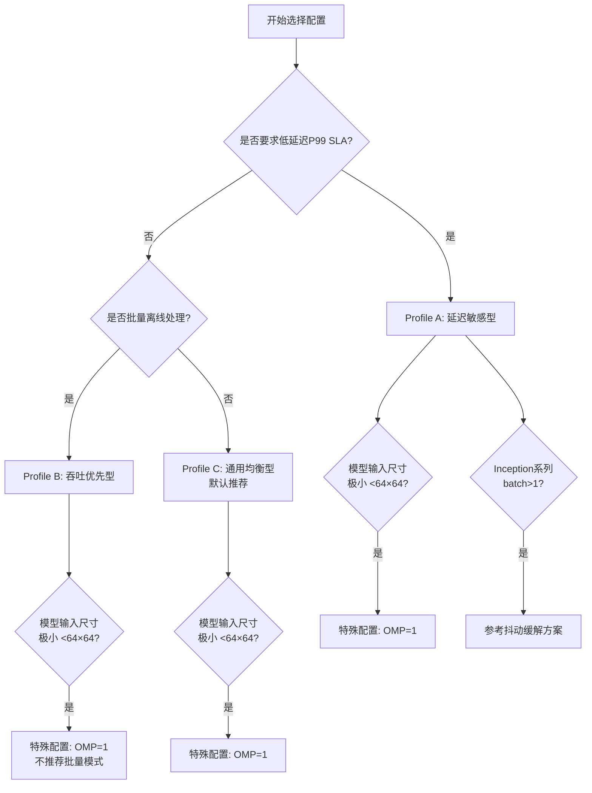

# caffe-ffi Conv v4 生产部署配置指南

## 概述
本指南基于Conv v4 OpenMP并行优化的实验数据，提供三种部署Profile的推荐配置，涵盖延迟敏感、吞吐优先和通用均衡三种典型生产场景。所有配置均经过实验验证，可直接复制使用。

## 快速决策树

使用以下决策树快速选择适合您场景的配置Profile：



**文字版决策流程：**
1. 是否要求低延迟P99 SLA？→ 是 → Profile A
2. 是否批量离线处理？→ 是 → Profile B
3. 通用/不确定？→ 是 → Profile C
4. 附加：模型输入尺寸极小(<64×64)？→ 特殊配置 OMP=1
5. 附加：Inception系列模型batch>1？→ 参考抖动缓解方案

## Profile A：延迟敏感型（实时推理）

**适用场景：** 人脸识别、实时检测、在线服务、P99延迟有严格SLA要求的场景

**配置命令块（可复制即用）：**
```bash
export OMP_NUM_THREADS=4
export OPENBLAS_NUM_THREADS=1
export OMP_WAIT_POLICY=PASSIVE
export KMP_DUPLICATE_LIB_OK=TRUE
export OMP_SCHEDULE=static
# 不要设置 OMP_PROC_BIND
# 不要设置 OMP_WAIT_POLICY=ACTIVE
```

**预期性能（基于ResNet-50/InceptionV1数据）：**
- batch=1
- 预期延迟(P50): 56-70ms
- 预期P99延迟: <1.5x P50
- CV%: <5%
- FPS: 14-18 FPS

**模型特定建议：**
- **ResNet系列**：直接使用上述配置
- **Inception系列batch=1**：上述配置可用，batch>1见抖动缓解章节
- **fgvsirfeature(120×120)**：先用上述配置压测，如加速比<1.1x考虑降为OMP=2
- **fgvsirfeature_ssd(32×32)**：不推荐多线程，使用OMP=1

## Profile B：吞吐优先型（批量处理）

**适用场景：** 离线特征提取、批量推理、数据预处理、无实时SLA要求的场景

**配置命令块：**
```bash
export OMP_NUM_THREADS=8
export OPENBLAS_NUM_THREADS=1
export OMP_WAIT_POLICY=ACTIVE
export KMP_DUPLICATE_LIB_OK=TRUE
export OMP_SCHEDULE=static
# 注意：吞吐模式使用ACTIVE等待策略减少线程唤醒延迟
# 但会占用更多CPU资源，确认CPU核心充足
```

**预期性能：**
- batch=8-16（根据显存/内存调整）
- 吞吐量相比Profile A提升1.5-2x
- CV%可能达到10-20%（延迟抖动较大）
- 不适合有P99 SLA的场景

**模型特定建议：**
- **ResNet-50/101大模型**：8线程+大batch效果好
- **InceptionV1**：需验证batch=16抖动，参考抖动缓解章节
- **小模型（<120×120）**：不推荐此Profile，OMP=4即可

## Profile C：通用均衡型（默认推荐）

**适用场景：** 不确定具体SLA、通用部署、开发/测试环境，适用于90%的场景

**配置命令块：**
```bash
export OMP_NUM_THREADS=4
export OPENBLAS_NUM_THREADS=1
export OMP_WAIT_POLICY=PASSIVE
export KMP_DUPLICATE_LIB_OK=TRUE
# 这是最安全的通用配置，适用于90%场景
```

## InceptionV1/GoogLeNet 大batch抖动缓解方案

**背景：** InceptionV1在batch=16时OMP=4下CV%可达41.2%，P99/P50延迟比达2.33x，存在显著尾延迟抖动问题。

**推荐缓解策略（按优先级排序）：**

1. **降低batch size到4-8**
   - 这是最直接有效的方案，减少batch size可显著降低调度竞争

2. **使用OMP_SCHEDULE=dynamic,1**
   - 动态调度，细粒度任务分配
   - 待bench_jitter_diagnose.py脚本验证效果

3. **增加warmup迭代次数到20-50次**
   - 预热阶段用不同数据touch所有内存路径
   - 避免首次访问导致的page fault和缓存冷启动

4. **如果以上无效，使用OMP=2或OMP=1**
   - 牺牲吞吐换稳定性
   - 在极端SLA要求场景下考虑

## 禁用项清单（绝对不要设置）

以下环境变量配置已被实验验证会导致性能退化或稳定性问题，请务必避免：

| 禁用项 | 原因 |
|--------|------|
| ❌ `OPENBLAS_NUM_THREADS>1` | 多线程BLAS在小GEMM场景导致3-11x性能退化 |
| ❌ `OMP_WAIT_POLICY=ACTIVE`（延迟敏感场景） | 自旋等待浪费CPU核心，影响同机其他服务 |
| ❌ `OMP_PROC_BIND=CLOSE/SPREAD` | 混合P-core/E-core架构上可能钉死线程在E-core导致负载不均 |
| ❌ `OMP_NUM_THREADS=16+`（batch=1场景） | Amdahl定律限制，串行部分占比高，加速<1.1x但线程开销大 |
| ❌ `OMP_SCHEDULE=runtime` | 依赖用户环境变量，行为不可预测 |
| ❌ `KMP_AFFINITY=compact/granularity=fine` | Intel OpenMP专属，兼容性问题，可能导致崩溃 |

## 模型并行收益速查表

| 模型 | 输入尺寸 | Conv层数 | OMP=1延迟 | OMP=4延迟 | 加速比 | OMP=4 CV% | 推荐线程 | 备注 |
|------|---------|---------|----------|----------|--------|----------|---------|------|
| ResNet-50 | 224×224 | 53 | ~90ms | ~70ms | 1.3x | ~3% | 4 | 标准配置 |
| InceptionV1 | 224×224 | 57 | ~72ms | ~56ms | 1.3x | ~3%(B=1) | 4 | B>1抖动注意 |
| ResNet-101 | 224×224 | 104 | ~440ms | ~334ms | ~1.3x | ~3% | 4 | 并行效率略高 |
| fgvsirfeature | 120×120 | ~64 | TBD | TBD | TBD | TBD | 2-4 | 待实际验证 |
| fgvsirfeature_ssd | 32×32 | ~20 | TBD | TBD | ≤1x | TBD | 1 | 不推荐并行 |

> **注意：** 标记TBD的项待全量测试后填入实际数据。ResNet-101为随机权重测试数据，真实模型性能待验证。

## 自适应线程数逻辑说明

Conv v4内置了自适应线程数机制，无需手动为每个层配置：

```
num_chunks = min(OMP_NUM_THREADS, M/32)
```

其中：
- `M` 是当前Conv层输出通道数
- 最小分块为32通道（保证OpenBLAS SGEMM效率）
- 小输出通道层（如第一层16通道）自动减少线程数，避免过度并行
- 这意味着不需要手动为每个层设置线程数，框架自动适配层大小选择最优并行度

**示例：**
- 第一层conv输出16通道：`M/32 = 0.5` → `num_chunks = 1`（单线程执行）
- 中间层输出256通道：`M/32 = 8` → `num_chunks = min(4, 8) = 4`（4线程执行）
- 大层输出512通道：`M/32 = 16` → `num_chunks = min(4, 16) = 4`（4线程执行）

## 容器部署建议

1. **环境变量设置位置**
   - 在Dockerfile或entrypoint.sh中设置环境变量
   - 不要在Python代码内通过`os.environ`设置（OpenMP在Python启动前已初始化）

   ```dockerfile
   # Dockerfile示例
   ENV OMP_NUM_THREADS=4
   ENV OPENBLAS_NUM_THREADS=1
   ENV OMP_WAIT_POLICY=PASSIVE
   ENV KMP_DUPLICATE_LIB_OK=TRUE
   ```

2. **CPU资源配置**
   - 确保容器有足够的CPU配额（至少4核）
   - 避免CPU限流（CPU quota < CPU set可能导致调度异常）
   - 推荐使用`--cpuset-cpus`绑定到物理核心（P-core），如可用

3. **cgroup兼容性**
   - 在cgroup v1/v2环境下测试稳定性
   - 注意Kubernetes的CPU limits可能导致节流，建议设置`CPU limits = CPU requests`
   - 避免使用`--cpu-quota`限制过严导致OpenMP线程调度异常

## 验证方法

使用以下Python代码片段验证配置是否生效，并快速评估性能：

```python
import os
import time
import numpy as np

# 验证环境变量
print("=== 环境变量验证 ===")
print(f"OMP_NUM_THREADS      = {os.environ.get('OMP_NUM_THREADS')}")
print(f"OPENBLAS_NUM_THREADS = {os.environ.get('OPENBLAS_NUM_THREADS')}")
print(f"OMP_WAIT_POLICY      = {os.environ.get('OMP_WAIT_POLICY')}")
print(f"KMP_DUPLICATE_LIB_OK = {os.environ.get('KMP_DUPLICATE_LIB_OK')}")
print()

# 性能测试函数（替换为实际模型推理代码）
def run_inference(n_warmup=20, n_iter=100):
    # TODO: 替换为实际模型初始化和推理
    # model = load_your_model()
    
    # Warmup
    for _ in range(n_warmup):
        _ = dummy_inference()  # model.forward(...)
    
    # Benchmark
    latencies = []
    for _ in range(n_iter):
        t0 = time.perf_counter()
        _ = dummy_inference()  # model.forward(...)
        t1 = time.perf_counter()
        latencies.append((t1 - t0) * 1000)  # ms
    
    latencies = np.array(latencies)
    p50 = np.percentile(latencies, 50)
    p99 = np.percentile(latencies, 99)
    cv = np.std(latencies) / np.mean(latencies) * 100
    fps = 1000.0 / np.mean(latencies)
    
    print("=== 性能指标 ===")
    print(f"P50 延迟: {p50:.2f} ms")
    print(f"P99 延迟: {p99:.2f} ms")
    print(f"P99/P50:  {p99/p50:.2f}x")
    print(f"CV%:      {cv:.2f}%")
    print(f"FPS:      {fps:.2f}")
    
    return p50, p99, cv, fps

def dummy_inference():
    # 占位：替换为实际推理
    time.sleep(0.07)
    return np.random.randn(1, 1000)

if __name__ == "__main__":
    run_inference()
```

**验证通过标准：**
- Profile A（延迟敏感）：CV% < 5%，P99/P50 < 1.5x
- Profile B（吞吐优先）：吞吐量达到预期，延迟抖动可接受
- OPENBLAS_NUM_THREADS必须为"1"，否则性能可能严重退化

## 常见问题FAQ

**Q: 为什么我的速度比预期慢很多？**
> A: 首先检查`OPENBLAS_NUM_THREADS`是否为1，这是最常见的问题。多线程BLAS在小GEMM场景会导致3-11x性能退化。其次检查CPU是否被限流（cgroup quota）。

**Q: 为什么延迟抖动很大（CV% > 10%）？**
> A: 可能原因：
> 1. 检查`OMP_WAIT_POLICY`是否在延迟场景误用了ACTIVE
> 2. 检查是否有CPU限流（CPU limits设置过低）
> 3. Inception系列大batch场景参考抖动缓解方案
> 4. 同机是否有其他高CPU负载服务竞争资源

**Q: 可以和MKL一起使用吗？**
> A: caffe-ffi默认使用OpenBLAS，不建议与MKL混用。MKL可能导致OpenMP运行时冲突（即使设置了KMP_DUPLICATE_LIB_OK）。如果必须使用MKL，请充分测试稳定性。

**Q: 物理核心只有4个怎么办？**
> A: `OMP_NUM_THREADS`不要超过物理核心数。4核机器使用OMP=4即可，不要设置超过物理核心数的线程（超线程对这类计算密集型任务收益有限）。

**Q: P-core/E-core混合架构（如Intel 12代+）有什么特殊注意事项？**
> A: 不要设置`OMP_PROC_BIND`，让OS自动调度通常是最优选择。OS会自动将计算密集型线程调度到P-core。如果发现性能异常，可尝试用`taskset`绑定进程到P-core。

**Q: 为什么第一层卷积总是单线程执行？**
> A: 这是自适应线程数机制的正常行为。第一层通常输出通道数少（如16或32），小于32的最小分块阈值，框架自动降级为单线程执行以避免线程开销超过收益。
