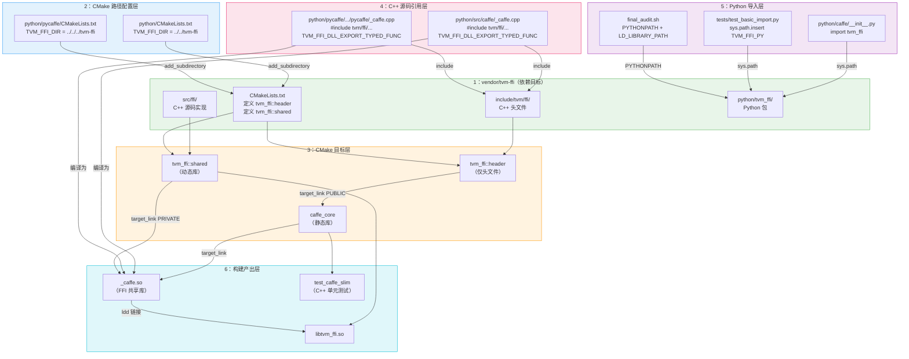

# tvm-ffi 在 Caffe 中的依赖关系图谱

> 项目根目录：`projects/xuanspace/vendor/caffe/`，tvm-ffi 位于 `../tvm-ffi`（即 `vendor/tvm-ffi/`）

## 依赖关系说明

| 层级 | 文件 | 引用方式 | 说明 |
|------|------|---------|------|
| **CMake 路径** | `python/CMakeLists.txt` | `add_subdirectory(../../tvm-ffi)` | 从 `python/` 向上两级到 `vendor/` 进入 tvm-ffi |
| **CMake 路径** | `python/pycaffe/CMakeLists.txt` | `add_subdirectory(../../../tvm-ffi)` | 从 `python/pycaffe/` 向上三级到 `vendor/` |
| **CMake 目标** | `python/CMakeLists.txt` | `tvm_ffi::header` (PUBLIC) | caffe_core 通过 target_link_libraries 引用 |
| **CMake 目标** | `python/CMakeLists.txt` | `tvm_ffi::shared` (PRIVATE) | _caffe 通过 target_link_libraries 引用 |
| **C++ 源码** | `python/src/caffe/_caffe.cpp` | `#include <tvm/ffi/...>` | 头文件路径由 CMake include dirs 控制 |
| **C++ 源码** | `python/pycaffe/.../pycaffe/_caffe.cpp` | `#include <tvm/ffi/...>` | 同上 |
| **Python** | `python/caffe/__init__.py` | `import tvm_ffi` | 依赖 sys.path 找到 tvm_ffi 包 |
| **Python** | `tests/test_basic_import.py` | sys.path 插入 TVM_FFI_PY | 硬编码路径指向 vendor/tvm-ffi/python |
| **Shell** | `final_audit.sh` | PYTHONPATH + LD_LIBRARY_PATH | 环境变量指向 vendor/tvm-ffi |
| **运行时** | `_caffe.so` | `ldd` → `libtvm_ffi.so` | 动态链接到 vendor/caffe/python/build/lib/ |

## 关键路径验证

- **CMake configure**：`python/CMakeLists.txt` → `../../tvm-ffi` → `vendor/tvm-ffi/CMakeLists.txt` ✅
- **编译产物**：`libtvm_ffi.so` + `libcaffe_core.a` + `_caffe.so` → 87/87 targets ✅
- **符号导出**：`nm -D _caffe.so | grep __tvm_ffi` → 10+ 符号（Blob_GetData, Net_Init, Net_Forward...）✅
- **动态链接**：`ldd _caffe.so | grep tvm` → `libtvm_ffi.so → vendor/caffe/python/build/lib/` ✅
- **C++ 测试**：`ctest` → 100% passed (1/1) ✅