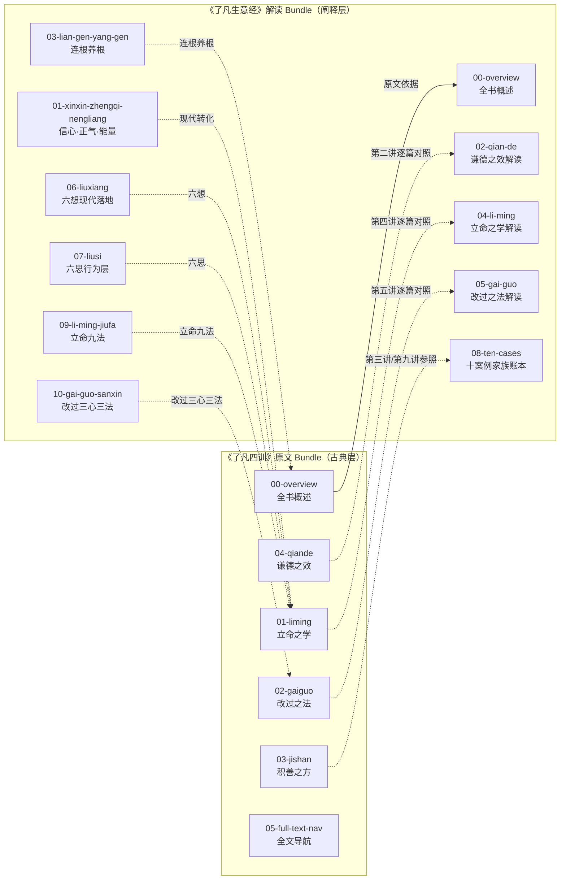

# I阶段架构洞察 — 《了凡生意经》原文+解读

> 本文件承载 R 阶段事实基础之上的核心洞察，每条含陈述/证据/反常识/行动四元组（G2）。

---

## 洞察 1：三教融合的命运观——儒释道合一的方法论创新

| 元组 | 内容 |
|------|------|
| **陈述** | 《了凡四训》打破"宿命论"与"自由意志"的二元对立，以佛教因果为框架、儒家伦理为内容、道教承负观念为仪式，形成一套"可操作的可改变命运方法论"。 |
| **证据** | F-030（儒释道三教并存）；F-009（云谷禅师"极善之人数固拘他不定"）；F-018（积善十纲，儒家伦理条目）；F-023（序为彭绍升撰、传为憨山大师作） |
| **反常识** | 一般人认为《了凡四训》是"善书"或"劝善手册"，实则它是东亚史上最成功的"个人发展方法论"文本，其影响力远超宗教范畴，被近代中国企业家、教育家反复引用。 |
| **行动** | 阅读时区分三教来源：佛教因果（立命之学的核心逻辑）/ 儒家伦理（积善十纲的具体条目）/ 道教仪式（惜字放生的实践形式），避免将单一教义强加于全文。 |

---

## 洞察 2：从"命定"到"立命"的认知跃迁机制

| 元组 | 内容 |
|------|------|
| **陈述** | 《了凡四训》的核心叙事弧线是：承认命定 → 怀疑命定 → 找到改变之道 → 验证改变。这不是简单的"努力就能成功"，而是建立在一套严密的自我观察方法（功过格）之上。 |
| **证据** | F-005（了凡童年丧父、遇孔先生算定命数）；F-008-F-009（遇云谷禅师，接受"命由我作"教诲）；F-011（反思六条无子之相）；F-026（后生一子、69岁著书验证） |
| **反常识** | "命由我作"不等于"人为万能"——了凡仍然需要行善、改过、发愿等具体方法论，而非单纯靠意志力强求。现代成功学常将其简化为"正能量思维"，这是对原文的严重误读。 |
| **行动** | 在《了凡生意经》第五讲"改过之法"中，应将"事上改/理上改/心上改"三法层次理解，心上改为最（改变念头源头），而非仅停留在行为层面（事上改）的表面约束。 |

---

## 洞察 3：解读书籍的三层文本必须严格分层——否则误读必生

| 元组 | 内容 |
|------|------|
| **陈述** | 《了凡生意经》包含三层文本：古典层（袁了凡《了凡四训》原文）、经典层（原文引用的更早经典）、阐释层（智然现代解读）。三者不可混为一谈，否则会产生"智然说了这是原文意思"或"原文有这个现代解读"的混淆。 |
| **证据** | F-010（《尚书》《诗经》引文，属经典层）；F-012（六祖语，属经典层中的佛教引用）；F-035-F-039（智然五讲核心观点，属阐释层）；F-040-F-050（智然对"六想""六思""十案例"等的阐释，属阐释层） |
| **反常识** | 许多读者会自然地将"了凡说"和"智然说"混为一谈，误以为《了凡生意经》中的现代解读是《了凡四训》原文的观点。必须严格标注"智然老师阐释"层，不伪装为古文原意。 |
| **行动** | 每个概念文档中，古典层原文直接引用并注明"《了凡四训·XX篇》原文"，经典层引用注明出处（如《周易·谦卦》），阐释层标注"智然老师阐释"；不得将阐释层内容标注为原文内容。 |

---

## 洞察 4：企业经营语境下的传统经典——知识迁移的核心价值

| 元组 | 内容 |
|------|------|
| **陈述** | 智然《了凡生意经》将《了凡四训》从个人修身文本转化为企业经营方法论，这是国学经典现代转化的典型案例：以"连根养根"对应企业文化根基建设、以"谦德之效"对应组织管理智慧、以"立命九法"对应企业家自我修炼框架。 |
| **证据** | F-035（企业经营核心是信心、正气、能量；利他是高能量念头）；F-037（连根养根：孝亲敬祖是企业生命力根基）；F-043（利他即利己，企业文化建设根基）；F-046（员工成长、客户价值、社会责任三重维度） |
| **反常识** | 传统善书被用于企业经营，不是"附会"而是"迁移"——《了凡四训》本身就有强烈的实践取向（了凡本人就是官员、实行家善），其"功过格"方法正是个人层面的企业管理工具。 |
| **行动** | 在知识包构建中，《了凡生意经》解读 Bundle 应显式标注每个观点的"原文定位"（出自《了凡四训》哪篇哪段），以便读者在需要时回查原文，同时理解现代转化的逻辑链条。 |

---

## 知识地图

**学习路径建议：**
- **入门轨**：O1 → O2 → E1 → E5 → E6（先读原文立命之学，再读对应解读）
- **实践轨**：E10（立命九法）→ E11（改过三心三法）→ O2/O3（回查原文验证）
- **研读轨**：O1→O2→O3→O4→O5（通读原文四篇）→ 对照 E5/E6/E3/E4（每篇对应解读）
