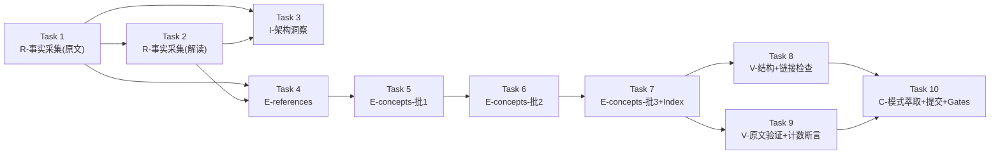

# Tasks — 《了凡生意经》原文+解读 → OKF Wiki 知识包

> 本文件承载实施任务队列，每条任务含状态、优先级、依赖关系、验收标准与测试要求。
> 生成时间：2026-09-08T12:00:00+08:00
> 格式规范：TRAE-spec-mode artifact-template（v1.2.0+）

---

## 任务队列

### Task 1：R 阶段 — 事实采集（原文层）

| 字段 | 值 |
|------|------|
| **Status** | in_progress |
| **Priority** | high |
| **Depends On** | 无 |
| **Acceptance Criteria Addressed** | spec.md AC-1（事实采集） |
| **Test Requirements** | facts.md 原文事实 ≥30 条；每条无因果推断词；每条指向具体信源 URL 或段落编号 |

**工作内容：**
- 从至少 2 个权威信源（维基文库、ctext.org、佛弟子文汇、中华书库）采集《了凡四训》四篇原文事实
- 在 `facts.md` 中登记 F-001 ~ F-050+ 事实条目
- 三层文本分层定义表（古典层/经典层/阐释层）写入 facts.md 顶部

**验收标准：**
- [ ] 原文事实 ≥30 条，无因果推断词（"因为"/"导致"/"所以"等）
- [ ] 每条事实指向具体信源 URL 或段落编号
- [ ] 三层分层定义表已写入 facts.md

---

### Task 2：R 阶段 — 事实采集（解读层）

| 字段 | 值 |
|------|------|
| **Status** | in_progress |
| **Priority** | high |
| **Depends On** | 无 |
| **Acceptance Criteria Addressed** | spec.md AC-1（事实采集） |
| **Test Requirements** | 解读事实 ≥20 条；每条明确标注"智然阐释"层，不与原文层混淆 |

**工作内容：**
- 从智然《了凡生意经》课堂实录（喜马拉雅、当当网等公开来源）采集解读事实
- 在 `facts.md` 中登记 F-035 ~ F-050+ 解读事实条目
- 明确标注每条为"智然老师阐释"层，不伪装为古文原意
- 《周易》《尚书》等经典层引用单独登记为 R1–R10

**验收标准：**
- [ ] 解读事实 ≥20 条
- [ ] 每条明确标注"智然阐释"层
- [ ] 经典层引用（R1–R10）已单独登记

---

### Task 3：I 阶段 — 架构洞察

| 字段 | 值 |
|------|------|
| **Status** | in_progress |
| **Priority** | high |
| **Depends On** | Task 1, Task 2 |
| **Acceptance Criteria Addressed** | spec.md AC-2（架构洞察） |
| **Test Requirements** | insights.md ≥3 条洞察，每条含四元组（陈述/证据/反常识/行动）；知识地图含两个子 bundle 导航关系 |

**工作内容：**
- 在 `insights.md` 中输出 ≥3 条核心洞察，每条含四元组结构
- 知识地图以 Mermaid flowchart 呈现，标明 `yuan-liaofan-sijun` ↔ `liaofan-shengyi-jing` 两个子 bundle 间的导航关系
- 每个概念文档明确标注覆盖哪些 F-xxx 事实编号

**验收标准：**
- [ ] insights.md ≥3 条洞察，每条含四元组（陈述/证据/反常识/行动）
- [ ] 知识地图包含两个子 bundle 之间的导航关系
- [ ] 每个概念文档标注覆盖的 F-xxx 事实编号

---

### Task 4：E 阶段 — references/ 生成（信源先行）

| 字段 | 值 |
|------|------|
| **Status** | pending |
| **Priority** | high |
| **Depends On** | Task 1, Task 2 |
| **Acceptance Criteria Addressed** | spec.md AC-3（Bundle 结构）、AC-4（引用规范） |
| **Test Requirements** | references/ 先于 concepts/ 生成；每个 reference 文档 frontmatter 含 type/title/description/sources |

**工作内容：**
- 在 `references/` 目录下生成信源索引文档（按信源类型分组：古籍原文/现代解读/权威底本）
- 每个 reference 文档 frontmatter 含 `type` / `title` / `description` / `sources` 字段
- references/ 目录必须先于 concepts/ 完成生成（信源先行原则）

**验收标准：**
- [ ] references/ 先于 concepts/ 生成
- [ ] 每个 reference 文档 frontmatter 含完整字段

---

### Task 5：E 阶段 — concepts/ 生成（第 1 批）

| 字段 | 值 |
|------|------|
| **Status** | pending |
| **Priority** | high |
| **Depends On** | Task 4 |
| **Acceptance Criteria Addressed** | spec.md AC-3（Bundle 结构）、AC-4（引用规范） |
| **Test Requirements** | 本批 ≤7 个文件；每个概念文档 frontmatter 含 type/title/description/tags/generated/verified/status/stale_after/sources |

**工作内容：**
- 生成《了凡四训》原文 Bundle（`yuan-liaofan-sijun/concepts/`）的概念文档
- 第 1 批：00-overview、01-liming、02-gaiguo、03-jishan、04-qiande（共 5 个）
- 每个概念文档 frontmatter 含完整字段，正文标注引用来源

**验收标准：**
- [ ] 本批 ≤7 个文件
- [ ] 每个概念文档 frontmatter 含全部必需字段
- [ ] 根 index.md 含 `okf_version: "0.2"` 与 toctree 块

---

### Task 6：E 阶段 — concepts/ 生成（第 2 批）

| 字段 | 值 |
|------|------|
| **Status** | pending |
| **Priority** | medium |
| **Depends On** | Task 5 |
| **Acceptance Criteria Addressed** | spec.md AC-3（Bundle 结构）、AC-5（概念粒度） |
| **Test Requirements** | 本批 ≤7 个文件；每个概念文档明确标注覆盖哪些 F-xxx 事实编号 |

**工作内容：**
- 生成《了凡生意经》解读 Bundle（`liaofan-shengyi-jing/concepts/`）的概念文档
- 第 2 批：00-overview、01-xinxin-zhengqi-nengliang、02-qian-de、03-lian-gen-yang-gen、04-li-ming、05-gai-guo（共 6 个）
- 每个概念文档明确标注覆盖哪些 F-xxx 事实编号

**验收标准：**
- [ ] 本批 ≤7 个文件
- [ ] 每个概念文档标注覆盖的 F-xxx 事实编号

---

### Task 7：E 阶段 — concepts/ 生成（第 3 批）+ Index 更新

| 字段 | 值 |
|------|------|
| **Status** | pending |
| **Priority** | medium |
| **Depends On** | Task 6 |
| **Acceptance Criteria Addressed** | spec.md AC-3（Bundle 结构） |
| **Test Requirements** | 本批 ≤7 个文件；所有子目录 index.md 含 toctree 块，不含 frontmatter；根 index.md 最后写 |

**工作内容：**
- 生成《了凡生意经》解读 Bundle 剩余概念文档：06-liuxiang、07-liusi、08-ten-cases、09-li-ming-jiufa、10-gai-guo-sanxin、05-full-text-nav（共 6 个）
- 更新两个子 Bundle 的根 index.md（`okf_version: "0.2"` + toctree）
- 更新两个子目录的 index.md（toctree 块，无 frontmatter）
- 更新 `docs/bundles/index.md` 导航

**验收标准：**
- [ ] 本批 ≤7 个文件
- [ ] 所有子目录 index.md 含 toctree 块，不含 frontmatter
- [ ] 根 index.md 最后写（不边写边更新）
- [ ] 交叉链接使用 `/` 开头的 bundle-relative 路径（非 `../`）

---

### Task 8：V 阶段 — 结构检查 + 链接检查

| 字段 | 值 |
|------|------|
| **Status** | pending |
| **Priority** | high |
| **Depends On** | Task 7 |
| **Acceptance Criteria Addressed** | spec.md AC-6（质量门禁） |
| **Test Requirements** | `check-links.py --path .trae/specs/classics-knowledge/liaofan-shengyi-jing-okf-wiki/` rc=0，无断链；所有 index.md toctree 验证通过 |

**工作内容：**
- 运行结构检查：所有 index.md 含 toctree，子目录 index 无 frontmatter
- 运行链接检查：`python .agents/scripts/check-links.py --path .trae/specs/liaofan-shengyi-jing-okf-wiki/`
- 修复所有发现断链

**验收标准：**
- [ ] 结构检查通过：所有 index.md 含 toctree，子目录 index 无 frontmatter
- [ ] 链接检查通过：rc=0，无断链

---

### Task 9：V 阶段 — 原文段落验证 + 计数断言

| 字段 | 值 |
|------|------|
| **Status** | pending |
| **Priority** | high |
| **Depends On** | Task 7 |
| **Acceptance Criteria Addressed** | spec.md AC-6（质量门禁） |
| **Test Requirements** | 在权威信源中 Grep 验证《了凡四训》引用段落存在性；所有"X个/Y处/Z条"类陈述经独立计数比对一致；三层分层验证清晰无混淆；两 bundle 交叉引用双向正确 |

**工作内容：**
- 原文段落 Grep 验证：在 ctect.org/维基文库 等权威信源中验证 F-xxx 事实引用的段落存在性
- 计数断言验证：核对所有"X篇"/"Y条"/"Z个"类陈述与 facts.md 实际条目数一致
- 三层分层验证：任意概念文档中古典/经典/阐释三层标记清晰，无混淆
- 两 bundle 交叉引用验证：`yuan-liaofan-sijun` ↔ `liaofan-shengyi-jing` 引用双向正确

**验收标准：**
- [ ] 原文段落 Grep 验证通过
- [ ] 计数断言验证通过
- [ ] 三层分层验证通过
- [ ] 两 bundle 交叉引用验证通过

---

### Task 10：C 阶段 — 模式萃取 + 原子提交 + Gates 通过

| 字段 | 值 |
|------|------|
| **Status** | pending |
| **Priority** | high |
| **Depends On** | Task 8, Task 9 |
| **Acceptance Criteria Addressed** | spec.md AC-7（交付） |
| **Test Requirements** | 可复用模式 ≥2 个，每个含触发场景/核心步骤/反模式（≥5）/迁移示例；模式存入 `docs/retrospective/patterns/`；`invoke gates.all` 全部通过；`invoke gates.bundles` 计数对账一致 |

**工作内容：**
- 萃取 ≥2 个可复用模式，存入 `docs/retrospective/patterns/` 对应目录
- 每个模式含：触发场景 / 核心步骤 / 反模式（≥5 条）/ 迁移示例
- 原子提交到 `projects/awesome-okf-xs` 子模块，commit 信息符合 Conventional Commits（中文主体）
- 运行 `invoke gates.all`，全部通过
- 运行 `invoke gates.bundles`，计数对账一致

**验收标准：**
- [ ] 可复用模式 ≥2 个，每个含触发场景/核心步骤/反模式（≥5）/迁移示例
- [ ] 模式存入 `docs/retrospective/patterns/` 对应目录
- [ ] 原子提交到 `projects/awesome-okf-xs`，commit 符合 Conventional Commits
- [ ] `invoke gates.all` 全部通过
- [ ] `invoke gates.bundles` 计数对账一致

---

## 任务依赖图

---

## 废弃文件记录

| 文件 | 废弃原因 | 迁移目标 |
|------|---------|---------|
| `checklist.md` | 旧式 G0-G5 分阶段 checkbox 格式，与 TRAE-spec-mode 产物规范不符；内容已映射至本文件的 Task 1–10 及其 Test Requirements | 各 Task 的 Test Requirements 段 |

> checklist.md 于 2026-09-08 废弃，其覆盖的检查点已转化为各 Task 的验收字段，不再单独维护。
