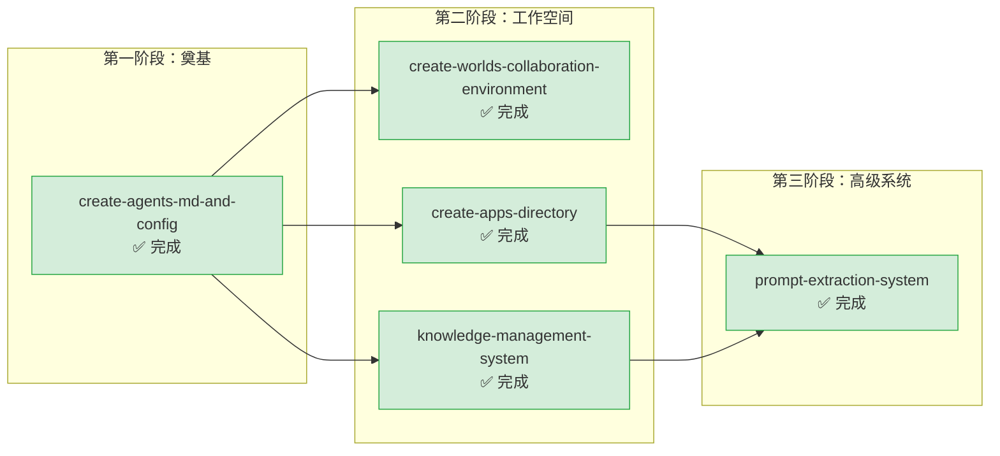

# core-foundation — 核心体系基础

本主题包含项目核心基础设施、系统架构、核心功能模块的创建与配置类规格文档。所有从零构建的基础性目录结构、核心系统、管理体系均归入此主题。

**主题状态**：✅ 全部完成（6/6）
**上级看板**：[返回全局执行看板](../README.md)
**任务模板**：[core-foundation-task-template.md](../../../.agents/templates/theme-templates/core-foundation-task-template.md)

---

## 📊 主题执行看板

| Spec 名称 | 状态 | 完成度 | 交付物 | 简述 |
|---|---|---|---|---|
| [create-agents-md-and-config](create-agents-md-and-config/) | ✅ 完成 | 100% | [AGENTS.md](../../../AGENTS.md), [.agents/](../../../.agents/) | 智能体开发规范体系创建：AGENTS.md 全局契约 + .agents/ 目录骨架 + 角色/提示词/工具/协议/工作流/模板全套资产 |
| [create-worlds-collaboration-environment](create-worlds-collaboration-environment/) | ✅ 完成 | 100% | [.agents/worlds/](../../../.agents/worlds/) | worlds/ 协作与环境管理子目录创建，支持团队协作执行环境管理 |
| [create-apps-directory](create-apps-directory/) | ✅ 完成 | 100% | [apps/](../../../apps/) | apps/ 新应用开发工作空间创建，配合 .temp/ → apps/ 迁移工作流 |
| [knowledge-management-system](knowledge-management-system/) | ✅ 完成 | 100% | [docs/knowledge/](../../../.agents/docs/knowledge/) | 项目知识管理系统创建，包含技术知识库、架构决策记录、最佳实践 |
| [prompt-extraction-system](prompt-extraction-system/) | ✅ 完成 | 100% | [prompt_extraction/](../../../prompt_extraction/), [.agents/systems/prompt-extraction.md](../../../.agents/systems/prompt-extraction.md) | 提示词萃取全流程自动化系统，支持从对话中提取可复用提示词模式 |
| [create-first-principles-exercises](create-first-principles-exercises/) | ✅ 完成 | 100% | [12-exercises.md](../../../.agents/docs/knowledge/learning/first-principles/12-exercises.md) | 第一性原理思维训练题库：基于六步方法论框架设计分层级练习题、误区识别、综合案例分析，帮助读者刻意练习 |

---

## 🔀 主题内执行路线图



### 执行顺序说明

1. **create-agents-md-and-config**（最先执行）：这是整个项目的基础，所有其他 spec 都依赖 AGENTS.md 和 .agents/ 目录结构
2. **create-worlds-collaboration-environment、create-apps-directory、knowledge-management-system**（可并行）：在核心契约建立后，这三个工作空间系统可以并行创建
3. **prompt-extraction-system**（最后执行）：依赖知识管理系统提供分类存储，依赖 apps 目录提供运行环境

---

## ⚠️ 遗留问题与跟进事项

本主题所有 spec 已 100% 完成，无待办事项。

---

## 📐 主题边界与判定规则

### 归入本主题的条件
- 从零开始创建新的目录结构或系统架构
- 涉及项目核心配置文件的初始化（如 AGENTS.md、README.md 骨架等）
- 建立新的子系统（如知识管理、提示词萃取等）
- 创建新的工作空间目录（如 apps/、worlds/ 等）

### 不归入本主题的情况
- 对已有角色定义的扩展或修改 → 归入 `roles-governance/`
- 编写检查工具或规范标准 → 归入 `standards-tools/`
- 修改 README.md 内容而非骨架 → 归入 `readme-branding/`
- 对已有文档进行结构性重组 → 归入 `docs-restructure/`
- 对已完成工作的复盘分析 → 归入 `retrospectives-insights/`
- 外部项目内容迁移 → 归入 `migration-archival/`

---

## 🆕 新增 Spec 指南

### 命名规范
- 使用 kebab-case，动词开头
- 常用前缀：`create-`（创建新系统/目录）、`initialize-`（初始化配置）、`setup-`（环境搭建）、`establish-`（体系建立）
- 示例：`create-ci-cd-pipeline`、`initialize-plugin-system`、`setup-testing-framework`

### tasks.md 必备检查项

```markdown
- [ ] Task 0: 前置依赖验证
  - [ ] SubTask 0.1: 确认所有前置 spec 已 100% 完成（检查对应 tasks.md 复选框）
  - [ ] SubTask 0.2: 确认项目根目录结构符合预期
  - [ ] SubTask 0.3: 创建目标目录结构（遵循现有目录风格）

- [ ] Task 1: 核心骨架创建
  - [ ] SubTask 1.1: 创建核心配置文件/入口文件
  - [ ] SubTask 1.2: 编写基础骨架内容（参照现有类似文件风格）
  - [ ] SubTask 1.3: 在上级索引中登记（如 AGENTS.md、README.md 等）

- [ ] Task 2: 内容实现
  - [ ] SubTask 2.1: 实现核心功能/内容
  - [ ] SubTask 2.2: 创建子目录结构（如需要）
  - [ ] SubTask 2.3: 编写各子模块内容

- [ ] Task 3: 验证与集成
  - [ ] SubTask 3.1: 更新所有引用路径（检查跨文件引用是否正确）
  - [ ] SubTask 3.2: 运行相关检查脚本（如 check-spec-consistency）
  - [ ] SubTask 3.3: 验证交付物完整存在
  - [ ] SubTask 3.4: 在本主题 README.md 中登记完成状态
```

### checklist.md 必备检查项
- 目录结构符合项目约定（参照 .agents/ 或 docs/ 现有风格）
- 所有相对路径引用正确（特别是跨主题引用需增加 `../` 层级）
- 核心配置文件包含必要的 frontmatter 或元数据
- 索引文件（README.md）已更新包含新内容
- 代码/文档风格与项目现有风格一致
- 无临时文件或中间产物遗留

---

## 📁 目录结构

```
core-foundation/
├── README.md                                   # 本文件（主题执行看板）
├── create-agents-md-and-config/
│   ├── spec.md
│   ├── tasks.md
│   └── checklist.md
├── create-apps-directory/
│   ├── spec.md
│   ├── tasks.md
│   └── checklist.md
├── create-worlds-collaboration-environment/
│   ├── spec.md
│   ├── tasks.md
│   └── checklist.md
├── knowledge-management-system/
│   ├── spec.md
│   ├── tasks.md
│   └── checklist.md
├── prompt-extraction-system/
│   ├── spec.md
│   ├── tasks.md
│   └── checklist.md
└── create-first-principles-exercises/
    ├── spec.md
    ├── tasks.md
    └── checklist.md
```
