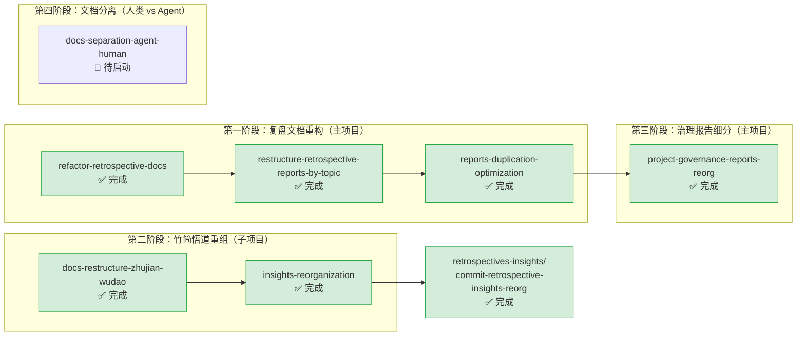

# docs-restructure — 文档体系重组

本主题包含对已有文档进行原子化拆分、主题分类、目录重构、重复消除、命名统一等结构性整理的规格文档。纯文档结构调整（不改变实质内容）均归入此主题。

**主题状态**：🔧 进行中（6/7 完成，1 项待启动）
**上级看板**：[返回全局执行看板](../README.md)
**任务模板**：[docs-restructure-task-template.md](../../../.agents/templates/theme-templates/docs-restructure-task-template.md)

---

## 📊 主题执行看板

| Spec 名称 | 状态 | 完成度 | 交付物 | 简述 |
|---|---|---|---|---|
| [refactor-retrospective-docs](refactor-retrospective-docs/) | ✅ 完成 | 100% | [docs/retrospective/](../../../.agents/docs/retrospective/) | 复盘文档体系原子化重构：从单个 knowledge-extraction.md 拆分为 18 个模块化文件 |
| [restructure-retrospective-reports-by-topic](restructure-retrospective-reports-by-topic/) | ✅ 完成 | 100% | [docs/retrospective/](../../../.agents/docs/retrospective/) | 复盘报告目录按 5 大主题分类重构 |
| [reports-duplication-optimization](reports-duplication-optimization/) | ✅ 完成 | 100% | [docs/retrospective/](../../../.agents/docs/retrospective/) | 复盘报告体系重复内容优化，移除冗余引用块 |
| [docs-restructure-zhujian-wudao](docs-restructure-zhujian-wudao/) | ✅ 完成 | 100% | [apps/zhujian-wudao/.agents/docs/](../../../apps/zhujian-wudao/.agents/docs/) | 竹简悟道项目文档结构重组，划分为 4 个主题目录（product/insights/reviews/knowledge-transfer） |
| [insights-reorganization](insights-reorganization/) | ✅ 完成 | 100% | [apps/zhujian-wudao/.agents/docs/insights/](../../../apps/zhujian-wudao/.agents/docs/insights/) | 竹简悟道洞察库重组：拆分为3个均衡文件（01-30/31-53/54-68），统一标准结构，修复标题层级 |
| [project-governance-reports-reorg](project-governance-reports-reorg/) | ✅ 完成 | 100% | [docs/retrospective/reports/project-governance/](../../../.agents/docs/retrospective/reports/project-governance/) | project-governance 复盘报告系统性重组：19份报告按5个二级主题分类迁移，修复85处断链 |
| [docs-separation-agent-human](docs-separation-agent-human/) | 🔧 待启动 | 0% | [docs/](../../../docs/) | 基于第一性原理和七概念方法论，将 .agents/docs/ 中人类文档逐步迁移到根目录 docs/，减少 agent 识别压力 |

---

## 🔀 主题内执行路线图



### 执行顺序说明

1. **refactor-retrospective-docs**（✅ 已完成）：原子化拆分是后续分类和去重的基础
2. **restructure-retrospective-reports-by-topic**（✅ 已完成）：拆分后按主题分类组织
3. **reports-duplication-optimization**（✅ 已完成）：分类后识别并消除重复内容
4. **docs-restructure-zhujian-wudao**（✅ 已完成）：竹简悟道子项目的文档结构重组，与主项目独立
5. **insights-reorganization**（✅ 已完成）：依赖竹简悟道结构重组完成后进行洞察库整理，完成后触发复盘原子提交
6. **project-governance-reports-reorg**（✅ 已完成）：依赖第一阶段顶层分类完成后，对 project-governance 主题下的19份报告进行二级细分主题分类

---

## ✅ 完成状态

### 🎉 所有 6 个 Spec 已全部执行完毕

| Spec | 完成日期 | 核心交付物 |
|---|---|---|
| refactor-retrospective-docs | 2026-06-26 | 从单个 knowledge-extraction.md 拆分为 18 个模块化原子文件 |
| restructure-retrospective-reports-by-topic | 2026-06-26 | 复盘报告目录按 5 大主题分类重构 |
| reports-duplication-optimization | 2026-06-26 | 复盘报告体系重复内容优化，移除冗余引用块 |
| docs-restructure-zhujian-wudao | 2026-06-26 | 竹简悟道文档重组为 4 主题目录，迁移7个文件，更新48处引用 |
| insights-reorganization | 2026-06-26 | 洞察库拆分为3个均衡文件（01-30/31-53/54-68），共68条洞察 |
| project-governance-reports-reorg | 2026-06-26 | project-governance 19份报告二级细分5主题，修复85处断链 |

**执行结果**：所有任务均按计划完成，链接验证通过，无遗留问题。

---

## 📐 主题边界与判定规则

### 归入本主题的条件
- 对已有文档进行拆分、合并、重命名、移动位置
- 调整文档目录结构（新建分类目录、调整层级）
- 消除文档间的重复内容（不改变语义，只去重）
- 统一文档命名规范、标题层级、格式风格
- 修复死链、更新过期引用路径

### 不归入本主题的情况
- 创建全新的文档或内容 → 归入对应功能主题（如 core-foundation、roles-governance 等）
- 编写新的规范标准或工具 → 归入 `standards-tools/`
- 对重组过程进行复盘分析 → 归入 `retrospectives-insights/`
- 从外部项目迁移内容 → 归入 `migration-archival/`
- 修改 README.md 内容 → 归入 `readme-branding/`

---

## 🆕 新增 Spec 指南

### 命名规范
- 使用 kebab-case，动词开头
- 常用前缀：`refactor-`（重构）、`restructure-`（结构重组）、`reorganize-`（重新组织）、`optimize-`（优化）、`rename-`（重命名）、`fix-`（修复链接/路径）
- 示例：`refactor-knowledge-base-by-topic`、`reorganize-agent-prompts`、`fix-broken-links-in-docs`

### tasks.md 必备检查项

```markdown
- [ ] Task 0: 现状调研与方案设计
  - [ ] SubTask 0.1: 盘点当前文档目录结构，列出所有待整理文件清单
  - [ ] SubTask 0.2: 分析当前问题（重复、混乱、命名不一致等）
  - [ ] SubTask 0.3: 设计目标目录结构和分类方案
  - [ ] SubTask 0.4: 识别所有受影响的文件引用（哪些文件引用了被移动/重命名的文件）
  - [ ] SubTask 0.5: 制定原子化拆分方案（如涉及大文件拆分）

- [ ] Task 1: 执行重组（原子提交）
  - [ ] SubTask 1.1: 创建新目录结构
  - [ ] SubTask 1.2: 按计划移动/拆分/重命名文件（每次移动一个逻辑单元）
  - [ ] SubTask 1.3: 每次移动后立即更新所有引用路径（不要攒到最后）
  - [ ] SubTask 1.4: 消除重复内容（如有）
  - [ ] SubTask 1.5: 统一文件命名和标题格式

- [ ] Task 2: 验证与修复
  - [ ] SubTask 2.1: 运行 check-links.py 验证无死链
  - [ ] SubTask 2.2: 运行 check-move.py 验证文件迁移完整性
  - [ ] SubTask 2.3: 检查所有文档的相对路径引用正确（特别注意深度变化）
  - [ ] SubTask 2.4: 验证目录索引文件（README.md）已更新

- [ ] Task 3: 收尾
  - [ ] SubTask 3.1: 更新上级索引文档（如 AGENTS.md、.agents/docs/README.md 等）
  - [ ] SubTask 3.2: 清理空目录和临时文件
  - [ ] SubTask 3.3: 在本主题 README.md 中登记完成状态
  - [ ] SubTask 3.4: 原子提交（遵循 atomic-commit 规范）
```

### checklist.md 必备检查项
- 重组过程不丢失任何文件内容（文件总数核对）
- 所有相对路径引用已更新（跨目录移动注意 `../` 层级变化）
- 无死链（运行 check-links.py 验证）
- 文件命名符合 kebab-case 规范（运行命名检查脚本）
- 文档标题层级正确（不跳级）
- 无重复内容（重复内容已合并或移除）
- 空目录已清理
- 原子提交：每次提交一个独立的重组变更（如"拆分XX文件"、"移动XX到XX目录"）
- 重组后目录结构与设计方案一致

---

## 📁 目录结构

```
docs-restructure/
├── README.md                                   # 本文件（主题执行看板）
├── docs-restructure-zhujian-wudao/
│   ├── spec.md
│   ├── tasks.md
│   └── checklist.md
├── insights-reorganization/
│   ├── spec.md
│   ├── tasks.md
│   └── checklist.md
├── project-governance-reports-reorg/
│   ├── spec.md
│   ├── tasks.md
│   └── checklist.md
├── refactor-retrospective-docs/
│   ├── spec.md
│   ├── tasks.md
│   └── checklist.md
├── reports-duplication-optimization/
│   ├── spec.md
│   ├── tasks.md
│   └── checklist.md
└── restructure-retrospective-reports-by-topic/
    ├── spec.md
    ├── tasks.md
    └── checklist.md
```
