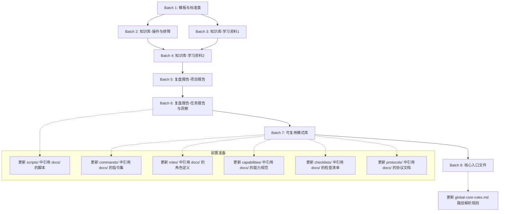

# 文档分离迁移计划

## 一、现状统计

### 1.1 文件总数

`.agents/docs/` 目录下共有 **2674** 个 `.md` 文件（不含 `.gitkeep`）。

### 1.2 按目录分组统计

| 文件数 | 目录路径 |
|---|---|
| 105 | retrospective/patterns/methodology-patterns/governance-strategy |
| 61 | retrospective/patterns/code-patterns |
| 54 | retrospective/patterns/methodology-patterns/ai-collaboration |
| 48 | retrospective/patterns/methodology-patterns/document-architecture |
| 45 | retrospective/patterns/methodology-patterns/tools-automation |
| 43 | retrospective/patterns/methodology-patterns/product-growth |
| 35 | retrospective/patterns/methodology-patterns/retrospective-knowledge |
| 35 | retrospective/patterns/architecture-patterns |
| 30 | retrospective/patterns/methodology-patterns/research-knowledge |
| 18 | knowledge/best-practices |
| 18 | knowledge/learning/04-docs-markup-tooling/myst-markdown-tutorial |
| 18 | knowledge/learning/07-vendor-product-learning/openai/chatgpt-codex-wiki |
| 17 | knowledge/learning/first-principles |
| 17 | knowledge/learning/01-agent-protocols-interfaces/tvm-ffi-wiki |
| 17 | knowledge/learning/03-agent-platforms-tools |
| 16 | knowledge/learning/04-docs-markup-tooling/weasyprint-wiki |
| 16 | knowledge/learning/02-agent-engineering-methodology/seven-concepts-prompt-wiki |
| 16 | (docs根目录) |
| 15 | knowledge/learning/02-agent-engineering-methodology/adversarial-review-wiki |
| 15 | knowledge/learning/02-agent-engineering-methodology/harness-seven-components-wiki |
| 15 | knowledge/learning/07-vendor-product-learning/sunlogin |
| 14 | knowledge/myst-unified-ecosystem |
| 13 | knowledge/operations |
| 13 | knowledge/learning/first-principles/chinese-philosophy-parallels |
| 12 | knowledge/learning/02-agent-engineering-methodology |
| 12 | knowledge/learning/07-vendor-product-learning/volcengine |
| 11 | knowledge/learning/first-principles/exercises |
| 11 | retrospective/templates |
| 10 | knowledge/tags |
| 10 | knowledge/learning/06-business-trends-analysis/papi-jiang-solo-ip-trend-wiki |
| ... | ...（共约300个目录） |

## 二、Agent必留文件清单

以下文件被 `context-routing.md`、`AGENTS.md`、`global-core-rules.md` 直接引用，为 Agent 运行时必需文件，需保留在 `.agents/docs/` 目录下。

| 文件路径 | 引用位置 | 说明 |
|---|---|---|
| `docs/knowledge/README.md` | context-routing.md:66, global-core-rules.md:31 | 技术知识库入口 |
| `docs/retrospective/README.md` | context-routing.md:67, global-core-rules.md:31 | 复盘体系入口 |
| `docs/retrospective/patterns/README.md` | context-routing.md:68 | 可复用模式库入口 |
| `docs/retrospective/assets/asset-inventory.md` | context-routing.md:69, AGENTS.md:109 | 资产清单与复用指南 |
| `docs/task-summaries/README.md` | context-routing.md:70 | 任务执行总结入口 |
| `docs/retrospective/prompt-extraction.md` | context-routing.md:71 | 提示词工程模式 |
| `docs/retrospective/patterns/methodology-patterns/governance-strategy/README.md` | context-routing.md:76 | 七概念方法论体系入口 |
| `docs/development-standards.md` | context-routing.md:98, global-core-rules.md:23, global-core-rules.md:36 | 完整开发规范 |
| `docs/retrospective/patterns/methodology-patterns/ai-collaboration/pre-decision-three-checks.md` | global-core-rules.md:32 | 决策前三查模式 |
| `docs/knowledge/VENDOR-INTEGRATION.md` | AGENTS.md 核心规范入口 | vendor子模块协同规范 |
| `docs/knowledge/three-layer-routing.md` | AGENTS.md 核心规范入口 | 三层路由协议 |
| `docs/knowledge/stage-guardrails-guide.md` | AGENTS.md 核心规范入口 | 阶段守卫使用指南 |
| `docs/retrospective/reports/project-governance/documentation-governance/agents-manifest-changelog-archive.md` | AGENTS.md:121 | AGENTS Manifest历史变更归档 |

**Agent必留文件总计：13个**（含目录入口README）

> **说明**：以上仅统计被三个核心路由文件直接引用的文件。其他规范文件（如角色定义、指令集）也引用了大量 `docs/` 路径，但这些文件属于规范引用链的延伸，不在本次核心必留清单范围内。实际迁移时需对这些引用进行路径更新。

## 三、分类矩阵

| 文件路径 | 分类 | 引用位置 | 迁移优先级 |
|---|---|---|---|
| `docs/knowledge/README.md` | Agent必留 | context-routing.md, global-core-rules.md | 最后批次 |
| `docs/retrospective/README.md` | Agent必留 | context-routing.md, global-core-rules.md | 最后批次 |
| `docs/retrospective/patterns/README.md` | Agent必留 | context-routing.md | 最后批次 |
| `docs/retrospective/assets/asset-inventory.md` | Agent必留 | context-routing.md, AGENTS.md | 最后批次 |
| `docs/task-summaries/README.md` | Agent必留 | context-routing.md | 最后批次 |
| `docs/retrospective/prompt-extraction.md` | Agent必留 | context-routing.md | 最后批次 |
| `docs/retrospective/patterns/methodology-patterns/governance-strategy/README.md` | Agent必留 | context-routing.md | 最后批次 |
| `docs/development-standards.md` | Agent必留 | context-routing.md, global-core-rules.md | 最后批次 |
| `docs/retrospective/patterns/methodology-patterns/ai-collaboration/pre-decision-three-checks.md` | Agent必留 | global-core-rules.md | 最后批次 |
| `docs/knowledge/VENDOR-INTEGRATION.md` | Agent必留 | AGENTS.md | 最后批次 |
| `docs/knowledge/three-layer-routing.md` | Agent必留 | AGENTS.md | 最后批次 |
| `docs/knowledge/stage-guardrails-guide.md` | Agent必留 | AGENTS.md | 最后批次 |
| `docs/retrospective/reports/project-governance/documentation-governance/agents-manifest-changelog-archive.md` | Agent必留 | AGENTS.md | 最后批次 |
| `docs/knowledge/**/*`（除README） | 人类迁移 | - | 第一批 |
| `docs/retrospective/reports/**/*` | 人类迁移 | - | 第二~四批 |
| `docs/retrospective/patterns/**/*`（除核心入口） | 人类迁移 | - | 第五~六批 |
| `docs/templates/**/*` | 人类迁移 | - | 第一批 |
| `docs/retrospective/templates/**/*` | 人类迁移 | - | 第一批 |
| `docs/test-plans/**/*` | 人类迁移 | - | 第一批 |
| `docs/superpowers/**/*` | 人类迁移 | - | 第一批 |
| `docs/standards/**/*` | 人类迁移 | - | 第一批 |
| `docs/knowledge/learning/**/*` | 人类迁移 | - | 第二~三批 |

> **分类说明**：
> - **Agent必留**：被核心路由文件直接引用，Agent启动和运行时必需的文件
> - **人类迁移**：面向人类读者的知识文档、学习资料、复盘报告等，需迁移至根目录 `docs/`

## 四、分批次迁移路线图

### 批次概览

| 批次 | 主题 | 预计文件数 | 状态 |
|---|---|---|---|
| Batch 1 | 模板与标准类 | ~65 | 待执行 |
| Batch 2 | 知识库-操作与排障 | ~25 | 待执行 |
| Batch 3 | 知识库-学习资料（第一部分） | ~100 | 待执行 |
| Batch 4 | 知识库-学习资料（第二部分） | ~100 | 待执行 |
| Batch 5 | 复盘报告-项目报告 | ~100 | 待执行 |
| Batch 6 | 复盘报告-任务报告与洞察 | ~100 | 待执行 |
| Batch 7 | 可复用模式库 | ~380 | 待执行 |
| Batch 8 | 核心入口与路由引用文件 | ~13 | 待执行 |

### Batch 1：模板与标准类（~65文件）

**主题**：迁移各类模板、标准规范、测试计划等辅助文档

**文件列表摘要**：
- `docs/templates/`（6个文件）：readme模板库、文档治理检查清单等
- `docs/retrospective/templates/`（11个文件）：复盘报告模板、检查清单模板、四文件原子化复盘模板等
- `docs/test-plans/`（2个文件）：测试计划README、forum-bot测试计划
- `docs/superpowers/`（11个文件）：specs/ 和 plans/ 子目录下的设计与计划文档
- `docs/standards/`（2个文件）：标准规范README、CMD-LOG命令集执行日志规范
- `docs/knowledge/tags/`（7个文件）：标签体系文档
- `docs/knowledge/templates/`（1个文件）：知识条目模板
- `docs/knowledge/README.md`（保留入口，不迁移）

**依赖关系**：
- 无外部依赖，可最先执行
- 需更新引用这些模板的脚本和规范文件

**迁移目标路径**：`docs/templates/`、`docs/standards/`、`docs/test-plans/`、`docs/superpowers/`

---

### Batch 2：知识库-操作与排障（~25文件）

**主题**：迁移运维操作指南和故障排查文档

**文件列表摘要**：
- `docs/knowledge/operations/`（13个文件）：Windows平台兼容性、HTML提取、微信公众号内容提取、论坛自动化等
- `docs/knowledge/troubleshooting/`（5个文件）：相对路径修复陷阱、移动文件权限问题、submodule修改内容问题等
- `docs/knowledge/VENDOR-INTEGRATION.md`（保留，不迁移）
- `docs/knowledge/three-layer-routing.md`（保留，不迁移）
- `docs/knowledge/stage-guardrails-guide.md`（保留，不迁移）

**依赖关系**：
- 被 `roles/developer.md` 引用 `docs/knowledge/troubleshooting/`
- 迁移后需更新角色定义文件中的路径引用

**迁移目标路径**：`docs/knowledge/operations/`、`docs/knowledge/troubleshooting/`

---

### Batch 3：知识库-学习资料（第一部分）（~100文件）

**主题**：迁移Agent协议与接口相关学习资料

**文件列表摘要**：
- `docs/knowledge/learning/01-agent-protocols-interfaces/`（~80文件）：
  - agent-communication-protocols（13个）
  - agent-interface-deep-dive（若干）
  - agent-skills-wiki（16个）
  - ffi-wiki（若干）
  - idl-wiki（11个）
  - interface-api-abi-protocol-wiki（若干）
  - tvm-ffi-wiki（17个）
- `docs/knowledge/learning/03-agent-platforms-tools/`（17个文件）：open-code-review-wiki（12个）等

**依赖关系**：
- 被 `commands/adversarial-review.md`、`commands/first-principles.md` 等指令集引用
- 需批量更新引用路径

**迁移目标路径**：`docs/knowledge/learning/01-agent-protocols-interfaces/`、`docs/knowledge/learning/03-agent-platforms-tools/`

---

### Batch 4：知识库-学习资料（第二部分）（~100文件）

**主题**：迁移Agent工程方法论、文档工具、业务分析等学习资料

**文件列表摘要**：
- `docs/knowledge/learning/02-agent-engineering-methodology/`（~70文件）：
  - adversarial-review-wiki（15个）
  - seven-concepts-prompt-wiki（16个）
  - harness-seven-components-wiki（15个）
  - headroom-context-compression-wiki（12个）
  - harness-engineering-wiki（11个）
- `docs/knowledge/learning/04-docs-markup-tooling/`（34个文件）：
  - myst-markdown-tutorial（18个）
  - weasyprint-wiki（16个）
- `docs/knowledge/learning/06-business-trends-analysis/`（~23文件）：
  - ai-monetization-wiki（14个）
  - papi-jiang-solo-ip-trend-wiki（10个）

**依赖关系**：
- 被 `commands/adversarial-review.md` 大量引用 adversarial-review-wiki
- 需优先更新这些指令集的路径引用

**迁移目标路径**：`docs/knowledge/learning/02-agent-engineering-methodology/`、`docs/knowledge/learning/04-docs-markup-tooling/`、`docs/knowledge/learning/06-business-trends-analysis/`

---

### Batch 5：复盘报告-项目报告（~100文件）

**主题**：迁移项目级复盘报告

**文件列表摘要**：
- `docs/retrospective/reports/project-reports/`（~60文件）：
  - retrospective-spec-adoption-tools-frontmatter-governance-20260702（5个）
  - retrospective-scikit-build-core-wiki-20260705（5个）
  - retrospective-tvm-ffi-wiki-tutorial-20260705（3个）
  - retrospective-volcengine-eip-learning-20260706（2个）
  - retrospective-myst-unified-ecosystem-phase1-20260704（2个）
  - retrospective-first-principles-knowledge-system-20260710（1个）
  - spec-adoption-batch-report.md
  - scikit-build-core-wiki-tutorial-insight-20260705.md
- `docs/retrospective/reports/project-governance/`（~40文件）：
  - documentation-governance（若干，含 agents-manifest-changelog-archive.md 需保留）
  - tools-and-automation（若干）
  - process-and-compliance（若干）

**依赖关系**：
- `docs/retrospective/reports/project-governance/documentation-governance/agents-manifest-changelog-archive.md` 需保留
- 被 `checklists/meta-retrospective-checklist.md` 引用报告归档位置

**迁移目标路径**：`docs/retrospective/reports/project-reports/`、`docs/retrospective/reports/project-governance/`（除保留文件）

---

### Batch 6：复盘报告-任务报告与洞察（~100文件）

**主题**：迁移任务级复盘报告和洞察报告

**文件列表摘要**：
- `docs/retrospective/reports/task-reports/`（~50文件）：
  - retrospective-zhihu-637007780-analysis-20260706（4个）
  - retrospective-tvm-ffi-wiki-tutorial-20260705（4个）
  - retrospective-tech-interface-wiki-20260703（2个）
  - retrospective-specweave-v2-demo-post-publish-20260710（4个）
  - retrospective-weasyprint-learning-20260713（1个）
  - retrospective-vendor-deep-parallel-optimization-20260708（1个）
  - retrospective-vendor-check-module-20260707（1个）
  - retrospective-sidebar-ui-beautification-20260714（1个）
- `docs/retrospective/reports/insight-extraction/`（~50文件）：
  - standalone/first-principles-learning-mode（16个）
  - standalone/insight-windows-git-encoding-20260701.md（被引用，需评估）
  - external-learning/*（若干）
- `docs/retrospective/reports/competitive-analysis/`（~17文件）：
  - retrospective-specweave-contest-advantage-analysis-20260624/insights（17个）

**依赖关系**：
- `docs/retrospective/reports/insight-extraction/standalone/insight-windows-git-encoding-20260701.md` 被 `commands/atomic-commit.md` 引用
- `docs/retrospective/reports/insight-extraction/external-learning/retrospective-first-principles-analogy-error-20260709/README.md` 被 `global-core-rules.md` 引用

**迁移目标路径**：`docs/retrospective/reports/task-reports/`、`docs/retrospective/reports/insight-extraction/`、`docs/retrospective/reports/competitive-analysis/`（除保留文件）

---

### Batch 7：可复用模式库（~380文件）

**主题**：迁移各类可复用模式文档

**文件列表摘要**：
- `docs/retrospective/patterns/methodology-patterns/governance-strategy/`（105个文件，保留README.md）
- `docs/retrospective/patterns/code-patterns/`（61个文件）
- `docs/retrospective/patterns/methodology-patterns/ai-collaboration/`（54个文件，保留pre-decision-three-checks.md）
- `docs/retrospective/patterns/methodology-patterns/document-architecture/`（48个文件）
- `docs/retrospective/patterns/methodology-patterns/tools-automation/`（45个文件）
- `docs/retrospective/patterns/methodology-patterns/product-growth/`（43个文件）
- `docs/retrospective/patterns/methodology-patterns/retrospective-knowledge/`（35个文件）
- `docs/retrospective/patterns/architecture-patterns/`（35个文件）
- `docs/retrospective/patterns/methodology-patterns/research-knowledge/`（30个文件）

**依赖关系**：
- `docs/retrospective/patterns/README.md` 需保留
- `docs/retrospective/patterns/methodology-patterns/governance-strategy/README.md` 需保留
- `docs/retrospective/patterns/methodology-patterns/ai-collaboration/pre-decision-three-checks.md` 需保留
- 大量被 `commands/`、`capabilities/`、`checklists/`、`protocols/` 引用
- 需批量更新所有规范文件中的模式引用路径

**迁移目标路径**：`docs/retrospective/patterns/`（除保留文件）

---

### Batch 8：核心入口与路由引用文件（~13文件）

**主题**：迁移最后一批——Agent必留文件

**文件列表摘要**：
- `docs/knowledge/README.md`
- `docs/retrospective/README.md`
- `docs/retrospective/patterns/README.md`
- `docs/retrospective/assets/asset-inventory.md`
- `docs/task-summaries/README.md`
- `docs/retrospective/prompt-extraction.md`
- `docs/retrospective/patterns/methodology-patterns/governance-strategy/README.md`
- `docs/development-standards.md`
- `docs/retrospective/patterns/methodology-patterns/ai-collaboration/pre-decision-three-checks.md`
- `docs/knowledge/VENDOR-INTEGRATION.md`
- `docs/knowledge/three-layer-routing.md`
- `docs/knowledge/stage-guardrails-guide.md`
- `docs/retrospective/reports/project-governance/documentation-governance/agents-manifest-changelog-archive.md`

**依赖关系**：
- 被 `context-routing.md`、`AGENTS.md`、`global-core-rules.md` 直接引用
- 需在所有引用更新完成后执行
- 更新完成后需修改 `global-core-rules.md` 中的路径解析规则，将 `docs/` 解析从 `.agents/docs/` 改为根目录 `docs/`

**迁移目标路径**：根目录 `docs/` 对应子目录

## 五、迁移顺序与依赖关系图

## 六、迁移执行策略

### 6.1 路径更新原则

1. **相对路径保持不变**：迁移时保持文件相对路径结构一致，仅改变根目录
2. **批量替换**：使用脚本批量更新所有规范文件中的 `docs/` 引用路径
3. **验证机制**：每批迁移完成后运行 `link-check-cmd` 验证链接有效性

### 6.2 特殊处理

1. **frontmatter source 字段**：迁移后需更新派生产物的 `source` 字段指向新路径
2. **脚本中的硬编码路径**：如 `scripts/add-frontmatter.py`、`scripts/add-frontmatter-id.py` 等脚本中硬编码的 `docs/` 路径需一并更新
3. **global-core-rules.md 路径解析规则**：最后批次完成后需修改此规则，将 `docs/` 解析目标从 `.agents/docs/` 改为根目录 `docs/`

### 6.3 风险控制

1. **备份机制**：迁移前对 `.agents/docs/` 目录进行完整备份
2. **dry-run 模式**：使用 `check-move.py` 脚本进行 dry-run，确认迁移影响范围
3. **增量迁移**：每批迁移后立即验证，发现问题及时回滚
4. **引用索引**：使用 `build-ref-index.py` 构建引用索引，确保无遗漏的引用更新

## 七、验证清单

- [ ] Batch 1 迁移完成，链接检查通过
- [ ] Batch 2 迁移完成，链接检查通过
- [ ] Batch 3 迁移完成，链接检查通过
- [ ] Batch 4 迁移完成，链接检查通过
- [ ] Batch 5 迁移完成，链接检查通过
- [ ] Batch 6 迁移完成，链接检查通过
- [ ] Batch 7 迁移完成，链接检查通过
- [ ] Batch 8 迁移完成，链接检查通过
- [ ] 所有规范文件中的 `docs/` 引用路径已更新
- [ ] `global-core-rules.md` 路径解析规则已更新
- [ ] 脚本中的硬编码路径已更新
- [ ] CI 检查全部通过
- [ ] 最终验证：Agent 启动协议正常执行，路由表引用正确