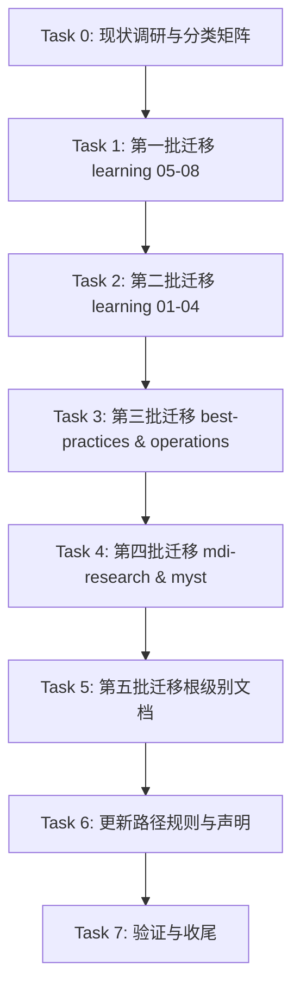

# .agents/docs 与 docs 分离方案 — 实施计划

## [x] Task 0：现状调研与分类矩阵建立
- **Priority**: high
- **Depends On**: None
- **Description**: 
  - 盘点 `.agents/docs/` 完整目录结构，列出所有文件清单
  - 建立文档分类矩阵：将每个文件标记为"Agent必留"或"人类迁移"
  - 识别所有受影响的文件引用（grep搜索被迁移文件名在其他文件中的引用）
  - 设计分批次迁移路线图，5-7批完成，每批≤100个文件
- **Acceptance Criteria Addressed**: AC-1, AC-2
- **Test Requirements**:
  - `human-judgment` TR-0.1: 分类矩阵完整覆盖所有文件，无遗漏
  - `human-judgment` TR-0.2: 分类判定合理，Agent必留文件确实被路由表或规则引用
  - `human-judgment` TR-0.3: 迁移路线图包含批次划分、文件数量统计、依赖关系说明

### [ ] SubTask 0.1：盘点完整文件清单
- 递归列出 `.agents/docs/` 下所有 `.md` 文件（不含 `.gitkeep`）
- 统计文件总数、按目录分组统计

### [ ] SubTask 0.2：识别 Agent 路由必读文件
- 分析 `context-routing.md` 中的所有 `docs/` 引用路径
- 分析 `AGENTS.md` 中的所有 `docs/` 引用路径
- 分析 `global-core-rules.md` 中的所有 `docs/` 引用路径
- 输出"Agent必留文件清单"

### [ ] SubTask 0.3：建立分类矩阵
- 交叉比对文件清单与 Agent必留清单，标记"人类迁移"文件
- 输出完整分类矩阵：文件路径 | 分类 | 引用位置（如有）

### [ ] SubTask 0.4：设计分批次迁移路线图
- 按主题/目录分组，每批≤100个文件
- 优先迁移无路由引用的独立文件
- 规划批次间依赖关系（如路由引用文件最后迁移）
- 输出迁移路线图文档

---

## [ ] Task 1：第一批迁移 — learning Wiki（无路由引用部分）
- **Priority**: high
- **Depends On**: Task 0
- **Description**: 
  - 迁移 `knowledge/learning/` 下不被路由表引用的学习 Wiki 文件
  - 预计迁移 ~80 个文件（05-08 主题的 Wiki 及 first-principles 专题）
  - 严格按迁移流程执行：移动文件 → 更新路径引用 → 验证 → 提交
- **Acceptance Criteria Addressed**: AC-3
- **Test Requirements**:
  - `programmatic` TR-1.1: check-links.py 验证无死链
  - `programmatic` TR-1.2: check-move.py 验证文件迁移完整性
  - `human-judgment` TR-1.3: 核对文件数量（源文件数 = 新位置文件数）

### [ ] SubTask 1.1：创建目标目录结构
- 在 `docs/` 下创建 `knowledge/learning/` 目录结构
- 复制 `.agents/docs/knowledge/learning/CATEGORIES.md` 和 `LEARNING-PATHS.md`

### [ ] SubTask 1.2：迁移 05-08 主题 Wiki
- 移动 `05-ai-multimodal-content/` 目录
- 移动 `06-business-trends-analysis/` 目录
- 移动 `07-vendor-product-learning/` 目录
- 移动 `08-systems-infrastructure/` 目录

### [ ] SubTask 1.3：迁移 first-principles 专题
- 移动 `first-principles/` 目录

### [ ] SubTask 1.4：更新路径引用
- 更新 `docs/knowledge/learning/README.md` 中的链接
- 更新 `docs/knowledge/learning/CATEGORIES.md` 中的内部链接
- 更新 `docs/knowledge/learning/LEARNING-PATHS.md` 中的内部链接

### [ ] SubTask 1.5：验证与提交
- 运行 `python .agents/scripts/check-links.py --path docs/`
- 运行 `python .agents/scripts/check-move.py`
- 原子提交：`docs: migrate learning Wiki 05-08 and first-principles to docs/`

---

## [ ] Task 2：第二批迁移 — learning Wiki（01-04 主题）
- **Priority**: high
- **Depends On**: Task 1
- **Description**: 
  - 迁移 `knowledge/learning/` 下 01-04 主题的 Wiki 文件
  - 预计迁移 ~130 个文件（协议与接口、工程方法论、平台工具、文档工具链）
- **Acceptance Criteria Addressed**: AC-3
- **Test Requirements**:
  - `programmatic` TR-2.1: check-links.py 验证无死链
  - `programmatic` TR-2.2: check-move.py 验证文件迁移完整性

### [ ] SubTask 2.1：迁移 01 Agent协议与接口技术栈
- 移动 `01-agent-protocols-interfaces/` 目录

### [ ] SubTask 2.2：迁移 02 Agent工程方法论
- 移动 `02-agent-engineering-methodology/` 目录（不包含被路由引用的文件）

### [ ] SubTask 2.3：迁移 03 Agent平台与工具生态
- 移动 `03-agent-platforms-tools/` 目录

### [ ] SubTask 2.4：迁移 04 文档工具链与标记语言
- 移动 `04-docs-markup-tooling/` 目录

### [ ] SubTask 2.5：更新路径引用与验证
- 更新 `docs/knowledge/learning/CATEGORIES.md` 中的链接
- 更新 `docs/knowledge/learning/LEARNING-PATHS.md` 中的链接
- 运行链接验证脚本
- 原子提交

---

## [ ] Task 3：第三批迁移 — best-practices 与 operations
- **Priority**: medium
- **Depends On**: Task 2
- **Description**: 
  - 迁移 `knowledge/best-practices/` 和 `knowledge/operations/` 目录
  - 预计迁移 ~23 个文件
- **Acceptance Criteria Addressed**: AC-3
- **Test Requirements**:
  - `programmatic` TR-3.1: check-links.py 验证无死链
  - `programmatic` TR-3.2: check-move.py 验证文件迁移完整性

### [ ] SubTask 3.1：迁移 best-practices 目录
- 移动 `knowledge/best-practices/` 目录

### [ ] SubTask 3.2：迁移 operations 目录
- 移动 `knowledge/operations/` 目录

### [ ] SubTask 3.3：更新引用与验证
- 更新 `docs/knowledge/README.md` 中的链接
- 运行链接验证脚本
- 原子提交

---

## [ ] Task 4：第四批迁移 — mdi-research 与 myst-unified-ecosystem
- **Priority**: medium
- **Depends On**: Task 3
- **Description**: 
  - 迁移 `knowledge/mdi-research/` 和 `knowledge/myst-unified-ecosystem/` 目录
  - 预计迁移 ~20 个文件
- **Acceptance Criteria Addressed**: AC-3
- **Test Requirements**:
  - `programmatic` TR-4.1: check-links.py 验证无死链

### [ ] SubTask 4.1：迁移 mdi-research 目录
- 移动 `knowledge/mdi-research/` 目录

### [ ] SubTask 4.2：迁移 myst-unified-ecosystem 目录
- 移动 `knowledge/myst-unified-ecosystem/` 目录

### [ ] SubTask 4.3：更新引用与验证
- 更新 `docs/knowledge/README.md` 中的链接
- 运行链接验证脚本
- 原子提交

---

## [ ] Task 5：第五批迁移 — 根级别文档与索引文件
- **Priority**: medium
- **Depends On**: Task 4
- **Description**: 
  - 迁移 `.agents/docs/` 根级别面向人类的文档（如 project-overview、project-highlights 等）
  - 预计迁移 ~15 个文件
- **Acceptance Criteria Addressed**: AC-3
- **Test Requirements**:
  - `programmatic` TR-5.1: check-links.py 验证无死链
  - `human-judgment` TR-5.2: 迁移后 `docs/` 根目录结构清晰

### [ ] SubTask 5.1：迁移根级别人类文档
- 移动 `project-overview.md`、`project-highlights.md`、`roadmap.md` 等
- 移动 `knowledge-base.md`（仅作为人类参考，agent 通过路由表引用）

### [ ] SubTask 5.2：更新引用与验证
- 更新 `docs/README.md` 中的导航表
- 运行链接验证脚本
- 原子提交

---

## [ ] Task 6：更新路径解析规则与文档边界声明
- **Priority**: high
- **Depends On**: Task 5
- **Description**: 
  - 更新 `global-core-rules.md` 中的路径解析规则，反映新的文档分布
  - 更新 `AGENTS.md` 中的文档边界声明
  - 更新 `docs/DEPRECATED.md` 为正常入口文档
- **Acceptance Criteria Addressed**: AC-4, AC-5
- **Test Requirements**:
  - `human-judgment` TR-6.1: 路径解析规则清晰，无歧义
  - `human-judgment` TR-6.2: AGENTS.md 声明与物理现实一致
  - `human-judgment` TR-6.3: `docs/DEPRECATED.md` 已替换为正常入口

### [ ] SubTask 6.1：更新 global-core-rules.md
- 修改路径解析规则：`.agents/docs/` 仅包含 agent 必读文件
- 更新内容敏感度分流中的产出物路径

### [ ] SubTask 6.2：更新 AGENTS.md
- 修改文档边界声明，反映新结构

### [ ] SubTask 6.3：替换 docs/DEPRECATED.md
- 删除 `DEPRECATED.md`，创建 `docs/README.md` 作为人类文档主入口

### [ ] SubTask 6.4：验证与提交
- 运行链接验证脚本
- 原子提交

---

## [ ] Task 7：验证与收尾
- **Priority**: high
- **Depends On**: Task 6
- **Description**: 
  - 执行全面验证：文件数量核对、链接验证、路由表验证
  - 清理空目录和临时文件
  - 更新主题 README 登记完成状态
- **Acceptance Criteria Addressed**: AC-3, AC-4, AC-5
- **Test Requirements**:
  - `programmatic` TR-7.1: check-links.py 全项目验证无死链
  - `programmatic` TR-7.2: check-move.py 验证所有文件迁移完整
  - `human-judgment` TR-7.3: `.agents/docs/` 仅保留 agent 必读文件（6个文件）
  - `human-judgment` TR-7.4: `docs/` 包含所有人类文档，结构清晰

### [ ] SubTask 7.1：全面链接验证
- 运行 `python .agents/scripts/check-links.py` 全项目验证

### [ ] SubTask 7.2：文件数量核对
- 核对 `.agents/docs/` 剩余文件数（应为 6 个 agent 必读文件）
- 核对 `docs/` 文件数（应为迁移的所有文件）

### [ ] SubTask 7.3：清理空目录
- 删除 `.agents/docs/knowledge/learning/` 等空目录
- 删除 `.agents/docs/knowledge/best-practices/` 等空目录

### [ ] SubTask 7.4：更新主题 README
- 在 `.trae/specs/docs-restructure/README.md` 中登记完成状态

### [ ] SubTask 7.5：最终提交
- 原子提交收尾变更

---

# Task Dependencies

**关键原则**：
- Task 0 必须最先且最充分地执行（迁移类任务风险高，规划不充分会导致大量断链）
- 每批迁移完成后必须立即验证，不要攒到最后统一验证
- 路由表引用的文件放在最后批次迁移（Task 5），最小化路由中断风险
- 每批迁移独立提交，遵循 Conventional Commits 规范