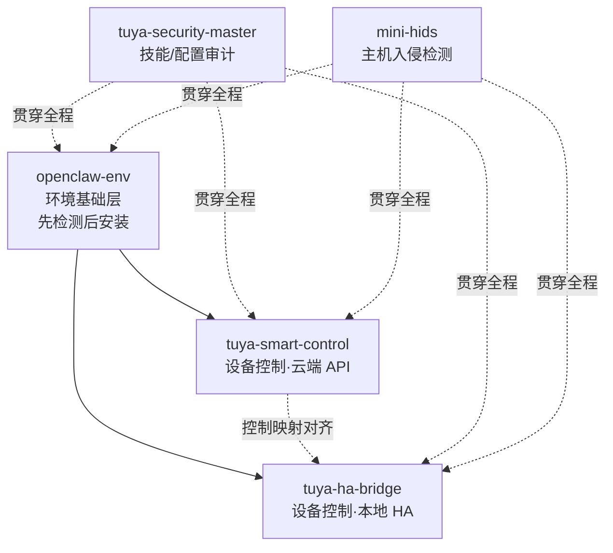

# TuyaClaw/OpenClaw 技能学习指南

> 本指南讲解如何系统学习和掌握位于 `C:\Users\XMICUser\.tuyaclaw\skills` 目录下的 5 个 TuyaClaw/OpenClaw 技能。全文事实信息均来自各技能的 SKILL.md / README.md，命令、参数与约束严格基于真实内容。

---

# 一、概述与整体认知

`skills` 根目录是 TuyaClaw/OpenClaw 的技能存放目录，每个子目录对应一个独立技能，由其 `SKILL.md` 提供入口与元数据。当前共有 5 个技能，各自的一句话职责如下：

| 技能 | 标识 | 一句话职责 |
|---|---|---|
| openclaw-env（Env Doctor ⚙️） | 环境基础层 | 环境诊断与安装工具，所有 CLI / 命令行工具 / 运行时 / 包管理器安装的强制入口，遵循"先检测后安装"原则。 |
| tuya-smart-control 🏠 | 设备控制（云端 API） | 通过原生二进制 `bin/tuya-api` 控制涂鸦智能家居设备（灯 / 空调 / 插座 / 窗帘等），支持设备查询、家庭房间管理、天气、通知、数据统计、IPC 摄像头云端抓拍。需要环境变量 `TUYA_API_KEY`。 |
| tuya-ha-bridge | 设备控制（本地 HA） | 通过 Home Assistant（HA）以自然语言控制家中设备（灯 / 开关 / 空调 / 窗帘 / 门锁 / 风扇 / 媒体播放器）。需要环境变量 `HA_URL` 与 `HA_TOKEN`，仅支持 darwin / linux。 |
| tuya-security-master | 安全治理层 | TuyaClaw 安全总入口技能，统一处理安装前技能审计、环境审计、配置加固、运行时检测、事件响应五种模式。trust-score 为 98。 |
| mini-hids | 安全治理层 | 本地主机入侵检测系统（HIDS）技能，支持查询守护进程、读告警、查看黑名单、封禁 / 解封 IP、扫描 webshell，覆盖 Linux / Windows。 |

## 相互关系

这 5 个技能可划分为三个层次：

- **基础层**：`openclaw-env` 是所有技能依赖环境的安装入口。任何 CLI、运行时、包管理器的安装都必须经由它，遵循"先检测后安装"原则。
- **设备控制层（两条并列路径）**：`tuya-smart-control` 走云端 API 路径，`tuya-ha-bridge` 走本地 Home Assistant 路径。两者是并列关系，控制映射在 light / switch / climate 上保持对齐。
- **安全治理层**：`tuya-security-master` 偏向技能 / 配置审计与安全编排；`mini-hids` 偏向主机入侵检测与响应。二者贯穿全程，为安装与运行提供安全保障。

---

# 二、目录文件结构分析

## 2.1 skills 根目录树

```text
skills/
├── mini-hids/
│   ├── examples/
│   │   ├── claude_desktop_mcp.json
│   │   └── install_windows_service.py
│   ├── .tuyaclaw-preinstalled.json
│   ├── README.md
│   ├── SKILL.md
│   ├── blacklist.db
│   ├── config.json
│   ├── hids_common.py
│   ├── hids_core.py
│   ├── hids_skill_cli.py
│   ├── mcp_server.py
│   ├── mini-hids.service
│   ├── mini_hids.py
│   └── test_hids.py
├── openclaw-env/
│   ├── .tuyaclaw-preinstalled.json
│   ├── SKILL.md
│   ├── install-macos.md
│   └── install-windows.md
├── tuya-ha-bridge/
│   ├── scripts/
│   │   ├── e2e_test.py
│   │   ├── ha_client.py
│   │   ├── ha_control.py
│   │   ├── ha_healthcheck.py
│   │   └── ha_list.py
│   ├── tests/
│   │   └── test_*.py
│   ├── .gitignore
│   ├── .tuyaclaw-preinstalled.json
│   ├── SKILL.md
│   └── requirements.txt
├── tuya-security-master/
│   ├── catalog/
│   │   ├── skills.csv
│   │   ├── skills.json
│   │   └── skills.md
│   ├── contracts/*.json
│   ├── docs/*.md
│   ├── orchestration/
│   │   └── modes.json
│   ├── scripts/*.py
│   ├── skills/<多个含 LEGACY.md 的子目录>
│   ├── tools/*.json
│   ├── .tuyaclaw-preinstalled.json
│   ├── README.md
│   ├── SECURITY.md
│   ├── SKILL.md
│   └── requirements.txt
└── tuya-smart-control/
    ├── bin/
    │   └── tuya-api（及各平台二进制）
    ├── references/*.md
    ├── .tuyaclaw-preinstalled.json
    ├── SKILL.md
    └── _meta.json
```

## 2.2 关键文件职责

**通用文件：**

- **SKILL.md**：每个技能的入口与元数据文件，含 YAML frontmatter 的 `name` / `description` / `metadata`。
- **.tuyaclaw-preinstalled.json**：预装标记文件。

**tuya-smart-control：**

- **references/**：API 分模块参考文档，包括 `api-conventions.md`、`device-control.md`、`device-management.md`、`device-message.md`、`device-query.md`、`error-handling.md`、`home-and-space.md`、`ipc-cloud-capture.md`、`notifications.md`、`statistics.md`、`weather.md`。
- **bin/**：各平台原生二进制 `tuya-api`，包括 darwin-arm64 / x64、linux-x64 / arm64、windows-x64.exe / arm64.exe。

**tuya-ha-bridge（scripts/）：**

- **ha_client.py**：公共库。
- **ha_list.py**：列出实体。
- **ha_control.py**：执行控制并回读。
- **ha_healthcheck.py**：连通性自检。
- **e2e_test.py**：端到端测试。

**tuya-security-master：**

- **tools/*.json**：纯函数工具契约，如 `analyze_permissions`、`scan_credentials`、`scan_prompt_injection`、`audit_dependencies`、`analyze_network_risk`、`generate_sandbox_profile`、`detect_runtime_violations`、`detect_threat_patterns`、`sanitize_output`、`plan_incident_response`；`index.json` 为工具索引。
- **contracts/*.json**：各模式输出报告契约。
- **orchestration/modes.json**：模式路由配置（真值来源之一）。
- **scripts/tool_runner.py**：工具统一运行入口。

**mini-hids：**

- **hids_skill_cli.py**：CLI 入口。
- **mini_hids.py**：守护进程。
- **config.json**：守护进程与 CLI 共享配置。
- **blacklist.db**：存放黑名单。

---

# 三、学习顺序建议

## 3.1 依赖关系图



## 3.2 推荐学习路线

1. **先学 openclaw-env**：理解"先检测后安装"六步法——检测平台架构 → 环境快照 → 网络连通性 → 依赖链自底向上 → 加载平台指南安装 → 安装后验证。这是其他技能依赖环境的前置条件。

2. **再学 tuya-smart-control**：掌握云端 API 设备控制主线——定位设备 → 查状态 → 查物模型 → 映射指令 → 下发 → 回读验证。
   - 前置条件：已配置好 `TUYA_API_KEY` 凭据与运行时环境。

3. **平行可选学 tuya-ha-bridge**：理解本地 HA 控制路径——解析实体 → 控制 → 回报，并与 smart-control 的控制映射对齐关系。
   - 前置条件：已安装依赖（`requests` + `websocket-client`），已配置 `HA_URL` / `HA_TOKEN`，运行平台为 darwin / linux。

4. **学 tuya-security-master**：建立"先审计后安装"的安全意识，掌握五种模式（preinstall-audit / environment-audit / config-harden / runtime-detect / incident-response）。

5. **最后学 mini-hids**：掌握主机层入侵检测与响应——`status` → `alerts` → `blacklist` → `ban`/`unban` → `scan`。
   - 前置条件：守护进程已启动（Linux 需 root，Windows 需先装 pywin32）。

---

# 四、核心知识点梳理

## 4.1 openclaw-env

- **设计理念**：强制入口，"先检测后安装"，禁止跳过任何步骤；为中国大陆用户优先配置镜像源。
- **能力范围**：
  - 平台 / 架构检测、全量环境快照、网络连通性检查。
  - 自底向上依赖链：Layer0 网络 → Layer1 包管理器 → Layer2 基础运行时 → Layer3 目标 CLI → Layer4 环境变量。
  - 平台安装指南、安装后验证。
  - 包管理器决策树：macOS 用 Homebrew；Windows 优先 Scoop → winget → choco。
- **能力边界（不支持）**：
  - Linux 暂无安装指南，需用户用发行版包管理器自行安装。
  - API key 类环境变量无法用命令安装，需引导用户去服务商注册。
  - tmux 在 Windows 不可用。
- **关键约束**：
  - Apple Silicon 装完 Homebrew 必须执行 `eval brew shellenv`。
  - Windows 上 Python 命令是 `python` / `pip` 而非 `python3` / `pip3`。
  - macOS 14+ 不再预装 python3，需校验有效性。
  - 当无法自动完成时禁止输出含糊指令，必须给出完整可复制的分步操作。

## 4.2 tuya-smart-control

- **设计理念**：始终用命令行 `bin/tuya-api` 单命令完成，自动处理鉴权 / URL 解析 / JSON 序列化 / 错误处理；Base URL 从 API key 前缀自动识别。
- **能力范围**：
  - 家庭 / 房间管理。
  - 设备查询：全部、按家庭、按房间、单设备详情。
  - 设备控制：查物模型（`model` 字段是需二次 `json.loads` 的字符串）、下发属性。
  - 改名、天气、通知（短信 / 语音 / 邮件 / App 推送，均为自发自收）。
  - 数据统计（时间格式 `yyyyMMddHH`，单次 ≤ 24 小时）。
  - IPC 云端抓拍图片 / 短视频、IPC 视觉识别。
  - WebSocket 实时事件订阅 `subscribe`。
- **能力边界（明确不支持）**：门锁控制、实时视频流、设备图片推送 / 获取、raw / bitmap / struct / array 复杂数据类型控制、固件 OTA 升级、设备配网 / 删除。
- **关键约束**：
  - 需 `TUYA_API_KEY`，缺失则技能不加载。
  - 控制属性仅支持 bool / enum / value（整数）/ string。
  - `accessMode`：ro 只读 / wr 只写 / rw 读写。
  - 相对调整需读当前值 + 物模型 min / max / step 计算并夹取。
  - CLI 退出码：2 = 用法 / 校验错误，1 = 运行 / API / 网络错误。
  - 禁止输出 `TUYA_API_KEY` 值。

## 4.3 tuya-ha-bridge

- **设计理念**：通过 HA 控制设备，控制映射对齐 smart_ai_os 的 tuya_ha_plugin（light / switch / climate 一致），扩展 cover / lock / fan / media_player。
- **能力范围**：
  - 列实体。
  - 按 `entity_id` 控制：灯（亮度 1-100 / 色温 2700-6500 / 色相饱和度）、空调（温度与模式）、窗帘（开关或位置）、门锁、风扇（百分比）、媒体（音量）。
  - 脚本：`ha_list.py` / `ha_control.py` / `ha_healthcheck.py` / `e2e_test.py`。
- **能力边界（不支持）**：
  - 仅支持 darwin / linux。
  - 只发控制类 `call_service`，绝不发删除类服务，不删除 HA 实体 / 设备。
- **关键约束**：
  - 凭据从环境变量 `HA_URL` / `HA_TOKEN` 读取，绝不要让用户把 `HA_TOKEN` 粘贴到聊天里（聊天里的 Token 会被 transcript 脱敏截断成"首 6 + … + 尾 4"形式，视为不可信不可用）。
  - 依赖 `requests` + `websocket-client`（`pip install -r requirements.txt`）。
  - 门锁等敏感操作执行前应向用户确认。
  - 日志 token 一律脱敏。

## 4.4 tuya-security-master

- **设计理念**：单一活跃技能作为安全总入口，统一意图识别、模式选择、边界执行、高风险确认门控；真值来源为 `orchestration/modes.json` 与 `tools/index.json`。
- **能力范围**：
  - 五种模式：
    - **preinstall-audit**：安装前技能审计。
    - **environment-audit**：环境审计。
    - **config-harden**：配置加固。
    - **runtime-detect**：运行时检测。
    - **incident-response**：事件响应。
  - 每模式映射最小工具集，输出结构化 JSON（`verdict`: PASS / CONDITIONAL / BLOCK，`risk_score` 0-100，`needs_confirmation` 等）。
  - 工具均为纯函数（无提示、无推理、无结论、只返回 JSON）。
- **能力边界（不支持）**：
  - 默认只读。
  - 不会自动修改整个主机环境。
  - 实时检测与审计结论只降低风险，不构成绝对安全保证。
- **关键约束**：
  - 写 / 删 / 打补丁 / 安装 / 卸载 / 禁用 / 替换 / 主动 shell 都需显式确认（高风险确认模板，必须收到明确 `yes` 才执行）。
  - 原始密钥 / 私钥 / token / 大段原始日志不得暴露。
  - `skills/*/LEGACY.md` 仅为迁移占位，不参与活跃派发。
  - 触发词支持中英文。

## 4.5 mini-hids

- **设计理念**：让 agent 通过本地 CLI 驱动 Mini-HIDS，做基础入侵响应（封 IP、查告警、列黑名单、扫 webshell），无需完整 SIEM / EDR。
- **能力范围**：
  - 六个子命令：
    - `status`：先调用确认守护进程运行。
    - `alerts --lines N`：近期告警。
    - `blacklist`：已封 IP。
    - `ban <ip> <reason>`：写操作。
    - `unban <ip>`：写操作。
    - `scan`：扫描 webshell。
  - 所有命令返回单行 JSON `{success, message?, data?}`。
- **能力边界（不支持）**：
  - file-write / network 权限为 false（仅 file-read 与 shell）。
  - 不应仅因 IP 出现在告警里就自动封禁。
- **关键约束**：
  - 参数以 argv 数组传入，绝不拼接 shell 字符串（防注入）。
  - `ban` / `unban` 等写操作必须先经用户显式确认（高风险确认模板，需明确 `yes`）。
  - Linux 下 `ban` / `unban` 无 sudo 通常失败，需 root 启动守护进程。
  - 发现 `suspicious_files` 时只列路径请用户人工核查，不要建议 `rm`。
  - `config.json` 关键项：`TRUSTED_IPS` / `BAN_TIME` / `MAX_FAILURES` / `WINDOW_SECONDS` / `WIN_EVENT_LOG.enabled`。

---

# 五、实践操作步骤

> 以下 `{baseDir}` 表示对应技能在 `skills` 目录下的绝对路径。

## 5.1 环境准备（openclaw-env）

先做环境快照与网络连通性检查，再按依赖链自底向上安装。中国大陆用户应先配置镜像源，再进行安装。安装完成后必须进行安装后验证。

依赖链顺序：

```text
Layer0 网络 → Layer1 包管理器 → Layer2 基础运行时 → Layer3 目标 CLI → Layer4 环境变量
```

## 5.2 tuya-smart-control

配置环境变量：

```bash
export TUYA_API_KEY="your-tuya-api-key"
# TUYA_BASE_URL 可选，未设置时由 API key 前缀自动识别
```

典型命令：

```bash
{baseDir}/bin/tuya-api homes
{baseDir}/bin/tuya-api devices
{baseDir}/bin/tuya-api devices --home <id>
{baseDir}/bin/tuya-api devices --room <id>
{baseDir}/bin/tuya-api device_detail <device_id>
{baseDir}/bin/tuya-api model <device_id>
{baseDir}/bin/tuya-api control <device_id> '{"switch_led":true}'
{baseDir}/bin/tuya-api rename <device_id> "New Name"
{baseDir}/bin/tuya-api weather 39.90 116.40
{baseDir}/bin/tuya-api sms
{baseDir}/bin/tuya-api voice
{baseDir}/bin/tuya-api mail
{baseDir}/bin/tuya-api push
{baseDir}/bin/tuya-api stats_config
{baseDir}/bin/tuya-api stats_data
{baseDir}/bin/tuya-api ipc_pic_fetch <device_id> 1
{baseDir}/bin/tuya-api ipc_video_fetch <device_id> 5 1
{baseDir}/bin/tuya-api subscribe [--device-ids ...] [--events property,status,raw]
```

设备控制完整工作流（6 步）：

1. **定位设备**。
2. **获取当前状态**：`result` 为 `null` 则设备不存在或无权限；`online` 为 `false` 则离线，停止下发。
3. **查询物模型**：`model` 需二次 `json.loads`，检查 `accessMode`。
4. **映射指令**。
5. **下发**。
6. **回读验证**：等待 1-2 秒后回读。

## 5.3 tuya-ha-bridge

安装依赖：

```bash
pip install -r {baseDir}/requirements.txt
```

在技能详情页的"环境变量"里添加 `HA_URL` 与 `HA_TOKEN`（**不要在聊天里贴 Token**）。

列实体：

```bash
python3 {baseDir}/scripts/ha_list.py --filter 客厅
```

控制示例：

```bash
# 灯
python3 {baseDir}/scripts/ha_control.py --entity light.living_room --action on --brightness 60
# 空调
python3 {baseDir}/scripts/ha_control.py --entity climate.ac --action on --temperature 24 --hvac-mode cool
# 窗帘
python3 {baseDir}/scripts/ha_control.py --entity cover.curtain --action open --position 30
# 开锁
python3 {baseDir}/scripts/ha_control.py --entity lock.front_door --action unlock
# 连通性自检
python3 {baseDir}/scripts/ha_healthcheck.py
```

## 5.4 tuya-security-master

加载唯一活跃技能 `SKILL.md`。示例请求：

```text
请在安装前审计这个技能，使用 preinstall-audit 模式并返回结构化结果
```

运行工具：

```bash
python3 scripts/tool_runner.py analyze_permissions --input-json '{...}'
# --pretty       人类可读输出
# --list-tools   列出工具
# --schema-only  查看 schema
```

安装时默认审计：

```bash
python3 scripts/install_skill_with_audit.py --target /path/to/skill --host codex --report-format structured
```

## 5.5 mini-hids

启动守护进程（Linux 用 sudo，Windows 需先装 pywin32）。

调用示例：

```bash
python3 <skill_dir>/hids_skill_cli.py status
python3 <skill_dir>/hids_skill_cli.py alerts --lines 50
python3 <skill_dir>/hids_skill_cli.py blacklist
python3 <skill_dir>/hids_skill_cli.py ban 203.0.113.42 "SSH brute force"
python3 <skill_dir>/hids_skill_cli.py unban 203.0.113.42
python3 <skill_dir>/hids_skill_cli.py scan
```

> `ban` / `unban` 前必须经用户显式确认。

---

# 六、常见问题与解决方法

| 问题 | 涉及技能 | 解决方法 |
|---|---|---|
| 凭据缺失，技能不加载 | tuya-smart-control | 缺 `TUYA_API_KEY` 时技能不加载，需配置该环境变量。 |
| 报缺 token / 连接失败 | tuya-ha-bridge | 去技能详情页"环境变量"添加 `HA_URL` / `HA_TOKEN`。 |
| Token 被截断 | tuya-ha-bridge | 聊天里看到的 `HA_TOKEN` 是被脱敏截断的"首 6 + … + 尾 4"，不可信不可用；必须在环境变量里配置完整值，不要在聊天里索要或接收 Token。 |
| 命令未找到 / command not found | openclaw-env | 走"先检测后安装"流程，按依赖链自底向上补齐。 |
| 网络超时（访问 GitHub / npm / pip / Homebrew） | openclaw-env | 中国大陆用户先配置镜像源再安装。 |
| 平台差异 | openclaw-env / tuya-ha-bridge | Windows 用 `python` / `pip` 而非 `python3` / `pip3`；`curl` 在 Windows PowerShell 是别名，需用 `curl.exe`；tuya-ha-bridge 仅支持 darwin / linux。 |
| 设备离线 | tuya-smart-control | `device_detail` 中 `online` 为 `false` 时，提示用户检查电源与网络，不继续下发。 |
| 设备状态未及时更新 | tuya-smart-control | 下发后回读若值不一致，提示"命令已发送，但设备状态尚未更新，可能有延迟"。 |
| 权限不足 | mini-hids | Linux 下 `ban` / `unban` 无 sudo 失败，需以 root 启动守护进程；守护进程未运行（`is_running=false`）时先启动守护进程。 |
| 物模型解析 | tuya-smart-control | `result.model` 是 JSON 字符串，需再次 `json.loads` 才能拿到属性定义。 |
| 统计时间窗口超限 | tuya-smart-control | `stats_data` 单次 ≤ 24 小时，更长区间需多次请求聚合。 |
| 高风险操作 | tuya-security-master / mini-hids | 写 / 删 / 安装 / 封禁等需明确 `yes` 确认才执行。 |

---

## 参考资料

- `openclaw-env/SKILL.md`
- `tuya-smart-control/SKILL.md`
- `tuya-ha-bridge/SKILL.md`
- `tuya-security-master/SKILL.md` 与 `tuya-security-master/README.md`
- `mini-hids/SKILL.md`
