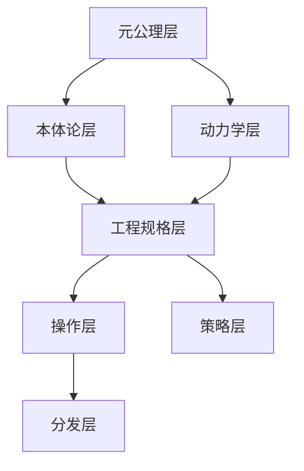

# 哲学基础

本目录承载知识体系的理论基础到工程实践的映射文档。文档形成完整的知识图谱，任意入口可达全局。

## 体系结构



## 文档索引

| 层次 | 文档 | 核心问题 |
|---|---|---|
| 元公理层 | [元公理](meta-principles.md) | 第一性原理是什么？ |
| 本体论层 | [本体论](ontology.md) | 存在结构与约束 |
| 动力学层 | [动力学](dynamics.md) | 系统如何运动 |
| 工程规格层 | [工程规格](engineering-specs.md) | 如何量化和落地 |
| 操作层 | [操作指南](operations.md) | 如何操作 |
| 分发层 | [分发策略](distribution.md) | 如何分发和组合 |
| 策略层 | [设计原则](design-principles.md) | 具体策略 |

## 设计原则

### 核心命题

> [核心命题引用]

### 哲学到工程的映射

| 哲学命题 | 工程原则 | 技术落点 |
|---|---|---|
| [命题 1] | [原则 1] | [落点 1] |
| [命题 2] | [原则 2] | [落点 2] |

## 验证标准

任何新设计若声称遵循本原则，必须回答以下问题：

1. **[问题 1]**：[说明]
2. **[问题 2]**：[说明]
3. **[问题 3]**：[说明]

## 延伸阅读

- [设计原则](design-principles.md)
- [本体论](ontology.md)

```{toctree}
:maxdepth: 1
:caption: 文档清单

meta-principles
ontology
dynamics
engineering-specs
operations
distribution
design-principles
```