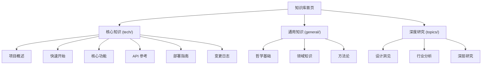

# 📚 知识库首页

> 基于**七概念**框架构建的知识体系，支持多层次知识组织与深度关联。

## 知识体系架构



## 三大知识模块

### 🔧 核心知识（tech/）

承载与本项目直接相关的技术文档，包括架构设计、API 参考、部署流程、变更日志等。

| 文档 | 说明 |
|---|---|
| [项目概述](tech/intro.md) | 项目定位、核心价值与架构概览 |
| [快速开始](tech/quickstart.md) | 环境初始化与首次接入指南 |
| [核心功能](tech/features.md) | 关键特性与使用方法 |
| [API 参考](tech/api/) | 自动生成的 API 文档 |
| [部署指南](tech/deploy.md) | 部署流程与运维说明 |
| [变更日志](tech/changelog.md) | 项目演进记录 |

### 🌐 通用知识（general/）

汇集与本项目无直接耦合，但对知识体系有滋养价值的通用知识，与技术文档形成双轨隔离。

| 领域 | 说明 |
|---|---|
| [哲学基础](general/philosophy/index.md) | 理论基础与设计原则的哲学映射 |
| [领域知识](general/domain/index.md) | 跨学科常识与领域参考 |
| [方法论](general/methodology/index.md) | 可复用的思维模型与方法论 |

### 🔬 深度研究（topics/）

承载知识体系在演进过程中沉淀的设计哲学、行业分析与深层思考，着眼于"为什么这样设计"以及"未来往哪里走"。

| 文档 | 面向读者 |
|---|---|
| [设计洞见](topics/design-philosophy.md) | 架构师、核心贡献者 |
| [行业分析](topics/industry-analysis.md) | 研究者、战略决策者 |
| [深层研究](topics/research-notes.md) | 深度贡献者、跨学科探索者 |

## 重点阅读推荐

- 想了解项目的核心设计哲学，请阅读 [设计原则](general/philosophy/design-principles.md)
- 想快速上手使用，请阅读 [快速开始](tech/quickstart.md)
- 想查看项目演进记录，请阅读 [变更日志](tech/changelog.md)

## 目录导航

```{toctree}
:maxdepth: 2
:caption: 目录
:hidden:

tech/index
general/index
topics/index
```

* {ref}`genindex`
* {ref}`modindex`
* {ref}`search`