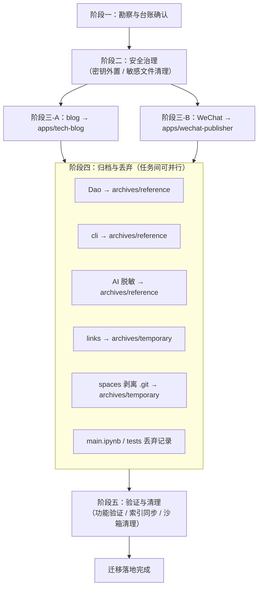

# xinet 沙箱多项目迁移计划

> **状态**：规划阶段产出（仅规划，不执行）
> **目标沙箱**：`d:\AI\.temp\.chaos\tests\xinet`
> **前置依赖**：`xinet-content-extraction-and-archiving`（价值评估与元数据归档）
> **迁移依据**：`.agents/protocols/app-development-workflow.md`

## 1. 概述

### 1.1 迁移目标

本计划面向 `d:\AI\.temp\.chaos\tests\xinet` 混沌测试沙箱，旨在将其中具有保留价值的子项目，依据项目治理规范有序迁移至合规目标位置（`apps/` 与 `docs/retrospective/archives/xinet/`），同步消除明文密钥、嵌套仓库、矛盾指引文档等熵增风险，并为后续执行阶段提供可逐条验收的落地方案。

### 1.2 迁移范围

- **覆盖对象**：xinet 目录下全部 9 个一级子项目（`blog/`、`WeChat/`、`Dao/`、`cli/`、`AI/`、`links/`、`spaces/`、`main.ipynb`、`tests/`）。
- **目标位置**：合规应用迁移至 `apps/<app-name>/`；具参考价值但实体不完整的内容归档至 `docs/retrospective/archives/xinet/`；占位与环境特定内容记录后丢弃。
- **复用资产**：直接采用前期 spec 的价值评估结论（高价值 4410 / 中价值 22841 / 低价值 26900 个文件，识别敏感文件 7673 个）与既有归档目录结构（`core/`、`reference/`、`temporary/` 三层 + `naming-convention.md` + `review-mechanism.md`）。

### 1.3 规划阶段边界声明

本文档处于**规划阶段**，其唯一产出为本迁移计划文档。

- 本阶段**不执行**任何实际的文件迁移、复制、删除或修改操作。
- 不在 `xinet` 源目录、`apps/` 或 `docs/` 目标位置产生任何文件变更。
- 文档中描述的全部"实施步骤"均为后续独立执行阶段的操作指引，而非本阶段已执行的动作。
- 实际迁移执行属于后续独立 spec 的范畴。

---

## 2. 子项目迁移台账

下表为全部 9 个一级子项目的迁移决策台账，逐一明确价值等级、独立性、安全风险、迁移决策、目标位置与决策理由。

| 子项目 | 价值等级 | 技术栈独立性 | 安全风险 | 迁移决策 | 目标位置 | 决策理由 |
|---|---|---|---|---|---|---|
| `blog/` | 中高 | 高·自包含全栈应用 | 低 | 迁移 | `apps/tech-blog/` | Vue3+Express+TS 全栈博客，含 client/server/posts 与 Dockerfile、cloudbaserc.json、deploy.sh，依赖声明完整，可独立运行 |
| `WeChat/` | 中高 | 高 | 高·明文凭证体系 | 迁移（脱敏后） | `apps/wechat-publisher/` | Python 公众号发布工具，功能内聚、依赖清晰；须先将 config.yaml 中的 app_secret/api_key 外置后方可迁移 |
| `Dao/` | 低 | 中·实体不完整 | 低 | 归档 | `docs/retrospective/archives/xinet/reference/` | TS monorepo（daomind-modulux）仅含 README 与空壳 apps/backend，无真实 packages 实现，不具备迁移条件，保留作参考 |
| `cli/` | 中 | 中 | 中·硬编码 URL | 归档/参考 | `docs/retrospective/archives/xinet/reference/` | skillhub CLI 含可参考的技能管理思路，但 metadata.json 硬编码外部 URL（lightmake.site、腾讯云 COS），不宜直接迁移 |
| `AI/` | 低 | 低 | 高·明文 code/token | 归档（脱敏后） | `docs/retrospective/archives/xinet/reference/` | PowerShell API 调用脚本，get_token.ps1 含明文 code，须脱敏后归档作参考，不具独立应用价值 |
| `links/` | 低 | 低·环境特定 | 低 | 丢弃/归档 | `docs/retrospective/archives/xinet/temporary/` | code-workspace 含绝对路径 D:/xinet，ClawWork 为虚构角色文档，环境特定无复用价值；如保留则按临时层归档 |
| `spaces/` | 低 | 低·嵌套仓库混杂 | 中 | 归档（剥离嵌套 .git） | `docs/retrospective/archives/xinet/temporary/` | 嵌套 tao（taolib 副本）、daoApps 等多个 Git 仓库与备份，剥离嵌套 .git 后按临时层归档 |
| `main.ipynb` | 低 | 低 | 低 | 丢弃 | —（仅记录） | Jupyter 测试占位，仅一个输出 "3" 的空 cell，无保留价值 |
| `tests/` | 低 | 低 | 低 | 丢弃 | —（仅记录） | 测试占位（index.md + main.ipynb），无实质内容 |

**台账汇总**：迁移 2 项（blog、WeChat）；归档 5 项（Dao、cli、AI、links、spaces）；丢弃 2 项（main.ipynb、tests）。

---

## 3. 迁移分类标准与决策规则

### 3.1 三维分类维度定义

| 维度 | 定义 | 取值 | 判定要点 |
|---|---|---|---|
| 价值等级 | 复用前期 `xinet-content-extraction-and-archiving` 的评估结论 | 高 / 中 / 低 | 内容的复用潜力、原创性与业务相关度 |
| 技术栈独立性 | 是否为自包含、可独立运行的应用 | 高 / 中 / 低 | 依赖声明完整性、是否具备 src+tests+依赖文件、能否脱离沙箱独立构建运行 |
| 安全风险 | 是否包含明文密钥、凭证、嵌套仓库等风险项 | 高 / 中 / 低 | 明文密钥/token、硬编码 URL、嵌套 .git、绝对路径等 |

### 3.2 三维度 → 迁移决策映射规则

| 综合条件 | 迁移决策 | 目标位置 |
|---|---|---|
| 高价值 + 独立 + 风险可控（含可脱敏处理） | 迁移 | `apps/<kebab-case-name>/` |
| 中价值，或实体不完整但有参考价值 | 归档 | `docs/retrospective/archives/xinet/`（reference 层为主） |
| 低价值 + 占位/环境特定 | 丢弃 | 仅记录决策，不保留实体 |

> **风险可控的补充说明**：当子项目本身价值高、独立性强，但存在明文密钥等高安全风险时，须先经安全治理（密钥外置）将风险降至可控后，方可进入迁移分支（如 `WeChat/`）。无法脱敏或脱敏后仍不具独立运行能力的高风险项，降级为归档。

### 3.3 目标位置合规性说明

对照 `.agents/protocols/app-development-workflow.md`：

- **应用目录结构**：迁移至 `apps/` 的应用须采用 kebab-case 命名，且目录须含 `README.md` + 依赖声明文件（`package.json` / `requirements.txt`）+ `src/` + `tests/`。`blog/` 与 `WeChat/` 在脱敏与结构对齐后须满足此约束。
- **迁移模式**：协议默认推荐 Move 全量迁移，但鉴于混沌沙箱的不确定性，本计划采用「先复制后验证再清理」的稳妥变体（详见 §6 风险应对），避免源文件在验证通过前被破坏性移动。
- **索引同步**：迁移完成后须运行 `python .agents/scripts/generate-apps-index.py` 同步 `apps/README.md`。当前 `apps/` 已有 ai-code-assistant、shared、zhujian-wudao 三个条目，迁移后将新增 tech-blog 与 wechat-publisher。
- **归档命名**：归档文件须遵循 `docs/retrospective/archives/xinet/naming-convention.md` 的 `{category-slug}-{sanitized-path}-{timestamp}{extension}` 格式（kebab-case + 分类前缀 + 时间戳）。

---

## 4. 迁移顺序与依赖关系

### 4.1 排序原则

迁移执行遵循「安全治理优先 → 应用迁移 → 归档丢弃」的总体次序：

1. **安全治理优先**：密钥外置、敏感文件清理须先于任何内容迁移，确保不会将明文凭证带入主仓库版本控制。
2. **应用迁移其次**：独立应用（blog、WeChat）在安全治理完成后迁移；二者相互独立，可并行执行。
3. **归档与丢弃最后**：剩余子项目的归档与丢弃在应用迁移完成后执行，各归档任务彼此独立，可并行执行。

### 4.2 阶段依赖关系图

### 4.3 可并行任务标注

| 并行组 | 任务 | 并行前提 |
|---|---|---|
| 应用迁移并行组 | `blog → tech-blog`、`WeChat → wechat-publisher` | 二者无共享依赖，且阶段二安全治理已完成 |
| 归档并行组 | Dao、cli、AI、links、spaces 各自归档；main.ipynb、tests 丢弃记录 | 各子项目相互独立，且阶段三已完成 |

> **串行约束**：阶段一 → 阶段二 → 阶段三 → 阶段四 → 阶段五 为严格串行；并行仅发生在阶段内部的同级任务之间。

---

## 5. 兼容性处理方案

针对沙箱的四类熵增问题，分别制定处理方案。

### 5.1 嵌套 Git 仓库剥离方案

沙箱内存在 37 个嵌套 `.git/` 仓库（`spaces/tao` 为 taolib 库副本含完整 `.git`，另有 `daoApps`、`tests/tao` 等）。

- **处理原则**：剥离嵌套 `.git/` 目录，使迁移/归档后的内容纳入主仓库版本控制，**不携带子仓库的提交历史**。
- **操作要点**：
  1. 对待保留内容，先复制文件树至目标位置，再删除复制副本中的 `.git/` 目录（不触碰源目录）。
  2. `spaces/tao` 作为 taolib 副本，与主仓库可能存在内容重复，归档前须经去重确认；确认重复则仅记录索引、不重复保留实体。
  3. 剥离后须确认目标目录中不残留任何 `.git/`、`.gitmodules` 引用，避免形成 submodule 污染。
- **验证**：归档目录下 `Get-ChildItem -Recurse -Force -Directory -Filter .git` 应无结果。

### 5.2 明文密钥外置方案

| 来源 | 风险项 | 外置方案 |
|---|---|---|
| `WeChat/config.yaml` | app_secret / api_key 明文 | 配置项替换为环境变量读取（`python-dotenv`）；新增 `.env.example` 模板仅含占位符；真实 `.env` 加入 `.gitignore` |
| `AI/get_token.ps1` | 明文 code `smc-eb98948ed1264195b3b534e58f60ebe9`、token | 明文常量替换为 `$env:MINDOS_CODE` 等环境变量引用；归档版本仅保留脚本结构，剔除真实凭证 |
| 通用 | 各类敏感文件 | 迁移/归档前执行敏感信息扫描；`.env`、`*.secret`、含凭证的 `config.yaml` 一律加入 `.gitignore` |

- **执行次序**：密钥外置须在任何文件进入主仓库版本控制**之前**完成。
- **占位符约定**：`.env.example` 中仅以 `APP_SECRET=your_app_secret_here` 形式提供占位，不含任何真实值。

### 5.3 双 AI 指引文档冲突消解方案

沙箱含双份矛盾的 AI 指引文档：`CLAUDE.md`（描述为 taolib Python 库）与 `CODEBUDDY.md`（描述为完全不同的项目）。

- **处理原则**：确立单一 SSOT（Single Source of Truth）指引，**矛盾文档不随迁移携带**，亦不进行机械合并。
- **操作要点**：
  1. 迁移至 `apps/` 的应用，其 AI 指引以主仓库 `AGENTS.md` 与 `.agents/` 规范为唯一权威来源；沙箱中的 `CLAUDE.md` / `CODEBUDDY.md` 不携带。
  2. 若两份文档中存在对某子项目仍有价值的描述片段，可提炼为目标应用 `README.md` 的内容，但不保留原矛盾文档实体。
  3. 矛盾文档本身作为"沙箱熵增样本"记录于归档索引，归类至 `temporary/` 层，仅留索引不保留实体。
- **验证**：迁移后的 `apps/tech-blog/`、`apps/wechat-publisher/` 目录下不存在 `CLAUDE.md` 或 `CODEBUDDY.md`。

### 5.4 命名规范对齐映射表

| 源目录（沙箱原名） | 目标名（kebab-case） | 目标位置 |
|---|---|---|
| `blog/` | `tech-blog` | `apps/tech-blog/` |
| `WeChat/` | `wechat-publisher` | `apps/wechat-publisher/` |
| `Dao/` | `dao` | 归档 reference 层 |
| `cli/` | `skillhub-cli` | 归档 reference 层 |
| `AI/` | `mindos-scripts` | 归档 reference 层 |
| `links/` | `links-workspace` | 归档 temporary 层 |
| `spaces/` | `spaces` | 归档 temporary 层 |

> 迁移至 `apps/` 的目录名严格遵循 kebab-case，禁止空格、大写、下划线；归档文件名遵循 `naming-convention.md` 的分类前缀 + sanitized-path + 时间戳格式。

---

## 6. 潜在风险评估与应对措施

### 6.1 风险清单与应对

| 风险类别 | 风险描述 | 影响 | 缓解措施 | 回退方案 |
|---|---|---|---|---|
| 误删风险 | 直接 Move 源文件，若目标验证失败则源文件已不可恢复 | 有价值内容永久丢失 | 采用「先复制后验证再清理」：源文件保留至目标位置验证通过后再清理 | 验证失败时直接弃用目标副本，源文件原封未动，无需恢复 |
| 依赖断裂风险 | 迁移后依赖声明缺失或路径错位导致无法构建 | 应用迁移后无法运行 | 迁移前校验 `package.json`/`requirements.txt` 完整性；迁移后在目标路径执行 install + 构建验证 | 在 `apps/<app>/` 原地补全依赖声明并重新验证；不可修复则删除目标副本，源文件返回沙箱 |
| 密钥泄露风险 | 明文密钥随文件进入主仓库版本控制后被提交 | 凭证泄露、安全事故 | 迁移前执行敏感信息扫描；密钥外置为环境变量后再纳入版本控制；敏感文件加入 `.gitignore` | 若发现已提交明文，立即从工作区移除并轮换对应凭证，敏感文件补入 `.gitignore` |
| 路径硬编码风险 | 文件含指向 `.temp/`、`D:/xinet` 等绝对路径，迁移后失效 | 配置/脚本运行报错 | 迁移后全量检索硬编码路径（`.temp/`、`D:/xinet`、绝对盘符），改为相对路径或环境变量 | 定位失效路径并修正为相对引用，重新验证；问题集中则整体回退至沙箱排查 |

### 6.2 验证检查点

**迁移前检查点**：

- [ ] 待迁移应用的依赖声明文件（`package.json`/`requirements.txt`）存在且完整。
- [ ] 已对待迁移内容执行敏感信息扫描，明文密钥已识别并完成外置准备。
- [ ] 待保留内容中的嵌套 `.git/` 已定位，确认剥离方案。
- [ ] 矛盾指引文档（CLAUDE.md/CODEBUDDY.md）已确认 SSOT 处理策略。

**迁移后检查点**：

- [ ] `apps/tech-blog/`、`apps/wechat-publisher/` 目录结构合规（README + 依赖声明 + src + tests 齐全）。
- [ ] 目标目录下无明文密钥残留，`.env.example` 仅含占位符，敏感文件已纳入 `.gitignore`。
- [ ] 目标目录下无嵌套 `.git/`、无矛盾指引文档残留。
- [ ] 无指向 `.temp/` 或 `D:/xinet` 的硬编码路径残留。
- [ ] `apps/README.md` 索引已通过脚本同步，新增条目准确。
- [ ] 归档文件命名符合 `naming-convention.md`，归档索引完整。

---

## 7. 分阶段迁移计划

五个阶段采用统一结构（阶段目标 / 实施步骤 / 关键产出 / 验收标准）。验收标准均为可验证条件。

### 阶段一：勘察与台账确认

- **阶段目标**：确认 9 个子项目的迁移台账与决策无误，建立后续阶段的执行基线。
- **实施步骤**：
  1. 核对 §2 迁移台账，确认每个子项目的价值等级、独立性、安全风险与迁移决策。
  2. 复核前期 `xinet-content-extraction-and-archiving` 的价值评估结论与敏感文件清单（7673 个）。
  3. 确认归档目录结构（`core/`/`reference/`/`temporary/`）与命名规范可用。
  4. 标定嵌套 `.git/`（37 个）与明文密钥（WeChat、AI）的具体位置。
- **关键产出**：经确认的迁移台账、嵌套仓库与密钥位置清单。
- **验收标准**：
  - 台账覆盖全部 9 个一级子项目，每项均有明确的迁移决策与目标位置。
  - 嵌套 `.git/` 与明文密钥位置清单完整，无遗漏。

### 阶段二：安全治理

- **阶段目标**：在任何内容进入主仓库前，完成密钥外置与敏感文件清理，将安全风险降至可控。
- **实施步骤**：
  1. 将 `WeChat/config.yaml` 中的 app_secret/api_key 改为环境变量读取，生成 `.env.example` 占位模板。
  2. 将 `AI/get_token.ps1` 的明文 code/token 替换为 `$env:` 环境变量引用。
  3. 编写/更新 `.gitignore`，纳入 `.env`、含凭证的 `config.yaml` 等敏感文件。
  4. 对全部待保留内容执行敏感信息扫描，确认无遗漏明文凭证。
- **关键产出**：脱敏后的配置/脚本、`.env.example` 模板、更新后的 `.gitignore`、敏感信息扫描报告。
- **验收标准**：
  - 待迁移/归档内容中无明文 app_secret/api_key/code/token 残留。
  - `.env.example` 仅含占位符，不含任何真实值。
  - 敏感文件已全部列入 `.gitignore`。

### 阶段三：应用迁移

- **阶段目标**：将 `blog/` 与 `WeChat/` 迁移至 `apps/`，形成结构合规、可独立运行的应用。
- **实施步骤**：
  1. **blog → apps/tech-blog**（可与下条并行）：复制 client/server/posts 等内容至 `apps/tech-blog/`，剥离嵌套 `.git/`，对齐目录结构（确保 README + package.json + src + tests），修正硬编码路径。
  2. **WeChat → apps/wechat-publisher**（可与上条并行）：在阶段二脱敏基础上，复制脱敏后内容至 `apps/wechat-publisher/`，补全 src/tests 结构与 README，确认 requirements.txt（openai/PyYAML/requests/markdown/beautifulsoup4/Pillow/python-dotenv）完整。
  3. 在各目标路径执行依赖安装与构建/运行验证。
- **关键产出**：`apps/tech-blog/`、`apps/wechat-publisher/` 两个合规应用目录。
- **验收标准**：
  - 两个目标目录均含 README.md + 依赖声明 + `src/` + `tests/`。
  - 目标目录下无嵌套 `.git/`、无矛盾指引文档、无明文密钥。
  - 依赖安装与构建/运行验证通过。

### 阶段四：归档与丢弃

- **阶段目标**：将 Dao、cli、AI、links、spaces 归档，并对 main.ipynb、tests 执行丢弃记录。
- **实施步骤**：
  1. **Dao** → `archives/xinet/reference/`：作为实体不完整的参考样本归档。
  2. **cli** → `archives/xinet/reference/`：归档前在归档副本中标注硬编码 URL 风险。
  3. **AI** → `archives/xinet/reference/`：以阶段二脱敏版本归档。
  4. **links** → `archives/xinet/temporary/`：环境特定内容按临时层归档（或仅记录索引）。
  5. **spaces** → `archives/xinet/temporary/`：剥离嵌套 `.git/` 后归档；`tao` 副本经去重确认后仅留索引。
  6. **main.ipynb / tests** → 仅在归档索引中记录"丢弃"决策与理由，不保留实体。
  7. 上述各归档任务相互独立，可并行执行。
- **关键产出**：填充后的归档目录（reference/temporary 层）、更新后的归档索引（含丢弃记录）。
- **验收标准**：
  - 5 个归档子项目均按 `naming-convention.md` 命名并落入正确层级。
  - 归档内容中无嵌套 `.git/`、无明文密钥残留。
  - main.ipynb、tests 的丢弃决策已在归档索引中留痕。

### 阶段五：验证与清理

- **阶段目标**：完成迁移后功能验证、`apps/README.md` 索引同步与沙箱清理，收尾整个迁移落地。
- **实施步骤**：
  1. 在 `apps/tech-blog/`、`apps/wechat-publisher/` 执行完整功能验证。
  2. 全量检索并修正残留的硬编码路径（`.temp/`、`D:/xinet`）。
  3. 运行 `python .agents/scripts/generate-apps-index.py` 同步 `apps/README.md` 索引。
  4. 验证通过后，按「先复制后验证再清理」原则清理沙箱中已迁移/已归档的源内容。
  5. 通过 messaging 协议通知 orchestrator 迁移完成。
- **关键产出**：通过验证的两个应用、同步后的 `apps/README.md`、清理后的沙箱、迁移完成通知。
- **验收标准**：
  - 两个应用功能验证通过，无指向 `.temp/`/`D:/xinet` 的硬编码路径。
  - `apps/README.md` 索引包含 tech-blog 与 wechat-publisher 条目且描述准确。
  - 沙箱中已迁移/已归档的源内容已清理，归档内容可正常访问。

---

## 8. 附录：与 spec.md 需求对齐索引

| spec.md 需求 | 对应本文档章节 |
|---|---|
| 子项目迁移台账 | §2 子项目迁移台账 |
| 迁移分类标准（分类维度明确） | §3.1 三维分类维度定义 |
| 迁移分类标准（决策规则可执行） | §3.2 三维度 → 迁移决策映射规则、§3.3 目标位置合规性说明 |
| 迁移顺序与依赖关系 | §4 迁移顺序与依赖关系 |
| 兼容性处理方案（嵌套 Git 仓库处理） | §5.1 嵌套 Git 仓库剥离方案 |
| 兼容性处理方案（明文密钥处理） | §5.2 明文密钥外置方案 |
| 兼容性处理方案（双 AI 指引文档冲突处理） | §5.3 双 AI 指引文档冲突消解方案 |
| 兼容性处理方案（命名规范对齐） | §5.4 命名规范对齐映射表 |
| 潜在风险评估与应对 | §6 潜在风险评估与应对措施 |
| 分阶段迁移计划（阶段结构完整） | §7 分阶段迁移计划（阶段一至阶段五） |
| 分阶段迁移计划（验收标准可度量） | §7 各阶段「验收标准」、§6.2 验证检查点 |
| 规划阶段边界（不执行迁移操作） | §1.3 规划阶段边界声明 |
