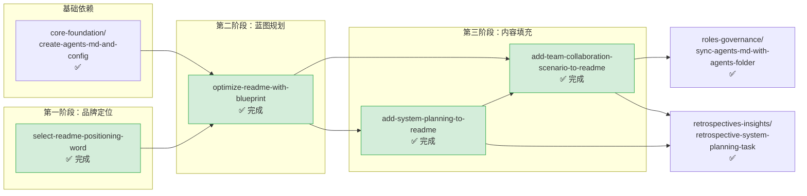

# readme-branding — README 与品牌定位

本主题包含项目对外展示窗口 README.md 的演进、品牌定位词选型、蓝图与场景展示相关的规格文档。面向人类读者的入口文档优化均归入此主题。

**主题状态**：✅ 全部完成（4/4）
**上级看板**：[返回全局执行看板](../README.md)
**任务模板**：[readme-branding-task-template.md](../../../.agents/templates/theme-templates/readme-branding-task-template.md)

---

## 📊 主题执行看板

| Spec 名称 | 状态 | 完成度 | 交付物 | 简述 |
|---|---|---|---|---|
| [select-readme-positioning-word](select-readme-positioning-word/) | ✅ 完成 | 100% | [README.md](../../../README.md) | README 品牌定位关键词选型，经过多轮比较最终选定 "SpecWeave" |
| [optimize-readme-with-blueprint](optimize-readme-with-blueprint/) | ✅ 完成 | 100% | [README.md](../../../README.md) | README 项目亮点补充与蓝图规划章节，增强项目愿景展示 |
| [add-system-planning-to-readme](add-system-planning-to-readme/) | ✅ 完成 | 100% | [README.md](../../../README.md) | README 系统规划章节，展示八大自我治理模块架构 |
| [add-team-collaboration-scenario-to-readme](add-team-collaboration-scenario-to-readme/) | ✅ 完成 | 100% | [README.md](../../../README.md) | README 角色协作场景章节，展示中心化/去中心化两种协作模式 |

---

## 🔀 主题内执行路线图



### 执行顺序说明

1. **select-readme-positioning-word**（最先执行）：确定品牌名称是所有 README 内容的前提
2. **optimize-readme-with-blueprint**：品牌定位确定后，补充蓝图和亮点章节
3. **add-system-planning-to-readme、add-team-collaboration-scenario-to-readme**：在蓝图基础上填充具体内容，系统规划是协作场景的前置依赖

---

## ⚠️ 遗留问题与跟进事项

本主题所有 spec 已 100% 完成，无待办事项。

### 定期维护建议
- 项目里程碑达成后及时更新 README 进展
- 新增核心功能模块后同步更新系统架构图
- 品牌定位调整需走变更评审流程，避免随意修改

---

## 📐 主题边界与判定规则

### 归入本主题的条件
- 修改项目根目录 README.md 的任何内容（文字、结构、图表等）
- 品牌定位、项目名称、slogan 的选型与调整
- 项目蓝图、路线图、愿景展示类内容
- 面向外部读者的项目介绍、使用指南、展示材料

### 不归入本主题的情况
- 创建 README.md 初始骨架 → 归入 `core-foundation/`
- 同步 AGENTS.md 索引（非 README 内容修改） → 归入 `roles-governance/`
- 对 README 内容撰写进行复盘 → 归入 `retrospectives-insights/`
- 编写 .agents/ 内部 README 索引文档 → 归入对应功能主题

---

## 🆕 新增 Spec 指南

### 命名规范
- 使用 kebab-case，动词开头
- 常用前缀：`add-`（新增章节/内容）、`update-`（更新内容）、`optimize-`（优化展示）、`select-`（选型决策）、`refine-`（润色完善）
- 示例：`add-quick-start-guide`、`update-roadmap-2026h2`、`optimize-project-structure-diagram`

### tasks.md 必备检查项

```markdown
- [ ] Task 0: 内容规划
  - [ ] SubTask 0.1: 明确要添加/修改的内容类型（章节/段落/图表/链接）
  - [ ] SubTask 0.2: 确定内容在 README 中的位置和前后文逻辑
  - [ ] SubTask 0.3: 准备素材（架构图、数据、引用来源等）
  - [ ] SubTask 0.4: 确认品牌定位和用词风格一致（使用 SpecWeave 等既定术语）

- [ ] Task 1: 文案撰写
  - [ ] SubTask 1.1: 撰写新内容/修改现有内容
  - [ ] SubTask 1.2: 确保语言简洁、面向人类读者（避免内部术语堆砌）
  - [ ] SubTask 1.3: 如包含 Mermaid 图表，验证语法正确
  - [ ] SubTask 1.4: 所有链接使用相对路径，验证链接有效性

- [ ] Task 2: 一致性检查
  - [ ] SubTask 2.1: 检查与现有内容无重复或矛盾
  - [ ] SubTask 2.2: 检查术语使用与项目既定术语一致
  - [ ] SubTask 2.3: 检查目录结构/链接与实际文件一致
  - [ ] SubTask 2.4: 运行 check-links.py 验证所有链接有效

- [ ] Task 3: 收尾
  - [ ] SubTask 3.1: 检查 Markdown 渲染效果（标题层级、表格对齐、代码块）
  - [ ] SubTask 3.2: 在本主题 README.md 中登记完成状态
  - [ ] SubTask 3.3: 如涉及 AGENTS.md 路由表变更，同步触发 sync 任务
```

### checklist.md 必备检查项
- 文案面向外部读者，避免过度使用内部 jargon
- 品牌名称使用正确（SpecWeave，非其他变体）
- 所有链接可访问（运行 check-links.py 验证）
- Mermaid 图表语法正确，渲染无错误
- 标题层级正确（不跳级，如 H2 下直接 H4）
- 表格列分隔符与列数一致
- 中文文案通顺，无明显的机器翻译痕迹
- 与 README 其他部分风格一致

---

## 📁 目录结构

```
readme-branding/
├── README.md                                   # 本文件（主题执行看板）
├── add-system-planning-to-readme/
│   ├── spec.md
│   ├── tasks.md
│   └── checklist.md
├── add-team-collaboration-scenario-to-readme/
│   ├── spec.md
│   ├── tasks.md
│   └── checklist.md
├── optimize-readme-with-blueprint/
│   ├── spec.md
│   ├── tasks.md
│   └── checklist.md
└── select-readme-positioning-word/
    ├── spec.md
    ├── tasks.md
    └── checklist.md
```
