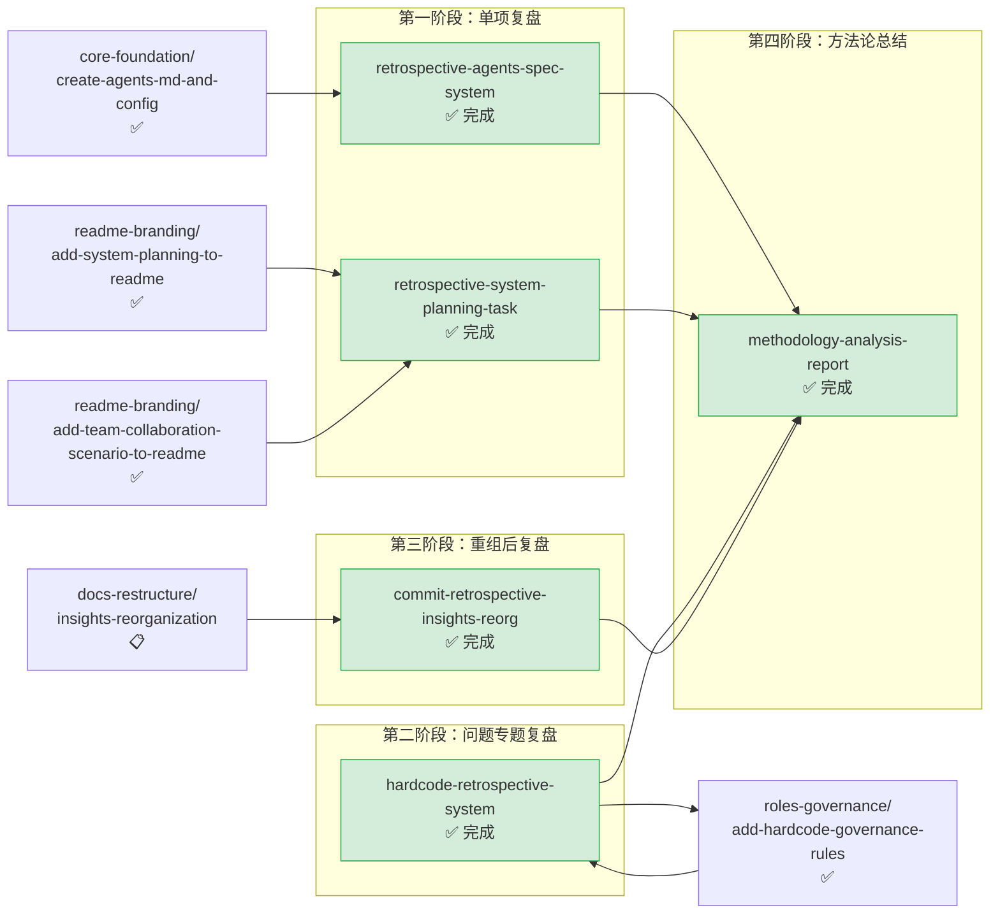

# retrospectives-insights — 复盘与洞察萃取

本主题包含对已完成任务/项目进行系统性复盘、问题诊断、经验萃取、方法论分析的规格文档。回顾性分析与知识沉淀类 spec 均归入此主题。

**主题状态**：✅ 全部完成（5/5）
**上级看板**：[返回全局执行看板](../README.md)
**任务模板**：[retrospectives-insights-task-template.md](../../../.agents/templates/theme-templates/retrospectives-insights-task-template.md)

---

## 📊 主题执行看板

| Spec 名称 | 状态 | 完成度 | 交付物 | 简述 |
|---|---|---|---|---|
| [retrospective-agents-spec-system](retrospective-agents-spec-system/) | ✅ 完成 | 100% | [docs/retrospective/](../../../docs/retrospective/) | 智能体开发规范体系项目复盘分析（元文档），沉淀规范创建经验 |
| [retrospective-system-planning-task](retrospective-system-planning-task/) | ✅ 完成 | 100% | [docs/retrospective/](../../../docs/retrospective/) | 系统规划章节新增任务复盘萃取，沉淀大型文档编写经验 |
| [hardcode-retrospective-system](hardcode-retrospective-system/) | ✅ 完成 | 100% | [docs/retrospective/](../../../docs/retrospective/) | 项目硬编码问题系统性复盘（元文档），支撑硬编码治理规则建立 |
| [commit-retrospective-insights-reorg](commit-retrospective-insights-reorg/) | ✅ 完成 | 100% | [docs/retrospective/](../../../docs/retrospective/) | 洞察库重组原子提交与复盘导出 |
| [methodology-analysis-report](methodology-analysis-report/) | ✅ 完成 | 100% | [docs/retrospective/](../../../docs/retrospective/) | 「复盘+洞察+萃取+导出」与「原子化+模块化」方法论全面分析报告 |

---

## 🔀 主题内执行路线图



### 执行顺序说明

1. **单项任务复盘**（retrospective-agents-spec-system、retrospective-system-planning-task）：在对应的核心任务完成后立即执行，沉淀即时经验
2. **hardcode-retrospective-system**：专项问题复盘，与治理规则建立形成双向迭代（复盘→规则→再复盘→规则完善）
3. **commit-retrospective-insights-reorg**：依赖洞察库重组完成后进行，复盘重组过程
4. **methodology-analysis-report**：所有复盘完成后进行元级方法论总结，萃取可复用模式

---

## ⚠️ 遗留问题与跟进事项

本主题所有 spec 已 100% 完成，无待办事项。

### 定期复盘建议
- 每完成一个里程碑（如一个完整 spec 执行完毕），应触发即时复盘
- 每发现一类系统性问题（如硬编码、路径错误等），应触发专题复盘
- 积累 5-10 个单项复盘后，考虑进行方法论级总结

---

## 📐 主题边界与判定规则

### 归入本主题的条件
- 对已完成的 spec、任务、里程碑进行回顾性分析
- 系统性诊断问题根因，总结经验教训
- 从实践中萃取可复用的模式、方法论、最佳实践
- 生成复盘报告、经验总结、模式库文档
- 对项目过程进行审计、评估、反思

### 不归入本主题的情况
- 制定新的规范或工具 → 归入 `standards-tools/`
- 创建新的系统或目录 → 归入 `core-foundation/`
- 调整文档结构（纯物理重组） → 归入 `docs-restructure/`
- 修复执行中发现的 bug（非回顾性分析） → 归入对应功能主题

---

## 🆕 新增 Spec 指南

### 命名规范
- 使用 kebab-case，根据复盘类型选择前缀
- 常用前缀：`retrospective-`（单项任务复盘）、`analysis-`（分析报告）、`postmortem-`（故障/问题复盘）、`extract-`（经验萃取）、`methodology-`（方法论总结）
- 示例：`retrospective-theme-readme-setup`、`analysis-path-errors-pattern`、`postmortem-spec-migration`

### tasks.md 必备检查项

```markdown
- [ ] Task 0: 复盘准备
  - [ ] SubTask 0.1: 收集复盘对象的完整上下文（spec.md、tasks.md、checklist.md、执行日志）
  - [ ] SubTask 0.2: 确认复盘范围和目标（问题诊断/经验萃取/方法论总结）
  - [ ] SubTask 0.3: 如为元文档，添加 `<!-- meta_type: retrospective -->` 标记避免一致性检查误报
  - [ ] SubTask 0.4: 确定复盘报告的结构框架

- [ ] Task 1: 信息收集与分析
  - [ ] SubTask 1.1: 回顾目标与计划（预期是什么）
  - [ ] SubTask 1.2: 对照实际结果（实际发生了什么）
  - [ ] SubTask 1.3: 识别差异与问题（哪些符合预期、哪些超出预期、哪些出现问题）
  - [ ] SubTask 1.4: 根因分析（5 Why 或鱼骨图方法）
  - [ ] SubTask 1.5: 萃取成功经验与失败教训

- [ ] Task 2: 报告撰写
  - [ ] SubTask 2.1: 编写复盘报告（放在 docs/retrospective/ 对应主题目录下）
  - [ ] SubTask 2.2: 标记可复用模式/资产（为模式库做准备）
  - [ ] SubTask 2.3: 提出改进建议（具体、可执行、有负责人）
  - [ ] SubTask 2.4: 如有需要，创建后续跟进 spec（如治理规则、工具改进等）

- [ ] Task 3: 归档与联动
  - [ ] SubTask 3.1: 在 docs/retrospective/README.md 中登记新报告
  - [ ] SubTask 3.2: 如复盘结论需要变更规范/工具，创建对应 spec 并建立关联
  - [ ] SubTask 3.3: 如萃取了可复用模式，更新 docs/retrospective/patterns/ 目录
  - [ ] SubTask 3.4: 在本主题 README.md 中登记完成状态
```

### checklist.md 必备检查项
- 复盘报告包含：目标回顾、结果对比、差异分析、根因分析、经验教训、改进建议
- 元文档标记正确（`<!-- meta_type: retrospective -->`）
- 引用的源文档路径正确（注意是自引用还是引用其他 spec）
- 改进建议具体可执行（避免空泛的"加强沟通"类建议）
- 可复用模式已标记并归类到正确的模式类型
- 报告结构与现有复盘文档风格一致
- 如需后续行动，已创建对应 spec 或任务记录
- 敏感信息（如内部路径、个人信息）已脱敏

---

## 📁 目录结构

```
retrospectives-insights/
├── README.md                                   # 本文件（主题执行看板）
├── commit-retrospective-insights-reorg/
│   ├── spec.md
│   ├── tasks.md
│   └── checklist.md
├── hardcode-retrospective-system/
│   ├── spec.md
│   ├── tasks.md
│   └── checklist.md
├── methodology-analysis-report/
│   ├── spec.md
│   ├── tasks.md
│   └── checklist.md
├── retrospective-agents-spec-system/
│   ├── spec.md
│   ├── tasks.md
│   └── checklist.md
└── retrospective-system-planning-task/
    ├── spec.md
    ├── tasks.md
    └── checklist.md
```
