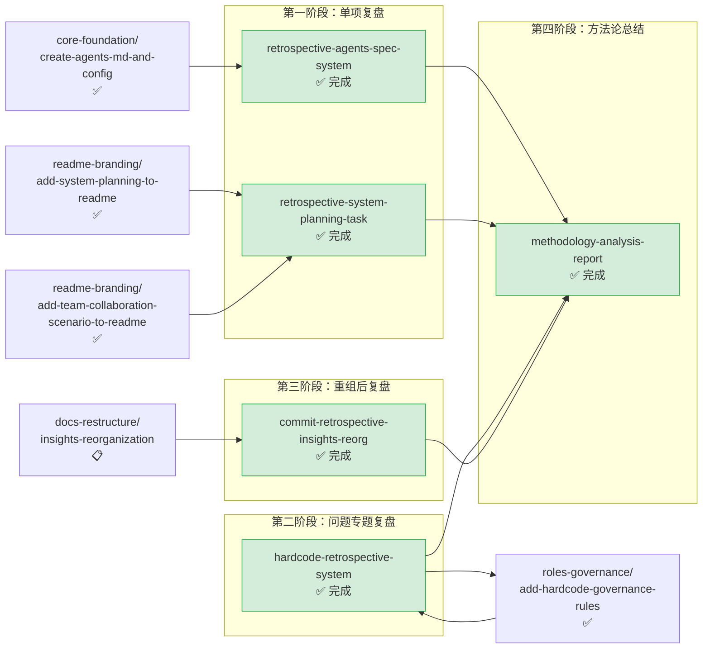

# retrospectives-insights — 复盘与洞察萃取

本主题包含对已完成任务/项目进行系统性复盘、问题诊断、经验萃取、方法论分析的规格文档。回顾性分析与知识沉淀类 spec 均归入此主题。

**主题状态**：🔧 进行中（50+ 已完成，4 待启动）
**上级看板**：[返回全局执行看板](../README.md)
**任务模板**：[retrospectives-insights-task-template.md](../../../.agents/templates/theme-templates/retrospectives-insights-task-template.md)

---

## 📊 主题执行看板

### 核心复盘类
| Spec 名称 | 状态 | 完成度 | 交付物 | 简述 |
|---|---|---|---|---|
| [retrospective-agents-spec-system](retrospective-agents-spec-system/) | ✅ 完成 | 100% | [docs/retrospective/](../../../docs/retrospective/) | 智能体开发规范体系项目复盘分析（元文档），沉淀规范创建经验 |
| [retrospective-system-planning-task](retrospective-system-planning-task/) | ✅ 完成 | 100% | [docs/retrospective/](../../../docs/retrospective/) | 系统规划章节新增任务复盘萃取，沉淀大型文档编写经验 |
| [hardcode-retrospective-system](hardcode-retrospective-system/) | ✅ 完成 | 100% | [docs/retrospective/](../../../docs/retrospective/) | 项目硬编码问题系统性复盘（元文档），支撑硬编码治理规则建立 |
| [commit-retrospective-insights-reorg](commit-retrospective-insights-reorg/) | ✅ 完成 | 100% | [docs/retrospective/](../../../docs/retrospective/) | 洞察库重组原子提交与复盘导出 |
| [methodology-analysis-report](methodology-analysis-report/) | ✅ 完成 | 100% | [docs/retrospective/](../../../docs/retrospective/) | 「复盘+洞察+萃取+导出」与「原子化+模块化」方法论全面分析报告 |
| [first-principles-knowledge-system-retrospective](first-principles-knowledge-system-retrospective/) | ✅ 完成 | 100% | [项目复盘报告+SOP模板](../../../docs/retrospective/reports/project-reports/retrospective-first-principles-knowledge-system-20260710/) | 第一性原理知识体系v1.0-v1.7系统性复盘：8版本时间线、12核心决策、10问题根因、14方法论、10洞察，沉淀L2级知识体系构建SOP模板（898行），含元复盘自反性验证 |

### 学习分析类（新增）
| Spec 名称 | 状态 | 完成度 | 交付物 | 简述 |
|---|---|---|---|---|
| [analyze-wechat-article-eve](analyze-wechat-article-eve/) | ✅ 完成 | 100% | 学习笔记+洞察报告 | Vercel Eve前端Agent框架系统性学习与深度洞察分析：约定式目录结构、工具/Skill分离、生产级能力（持久化/沙箱/审批）、子Agent、评测、部署、多渠道接入，以及Agent工程化趋势与前端开发者机遇分析 |
| [analyze-mattpocock-skills-article](analyze-mattpocock-skills-article/) | ✅ 完成 | 100% | 11章节分析报告(450行) | mattpocock/skills 开源项目(14万星)深度洞察：AI编程四大失败模式(意图对齐/术语缺失/反馈回路/架构腐化)及12个Skill命令四阶段解决方案 |
| [analyze-codex-product-philosophy-article](analyze-codex-product-philosophy-article/) | ✅ 完成 | 100% | 10章节分析报告(610行) | Codex产品哲学深度访谈(OpenAI Andrew Ambrosino)：设计流程之死、模型换命、home base vs 超级应用、流程倒转、PRD之死与媒介选择（[已归档至 insight-extraction/external-learning/](../../../docs/retrospective/reports/insight-extraction/external-learning/retrospective-codex-article-analysis-20260706/)，spec/tasks/checklist 保留在本目录） |
| [analyze-superpowers-6-article](analyze-superpowers-6-article/) | ✅ 完成 | 100% | 分析报告 | Superpowers 6.0技能升级深度洞察：Fable 5自动优化框架实现速度提升50%/Token减少60%，Agent优化自身流程范式分析 |
| [analyze-claude-code-artifacts-article](analyze-claude-code-artifacts-article/) | ✅ 完成 | 100% | 分析报告 | Claude Code Artifacts功能分析：终端对话实时转化为可交互可视化网页，AI编程工具从个人效率工具向团队协作基础设施演进 |
| [analyze-github-speckit-article](analyze-github-speckit-article/) | ✅ 完成 | 100% | 分析报告 | GitHub Spec Kit规格驱动开发(SDD)方法论：六个slash命令将vibe coding转变为工程实践，118K星标，与SpecWeave核心定位直接对照 |
| [analyze-agent-reach-wechat-article](analyze-agent-reach-wechat-article/) | ✅ 完成 | 100% | 分析报告 | Agent Reach上网Agent(49K星)深度洞察：13平台覆盖、多后端路由、真体检探测、零配置优先四大特性，解决Agent跨平台资料调研痛点 |
| [analyze-mainecoon-social-world-model-article](analyze-mainecoon-social-world-model-article/) | ✅ 完成 | 100% | 14章节分析报告(704行) | MaineCoon实时音视频模型(22B,catnip.ai)深度洞察：Social World Model定位、成本/速度/时长三角困境突破、五大应用场景、Agentic Streaming Inference框架 |
| [analyze-wechat-article-3dnk](analyze-wechat-article-3dnk/) | ✅ 完成 | 100% | 学习笔记+洞察报告 | Project N.O.M.A.D开源项目系统性学习与深度洞察分析：Docker Compose集成范式、五大功能模块（本地AI/RAG、离线维基百科、Khan Academy、离线地图、数据工具）、离线优先架构、数字生存主义兴起，以及整合式解决方案的方法论启示 |
| [analyze-wechat-article-dy98](analyze-wechat-article-dy98/) | ✅ 完成 | 100% | 学习笔记+洞察报告 | Orca多代理协作IDE系统性学习与深度洞察分析：Git Worktree作为IDE一等公民、并行Worktree多代理隔离、手机端远程监控、WebGL终端分屏、设计模式、GitHub/Linear集成、拖拽文件交互，以及IDE从代码编辑器向代理编排器演进的行业趋势 |
| [analyze-oray-five-product-sites](analyze-oray-five-product-sites/) | ✅ 完成 | 100% | [32932字Wiki+复盘四件套](../../../docs/knowledge/learning/07-vendor-product-learning/oray/) | 贝锐（Oray）五大产品线官网系统性学习与深度洞察：向日葵远控、蒲公英组网、花生壳内网穿透、洋葱头管理、贝锐集团官网，10维度对比分析、协同生态闭环、三层业务/技术范式提炼、11条核心洞察 |
| [volcengine-kickart-product-analysis](volcengine-kickart-product-analysis/) | ✅ 完成 | 100% | 学习笔记+洞察报告 | 火山引擎KickArt一站式营销创作平台系统性学习与深度洞察：六大产品能力、四大应用场景、自研营销创作模型、网页信息架构与UX设计分析、AIDA转化漏斗应用、可复用设计模式提炼 |
| [analyze-volcengine-ai-cloud-native-sandbox](analyze-volcengine-ai-cloud-native-sandbox/) | ✅ 完成 | 100% | [967行学习笔记+洞察报告](../../../docs/knowledge/learning/06-business-trends-analysis/volcengine-ai-cloud-native-sandbox-analysis.md) | 火山引擎AI云原生沙箱解决方案系统性学习与深度洞察：四大核心优势（40ms预热/100ms冷启/12万沙箱每分钟/成本降80%）、技术架构推测（MicroVM+预热池+快照+休眠）、四大AI应用场景（RL/Vibe Coding/Deep Research/Computer Use）、竞争优势对比、市场机会分析、云原生沙箱技术趋势判断 |
| [sunlogin-pdu-hardware-learning](sunlogin-pdu-hardware-learning/) | 📋 待启动 | 0% | Wiki教程文档 | 向日葵智能PDU硬件产品页面系统学习与深度洞察：产品矩阵、核心功能（远程控制/定时/电量统计/时序上电）、技术特性、应用场景、市场定位、竞争优势、商业模式分析，为智能硬件与AI Agent物理世界操作提供参考 |
| [sunlogin-p4-p1pro-comparison-analysis](sunlogin-p4-p1pro-comparison-analysis/) | 📋 待启动 | 0% | Wiki对比教程 | 向日葵智能插线板P4（4G版）与P1Pro（WiFi版）系统性学习与多维度对比分析：技术规格、功能特性、4G vs WiFi联网方式深度对比、安全设计、应用场景差异、市场定位、产品矩阵策略、商业模式洞察 |
| [sunlogin-mouse-bm110-mm110-analysis](sunlogin-mouse-bm110-mm110-analysis/) | 📋 待启动 | 0% | 学习分析报告 | 向日葵智能远控鼠标MM110/BM110两款产品系统性学习与对比分析：技术规格、功能特性、应用场景、产品优势、便携vs人体工学设计定位差异、双设备连接与功耗优化技术洞察、软件+硬件生态策略分析 |
| [sunlogin-tuya-comparison-analysis](sunlogin-tuya-comparison-analysis/) | 🔧 进行中 | 0% | Wiki对比分析 | 向日葵远程控制（os.oray.com）与涂鸦智能（Tuya Smart）全面对比分析：核心功能、技术架构、产品矩阵、生态系统、商业模式、定价策略七维度深度对比，输出结构化对比Wiki文档 |
| [claude-code-context-injection-deep-analysis](claude-code-context-injection-deep-analysis/) | 📋 待启动 | 0% | 学习笔记+洞察报告 | Claude Code上下文注入机制（CLAUDE.md/Rules/Skills/Subagents/Hooks/Output Styles/Dynamic Workflows）深度分析与实践启示 |
| [analyze-volcengine-hiagent](analyze-volcengine-hiagent/) | 📋 待启动 | 0% | 学习笔记+洞察报告 | 火山引擎HiAgent智能体开发平台系统性学习与深度洞察：核心产品能力（编排/工具/知识库/多Agent/评测/部署）、技术架构、应用场景、B端产品设计分析、企业级Agent平台设计范式与行业启示 |
| [analyze-volcengine-searchinfinity](analyze-volcengine-searchinfinity/) | 📋 待启动 | 0% | 学习笔记+洞察报告 | 火山引擎豆包搜索（SearchInfinity）系统性学习与深度洞察：四大产品优势（海量资源/灵活配置/维度全面/多模态检索）、AI专属搜索能力设计、四大Agent应用场景、AIDA转化漏斗与CTA策略分析、AI原生搜索设计范式与行业启示 |
| [analyze-volcengine-computer-use-agent](analyze-volcengine-computer-use-agent/) | ✅ 完成 | 100% | [学习笔记+洞察报告](../../../docs/knowledge/learning/07-vendor-product-learning/volcengine/volcengine-computer-use-agent-analysis.md) | 火山引擎Computer Use Agent (CUA)系统性学习与深度洞察：四大核心能力（视觉感知/自主规划/桌面执行/任务闭环）、三种使用方式（体验中心/自有设备/API接入）、基础/高级/通用功能、云端沙箱技术架构（五层架构图）、API开发指南（含时序图）、技术优势与潜在挑战、与传统RPA/Anthropic Computer Use对比、UI自动化三代范式演进分析 |
| [minitap-ai-wiki-update](minitap-ai-wiki-update/) | ✅ 完成 | 100% | [minitap-official-wiki.md](../../../docs/knowledge/learning/03-agent-platforms-tools/minitap-official-wiki.md) | Minitap.ai官网系统学习与wiki更新：Minitap商业公司官网信息（产品定位、核心功能、技术优势、客户案例、定价数据）、补充mobile-use深度学习分析的商业产品视角、形成开源技术+商业产品完整闭环 |
| [analyze-wechat-article-nglw6zYVjFEzM6boqn6uyg](analyze-wechat-article-nglw6zYVjFEzM6boqn6uyg/) | ✅ 完成 | 100% | [analysis-report.md](analyze-wechat-article-nglw6zYVjFEzM6boqn6uyg/analysis-report.md) | GPT-5.6发布日AI行业变局深度洞察：五件标志性事件同日发生（OpenAI GPT-5.6三档、微软MAI替换、DeepSeek自研芯片、Meta MUSE嵌入社交、Anthropic Cowork跨端），从模型竞赛到链条竞争的范式转移，120万次会话数据揭示业务流程为最大落地方向，五类从业者行动指南 |
| [minitest-ecosystem-deep-analysis](minitest-ecosystem-deep-analysis/) | 🔧 进行中 | 56% | task1~5-output.md | Minitest AI QA测试平台生态系统深度研究：零脚本QA Agent、minitest-cli Python CLI（Typer+15命令组）、minitest-trigger GitHub Action（OIDC认证）、agent-skills AI Skill定义、7个代码仓库架构分析、可复用工程模式提炼 |
| [analyze-terminalworld-benchmark](analyze-terminalworld-benchmark/) | ✅ 完成 | 100% | 15章节分析报告 | TerminalWorld真实终端Agent评测基准(arXiv:2605.22535)深度洞察：首个基于真实人类终端轨迹的评测基准(1530任务/18类别/1280命令工具)、UCL+南大+腾讯团队、四阶段数据流水线、五大核心评测发现(Claude Opus 4.7通过率62.5%/专家基准相关性r=0.20/人机命令重叠中位数21.4%)、三大方法论创新与评测范式转移洞察 |
| [analyze-mem0-agent-memory-framework](analyze-mem0-agent-memory-framework/) | ✅ 完成 | 100% | [8章节分析报告](analyze-mem0-agent-memory-framework/analysis-report.md) | Mem0开源Agent记忆框架(59.9k Star)深度技术拆解：六大核心组件架构、ADD-only写入策略(七步流程+两层去重)、三路检索融合机制(Semantic+BM25+Entity Boost动态归一化)、Entity Store实体索引(vs知识图谱)、五大接入原则、9项生产级工程经验、适用边界评估 |
| [minitest-official-docs-wiki](minitest-official-docs-wiki/) | 📋 待启动 | 0% | Spec三件套 | Minitap官方技术文档完整Wiki教程：minitest产品文档21页+mobile-use SDK文档27页（共48页）系统提取与中文Wiki编写，含核心概念、API/CLI参考、集成指南、最佳实践 |
| [analyze-codex-skills-article](analyze-codex-skills-article/) | ✅ 完成 | 100% | [8章节分析报告(429行)](analyze-codex-skills-article/analysis-report.md) | Codex/Claude Code玩家必装6个GitHub高星技能深度分析：五维筛选漏斗（Star≥1K/近3月commit/README≤200行/5分钟demo/不绑死模型）、六层生态结构、工具采纳SOP、信任前置写作漏斗，沉淀tool-adoption-funnel和trust-first-content-funnel两个方法论模式 |
| [analyze-yihuakaitian-meeting-record](analyze-yihuakaitian-meeting-record/) | ✅ 完成 | 100% | [345行分析报告](../../../playground/reports/retrospective-yihuakaitian-meeting-20260711/analysis-report.md) | 「一画开天」商业模式会议记录五步法深度分析：第一性原理拆解五层架构、3个可复用模式（五品漏斗/铁三角/逆向心理建构）、3个Mermaid可视化 |
| [first-principles-learning-mode-analysis](first-principles-learning-mode-analysis/) | ✅ 完成 | 100% | [2995行完整分析报告(4-5万字)](../../../docs/retrospective/reports/insight-extraction/standalone/first-principles-learning-mode/analysis-report.md) | 手机应用「学习模式」功能第一性原理系统性分析：悬置→拆解→质疑→重构四步法，从认知科学/学习心理学底层原理重构7内核要素+5支撑要素+3扩展要素、14必要条件金字塔模型、6干扰机制、10根本假设验证框架、防火墙→温室范式转变，沉淀第一性原理功能分析法可复用方法论SOP |

---

## 🔀 主题内执行路线图



### 执行顺序说明

1. **单项任务复盘**（retrospective-agents-spec-system、retrospective-system-planning-task）：在对应的核心任务完成后立即执行，沉淀即时经验
2. **hardcode-retrospective-system**：专项问题复盘，与治理规则建立形成双向迭代（复盘→规则→再复盘→规则完善）
3. **commit-retrospective-insights-reorg**：依赖洞察库重组完成后进行，复盘重组过程
4. **methodology-analysis-report**：所有复盘完成后进行元级方法论总结，萃取可复用模式

---

## ⚠️ 遗留问题与跟进事项

本主题所有 spec 已 100% 完成，无待办事项。

### 定期复盘建议
- 每完成一个里程碑（如一个完整 spec 执行完毕），应触发即时复盘
- 每发现一类系统性问题（如硬编码、路径错误等），应触发专题复盘
- 积累 5-10 个单项复盘后，考虑进行方法论级总结

---

## 📐 主题边界与判定规则

### 归入本主题的条件
- 对已完成的 spec、任务、里程碑进行回顾性分析
- 系统性诊断问题根因，总结经验教训
- 从实践中萃取可复用的模式、方法论、最佳实践
- 生成复盘报告、经验总结、模式库文档
- 对项目过程进行审计、评估、反思

### 不归入本主题的情况
- 制定新的规范或工具 → 归入 `standards-tools/`
- 创建新的系统或目录 → 归入 `core-foundation/`
- 调整文档结构（纯物理重组） → 归入 `docs-restructure/`
- 修复执行中发现的 bug（非回顾性分析） → 归入对应功能主题

---

## 🆕 新增 Spec 指南

### 命名规范
- 使用 kebab-case，根据复盘类型选择前缀
- 常用前缀：`retrospective-`（单项任务复盘）、`analysis-`（分析报告）、`postmortem-`（故障/问题复盘）、`extract-`（经验萃取）、`methodology-`（方法论总结）
- 示例：`retrospective-theme-readme-setup`、`analysis-path-errors-pattern`、`postmortem-spec-migration`

### tasks.md 必备检查项

```markdown
- [ ] Task 0: 复盘准备
  - [ ] SubTask 0.1: 收集复盘对象的完整上下文（spec.md、tasks.md、checklist.md、执行日志）
  - [ ] SubTask 0.2: 确认复盘范围和目标（问题诊断/经验萃取/方法论总结）
  - [ ] SubTask 0.3: 如为元文档，添加 `<!-- meta_type: retrospective -->` 标记避免一致性检查误报
  - [ ] SubTask 0.4: 确定复盘报告的结构框架

- [ ] Task 1: 信息收集与分析
  - [ ] SubTask 1.1: 回顾目标与计划（预期是什么）
  - [ ] SubTask 1.2: 对照实际结果（实际发生了什么）
  - [ ] SubTask 1.3: 识别差异与问题（哪些符合预期、哪些超出预期、哪些出现问题）
  - [ ] SubTask 1.4: 根因分析（5 Why 或鱼骨图方法）
  - [ ] SubTask 1.5: 萃取成功经验与失败教训

- [ ] Task 2: 报告撰写
  - [ ] SubTask 2.1: 编写复盘报告（放在 docs/retrospective/ 对应主题目录下）
  - [ ] SubTask 2.2: 标记可复用模式/资产（为模式库做准备）
  - [ ] SubTask 2.3: 提出改进建议（具体、可执行、有负责人）
  - [ ] SubTask 2.4: 如有需要，创建后续跟进 spec（如治理规则、工具改进等）

- [ ] Task 3: 归档与联动
  - [ ] SubTask 3.1: 在 docs/retrospective/README.md 中登记新报告
  - [ ] SubTask 3.2: 如复盘结论需要变更规范/工具，创建对应 spec 并建立关联
  - [ ] SubTask 3.3: 如萃取了可复用模式，更新 docs/retrospective/patterns/ 目录
  - [ ] SubTask 3.4: 在本主题 README.md 中登记完成状态
```

### checklist.md 必备检查项
- 复盘报告包含：目标回顾、结果对比、差异分析、根因分析、经验教训、改进建议
- 元文档标记正确（`<!-- meta_type: retrospective -->`）
- 引用的源文档路径正确（注意是自引用还是引用其他 spec）
- 改进建议具体可执行（避免空泛的"加强沟通"类建议）
- 可复用模式已标记并归类到正确的模式类型
- 报告结构与现有复盘文档风格一致
- 如需后续行动，已创建对应 spec 或任务记录
- 敏感信息（如内部路径、个人信息）已脱敏

---

## 📁 目录结构

```
retrospectives-insights/
├── README.md                                   # 本文件（主题执行看板）
├── analyze-wechat-article-dy98/
│   ├── spec.md
│   ├── tasks.md
│   ├── checklist.md
│   └── analysis-report.md
├── analyze-wechat-article-3dnk/
│   ├── spec.md
│   ├── tasks.md
│   └── checklist.md
├── analyze-wechat-article-eve/
│   ├── spec.md
│   ├── tasks.md
│   └── checklist.md
├── commit-retrospective-insights-reorg/
│   ├── spec.md
│   ├── tasks.md
│   └── checklist.md
├── hardcode-retrospective-system/
│   ├── spec.md
│   ├── tasks.md
│   └── checklist.md
├── methodology-analysis-report/
│   ├── spec.md
│   ├── tasks.md
│   └── checklist.md
├── retrospective-agents-spec-system/
│   ├── spec.md
│   ├── tasks.md
│   └── checklist.md
├── retrospective-system-planning-task/
│   ├── spec.md
│   ├── tasks.md
│   └── checklist.md
├── analyze-volcengine-hiagent/
│   ├── spec.md
│   ├── tasks.md
│   └── checklist.md
├── analyze-volcengine-searchinfinity/
│   ├── spec.md
│   ├── tasks.md
│   └── checklist.md
├── analyze-volcengine-computer-use-agent/
│   ├── spec.md
│   ├── tasks.md
│   └── checklist.md
├── analyze-yihuakaitian-meeting-record/
│   ├── spec.md
│   ├── tasks.md
│   └── checklist.md
├── first-principles-learning-mode-analysis/
│   ├── spec.md
│   ├── tasks.md
│   └── checklist.md
└── sunlogin-tuya-comparison-analysis/
    ├── spec.md
    ├── tasks.md
    └── checklist.md
```
