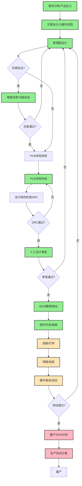

# AI硬件设计工具生态深度洞察报告
## ——基于《10个AI硬件设计常用网站》的系统分析

---

## 重要声明

本报告基于微信公众号文章《一定要收藏！10个AI硬件设计的常用网站！》中对10个工具的一句话简介进行系统分析，**未对任何工具进行实际下载、安装或功能测试**。所有分析结论受限于原始信息的深度——原文为清单式一句话介绍，缺乏详细功能列表、定价信息、用户案例、实测数据等深度资料。

报告中超出原文描述的内容均标注为`[推断]`，为基于工具名称、定位、所属公司背景、行业常识等做出的合理推论，非原文明确提及，实际情况请以各工具官网和实际使用体验为准。

本报告仅作为行业趋势分析和工具选型参考，不构成任何购买建议或产品背书。

---

## 一、文章基本信息

| 项目 | 内容 |
|---|---|
| **文章标题** | 《一定要收藏！10个AI硬件设计的常用网站！》 |
| **作者** | 硬件狗哥 |
| **来源** | 微信公众号 |
| **发布时间** | 2026年7月8日 |
| **原文URL** | https://mp.weixin.qq.com/s/YAm3b7kKkAPbFKgPpsTRVA |
| **分析对象** | 文章中介绍的10个AI硬件设计工具 |

---

## 二、执行摘要

2026年，AI正在以前所未有的速度渗透到硬件设计领域。微信公众号文章《一定要收藏！10个AI硬件设计的常用网站！》中盘点的10个工具，覆盖了从专业企业级PCB设计到创客级快速原型的完整用户分层，标志着"自然语言→硬件设计"新范式正在从概念走向落地。这10个工具包括：Quilter AI（前SpaceX团队打造的物理驱动PCB设计平台）、Blueprint（3E8 Robotics推出的文字生成全套量产方案平台）、Flux.ai（嵌入式PCB AI助手）、hardware.dog（AI设计审查平台）、tinkered.ai（创客级全流程平台+3D渲染）、protoflow.ai（唯一免费本地桌面软件）、DeepPCB（InstaDeep推出的8层板全自动布线工具）、Cirkit Designer（云端AI电路仿真+固件导出）、CIRCUIT MIND（专业团队分钟级方案生成）、Schematik（初学者文字生成接线图+Arduino/ESP32固件）。

**核心洞察包括**：第一，工具矩阵呈现清晰的"两级分层"——专业企业级（6-7个工具）和创客入门级（3-4个工具），中间地带相对薄弱；第二，"物理驱动AI"正在成为专业工具的核心竞争力，区别于纯数据驱动的大模型方法；第三，9/10工具为云端SaaS，protoflow.ai作为唯一免费本地工具形成独特差异化；第四，PCB布线、方案生成、设计审查已形成较强覆盖，但SI/EMC仿真、DFM分析、测试方案生成等量产关键环节仍属空白；第五，AI角色定位呈现光谱化分布——从对初学者的"近乎替代者"到对资深工程师的"高效协作者"，而非简单的"替代"叙事。

**关键趋势判断**：未来3-5年，AI硬件设计工具将经历从"单点工具"到"端到端平台"的整合，"物理驱动AI"将成为核心技术壁垒，人机协作的"Copilot+全自动"双模式将成为主流形态，AI将从"设计环节"向"供应链/DFM/系统级"延伸，传统EDA厂商将通过收购或集成AI功能应对挑战。硬件设计的门槛正在从"专家专属"向"大众可及"迁移——这将催生创客运动第三次浪潮，使"一人硬件公司"成为可能，但量产级高可靠设计仍需专业知识把关。

---

## 三、10个AI硬件设计工具总览

### 3.1 工具总览对比表

| 序号 | 工具名称 | URL | 核心功能 | 主要目标用户 | 部署方式 | 价格特点 |
|---|---|---|---|---|---|---|
| 1 | Quilter AI | https://www.quilter.ai/ | 前SpaceX工程师打造，物理驱动AI完成原理图转量产PCB复杂主板设计，工时较人工压缩九成 | 专业电子团队、企业级 | 云端 | 未明确 |
| 2 | Blueprint | https://www.blueprint.am/ | 3E8 Robotics推出的AI硬件平台，输入文字即可自动生成全套可量产硬件设计方案 | 专业电子团队、企业级 | 云端SaaS | 未明确 |
| 3 | Flux.ai | https://www.flux.ai/ | 嵌入项目的专用PCB硬件AI助手，能读懂工程组件，全程提供专业设计协助 | 专业电子工程师 | 云端SaaS | 未明确 |
| 4 | hardware.dog | https://www.hardware.dog/ | AI硬件分析平台，可极速审查原理图PCB，查找硬件错误并辅助优化设计提升效率 | 专业电子团队、硬件工程师 | 云端SaaS | 未明确 |
| 5 | tinkered.ai | https://www.tinkered.ai/ | 面向创客，文字描述即可生成全套硬件方案，双仿真引擎搭配写实3D渲染直观验证电路 | 创客爱好者 | 云端 | 未明确 |
| 6 | protoflow.ai | https://www.protoflow.ai/ | 免费桌面软件，带AI原理图生成，支持多商城元件导入校验导出KiCad，本地存储全核心功能免费 | 创客、专业工程师、全人群 | 本地桌面软件 | **免费** |
| 7 | DeepPCB | https://deeppcb.ai/ | InstaDeep推出的全自动AI布线工具，支持8层板千余引脚，兼容主流EDA软件，大幅缩短PCB开发周期 | 专业电子团队、企业级 | 云端 | 未明确 |
| 8 | Cirkit Designer | https://www.cirkitdesigner.com/ | 云端AI电路仿真平台免安装，全流程辅助设计仿真，一键导出物料与固件，适配各类嵌入式开发 | 嵌入式开发者、创客、专业团队 | 云端SaaS | 未明确 |
| 9 | CIRCUIT MIND | https://www.circuitmind.io/ | 面向专业电子团队，AI分钟级生成电路方案与分析文档，兼容主流EDA显著压缩硬件研发周期 | 专业电子团队 | 云端 | 未明确 |
| 10 | Schematik | https://www.schematik.io/ | 创客工具，输入文字即可生成接线图、BOM，同步产出Arduino、ESP32完整固件方案 | 创客爱好者、初学者 | 云端 | 未明确 |

### 3.2 整体工具矩阵特点

从整体看，这10个工具构成了一个相对完整但仍有明显空白的AI硬件设计工具体系：

1. **用户分层清晰**：从初学者（Schematik）→ 创客（tinkered.ai、protoflow.ai）→ 专业工程师（Flux.ai、CIRCUIT MIND）→ 企业级量产（Quilter AI、Blueprint、DeepPCB）形成梯度覆盖；
2. **功能覆盖不均**：方案生成、PCB布线、设计审查有多个工具竞争，但仿真、固件生成、DFM、测试等环节覆盖薄弱；
3. **部署方式高度集中**：9/10为云端SaaS，仅protoflow.ai为本地桌面软件，反映了AI工具云原生的主流趋势；
4. **商业模式不透明**：除protoflow.ai明确全核心功能免费外，其余9个工具均未公开定价，暗示多数仍处于早期阶段或采用企业定制销售模式；
5. **差异化策略明显**：各工具通过不同维度形成差异化——有的强调团队背景（SpaceX/InstaDeep/3E8 Robotics），有的强调技术路线（物理驱动/全自动/嵌入式助手），有的强调目标用户（创客/初学者/专业团队），有的强调部署模式（本地免费）。

---

## 四、工具分类与市场格局

### 4.1 功能维度分类

| 功能类别 | 主分类工具数 | 代表工具 | 覆盖程度 |
|---|---|---|---|
| PCB布局布线 | 1 | DeepPCB（主）、Quilter AI、Flux.ai、hardware.dog | 较强覆盖 |
| 原理图生成 | 1 | protoflow.ai（主）、Blueprint、Quilter AI、Flux.ai、tinkered.ai、CIRCUIT MIND、Schematik、hardware.dog | 强覆盖 |
| 设计审查(DRC) | 1 | hardware.dog（主）、Flux.ai、CIRCUIT MIND、protoflow.ai | 中等覆盖 |
| 电路仿真 | 1 | Cirkit Designer（主）、tinkered.ai | 薄弱覆盖（仅功能仿真） |
| 固件代码生成 | 1 | Schematik（主）、Cirkit Designer | 薄弱覆盖（仅Arduino/ESP32） |
| BOM生成 | 0 | Schematik、Cirkit Designer、Blueprint、tinkered.ai、protoflow.ai（均为附带） | 附带覆盖（无供应链深度） |
| 全流程平台 | 5 | Quilter AI、Blueprint、Flux.ai、tinkered.ai、CIRCUIT MIND | 强覆盖（不同层级） |

### 4.2 目标用户分层

| 用户层级 | 工具数量 | 代表工具 | 核心诉求 |
|---|---|---|---|
| 专业电子团队/企业级 | 6-7 | Quilter AI、Blueprint、Flux.ai、hardware.dog、DeepPCB、CIRCUIT MIND、Cirkit Designer | 量产级能力、EDA兼容性、效率提升、可靠性 |
| 创客爱好者 | 3-4 | tinkered.ai、Schematik、protoflow.ai、Cirkit Designer | 易用性、快速原型、低门槛、可视化 |
| 初学者/学生 | 2 | Schematik、tinkered.ai | 极低门槛、无需专业知识、即时反馈 |
| 全人群覆盖 | 1 | protoflow.ai | 免费、本地、开源生态兼容 |

### 4.3 部署方式与商业模式分析

**部署方式分布**：
- **云端SaaS（9个）**：Quilter AI、Blueprint、Flux.ai、hardware.dog、tinkered.ai、DeepPCB、Cirkit Designer、CIRCUIT MIND、Schematik
- **本地桌面软件（1个）**：protoflow.ai（全核心功能免费、本地存储）

**商业模式现状**：
- **明确免费（1个）**：protoflow.ai——唯一全核心功能免费且本地存储的工具
- **未明确（9个）**：其余9个工具官网未公开定价信息，推测可能采用Freemium（免费+付费）、企业定制、按使用付费等模式，需联系销售或注册后了解

### 4.4 市场分层格局总结

当前AI硬件设计工具市场呈现"哑铃型"格局：

- **高端（专业/企业级）**：竞争相对激烈，Quilter AI、Blueprint、DeepPCB、CIRCUIT MIND等工具从不同角度切入——有的走全链路垂直整合（Quilter），有的走单点极致（DeepPCB专注布线），有的强调EDA兼容性（DeepPCB、CIRCUIT MIND），有的强调自然语言入口（Blueprint）。这一领域的工具普遍强调"可量产""物理约束""企业级复杂度"。

- **低端（创客/入门级）**：也有多个参与者，Schematik、tinkered.ai等工具通过"文字生成""3D渲染""Arduino/ESP32固件"等特性降低门槛。这一领域强调易用性、即时反馈、快速看到成果。

- **中端（专业工程师日常工具）**：相对薄弱，Flux.ai的"嵌入式AI助手"定位是这一领域的代表，但整体来看连接"专业级能力"和"易用性"的中端工具较少——protoflow.ai的免费+本地+KiCad导出策略可能是填补中端空白的关键。

- **独特生态位**：protoflow.ai以"免费+本地+KiCad导出"占据了开源生态/隐私敏感/预算有限用户的独特生态位，在云端SaaS为主的市场中形成差异化。

---

## 五、各工具核心特点深度解析

以下按用户分层组织，突出各工具的差异化特点而非冗长描述。

### 5.1 专业/企业级工具

#### Quilter AI
- **核心价值**：前SpaceX工程师团队打造，物理驱动AI实现原理图→量产PCB全流程，工时压缩九成
- **技术亮点**："物理驱动AI"是核心差异化——区别于纯数据驱动布线，考虑信号完整性、EMC、热分布、阻抗控制等真实物理约束；航天级工程背景暗示高可靠性设计经验；直接面向量产而非原型
- **关键数据**：工时压缩90%
- **目标用户**：需要复杂主板设计的企业级硬件团队，航天/汽车/工业控制等高可靠性行业
- **市场定位**：专业/企业级最高端，全链路量产PCB设计平台

#### Blueprint
- **核心价值**：3E8 Robotics推出，自然语言文字输入→全套可量产硬件设计方案
- **技术亮点**：10个工具中最激进的"自然语言→硬件"范式践行者——不只生成单一环节，而是"全套可量产方案"（含原理图、PCB、BOM等）；机器人公司背景暗示机电一体化领域积累
- **目标用户**：有硬件产品想法但缺乏完整团队的创业者、产品经理、需要快速验证概念的企业
- **市场定位**：专业/企业级但门槛极低，处于设计流程最上游（需求→方案）

#### DeepPCB
- **核心价值**：AI公司InstaDeep（已被BioNTech收购）推出，全自动AI布线，支持8层板千余引脚，兼容主流EDA
- **技术亮点**：专注单一环节（布线）做到极致；专业AI公司背景而非硬件团队出身；明确强调EDA兼容性，可嵌入现有工作流而非要求平台迁移
- **关键数据**：支持8层板、千余引脚
- **目标用户**：进行高密度多层板设计的专业PCB工程师和企业团队
- **市场定位**：专业级布线加速器，现有EDA流程的增强插件

#### CIRCUIT MIND
- **核心价值**：面向专业电子团队，分钟级生成电路方案+分析文档，兼容主流EDA
- **技术亮点**：方案+分析文档双产出（解决设计文档编写痛点）；分钟级生成速度；专业团队定向，明确与创客工具区隔；EDA兼容性
- **关键数据**：分钟级生成
- **目标用户**：专业电子研发团队、需要快速产出方案评估的架构师
- **市场定位**：设计流程上游的方案加速器

#### Flux.ai
- **核心价值**：嵌入工程项目的专用PCB AI助手，能读懂工程组件，全程提供专业设计协助
- **技术亮点**："嵌入式AI助手"形态——类似GitHub Copilot在代码编辑器中的定位，AI与工程师协同工作而非替代；"能读懂工程组件"意味着理解元器件功能、参数、约束，而非仅连线关系；全程协作而非单环节介入
- **目标用户**：日常进行PCB设计的专业电子工程师，希望保留设计主导权同时提升效率
- **市场定位**：专业工程师的Copilot，人机协作为主

#### hardware.dog
- **核心价值**：AI硬件分析平台，极速审查原理图/PCB，查找错误并辅助优化
- **技术亮点**：10个工具中唯一以"设计审查"为核心主定位的工具，不做生成专注"找问题"；原理图+PCB双覆盖；不只是报错还提供优化建议
- **目标用户**：需要设计评审、质量把关的硬件工程师和团队，投板前审查
- **市场定位**：设计流程的"守门员"工具，与所有生成类工具互补

#### Cirkit Designer
- **核心价值**：云端免安装AI电路仿真平台，全流程辅助设计仿真，一键导出BOM+固件，适配嵌入式开发
- **技术亮点**：云端免安装；设计仿真一体化；物料+固件双导出；嵌入式方向优化
- **目标用户**：嵌入式开发者、需要电路仿真验证的创客和工程师
- **市场定位**：嵌入式系统开发的云端一体化平台，跨创客和专业层级

### 5.2 创客/入门级工具

#### tinkered.ai
- **核心价值**：面向创客，文字描述生成全套硬件方案，双仿真引擎+写实3D渲染直观验证
- **技术亮点**：创客专属定位精准；双仿真引擎提供全面验证；写实3D渲染（非简单2D原理图）直观展示物理形态；降低理解门槛
- **目标用户**：硬件创客、DIY爱好者、学生、需要快速原型验证的非专业人士
- **市场定位**：创客级全流程设计+仿真+可视化平台

#### Schematik
- **核心价值**：创客/初学者工具，文字输入生成接线图+BOM，同步产出Arduino/ESP32完整固件
- **技术亮点**：10个工具中最明确面向初学者；生成"接线图"而非专业"原理图"[推断]，更适合不熟悉电路理论的用户；不只是代码片段而是"完整固件方案"，可直接烧录运行；明确支持Arduino/ESP32两大最受创客欢迎的平台
- **目标用户**：硬件初学者、学生、Arduino/ESP32爱好者、非电子背景的程序员/艺术家
- **市场定位**：最低门槛的硬件编程入门工具，"想法→可运行项目"最快路径

### 5.3 全人群工具

#### protoflow.ai
- **核心价值**：免费桌面软件，AI原理图生成，多商城元件导入校验，导出KiCad，本地存储
- **技术亮点**：10个工具中**唯一本地桌面软件**（无需联网、数据本地）、**唯一全核心功能免费**；多电商平台元件导入解决采购可得性问题；元件校验避免使用不存在的元器件；原生支持KiCad导出对接开源EDA生态
- **目标用户**：注重成本的个人创客、开源硬件爱好者、KiCad用户、对数据隐私敏感的用户、预算有限的学生
- **市场定位**：开源EDA生态的AI增强前端，免费+本地形成独特差异化

---

## 六、AI硬件设计六大核心应用场景

### 6.1 场景一：自然语言需求→硬件方案快速生成

| 维度 | 说明 |
|---|---|
| **核心痛点** | 传统硬件设计启动门槛高，需要将产品需求"翻译"为专业工程语言；方案设计阶段耗时长（数天至数周）；非硬件背景人员无法独立完成 |
| **传统vs AI** | 传统：需求→工程师理解→查阅参考设计→手工绘制原理图→反复沟通（数天~数周） AI：输入自然语言描述→AI自动生成全套方案（分钟级） |
| **效率提升** | 方案生成从数天压缩至分钟级；非硬件背景人员可独立完成概念验证 |
| **代表工具** | Blueprint（专业/企业级）、tinkered.ai（创客）、Schematik（初学者） |
| **流程位置** | 最上游：需求分析→概念设计→方案生成 |

### 6.2 场景二：PCB自动布局布线

| 维度 | 说明 |
|---|---|
| **核心痛点** | PCB布局布线是最耗时、最依赖经验的环节；复杂多层板需要资深工程师数天至数周；布线质量直接影响信号完整性和可靠性 |
| **传统vs AI** | 传统：手工放置元器件→手工规划路径→反复调整→DRC（复杂主板1~4周） AI：输入原理图/网表→AI全自动布线（考虑物理约束）→人工审核微调（小时级~天级） |
| **效率提升** | Quilter AI宣传工时压缩90%；DeepPCB支持8层板千余引脚 |
| **代表工具** | Quilter AI（全链路物理驱动）、DeepPCB（单点极致布线）、Flux.ai（辅助协作） |
| **流程位置** | 中游：详细设计阶段 |

### 6.3 场景三：设计审查与错误检测（AI-DRC）

| 维度 | 说明 |
|---|---|
| **核心痛点** | 人工审查耗时费力易遗漏；传统DRC仅能检查规则化问题，无法发现逻辑连接错误、选型不当等深层问题；投板后发现问题成本极高 |
| **传统vs AI** | 传统：自查→交叉审查→checklist→传统DRC（仍可能遗漏逻辑错误） AI：上传设计→AI极速审查（原理图+PCB）→错误报告+优化建议（秒级~分钟级） |
| **效率提升** | 审查速度从数小时~数天压缩至分钟级；可发现人工易遗漏的隐患；降低投板失败率 |
| **代表工具** | hardware.dog（专注审查）、Flux.ai（全程辅助隐含审查） |
| **流程位置** | 中下游：设计验证阶段（投板前） |

### 6.4 场景四：AI辅助电路仿真与验证

| 维度 | 说明 |
|---|---|
| **核心痛点** | 传统SPICE仿真设置复杂、学习曲线陡；仿真结果解读需深厚理论基础；创客和初学者难以独立完成 |
| **传统vs AI** | 传统：搭建仿真环境→选择模型→设置激励→运行→分析波形（需专业知识） AI：AI辅助仿真→双引擎验证→3D可视化→直观反馈（降低门槛） |
| **效率提升** | 仿真设置自动化；结果解读智能化；3D可视化降低理解门槛 |
| **代表工具** | Cirkit Designer（云端专业仿真）、tinkered.ai（双仿真+3D渲染） |
| **流程位置** | 中上游：设计验证阶段 |

### 6.5 场景五：BOM生成与固件代码一体化输出

| 维度 | 说明 |
|---|---|
| **核心痛点** | 设计完成后手工整理BOM、编写固件存在大量机械重复劳动；BOM与原理图可能不一致；固件与硬件不匹配 |
| **传统vs AI** | 传统：设计→手工导出BOM→查询价格/库存→手写/移植固件→调试（割裂流程易出错） AI：设计完成→一键导出BOM→自动生成可运行固件→直接采购和烧录 |
| **效率提升** | 消除"最后一公里"断层；BOM自动生成避免人为错误；固件大幅缩短软件开发周期 |
| **代表工具** | Schematik（Arduino/ESP32完整固件）、Cirkit Designer（物料+固件导出） |
| **流程位置** | 下游：设计交付阶段 |

### 6.6 场景六：AI嵌入式设计助手（人机协作）

| 维度 | 说明 |
|---|---|
| **核心痛点** | 全自动工具可能生成不符合意图的设计；全新平台迁移成本高；工程师希望保留主导权同时提升效率 |
| **传统vs AI** | 传统：工程师独立完成全部设计，工具仅提供基础编辑 AI：AI嵌入设计环境，理解工程组件，全程提供建议、检查、自动完成，工程师保持决策权 |
| **效率提升** | 保留主导权的同时提升效率；降低迁移成本；AI能力按需调用 |
| **代表工具** | Flux.ai（嵌入式PCB AI助手）、protoflow.ai（本地AI原理图辅助） |
| **流程位置** | 贯穿全流程 |

### 6.7 硬件开发流程AI覆盖图

**图例说明**：🟢 绿色=AI已覆盖/有工具支持，🟡 黄色=AI部分覆盖/薄弱环节，🔴 红色=AI尚未覆盖

### 6.8 已覆盖环节与空白环节识别

| 开发阶段 | AI覆盖程度 | 说明 |
|---|---|---|
| 需求分析→方案设计 | ✅ 强覆盖 | Blueprint、CIRCUIT MIND、tinkered.ai、Schematik |
| 原理图设计 | ✅ 强覆盖 | protoflow.ai、Flux.ai、Quilter AI、CIRCUIT MIND |
| 电路仿真 | ⚠️ 覆盖中 | 仅功能仿真，缺SI/PI/EMC/热仿真 |
| PCB布局布线 | ✅ 强覆盖 | DeepPCB、Quilter AI、Flux.ai |
| 设计审查(DRC) | ✅ 有覆盖 | hardware.dog（逻辑错误检查） |
| BOM生成 | ⚠️ 附带覆盖 | 多数工具附带，缺供应链深度集成 |
| 固件开发 | ⚠️ 覆盖中 | 仅Arduino/ESP32等创客平台 |
| 投板/打样/焊接 | 🟡 物理环节 | 无直接AI工具 |
| 硬件调试/测试 | 🔴 未覆盖 | 无工具支持 |
| DFM/DFA可制造性分析 | 🔴 未覆盖 | 无工具明确支持 |
| 量产测试方案 | 🔴 未覆盖 | 无工具支持 |

---

## 七、范式转变：从手动操作到自然语言生成

### 7.1 传统EDA vs AI辅助模式对比

| 维度 | 传统EDA模式 | AI辅助模式 | 范式转变本质 |
|---|---|---|---|
| **交互入口** | 图形界面、菜单、工具栏、快捷键 | 自然语言文本/对话为主，图形界面退化为精细调整 | "操作工具"→"描述意图" |
| **设计主体** | 工程师为绝对主体，工具是"电子图板" | AI生成+人审核/微调，人机协作 | "人做设计"→"AI设计+人把关" |
| **知识来源** | 工程师大脑、数据手册、参考设计 | AI预训练知识+设计知识库 | "知识在人脑"→"知识在模型" |
| **启动门槛** | 需多年专业训练（电路理论、EDA操作、元器件知识） | 能清晰描述需求即可启动 | "专家专属"→"大众可及" |
| **迭代方式** | 手工修改→仿真→再修改（慢循环） | AI快速生成多方案→选择优化（快循环） | "慢迭代"→"快探索" |
| **错误发现时机** | 后期DRC、仿真、甚至投板后 | AI早期审查+仿真前置验证 | "后期救火"→"前期预防" |
| **输出产物** | 需手工整理BOM、同步编写固件 | 设计完成即同步输出BOM+固件 | "交付物分离"→"一体化输出" |
| **工具切换成本** | 高（不同环节不同工具，格式转换） | 低（一体化平台或AI串联） | "多工具割裂"→"端到端流程" |

### 7.2 对开发门槛、周期、创新速度的影响

#### 对开发门槛的影响——从"专家专属"到"大众可及"

| 用户层级 | 传统门槛 | AI时代门槛 | 影响程度 |
|---|---|---|---|
| 初学者/学生 | 需要2-4年系统学习才能做简单设计 | 会打字描述需求即可获得可运行项目（Schematik） | ⭐⭐⭐⭐⭐ 革命性降低 |
| 创客/爱好者 | 需要掌握KiCad/Altium、电路知识、基础编程 | 文字描述+3D可视化即可生成方案（tinkered.ai） | ⭐⭐⭐⭐ 大幅降低 |
| 产品经理/创业者 | 必须依赖硬件团队，无法独立验证概念 | 可用Blueprint自然语言生成量产级方案 | ⭐⭐⭐⭐ 从0到1突破 |
| 专业工程师 | 已具备专业能力，工具是效率瓶颈 | AI作为助手提升效率，仍需专业知识审核 | ⭐⭐ 效率提升而非门槛降低 |

**重要边界**："能做出东西"≠"能做好东西"——量产级高可靠设计仍需专业知识，AI降低的是入门门槛而非专业天花板。

#### 对开发周期的影响——从"数周/数月"到"数天/数小时"

| 环节 | 传统周期 | AI辅助周期 | 压缩比例 |
|---|---|---|---|
| 方案生成 | 3-7天 | 分钟级 | 99%+ |
| PCB布线（复杂板） | 1-4周 | 数小时~数天 | 90%（Quilter宣传） |
| 设计审查 | 0.5-2天 | 分钟级 | 95%+ |
| BOM整理 | 0.5-1天 | 即时生成 | 90%+ |
| 创客原型固件 | 1-3天 | 即时生成可运行代码 | 95%+ |
| **概念到原型整体** | **2-8周（创客）/1-3月（企业）** | **数天~1周（预估）** | **70-90%** |

**关键提醒**：AI缩短的是"办公室里的设计时间"，不是"工厂里的打样/焊接/调试时间"——物理制造环节的时间无法压缩。

#### 对创新速度的影响——从"线性积累"到"组合爆炸"

1. **探索成本降低→方案空间扩大**：AI分钟级生成多个方案，可低成本比较权衡，探索人类工程师因时间限制不会尝试的方案
2. **跨领域融合门槛降低**：非硬件专家也能做出可用设计，促进"软件人做硬件""机械人做电子"的跨界创新
3. **知识民主化→创新主体扩大**：创新从"少数大公司"走向"海量个人/小团队"，类似移动App生态爆发

### 7.3 AI角色定位：分层协作者而非简单替代

AI在硬件设计中的角色不是非黑即白的"替代者"或"辅助者"，而是**按环节和用户分层的协作者**：

| 设计环节 | AI角色 |
|---|---|
| 需求→方案生成（简单场景） | 接近替代者（标准参考设计可独立生成） |
| PCB布线 | 强自动化+人审核（常规布线AI完成，关键信号人工把关） |
| 设计审查 | 高效辅助者（快速发现问题，最终判断仍需工程师） |
| 电路仿真 | 辅助者（辅助设置解读，专业判断仍需人） |
| 原理图设计 | 协作者（Copilot模式，工程师主导） |
| BOM/固件（创客级） | 自动化生成+人验证 |
| 系统架构/创新设计 | 无替代能力（真正创新仍需人类创造力） |

| 用户群体 | AI角色 | 人机关系 |
|---|---|---|
| 初学者/学生 | 近乎替代者 | "AI做，我看/我学" |
| 创客/爱好者 | 主力+顾问 | "AI做初稿，我改/我调" |
| 专业工程师（常规任务） | 高效助手 | "我主导，AI干苦力" |
| 专业工程师（创新任务） | 顾问/参谋 | "我创意，AI辅助验证" |
| 架构师/技术负责人 | 方案生成器 | "我提要求，AI出方案供选择" |

**核心判断**：AI不会替代硬件工程师，但会重构工程师的工作内容——从"画图工"转向"决策者"：
- ❌ 不会被替代：架构设计、创新方案、关键决策、问题debug、系统思维
- ✅ 会被大幅减少：手工布线、重复绘图、BOM整理、常规审查、标准参考设计移植
- 📈 能力要求变化：从"会画板子"到"会定义问题、会评估AI方案、会做关键决策"

---

## 八、行业生态与趋势洞察

### 8.1 对硬件工程师工作方式的影响

#### 工作重心转移：从"画图工"到"决策者"

| 传统工程师时间分配 | AI时代工程师时间分配 |
|---|---|
| 40% 手工布局布线 | 10% AI布线审核微调 |
| 20% 原理图绘制/修改 | 10% AI方案评估/选择 |
| 15% 查错/DRC/审查 | 5% AI审查结果复核 |
| 10% BOM整理/文档 | 5% AI产出物验证 |
| 15% 设计决策/架构/创新 | 70% 系统设计/关键决策/创新/问题解决 |

#### 技能要求重新排序

| 技能 | 传统重要性 | AI时代重要性 | 变化 |
|---|---|---|---|
| EDA工具操作熟练度 | ⭐⭐⭐⭐⭐ | ⭐⭐ | ↓ 大幅下降 |
| 手工布线经验/技巧 | ⭐⭐⭐⭐⭐ | ⭐⭐ | ↓ 大幅下降 |
| 电路理论基础 | ⭐⭐⭐⭐ | ⭐⭐⭐⭐⭐ | ↑ 更加重要（判断AI结果需要） |
| 系统架构能力 | ⭐⭐⭐⭐ | ⭐⭐⭐⭐⭐ | ↑ 更加重要 |
| SI/EMC专业知识 | ⭐⭐⭐⭐ | ⭐⭐⭐⭐⭐ | ↑ AI无法替代的专业深度 |
| DFM/可制造性知识 | ⭐⭐⭐ | ⭐⭐⭐⭐⭐ | ↑ AI可能生成不可制造的设计 |
| AI结果鉴别能力 | ⭐ | ⭐⭐⭐⭐⭐ | 🆕 全新核心能力 |
| 需求定义/问题拆解 | ⭐⭐⭐ | ⭐⭐⭐⭐ | ↑ 会提问比会画板子更重要 |

**风险警示**：初级工程师如果过度依赖AI而不理解底层原理，可能沦为"AI操作员"而非真正的工程师——AI出了问题，没有扎实基础的人无法debug。

### 8.2 创客运动新浪潮：第三次浪潮

| 浪潮 | 标志事件 | 核心特点 | 门槛 |
|---|---|---|---|
| 第一次（2000s） | Arduino诞生 | 开源硬件平台，简化单片机开发 | 需要懂C编程、电路基础 |
| 第二次（2010s） | Raspberry Pi、3D打印、KiCad成熟 | 单板计算机+开源EDA+桌面制造 | 需要掌握CAD、基础电路设计 |
| **第三次（2020s）** | **AI硬件设计工具爆发** | **自然语言生成硬件+固件+BOM，3D可视化验证** | **会描述需求即可** |

AI将推动开源硬件生态发展：项目数量爆发式增长、项目复杂度提升、文档可复现性改善、硬件"Fork+修改"文化可能兴起。protoflow.ai作为免费本地工具+KiCad导出，将成为连接AI与开源EDA生态的关键桥梁。

### 8.3 硬件创业门槛变化："一人硬件公司"成为可能

| 创业门槛维度 | 传统硬件创业 | AI时代硬件创业 | 降低程度 |
|---|---|---|---|
| **团队门槛** | 需要硬件/PCB/固件工程师3-5人核心团队 | 1-2个懂产品/软件的创始人用AI就能做出原型 | ⭐⭐⭐⭐⭐ |
| **资金门槛（原型阶段）** | EDA license昂贵，首轮融资需数百万 | 云端工具免费/Freemium，protoflow.ai完全免费 | ⭐⭐⭐⭐⭐ |
| **时间门槛（原型）** | 想法到原型3-6个月 | 设计加速，整体1-2个月可出原型 | ⭐⭐⭐ 缩短60-70% |
| **知识门槛** | 需要懂硬件设计、固件、供应链 | AI辅助设计，但供应链/量产/认证仍需专业 | ⭐⭐⭐ |

**关键边界**：AI降低的是**原型设计门槛**，不是**量产门槛**：
- 想法→概念验证：⭐⭐⭐⭐⭐ 极大帮助
- 原型→工程样机：⭐⭐⭐ 较大帮助
- 工程样机→小批量试产：⭐⭐ 有限帮助（DFM、可靠性、认证AI帮不上太多）
- 小批量→大规模量产：⭐ 几乎无帮助（供应链、质量、成本、渠道与AI无关）

结论：硬件创业的"冷启动"变容易了，但从"原型"到"成功产品"的鸿沟依然存在。

### 8.4 传统EDA厂商的挑战与机遇

| EDA梯队 | 代表厂商 | 受冲击程度 |
|---|---|---|
| 第一梯队（高端三巨头） | Cadence、Synopsys、Mentor | ⭐⭐ 短期冲击小（芯片设计复杂度高） |
| 第二梯队（中端主流） | Altium Designer | ⭐⭐⭐⭐ 中期冲击较大（正是AI工具瞄准的市场） |
| 第三梯队（开源/免费） | KiCad、EasyEDA | ⭐⭐ 冲击小——protoflow.ai选择导出KiCad，是生态互补 |

**核心挑战**：商业模式颠覆风险（从license到SaaS）、交互范式颠覆（从GUI到自然语言）、云端原生vs桌面软件、人才基因挑战（传统EDA是工程软件公司，缺AI能力）。

**潜在机遇**：快速收购整合AI创业公司、在现有工具中集成AI助手（Copilot模式）、高端市场护城河仍在（SI/EMC/DFM/芯片设计）、几十年积累的元器件库/工艺文件/生态关系是初创公司短期无法复制的。

**演进路径预测**：
- 2024-2026：AI工具作为独立补充，创客和早期采用者使用
- 2026-2028：传统EDA集成AI助手功能，AI在常规场景证明价值
- 2028-2030：AI成为EDA标配，部分传统厂商掉队被收购
- 2030+：AI-native EDA成为主流

### 8.5 未来3-5年趋势判断

1. **从"单点工具"到"端到端平台"整合**：未来3年将出现整合，最终形成2-3个主流"AI硬件设计OS"覆盖全流程
2. **"物理驱动AI"成为核心竞争力**：纯数据驱动大模型会犯物理错误，将电路理论/电磁仿真/物理规则嵌入AI（Physics-informed neural networks）是关键方向
3. **人机协作收敛到"Copilot+全自动"双模式**：简单场景/标准模块全自动，复杂设计/关键路径Copilot辅助，两种模式长期共存
4. **供应链和DFM深度整合**：AI设计工具将与立创/DigiKey/Mouser等电商API深度整合，内置PCB厂工艺规则，实现"设计完就能生产"
5. **从PCB板级向芯片/系统级延伸**：向上延伸到FPGA/HDL/芯片设计辅助，向下延伸到结构设计/3D打印/软件框架生成
6. **开源AI EDA出现**：类似KiCad在开源EDA的地位，3-5年内可能出现开源AI硬件设计工具/模型
7. **商业模式从"不透明"走向分层清晰**：个人/创客免费Freemium，专业工程师月费订阅（$20-$100/月），企业团队年订阅+私有化部署（$500-$5000/席位/年）

---

## 九、不同用户实用指南

### 9.1 专业硬件工程师建议

**推荐工具组合**：
| 需求场景 | 推荐工具 | 使用建议 |
|---|---|---|
| 提升布线效率 | DeepPCB、Quilter AI | 先用DeepPCB做非关键信号布线，关键信号手工绕等长；Quilter可尝试但务必人工审核信号质量 |
| AI辅助设计（不改变工作流） | Flux.ai、protoflow.ai | Flux.ai作为嵌入式助手；protoflow.ai本地免费，可作为KiCad的AI前端 |
| 投板前审查加一道保险 | hardware.dog | 在原有DRC和人工审查后，用hardware.dog再扫描一遍 |
| 快速方案探索 | CIRCUIT MIND | 新项目开始时分钟级生成参考方案，作为设计借鉴 |

**保守引入路径**：
1. 第1阶段（1-2个月）：只在非关键/个人项目试用，熟悉工具能力边界
2. 第2阶段（3-6个月）：将hardware.dog审查、protoflow.ai辅助等低风险环节引入工作流
3. 第3阶段（6个月+）：逐步尝试DeepPCB自动布线、CIRCUIT MIND方案参考，**关键设计（电源、高速信号、射频）始终坚持人工主导**

**核心禁忌**：不要一开始就在公司关键量产项目上用全自动工具。

**重要提醒**：把AI当作"勤快但经验不足的实习生"——能帮你干大量跑腿活，但做的东西你必须检查签字负责。

### 9.2 创客/爱好者建议

**入门推荐（按优先级）**：
| 优先级 | 工具 | 推荐理由 |
|---|---|---|
| ⭐第一优先（必试） | protoflow.ai | 免费！本地！能导出KiCad！零成本零风险开始 |
| ⭐第二优先 | Schematik | 玩Arduino/ESP32最直接——文字→接线图+BOM+可运行固件，马上看到成果 |
| ⭐第三优先 | tinkered.ai | 双仿真+3D渲染，适合先仿真验证再做实物 |
| 按需尝试 | Cirkit Designer | 嵌入式项目多可试试云端仿真和一键导出 |

**创客特别提醒**：
1. AI生成的电路第一次打样**不要期望一次成功**——1-2次迭代是正常的，保持实验心态
2. AI生成的固件大概率需要微调，准备好自己改代码
3. 优先用AI做"80%的基础工作"，剩下20%个性化和调试自己来——这样学习效果最好
4. 用AI做出东西后，尝试理解它为什么这么设计——多问"为什么"

### 9.3 学生/初学者建议

**学习路径（不要跳过基础！）**：
1. **阶段1：打好基础**——先学习电路基础、数电模电，不要因为有AI就跳过理论。连电阻电容串并联都不懂，AI生成的电路你根本看不懂对错
2. **阶段2：从入门工具开始**——用Schematik做第一个Arduino项目，对照AI生成的接线图和代码逐行理解，不要只点按钮
3. **阶段3：过渡到专业工具**——protoflow.ai生成原理图→导出KiCad→学习KiCad基本操作，对比自己画的和AI生成的差异
4. **阶段4：项目实践迭代**——用AI辅助完成课程设计，遇到问题先自己思考再看AI怎么解决

**学生特别提醒**：⚠️ **作业/课程设计不要直接交AI生成的结果**——正确用法：AI生成→自己理解→自己重写修改→加上自己的思考→再提交。现在偷懒依赖AI，找工作时会还债。

### 9.4 硬件创业者建议

**MVP验证推荐工作流**（约45天）：
1. Day 1-3：Blueprint/CIRCUIT MIND快速生成2-3个概念方案，评估可行性
2. Day 4-10：protoflow.ai/Flux.ai细化原理图，tinkered.ai/Cirkit Designer仿真验证
3. Day 11-20：DeepPCB尝试自动布线（关键信号手工调整），hardware.dog全面审查
4. Day 21-35：导出Gerber投板，Schematik/Cirkit Designer生成基础固件
5. Day 36-45：收到板子焊接调试，记录问题下次迭代

**人员配置建议**：从传统的"硬件总监+2硬件+1 PCB+2固件"（6人），可精简为"1资深硬件专家+1固件/嵌入式"（2人），人力成本降低约50%。

**关键注意事项**：
1. AI可以帮你做原型，但**量产一定要找有经验的人**——DFM、EMC认证、可靠性测试AI帮不上忙
2. 注意知识产权归属——云端AI工具生成的设计IP归谁？仔细看用户协议
3. 不要过度宣传"AI设计"——AI是工具不是卖点，产品解决用户问题才是卖点

### 9.5 通用注意事项

#### AI生成结果验证checklist（投板前必查）

- [ ] **电源部分**：电源树是否合理？去耦电容是否齐全？电压电流是否满足要求？（AI最容易在电源部分出错）
- [ ] **关键引脚连接**：MCU/芯片的电源、地、复位、编程引脚是否都正确连接？
- [ ] **元器件选型合理性**：电阻电容功率/耐压是否足够？BOM中的元器件是否真的能买到？
- [ ] **接口电平匹配**：不同电压域之间是否有电平转换？3.3V和5V是否混接？
- [ ] **DRC检查**：AI生成的板子也要跑一遍传统DRC
- [ ] **可制造性**：最小线宽孔径是否符合PCB厂能力？
- [ ] **第一版打样**：建议只打5-10片验证，不要直接打几十上百片
- [ ] **调试准备**：准备好0欧电阻/飞线，AI第一版大概率需要飞线修改

#### 数据安全建议

| 场景 | 建议 |
|---|---|
| 公司机密项目 | 不要上传云端SaaS；用本地工具protoflow.ai，或等企业私有化部署 |
| 个人/开源项目 | 云端工具没问题，注意不要上传包含密钥/账号的设计 |
| 未公开创新产品 | 关键核心设计不建议使用云端AI，避免泄露 |
| 使用云端工具前 | 阅读隐私政策，确认设计是否会被用于训练、数据存储位置 |

#### 知识产权注意事项

1. AI训练数据可能包含已有设计，重要产品做专利检索，不要完全依赖AI做"原创"设计
2. AI生成内容的版权归属法律尚不明确，对核心创新点做人工修改增加人类创造性贡献比例
3. 商用产品咨询知识产权律师，开源项目注意许可证兼容性

---

## 十、内容策略与传播分析

### 10.1 内容类型与写作策略

**内容定位**：垂直领域实用工具盘点/干货收藏类内容——"X个常用网站/工具"合集型干货，编号列表式（1-10），每个工具配URL+一句话简介。

**标题传播设计**：《一定要收藏！10个AI硬件设计的常用网站！》
- "一定要收藏！"：祈使句+感叹号制造紧迫感和行动召唤，利用损失厌恶心理
- 数字"10个"：具体数字比模糊表述更有吸引力，给读者明确预期
- "AI硬件设计"：精准垂直关键词，命中搜索需求和热点
- "常用网站"：降低心理预期，暗示无需安装、打开即用
- 感叹号结尾：制造情绪感染力

**写作策略亮点**：
1. **数字编号结构**：降低阅读压力、结构化预期、易定位、提升完读率、便于传播引用
2. **一句话简介模式**：信息密度极高（背景背书+技术特点+功能范围+核心价值），让读者快速决策
3. **"收藏"导向设计**：工具类文章天然适合收藏，收藏是比点赞更强的认可信号，影响算法推荐且带来长尾流量

### 10.2 目标受众分析

| 受众分层 | 画像特征 | 阅读动机 |
|---|---|---|
| 第一层（核心）：硬件工程师 | 22-35岁，企业做硬件开发，用Altium/KiCad | 职业焦虑+效率提升——怕被AI淘汰，想找少加班的工具 |
| 第二层：创客/电子爱好者 | 18-40岁，玩Arduino/ESP32/树莓派，喜欢DIY | 兴趣驱动+工具猎奇——发现新玩具加速项目 |
| 第三层：创业者/产品经理 | 25-40岁，有硬件想法或正在创业 | 信息收集——找快速原型、降成本的工具 |
| 第四层：学生/在校学习者 | 18-25岁，电子相关专业 | 学习+求职——提前了解行业方向 |
| 第五层：泛科技爱好者 | 不限职业 | 猎奇——"AI都能设计硬件了？"看热闹 |

**受众核心特征**：垂直精准（硬件圈）、男性为主（80%+）、有付费能力/意愿、理性决策、圈层传播明显。

**传播路径**：公众号发布→粉丝收藏→转发到工程师群/创客群/朋友圈→群内二次传播→搜一搜收录带来长尾流量→可能被转载扩散。

### 10.3 优缺点评价

**优点**：
1. 定位精准：切中"AI+硬件设计"热点+垂直交叉点，选题踩准时间点
2. 结构清晰：数字列表+一句话简介+URL，符合移动端快速阅读
3. 实用价值明确：每个工具给URL，看完就能点进去试
4. 标题内容匹配：不标题党、不夸大，建立信任感
5. 亮点提炼到位："工时压缩九成""8层板""免费"等核心卖点都提炼出来
6. 覆盖全面分层：从专业到入门都有覆盖，不同读者都能找到适合自己的

**可改进之处**：
1. 缺乏分类导航：10个工具平铺直叙，没有按"专业/创客"分类，新读者不知道从哪个开始
2. 没有使用建议：只是列工具，没说"谁适合用哪个""怎么组合使用"
3. 价格信息缺失：9个工具定价不明确，若能补充免费/付费信息对决策帮助更大
4. 缺乏深度使用体验：没有作者主观感受和优缺点评价，降低了KOL意见价值
5. 没有提及风险注意事项：AI可能生成错误设计、云端数据安全等问题未提及
6. 缺乏工具对比：10个工具之间什么关系、能否组合使用没有说明

**整体评分（10分制）**：
- 作为公众号传播内容：9/10——选题准、结构清、易传播、价值明确
- 作为深度指南/评测：5/10——只有清单没有深度、分类、评价、建议
- 定位匹配度：从"一定要收藏的工具清单"定位出发，完成度很高

**核心成功原因**：在正确的时间（AI落地各行各业），用正确的形式（数字列表+一句话+URL），给正确的受众（硬件圈），提供了正确的价值（有用的工具清单）。

---

## 十一、工具矩阵空白与机会点

### 11.1 功能空白

| 空白领域 | 现状说明 | 机会价值 |
|---|---|---|
| **SI/PI/EMC仿真分析** | 仅功能仿真，无信号完整性/电源完整性/电磁兼容性仿真 | 高速数字设计（USB 3.0、PCIe、DDR）量产必需，专业壁垒高 |
| **热仿真与热设计** | 无工具提及热分析 | 大功率电路、电源设计必需 |
| **DFM/DFA可制造性分析** | 工具宣传"可量产"但无DFM工具化支持 | 连接设计与制造的关键桥梁，避免AI生成设计不符合工厂工艺 |
| **硬件调试与测试** | 无工具支持调试、故障诊断、测试点设计、测试程序生成 | 设计→制造→调试链条中，调试仍完全依赖人工 |
| **FPGA/HDL设计** | 所有工具聚焦PCB板级，未覆盖芯片/FPGA前端 | 数字逻辑设计、Verilog/VHDL生成是独立广阔市场 |
| **射频(RF)/模拟精密电路** | 无工具面向RF、高频、精密模拟电路 | 通信、射频、高精度测量领域专业化需求 |
| **版本控制与团队协作** | 无工具明确强调硬件设计版本控制、多人实时协作、评审流程 | 企业级团队协作刚需，类似Git for Hardware |

### 11.2 用户空白

| 空白用户群 | 现状说明 | 机会价值 |
|---|---|---|
| **教育/学术场景专属** | Schematik/tinkered.ai适合初学者，但无面向高校教学、实验课程、作业批改的专属工具 | 教学场景需要循序渐进引导、教学管理等功能，与通用创客工具不同 |
| **中端专业工程师日常工具** | 高端企业级和低端创客级都有工具，连接"专业能力"和"易用性"的中端工具相对薄弱 | 最大体量的日常工作群体，需求未被充分满足 |

### 11.3 生态空白

| 空白领域 | 现状说明 | 机会价值 |
|---|---|---|
| **企业私有化部署** | 仅protoflow.ai是个人桌面软件，无企业级本地/私有云部署方案 | 国防、航天、金融等数据敏感行业刚需 |
| **开源AI EDA工具** | protoflow.ai免费但未开源，其余均为闭源SaaS | KiCad等开源EDA生态强大，AI增强层缺乏开源工具 |
| **透明分层定价** | 9/10工具定价不透明 | 定价透明是企业采购的前提，Freemium/订阅/企业license分层清晰化是机会 |
| **传统EDA插件形态** | DeepPCB/CIRCUIT MIND提到"兼容主流EDA"，但插件形态、集成深度不明确 | 硬件工程师有深厚工具使用习惯，插件形式采用阻力远低于全新平台 |
| **PLM/ERP系统集成** | 无工具提到与产品生命周期管理、企业资源规划系统集成 | 企业级研发需要与现有PLM/ERP对接（BOM同步、变更管理、流程审批） |
| **供应链深度集成** | BOM仅为附带功能，无实时价格/库存/替代料推荐 | 生成设计时实时查询供应链信息，真正实现"设计完就能采购生产" |

### 11.4 已覆盖但薄弱的环节

| 功能领域 | 当前工具数 | 薄弱点 |
|---|---|---|
| 电路仿真 | 2个 | 仅简单功能仿真，缺专业级SI/PI/热仿真 |
| 固件代码生成 | 2个 | Schematik限定Arduino/ESP32，缺STM32/RISC-V/工业级MCU支持 |
| BOM与供应链 | 5个（均为附带） | 无供应链深度集成（价格/库存/替代料） |
| 设计审查(DRC) | 4个（仅hardware.dog为主） | 审查能力描述笼统，缺可配置自定义规则库 |
| 本地部署 | 1个 | 仅个人桌面软件，缺企业级本地方案 |

---

## 十二、结语

AI硬件设计工具在2026年的集中爆发，标志着硬件开发领域正在经历一场类似"GitHub Copilot对软件开发"的范式变革。从这10个工具的分析中，我们可以看到几个确定性的趋势：

**第一，门槛降低是确定性的，但专业价值不会消失。** 自然语言交互将硬件设计从"需要多年训练的专家技能"转变为"大众可尝试的创造工具"，这将释放巨大的创新活力——创客运动第三次浪潮、"一人硬件公司"、跨领域创新都将成为现实。但同时，量产级高可靠设计所需要的电路理论、SI/EMC知识、DFM经验、系统思维能力不仅不会贬值，反而会因为需要"鉴别AI结果"而变得更加重要。AI会淘汰"画图工"，但不会淘汰真正的硬件工程师——工程师的工作重心将从"操作工具"转向"定义问题、做出判断、解决关键问题"。

**第二，当前工具矩阵仍处于早期阶段，机会巨大。** 方案生成、PCB布线、设计审查已经有多个工具竞争，但SI/EMC仿真、DFM分析、测试生成、供应链深度集成、企业级协作、私有化部署等关键环节仍属空白；市场呈现"哑铃型"结构，高端企业级和低端创客级都有覆盖，但体量最大的中端专业工程师日常工具仍有巨大机会；9/10工具是云端SaaS且定价不透明，说明市场远未成熟，未来3-5年将经历激烈的整合和洗牌。

**第三，"物理驱动AI"是专业工具的核心竞争力。** 纯数据驱动的大模型方法在自然语言处理、代码生成领域取得了巨大成功，但硬件设计是与物理世界打交道的领域——信号完整性、电磁兼容、热分布、阻抗控制都遵循严格的物理规律，仅靠"从数据中学习"会产生违反物理常识的"幻觉错误"。将电路理论、物理规则、电磁仿真嵌入AI模型（Physics-informed AI），是专业级工具区别于"玩具级"工具的核心分水岭。

**第四，人机协作而非替代，是长期的主流形态。** AI不会简单地"替代"硬件工程师，而是会以分层协作的方式融入设计流程——对初学者和简单场景，AI可以近乎独立完成；对常规布线、审查、BOM整理等机械劳动，AI是高效的自动化工具；对系统架构、创新设计、关键决策，AI是提供方案选项和验证支持的参谋。工具形态上，Flux.ai代表的"Copilot嵌入式助手"和Quilter/DeepPCB代表的"全自动生成"将长期共存，服务于不同场景和不同用户。

**第五，传统EDA厂商不会坐以待毙，但转型挑战巨大。** Cadence/Synopsys/Mentor在芯片设计和高端仿真领域的护城河短期难以撼动，Altium等中端板级工具将面临AI原生工具的直接冲击。未来3年很可能看到传统EDA巨头收购AI创业公司、在现有工具中集成AI Copilot功能，但交互范式从GUI到自然语言的转变、商业模式从license到SaaS的转型、AI人才基因的缺失，都是传统厂商需要跨越的鸿沟。

对于从业者而言，这是最好的时代也是最需要警惕的时代——最好的时代在于AI可以帮你从机械重复劳动中解放出来，聚焦真正有创造性的工作；最需要警惕的是，如果只把AI当作"偷懒工具"而放弃基础能力的构建，可能会在行业变革中被淘汰。正确的态度是：**拥抱AI作为效率倍增器，同时扎实构建AI无法替代的核心能力——系统思维、物理直觉、问题debug能力、跨领域整合能力**。

对于创业者和投资者而言，当前AI硬件设计工具市场仍处于"早期大众"之前的阶段，空白点众多，差异化机会丰富——无论是做深耕某个垂直环节（如DFM/SI/EMC）的专精工具，还是做整合全流程的AI-native平台，还是做开源/本地/私有化部署方向，都有巨大的探索空间。

硬件是物理世界的基石，AI是数字世界的新引擎——两者的融合才刚刚开始，未来十年将是硬件创新的黄金时代。

---

## 附录：分析说明

**信息来源**：
- 原始文章：《一定要收藏！10个AI硬件设计的常用网站！》（硬件狗哥，微信公众号，2026-07-08）
- 工具官网：10个工具官方网站公开信息
- 整合分析基础：task2（工具分类体系）、task3（深度特点分析）、task4-8（场景/范式/生态/建议/传播分析）

**分析边界**：
- 本报告基于10个工具的一句话公开简介进行分析，未进行实际工具测试
- 标注`[推断]`的内容为基于行业常识和逻辑的合理推论，非原文明确提及
- 所有工具的实际功能、定价、效果请以各官网和实际使用为准
- 趋势判断为基于当前信息的前瞻性分析，未来实际发展可能有所不同

**报告生成时间**：2026年7月9日
