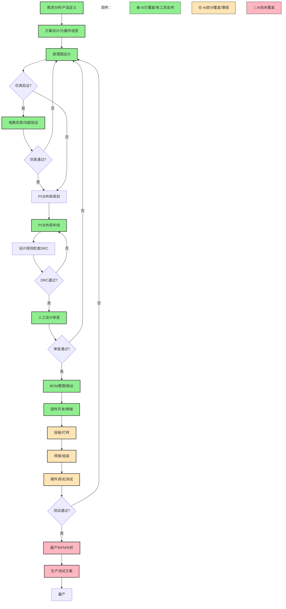

# AI硬件设计工具深度分析与洞察

&gt; **分析基础**：基于微信公众号文章《一定要收藏！10个AI硬件设计的常用网站！》（硬件狗哥，2026-07-08）中介绍的10个工具：Quilter AI、Blueprint、Flux.ai、hardware.dog、tinkered.ai、protoflow.ai、DeepPCB、Cirkit Designer、CIRCUIT MIND、Schematik，结合已完成的分类体系（task2）和深度分析（task3）成果。

---

## 一、AI硬件设计核心应用场景总结（Task 4）

### 1.1 核心应用场景识别（6大场景）

#### 场景1：自然语言需求→硬件方案快速生成

| 维度 | 说明 |
|---|---|
| **场景名称** | 自然语言驱动的硬件方案快速生成 |
| **AI解决的核心痛点** | 传统硬件设计启动门槛高，需要将产品需求"翻译"为电路拓扑、元器件选型、接口定义等专业工程语言，非硬件背景人员无法独立完成；方案设计阶段耗时长，从概念到初步方案通常需要数天至数周 |
| **传统方式 vs AI方式** | 传统：产品经理/创业者提出需求 → 硬件工程师理解需求 → 查阅参考设计 → 手工绘制原理图 → 反复沟通修改（周期：数天~数周）<br>AI：输入自然语言描述（如"设计一个带温湿度传感器的ESP32物联网节点"）→ AI自动生成全套方案（原理图/接线图+BOM+初步固件）（周期：分钟级） |
| **效率提升点** | 方案生成速度从数天压缩至分钟级；非硬件背景人员可独立完成概念验证；大幅降低前期沟通成本 |
| **代表性工具** | Blueprint（专业/企业级）、tinkered.ai（创客）、Schematik（初学者） |
| **在硬件开发流程中的位置** | **最上游：需求分析→概念设计→方案生成阶段** |

#### 场景2：PCB自动布局布线

| 维度 | 说明 |
|---|---|
| **场景名称** | AI驱动的PCB自动布局布线 |
| **AI解决的核心痛点** | PCB布局布线是硬件设计中最耗时、最依赖经验的环节，复杂多层板布线需要资深工程师数天至数周手工完成；布线质量直接影响信号完整性、EMC性能和产品可靠性 |
| **传统方式 vs AI方式** | 传统：工程师手工放置元器件 → 手工规划布线路径 → 反复调整优化 → DRC检查修正（复杂主板：1~4周）<br>AI：输入原理图/网表 → AI全自动布局布线（考虑物理约束）→ 人工审核微调（周期：小时级~天级） |
| **效率提升点** | Quilter AI宣传工时压缩九成（90%）；DeepPCB支持8层板千余引脚自动布线；大幅降低对资深布线工程师的依赖 |
| **代表性工具** | Quilter AI（全链路物理驱动）、DeepPCB（单点极致布线）、Flux.ai（辅助协作） |
| **在硬件开发流程中的位置** | **中游：详细设计阶段（原理图→PCB布局布线）** |

#### 场景3：设计审查与错误检测（AI-DRC）

| 维度 | 说明 |
|---|---|
| **场景名称** | AI辅助的设计审查与硬件错误检测 |
| **AI解决的核心痛点** | 人工审查原理图/PCB耗时费力且容易遗漏问题；传统DRC仅能检查规则化的间距、线宽等问题，无法发现逻辑连接错误、元器件选型不当、设计隐患等深层问题；投板前发现问题的成本远低于生产后 |
| **传统方式 vs AI方式** | 传统：工程师自查 → 同事交叉审查 →  checklist逐项检查 → 传统DRC规则检查（仍可能遗漏逻辑错误）<br>AI：上传设计文件 → AI极速审查（原理图+PCB）→ 输出错误报告+优化建议（速度：秒级~分钟级） |
| **效率提升点** | 审查速度从"数小时~数天"压缩至"分钟级"；可发现人工容易遗漏的设计隐患；降低投板失败率，减少返工成本 |
| **代表性工具** | hardware.dog（专注审查）、Flux.ai（全程辅助隐含审查） |
| **在硬件开发流程中的位置** | **中下游：设计验证阶段（投板前审查）** |

#### 场景4：AI辅助电路仿真与验证

| 维度 | 说明 |
|---|---|
| **场景名称** | AI增强的电路仿真与功能验证 |
| **AI解决的核心痛点** | 传统SPICE仿真设置复杂、学习曲线陡峭；仿真结果解读需要深厚的电路理论基础；创客和初学者难以独立完成仿真验证 |
| **传统方式 vs AI方式** | 传统：搭建仿真环境 → 选择元器件模型 → 设置激励源 → 运行仿真 → 分析波形（需要专业知识）<br>AI：在设计环境中直接AI辅助仿真 → 双引擎验证 → 3D可视化渲染 → 直观反馈结果（降低专业门槛） |
| **效率提升点** | 仿真设置自动化；结果解读智能化；3D可视化降低理解门槛；无需安装专业仿真软件 |
| **代表性工具** | Cirkit Designer（云端专业仿真）、tinkered.ai（双仿真+3D渲染） |
| **在硬件开发流程中的位置** | **中上游：设计验证阶段（原理图→仿真验证）** |

#### 场景5：BOM生成与固件代码一体化输出

| 维度 | 说明 |
|---|---|
| **场景名称** | 从设计到可交付物（BOM+固件）的一体化生成 |
| **AI解决的核心痛点** | 传统流程中，设计完成后还需要手工整理BOM、编写/移植固件代码，存在大量机械重复劳动；BOM与原理图可能不一致；固件与硬件不匹配等问题 |
| **传统方式 vs AI方式** | 传统：设计完成 → 手工导出整理BOM → 查询元器件价格/库存 → 根据硬件平台手写/移植固件 → 调试（割裂流程，容易出错）<br>AI：设计完成后一键导出BOM → 自动生成对应平台（Arduino/ESP32）可运行的完整固件 → 直接采购和烧录 |
| **效率提升点** | 消除从设计到可实现之间的"最后一公里"断层；BOM自动生成避免人为错误；固件生成大幅缩短软件开发周期 |
| **代表性工具** | Schematik（Arduino/ESP32完整固件）、Cirkit Designer（物料+固件导出） |
| **在硬件开发流程中的位置** | **下游：设计交付阶段（输出生产/编程文件）** |

#### 场景6：AI嵌入式设计助手（人机协作）

| 维度 | 说明 |
|---|---|
| **场景名称** | 全程嵌入工作流的AI设计助手（Copilot模式） |
| **AI解决的核心痛点** | 全自动工具可能生成不符合工程师意图的设计，需要反复修正；全新平台工具迁移成本高；工程师希望保留设计主导权同时提升效率 |
| **传统方式 vs AI方式** | 传统：工程师独立完成全部设计工作，工具仅提供基础编辑功能<br>AI：AI作为"助手"嵌入设计环境，能理解工程组件，在设计全程提供建议、检查、自动完成等辅助，工程师保持决策权 |
| **效率提升点** | 保留工程师设计主导权的同时提升效率；降低工具迁移学习成本；AI能力按需调用而非强制全自动 |
| **代表性工具** | Flux.ai（嵌入式PCB AI助手）、protoflow.ai（本地AI原理图辅助） |
| **在硬件开发流程中的位置** | **贯穿全流程：从概念到交付的全程辅助** |

---

### 1.2 传统硬件开发流程图（含AI覆盖标注）



**AI工具覆盖说明**：

| 开发阶段 | AI覆盖程度 | 覆盖工具 |
|---|---|---|
| 需求分析→方案设计 | ✅ 强覆盖 | Blueprint、CIRCUIT MIND、tinkered.ai、Schematik |
| 原理图设计 | ✅ 强覆盖 | protoflow.ai、Flux.ai、Quilter AI、CIRCUIT MIND |
| 电路仿真 | ⚠️ 覆盖中（功能仿真） | Cirkit Designer、tinkered.ai（缺SI/PI/EMC/热仿真） |
| PCB布局布线 | ✅ 强覆盖 | DeepPCB、Quilter AI、Flux.ai |
| 设计审查(DRC) | ✅ 有覆盖 | hardware.dog（逻辑错误检查） |
| BOM生成 | ⚠️ 附带覆盖（非核心） | 多数工具附带，缺供应链深度集成 |
| 固件开发 | ⚠️ 覆盖中（创客平台） | Schematik、Cirkit Designer（Arduino/ESP32） |
| 投板/打样/焊接 | 🟡 物理环节，无直接AI工具 | - |
| 硬件调试/测试 | 🔴 未覆盖 | 无工具支持调试测试 |
| DFM/DFA可制造性分析 | 🔴 未覆盖 | 无工具明确支持 |
| 量产测试方案 | 🔴 未覆盖 | 无工具支持测试程序生成 |

---

### 1.3 AI工具尚未覆盖或覆盖薄弱的环节

#### 1.3.1 完全未覆盖的环节

1. **信号完整性/电源完整性(SI/PI)分析**
   - 现状：仅有功能仿真，缺乏高速信号、阻抗匹配、串扰、电源噪声等专业仿真
   - 影响：高速数字设计（如USB 3.0、PCIe、DDR）无法依赖AI完成关键验证

2. **电磁兼容性(EMC/EMI)仿真分析**
   - 现状：无工具涉及EMC仿真和优化
   - 影响：EMC是产品能否通过认证上市的关键，AI在此领域空白

3. **热仿真与热设计**
   - 现状：无工具提及热分析
   - 影响：大功率电路、电源设计无法获得AI辅助

4. **可制造性设计(DFM/DFA)分析**
   - 现状：工具宣传"可量产"但无DFM工具化支持
   - 影响：AI生成的设计可能不符合PCB工厂工艺能力，导致生产良率问题

5. **硬件调试与测试**
   - 现状：无工具支持调试、故障诊断、测试点设计、测试程序生成
   - 影响：设计→制造→调试链条中，调试环节仍完全依赖工程师经验

6. **FPGA/HDL设计**
   - 现状：所有工具聚焦PCB板级设计，未覆盖芯片/FPGA前端
   - 影响：数字逻辑设计、Verilog/VHDL生成是独立空白领域

7. **射频(RF)/模拟精密电路设计**
   - 现状：无工具面向RF、高频、精密模拟电路
   - 影响：通信、射频、高精度测量领域无法受益

8. **PLM/ERP系统集成与团队协作**
   - 现状：无工具支持版本控制、多人协作、流程审批、与企业PLM系统对接
   - 影响：企业级团队协作场景缺失

#### 1.3.2 覆盖薄弱的环节

| 环节 | 薄弱点说明 |
|---|---|
| **电路仿真** | 仅2个工具支持，偏向简单功能仿真，缺乏专业级仿真能力 |
| **固件生成** | 仅支持Arduino/ESP32等创客平台，缺乏对STM32、RISC-V、工业级MCU的支持 |
| **BOM与供应链** | 仅protoflow.ai支持多商城元件导入，无实时价格、库存、替代料推荐等供应链深度能力 |
| **企业级部署** | 仅个人桌面软件protoflow.ai，无企业私有化部署方案 |
| **传统EDA集成** | 仅DeepPCB/CIRCUIT MIND提到"兼容主流EDA"，但插件形态、集成深度不明确 |

---

## 二、"自然语言→硬件设计"范式转变分析（Task 5）

### 2.1 传统EDA模式 vs AI辅助模式的开发流程差异

#### 传统EDA模式特征

```
需求文档 → 硬件工程师[人脑]→ 方案构思 → 参考设计查阅 → 原理图绘制[EDA工具]
    → 仿真[SPICE等]→ PCB布局布线[手工/半自动]→ DRC[规则检查]
    → 人工审查 → BOM手工整理 → 固件手写 → 反复迭代...
```

**核心特点**：
- **工具定位**：EDA是"电子图板"——替代手工绘图，但核心设计决策仍在人脑中
- **交互方式**：菜单/工具栏/快捷键的图形界面交互，精确但低效
- **知识载体**：工程师的大脑和经验，工具仅提供编辑环境
- **流程割裂**：需求→设计→仿真→制造→固件各环节使用不同工具，数据流转需要人工转换
- **门槛极高**：需要多年专业训练才能独立完成有价值的设计

#### AI辅助模式特征

```
自然语言描述 → AI[理解+推理]→ 多方案生成 → 工程师[选择+微调]→ AI优化
    → AI仿真验证 → AI审查 → 一键输出BOM+固件+生产文件...
```

**核心特点**：
- **工具定位**：AI是"设计伙伴"——不仅是编辑器，更是具备硬件知识的智能协作者
- **交互方式**：自然语言对话成为主要交互入口，图形界面退化为精细调整界面
- **知识载体**：大模型预训练的海量硬件设计知识+参考设计库
- **流程一体化**：需求→方案→设计→仿真→审查→BOM→固件在同一平台或通过AI串联
- **门槛大幅降低**：非专业人员可通过自然语言获得可用设计

#### 流程差异对比表

| 维度 | 传统EDA模式 | AI辅助模式 | 范式转变本质 |
|---|---|---|---|
| **交互入口** | 图形界面、库浏览器、向导 | 自然语言文本/对话 | "操作工具"→"描述意图" |
| **设计主体** | 工程师为绝对主体，工具是辅助 | AI生成+人审核/微调，人机协作 | "人做设计"→"AI设计+人把关" |
| **知识来源** | 工程师经验、数据手册、参考设计 | AI预训练知识+设计知识库 | "知识在人脑"→"知识在模型" |
| **启动门槛** | 需掌握电路理论、EDA操作、元器件知识 | 能清晰描述需求即可启动 | "专家专属"→"大众可及" |
| **迭代方式** | 手工修改→仿真→再修改（慢循环） | AI快速生成多方案→选择优化（快循环） | "慢迭代"→"快探索" |
| **错误发现时机** | 后期DRC、仿真、甚至投板后 | AI早期审查+仿真前置验证 | "后期救火"→"前期预防" |
| **输出产物** | 需要手工整理BOM、同步编写固件 | 设计完成即同步输出BOM+固件 | "设计交付物分离"→"一体化输出" |
| **工具切换成本** | 高（不同环节不同工具，文件格式转换） | 低（一体化平台或AI串联） | "多工具割裂"→"端到端流程" |

---

### 2.2 范式转变对三个维度的影响

#### 维度1：开发门槛——从"专家专属"到"大众可及"

**门槛降低的三个层次**：

| 用户层级 | 传统门槛 | AI时代门槛 | 影响程度 |
|---|---|---|---|
| **初学者/学生** | 需要2-4年系统学习电路理论、数电模电、EDA操作才能做出简单设计 | 会打字描述需求即可获得可运行的Arduino/ESP32项目（Schematik） | ⭐⭐⭐⭐⭐ 革命性降低 |
| **创客/爱好者** | 需要掌握KiCad/Altium基础操作、基本电路知识、元器件选型、基础编程 | 文字描述+3D可视化验证即可生成方案，无需深入掌握EDA工具（tinkered.ai） | ⭐⭐⭐⭐ 大幅降低 |
| **产品经理/创业者** | 必须依赖硬件团队，自己无法独立验证硬件概念 | 可用Blueprint自然语言生成可量产方案进行概念验证 | ⭐⭐⭐⭐ 从0到1突破 |
| **专业工程师** | 已具备专业能力，工具是效率瓶颈 | AI作为助手提升效率，但仍需专业知识审核结果 | ⭐⭐ 效率提升而非门槛降低 |

**深层影响**：
- 硬件设计从"只有电子工程专业人士能做"变成"任何有想法的人都能尝试"
- 类似Web开发从手写HTML/CSS到WordPress/Webflow的变迁——专业开发者依然重要，但大量简单场景人人可做
- 但"能做出东西"≠"能做好东西"——量产级高可靠设计仍需专业知识，AI降低的是入门门槛而非专业天花板

#### 维度2：开发周期——从"数周/数月"到"数天/数小时"

**周期压缩的量化参考（基于工具宣传数据）**：

| 环节 | 传统周期 | AI辅助周期 | 压缩比例 | 代表工具 |
|---|---|---|---|---|
| 方案生成 | 3-7天 | 分钟级 | 99%+ | CIRCUIT MIND、Blueprint |
| PCB布线（复杂板） | 1-4周 | 数小时~数天 | 90%（Quilter宣传） | Quilter AI、DeepPCB |
| 设计审查 | 0.5-2天 | 分钟级 | 95%+ | hardware.dog |
| BOM整理 | 0.5-1天 | 即时生成 | 90%+ | 多数工具支持 |
| 创客原型固件 | 1-3天（从零写） | 即时生成可运行代码 | 95%+ | Schematik |
| **概念到原型整体** | **2-8周（创客）/1-3月（企业）** | **数天~1周（预估）** | **70-90%** | - |

**周期缩短的战略意义**：
- **快速试错**：硬件创业的试错成本大幅降低，可以快速验证多个方案
- **敏捷硬件**：类似"敏捷开发"在软件领域的影响，硬件开发也能快速迭代
- **上市时间优势**：在快速变化的市场（如消费电子、IoT），周期缩短意味着抢占市场先机
- **但需注意**：工具宣传的"工时压缩"通常指理想条件下的设计环节，物理打样、焊接、调试的时间无法压缩——AI缩短的是"办公室里的时间"，不是"工厂里的时间"

#### 维度3：创新速度——从"线性积累"到"组合爆炸"

**创新加速的三个机制**：

1. **探索成本降低→方案空间扩大**
   - 传统：工程师时间宝贵，通常只深入探索1-2个方案
   - AI：分钟级生成多个方案，低成本比较权衡，可探索更大设计空间
   - 影响：可能发现人类工程师因时间限制不会尝试的创新方案

2. **跨领域融合门槛降低**
   - 传统：机械工程师做不了电路，软件工程师不懂硬件，跨学科协作成本高
   - AI：非硬件专家也能做出可用设计，促进"软件人做硬件""机械人做电子"的跨界创新
   - 影响：更多跨领域创新产品出现（如艺术家做交互装置、程序员做硬件产品）

3. **知识民主化→创新主体扩大**
   - 传统：硬件创新集中在大公司和专业团队（需要资金、设备、人才）
   - AI：学生、创客、小团队也能做出高质量设计，创新主体从"少数企业"到"海量个人"
   - 影响：硬件创新生态从"集中式"走向"分布式"，类似移动App生态爆发

---

### 2.3 AI在硬件设计中的角色定位：替代者、辅助者还是协作者？

**结论：分层定位——在不同环节、对不同用户，角色不同，但总体是"协作者"而非"替代者"**

#### 角色定位光谱

```
替代者 ←——————————————————————————————————→ 协作者/助手
  |           |            |             |
全自动生成    自动+审核    AI建议+人执行   纯辅助无决策
(对初学者/   (方案生成/    (布线建议/      (类似传统
 简单场景)    布线环节)    审查提示)       工具增强)
```

#### 按环节划分的角色定位

| 设计环节 | AI角色 | 原因分析 |
|---|---|---|
| **需求→方案生成** | **接近替代者**（对简单场景） | 标准参考设计类方案，AI可独立生成；但创新架构仍需人类定义 |
| **PCB布线** | **强自动化+人审核** | 常规布线AI可独立完成，但关键信号、阻抗控制等仍需工程师把关；Quilter/DeepPCB走全自动路线 |
| **设计审查** | **高效辅助者** | AI能快速发现大量问题，但最终判断和取舍仍需工程师；AI是"超级审查员"而非"最终裁判" |
| **电路仿真** | **辅助者** | AI辅助设置和解读，但仿真模型选择、激励设计、结果判断仍需专业知识 |
| **原理图设计** | **协作者（Copilot模式）** | Flux.ai定位为嵌入式助手，工程师主导设计，AI提供建议和自动完成 |
| **BOM/固件** | **自动化生成+人验证** | 标准BOM和创客固件可自动生成，但生产级BOM优化、产品级固件仍需人工 |
| **系统架构/创新设计** | **无替代能力** | 真正的架构创新、全新电路拓扑发明仍需人类创造力，AI只能组合已有知识 |

#### 按用户层级划分的角色定位

| 用户群体 | AI角色 | 人机关系 |
|---|---|---|
| **初学者/学生** | **近乎替代者** | "AI做，我看/我学"——用户几乎不需要做设计决策，AI主导 |
| **创客/爱好者** | **主力+顾问** | "AI做初稿，我改/我调"——AI完成80%工作，人做个性化调整 |
| **专业工程师（常规任务）** | **高效助手** | "我主导，AI帮忙干苦力"——布线、查错、整理BOM等机械工作交给AI |
| **专业工程师（创新任务）** | **顾问/参谋** | "我创意，AI辅助验证"——AI提供方案选项和验证支持，人做创新决策 |
| **架构师/技术负责人** | **方案生成器** | "我提要求，AI出多个方案供我选择比较"——AI加速方案探索 |

**核心判断：AI不会替代硬件工程师，但会重构硬件工程师的工作内容**

- ❌ 不会被替代：架构设计、创新方案、关键决策、问题debug、系统思维
- ✅ 会被大幅减少：手工布线、重复绘图、BOM整理、常规审查、标准参考设计移植
- 📈 能力要求变化：从"会画板子"到"会定义问题、会评估AI方案、会做关键决策"

---

### 2.4 不同用户群体对范式转变的接受度差异

| 用户群体 | 接受度 | 核心动机 | 主要顾虑 | 典型行为 |
|---|---|---|---|---|
| **学生/初学者** | ⭐⭐⭐⭐⭐ 极高 | 降低学习门槛，快速获得成就感，无需多年积累就能做出东西 | 可能"知其然不知其所以然"，依赖AI导致基础不扎实 | 最先尝试Schematik等入门工具，用AI完成课程作业、个人项目 |
| **创客/爱好者** | ⭐⭐⭐⭐⭐ 极高 | 加速原型制作，更快验证创意，不用在EDA工具上花太多时间 | 免费工具可持续性？云端数据安全？生成的设计能否真正工作？ | tinkered.ai/protoflow.ai主力用户，愿意尝试新工具，对bug容忍度高 |
| **硬件创业者** | ⭐⭐⭐⭐ 高 | 缩短产品上市时间，减少对资深工程师的依赖，降低人力成本 | AI生成的设计能量产吗？知识产权归属？出现问题谁负责？ | 积极试用Blueprint/Quilter等企业级工具，作为现有团队的补充 |
| **初级/中级硬件工程师** | ⭐⭐⭐ 中等（焦虑+期待） | 期待提升效率减少加班，但也担心AI抢饭碗 | 职业发展担忧——AI会不会让普通工程师贬值？学了多年的技能是否还有价值？ | 私下试用Flux.ai/protoflow.ai等工具，但在公司内可能保守，观望态度 |
| **资深硬件工程师/专家** | ⭐⭐ 较低（怀疑+选择性接受） | 认为AI不懂真正的硬件设计，物理世界的复杂性不是大模型能理解的 | AI会犯人类不会犯的"愚蠢错误"（如不合理的引脚分配、忽略关键约束）；不信任自动布线的信号质量 | 可能用hardware.dog做审查辅助，用DeepPCB做简单布线，但关键设计仍坚持手工；对全自动方案持怀疑态度 |
| **传统EDA厂商/代理商** | ⭐ 抵触+被动应对 | AI工具可能颠覆现有EDA商业模式 | 现有产品被替代？商业模式被SaaS颠覆？如何与AI工具共存？ | 观察市场，可能通过收购、集成AI功能应对，不会主动快速变革 |
| **企业管理层/CTO** | ⭐⭐⭐⭐ 较高（战略关注） | 看到效率提升和成本降低潜力，希望保持技术竞争力 | 数据安全、供应链安全、工具可靠性、团队技能转型 | 组织评估、试点项目、关注但不激进全面替换 |

**接受度规律总结**：
- **门槛越低、受益越直接**的群体接受度越高（学生/创客/创业者）
- **技能越资深、经验越丰富**的群体越怀疑（知道物理世界的复杂性）
- **有竞争压力/效率焦虑**的群体（创业者/管理层）接受度高于稳定环境中的从业者
- 类似"摄影师对Photoshop"或"程序员对GitHub Copilot"的接受度曲线——先被年轻人/边缘群体接受，逐步渗透到主流

---

## 三、行业生态与趋势洞察（Task 6）

### 3.1 对专业硬件工程师工作方式的影响

#### 3.1.1 效率提升：从"画图工"到"决策者"

**工作重心转移**：

| 传统工程师时间分配 | AI时代工程师时间分配 |
|---|---|
| 40% 手工布局布线 | 10% AI布线审核微调 |
| 20% 原理图绘制/修改 | 10% AI方案评估/选择 |
| 15% 查错/DRC/审查 | 5% AI审查结果复核 |
| 10% BOM整理/文档 | 5% AI产出物验证 |
| 15% 真正的设计决策/架构/创新 | 70% 系统设计/关键决策/创新/问题解决 |

**具体变化**：
- **减少的工作**：重复性机械劳动（布线、绘图、整理BOM、常规检查）
- **增加的工作**：需求定义、方案评估、关键决策、系统级思考、AI结果验证、跨领域协作
- **不变的工作**：真正的创新设计、疑难问题debug、物理世界的调试和验证

#### 3.1.2 技能要求变化：从"操作技能"到"判断能力"

**技能重要性重新排序**：

| 技能 | 传统重要性 | AI时代重要性 | 变化 |
|---|---|---|---|
| EDA工具操作熟练度 | ⭐⭐⭐⭐⭐ | ⭐⭐ | ↓ 大幅下降 |
| 手工布线经验/技巧 | ⭐⭐⭐⭐⭐ | ⭐⭐ | ↓ 大幅下降 |
| 电路理论基础 | ⭐⭐⭐⭐ | ⭐⭐⭐⭐⭐ | ↑ 更加重要（判断AI结果需要理论基础） |
| 系统架构能力 | ⭐⭐⭐⭐ | ⭐⭐⭐⭐⭐ | ↑ 更加重要 |
| 信号完整性/EMC专业知识 | ⭐⭐⭐⭐ | ⭐⭐⭐⭐⭐ | ↑ AI无法替代的专业深度 |
| DFM/可制造性知识 | ⭐⭐⭐ | ⭐⭐⭐⭐⭐ | ↑ AI可能生成不可制造的设计 |
| AI结果鉴别能力 | ⭐ | ⭐⭐⭐⭐⭐ | 🆕 全新核心能力 |
| 需求定义/问题拆解 | ⭐⭐⭐ | ⭐⭐⭐⭐ | ↑ 会提问比会画板子更重要 |
| 跨领域知识（软件/结构/工艺） | ⭐⭐⭐ | ⭐⭐⭐⭐ | ↑ 系统整合能力更重要 |

**核心风险警示**：初级工程师如果过度依赖AI生成结果而不理解底层原理，可能沦为"AI操作员"而不是真正的工程师——AI生成的设计如果出了问题，没有扎实基础的人无法debug。

#### 3.1.3 职业发展路径演变

**可能的职业分化**：

1. **AI增强型工程师（主流方向）**
   - 熟练使用AI工具，把AI作为效率倍增器
   - 聚焦系统设计、关键决策、创新方案
   - 产出是纯手工时代的3-5倍，价值更高

2. **AI验证/审核专家（细分方向）**
   - 专门负责审核AI生成的设计
   - 深度掌握SI/PI/EMC/DFM等AI薄弱领域
   - 成为"AI设计的质检官"

3. **AI工具训练/优化专家（新兴方向）**
   - 懂硬件又懂AI/数据
   - 参与AI工具的训练、规则制定、知识库建设
   - 跨界人才，稀缺度高

4. **纯手工保守派（逐步边缘化）**
   - 拒绝使用AI，坚持全手工设计
   - 在极端高可靠性场景（如航天、军工）可能仍有一席之地
   - 但在大多数商业场景效率缺乏竞争力

---

### 3.2 对创客运动和开源硬件生态的推动作用

#### 3.2.1 创客运动的第三次浪潮

| 浪潮 | 标志事件 | 核心特点 | 门槛 |
|---|---|---|---|
| 第一次（2000s） | Arduino诞生 | 开源硬件平台，简化单片机开发 | 需要懂C编程、电路基础 |
| 第二次（2010s） | Raspberry Pi、3D打印普及、KiCad成熟 | 单板计算机+开源EDA+桌面制造 | 需要掌握CAD、基础电路设计 |
| **第三次（2020s）** | **AI硬件设计工具爆发** | **自然语言生成硬件+固件+BOM，3D可视化验证** | **会描述需求即可** |

#### 3.2.2 对开源硬件生态的具体推动

1. **开源硬件项目数量爆发式增长**
   - 门槛降低→更多人能做出硬件项目→更多开源项目出现
   - 类似GitHub Copilot推动开源代码数量增长

2. **项目复杂度提升**
   - 以前创客只能做简单LED、传感器项目
   - AI辅助下可以尝试更复杂的项目（多层板、更复杂的系统）

3. **文档和可复现性改善**
   - CIRCUIT MIND等工具自动生成分析文档
   - AI生成的设计自带结构化BOM和连接说明，降低开源项目的文档维护成本

4. **"Fork+修改"文化在硬件领域兴起**
   - 软件领域Fork一个项目修改很容易
   - 以前硬件Fork需要重新画原理图/PCB，成本高
   - AI可以理解原有设计并快速修改，硬件Fork文化可能兴起

5. **protoflow.ai对KiCad生态的特殊意义**
   - protoflow.ai免费+本地+导出KiCad，是连接AI与开源EDA生态的桥梁
   - 可能成为"AI生成→KiCad细化→开源"流程的关键节点

#### 3.2.3 潜在问题与挑战

- **"垃圾项目"泛滥**：门槛降低意味着大量低质量、不可工作的设计出现，需要社区筛选
- **许可证问题**：AI生成的硬件设计知识产权归属不明确，开源许可证如何适用尚未清晰
- **同质化问题**：AI基于现有设计训练，可能导致生成的设计高度相似，缺乏真正的创新

---

### 3.3 对硬件创业门槛降低的影响

#### 3.3.1 硬件创业门槛的多维降低

| 创业门槛维度 | 传统硬件创业 | AI时代硬件创业 | 降低程度 |
|---|---|---|---|
| **团队门槛** | 需要硬件工程师、PCB工程师、固件工程师至少3-5人核心团队 | 1-2个懂产品/软件的创始人用AI就能做出原型 | ⭐⭐⭐⭐⭐ 从"需要团队"到"个人可启动" |
| **资金门槛（原型阶段）** | EDA工具license昂贵（Altium年付数万）、工程师人力成本高，首轮融资需要数百万 | 云端工具免费/Freemium、protoflow.ai完全免费，个人电脑就能开始，原型阶段成本趋近于0 | ⭐⭐⭐⭐⭐ 原型成本大幅降低 |
| **时间门槛（原型）** | 从想法到第一个可工作原型通常需要3-6个月 | AI加速设计，打样周期不变（1-2周），整体1-2个月可出原型 | ⭐⭐⭐ 缩短60-70%（设计时间缩短，打样不变） |
| **知识门槛** | 需要懂硬件设计、固件开发、供应链 | AI辅助设计和固件，但供应链、量产、认证仍需专业知识 | ⭐⭐⭐ 设计门槛降低，但量产门槛仍在 |
| **试错成本** | 每次投板几千到几万，2-3次迭代成本很高 | 设计时间缩短，迭代速度加快，但打样成本不变 | ⭐⭐⭐ 时间试错成本降低，资金成本不变 |

#### 3.3.2 "一人硬件公司"成为可能

- 以前：软件可以一人做独立开发者，硬件必须有团队
- 现在：类似Flappy Bird级别的简单硬件产品，一个人用AI工具+PCB打样+SMT贴片服务就能完成从设计到小批量生产
- 参考：PCB打样（嘉立创等）已经很便宜（5元打样），SMT贴片服务也普及了，AI补齐了"设计"这最后一块短板

#### 3.3.3 门槛降低的边界——不要过度乐观

必须明确：**AI降低的是原型设计门槛，不是量产门槛**

| 阶段 | AI帮助程度 | 说明 |
|---|---|---|
| 想法→概念验证 | ⭐⭐⭐⭐⭐ 极大帮助 | 文字→原型方案，快速验证想法 |
| 原型→工程样机 | ⭐⭐⭐ 较大帮助 | 加速设计，但仍需调试和优化 |
| 工程样机→小批量试产 | ⭐⭐ 有限帮助 | DFM、可靠性测试、认证等AI目前帮不上太多 |
| 小批量→大规模量产 | ⭐ 几乎无帮助 | 供应链管理、质量控制、成本优化、渠道等与AI设计工具无关 |

**结论**：硬件创业的"冷启动"变得容易了，但从"原型"到"成功产品"的鸿沟依然存在。AI会让更多人开始硬件创业，但成功率不会因此大幅提升——淘汰会从"做不出原型"阶段转移到"能量产/能卖出去"阶段。

---

### 3.4 对传统EDA厂商的挑战与机遇

#### 3.4.1 传统EDA厂商格局

| 梯队 | 厂商 | 特点 | 可能受冲击程度 |
|---|---|---|---|
| **第一梯队（高端三巨头）** | Cadence、Synopsys、Mentor（Siemens） | 芯片设计+高端PCB，年license费数十万至数百万，服务大型芯片公司和通信企业 | ⭐⭐ 短期冲击小（芯片设计比板级复杂得多） |
| **第二梯队（中端主流）** | Altium Designer | 板级设计主流，中小企业和工程师广泛使用，年付数万 | ⭐⭐⭐⭐ 中期冲击较大，正是AI工具瞄准的市场 |
| **第三梯队（开源/免费）** | KiCad、EasyEDA（立创EDA） | 免费/开源，创客和小企业广泛使用 | ⭐⭐ 冲击小——protoflow.ai等工具选择导出KiCad，是生态互补而非替代 |
| **云端新势力** | EasyEDA等 | 已经是云端，但AI能力较弱 | ⭐⭐⭐ 若不快速集成AI可能被原生AI工具超越 |

#### 3.4.2 核心挑战

1. **商业模式颠覆风险**
   - 传统：卖永久license/年订阅，靠工具锁定用户
   - AI SaaS：按使用付费/ Freemium，云端运行，无需安装
   - 风险：类似Adobe从卖CS6光盘到Creative Cloud订阅的转型，但比那更剧烈——因为AI工具可能从"更好的工具"变成"完全不同的范式"

2. **交互范式颠覆**
   - 传统：图形界面+菜单+手工操作，工程师需要长期学习掌握
   - AI：自然语言对话+自动生成，交互范式完全改变
   - 风险：传统EDA厂商的UI/UX积累可能成为包袱而非优势

3. **云端原生 vs 桌面软件**
   - 传统EDA：桌面软件为主（除少数Web EDA）
   - AI工具：9/10是云端SaaS（见task2分类）
   - 风险：桌面软件向云端迁移本身就是巨大挑战，还要叠加AI能力

4. **人才和基因挑战**
   - 传统EDA公司是"工程软件公司"，人才是图形学、几何算法、电路仿真专家
   - AI硬件工具需要"AI+硬件"跨界人才，大模型、RL、物理驱动AI等能力传统EDA厂商可能缺乏
   - InstaDeep（DeepPCB母公司）本身就是AI公司，不是传统EDA公司——这是典型的"野蛮人敲门"

#### 3.4.3 潜在机遇

1. **快速收购整合**
   - 类似微软收购GitHub、Copilot——传统EDA巨头可以收购表现好的AI硬件创业公司
   - 预测：3年内会有传统EDA厂商收购AI硬件设计工具公司

2. **AI作为增值功能而非替代**
   - 在现有工具中集成AI助手（类似Flux.ai的Copilot模式）
   - Altium/Cadence可以推出"Altium Copilot"辅助布线、审查、BOM整理
   - 这是最稳妥、阻力最小的路径

3. **高端市场护城河仍在**
   - 芯片设计（Cadence/Synopsys）、超高速/高可靠性板级设计的复杂度远非当前AI工具能处理
   - SI/PI/EMC仿真、DFM、热分析等专业领域仍是传统厂商的护城河
   - AI工具目前主要瞄准"80%的常规设计场景"，剩下20%高端场景短期内无法替代

4. **生态系统护城河**
   - 传统EDA积累了几十年的元器件库、封装库、设计规则、工艺文件
   - 与晶圆厂、PCB厂的深度合作关系
   - 这些是AI初创公司短期内无法复制的

#### 3.4.4 可能的演进路径

```
阶段1（2024-2026）：AI工具作为独立补充，创客和早期采用者使用，传统EDA观望
阶段2（2026-2028）：传统EDA开始集成AI助手功能，AI工具在常规设计场景证明价值
阶段3（2028-2030）：AI成为EDA标配能力，交互范式逐步迁移，部分传统EDA厂商掉队被收购
阶段4（2030+）：AI-native EDA成为主流，类似今天的云端协作工具替代桌面Office
```

---

### 3.5 AI+EDA融合的未来3-5年发展趋势判断

#### 趋势1：从"单点工具"到"端到端平台"整合

- **现状**：10个工具各有侧重，有做布线的、有做审查的、有做固件的（task3互补关系分析）
- **趋势**：未来3年将出现整合，要么通过API/生态合作串联，要么通过并购形成全流程平台
- **判断**：最终会形成2-3个主流"AI硬件设计OS"，覆盖从需求到BOM/固件的全流程

#### 趋势2："物理驱动AI"成为核心竞争力

- Quilter强调"物理驱动AI"，这是关键方向——纯数据驱动的大模型会犯物理错误
- **趋势**：AI布线/设计将从"看起来连对了"进化到"真正符合物理约束"（SI/EMC/热）
- **关键**：将电路理论、电磁仿真、物理规则嵌入AI模型（Physics-informed neural networks），而不是仅靠大模型"猜"

#### 趋势3：人机协作模式收敛到"Copilot+全自动"双模式

- Flux.ai代表的Copilot模式（人主导，AI辅助）和Quilter/DeepPCB代表的全自动模式将长期共存
- **趋势**：工具将同时提供两种模式——简单场景/标准模块全自动，复杂设计/关键路径Copilot辅助
- **类似**：GitHub Copilot既有代码补全（辅助）也有Copilot Workspace（全自动生成PR），双模式并行

#### 趋势4：供应链和DFM深度整合

- 目前BOM生成只是附带功能，缺供应链深度（task3空白分析）
- **趋势**：AI设计工具将与立创、DigiKey、Mouser等电商平台API深度整合，生成设计时实时查询价格/库存/交期；DFM检查将内置PCB厂工艺规则（如嘉立创的工艺能力），生成的设计直接符合工厂要求
- **价值**：真正实现"设计完就能生产"，而不是设计完还要反复调整工艺问题

#### 趋势5：从PCB板级向芯片/系统级延伸

- 目前10个工具都是板级设计
- **趋势**：AI将向上延伸到FPGA/HDL设计、芯片设计辅助，向下延伸到结构设计、3D打印外壳、软件框架生成
- **终局**："自然语言→完整电子产品（硬件+结构+软件+外壳）"的端到端AI生成

#### 趋势6：开源AI EDA出现

- protoflow.ai免费但未开源，目前无开源AI EDA工具
- **趋势**：类似KiCad在开源EDA的地位，3-5年内可能出现开源的AI硬件设计工具/模型
- **驱动力**：开源硬件社区需求、大模型开源（Llama/Mistral等）使得本地运行AI模型成为可能

#### 趋势7：商业模式从"不透明"走向分层清晰

- 现状：9/10工具定价不明确（task2商业模式分类）
- **趋势**：随着市场成熟，将形成清晰分层：
  - 个人/创客：免费/Freemium（基础功能免费，高级功能付费）
  - 专业工程师：月费订阅（$20-$100/月）
  - 企业团队：按席位年订阅+私有化部署选项（$500-$5000/席位/年）

---

## 四、不同用户群体实用建议提炼（Task 7）

### 4.1 专业硬件工程师

#### 值得尝试的工具组合建议

| 需求场景 | 推荐工具 | 使用建议 |
|---|---|---|
| **提升布线效率** | DeepPCB、Quilter AI | 先用DeepPCB做非关键信号布线，自己手工绕等长/关键信号；Quilter可用于复杂主板尝试，但务必人工审核信号质量 |
| **AI辅助设计（不改变工作流）** | Flux.ai、protoflow.ai | Flux.ai作为嵌入式助手；protoflow.ai本地免费，可作为KiCad的AI前端试用 |
| **投板前审查加一道保险** | hardware.dog | 在原有DRC和人工审查后，用hardware.dog再扫描一遍，作为额外检查层——多一层检查没坏处 |
| **快速方案探索** | CIRCUIT MIND | 新项目开始时用CIRCUIT MIND分钟级生成参考方案，作为自己设计的参考和借鉴 |

#### 如何融入现有工作流

**保守引入路径（推荐）**：
1. **第1阶段（1-2个月）**：只在非关键项目/个人项目中试用，熟悉工具能力边界，不影响公司主线项目
2. **第2阶段（3-6个月）**：将hardware.dog审查、protoflow.ai原理图辅助等"低风险"环节引入工作流，作为传统流程的补充
3. **第3阶段（6个月+）**：逐步尝试将DeepPCB自动布线用于非关键信号、CIRCUIT MIND用于方案参考，但**关键设计（电源、高速信号、射频等）始终坚持人工主导**

**禁忌**：不要一开始就在公司关键量产项目上用全自动工具——一旦出问题责任重大。

#### 注意事项

1. **永远不要盲目信任AI结果**
   - AI会犯人类工程师不会犯的"诡异错误"（如把去耦电容放错位置、不合理的引脚分配）
   - 所有AI生成的设计必须经过人工仔细审核，特别是：电源完整性、关键信号路径、高电压/大电流部分
   - 记住：AI不知道它不知道什么——它不会说"我不会"，只会给你一个看起来合理但可能错误的答案

2. **保持核心技能，不要过度依赖**
   - 不要因为AI能布线就放弃学习布线基本规则
   - 手工设计能力是"保命技能"——AI工具挂了/网络断了/AI生成结果有问题时，你还能独立完成工作
   - 电路理论、SI/EMC知识、DFM知识在AI时代更加重要，不是更不重要

3. **数据安全注意**
   - 9/10工具是云端SaaS，公司机密项目上传云端前确认公司数据安全政策
   - protoflow.ai本地存储，可用于敏感项目前期探索

4. **把AI当作"实习生"而不是"专家"**
   - AI像一个勤快但经验不足的实习生——能帮你干大量跑腿活，但做的东西你必须检查
   - 你可以让实习生做初稿、整理文档、常规工作，但最终签字负责的是你

---

### 4.2 创客/电子爱好者

#### 入门推荐（按优先级）

| 优先级 | 工具 | 推荐理由 |
|---|---|---|
| **⭐第一优先（必试）** | **protoflow.ai** | 免费！本地！能导出KiCad！没有任何成本和风险，先从这个开始体验AI硬件设计，不用担心订阅费、不用担心云端数据 |
| **⭐第二优先** | **Schematik** | 如果你玩Arduino/ESP32，这个最直接——文字描述就能拿到接线图+BOM+可运行固件，马上能看到成果 |
| **⭐第三优先** | **tinkered.ai** | 有双仿真和3D渲染，能直观看到电路效果，适合做之前先仿真验证 |
| **按需尝试** | Cirkit Designer | 如果你做嵌入式项目多，可以试试云端仿真和一键导出 |

#### 工具选择建议

- **预算有限/注重隐私**：protoflow.ai是唯一选择（免费本地）
- **做Arduino/ESP32项目**：Schematik最快
- **想先仿真再做实物**：tinkered.ai或Cirkit Designer
- **想体验全流程AI设计**：可以注册Blueprint/Quilter账号试用（定价未明，注意免费额度）
- **不建议一开始就尝试多个工具**：先用1-2个做出东西来，有实际体验后再扩展

#### 给创客的特别提醒

1. AI生成的电路**第一次打样不要期望一次成功**——AI会出错，打样1-2次迭代是正常的，保持实验心态
2. AI生成的固件大概率需要微调——不会完美，准备好自己改一改代码
3. 优先用AI做"80%的基础工作"，剩下20%的个性化和调试自己来——这样学习效果最好
4. 用AI做出东西后，尝试理解它为什么这么设计——不要停留在"会用"层面，多问"为什么"

---

### 4.3 学生/初学者

#### 学习路径建议

**阶段1：打好基础（不要跳过！）**
- 先学习《电路基础》《数字电路》《模拟电路》基础课程——不要因为有AI就跳过理论学习
- 理由：如果你连电阻电容串并联都不懂，AI生成的电路你根本看不懂对不对，出了问题也不会修
- AI是**加速器**不是**替代品**——有基础的人用AI如虎添翼，没基础的人用AI是盲人骑瞎马

**阶段2：从入门工具开始体验**
- 用Schematik做第一个Arduino项目（如点亮LED、温湿度计），体验"文字→可运行项目"的流程
- 对照AI生成的接线图和代码，学习为什么这么接线、代码为什么这么写
- 不要只点按钮——认真看AI生成的原理图和代码，逐行理解

**阶段3：用protoflow.ai+KiCad过渡到专业工具**
- protoflow.ai生成原理图→导出到KiCad→学习KiCad基本操作
- 在KiCad中查看、修改AI生成的设计，理解EDA工具的操作逻辑
- 尝试自己画简单板子，和AI生成的对比，看差异在哪里

**阶段4：项目实践中迭代学习**
- 用AI辅助完成课程设计、个人项目
- 遇到问题先自己思考，再看AI怎么解决——对比AI的思路和你的思路有什么不同
- 逐步从"AI帮我做"过渡到"我主导，AI辅助"

#### AI工具如何辅助硬件知识学习

1. **即时反馈学习**
   - 以前：你画了一个电路，不知道对不对，要等老师批改或实际搭出来才知道
   - 现在：用tinkered.ai/Cirkit Designer仿真，马上能看到结果，快速验证自己的想法

2. **作为"无限耐心的答疑老师"**
   - 对AI生成的设计有疑问？可以追问（工具支持对话的话）："为什么这里用10k电阻而不是1k？"
   - 比翻教材高效，比问老师方便（随时可以问）

3. **参考设计学习**
   - AI生成的方案可以作为"活的参考设计"——不是静态电路图，而是可以生成多种方案供你比较学习
   - 比如"设计一个LED驱动电路"，让AI生成3种不同方案，对比它们的优缺点

#### 学生特别提醒

- ⚠️ **作业/课程设计不要直接交AI生成的结果**——老师能看出来，而且你自己什么也学不到
- ✅ 正确用法：AI生成→自己理解→自己重写/修改→加上自己的思考→再提交
- 记住：你在学校的目的是学习，不是最快完成作业——现在偷懒依赖AI，找工作时会还债

---

### 4.4 硬件创业者

#### 如何利用AI工具加速产品原型验证

**推荐工作流（MVP验证阶段）**：

1. **Day 1-3：概念快速验证**
   - 用Blueprint或CIRCUIT MIND输入产品需求，快速生成2-3个概念方案
   - 对比AI方案和自己的设想，快速评估可行性和大致成本
   - 目的：快速判断这个想法技术上是否可行，不要一开始就招硬件团队

2. **Day 4-10：细化设计并仿真**
   - 选一个最优方案，用protoflow.ai或Flux.ai细化原理图
   - 用tinkered.ai/Cirkit Designer做功能仿真验证
   - 目的：在投板前尽可能发现逻辑问题

3. **Day 11-20：PCB设计+审查**
   - PCB布线用DeepPCB尝试自动布线，关键信号手工调整
   - 用hardware.dog做一次全面AI审查
   - 自己（或找兼职工程师）再人工审核一遍

4. **Day 21-35：投板+固件准备**
   - 导出Gerber投板（嘉立创等，1-2周）
   - Schematik/Cirkit Designer生成基础固件，软件团队在此基础上修改完善

5. **Day 36-45：收到板子，焊接调试**
   - 物理调试AI帮不上忙，这一步必须实际动手
   - 记录发现的问题，下次迭代改进

**效率提升预估**：相比传统流程，原型阶段可缩短约40-60%时间（设计时间大幅缩短，但打样焊接时间不变）

#### 创业团队人员配置建议

| 传统配置 | AI时代配置 | 说明 |
|---|---|---|
| 硬件总监1人+硬件工程师2人+PCB工程师1人+固件工程师2人 | 资深硬件专家1人+固件/嵌入式1人 | 1个资深专家把控方向和审核AI结果，1个工程师做固件和调试，AI承担大量绘图/布线工作 |
| 人力成本：每月10-20万 | 人力成本：每月5-10万 | 人力成本降低约50%，启动资金要求大幅降低 |

#### 关键注意事项

1. **AI可以帮你做原型，但量产一定要找有经验的人**
   - 原型能工作≠能量产
   - DFM、EMC认证、可靠性测试、供应链这些环节AI目前帮不上忙，必须有量产经验的人把关
   - 建议：MVP验证阶段用AI快速做原型，验证市场需求后，尽快招有量产经验的硬件工程师

2. **知识产权归属要注意**
   - 云端AI工具生成的设计，IP归谁？仔细看用户协议
   - 如果是核心创新产品，关键设计建议人工完成或用本地工具（protoflow.ai），避免IP争议

3. **不要过度宣传"AI设计"**
   - 对投资人/客户讲"我们用AI加速开发"是好事，但不要说"我们的产品全是AI设计的"——这会让懂行的人质疑可靠性
   - AI是工具，不是卖点——产品本身解决用户问题才是卖点

---

### 4.5 通用建议：AI生成结果验证、数据安全、知识产权

#### 4.5.1 AI生成结果验证 checklist

**所有AI生成的设计，投板前必须检查以下项目**：

- [ ] **电源部分**：电源树是否合理？去耦电容是否齐全？电压电流是否满足要求？（AI最容易在电源部分出错）
- [ ] **关键引脚连接**：MCU/芯片的电源引脚、地引脚、复位引脚、编程引脚是否都正确连接？（AI偶尔会漏接或接错）
- [ ] **元器件选型合理性**：电阻电容功率/耐压是否足够？接口芯片是否匹配？BOM中的元器件是否真的能买到？
- [ ] **接口电平匹配**：不同电压域之间的信号是否有电平转换？3.3V和5V是否混接？
- [ ] **DRC检查**：AI生成的板子也要跑一遍传统DRC，检查线宽间距
- [ ] **可制造性**：最小线宽孔径是否符合PCB厂能力？拼板是否合理？
- [ ] **如果条件允许**：先做一次仿真验证，再打样
- [ ] **第一版打样**：建议只打5-10片验证，不要直接打几十上百片
- [ ] **调试阶段**：准备好0欧电阻/飞线，AI第一版大概率需要飞线修改

#### 4.5.2 数据安全建议

| 场景 | 建议 |
|---|---|
| **公司机密项目** | 不要上传到云端SaaS工具；用本地工具protoflow.ai，或等企业私有化部署版本 |
| **个人/开源项目** | 云端工具没问题，注意不要上传包含密钥/账号的设计 |
| **未公开的创新产品** | 关键核心设计不建议使用云端AI，避免设计被用于训练或泄露 |
| **使用云端工具前** | 阅读隐私政策，确认：1）你的设计是否会被用于AI训练；2）数据存储在哪里；3）是否会第三方共享 |
| **本地工具注意** | protoflow.ai虽然本地，但确认AI推理是否真的在本地运行（部分功能可能调用云端API） |

#### 4.5.3 知识产权注意事项

1. **训练数据版权问题**
   - AI模型是在大量现有设计上训练的，生成的设计可能与某个已有设计高度相似
   - 风险：如果你的产品卖得好，可能面临专利侵权风险
   - 建议：重要产品做专利检索，不要完全依赖AI做"原创"设计

2. **AI生成内容的IP归属**
   - 目前法律对AI生成内容的版权归属尚不明确（不同国家/地区规定不同）
   - 建议：仔细阅读工具的用户协议，看是否有"你生成的内容归你所有"条款；对核心创新点做人工修改，增加人类创造性贡献的比例，这样更易获得版权/专利保护

3. **开源合规**
   - 如果AI训练时用了开源硬件设计（如GPL许可的），生成的设计是否需要开源？这是灰色地带
   - 建议：商用产品咨询知识产权律师，开源项目注意许可证兼容性

---

## 五、作者写作策略与内容传播分析（Task 8）

### 5.1 内容类型识别

**类型定位：工具盘点/干货收藏类内容**

| 维度 | 判断依据 |
|---|---|
| **内容类型** | 垂直领域实用工具盘点类 |
| **子类** | "X个常用网站/工具"合集型干货 |
| **内容形态** | 编号列表式（1-10），每个工具配URL+一句话简介 |
| **内容目标** | 为读者提供实用信息价值（工具清单），而非深度观点或新闻 |
| **典型特征** | 标题带数字、"收藏"关键词、列表结构、每个条目简短实用 |

这类内容是微信公众号科技/垂直领域账号的经典"流量款"和"留存款"。

---

### 5.2 写作策略分析

#### 策略1：标题的传播设计——"一定要收藏！10个AI硬件设计的常用网站！"

**标题拆解分析**：

| 标题元素 | 设计意图 | 传播学原理 |
|---|---|---|
| **"一定要收藏！"** | 祈使句+感叹号，制造紧迫感和行动指令；暗示"这东西很有用，不收藏会后悔" | 损失厌恶（不收藏就错过）、行动召唤（CTA） |
| **数字"10个"** | 具体数字比"若干""一些"更有确定性和吸引力；数字让内容看起来结构清晰、信息密度高 | 数字偏好（大脑更容易被具体数字吸引）、明确的预期管理（知道有10个，不会长到看不下去） |
| **"AI硬件设计"** | 精准定位垂直领域关键词，命中目标受众搜索需求 | 标签精准（AI是热点+硬件设计是垂直领域），SEO/搜一搜优化 |
| **"常用网站"** | 降低心理预期——不是"高深工具""专业软件"，而是"常用网站"，暗示点进去就能用，门槛低 | 降低门槛感知，"网站"暗示无需安装、打开即用 |
| **感叹号结尾** | 制造情绪感染力，传递兴奋感和价值感 | 情绪唤醒（感叹号比句号更有情绪张力） |

**标题类型**：典型的"实用收藏型标题"，不做标题党（标题与内容完全匹配），但用强烈的行动指令和数字吸引点击和收藏。

#### 策略2：数字编号结构——"1. 2. 3. ... 10."

**为什么用数字编号？**
1. **降低阅读压力**：读者一眼知道长度（10个，不多不少），不会因为"太长不看"而关闭
2. **结构化预期**：大脑对列表结构接受度高，每个条目独立，读者可以跳着看（只看感兴趣的）
3. **易读性**：编号清晰，读者能快速定位、回头查找某个工具
4. **完读率提升**：看到"第X个"会有集齐心理，提升看到最后的概率
5. **便于引用**：读者分享时可以说"推荐第3个和第7个工具"，传播便利

#### 策略3：每个工具的"一句话简介"结构

观察原文每个工具的介绍模式（从task2整理可以看出）：
- 工具名+URL
- 一句话说明：**"一句话讲清谁做的+核心功能+核心价值/效果"**

示例："前SpaceX工程师打造，物理驱动AI完成原理图转量产PCB复杂主板设计，工时较人工压缩九成"

**一句话简介的精妙之处**：
1. **信息密度极高**：一句话包含：背景背书（前SpaceX）+技术特点（物理驱动AI）+功能范围（原理图→量产PCB）+核心价值（工时压缩九成）
2. **快速决策**：读者扫一眼就能判断"这个我要不要点进去看"
3. **不做深度解释**：符合盘点文定位——给你清单和关键信息，详情自己点链接探索
4. **数字/亮点前置**："九成""8层板""千余引脚""分钟级""免费"这些吸引眼球的关键词都放在一句话里

#### 策略4：Emoji和视觉节奏（推测）

虽然我们没有原文排版，但这类文章典型会使用emoji（如🔧、🤖、⚡、💡、✅等）分隔每个工具，原因：
- 打破纯文字的单调感，提升视觉愉悦度
- 每个工具前的emoji形成视觉锚点，引导目光下移
- 符合微信公众号移动端阅读习惯（手机屏幕小，emoji帮助定位）

#### 策略5："收藏"设计——为什么强调收藏？

"收藏"在微信生态有特殊价值：
1. **微信的收藏是"稍后读"工具**：读者可能当时没时间仔细看，收藏了之后再看
2. **收藏数影响算法推荐**：虽然公众号算法不公开，但互动数据（在看、点赞、收藏、分享）都是正向信号
3. **"收藏"是比"点赞"更强的认可信号**：点赞可能是顺手人情，收藏意味着"这个对我真的有用"
4. **工具类文章天然适合收藏**：它不是新闻（看完就过），而是工具书——需要用的时候会翻出来看，长尾流量长

---

### 5.3 目标受众画像分析

**核心受众：硬件相关从业者和爱好者**

| 受众分层 | 画像特征 | 阅读动机 |
|---|---|---|
| **第一层（核心受众）：硬件工程师** | 22-35岁，电子/自动化相关专业，在企业做硬件开发，日常用Altium/KiCad，关注行业新技术和效率工具 | 职业焦虑+效率提升——怕被AI淘汰，想知道有什么新工具能帮自己少加班；同行都在看，自己也要了解 |
| **第二层：创客/电子爱好者** | 18-40岁，学生/程序员/其他职业，业余玩Arduino/ESP32/树莓派，喜欢DIY，关注开源硬件和3D打印 | 兴趣驱动+工具猎奇——发现新玩具，想试试能不能让自己做项目更快 |
| **第三层：创业者/产品经理** | 25-40岁，有硬件产品想法或正在做硬件创业，非纯技术背景但需要了解行业工具 | 信息收集——看看有没有能帮自己快速做原型、降低成本的工具 |
| **第四层：学生/在校学习者** | 18-25岁，电子相关专业学生，正在学数电模电/EDA课程 | 学习+求职——知道行业在往AI方向走，提前了解工具，找工作时加分 |
| **第五层：泛科技爱好者** | 不限年龄职业，对AI、科技新进展感兴趣，不一定真的做硬件 | 猎奇——"AI都能设计硬件了？"看看热闹 |

**受众画像核心特征**：
- **垂直精准**：不是泛大众，是硬件圈/电子圈这个垂直群体
- **男性为主**：硬件行业从业者男性占绝对多数，推测受众80%+为男性
- **有付费能力/意愿**：工程师/创业者有购买力，如果真的有用愿意为工具付费
- **理性决策**：工程师群体偏理性，不会被情绪忽悠，工具好不好用会自己判断
- **圈层传播明显**：硬件圈不大，好内容会在工程师群、创客群里快速传播

---

### 5.4 这类内容在微信公众号生态的传播价值

#### 5.4.1 对公众号运营者的价值

| 价值维度 | 说明 |
|---|---|
| **涨粉效率高** | 工具盘点类是"关注型内容"——读者觉得"这个号以后还会发有用的工具"，就会关注，转发到群/朋友圈时也容易带新粉 |
| **长尾流量好** | 新闻类文章热度只有1-3天，工具盘点类可以持续被搜一搜带来流量（用户搜"AI硬件工具""PCB AI"时会搜到） |
| **收藏率高** | 如前所述，"收藏"是强互动信号，高收藏率对账号权重有正向作用 |
| **人设建立** | 持续发实用干货，建立"硬件狗哥"这个懂行、会找工具、给大家带来价值的专业KOL人设 |
| **变现基础** | 聚集了精准的硬件工程师/创客群体后，未来可以做：工具分销返佣、付费社群、培训课程、招聘广告、企业服务对接等 |
| **制作成本低** | 相比深度原创文章（需要调研/实验/写作），工具盘点整理成本低，产出快，性价比高 |

#### 5.4.2 在微信生态的传播路径

```
公众号发布 → 硬件狗哥粉丝打开阅读
    ↓
粉丝觉得有用 → 点击"收藏"（高收藏率）
    ↓
粉丝转发到：工程师工作群、创客交流群、同学群、朋友圈
    ↓
群里其他硬件人看到 → "确实有用"→ 自己收藏+继续转发
    ↓
搜一搜"AI硬件设计工具"→ 微信搜一搜收录文章→持续长尾流量
    ↓
可能被其他公众号转载/引用（带出处）→进一步扩散
```

#### 5.4.3 为什么"工具盘点"是科技号永恒的流量密码

1. **永恒需求**：从业者永远需要更好的工具提升效率
2. **低决策成本**：收藏不需要花钱，不需要承诺什么，先收了再说（相比付费课程）
3. **社交货币**：分享好工具到群里，是"给群友提供价值"，不丢面子还能树立"懂行"形象
4. **不犯错误**：盘点10个工具，哪怕有几个不好用，只要有2-3个好用，读者就觉得"值了"，不会骂作者
5. **AI热点加持**："AI+硬件"是双重热点，AI是大趋势，硬件是垂直领域，热点+垂直的组合传播力强

---

### 5.5 内容优缺点评价

#### 优点

1. **定位精准**：精准切中"AI+硬件设计"这个热点+垂直交叉点，选题踩准了时间点（2026年AI在各行业落地，硬件圈也在关注AI）
2. **结构清晰**：数字列表+一句话简介+URL，信息结构极其清晰，符合移动端快速阅读习惯
3. **实用价值明确**：每个工具都给了URL，读者看完就能点进去试，不玩虚的
4. **标题和内容匹配**：标题说"10个常用网站"，内容就是10个工具，没有标题党、不夸大，建立信任感
5. **数据/亮点提炼到位**：每个工具的核心亮点（如"工时压缩九成""8层板千余引脚""免费"）都提炼出来了，不是干巴巴的介绍
6. **覆盖全面又分层**：10个工具从专业到入门、从全流程到单点工具都有覆盖，不同读者都能找到适合自己的

#### 缺点/可改进之处

1. **缺乏分类和导航**：10个工具平铺直叙，没有按"专业/创客""全流程/单功能"分类，新读者可能不知道该从哪个开始试——如果加个简单分类（如"专业企业级""创客入门级"）或"新手推荐先试这3个"，体验会更好
2. **没有给出使用建议**：只是列了工具，但没有说"谁适合用哪个""怎么组合使用"——普通读者看完可能还是不知道怎么选
3. **商业模式/价格信息缺失**：9个工具定价不明确（task2分析结果），如果作者能补充哪些是免费、哪些有免费额度、哪些是企业付费，对读者决策帮助更大
4. **缺乏深度评价或使用体验**：只是客观罗列信息，没有作者的主观使用感受、优缺点评价（如"我用了XX工具，布线效果确实不错，但XX地方还有问题"），降低了"狗哥"作为KOL的意见价值
5. **没有提及风险/注意事项**：AI工具不是万能的，可能生成错误设计、云端数据安全等问题完全没提——如果加一段"使用AI工具的注意事项"会更负责任
6. **缺少数理/对比**：10个工具之间是什么关系？哪些是竞争关系？能不能组合使用？没有任何说明，读者可能以为10个都要试

#### 整体评价

**评分（10分制）：7.5/10**

- 作为一篇公众号传播内容：9/10——选题准、结构清、易传播、价值明确，是一篇合格甚至优秀的公众号工具盘点文
- 作为一篇深度指南/评测：5/10——只有清单没有深度、没有分类、没有评价、没有建议
- 定位匹配度：这篇文章的定位是"一定要收藏的工具清单"，不是"深度评测指南"，从它的定位出发，完成度很高

**核心成功原因**：在正确的时间（AI落地各行各业），用正确的形式（数字列表+一句话+URL），给正确的受众（硬件圈），提供了正确的价值（有用的工具清单）。

---

## 附录：分析说明

### 信息来源
- 原始文章：《一定要收藏！10个AI硬件设计的常用网站！》（硬件狗哥，微信公众号，2026-07-08）
- 已有分析：task2-output.md（分类体系）、task3-output.md（深度分析）
- 工具列表：Quilter AI、Blueprint、Flux.ai、hardware.dog、tinkered.ai、protoflow.ai、DeepPCB、Cirkit Designer、CIRCUIT MIND、Schematik

### 分析边界
- 本分析基于10个工具的一句话公开简介及已完成的分类/深度分析
- 部分判断基于行业常识和逻辑推理，已标注[推断]
- 所有工具的实际功能、定价、效果请以各官网为准
- 趋势判断为基于当前信息的前瞻性分析，未来实际发展可能有所不同
