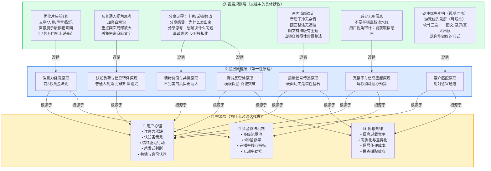

# Task 3：创作调整建议深度解析与第一性原理拆解

> 本部分是整份报告的思想核心。我们不满足于复述"应该做什么"，而是追问"为什么这些规则有效"——只有理解底层逻辑，创作者才能在具体场景中灵活变通，而非机械套用模板。

---

## 第一部分：创作调整建议完整解析

> 注：拍摄方式（画面/声音/出镜）的具体标准已在 Task 2 中完成，此处不再重复，聚焦于内容策略层面的四类调整建议。

### 一、调整呈现方式：按作品类型匹配最优媒介

#### 核心决策逻辑

呈现方式的选择不是随意的审美偏好，而是一个**媒介匹配问题**——什么样的产品特征，需要用什么样的感官通道来最快、最准确地传递给观众。底层判断标准是：**该产品的核心卖点通过哪种感官最容易被感知？**

#### 分类型策略深度解析

**1. 硬件类：优先实拍**

| 维度 | 解析 |
|---|---|
| **为什么选实拍** | 硬件产品的核心价值在于物理形态、质感、灯光效果、运动状态——这些都是**视觉冲击力**的载体。一张实拍照片/一段实拍视频能在0.5秒内传递"这东西酷不酷"，而文字描述可能需要10句话。 |
| **辅助手段** | 素材剪辑和录屏用于补充开发过程——展示"这是怎么做出来的"，增加叙事厚度，但不应替代实拍成为主画面。 |
| **反面教训** | 如果一个酷炫的LED装置/机械臂/3D打印作品只用代码截图展示，等于把90%的视觉冲击力白白浪费。 |

**2. 游戏类：优先录屏**

| 维度 | 解析 |
|---|---|
| **为什么选录屏** | 游戏的核心价值是**可玩性（playability）**——操作反馈、画面流畅度、关卡设计、交互体验。这些只有在实际游玩中才能体现，静态截图无法传达"好不好玩"。 |
| **关键技巧** | 不是随便录一段就行，要录**最精彩的片段**——高光时刻、神操作、有趣的bug、意外的结果。流水账式的全程录屏等于没有重点。 |
| **辅助手段** | 可以配合玩家的真实反应（表情、声音）增强情绪感染力，但录屏本身必须是主角。 |

**3. 软件类：三种形式的选择逻辑**

软件类作品最复杂，因为软件本身没有物理形态，可玩性也不像游戏那么直观，所以需要根据创作者能力和产品特性做二次细分：

| 形式 | 适用人群 | 核心策略 | 底层逻辑 |
|---|---|---|---|
| **图文** | 不擅长视频制作的人 | 首图用AI生图/GitHub截图/产品截图，必须有排版有主题；简介写详细文案（亮点、功能、开发过程） | 图文降低了视频制作的门槛，但**信息密度要求更高**——因为没有动态画面和声音的加持，首图必须承担"前3秒钩子"的功能，文字必须承担解说的功能。 |
| **电脑录屏/素材剪辑** | 懂视频剪辑的人 | 不要平铺直叙流水账；加旁白解说（可用AI配音）；重点画面做局部放大；避免密密麻麻文字 | 录屏天然容易陷入"流水账陷阱"（因为屏幕操作本身就是线性的），所以必须通过剪辑人为制造节奏——放大重点、删减冗余、旁白引导注意力。 |
| **第一/三人称拍摄** | 重交互产品 | 人物和产品同框，体现真实的交互场景 | 当产品的核心价值是"人如何使用它"时（如手势控制、语音交互、AR体验），纯录屏无法展示**具身交互感**——观众需要看到一个真实的人如何与产品互动，才能代入"我用的时候会是什么感觉"。 |

**关键洞察**：三种形式不是"高低之分"而是"适配之分"。图文不低级——一张好的首图+一段好的文案，传播力可能超过一个粗糙的视频。选择的标准是：**你能用哪种形式把产品的核心卖点传递得最清晰、最有冲击力，就选哪种。**

---

### 二、增加信息增量：从"展示作品"到"立体叙事"

#### 四个分享方向的结构解析

文档给出了4个信息增量方向，但它们不是平行并列的——它们构成了一个**由表及里、由物到人**的叙事层次：

```
分享作品（What）→ 分享过程（How）→ 分享感受（Why-emotion）→ 分享思考（Why-meaning）
   最外层            中间层            情感层              意义层
   必备基础          增加厚度          建立共鸣            提升深度
```

**1. 分享作品（必备层）**

这是底线——你必须告诉观众这个东西是什么、能干什么、亮点在哪。如果连这一层都做不好，其他层都是空中楼阁。但停留在这一层，内容就是"产品说明书"，有用但无趣。

**2. 分享过程（叙事层）**

卡壳、试错、反复修改——这些在开发者看来是"失败"的经历，在内容传播中却是**黄金素材**。原因有三：
- **制造张力**：一帆风顺的故事没有悬念，"遇到问题→解决问题"才有叙事弧光
- **拉近距离**：完美的成功让人仰视和距离感，挣扎和试错让人觉得"他和我一样"
- **提供价值**：别人可以从你的错误中学习，这比"我成功了"有更大的实用价值

**3. 分享感受（情感层）**

"为什么想把作品发出来"——这个问题的答案往往是情绪性的：可能是因为解决了一个困扰自己很久的问题，可能是因为做出来之后觉得太酷了忍不住想分享，可能是因为想证明什么。这些情绪是**内容传播的货币**——理性信息让人点头，情绪体验让人点赞、评论、转发。

**4. 分享思考（意义层）**

"作品背后真正想解决的问题"——这是从"做了一个东西"升华到"为什么做这个东西"。一个高考志愿模拟器不只是一个工具，它回应的是千万考生和家长的焦虑；一个减肥小程序不只是一个记录器，它背后是对健康生活方式的思考。这一层让内容从"有趣"变成"有分量"。

#### 小贴士的深层含义

"不擅长声音解说可用AI配音或在简介写详细文字"——这条建议表面上是在说"技术替代方案"，底层是在说**信息传递的通道冗余原则**：如果一个通道（声音）你不擅长，就确保其他通道（文字）是充分的。核心目标是**信息完整到达**，而不是必须用某种形式。

---

### 三、视频结构优化：算法逻辑与叙事逻辑的统一

#### 前3秒：生死线的科学

文档对前3秒的要求是多维度协同作战：

| 元素 | 作用 | 对应心理机制 |
|---|---|---|
| **文字** | 直接传递信息，0阅读门槛 | 视觉系统对文字的处理速度极快，尤其是大字标题 |
| **人物** | 建立情感连接，人脸是最吸引注意力的视觉刺激 | 大脑有专门的梭状回面孔区（FFA）处理人脸，人脸出现自动捕获注意力 |
| **声音** | 建立听觉期待，音乐/人声激活情绪 | 听觉系统比视觉系统更快唤起情绪反应（杏仁核直接接收听觉输入） |
| **配乐** | 建立氛围基调，暗示内容情绪色彩 | 音乐直接作用于边缘系统，在观众理性判断之前先影响情绪 |

画面策略——"直接展示产品最惊艳/吸引人/有核心竞争力的画面"——遵循的是**峰值优先原则**：不要铺垫，不要渐进，把最好的东西放在最前面。这和传统的"起承转合"叙事结构完全相反，因为短视频的叙事逻辑不是"故事逻辑"而是"钩子逻辑"。

旁白策略——"1-2句话开门见山说产品亮点是什么、能做什么"——遵循的是**最小认知成本原则**：观众在3秒内必须知道"继续看下去我能得到什么"。如果3秒后还在猜"这是要讲什么"，手指已经划走了。

#### 推荐剪辑结构的叙事逻辑

推荐结构：**产品亮点 → 完整功能展示和体验 → 开发过程和思考**

这个结构看似简单，实则精妙——它精确对应了观众观看时的心理变化曲线：

```
时间轴：0s────3s───────────────────────视频结束
        │      │                        │
        │      │                        │
心理阶段：钩子 → 价值确认 → 深度参与 → 情感连接
        │      │           │            │
内容层：亮点展示 功能体验    开发过程    思考感受
        │      │           │            │
算法层：3秒留存 完播率启动   互动触发    评论转发
```

- **产品亮点（0-3秒）**：回答"为什么要看"——解决留存问题
- **完整功能展示**：回答"这个东西到底怎么样"——解决完播率问题
- **开发过程和思考**：回答"这个人/故事有什么意思"——解决互动和传播问题

这个顺序不能乱。如果反过来——先讲开发过程再展示产品——观众在还不知道"这是什么"的时候就要听你的"心路历程"，会因为缺乏上下文而失去耐心。

---

### 四、减少无用信息：用户视角的信息审计

#### 判断标准的本质

"站在用户视角思考：用户看这张图/这个片段能清晰获取信息吗？"

这个判断标准看似简单，实际上提出了一个极其重要的思维转换：**从创作者视角切换到观众视角**。

创作者视角下，每一个片段都是有意义的——"这是我写代码的过程""这是我调试的画面""这是我遇到bug时的屏幕"。但观众视角下，评判标准只有一个：**这一帧/这一秒，给我传递了什么新信息？**

| 创作者视角 | 观众视角 | 是否有用 |
|---|---|---|
| 这是我写了3小时的代码 | 密密麻麻的代码，看不懂在干什么 | ❌ 无用 |
| 这是我在IDE里操作的全过程 | 鼠标在屏幕上移来移去，不知道在点什么 | ❌ 无用 |
| 这是产品最炫的那个功能的演示 | 哇，这个效果很酷 | ✅ 有用 |
| 这是我遇到一个bug卡了两天 | 原来他也会遇到困难，怎么解决的？ | ✅ 有用（有叙事张力） |
| 这是产品的GitHub页面截图 | 看到了star数和README，知道这是真项目 | ✅ 有用（社会证明） |

#### "无用信息"的三种典型形态

1. **纯过程性画面**：没有重点的录屏、打字过程、等待加载——这些对创作者有意义（"我在工作"），对观众无意义
2. **信息密度为零的镜头**：对着屏幕拍但看不清内容、模糊的过渡画面、过长的黑场
3. **重复信息**：已经说过的功能又展示一遍、同一个角度反复拍

核心原则：**每一秒都要通过"观众信息获取测试"——如果删掉这一秒，观众是否会少获得什么？如果不会，就删掉。**

---

## 第二部分：第一性原理底层逻辑拆解

> 以下提炼7个可迁移的内容传播底层原理。每个原理都不是只适用于抖音vibecoding的"小技巧"，而是跨越平台、跨越内容形式、跨越时代的传播规律。

---

### 原理一：注意力经济原理——前3秒黄金法则

**是什么**

在信息过载的环境中，注意力是最稀缺的资源。用户刷抖音时处于"高速扫描模式"，每一条内容只有极短的窗口（约3秒）证明自己值得被继续观看。如果不能在这个窗口内抓住注意力，内容就会被划走，永远失去被消费的机会。

**规则对应**

- "优化片头前3秒，用文字、人物、声音、配乐传递最关键信息"
- "画面直接展示产品最惊艳、最吸引人、最有核心竞争力的画面"
- "1-2句话开门见山告诉用户产品亮点是什么，能做什么"

**为什么有效**

**1. 用户滑动决策的成本收益分析**

用户刷抖音时的决策是瞬时的、近乎无意识的：
- **划走的成本**：几乎为零——拇指滑动一下，下一条内容立刻呈现
- **继续看的成本**：持续投入时间（不确定要多少秒）和认知资源
- **继续看的预期收益**：取决于前3秒给出的"价值承诺"

这是一个极度不对等的决策：成本几乎为零的"拒绝" vs 需要持续投入的"接受"。因此，内容必须在前3秒给出足够强的"收益信号"，才能逆转这个决策天平。

**2. 抖音算法的流量池机制**

抖音采用多级流量池推荐机制：
- 初始流量池：200-500播放
- 核心考核指标：**3秒留存率（跳出率）、完播率、点赞率、评论率、转发率**
- 如果3秒跳出率过高，算法判定内容"不吸引人"，停止推入更大流量池
- 3秒留存率是第一道关卡——这一关过不了，后面的指标再好也没机会展示

算法逻辑是冷酷的效率逻辑：它不判断内容"好不好"，只判断数据"行不行"。前3秒表现差=数据差=不推荐=没人看到。

**3. 注意力衰减曲线**

认知科学研究表明，人对新刺激的注意力高度集中在前几秒，之后呈指数衰减。如果前3秒没有建立注意力锚点，后续要拉回注意力的成本会成倍增加。

**可推广性**

这个原理几乎适用于所有需要在短时间内抓住注意力的场景：

- **短视频/直播**：前3秒钩子（抖音、快手、视频号）
- **广告**：广告片前5秒定生死（YouTube可跳过广告、电视广告）
- **演讲开场**：演讲的前30秒决定听众是否愿意听下去（TED、产品发布会）
- **PPT第一页**：封面页和开场页决定观众是否继续翻页
- **邮件标题**：收件人决定是否打开邮件只看标题（平均2秒决策）
- **App启动页**：用户决定是否继续使用App的前3秒体验
- **面试前30秒**：面试官在前30秒形成第一印象（确认偏误影响后续评价）
- **书籍封面和腰封**：读者在书店决定是否拿起一本书，平均看封面3-5秒

---

### 原理二：认知负荷与信息转译原理——普通人视角

**是什么**

专业领域的内容创作者（程序员、工程师、设计师）容易陷入"知识的诅咒"——一旦你知道了某个知识，就无法想象不知道它的人是什么感受。"普通人视角"不是"降智"或"简化"，而是**主动进行信息转译**：把专业术语、技术逻辑、内部视角，翻译成普通人能理解、能共情、能感知价值的表达。核心是**降低认知负荷**，找到观众已经理解的东西作为"认知锚点"。

**规则对应**

- "从'普通人为什么感兴趣/能帮助普通人做什么'来思考创作"
- "分享作品：介绍功能、亮点、使用场景"（不是介绍技术栈、架构、实现细节）
- "不擅长声音解说可用AI配音或者在简介处撰写详细文字"（确保信息通道畅通）
- "展示重点画面时做局部放大，避免密密麻麻文字"（减少视觉认知负荷）

**为什么有效**

**1. 知识的诅咒（Curse of Knowledge）**

这是认知心理学中的经典概念，由Colin Camerer等人在1989年的实验中证明：掌握了某一信息的人，会系统性地高估他人对该信息的理解程度。

在vibecoding场景中表现为：
- 开发者觉得"这个AI agent自动调用工具的能力超酷"——但普通人不知道"agent"是什么、"调用工具"意味着什么
- 开发者觉得"这个React hooks的用法很巧妙"——但普通人连React是什么都不知道
- 开发者觉得"这个API的响应速度从200ms优化到50ms是巨大提升"——但普通人对毫秒没有概念

**2. 认知负荷理论（Cognitive Load Theory）**

John Sweller提出的认知负荷理论指出，人的工作记忆容量有限（约4±2个信息块），当新信息的处理需求超过工作记忆容量时，学习/理解就会失败。

技术内容容易造成三种认知负荷超载：
- **内在负荷过高**：概念本身太复杂，缺乏前置知识无法理解
- **外在负荷过高**：呈现方式增加了不必要的认知负担（密密麻麻的代码、没有解说的纯录屏）
- **相关负荷不足**：没有帮助观众建立新旧知识之间的连接

"普通人视角"本质上是做三件事：
- 降低外在负荷（清晰的画面、旁白引导、局部放大）
- 管理内在负荷（不一次性抛太多概念，从结果倒推而非从原理正推）
- 增加相关负荷（用比喻、场景、故事建立锚点）

**3. 转译不是简化，而是共情锚点**

真正有效的"普通人视角"不是把内容变蠢，而是找到**共情锚点**——用观众已经熟悉的事物来解释新事物：
- 不说"这是一个基于LLM的多轮对话agent"，而说"你可以跟它像跟朋友聊天一样让它帮你做事"
- 不说"这是一个CRUD应用"，而说"它可以帮你自动整理所有旅行照片并生成游记"
- 不说"响应速度优化了75%"，而说"以前点一下要等一秒才出结果，现在一点就有"

**可推广性**

信息转译能力是AI时代最重要的能力之一，几乎适用于所有知识传递场景：

- **技术写作**：技术文档、API文档、技术博客需要从读者视角而非作者视角写作
- **产品设计**：Don't Make Me Think——用户不应该需要学习如何使用你的产品
- **科普传播**：科学传播的核心不是传递知识，而是建立兴趣和理解的桥梁
- **教学**：优秀的教师能用最通俗的语言讲清楚最复杂的概念
- **销售Pitch**：客户不关心你的技术参数，关心的是"这对我有什么用"
- **跨部门沟通**：技术团队向业务团队解释技术方案，需要用业务语言而非技术语言
- **管理汇报**：向上汇报时，领导不想听细节，想听结论和影响
- **医疗沟通**：医生向病人解释病情，需要用病人能理解的语言而非医学术语

---

### 原理三：情绪价值与共情原理——不完美的真实比完美的虚假更动人

**是什么**

纯功能展示传递的是**实用价值**（"这个东西有用"），但传播需要**情绪价值**（"这个东西让我有感觉"）。情绪是传播的货币——理性让人认同，情绪让人行动（点赞、评论、转发、关注）。特别地，不完美的真实（卡壳、试错、挣扎）比精心包装的完美更能引发共鸣，因为**可关联性（relatability）**是共情的基础。

**规则对应**

- "分享过程：记录从灵感到落地的路径，讲讲中间经历过的卡壳、试错和反复修改"
- "分享感受：为什么你会想把这个作品发出来"
- "分享思考：这个作品背后，你真正想解决的是什么问题"
- "内容创作应基于真诚表达，有个人思考和创意；不鼓励生产模版化、套路化的内容"

**为什么有效**

**1. 情绪是社交传播的核心驱动力**

宾夕法尼亚大学沃顿商学院的Jonah Berger在《疯传》（Contagious）一书中总结了病毒式传播的六个原则（STEPPS），其中情绪（Emotion）是核心驱动力之一。研究发现：
- **高唤醒情绪**（敬畏、愤怒、焦虑、兴奋）促进传播
- **低唤醒情绪**（满足、悲伤、平静）抑制传播
- 实用价值也重要，但纯实用内容的传播力远不如"实用+情绪"

在vibecoding内容中：
- "我做了一个很酷的工具" → 低传播力（纯信息）
- "我为了解决自己的减肥痛点，折腾了两周做了这个小工具，中间差点放弃" → 高传播力（情绪+故事+实用）

**2. 瑕疵效应（Pratfall Effect）**

社会心理学中的瑕疵效应（也叫出丑效应）：一个有能力的人如果犯一个小错误或展示某个不完美的方面，反而会比完美无缺的人更受欢迎、更有亲和力。

原因：
- 完美的人/产品产生**距离感**和**威胁感**——"他太厉害了，我做不到"
- 适当的不完美产生**可关联性**——"原来他也会遇到困难，和我一样"
- 展示脆弱性是建立信任的最快方式——"他愿意展示自己的失败，说明他是真诚的"

开发者分享卡壳、试错、反复修改的过程，本质上是在"主动出丑"——而这种"出丑"恰恰是观众最买账的内容。

**3. 身份认同与"我也是"时刻**

当观众看到创作者的挣扎和思考时，他们会产生"我也是这样"的认同感。这种认同感是评论区活跃的核心驱动力——"我也遇到过这个bug！""我也想做一个这样的工具！""太真实了！"

每一条这样的评论，都在告诉算法"这个内容引发了互动"，从而推动内容进入更大的流量池。

**4. 叙事传输（Narrative Transportation）**

当故事足够真实和有情感时，观众会进入"叙事传输"状态——他们沉浸在故事中，暂时忘记自己是在看一个推销产品的视频。在这种状态下，观众对信息的接受度更高、对创作者的信任度更高、传播意愿更强。

流水账式的功能展示无法触发叙事传输，因为没有故事弧光——没有冲突（卡壳）、没有转折（试错后找到方向）、没有情感（想放弃又坚持）。

**可推广性**

情绪价值和共情是所有与人沟通的底层能力：

- **品牌营销**：最好的品牌不是卖产品，而是卖情感共鸣（Nike卖的不是鞋是"Just Do It"的精神）
- **个人IP打造**：有缺陷的真实人设比完美的虚假人设更有持久吸引力
- **故事讲述（Storytelling）**：好莱坞编剧法则——英雄必须有弱点，旅程必须有挫折
- **社交传播**：朋友圈转发的内容，80%以上带有情绪色彩（愤怒、感动、自豪、焦虑）
- **领导力**：敢于展示脆弱的领导者比永远正确的领导者更能赢得团队信任
- **用户体验设计**：好的产品不只是功能可用，还要在情感上打动用户（产品个性、微交互、错误提示的温度）
- **客户服务**：真诚的道歉和共情比完美的解释更能平息客户愤怒
- **亲密关系**：展示脆弱和不完美是关系深化的关键

---

### 原理四：质量信号传递原理——表面功夫不是表面问题

**是什么**

当用户无法直接判断内容质量时，他们会通过**可观察的信号**（画质、音质、排版、整洁度）来推断不可观察的质量（内容是否有价值、创作者是否认真）。这些"表面功夫"不是虚荣，而是**信任建立的第一块基石**。粗糙的信号触发负面启发式推断："如果连画面/声音/排版都不认真做，内容的质量可能也好不到哪里去。"

**规则对应**

- "画面清晰稳定"
- "音质清晰，无杂音/爆音/卡顿"
- "画面效果整洁，无长时间遮挡"
- "图文首图确保有排版、有主题"
- "不同画面衔接自然"
- "出镜人物穿着得体、整洁自然，拍摄背景整洁"

**为什么有效**

**1. 信号传递理论（Signaling Theory）**

信号传递理论由诺贝尔经济学奖得主Michael Spence在1973年提出。核心思想是：在信息不对称的情况下（一方知道质量，另一方不知道），拥有信息的一方会通过发送可观察的"信号"来证明自己的质量，而接收方会通过这些信号来推断质量。

关键洞见：**信号必须有成本，才能可信。**
- 画质清晰需要：好的设备/录屏设置、稳定的操作、后期检查——这些都需要时间和精力
- 音质清晰需要：好的麦克风、安静的环境、后期降噪——这些都有成本
- 排版整洁需要：设计能力、反复调整——这些都有成本
- 如果连这些"低成本信号"都不愿意投入，用户有理由推断你在"高成本内容"上也不会投入

**2. 启发式判断（Heuristic Processing）**

用户在刷抖音时处于**认知吝啬鬼（Cognitive Miser）**模式——他们不会仔细分析每一条内容的质量，而是使用心理捷径（启发式）快速判断：

| 信号 | 启发式推断 |
|---|---|
| 画面晃动/模糊 | "这个人没认真做" → 内容可能也没价值 |
| 杂音/爆音/无声音 | "听着难受" → 立刻划走 |
| 密密麻麻文字 | "看不懂，费脑子" → 不值得投入注意力 |
| 排版整洁 | "这个人很用心" → 内容质量可能也不错 |
| 真人出镜得体 | "这是一个真实的人，不是营销号" → 可信度高 |
| AI配音但清晰流畅 | "虽然是机器音但至少信息清晰" → 可以接受 |

这些判断在理性上可能不完全公平（画面粗糙的内容有可能内容极好），但在海量信息的环境中，用户没有时间做深度分析——他们依赖启发式做快速筛选，这是进化而来的认知效率策略。

**3. 首因效应与晕轮效应**

- **首因效应（Primacy Effect）**：第一印象（通常是视觉和听觉的）对后续评价有不成比例的巨大影响
- **晕轮效应（Halo Effect）**：一个方面的正面印象（画质好）会泛化到其他方面（内容可能也好）；一个方面的负面印象（音质差）也会泛化

粗糙的画面/音质在第一秒就建立了负面首因，之后需要数倍的努力才能挽回；而整洁的画面在第一秒就建立了正面期待，观众会更有耐心继续看。

**可推广性**

质量信号的传递无处不在——任何存在信息不对称的场景，信号都在起作用：

- **简历设计**：HR平均看一份简历6秒，排版混乱=直接丢垃圾桶，哪怕内容再好
- **产品包装**：消费者无法在购买前直接判断产品质量，包装是第一信号
- **网站UI设计**：用户在0.05秒内形成对网站可信度的判断，主要依据设计质量
- **面试着装**：面试官在前30秒根据着装和仪态形成第一印象
- **论文格式**：学术论文的格式规范是最基础的质量信号——格式错的论文审稿人会先入为主认为质量差
- **餐厅环境**：餐具是否干净、环境是否整洁，直接影响顾客对菜品卫生的预期
- **邮件格式**：一封排版混乱、有错别字的工作邮件，会让人质疑发件人的专业能力
- **App图标**：App Store里，图标设计质量直接影响下载转化率
- **店铺装修**：线下门店的装修档次直接影响顾客对价格和品质的预期

---

### 原理五：完播率与信息密度原理——每秒都在消耗耐心预算

**是什么**

抖音算法的核心指标是完播率——有多少人看完了你的视频。每一秒内容都在消耗用户的**耐心预算**，而耐心预算是有限的。冗余信息消耗预算却不提供价值，会导致用户中途退出。因此内容创作必须追求**信息密度最大化**——每秒都要给用户新的信息、新的刺激、新的价值。判断标准是"用户视角"：用户看这一秒能获取什么新信息？如果不能，就删掉。

**规则对应**

- "减少无用信息"
- "判断标准：站在用户视角思考——用户看这张图/这个片段能清晰获取信息吗？"
- "不要平铺直叙流水账"
- "避免密密麻麻文字"
- "展示重点画面时做局部放大"（聚焦有效信息）

**为什么有效**

**1. 完播率——算法的核心货币**

抖音算法的核心逻辑可以简化为：
```
完播率高 → 算法判断"内容吸引人" → 推入更大流量池 → 更多播放
完播率低 → 算法判断"内容不吸引人" → 停止推荐 → 播放量停滞
```

为什么完播率如此重要？因为完播率是**最综合的内容质量指标**：
- 3秒留存只反映"开头好不好"
- 点赞只反映"是否认同"（很多人点赞但没看完）
- 评论只反映"是否有话想说"
- 完播率反映"从头到尾是否足够吸引人"——它是对整条视频的综合评价

**2. 耐心预算模型**

可以把用户的耐心想象成一个有限的预算账户：
- 视频开始时，用户给你一个初始预算（基于前3秒钩子的强度）
- 每一秒无聊/冗余/无信息增量的内容，都在从这个账户扣钱
- 每一秒精彩/有价值/有新信息的内容，都在往这个账户存钱（延长耐心）
- 如果账户透支，用户就划走了

流水账是耐心预算的最大杀手——因为流水账的信息密度极低：
- "现在我打开IDE" → 无新信息（观众知道你在用电脑）
- "现在我开始写代码" → 无新信息（观众看到了）
- "我写了一个函数" → 无新信息（代码看不清，说了也白说）
- "哇这个效果出来了！" → 有信息！这才是值得保留的

**3. 信息密度 vs 视频时长——短不是目的，密才是**

一个常见的误区是"视频越短越好"。不对——一个30秒但全是废话的视频，完播率可能远低于一个2分钟但信息密度极高、节奏紧凑的视频。

关键不是时长，而是**信息密度**（单位时间传递的有效信息量）。高信息密度的视频让人感觉"时间过得很快"（沉浸状态），低信息密度的视频让人感觉"怎么还没完"（无聊状态）。

**4. 用户视角审计——对抗"创作者盲区"**

创作者最难做到的是"用观众的眼睛看自己的作品"。因为你知道每一秒背后的故事、每一个画面对你的意义，但观众不知道。这就是为什么需要"用户视角测试"——不是"我觉得这段有意思"，而是"一个完全不了解背景的人看这段，能获得什么信息？"

**可推广性**

信息密度原则适用于所有有时间/空间限制的信息传递场景：

- **演讲/TED Talk**：最受欢迎的TED演讲平均每分钟传递1-2个"想法单位"，冗余极低
- **写作**：好文章"字字珠玑"——删掉任何一个字都会损害意思表达；坏文章充满"正确的废话"
- **产品设计**：UI设计中的"最少交互原则"——完成一个任务需要的点击/步骤越少越好
- **UI/UX设计**：每一个界面元素都必须有存在的理由，多余的装饰是认知噪音
- **沟通表达**：电梯演讲（Elevator Pitch）——30秒内说清楚核心价值
- **会议效率**：高效会议有明确议程，每个议题有时间限制，不跑题
- **广告创意**：30秒广告要传递品牌名+核心卖点+情感钩子，每一帧都算过
- **代码编写**：好代码简洁优雅——"最好的代码是没有代码"，每一行都有存在的理由
- **教学设计**：好的课程设计避免信息过载，每节课聚焦1-2个核心概念

---

### 原理六：媒介匹配原理——内容形式决定信息通道

**是什么**

不同的媒介形式（实拍视频、录屏、图文、真人出镜）激活不同的感官通道（视觉、听觉、运动感知），具有不同的信息带宽和情感表达力。选择呈现方式时，核心原则是**媒介特性与产品卖点的最佳匹配**：硬件的视觉冲击力需要实拍来承载，游戏的可玩性需要录屏来展示，重交互产品的使用体验需要真人同框来呈现。选择错误的媒介形式，等于用错误的感官通道传递信息——事倍功半。

**规则对应**

- "硬件类——优先实拍，直接呈现最有视觉冲击力的画面"
- "游戏类——优先录屏，直接展示作品可玩性"
- "软件类-图文：首图可以用AI生图、github项目截图，产品截图等，确保有排版、有主题"
- "软件类-录屏：不要平铺直叙流水账，加上旁白解说，展示重点画面时做局部放大"
- "软件类-第一/三人称拍摄：人物、产品在同一画面，体现真实的交互场景"

**为什么有效**

**1. 媒介即信息（The Medium is the Message）**

Marshall McLuhan在1964年提出的经典命题：媒介本身比它传递的内容更深刻地影响信息的接收方式。每一种媒介都有自己的"语言"和"语法"：
- **实拍视频**的语言是光影、构图、运动、质感——擅长传递视觉美感、物理真实感
- **录屏**的语言是界面动态、交互反馈、操作流程——擅长传递功能逻辑和使用体验
- **图文**的语言是静态构图、排版节奏、文字深度——擅长传递结构化信息和深度思考
- **真人出镜**的语言是表情、肢体、情绪、人格——擅长传递情感、信任和代入感

用实拍去展示一个纯软件产品（没有物理形态），等于用视觉语言去讲一个非视觉的故事；用纯录屏去展示一个AR交互产品，等于隔着一层屏幕去展示具身体验。

**2. 模态适配效应（Modality Effect）**

认知心理学中的多媒体学习理论（Mayer, 2001）指出：不同信息类型在不同模态下的学习效果不同。
- **空间信息**（外观、布局、视觉效果）→ 视觉通道最优
- **时序信息**（操作步骤、交互流程）→ 视觉+听觉双通道最优
- **情感信息**（感受、态度、人格）→ 人脸+声音通道最优
- **抽象概念**（思考、理念、原理）→ 文字/语言通道最优

这解释了为什么：
- 硬件用实拍（空间/视觉信息）→ 视觉通道最优
- 游戏用录屏（时序/交互信息）→ 视觉+听觉双通道
- 重交互产品用真人出镜（情感/具身信息）→ 人脸+声音+交互多通道
- 不擅长视频的人用图文（抽象/结构化信息）→ 文字通道最优

**3. 比较优势与能力边界**

三种软件形式的建议也体现了**比较优势原理**：不要选择"理论上最好"的形式，选择"你能做好的"形式。一个图文做得好（首图精美、文案清晰）的传播效果，远超过一个视频做得差（画面晃动、声音模糊、剪辑混乱）。

这不是退而求其次——这是**资源最优配置**：把你的精力投入到你能产出最高质量的媒介形式上。

**可推广性**

媒介匹配是内容策略的底层逻辑：

- **营销渠道选择**：视觉产品（服装、美食）选小红书/Instagram；知识产品选公众号/播客；娱乐产品选抖音/B站
- **教学方式选择**：操作性技能（编程、烹饪）用视频教程最优；理论知识用文字教材最优；语言学习用音频最优
- **工作汇报选择**：进度汇报用文字/表格；方案汇报用PPT（可视化）；创意脑暴用白板/面对面
- **社交方式选择**：深度交流用电话/面对面；信息确认用文字；情绪支持用语音/视频
- **新闻载体选择**：突发事件用短视频/直播；深度调查用长文/纪录片；数据新闻用交互可视化
- **产品原型选择**：验证交互流程用可点击原型；验证视觉风格用静态设计稿；验证技术可行性用MVP
- **简历形式选择**：设计岗用作品集PDF/网站；技术岗用GitHub+简洁简历；创意岗甚至可以用视频简历

---

### 原理七：真诚表达反套路原理——模板化是传播的天敌

**是什么**

在内容创作领域存在一个悖论：当一种"成功模板"被总结出来并广泛复制后，模板本身就会失效——因为观众对套路化的内容会产生**审美疲劳和信任免疫**。真正有传播力的内容是基于**真诚表达、个人思考和真实创意**的内容，它可能不完美、不符合"最佳实践"，但它有独特的个性和真实的声音。模板可以保底，但只有真诚才能突破。

**规则对应**

- "内容创作应基于真诚表达，有个人思考和创意"
- "不鼓励生产模版化、套路化的内容"
- "分享感受：为什么你会想把这个作品发出来"（这是最个人化、最难模板化的部分）
- "分享思考：这个作品背后，你真正想解决的是什么问题"（这是最深层、最独特的部分）

**为什么有效**

**1. 套路识别与审美疲劳**

人脑有一个强大的"模式识别"机制——当某一类内容看多了之后，大脑会自动识别其套路模式，然后产生**习惯化（Habituation）**反应：对重复刺激的响应递减。

当所有vibecoding视频都是：
- 酷炫开头（但看起来都差不多）
- 功能演示（切换得很快但记不住）
- BGM都是那几首热门音乐
- 结尾都是"快来试试吧"

观众的大脑会自动进入"自动忽略"模式——因为这一切都太可预测了，没有新鲜感，没有惊喜。

**2. 真诚是无法伪造的信号**

在信号传递理论中，有些信号是"难以伪造"的——真诚的情感、真实的思考、个人化的故事，这些东西没有办法通过模板来批量生产。

为什么"分享感受"和"分享思考"是最有价值的信息增量？因为：
- 功能是可以复制的（别人也可以做类似的工具）
- 过程是可以模仿的（别人也可以拍开发过程）
- 但**你为什么做这个东西**、**你遇到了什么独特的困境**、**你真正在乎什么**——这些是独一无二的，是别人无法复制的

**3. 反同质化竞争**

当赛道初期（vibecoding大赏刚开始时），粗制滥造的内容也能获得流量，因为竞争少。但随着参与者增多，内容会迅速同质化——大家的画面都不抖了、声音都清晰了、都知道前3秒要放亮点了。当所有人都达到了60分的"合格线"，决定谁能脱颖而出的不再是"不犯错"，而是**差异化**——你有什么是别人没有的？

答案就是：**你的真实故事、你的独特思考、你的真诚表达。**这些东西无法通过学习"技巧"获得，它们来自你作为创作者的独特经历和真实感受。

**4. 准社会交往（Parasocial Interaction）**

观众与创作者之间会形成一种"准社会交往"——观众虽然不认识创作者本人，但通过持续观看内容，会产生一种"我好像认识这个人"的感觉。这种关系的基础是**感知到的真实性**——如果观众觉得创作者是在演、在套模板、在"运营"，准社会关系就无法建立；如果观众觉得"这个人很真实"，就会产生信任和忠诚。

**可推广性**

真诚反套路原则适用于所有需要建立长期信任和差异化的场景：

- **个人品牌/IP**：长期来看，真实的人格比精心打造的人设更有生命力（人设会崩塌，真实不会）
- **品牌营销**：消费者越来越精明，对"营销话术"产生免疫，真诚的品牌沟通反而更能打动人（如Patagonia的环保立场、Dove的真实美 campaign）
- **内容创业**：公众号/短视频赛道中，活得久的都是有独特声音的创作者，而不是追热点套模板的
- **人际交往**：在社交中，真诚是最高效的策略——套路能赢一时，真诚能赢一世
- **领导力**：真诚的领导者（承认错误、分享真实想法、言行一致）比"表演式领导"更能赢得持久追随
- **产品设计**：有灵魂的产品（有独特设计理念、有创始人故事）比"完美但无个性"的产品更有粉丝忠诚度
- **艺术创作**：艺术史上留名的作品都是有独特声音的，而不是技法最完美的
- **恋爱关系**：套路吸引来的关系是脆弱的，真诚建立的关系才是稳固的

---

### 原理总结对照表

| 序号 | 原理名称 | 核心命题 | 对应关键规则 | 最佳推广场景 |
|---|---|---|---|---|
| 1 | 注意力经济原理 | 前3秒决定生死，注意力是稀缺资源 | 前3秒钩子、直接展示最惊艳画面、开门见山 | 广告、演讲、邮件、面试 |
| 2 | 认知负荷与信息转译原理 | 打破知识的诅咒，找到共情锚点 | 普通人视角、旁白解说、局部放大、避免密密麻麻文字 | 技术写作、科普、教学、销售、跨部门沟通 |
| 3 | 情绪价值与共情原理 | 情绪是传播货币，不完美的真实更动人 | 分享过程（卡壳试错）、分享感受、分享思考 | 品牌营销、个人IP、故事讲述、领导力 |
| 4 | 质量信号传递原理 | 表面功夫是信任的第一块基石 | 画面清晰、音质干净、排版整洁、出镜得体 | 简历、UI设计、包装、面试着装、论文格式 |
| 5 | 完播率与信息密度原理 | 每秒都在消耗耐心预算，密比短重要 | 减少无用信息、不要流水账、用户视角审计 | 演讲、写作、UI设计、沟通、会议效率 |
| 6 | 媒介匹配原理 | 用对感官通道，媒介特性匹配卖点 | 硬件实拍、游戏录屏、软件三种形式选择 | 营销渠道、教学方式、工作汇报、产品原型 |
| 7 | 真诚反套路原理 | 模板保底，真诚突破，差异化来自真实 | 真诚表达、个人思考、不鼓励模板化套路化 | 个人品牌、内容创业、领导力、人际交往 |

---

## 第三部分：Mermaid可视化——表层规则→底层原理→根源



---

## 附录：7个原理的一句话速记卡

| 原理 | 一句话 |
|---|---|
| 🔴 注意力经济 | 你只有3秒钟证明自己值得被看——把最好的放在最前面 |
| 🟠 认知负荷转译 | 不要说你懂的，说观众能懂的——用他的语言说话 |
| 🟡 情绪价值共情 | 完美让人仰视，真实让人靠近——分享你的挣扎和热爱 |
| 🟢 质量信号传递 | 用户没义务深入了解你——画面声音就是你的简历 |
| 🔵 信息密度 | 每一秒都要有存在的理由——对观众没用的就删掉 |
| 🟣 媒介匹配 | 什么产品用什么载体——用最擅长的感官通道说话 |
| ⚪ 真诚反套路 | 所有人都60分的时候，你的真实才是唯一的差异化 |
