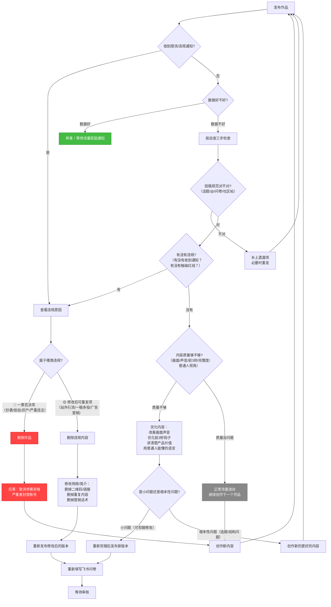

# Task 6：审核红线与避坑指南

> 合规是一切的底线。本部分系统梳理7类审核红线、标记严重等级、澄清4个常见误区、提供发布前自查清单和违规处理流程图，帮助创作者避开所有"致命坑"，确保作品顺利通过审核获得流量激励。

---

## 一、违规行为分级总表

根据严重程度，将7类审核问题分为两个等级：**🔴 一票否决项**（直接取消资格，不可挽回）和 **🟡 修改后可重发项**（删除违规内容后可重新发布）。

| 违规类型 | 具体行为 | 严重等级 | 后果 | 正确做法 |
|---|---|---|---|---|
| **抄袭/搬运/侵权** | 作品非本人原创；未经授权使用第三方素材（肖像、音乐、字体、影视剧片段、截图等） | 🔴 一票否决 | 取消参赛资格，作品下架，严重者封禁账号；侵权可能面临法律追责 | 坚持原创；BGM使用抖音音乐库；字体使用免费商用字体；如需使用他人内容必须获得授权 |
| **低俗内容** | 含有性暗示、性挑逗内容；低俗歌舞/小品；恶搞色情内容；嫖娼/招嫖/性暗示内涵段子 | 🔴 一票否决 | 作品直接下架，账号可能被封禁，取消参赛资格 | 内容健康积极，不打色情擦边球，避免任何容易产生性联想的内容 |
| **灰色产业链** | 推广诈骗APP、机器人骚扰电话、大数据违规营销、黑灰产相关内容 | 🔴 一票否决 | 账号封禁，移交相关部门处理，永久取消参赛资格 | 绝不涉及任何黑灰产内容，只推广自己合法合规开发的作品 |
| **其他严重违法违规** | 违反国家法律法规、政策规章；标题党/封面党夸大收益骗取点击；展示诱导模仿危险行为 | 🔴 一票否决 | 视情节严重程度：作品下架、限流、账号封禁、取消参赛资格 | 遵守法律法规和公序良俗；标题封面与内容一致；不夸大收益不诱导模仿 |
| **站外引流** | 通过口播、标题、文案、简介、评论区呈现网址、下载链接、二维码、GitHub链接、个人网站、微信、商家店铺，或用营销话术招徕用户 | 🟡 修改后可重发 | 该条内容不符合激励条件，删除违规内容后可重新发布；反复违规可能升级处罚 | 视频/简介/评论区不放任何外链、二维码、微信号；如需引导，只说"在TRAE社区"或"抖音内搜索" |
| **一稿多投** | 同一条投稿重复发在一个账号；同一内容发在多个账号；产品无重大更新换标题/封面/镜头顺序反复发 | 🟡 修改后可重发 | 重复内容流量受影响，该条不符合激励条件；删除重复内容后发布新内容 | 同一作品只发一次；产品有重大更新（v1.0→v2.0，核心功能新增）才可以重新发，且要说明更新了什么 |
| **广告营销** | 内容包含硬广、软广、好物推荐、强营销话术；过度吹捧或贬低产品；非商单内容念广告词 | 🟡 修改后可重发 | 该条内容不符合激励条件，删除营销内容后可重发 | 商单必须通过星图平台下单；非商单客观介绍产品功能，不说"全网第一""最好用""秒杀XX"这类营销话术 |

---

## 二、高频踩坑点特别提醒 ⚠️

以下是**开发者最容易踩的6个坑**，请特别注意：

### 1. 二维码/外链引流——开发者第一大死因

**典型踩坑场景**：
- 视频里放GitHub二维码/链接，说"源码在这里"
- 简介里放个人网站、博客、产品官网链接
- 评论区置顶"加我微信进群""扫码下载"
- 口播说"百度搜XX就能找到"

**为什么容易踩**：开发者天然习惯"开源放GitHub""官网放链接"，但抖音平台严格禁止任何站外引流，这是平台红线，没有例外。

**正确做法**：
- ❌ 绝对不要在视频、简介、评论区放任何形式的链接/二维码/微信号
- ❌ 不要口播引导去站外平台
- ✅ 如果要引导用户，可以说"在TRAE社区搜我的作品""抖音内搜索作品名"
- ✅ 源码链接等信息可以放在TRAE社区帖子里，抖音只做内容展示

---

### 2. 重复投稿——以为"多发多曝光"反而被限流

**典型踩坑场景**：
- 同一个作品，今天发一个，明天换个标题再发一个
- 产品没更新，只是重新剪辑了一下镜头顺序又发一遍
- 同一个作品发在主账号+小号+朋友账号多个账号
- 为了凑投稿数量，把一个作品拆成多个碎片发

**为什么容易踩**：误以为"多发就有更多流量"（详见误区1），实际上平台算法会识别重复内容，重复投稿不仅不给流量，还会降低账号权重。

**正确做法**：
- ❌ 同一作品不要重复发布，哪怕换标题换封面也不行
- ✅ 产品有**重大更新**（核心功能新增、版本大迭代）才可以重新发布，且要明确说明"v2.0更新了XX"
- ✅ 一个账号只发一次，不要多账号重复发
- ✅ 宁可不发，也不要凑数发重复内容

---

### 3. 未授权素材——小心侵权投诉

**典型踩坑场景**：
- BGM随便用了一首流行歌，不是抖音音乐库里的
- 用了影视剧片段、动漫截图、游戏画面做素材
- 字体用了微软雅黑、方正字体等商用需授权的字体
- 用了网上随便找的图片、图标、表情包
- AI配音用了某个名人的声音模型
- 视频里拍到了路人清晰的脸，没有获得同意

**为什么容易踩**：开发者做产品时对版权不敏感，觉得"网上找的就能用""只是小范围传播没关系"，但抖音对侵权内容审核严格，版权方投诉直接下架。

**正确做法**：
- ✅ BGM只用抖音音乐库里面的（免费且已获授权）
- ✅ 字体用免费商用字体：思源黑体、思源宋体、站酷免费字体、阿里巴巴普惠体等
- ✅ 图片用自己拍的，或从Unsplash、Pexels等免费可商用图片站下载
- ✅ AI配音用通用声音模型，不要用名人声音
- ✅ 尽量不要拍路人，如果拍到了要打码或征得同意
- ✅ 影视剧/动漫/游戏片段最好不用，如果要用也要确保是合理使用范围且不侵权

---

### 4. 代码展示泄露敏感信息

**典型踩坑场景**：
- 录屏写代码时，不小心拍到了代码里的API Key、密钥、密码
- 配置文件里的数据库密码、Access Key直接展示在屏幕上
- .env文件、配置文件内容在视频里一闪而过
- 终端命令历史里有敏感信息

**为什么容易踩**：开发者录屏时专注于展示功能，忘记了屏幕上可能有敏感信息，而视频是逐帧保存的，哪怕一闪而过也可能被人截图利用。

**正确做法**：
- ✅ 录屏前检查所有打开的文件、终端，确保没有API Key、密钥、密码
- ✅ 用环境变量管理敏感信息，代码里不要硬编码密钥
- ✅ 如果代码里必须有密钥位置，用"YOUR_API_KEY_HERE"等占位符
- ✅ 录完后逐帧检查一遍，确认没有泄露信息
- ✅ 浏览器书签栏、历史记录、打开的标签页也要检查，不要有隐私内容

---

### 5. 标题党/封面党——夸大其词反被限流

**典型踩坑场景**：
- 标题写"震惊！我用AI写了个秒杀所有APP的神器"，实际就是个小工具
- 封面放夸张的表情包、美女图、猎奇图，和内容完全没关系
- 说"用了这个工具赚了一百万""三天涨粉十万"，夸大收益
- 标题说"史上最强""全网第一""宇宙首发"这类极限词

**为什么容易踩**：以为"标题越夸张越有人点"，实际上抖音严厉打击标题党封面党，夸大其词不仅不会给流量，反而会被标记为低质内容限流。

**正确做法**：
- ✅ 标题和封面要和内容一致，是什么就说什么
- ✅ 用真实的产品界面、真实的使用场景做封面
- ✅ 客观描述，不用"震惊""秒杀""史上最强""最好用"这类夸张词汇
- ✅ 可以有吸引力，但不能欺骗："我做了个帮你填志愿的工具"比"震惊！高考神器"好
- ✅ 不要夸大收益，不说"用这个能赚钱""涨粉十万"这类话

---

### 6. 商单未走星图——广告营销违规

**典型踩坑场景**：
- 收了别人钱帮人推广产品，直接发视频没走星图
- 视频里推荐某个付费产品、服务，有明显的营销话术
- 拿了厂商赞助的设备/服务，视频里不标注
- 过度吹捧某个产品，贬低其他同类产品

**正确做法**：
- ✅ 如果是商单（收钱、收赞助推广），必须通过星图平台下单后再发布
- ✅ 非商单内容客观介绍，不吹不黑，不说广告词
- ✅ 不要做"好物推荐""种草"类内容，除非走星图

---

## 三、4个常见误区深度澄清

### 误区1：多发就一定有更多流量？❌

**原始说法**：平台鼓励持续创作，但不鼓励无差别堆量，单纯增加投稿频次不能稳定带来更多曝光。

**深度解释**：

抖音算法**不奖励堆量**，背后有三个底层逻辑：

1. **内容同质化会降低账号权重**：如果你发的内容都是"换个标题、换个封面、改几句文案、镜头顺序调一下"的同质化内容，算法会判定你这个账号"生产低质内容"，不仅不会给新内容流量，还会降低整个账号的权重——你之后发的内容初始推荐量都会变低。这就是"越乱发越没流量"的原因。

2. **算法奖励的是"稀缺性"和"用户反馈"，不是"数量"**：抖音的流量分配逻辑是"内容池赛马机制"——你的内容发出去后，先给一小部分人看，如果完播率、点赞率、评论率、转发率好，就推入更大的流量池；如果数据不好，就停止推荐。堆10条低质量内容，不如好好做1条高质量内容——1条数据好的内容带来的流量，可能比10条低质内容加起来多100倍。

3. **"持续创作"≠"高频发烂内容"**：平台鼓励的"持续创作"，是指**持续产出高质量、有区分度的内容**——比如每周认真做1个好作品，而不是每天发1条流水账。质量永远比数量重要。

**一句话总结**：**发10条烂内容，不如认真做1条好内容。堆量不仅没用，还可能起反作用。**

---

### 误区2：只要带了比赛话题，填了表格，就能拿到流量？❌

**原始说法**：还需要确保内容不违规，以及质量符合基本要求。

**深度解释**：

话题和填表只是**入场券**，不是**流量通行证**。你可以把这个过程理解为"考试报名"：

1. **带话题+填表格=报名成功**：你获得了参与评审的资格，官方会看到你的内容。但这就像"高考报了名"不代表"能上大学"，你还得考出好成绩。

2. **不违规=通过初审**：内容不触碰7类红线，就不会被直接刷掉。这就像"考试没有违纪"，是最基本的要求，但不代表能拿高分。

3. **质量达标=通过复审获得流量**：画面清晰、声音清楚、内容完整、有信息增量——这些是获得流量奖励的必要条件。官方审核1-3个工作日，看的就是这些质量维度。质量不过关，哪怕你话题带得再对、表格填得再快，也拿不到流量。

**三层门槛的关系**：
```
┌─────────────────────────────────────────┐
│  流量奖励（质量达标+有亮点）            │
├─────────────────────────────────────────┤
│  进入评审池（不违规）                    │
├─────────────────────────────────────────┤
│  被官方看到（带话题+填表格）             │
└─────────────────────────────────────────┘
```

**一句话总结**：**话题是门票，合规是底线，质量才是拿到流量的通行证。**

---

### 误区3：发一点碎片过程，也算有效投稿？❌

**原始说法**：过程内容当然可以发，但前提是它本身能构成一条完整且有价值的内容，零散随拍很难形成有效传播。

**深度解释**：

什么叫"**完整且有价值的内容**"？给你一个简单的判断标准——一条合格的视频，观众看完后应该能回答这三个问题：

| 判断维度 | 合格标准 | 反例（碎片内容） |
|---|---|---|
| **这是什么？** | 观众看完知道你做了个什么东西，它是干什么用的 | 只有一段写代码的录屏，观众看完不知道最终做成了什么 |
| **它有什么亮点/用？** | 观众看完知道这个东西酷在哪/有用在哪/解决了什么问题 | 只有一张截图、一句"今天写了一天代码好累"，没有展示产品价值 |
| **我为什么要看/转？** | 内容有情绪点（哇/哈哈/感动/有用），观众有看完或转发的理由 | 没头没尾的10秒片段，观众看完一脸懵："所以呢？" |

**过程内容能不能发？能，但要"过程即内容"，而不是"过程的碎片"**：

✅ **好的过程内容示例**：
- "我花了72小时，把全中国的足球俱乐部做成了一张地图"——过程+结果+数字，有故事有成品
- "去南极旅游差点崩溃，于是我写了个网站解决这个问题"——有起因（痛点）、有过程、有结果（成品）
- "从0到8000用户，我做这个减脂小程序的30天"——完整的成长故事，有过程有结果有反思

❌ **不好的碎片内容示例**：
- 一张代码截图，配文"今天写代码"
- 5秒的终端录屏，什么也没展示清楚
- "做了个东西，大家看看"，没有任何介绍
- 没头没尾的开发过程片段，没有开头没有结尾没有成品展示

**一句话总结**：**要么展示成品，要么讲好故事。碎片不是内容，只是素材。**

---

### 误区4：投稿后数据一般、没被推荐，就是被限流了？❌

**原始说法**：自查三步：①确认是否按规则投稿；②确认作品是否违规；③关注站内信通知。

**深度解释**：

"数据不好就是被限流了"——这是创作者最常见的"被害妄想"。实际上，90%以上的"数据不好"都不是被限流，而是**内容本身质量不够/内容不匹配平台用户喜好**。

**理性自查流程**（按顺序来，不要上来就觉得被限流）：

**第一步：先查投稿规范有没有做对**
- [ ] 有没有带双话题：#vibecoding大赏 #traeai创造力大赛（两个都要有！）
- [ ] 有没有@正确的账号：@TRAE.ai @抖音科技（两个都要@！）
- [ ] 有没有填飞书问卷？（不填问卷官方看不到你！）
- [ ] 是不是在TRAE社区先提交了Demo帖？（这是参赛前提！）
- [ ] 标题有没有按建议以"VibeCoding大赏"开头？
- → 如果以上任何一项没做对：补上/重发，这不是限流，是你没按规则来。

**第二步：查有没有违规**
- [ ] 有没有收到抖音的违规提示/限流通知？（违规一定会有通知，不会"偷偷限流"）
- [ ] 有没有站外引流内容（链接、二维码、微信号）？
- [ ] 有没有用未授权的素材？
- [ ] 有没有一稿多投？
- [ ] 有没有营销话术？
- → 如果有违规：按提示删除修改后重发。
- → 如果**没有收到任何违规通知**：那大概率不是违规限流。

**第三步：查内容质量（这是90%数据不好的原因）**
- [ ] 画面是不是稳定清晰？有没有太黑/太晃/脏乱？
- [ ] 声音是不是清楚？有没有杂音/爆音/没声音？
- [ ] 前3秒有没有钩子？是不是开头就很无聊（"大家好我今天做了个XX"）？
- [ ] 内容是不是完整？有没有清楚展示产品是什么、能干什么？
- [ ] 有没有信息增量？有没有展示亮点/情绪点/价值点？
- [ ] 是不是太技术化了，普通人看不懂？
- [ ] 标题和封面是不是吸引人？是不是和内容匹配？
- → 如果是质量问题：不要怪限流，优化内容后重新创作/重新发布。

**关于"限流通知"的重要说明**：
抖音的违规处理是**透明的**——如果你的作品违规了、被限流了，你一定会收到站内信通知，明确告诉你哪里违规了、怎么处理。不存在"偷偷限流不告诉你"的情况。如果你没收到通知，就不要自己吓自己。

**正常的流量波动是正常的**：哪怕是百万粉大V，也不是每条视频都爆。作品的数据本来就有高有低，这很正常，不要一条数据不好就觉得被限流了。

**一句话总结**：**没收到违规通知就不是限流。90%的数据不好，都是因为内容还不够好。先从自己身上找原因，优化内容比抱怨限流有用100倍。**

---

## 四、发布前合规自查清单

发布视频前，对照这个清单逐项检查，确保万无一失：

### 📋 第一部分：基础合规项（7类红线，一项都不能碰）

- [ ] **无站外引流**：视频、简介、评论区置顶都没有链接、二维码、微信号、GitHub地址、个人网站
- [ ] **无一稿多投**：这是这个作品第一次发布，没有在本账号/其他账号发过相同内容
- [ ] **无侵权内容**：
  - [ ] BGM来自抖音音乐库
  - [ ] 字体是免费商用字体
  - [ ] 图片/图标是自己拍的或免费可商用的
  - [ ] 没有用影视剧/动漫/游戏片段（或已确认不侵权）
  - [ ] AI配音没有用名人声音模型
  - [ ] 没有拍到路人清晰正脸（或已征得同意）
- [ ] **无低俗内容**：没有性暗示、低俗段子、擦边球内容
- [ ] **无灰产内容**：不涉及诈骗、骚扰电话、违规营销
- [ ] **无违规营销**：
  - [ ] 没有硬广/软广/好物推荐
  - [ ] 商单已走星图平台
  - [ ] 没有"全网第一""最好用""秒杀XX"这类极限词
- [ ] **无其他违法违规**：
  - [ ] 内容符合法律法规和公序良俗
  - [ ] 标题/封面不夸大、不做标题党
  - [ ] 不夸大收益（"赚了一百万""涨粉十万"这类话）
  - [ ] 不诱导用户模仿危险行为
- [ ] **无敏感信息泄露**：代码/终端/配置文件里没有API Key、密钥、密码等敏感信息

### 📋 第二部分：内容质量项（影响流量奖励的关键）

- [ ] **画面质量**：画面稳定不晃动，光线充足不昏暗，主体清晰不脏乱
- [ ] **声音质量**：声音清楚无杂音、无爆音，音量大小合适，有BGM的话BGM不盖过人声
- [ ] **前3秒钩子**：开头3秒有亮点（震撼视觉/情绪标题/数字冲击/悬念问题），不是"大家好我做了个XX"
- [ ] **内容完整**：清楚展示了产品是什么、能干什么、亮点在哪里，观众看完能懂
- [ ] **普通人视角**：内容不是纯技术自嗨，普通用户能看懂、能get到价值
- [ ] **有信息增量**：有分享作品/过程/感受/思考中的至少一项，不是纯流水账
- [ ] **无冗余内容**：没有长时间的黑屏、无意义的等待、废话、冗余操作过程
- [ ] **标题吸引人且真实**：标题说明白内容是什么，有吸引力但不夸大
- [ ] **封面清晰有重点**：封面用产品真实界面/精彩画面，不用和内容无关的猎奇图

### 📋 第三部分：投稿规范项（不做对就拿不到流量）

- [ ] **TRAE社区已提交Demo帖**（这是参赛前提！）
- [ ] **带了两个话题标签**：#vibecoding大赏 #traeai创造力大赛（两个都要有！）
- [ ] **@了两个账号**：@TRAE.ai @抖音科技（两个都要@！）
- [ ] **标题格式正确**：建议以"VibeCoding大赏"开头
- [ ] **发布后填写了飞书问卷**（不填问卷官方看不到你！）
- [ ] **关注站内信通知**：审核结果会通过站内信通知，注意查收

---

## 五、违规处理流程图



---

## 六、最后提醒：合规心态

1. **合规不是束缚，是保护**：这些规则不是为了卡你，是为了保护平台生态，也保护你不被封号、不被追责。遵守规则，你才能安心创作、安心拿流量。

2. **当你不确定能不能发的时候，就不要发**：如果某个内容（链接、素材、话术）你拿不准是不是违规，保险起见删掉它。多一事不如少一事，不要抱有侥幸心理。

3. **真诚是最大的合规**：不抄、不骗、不引流、不夸大，真诚地展示你的作品、分享你的创作过程，就不会有大问题。

4. **违规了就改，改了还是好同志**：🟡类违规不是世界末日，删掉违规内容修改后重发就好。不要因为一次违规就放弃。
