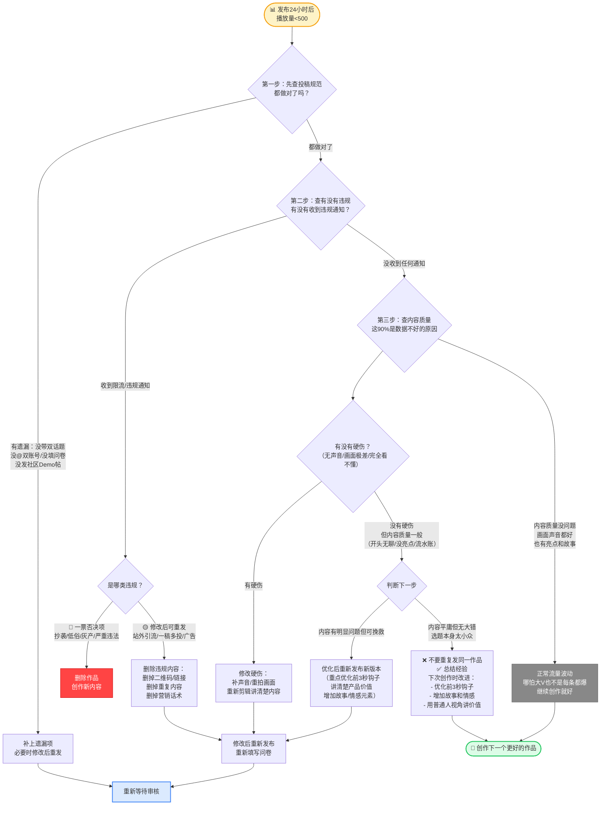

# Task 7：可执行创作行动指南与发布Checklist

> 这是整个创作指南中**最实用、最能直接拿来用**的部分。前面讲了"为什么"（Task 3）、"选什么形式"（Task 4）、"别人怎么做的"（Task 5）、"什么不能做"（Task 6），本Task把所有内容整合成一套**从0到1的完整行动手册**——你只需要照着做就行。

---

## 第一部分：从0到1创作全流程（10步）

每一步都包含：**做什么 + 怎么做 + 注意事项 + 预计时间**。跟着走，不迷路。

---

### 第1步：作品完成后确定选题方向

| 维度 | 内容 |
|---|---|
| **做什么** | 确认作品已完成且可正常运行，明确这次抖音要展示的具体作品是什么 |
| **怎么做** | ① 确认作品已在TRAE社区初赛专区提交Demo帖（这是参赛前提）<br>② 用一句话说清你做了什么："我做了一个能XX的XX"<br>③ 确认选题是**具体创意作品**，不是原理解析/技术教学/行业资讯 |
| **注意事项** | ❌ 不要发"vibecoding入门教程""如何用TRAE写代码"这类教学内容<br>❌ 不要发"AI行业观察""大模型对比"这类资讯内容<br>✅ 要发你自己做出来的**具体产品/应用/游戏/硬件** |
| **预计时间** | 10分钟（确认+想清楚选题） |

---

### 第2步：选择呈现形式

| 维度 | 内容 |
|---|---|
| **做什么** | 根据你的作品类型和能力，选择最合适的内容呈现形式 |
| **怎么做** | 打开Task 4的决策树，回答三个问题：<br>① 你的作品是硬件/游戏/软件？<br>② 如果是软件：是不是重交互（手势/语音/AR/体感）？<br>③ 你会不会视频剪辑？<br>根据答案选择：实拍/录屏/图文/真人出镜 |
| **注意事项** | ✅ 图文不是"退而求其次"——图文做好了传播力可能超过粗糙视频<br>❌ 不要强迫自己用"理论上最好"但你做不好的形式<br>✅ 在你能力范围内做到最好，比追求完美形式但做得一塌糊涂强 |
| **预计时间** | 5分钟（看决策树做选择） |

---

### 第3步：内容策划（4层信息增量）

| 维度 | 内容 |
|---|---|
| **做什么** | 构思你要分享哪些内容，确保不是流水账，有信息增量 |
| **怎么做** | 按4层结构梳理内容（**必备层必须有，其他层尽量加**）：<br><br>**📌 必备层（必须有）**：<br>• 作品功能：它是干什么的？<br>• 作品亮点：最酷/最有用/最有意思的3个点<br>• 使用场景：谁在什么情况下会用它？<br><br>**💬 叙事层（强烈建议加）**：<br>• 灵感来源：你为什么想做这个？<br>• 卡壳经历：做的过程中遇到什么困难？怎么解决的？<br>• 试错过程：有什么有趣的bug/失败的尝试？<br><br>**❤️ 情感层（建议加，加分项）**：<br>• 为什么想把这个作品发出来？<br>• 做这个作品时你是什么感受？<br><br>**🌟 意义层（可选，提升深度）**：<br>• 这个作品想解决什么问题？<br>• 你对这个方向有什么思考？ |
| **注意事项** | ❌ 不要只展示"我写了代码"——要展示"我做出了什么东西"<br>❌ 不要所有内容都平铺直叙——有重点、有起伏、有故事<br>✅ 开发过程中的"不完美"（卡壳、bug、有趣的意外）反而更真实、更打动人 |
| **预计时间** | 20-30分钟（想清楚+列个简单提纲） |

---

### 第4步：脚本/大纲设计

| 维度 | 内容 |
|---|---|
| **做什么** | 设计内容结构，确保节奏合理、重点突出 |
| **怎么做** | **视频版推荐结构**（15-60秒）：<br>• 0-3秒：钩子（最惊艳画面+一句话说明）<br>• 3-15秒：产品亮点+核心功能展示<br>• 15-40秒：更多功能细节+开发小故事1-2个<br>• 40-60秒：个人感受+引导互动<br><br>**图文版推荐结构**（6-9张图）：<br>• 图1：封面首图（钩子）<br>• 图2-4：核心功能展示（2-3张最酷的截图）<br>• 图5-6：亮点功能细节（局部放大/特写）<br>• 图7-8：开发过程（代码截图/有趣瞬间）<br>• 图9：成果总结/个人感受<br><br>如果是录屏/视频，建议写个简单的解说词脚本（哪怕只是关键词），不要临场发挥 |
| **注意事项** | ❌ 不要开头5秒还在"大家好我是XXX今天给大家介绍..."——观众早就划走了<br>❌ 不要结尾才展示作品——开头就要给人看最酷的<br>✅ 前3秒决定生死，把最惊艳的画面放最前面 |
| **预计时间** | 视频：20-30分钟（写脚本+规划镜头）<br>图文：10-15分钟（规划图片顺序+文案大纲） |

---

### 第5步：拍摄/录制

| 维度 | 内容 |
|---|---|
| **做什么** | 按Task 2和Task 4的标准拍摄/录制素材 |
| **怎么做** | **通用要求**：<br>• 画面稳定：用三脚架/手机支架固定，绝对不要手持晃来晃去<br>• 环境整洁：背景干净无杂物，不要在床上/堆满东西的桌子上拍<br>• 光线充足：优先窗边自然光，45度侧光最有质感；避免逆光/顶光/暗光<br>• 声音清晰：有条件外接领夹麦；没条件就在安静环境录，不要有背景噪音<br><br>**分类型要点**：<br>• 🎬 硬件：必须拍动态工作状态，不要只拍静止产品；多拍几个角度（斜45度/特写/工作状态）<br>• 🎮 游戏：只录最精彩的高光片段；第一帧就进入精彩画面，不要从启动开始录<br>• 🖥️ 软件录屏：开专注模式关通知；鼠标不要乱晃；关键操作一气呵成，错了重录<br>• 📹 真人出镜：三分法构图（人1/3，产品2/3）；穿着得体背景整洁；自然操作不要演 |
| **注意事项** | ❌ 绝对不要用手机翻拍电脑/电视屏幕（有摩尔纹、反光、色差）<br>❌ 不要在昏暗环境下拍——噪点多、画质差、像废品<br>❌ 录屏前一定要检查屏幕上有没有API Key、密钥、隐私内容<br>✅ 多录几条备用——拍5条选1条最好的，比拍1条凑合用强 |
| **预计时间** | 30-60分钟（准备+拍摄/录制，不顺利可能更久） |

---

### 第6步：后期剪辑

| 维度 | 内容 |
|---|---|
| **做什么** | 剪辑素材、加旁白/字幕/BGM、做局部放大、调整节奏 |
| **怎么做** | **必备操作**：<br>• 大刀阔斧剪：所有加载/等待/无聊/重复的片段都剪掉，3秒没新信息就剪<br>• 加旁白：自己录或用剪映AI配音都可以；语速1.1-1.2倍更舒服<br>• 解说词讲价值不讲操作：不要念"我点击这个按钮"，要讲"这个功能可以帮你XX"<br>• 关键处局部放大：重要按钮/小细节放大1.5-2倍，停留2-3秒<br>• 加字幕：字幕只放你说的话，字号适中放在屏幕下方，不要挡主要内容<br><br>**加分操作**：<br>• BGM：用抖音音乐库的轻节奏纯音乐，音量调小（-20db）不要盖过人声<br>• 转场：用简单的淡入淡出或硬切，不要用花哨的3D转场<br>• 慢动作：精彩瞬间可以加0.5秒慢动作强化<br><br>**图文版操作**：<br>• 裁剪统一尺寸（建议3:4或9:16竖版）<br>• 关键地方加箭头/红圈/简短标注（不要过度）<br>• 一张图一个目的，不要一张图塞四五个功能 |
| **注意事项** | ❌ 绝对不要满屏密密麻麻的文字/代码——观众看不清直接划走<br>❌ 不要让BGM盖过人声——人声永远是第一位的<br>❌ 不要加"导演：XXX""鸣谢：XXX"这类花里胡哨的片尾——抖音不需要这个<br>✅ 如果是AI配音，选一个自然的声音，不要选太机械的 |
| **预计时间** | 新手：1-2小时；熟练：30-60分钟 |

---

### 第7步：发布准备

| 维度 | 内容 |
|---|---|
| **做什么** | 写标题、做封面、加话题标签、@账号 |
| **怎么做** | **标题**：<br>• 建议以"VibeCoding大赏"开头（更容易被官方看到）<br>• 标题结构：VibeCoding大赏｜我做了一个能XX的XX<br>• 真实有吸引力，不要夸大、不要标题党<br>• 例子：✅ "VibeCoding大赏｜我做了个自动整理旅行照片的AI工具"<br>         ❌ "震惊！AI做出了秒杀所有APP的神器"<br><br>**封面**：<br>• 用视频里最惊艳的一帧，或产品最核心的界面截图<br>• 可以加大字标题（不超过10个字）点明核心卖点<br>• 画面清晰、有视觉冲击力、不杂乱<br><br>**话题标签**（两个必须有）：<br>• #vibecoding大赏<br>• #traeai创造力大赛<br>• 可以加相关标签：#AI工具 #效率工具 #独立开发 #程序员（可选）<br><br>**@账号**（两个必须@）：<br>• @TRAE.ai<br>• @抖音科技<br><br>**简介文案**（图文版尤其重要）：<br>• 第一句：一句话钩子（"我用TRAE做了一个能XX的工具"）<br>• 中间：2-3个核心功能亮点，简单说明<br>• 结尾：开发故事/个人感受<br>• 口语化表达，像和朋友聊天，真诚不夸大 |
| **注意事项** | ❌ 标题不要用"全网第一""最好用""秒杀XX"这类极限词<br>❌ 封面不要用和内容无关的美女图/猎奇图/表情包<br>✅ 话题两个都要带，@两个账号都要@——少一个都可能拿不到流量 |
| **预计时间** | 15-20分钟 |

---

### 第8步：合规自查

| 维度 | 内容 |
|---|---|
| **做什么** | 对照审核红线逐项检查，确保不碰任何违规项 |
| **怎么做** | 用第二部分的发布前Checklist逐项打勾检查（必选项全部满足才能发）<br><br>**重点检查**（最容易踩的坑）：<br>• 有没有任何形式的链接/二维码/微信号/GitHub地址？<br>• BGM是不是抖音音乐库的？字体是不是免费商用的？<br>• 代码/终端里有没有API Key、密钥、密码？<br>• 有没有重复发过这个作品？<br>• 有没有营销话术、夸大宣传？<br>• 画面声音质量过关吗？ |
| **注意事项** | ❌ 不要抱有侥幸心理——"应该不会被发现吧"这种想法最危险<br>❌ 不要觉得"我就放个GitHub链接怎么了"——平台规则就是规则<br>✅ 当你不确定能不能发的时候，就不要发——删掉拿不准的内容，多一事不如少一事 |
| **预计时间** | 10分钟（认真逐项检查） |

---

### 第9步：发布后填写飞书问卷

| 维度 | 内容 |
|---|---|
| **做什么** | 发布抖音后，立即填写官方飞书问卷提交作品信息 |
| **怎么做** | ① 抖音发布成功后，点"分享"→"复制链接"，复制作品链接<br>② 打开飞书问卷：https://bytedance.larkoffice.com/share/base/form/shrcnzp18Sdf6XQxm8wGPPXDt4b<br>③ 准确填写：<br>  • 抖音作品链接（必须是可访问的完整链接）<br>  • TRAE社区昵称（和你发Demo帖的昵称一致）<br>  • 作品名称/简介<br>④ 提交问卷 |
| **注意事项** | ❌ 不填问卷官方看不到你的作品——这一步必须做！<br>❌ 不要填错昵称——昵称对不上社区帖子就白搭<br>❌ 不要等几天再填——发布后立即填，审核才及时<br>✅ 填完可以截个图保存，万一出问题有凭证 |
| **预计时间** | 5分钟 |

---

### 第10步：关注1-3个工作日内的站内信通知

| 维度 | 内容 |
|---|---|
| **做什么** | 等待审核结果，关注抖音站内信 |
| **怎么做** | ① 发布后1-3个工作日内，经常看一下抖音的站内信（消息→通知）<br>② 如果审核通过：会收到流量奖励通知，流量券会自动到账<br>③ 如果未通过：站内信会说明原因，根据原因修改后可以重新发布（🟡类违规）<br>④ 如果数据不好：不要急着说"被限流"，看第四部分的自查流程，先从自己内容找原因 |
| **注意事项** | ❌ 不要发完就不管了——站内信通知很重要<br>❌ 不要发完1小时看数据不好就删掉——审核需要时间，数据也需要时间发酵<br>✅ 审核通过了不代表结束——你可以继续创作下一个作品 |
| **预计时间** | 1-3天（等待审核，不用一直盯着，每天看一两次就行） |

---

## 第二部分：视频/图文内容结构模板

直接套用，不用自己想结构。

---

### 🎬 视频版推荐结构（15-60秒短视频）

```
━━━━━━━━━━━━━━━━━━━━━━━━━━━━━━━━━━━━━━━━
0-3秒（钩子期——决定用户划不划走）
━━━━━━━━━━━━━━━━━━━━━━━━━━━━━━━━━━━━━━━━
  □ 画面：直接展示产品最惊艳/最有视觉冲击力的画面
         （不要logo、不要加载、不要"大家好"）
  □ 声音：1-2句话开门见山——
         "我做了一个能XX的XX"
         "用AI vibe coding了一个XX"
  □ 文字：大字幕点明核心卖点（不超过10个字）

━━━━━━━━━━━━━━━━━━━━━━━━━━━━━━━━━━━━━━━━
3-15秒（价值确认期——让用户知道这东西有用吗）
━━━━━━━━━━━━━━━━━━━━━━━━━━━━━━━━━━━━━━━━
  □ 完整展示核心功能和使用体验
  □ 旁白解说亮点，不要念操作步骤
  □ 重点功能处局部放大
  □ 节奏：每个镜头3-5秒，讲完就切

━━━━━━━━━━━━━━━━━━━━━━━━━━━━━━━━━━━━━━━━
15-40秒（深度展示期——让用户觉得"哇好酷/好有用"）
━━━━━━━━━━━━━━━━━━━━━━━━━━━━━━━━━━━━━━━━
  □ 展示更多功能细节/使用场景
  □ 分享1-2个开发过程中的小故事：
     - 卡壳的经历："这个地方我卡了3个小时，最后发现是个小bug"
     - 突破的瞬间："突然想到可以这样做，当时就跳起来了"
     - 有趣的bug："有一次AI生成了一个特别搞笑的错误，我都笑疯了"
  □ 不要流水账，挑最有意思的1-2个点讲

━━━━━━━━━━━━━━━━━━━━━━━━━━━━━━━━━━━━━━━━
40-60秒（情感连接期——让用户愿意点赞评论）
━━━━━━━━━━━━━━━━━━━━━━━━━━━━━━━━━━━━━━━━
  □ 分享做这个作品的初衷/感受/思考：
     "上个月去旅行回来几百张照片懒得整理，一怒之下做了这个"
     "一直觉得现有的XX工具不好用，就自己做了一个"
  □ 引导互动：
     "你们觉得这个有用吗？"
     "你最想用它做什么？"
     "有什么建议欢迎评论区告诉我"
  □ 不要说"求点赞求关注"——太生硬，自然引导就好
```

---

### 🖼️ 图文版推荐结构

```
━━━━━━━━━━━━━━━━━━━━━━━━━━━━━━━━━━━━━━━━
首图（封面——决定80%点击率）
━━━━━━━━━━━━━━━━━━━━━━━━━━━━━━━━━━━━━━━━
  □ 有视觉冲击力的AI生图/GitHub截图/产品截图
  □ 有排版有主题，不是随意拼凑
  □ 文字清晰可读，大字标题不超过10个字
  □ 禁止：模糊截图、密密麻麻代码、无排版拼凑图、纯黑底白字

━━━━━━━━━━━━━━━━━━━━━━━━━━━━━━━━━━━━━━━━
图片顺序（6-9张图，一张图一个目的）
━━━━━━━━━━━━━━━━━━━━━━━━━━━━━━━━━━━━━━━━
  □ 图1：封面（吸引点击——这是什么？酷不酷？）
  □ 图2-4：核心功能展示（2-3张最酷的功能截图，一图一个功能）
  □ 图5-6：亮点功能细节（局部放大/特写，展示贴心设计/彩蛋）
  □ 图7-8：开发过程（代码截图/GitHub截图/有趣的瞬间/卡壳的地方）
  □ 图9：成果总结/个人感受/引导互动

━━━━━━━━━━━━━━━━━━━━━━━━━━━━━━━━━━━━━━━━
简介文案（和图片配合，有结构）
━━━━━━━━━━━━━━━━━━━━━━━━━━━━━━━━━━━━━━━━
  □ 第一句：一句话钩子
     "我用TRAE做了一个能自动整理旅行照片并生成游记的AI工具"
     
  □ 中间：核心功能亮点（2-3个，带简单说明）
     "✨ 亮点1：AI自动识别照片场景和人物，帮你分类整理
      ✨ 亮点2：一键生成带文字的游记长图，直接发朋友圈
      ✨ 亮点3：自动生成旅行视频，配BGM和转场"
     
  □ 结尾：开发故事/个人感受
     "上个月去旅行回来，几百张照片懒得整理，一怒之下用Trae花了3天做了这个工具，虽然还有bug但自己用着挺爽。分享给大家～"
     
  □ 话题标签（必须有）：
     #vibecoding大赏 #traeai创造力大赛
     （可以加 #AI工具 #效率工具 等相关标签）
     
  □ @账号（必须有）：
     @TRAE.ai @抖音科技
```

---

## 第三部分：发布前Checklist（共30项）

发布前对着打勾，**所有必选项✅全部满足才能发**，加分项✨做到越多越容易拿流量。

可以直接复制打印，或者存手机里每次发布前对照检查。

---

### ✅ 必选项（不满足就不要发——一票否决）

#### 📋 前置条件（4项）
- [ ] 已在TRAE社区初赛专区提交Demo帖（这是参赛前提！）
- [ ] 作品是在参赛期间用TRAE开发的，或有重大更新
- [ ] 作品可以正常运行，不是半成品/只有截图
- [ ] 选题是具体创意作品，不是原理解析/教学/资讯

#### 📋 发布格式（4项）
- [ ] 标题包含"VibeCoding大赏"（建议开头就用）
- [ ] 带了两个话题标签：#vibecoding大赏 #traeai创造力大赛（**两个都要有！**）
- [ ] @了两个账号：@TRAE.ai @抖音科技（**两个都要@！**）
- [ ] 图文或视频均可，内容与作品一致，不是挂羊头卖狗肉

#### 📋 合规红线（7项——碰了就白做）
- [ ] **无站外引流**：视频/简介/评论区无二维码、无GitHub链接、无微信号、无下载链接、无任何网址
- [ ] **非抄袭/搬运/侵权**：作品是本人原创；BGM来自抖音音乐库；字体是免费商用字体；图片/素材已获授权
- [ ] **无低俗/色情/灰产内容**：无性暗示、无擦边球、无诈骗/黑灰产相关内容
- [ ] **无硬广/软广/营销话术**：不是商单（商单走星图）；无"全网第一""最好用""秒杀XX"这类极限词；不夸大收益
- [ ] **无敏感信息泄露**：代码/终端/配置文件中无API Key、密钥、密码等敏感信息
- [ ] **无一稿多投**：这个作品第一次发布，没有在本账号/其他账号发过相同内容
- [ ] **无标题党/封面党**：标题封面与内容一致，不夸大、不欺骗、不用和内容无关的猎奇图

#### 📋 内容质量底线（8项——质量不过关拿不到流量）
- [ ] 画面清晰稳定，不晃动、不糊、不黑
- [ ] 有声音（不是静音视频），声音清晰无杂音、无爆音、音量合适
- [ ] 背景整洁，没有脏乱差的环境入镜
- [ ] 不是流水账，有内容设计、有重点、有结构
- [ ] 完整展示作品功能/亮点，不只是局部截图/写代码录屏
- [ ] 有旁白解说或文字介绍，普通观众能看懂"这是什么、能干什么"
- [ ] 信息准确无误，无虚假宣传、无夸大其词
- [ ] 前3秒有内容，不是"大家好我今天做了个XX"这种无聊开头

---

### ✨ 加分项（做到了更容易获得激励——建议尽量多做）

#### 🎬 内容质量加分（6项）
- [ ] ✨ 前3秒有强钩子：直接展示最惊艳画面+一句话说明是什么
- [ ] ✨ 真人出镜（穿着得体、背景整洁、表达自然，不生硬不背书）
- [ ] ✨ 分享开发过程中的卡壳/试错/有趣经历（真实的"不完美"更打动人）
- [ ] ✨ 分享做这个作品的个人感受和思考（为什么做、做的时候什么心情、有什么想法）
- [ ] ✨ 用普通人视角讲清楚"这东西能干什么、对我有什么用"，不是纯技术自嗨
- [ ] ✨ 有真实使用场景演示（不是只在界面上点来点去，而是展示"谁在什么情况下怎么用它"）

#### 🎞️ 剪辑制作加分（5项）
- [ ] ✨ 画面衔接自然，有剪辑节奏（每个镜头不超过5秒，无聊片段都剪掉了）
- [ ] ✨ 关键地方有局部放大，观众能看清细节
- [ ] ✨ 旁白解说自然流畅，讲价值不讲操作步骤
- [ ] ✨ 封面/首图有视觉冲击力，让人想点进来
- [ ] ✨ BGM用抖音音乐库，与内容氛围匹配，音量不盖过人声

#### 💬 文案互动加分（2项）
- [ ] ✨ 简介文案写得详细生动，有钩子、有亮点、有故事
- [ ] ✨ 结尾有自然的互动引导（不是生硬的"求点赞求关注"）

---

## 第四部分：数据不好时的优化决策树

发布24小时后播放量<500？不要上来就说"被限流了"，跟着这棵树一步步自查：



**重要提醒**：
- 抖音违规一定会发站内信通知，不存在"偷偷限流不告诉你"，没收到通知就不是限流
- 90%以上的数据不好都是内容质量问题，不要怪平台，先从自己身上找原因
- 不要重复发同一作品——堆量没用，质量才重要，认真做下一个比反复发同一个强

---

## 第五部分：提交流程快速参考卡

**发布后别忘了做什么**——把这张卡存下来，每次发布后照着做：

```
┌─────────────────────────────────────────────────────────┐
│                    🚀 发布后速查卡                        │
├─────────────────────────────────────────────────────────┤
│                                                         │
│  1. □ 抖音发布成功后，点「分享」→「复制链接」            │
│                                                         │
│  2. □ 打开飞书问卷：                                     │
│     https://bytedance.larkoffice.com/share/base/form/   │
│     shrcnzp18Sdf6XQxm8wGPPXDt4b                         │
│                                                         │
│  3. □ 准确填写三项信息：                                 │
│     • 抖音作品链接（完整可访问）                         │
│     • TRAE社区昵称（和Demo帖一致）                       │
│     • 作品名称/简介                                     │
│                                                         │
│  4. □ 提交问卷（发布后立即填，不要等！）                 │
│                                                         │
│  5. □ 等待1-3个工作日                                   │
│     • 每天看1-2次抖音站内信（消息→通知）                 │
│     • 不要发完1小时看数据不好就删                        │
│                                                         │
│  6. □ 查收结果：                                         │
│     • 审核通过→流量奖励自动到账→继续创作下一个！         │
│     • 未通过→看站内信原因→修改后可重发（🟡类违规）       │
│                                                         │
├─────────────────────────────────────────────────────────┤
│  ⚠️ 关键信息再确认一遍：                                │
│                                                         │
│  话题（两个都要带）：                                    │
│  #vibecoding大赏 #traeai创造力大赛                       │
│                                                         │
│  @账号（两个都要@）：                                    │
│  @TRAE.ai @抖音科技                                     │
│                                                         │
│  标题建议：                                             │
│  VibeCoding大赏｜我做了一个能XX的XX                      │
│                                                         │
│  绝对不能有：                                           │
│  二维码/链接/微信号/侵权素材/敏感信息/营销话术           │
│                                                         │
└─────────────────────────────────────────────────────────┘
```

---

## 最后一句话总结

**不要追求完美，先完成再完美。**

- 你的第一个作品可能数据不好，没关系——总结经验，第二个会更好
- 图文不丢人——做好了比粗糙的视频强
- 真人出镜不高级——演得生硬还不如不出镜
- 真诚是最好的技巧——认真做产品，真诚分享，就不会差

Task 1-6给了你所有的"道"和"法"，Task 7给了你"术"和"器"——现在，去做吧。
