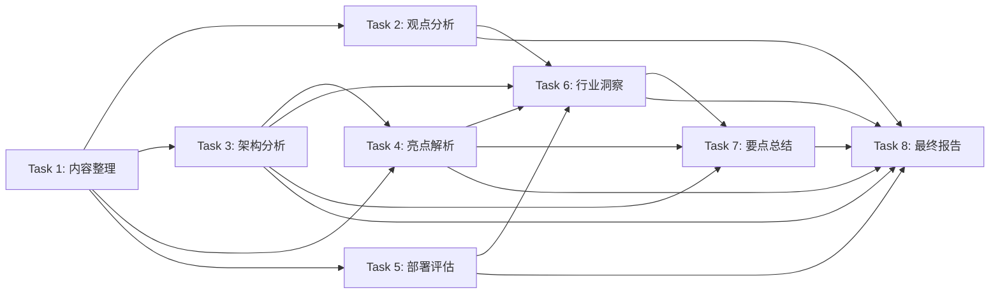

# 开源EMS能源管理系统文章深度洞察分析 - 实施计划

## [x] Task 1: 文章内容整理与结构化
- **Priority**: high
- **Depends On**: None
- **Description**:
  - 保存原始文章内容到article-content.md
  - 清理微信排版残留（图片占位、重复的广告链接等）
  - 梳理文章5大章节边界（引言、项目简介、核心亮点、使用教程、注意事项、总结）
  - 提取并结构化所有技术参数、性能数据、功能列表
- **Acceptance Criteria Addressed**: [AC-1]
- **Test Requirements**:
  - `programmatic` TR-1.1: article-content.md文件创建成功，包含完整元数据（标题/作者/发布时间/原文链接/开源地址）
  - `programmatic` TR-1.2: 文章结构清晰，5大章节划分准确
  - `programmatic` TR-1.3: 所有技术参数（50+协议、5万并发、8核32G、JDK1.8等）完整保留
  - `human-judgement` TR-1.4: 内容清理干净，无微信排版噪音
- **Notes**: 保留原文所有重要信息，不做主观删减

## [x] Task 2: 核心观点与痛点分析
- **Priority**: high
- **Depends On**: Task 1
- **Description**:
  - 提炼传统工厂能耗监测的3大核心痛点（数据孤岛、定制开发成本高、现成软件昂贵）
  - 分析开源EMS的解决方案定位
  - 梳理文章论证逻辑：痛点引入→方案介绍→亮点展示→使用教程→注意事项→价值总结
  - 识别目标用户画像与适用场景
- **Acceptance Criteria Addressed**: [AC-2]
- **Test Requirements**:
  - `programmatic` TR-2.1: 3大核心痛点完整识别，每个痛点有原文依据
  - `programmatic` TR-2.2: 文章论证链条梳理完整（6个环节）
  - `human-judgement` TR-2.3: 目标用户画像清晰（有微服务经验的企业/团队，高耗能工厂）
  - `human-judgement` TR-2.4: 项目价值定位准确

## [x] Task 3: 技术架构与功能模块深度分析
- **Priority**: high
- **Depends On**: Task 1
- **Description**:
  - 分析技术栈选型：Vue3前端、SpringBoot+SpringCloud Alibaba微服务后端、ShardingSphere数据分片
  - 详细解析8大功能模块（数据采集转发、接收、计算引擎、分布式数据Sharding、能源管理、设备预警、报表大屏、一次图系统）
  - 评估微服务架构的优缺点（优点：可扩展、高并发；缺点：部署运维复杂）
  - 分析代码注释率>40%的意义
- **Acceptance Criteria Addressed**: [AC-3]
- **Test Requirements**:
  - `programmatic` TR-3.1: 8大功能模块完整列出并解释
  - `human-judgement` TR-3.2: 技术栈选型分析客观，优缺点评估到位
  - `human-judgement` TR-3.3: ShardingSphere分片技术的作用解释准确
  - `human-judgement` TR-3.4: 微服务架构适用场景判断合理

## [x] Task 4: 四大核心亮点详细解析
- **Priority**: high
- **Depends On**: Task 1, Task 3
- **Description**:
  - 亮点1：海量并发处理能力（ShardingSphere+分布式数据库，8核32G秒级5万条，虚拟电表功能）
  - 亮点2：50+工业协议支持（硬件网关协议列表、可视化配置、MQTT/WebSocket/Modbus/IEC104直连）
  - 亮点3：数据库分片技术（前后对比：分片前1000点位吃力vs分片后5万条轻松，分片/读写分离/分布式事务等特性）
  - 亮点4：可视化配置能力（拖拽组件库、自定义报表、一次图绘制、页面编辑、大屏配置）
- **Acceptance Criteria Addressed**: [AC-4]
- **Test Requirements**:
  - `programmatic` TR-4.1: 四大亮点每个都有详细技术说明
  - `programmatic` TR-4.2: 性能对比数据（分片前vs分片后）准确引用
  - `programmatic` TR-4.3: 50+协议列表完整提取
  - `human-judgement` TR-4.4: 每个亮点的技术价值和业务价值分析到位

## [x] Task 5: 部署流程与运维门槛评估
- **Priority**: medium
- **Depends On**: Task 1
- **Description**:
  - 梳理5步部署流程（JDK1.8→Maven+Node.js→Nacos→MySQL+Redis→启动服务）
  - 评估部署环境要求（Ubuntu 22.04、8核32G推荐配置、多个中间件依赖）
  - 客观分析运维门槛：微服务架构复杂度、需要专业运维团队、不适合小团队/个人
  - 识别潜在风险点
- **Acceptance Criteria Addressed**: [AC-5]
- **Test Requirements**:
  - `programmatic` TR-5.1: 5步部署流程完整梳理
  - `programmatic` TR-5.2: 所有依赖组件（MySQL/Redis/Nacos）清单完整
  - `human-judgement` TR-5.3: 运维门槛评估客观，明确指出不适合小团队/个人
  - `human-judgement` TR-5.4: 适用边界清晰（有微服务经验的企业/团队二次开发）

## [x] Task 6: 行业价值与潜在影响洞察
- **Priority**: high
- **Depends On**: Task 2, Task 3, Task 4, Task 5
- **Description**:
  - 分析开源工业软件的意义：降低中小企业数字化转型门槛
  - 从工业互联网角度：多协议适配是工业软件的核心难点，该项目提供了可参考方案
  - 从数据价值角度：能耗数据直接关系运营成本，开源工具有助于数据驱动决策
  - 对开源生态的影响：填补了开源EMS领域的空白
  - 识别项目局限性（无开源协议说明、无落地案例、部署门槛高、文章推广性质）
- **Acceptance Criteria Addressed**: [AC-5, AC-6]
- **Test Requirements**:
  - `human-judgement` TR-6.1: 行业价值分析有深度，不流于表面
  - `programmatic` TR-6.2: ≥3个潜在影响角度分析
  - `programmatic` TR-6.3: ≥4个局限性/风险点识别
  - `human-judgement` TR-6.4: 客观指出文章的推广性质，不过度吹捧

## [x] Task 7: 可借鉴要点与实践经验总结
- **Priority**: high
- **Depends On**: Task 3, Task 4, Task 6
- **Description**:
  - 架构设计层面：微服务+分库分表应对海量时序数据
  - 性能优化层面：ShardingSphere在工业数据场景的应用
  - 协议适配层面：50+工业协议通过硬件网关+可视化配置实现零代码接入
  - 产品设计层面：可视化配置降低使用门槛，拖拽式报表/大屏
  - 开源策略层面：代码注释率>40%提升可维护性
  - 产品定位层面：明确目标用户（有技术能力的企业），不试图讨好所有人
  - 技术选型层面：成熟稳定的技术栈（Vue3/SpringCloud/Nacos）降低学习成本
  - 功能闭环层面：从数据采集→计算→可视化→预警全链路打通
  - 补充其他你认为有价值的可借鉴点
- **Acceptance Criteria Addressed**: [AC-7]
- **Test Requirements**:
  - `programmatic` TR-7.1: ≥8条可借鉴要点
  - `human-judgement` TR-7.2: 每条要点具体可落地，有实际参考价值
  - `human-judgement` TR-7.3: 要点覆盖架构、性能、产品、技术选型等多个维度

## [x] Task 8: 生成最终洞察分析报告
- **Priority**: high
- **Depends On**: Task 2, Task 3, Task 4, Task 5, Task 6, Task 7
- **Description**:
  - 整合所有分析结果，生成结构化的Markdown分析报告
  - 报告结构：执行摘要→文章概览→核心痛点分析→技术架构解析→核心亮点深度解读→部署与运维评估→行业价值洞察→局限性与风险→可借鉴要点总结→结论
  - 添加YAML frontmatter标注来源、分析日期等元数据
  - 保存到analysis-report.md
- **Acceptance Criteria Addressed**: [AC-8]
- **Test Requirements**:
  - `programmatic` TR-8.1: analysis-report.md文件创建成功，结构完整
  - `programmatic` TR-8.2: YAML frontmatter包含必要元数据（title/date/source/theme）
  - `human-judgement` TR-8.3: 报告逻辑连贯，语言专业流畅
  - `human-judgement` TR-8.4: 所有引用的原文观点和数据有标注
  - `programmatic` TR-8.5: 所有内部链接使用相对路径

## Task Dependencies

