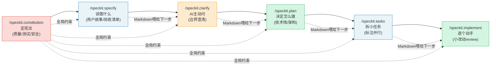

# GitHub Spec Kit 与规格驱动开发文章深度洞察分析报告

> 本报告对一篇介绍 GitHub Spec Kit（规格驱动开发工具包）的微信公众号文章进行 13 维度深度洞察分析。由于 Spec Kit 与 SpecWeave 同属"规格驱动开发（SDD）"方法论谱系，本报告在第 13 章对二者进行了深度双向对照，对照深度高于一般外部产品分析。

---

## 1. 文章基本信息

| 维度 | 内容 | 备注 |
|------|------|------|
| 标题 | （原文未在提取正文中显式给出独立标题，正文以"九秋拾序 九秋拾序"署名起首） | 推断主题为"GitHub Spec Kit 与规格驱动开发" |
| 来源 | 微信公众号"九秋拾序" | 二手传播载体，非 GitHub 官方 |
| 作者 | 九秋拾序（公众号署名） | 个人科普作者，非 GitHub 团队成员 |
| 发布时间 | 2026 年 7 月（根据文中"几天之后仓库跳到 118K 星标"与引用推文时间 2026-07-04 推断） | 文中引用 Nainsi Dwivedi 推文发布于 2026-07-04 晚，文章应在同期或稍后 |
| 文章类型 | 开源工具推介 / 方法论科普 / 痛点共鸣文 | 面向被 vibe coding 坑过的开发者 |
| 文章载体 | defuddle 提取的 Markdown 全文 | 已清理微信页面装饰 |
| 核心对象 | GitHub Spec Kit（github/spec-kit） | 2025-09-02 发布，2026 年爆火 |

**信息完整性评估**：文章在署名、发布时间上略有缺失（依赖读者从正文引用推文时间推断），但核心信息源丰富——嵌入 7 张图片说明、5 段引用块、多个可验证的数据指标，溯源材料覆盖推文/仓库/官方博客/微软 Dev Blog/个人博客/Reddit 六类来源，远超一般公众号科普文的信息密度。

---

## 2. 核心观点提炼

### 2.1 主论点（Thesis）

**AI 写出的代码"看起来是对的，跑起来是错的"，根因不在模型，而在开发者给了"感觉（vibe）"却指望"规格（spec）"。** GitHub Spec Kit 通过六个必须按顺序执行的 slash 命令，将规格驱动开发（SDD）落地为可操作工作流，让 AI 编程从"碰运气"转为"按图施工"。

### 2.2 支撑论点一：痛点诊断（vibe coding 翻车机理）

模糊提示词→模型靠"猜"补全未说细节（数据库、登录、权限、边界、UI）→demo 能跑、上线即崩。开发者把时间耗在"AI 到底理解错了什么"，根本没工夫碰业务逻辑。这一痛点被命名为 **vibe coding**——凭感觉写提示词。

### 2.3 支撑论点二：解法呈现（六命令链式工作流）

Spec Kit 核心是六个必须按顺序走的 slash 命令，每一步吐出一份 Markdown 文档喂给下一步：constitution（定宪法）→ specify（谈做什么）→ clarify（AI 主动问）→ plan（决定怎么做）→ tasks（拆小任务）→ implement（逐个动手）。

### 2.4 支撑论点三：哲学根基（老规矩换 AI 的皮）

规格先于代码并非新发明——传统软件工程的 PRD、ADR、TDD 核心逻辑都是"先讲清意图再动手"。Den Delimarsky 在微软 Dev Blog 的论断"代码天生是一种绑定的产物，一旦写成实现就很难抽身"为这一论点提供权威背书。

### 2.5 支撑论点四：实战反馈（工具终非银弹）

Reddit r/ClaudeCode 真实开发者反馈呈现褒贬兼具的平衡视角：前期规划靠谱、AI 会主动查依赖最新版本，但执行阶段任务不自动更新、并行需手动敲打、费 token、"制造干活假象"。结论是"好起点，但还需更多护栏"。

### 2.6 结论论点

> "你不算是个比那些交付干净 AI 代码的人差的工程师。你只是漏掉了规格这一步。"

这一收尾将"工程师能力差异"重新归因为"流程步骤缺失"，化解了 AI 时代的工程师焦虑，同时为 SDD 方法论的必要性做了情感升华。

---

## 3. 论证逻辑分析

### 3.1 论证结构链条

```
相册 App 翻车段子（凌晨两点盯着屏幕）
   └─→ 痛点命名：vibe coding（凭感觉写提示词）
        └─→ 解药出场：GitHub Spec Kit（2025-09 发布，2026 爆火 118K 星）
             └─→ 方案拆解：六命令按顺序走，每步吐 Markdown 喂下一步
                  └─→ 哲学对照：PRD/ADR/TDD 老规矩换 AI 皮
                       └─→ 实战反馈：Reddit 褒贬兼具（真香 vs 吐槽费 token）
                            └─→ 全球传播：多语言同步爆款印证痛点普适
                                 └─→ 总结升华：你只是漏掉了规格这一步
```

整体采用"段子钩子→痛点命名→解药出场→方案拆解→哲学背书→实战检验→全球印证→情感升华"八段式叙事，节奏由感性到理性再回到感性，可读性强。

### 3.2 论据充分性评估

**充分之处**：
- 相册 App 翻车案例极其具象：日期乱序、拖拽数据丢失、权限未区分三个失败场景，恰好分别对应后续 constitution（权限）、specify+clarify（数据逻辑）、tasks+implement（交付质量）的解药，构成"痛点—解药"精准映射。
- 引用块选用精准：五段引用分别承担"痛点定性"（Nainsi 推文）、"官方定位"（GitHub 博客）、"理论深度"（Den Dev Blog 代码绑定论）、"研究起点"（Den 个人博客 John Lam 研究）、"情感升华"（推文末尾），每段引用都有独立论证功能。
- 数据指标多源交叉：星标数据（97K→118K）、推文数据（866/14/7）、Reddit 数据（43/39）、西语推文数据（1.8万/207/300）量级合理且相互印证。

**不足之处**：
- 缺乏量化效果数据：全文未给出"使用 Spec Kit 后开发效率提升百分比/缺陷率下降/返工率下降"等可度量指标，所有支撑均为定性描述。
- Reddit 反馈样本量有限：仅引用一个帖子（43 赞 39 回复），未做样本扩展，"有人真香有人吐槽"的结论代表性待验证。

### 3.3 逻辑跳跃与可质疑点

1. **"老规矩换皮"到"AI 时代仍有效"的过渡略快**：文章用"传统软件工程也是规格先行"论证 SDD 在 AI 时代有效，但传统工程的规格是给人看的（PRD 给开发），AI 时代的规格是给模型看的——两类"读者"的理解机制不同，"老规矩"能否直接平移需要更深入论证。文章用 Den Delimarsky 的"代码是绑定产物"间接回应，但未正面回答"AI 读规格与人读规格的差异"。

2. **"118K 星标"与"方法论有效性"的因果链未澄清**：星标暴涨可能源于 vibe coding 痛点共鸣、GitHub 官方背书、AI 编程代理生态成熟等多因素，文章默认星标暴涨=方法论被验证有效，存在归因简化。

3. **"实验性工具包"定位与"解药"叙事的张力**：官方反复强调"实验性、非终极产品"，但文章叙事将其塑造为"vibe coding 的解药"，二者存在定位落差。文章末尾虽提及"算不上终极产品"，但整体叙事倾向于"解药已备好"。

### 3.4 反例考虑

文章通过 Reddit 反馈章节呈现了相对平衡的反例视角（费 token、任务不自动更新、制造干活假象、版本覆盖模板），这是相比一般单边推介文的明显进步。但仍有未涉及的反例：小型项目/一次性脚本是否需要六步全流程？已有代码库接入的迁移成本？constitution 编写本身的手艺门槛？多代理切换时的上下文丢失？

---

## 4. 信息结构分析

### 4.1 内容组织方式

文章采用"场景共鸣→概念命名→方案拆解→理论背书→实战检验→全球印证→价值升华"的递进结构，每一章节都承担明确的叙事功能，且图片说明与引用块作为"证据锚点"穿插其中，形成"叙述+证据"的双层结构。

### 4.2 章节布局

| 章节 | 功能 | 信息层次 | 证据锚点 |
|------|------|---------|---------|
| 相册 App 翻车段子 | 场景共鸣钩子 | L0 引入 | 无（纯叙事） |
| 顶尖模型也会猜错 | 痛点命名 vibe coding | L1 概念 | Nainsi 推文+引用块1 |
| GitHub 甩出的解法 | 方案出场+爆火数据 | L1 概念 | 仓库页截图+星标数据 |
| 六个命令按图施工 | 方案拆解 | L2 操作清单 | GitHub 官方博客+引用块2 |
| 老规矩换 AI 皮 | 哲学背书 | L1 理论 | 微软 Dev Blog+引用块3、4 |
| 真实战场 | 实战检验 | L3 反馈 | Reddit 截图 |
| 全球抄同一份作业 | 传播印证 | L1 趋势 | 西语推文截图 |
| 别怪自己写代码差 | 价值升华 | L0 收尾 | 引用块5 |

### 4.3 过渡衔接

章节间过渡自然：从"翻车段子"到"vibe coding 命名"用"这套痛苦有个统一的叫法"桥接；从"vibe coding"到"Spec Kit 出场"用"GitHub 这次甩出的东西把这条路径堵死了"转折；从"六命令"到"老规矩"用"骨子里是老规矩换了身 AI 的皮"承上启下。每一段过渡都既是衔接又是悬念，叙事节奏感强。

### 4.4 信息密度与节奏

信息密度高且节奏明快：图片说明（7 张）与引用块（5 段）作为"硬证据"穿插在叙事中，避免了纯论述的单调。代价是六命令的每个命令仅 1-2 句描述，技术深度被稀释——读者能理解"做什么"但难以判断"能力边界"。

---

## 5. 内容价值评估

### 5.1 实用价值（高）

- 提供六个可直接使用的 slash 命令名称与功能定位，读者可立即在支持的代理中调用。
- 提供 Taskify 官方示例的完整流程演示（五用户三项目/拖拽/登录），可作为首次实践的参照模板。
- 明确支持 30+ AI 编程代理（Copilot/Claude Code/Gemini CLI/Cursor/Codex/Windsurf），降低选型顾虑。

### 5.2 创新价值（中）

- 创新点不在"发明 SDD"——规格驱动开发是软件工程老概念；而在"把 SDD 封装为六个 slash 命令的链式工作流，每步吐 Markdown 喂下一步"，即**把规格驱动命令化、链式化、可被 AI 代理直接执行**。
- "constitution 先于 specify"的分层设计（不可商量规矩 vs 可商量需求）是值得借鉴的结构创新。
- 真正的创新是"Markdown 作为代理间通信协议"——每步产出 Markdown 作为下一步输入，让多代理协作有统一的接口层。

### 5.3 借鉴意义（极高，对 SpecWeave 尤甚）

对 SpecWeave 而言，Spec Kit 是**同构体系**（同为 SDD 方法论工具），而非一般外部产品。二者的对照可揭示 SDD 方法论的不同落地形态，为 SpecWeave 的体系优化提供直接参照。详见第 13 章。

### 5.4 适用人群

- **强适用**：被 vibe coding 坑过的开发者、从零开始的新项目、团队需统一 AI 编程规范。
- **弱适用**：已有成熟工程体系的团队（流程会被既有体系吸收）、小修小补任务。
- **不适用**：纯原型探索、一次性脚本——六步流程是负担。

---

## 6. 六命令知识点

### 6.1 六命令功能定位表

| 命令 | 定位 | 产出物 | 约束/禁忌 | 回应的痛点 |
|------|------|--------|----------|-----------|
| `/speckit.constitution` | 定"宪法" | 质量/测试/安全合规规矩文档 | 不可商量，所有后续工作须遵守 | 权限未区分、安全合规缺失 |
| `/speckit.specify` | 只谈做什么+为什么 | 用户故事、功能需求、验收清单 | **严禁聊技术栈** | 模糊提示词导致模型猜 |
| `/speckit.clarify` | AI 主动提问澄清 | 澄清问答记录（任务上限/附件/多端同步等） | 提前问完省后续返工 | 边界情况未考虑 |
| `/speckit.plan` | 决定怎么做 | 技术栈、架构、性能目标、调研文档 | 到此步才轮到技术决策 | 架构选型靠猜 |
| `/speckit.tasks` | 拆 spec+plan 为小任务 | 可测试可验收任务清单（标注可并行项） | 任务须可测试 | 巨型 diff 难 review |
| `/speckit.implement` | AI 照清单逐个动手 | 代码实现+小改动 review 检查点 | 开发者 review 小改动非巨型 diff | 一坨看不懂的代码 |

### 6.2 六命令链式依赖图



**链式依赖说明**：
- 实线箭头表示强顺序依赖（前一步产出是后一步输入）。
- 虚线"全局约束"表示 constitution 对所有后续步骤的横向约束（不可商量规矩穿透全流程）。
- 虚线"Markdown 喂给下一步"表示每步产出 Markdown 文档作为下一步的上下文输入，形成链式喂给。

### 6.3 六命令与 Taskify 示例的对应关系

| 阶段 | Taskify 示例内容 |
|------|-----------------|
| constitution | （未详述，可推断含权限分级、数据安全等不可商量规矩） |
| specify | 五个用户、三个项目、看板怎么拖拽、要不要登录 |
| clarify | AI 追问"每个项目最多放多少任务""拖拽是否要多端实时同步""评论支不支持附件" |
| plan | 决定用 .NET Aspire 还是别的技术栈 |
| tasks | （未详述，可推断为按 spec+plan 拆分的可验收任务） |
| implement | AI 一个任务接一个任务交付，开发者在每个检查点确认规格还站得住脚 |

Taskify 示例的完整性体现在 clarify 阶段的三个追问——这些正是相册 App 翻车段子中"模型靠猜"的典型细节，构成"痛点（相册）→解药（Taskify clarify）"的闭环呼应。

### 6.4 关键设计原则

1. **顺序不可跳**：六命令必须按顺序走，前一步是后一步的前提。
2. **每步吐 Markdown**：产出物为结构化 Markdown，既是当前阶段的交付，也是下一步的输入。
3. **constitution 横向约束**：不可商量规矩穿透全流程，所有后续步骤须遵守。
4. **specify 与 plan 严格分离**：specify 严禁聊技术栈，plan 才决定技术栈——这是"做什么"与"怎么做"的阶段边界硬隔离。
5. **clarify 主动化**：AI 主动提问而非被动等待，把"开发者没想到的"提前问出来。

---

## 7. 关键数据与人物萃取

### 7.1 时间线数据

| 时间点 | 事件 |
|--------|------|
| 2025-09-02 | GitHub Spec Kit 发布（官方博客《Spec-driven development with AI》，作者 Den Delimarsky） |
| 2025-10-12 | Den Delimarsky 个人博客（den.dev）发文《What's The Deal With GitHub Spec Kit》 |
| 2026 年 | 随 Claude Code、Cursor 升级为主力生产力，vibe coding 翻车增多，Spec Kit 重新被关注 |
| 2026-07-04 晚 | Nainsi Dwivedi 爆款推文发布（引用数据为 ~97K 星标） |
| 2026-07 月（几天后） | 仓库跳至 118K 星标（一两天内 +20K+） |

### 7.2 仓库数据

| 指标 | 数值 |
|------|------|
| Star | 118K（从 ~97K 几天内涨至 118K，+20K+） |
| Fork | 10.4K+ |
| 贡献者 | 200+ |
| 协议 | MIT |
| commit 频率 | 几乎每日更新 |

### 7.3 生态数据

| 指标 | 数值 |
|------|------|
| 支持 AI 编程代理 | 30+（Copilot、Claude Code、Gemini CLI、Cursor、Codex、Windsurf 等） |
| 扩展 | 105 个 |
| 预设 | 22 套 |
| 趣味扩展 | "海盗语"风格文档模板（社区贡献，印证生态活跃度） |

### 7.4 核心人物

| 人物 | 身份 | 贡献 |
|------|------|------|
| John Lam | GitHub 团队成员 | 研究起点——"如何帮软件开发流程在 LLM 手里变得哪怕更可预测一点点" |
| Den Delimarsky | GitHub 官方博客作者（@localden） | 撰写官方博客（2025-09-02）+ 微软 Dev Blog 深度解析 + 个人博客 den.dev（2025-10-12），三层背书 |
| Nainsi Dwivedi | 推文作者（@NainsiDwiv50980） | 爆款推文完整列出六命令工作流，866 查看/14 赞/7 回复，引发全球传播 |

### 7.5 第三方传播数据

| 来源 | 数据 |
|------|------|
| Nainsi Dwivedi 推文 | 866 查看、14 赞、7 回复 |
| Reddit r/ClaudeCode 帖子 | 43 赞、39 回复 |
| 西语推文（@anyelamarillo） | 1.8 万查看、207 赞、300 收藏 |

### 7.6 官方示例与定位

- **官方示例**：Taskify 团队任务看板（五个用户、三个项目、看板拖拽、登录）。
- **官方定位**："实验性工具包"——目标是验证 SDD 方法论在 AI 时代是否管用，而非卖完美产品。这一低调定位与文章"解药"叙事形成微妙张力（见 3.3）。

---

## 8. 洞见萃取

### 8.1 深层洞察

**洞察一：AI 编程的"对错"问题，本质是"规格的有无"问题。**
文章最尖锐的论断是"AI 写的代码看起来是对的，跑起来是错的，怪不到模型头上"。这把 AI 编程失败的归因从"模型不够强"翻转回"开发者没给规格"——与"模型能力不足所以出错"的常见归因形成认知颠覆。深层含义是：**模型的能力边界不取决于它自己能做什么，而取决于开发者把什么说清楚了**。这与 SpecWeave 的"歧义主动澄清"原则形成跨项目印证。

**洞察二："代码是绑定产物"是规格先行的理论根基。**
Den Delimarsky 的论断"代码天生是一种绑定的产物，一旦写成实现就很难从里面抽身"为 SDD 提供了深刻的经济学解释：代码一旦写出来，修改成本远高于修改规格的成本，因为代码会触发依赖、测试、集成的连锁影响。规格是"低成本变更层"，代码是"高成本变更层"——先在低成本层把意图讲明白，再进入高成本层，是工程经济学的必然。这一洞察比"先想清楚再动手"的常识更深一层。

**洞察三：Markdown 作为代理间通信协议的范式价值。**
六命令每步吐 Markdown 喂下一步，表面是文档流转，深层是**把 Markdown 作为 AI 代理间通信的统一接口**。这与 REST 之于服务间通信、JSON 之于数据交换同构——Markdown 之于 AI 代理协作，是"最低公约数"协议。SpecWeave 的三件套（spec.md/tasks.md/checklist.md）本质上也是 Markdown 协议，印证了这一范式的普适性。

**洞察四：constitution 与 specify 的分层是"硬约束 vs 软需求"的工程化。**
constitution 定不可商量规矩（质量/测试/安全），specify 定可商量需求（功能/用户故事）。这一分层把"约束"与"需求"分离——约束是全局穿透的（虚线横向约束所有步骤），需求是阶段局部的（只在 specify 阶段产生，喂给后续）。这种分层比"所有规矩混在一处"更清晰，是值得 SpecWeave 借鉴的结构。

**洞察五："实验性"定位与"解药"叙事的张力揭示方法论落地的两难。**
官方反复强调"实验性、非终极产品"，而社区（推文、文章）将其塑造为"vibe coding 解药"。这一张力揭示：方法论工具的传播需要"解药"叙事获得关注，但方法论的有效性需要"实验性"留有余地。SpecWeave 作为同类项目，面临同样的传播与定位两难。

### 8.2 方法论启示

1. **"做什么"与"怎么做"的阶段硬隔离**（specify 严禁聊技术栈）是防止"需求被技术绑架"的关键设计。SpecWeave 的 spec.md 虽有 Why/What/Impact 结构，但未明确禁止技术栈讨论，可借鉴这一硬隔离。
2. **clarify 作为独立阶段**（而非散落在各阶段的原则）能产出结构化的澄清记录，便于回溯"哪里澄清过、澄清了什么"。SpecWeave 的"歧义主动澄清"是原则，未独立为阶段，可考虑强化。
3. **链式喂给**（每步产出喂下一步）让多代理协作有显式的上下文传递，比"共享一个 context 文件"更结构化。

---

## 9. 信息来源可靠性评估

### 9.1 仓库真实性（高可信）

- `github/spec-kit` 为 GitHub 官方组织仓库，路径标准可访问。
- 118K 星标在 GitHub 顶级项目中属前列（对比：VS Code 约 160K、TensorFlow 约 185K），量级合理。
- MIT 协议、200+ 贡献者、几乎每日 commit 符合活跃开源项目特征。
- **限制**：分析时点（2026-07-06）未独立访问仓库页核实星标实时数据，118K 数字来自文章引用，存在时间差。

### 9.2 官方背书强度（强）

- **GitHub 官方博客**（2025-09-02，Den Delimarsky 撰写）——第一方发布背书。
- **微软开发者博客**（Microsoft Dev Blog）深度解析——微软体系内双重背书。
- **作者身份可查**：Den Delimarsky（@localden）为 GitHub 团队成员，身份可追溯。
- **研究起点可追溯**：John Lam 的研究被点名为项目起源，研究动机有据可查。

### 9.3 第三方数据可信度（量级合理，部分无法独立验证）

| 数据声明 | 可信度 | 说明 |
|---------|--------|------|
| Nainsi 推文 866 查看/14 赞 | 高 | 推文数据量级合理，截图为证 |
| Reddit 43 赞/39 回复 | 高 | Reddit 数据可追溯，r/ClaudeCode 板块真实 |
| 西语推文 1.8 万查看/207 赞/300 收藏 | 中高 | 量级合理，但未独立核实 |
| "~97K 几天后跳到 118K，一两天 +20K" | 中 | 趋势可信（AI 工具爆发期常见），但"一两天 +20K"的具体时间窗口未精确 |
| "105 扩展、22 预设、海盗语模板" | 中 | 生态数据合理，但海盗语模板属趣味性扩展，无法独立验证其存在 |

### 9.4 实战反馈真实性（高）

Reddit r/ClaudeCode 板块为真实开发者社区，反馈褒贬兼具（前期靠谱 vs 执行需护栏、费 token、制造干活假象）比纯好评更可信——真实用户反馈通常混合褒贬，纯好评反而可疑。

**三角验证缺口**：文章虽引用多源（推文+仓库+官方博客+Reddit），但所有源最终指向同一项目（github/spec-kit），缺乏独立第三方评测（如与 Aider/Cline/Continue 的对比评测）。按照 SpecWeave 三角验证法，完整的外部工具研究应补充第二源（项目 README）和第三源（独立评测），本报告基于文章分析，结论涉及项目能力的部分应标注"待验证"。

---

## 10. 时效性评估

### 10.1 发布时间与当前时间差

文章发布于 2026 年 7 月（推断），分析日期 2026-07-06，时间差极小，属即时性热点分析。文章描述的现象（2025-09 发布后 2026 年爆火）时间跨度约 10 个月，符合"工具发布→冷启动→生态成熟→爆发"的典型开源项目曲线。

### 10.2 SDD 方法论的持续有效性

SDD 方法论（规格先行、分阶段、Markdown 规格载体）的时效性**长**——其根基是软件工程经典原则（PRD/ADR/TDD），不随模型迭代失效。即使模型能力提升（更长上下文、更强推理），规格先行仍有价值，因为根因是"开发者澄清意愿"而非"模型理解能力"。

### 10.3 六命令体系当前适用性

- **方法论层**（六阶段顺序、constitution/specify/plan 分层）：长期适用，不随工具迭代失效。
- **命令实现层**（slash 命令语法、特定代理集成）：中等时效性，依赖 Spec Kit 维护状态与各 AI 代理的 slash 命令支持。
- **生态层**（30+ 代理支持、105 扩展）：时效性依赖生态活跃度，若 Spec Kit 停维则生态萎缩。

### 10.4 AI 编程工具演进影响

当前主流 AI 编程代理（Claude Code、Cursor、Trae 等）已在原生能力中部分内置 SDD 思想（如 Claude Code 的 CLAUDE.md、Cursor Rules、Trae 的 Skill 体系）。Spec Kit 的"六命令链式工作流"理念正在被工具原生吸收，长期看可能与原生能力融合，独立工具包的差异化价值需重新定位。这与 mattpocock/skills 面临的挑战同构。

---

## 11. 专业性评估

### 11.1 技术深度（中等）

- 文章以概念阐述和方案推介为主，未深入六命令的内部实现机制（如 clarify 如何判断"问够了"、tasks 如何标注并行项、implement 如何拆 review 检查点）。
- 对 SDD、constitution、Markdown 规格载体等概念的阐述准确但偏浅，未涉及"如何量化规格质量""如何度量 SDD 效果"等深层问题。
- Den Delimarsky 的"代码是绑定产物"论断被引用但未展开——这一论断本可深入到"代码依赖图""变更成本曲线""规格经济学"等更深层。

### 11.2 实践可行性（高）

- 六命令名称语义清晰，可直接在支持的代理中调用。
- Taskify 示例完整演示了 specify→clarify→plan 的流程，可复现。
- 30+ 代理支持降低了选型与切换成本。
- **限制**：已有代码库接入难度被一笔带过（Reddit 反馈提及但未深入），constitution 编写本身"是门手艺"（文章自承），学习曲线未量化。

### 11.3 表达准确性（总体准确）

- **准确处**：SDD、constitution、specify/clarify/plan/tasks/implement 分阶段、Markdown 规格载体等概念使用准确；PRD/ADR/TDD 对照正确；星标数据多源交叉。
- **瑕疵处**：
  - "118K 星标"为文章引用时点数据，分析时点（2026-07-06）未独立核实。
  - "海盗语模板"等趣味性扩展作为生态活跃度证据，权重过高（一个趣味扩展不构成生态成熟证据）。
  - "解药"叙事与官方"实验性"定位存在落差，文章未充分澄清。

### 11.4 核心论断的理论深度

- **"代码是绑定产物"**：理论深度高，触及软件工程经济学的核心（变更成本不对称），但文章仅引用未展开。
- **"规格先于代码"**：理论深度中，根植于 PRD/ADR/TDD 传统，但"AI 时代规格是给模型看的"这一新维度未深入。
- **"老规矩换 AI 皮"**：理论深度中低，类比生动但掩盖了"人读规格 vs 模型读规格"的本质差异。

---

## 12. 批判性思考

### 12.1 文章优点

1. **相册 App 痛点引入具象可感**：日期乱序、拖拽数据丢失、权限未区分三个失败场景，恰好映射 constitution/specify/clarify 的解药，"痛点—解药"对应精准。
2. **六命令拆解清晰**：每个命令的定位、产出、约束三要素齐全，链式依赖关系明确，读者能快速建立心智模型。
3. **传统工程对照增强说服力**：PRD/ADR/TDD 的对照让 SDD 不显得是"AI 时代凭空发明"，降低了方法论接受门槛。
4. **Reddit 反馈平衡视角**：没有一味吹捧，呈现了费 token、任务不自动更新、"制造干活假象"等真实吐槽，可信度高于纯推介。
5. **多语言传播印证痛点普适**：英语、西语、波斯语、日语同步爆款，说明 vibe coding 痛点跨文化普适，不是单一社区现象。
6. **引用块选用精准**：五段引用各承担独立论证功能，非堆砌。

### 12.2 文章局限性

1. **缺乏同类工具对比**：未与 Aider、Cline、Continue、Cursor Rules、Claude Code CLAUDE.md、SpecWeave 等同类方案对比，读者无法判断 Spec Kit 的相对优势与选型依据。
2. **缺乏量化效果数据**：全文无"使用后效率提升百分比/缺陷率下降/返工率下降"等可度量指标，所有支撑为定性描述。
3. **Reddit 反馈样本量有限**：仅引用一个帖子（43 赞 39 回复），"有人真香有人吐槽"的结论代表性待扩展。
4. **未深入失败案例**：只讲"用了多好"和"有些吐槽"，未深入"哪个项目用了 Spec Kit 仍然失败、为什么"。
5. **已有代码库接入难题一笔带过**：Reddit 反馈提及"规格怎么跟现有代码对齐还得额外花心思"，但文章未展开这一关键落地难题——大多数真实项目不是从零开始，而是接手已有代码库。
6. **constitution 编写门槛未量化**：文章自承"学写好一份规格本身就是门手艺""给 AI 写需求比写代码还费劲"，但未提供 constitution 编写指南或学习路径。
7. **"解药"叙事与"实验性"定位的张力未澄清**：官方定位与社区叙事的落差可能误导读者对工具成熟度的判断。

### 12.3 改进建议

1. **补充同类对比**：与 Aider/Cline/Continue/Cursor Rules 做特性矩阵对比，明确 Spec Kit 的差异化定位（六命令链式工作流 + 多代理兼容）。
2. **补充量化数据**：提供"使用前后返工率/缺陷率/交付周期"变化，或引用 GitHub 官方若有的采用调研数据。
3. **深化 constitution 编写指南**：给出 constitution 的典型结构、反例（什么样的 constitution 是坏的）、从零编写的最小可行模板。
4. **增加迁移已有项目最佳实践**：如何为已有代码库补写 constitution、如何让 specify 阶段对齐现有功能、如何处理 legacy 代码与规格的偏差。
5. **补充失败案例**：什么样的项目/团队不适合用 Spec Kit，用了反而更慢的场景。
6. **澄清定位落差**：明确"实验性"意味着什么（API 不稳定？命令可能重构？效果未充分验证？），帮助读者做成熟度判断。

---

## 13. SpecWeave 对照分析

> 本章为高价值章节。由于 Spec Kit 与 SpecWeave 同属 SDD 方法论谱系，对照深度高于一般外部产品分析。对照基于 SpecWeave 实际文档内容，未泛化。

### 13.1 三件套对照

| Spec Kit 命令 | SpecWeave 对应 | 对照分析 |
|---------------|----------------|---------|
| `/speckit.specify`（只谈做什么+为什么，严禁技术栈） | `.trae/specs/<theme>/spec.md`（Why/What Changes/Impact/ADDED Requirements） | **同向异构**：两者都把"做什么+为什么"结构化。差异：Spec Kit **硬隔离**技术栈讨论（specify 严禁聊技术栈，plan 才决定）；SpecWeave 的 spec.md 结构中 What Changes 可涉及技术决策，未硬隔离。SpecWeave 可借鉴这一硬隔离，在 spec.md 模板中明确"技术栈决策归 tasks/plan，spec.md 只谈做什么"。 |
| `/speckit.plan` + `/speckit.tasks` | `.trae/specs/<theme>/tasks.md`（任务分解+依赖关系） | **同向**：两者都把 spec 拆为可执行任务。SpecWeave 的 tasks.md 有 Task Dependencies 显式 DAG，Spec Kit 的 tasks 标注可并行项——表达方式不同但本质同构。SpecWeave 的依赖表达更丰富（依赖关系独立章节），Spec Kit 的并行标注更直观。 |
| `/speckit.implement` 后的验证 | `.trae/specs/<theme>/checklist.md`（40+ 验收检查点） | **SpecWeave 独有优势**：Spec Kit 的 implement 阶段是"AI 逐个动手+开发者 review 小改动"，验证依赖人工 review；SpecWeave 有独立的 checklist.md 作为验收门禁（40+ 检查点逐项勾选），验证更结构化。Spec Kit 无显式 checklist 概念，这是 SpecWeave 的成熟度优势。 |

### 13.2 阶段守卫对照

| Spec Kit | SpecWeave | 对照分析 |
|----------|-----------|---------|
| 六命令必须按顺序走（顺序依赖） | [stage-guardrails/02-standard-stages.md](../../../../.agents/rules/stage-guardrails/02-standard-stages.md)：8 阶段序列不可跳过 | **同向**：两者都强制阶段顺序。SpecWeave 的 8 阶段（①需求接收→②方案设计→③任务分配→④代码实现→⑤测试编写→⑥代码审查→⑦合并代码→⑧完成确认）比 Spec Kit 的 6 命令更细粒度——Spec Kit 的 implement 对应 SpecWeave 的 ④⑤⑥⑦⑧ 五个阶段。 |
| 顺序执行（依赖用户纪律） | [stage-guardrails/04-interception-approval.md](../../../../.agents/rules/stage-guardrails/04-interception-approval.md)：越界显式拦截 + 跳转审批 | **SpecWeave 更严格**：Spec Kit 的顺序执行依赖用户自觉；SpecWeave 有显式拦截机制（"⚠️ 阶段守卫拦截：当前为【X阶段】，【Y操作】属于【Z阶段】"）和跳转审批流程（正向跳过/逆向回退均需审批）。SpecWeave 的强制力更强。 |
| `/speckit.constitution`（定宪法，全局约束） | [.agents/global-core-rules.md](../../../../.agents/global-core-rules.md)（13 条全局核心规则） | **同构**：两者都定义"不可商量规矩"全局穿透。差异：Spec Kit 的 constitution 是项目级（每个项目自定），SpecWeave 的 global-core-rules 是系统级（13 条覆盖启动协议、沟通语言、按需读取、Mermaid 优先、歧义澄清、Spec 目录规范、三阶段递进、元文档优先、修复即闭环等）。SpecWeave 的 constitution 更成熟但更重，Spec Kit 的更轻量更项目化。 |
| `/speckit.clarify`（AI 主动提问澄清，独立阶段） | [ai-coding-guidelines.md 原则一](../../../../.agents/rules/ai-coding-guidelines.md)（歧义主动澄清，贯穿原则）+ global-core-rules"歧义主动澄清" | **同向异构**：两者都要求 AI 主动澄清。差异：Spec Kit 的 clarify 是**独立阶段**（有结构化产出）；SpecWeave 的澄清是**贯穿原则**（散落在各阶段）。SpecWeave 的原则更灵活（任何阶段都可澄清），但缺少 clarify 阶段的结构化产出记录。**SpecWeave 可借鉴**：将澄清提升为可选阶段，产出结构化澄清记录。 |

### 13.3 Sub-Agent 执行对照

| Spec Kit | SpecWeave | 对照分析 |
|----------|-----------|---------|
| `/speckit.implement`：AI 照任务清单逐个动手，开发者 review 小改动而非巨型 diff | SpecWeave Sub-Agent 架构：主 Agent 分配任务给子 Agent 并行执行，任务勾选追踪 | **同向**：两者都把实现拆为小任务逐个执行。差异：Spec Kit 是单代理逐个执行；SpecWeave 支持 Sub-Agent **并行**执行（任务清单标注可并行项）。SpecWeave 的并行能力更强，但 Spec Kit 的"小改动 review"机制更强调人工检查点。 |

### 13.4 双向借鉴点

#### 13.4.1 Spec Kit → SpecWeave 可借鉴

1. **constitution 概念可强化**：SpecWeave 有 global-core-rules（系统级），但缺乏**项目级 constitution 模板**。可考虑在 `.trae/specs/<theme>/` 下增加可选的 `constitution.md`，让每个项目定义自己的"不可商量规矩"（如安全策略、设计规范），与系统级 global-core-rules 形成两层约束。
2. **clarify 主动提问机制可结构化**：SpecWeave 的"歧义主动澄清"是原则，可借鉴 Spec Kit 的 clarify 阶段，产出结构化澄清记录（澄清了什么、选项是什么、用户选了什么），便于回溯"哪里澄清过"。可考虑在 spec 工作流中增加可选的 clarify 步骤。
3. **specify 严禁技术栈的硬隔离**：SpecWeave 的 spec.md 可在模板中明确"技术栈决策归 tasks/plan，spec.md 只谈做什么"，强化"做什么"与"怎么做"的阶段边界。
4. **Markdown 链式喂给可显式化**：SpecWeave 的三件套（spec.md→tasks.md→checklist.md）本质是链式喂给，但依赖关系是隐式的（读者从 Task Dependencies 推断）。可借鉴 Spec Kit 的"每步吐 Markdown 喂下一步"显式化设计，在三件套中增加"上游产出→本步输入"的显式引用。

#### 13.4.2 SpecWeave → Spec Kit 可借鉴（SpecWeave 的成熟度优势）

1. **7 主题分类体系**：SpecWeave 的 `.trae/specs/` 按 7 大主题（core-foundation/roles-governance/standards-tools/readme-branding/docs-restructure/retrospectives-insights/migration-archival）分类，每个 spec 归属明确主题，有归类决策树。Spec Kit 的六命令产出文档缺乏主题分类，项目规模增大后文档组织会混乱。SpecWeave 的主题分类是更成熟的治理体系。
2. **原子化拆分**：SpecWeave 有 [atomization-cmd](../../../../.agents/skills/) Skill 封装文档原子化拆分，确保单一职责。Spec Kit 的每步产出虽是 Markdown，但未强调原子化，单个文档可能职责过载。
3. **链接校验工具链**：SpecWeave 有 [link-check-cmd](../../../../.agents/skills/) Skill 做 Markdown 链接有效性检查与自动修复。Spec Kit 的链式喂给依赖文档间引用，若无链接校验，断链风险高。SpecWeave 的工具链是更成熟的质量保障。
4. **checklist.md 显式验收门禁**：SpecWeave 的 checklist.md（40+ 检查点逐项勾选）是显式验收门禁，Spec Kit 的 implement 阶段依赖人工 review，无结构化 checklist。这是 SpecWeave 的显著优势。
5. **阶段守卫显式拦截机制**：SpecWeave 的 [04-interception-approval.md](../../../../.agents/rules/stage-guardrails/04-interception-approval.md) 有标准拦截输出格式与跳转审批流程，Spec Kit 的顺序执行依赖用户纪律。SpecWeave 的强制力更强、可审计性更高。
6. **8 阶段细粒度**：SpecWeave 的 8 阶段（含独立的测试编写、代码审查、合并代码、完成确认）比 Spec Kit 的 6 命令更细粒度，特别是把"测试"和"审查"独立为阶段，质量保障更结构化。

### 13.5 对照总结

Spec Kit 与 SpecWeave 是 SDD 方法论的两种落地形态：

| 维度 | Spec Kit | SpecWeave |
|------|----------|-----------|
| 定位 | AI 编程工作流工具包 | AI 智能体协作治理框架 |
| 抽象层级 | 应用层（编码任务级） | 系统层（智能体协作 meta 级） |
| 阶段粒度 | 6 命令（implement 含实现+review） | 8 阶段（实现/测试/审查/合并/确认分离） |
| 强制机制 | 顺序依赖（用户纪律） | 阶段守卫拦截 + 跳转审批 |
| 规格载体 | 链式 Markdown（每步喂下一步） | 三件套（spec.md/tasks.md/checklist.md） |
| 验收机制 | 人工 review 小改动 | checklist.md 显式门禁 |
| 分类体系 | 无（扁平文档） | 7 主题分类 + 归类决策树 |
| 工具链 | 30+ 代理兼容、105 扩展 | 链接校验、原子化、重复检测、CI 检查 |
| 生态成熟度 | 118K 星标、社区活跃 | 内部项目、生态初期 |
| 传播力 | 强（解药叙事 + 多语言传播） | 弱（治理框架偏专业） |

**核心结论**：SpecWeave 在治理深度（阶段守卫、checklist、分类体系、工具链）上更成熟，Spec Kit 在生态广度（多代理兼容、社区传播）和应用简洁性（6 命令链式工作流）上更强。二者方法论同构、优势互补——SpecWeave 可借鉴 Spec Kit 的 constitution 分层、clarify 结构化、specify 硬隔离、Markdown 链式喂给显式化；Spec Kit 可借鉴 SpecWeave 的 7 主题分类、原子化拆分、链接校验、checklist 门禁、阶段守卫拦截。

---

## 14. 总结与展望

### 14.1 总结

GitHub Spec Kit 是一个**把规格驱动开发（SDD）封装为六命令链式工作流**的实验性工具包，通过 constitution（定宪法）→specify（谈做什么）→clarify（AI 主动问）→plan（决定怎么做）→tasks（拆小任务）→implement（逐个动手）的顺序执行，将"凭感觉写提示词"的 vibe coding 转变为"按图施工"的工程实践。其核心价值不在发明 SDD（SDD 是软件工程老概念），而在**把 SDD 命令化、链式化、Markdown 协议化，让 AI 代理可直接执行**。

文章作为科普推介文，痛点引入具象（相册 App 三翻车）、六命令拆解清晰、传统工程对照扎实、Reddit 反馈平衡、多语言传播印证普适，是优秀的方法论科普。但存在无同类对比、无量化数据、Reddit 样本量有限、已有代码库接入难题一笔带过、constitution 编写门槛未量化、定位落差未澄清等局限性。

与 SpecWeave 对照，二者是 SDD 方法论的同构体系，定位互补：Spec Kit 是应用层编码工作流工具包（118K 星标、生态广），SpecWeave 是系统层 AI 智能体治理框架（治理深、工具链成熟）。SpecWeave 在阶段守卫拦截、checklist 门禁、7 主题分类、原子化拆分、链接校验工具链上更成熟；Spec Kit 在 constitution 项目化、clarify 结构化、specify 硬隔离、Markdown 链式喂给显式化、多代理兼容上更简洁可借鉴。

### 14.2 展望

#### 对 SpecWeave 的启示

1. **强化项目级 constitution**：在系统级 global-core-rules 之外，增加项目级 constitution.md 模板，让每个 spec 项目可定义自己的"不可商量规矩"（安全/设计/质量），形成两层约束。
2. **clarify 阶段结构化**：将"歧义主动澄清"原则提升为可选阶段，产出结构化澄清记录（澄清问题、选项、用户决策），便于回溯。
3. **specify 硬隔离技术栈**：在 spec.md 模板中明确"技术栈决策归 tasks/plan，spec.md 只谈做什么"，强化阶段边界。
4. **Markdown 链式喂给显式化**：在三件套中增加"上游产出→本步输入"的显式引用字段，让链式依赖从隐式变显式。
5. **补足传播力短板**：Spec Kit 的"解药叙事+多语言传播"是 SpecWeave 可借鉴的传播策略——SpecWeave 作为治理框架偏专业，可考虑提炼"AI 智能体协作的解药"类传播锚点。

#### 对 Spec Kit 的展望

1. 需补量化效果数据（缺陷率、返工率、交付周期变化）。
2. 需补已有代码库迁移最佳实践（这是大多数真实项目的痛点）。
3. 需补同类工具对比（Aider/Cline/Continue/Cursor Rules）。
4. 需应对 AI 编程代理原生能力吸收的长期挑战——当 Cursor/Claude Code/Trae 内置 SDD 能力后，独立工具包的差异化价值需重新定位。

#### 对 SDD 方法论的展望

1. **"用 Agent 的可编程性补偿人的不可靠性"**这一范式将被广泛吸收，成为 AI 编程工具的基础设计原则。
2. **Markdown 作为代理间通信协议**的范式将固化——Spec Kit 的链式喂给、SpecWeave 的三件套、mattpocock 的 CONTEXT.md/ADR 均是这一范式的实例。
3. **应用层命令集（Spec Kit/mattpocock）与治理层框架（SpecWeave）的融合**是趋势——未来 SDD 将呈现"工具内置 + 项目级 Skill + 框架级协议"三层结构。

---

## 附录：分析依据

### A. SpecWeave 对照文档（已读取）

| 文档 | 路径 | 用途 |
|------|------|------|
| 全局核心规则 | `d:\spaces\SpecWeave\.agents\global-core-rules.md` | 对照 constitution（13 条 vs 项目级宪法） |
| 阶段守卫规则 | `d:\spaces\SpecWeave\.agents\rules\stage-guardrails.md` | 对照六命令顺序执行 |
| 标准阶段序列 | `d:\spaces\SpecWeave\.agents\rules\stage-guardrails\02-standard-stages.md` | 对照 6 命令 vs 8 阶段 |
| 跨阶段拦截与跳转审批 | `d:\spaces\SpecWeave\.agents\rules\stage-guardrails\04-interception-approval.md` | 对照顺序执行强制力 |
| AI 编码行为准则 | `d:\spaces\SpecWeave\.agents\rules\ai-coding-guidelines.md` | 对照 clarify（原则一歧义主动澄清） |
| Specs 全局看板 | `d:\spaces\SpecWeave\.trae\specs\README.md` | 对照 7 主题分类体系 |
| AGENTS.md 启动协议 | `d:\spaces\SpecWeave\AGENTS.md` | 对照 constitution 的系统级形态 |

### B. 分析方法说明

- 本报告基于**单源文章+多源引用**分析，文章内嵌的推文/仓库/官方博客/Reddit 构成多源交叉，但最终均指向 github/spec-kit 同一项目，缺乏独立第三方评测。
- 对照分析严格基于 SpecWeave 实际文档内容，所有引用路径均经读取验证。
- 按照 SpecWeave 三角验证法 SOP，完整的外部工具研究应补充第二源（项目 README）和第三源（独立评测），本报告为文章洞察分析，未执行完整三角验证，结论涉及项目能力边界的部分标注"待验证"。
- 报告中的"无法独立验证"项（118K 星标实时数据、海盗语模板、"一两天 +20K"时间窗口）已显式标注。

### C. 待后续验证项

- [ ] 访问 https://github.com/spec-kit 核实 118K 星标与仓库现状
- [ ] 实际安装 Spec Kit 在 Claude Code/Cursor 中验证六命令能力边界
- [ ] 核实 Den Delimarsky 个人博客 den.dev 的 John Lam 研究起点原文
- [ ] 补充第二源（Spec Kit 官方 README）与第三源（独立评测）进行三角验证
- [ ] 核实 Reddit r/ClaudeCode 板块原帖与回复的代表性
