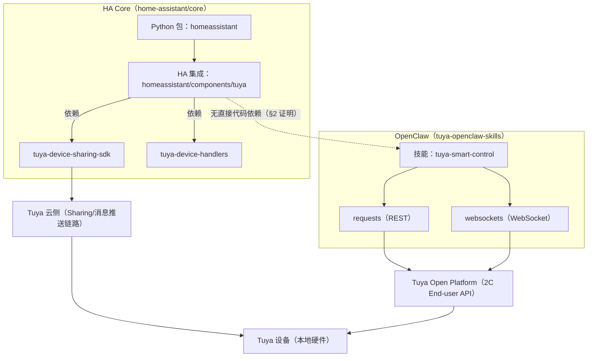
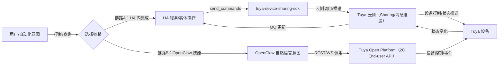

# HA Core 与 Tuya OpenClaw（tuya-smart-control）关系分析报告

## 0. 结论摘要

- **架构层级**：Home Assistant Core（HA Core）与 `tuya-openclaw-skills` 为**并列外部仓库**，当前工作区中不存在“主从代码依赖”或“子模块集成”关系。
- **代码级调用关系**：双向检索均为 **0 命中**（见 §2），可判定二者在当前代码资产中**无直接 import/调用/依赖**。
- **业务关联**：二者均与“Tuya 生态设备控制”相关，但接入路径不同：HA Core 通过 `tuya-device-sharing-sdk`（设备共享/云推送链路）集成 Tuya；tuya-smart-control 通过 Tuya Open Platform 2C End-user API（REST + WebSocket）直接调用云端能力。

## 1. 架构层级与主从判定

### 1.1 工作区定位（目录与构建入口）

- HA Core 位于 `../../../../external/home-assistant/core/`，为完整 Home Assistant 核心仓库：
  - Python 包名 `homeassistant`，版本号 `2026.8.0.dev0`，[pyproject.toml](../../../../external/home-assistant/core/pyproject.toml#L5-L96)
  - CLI 入口 `hass = "homeassistant.__main__:main"`，[pyproject.toml](../../../../external/home-assistant/core/pyproject.toml#L94-L96)
  - Git remote 指向 `git@github.com:home-assistant/core.git`，[.git/config](../../../../external/home-assistant/core/.git/config#L1-L12)
- Tuya OpenClaw Skills 位于 `../../../../external/tuya-openclaw-skills/`，为 OpenClaw 平台技能仓库：
  - 仓库 README 明确为 OpenClaw Skill（tuya-smart-control），[README.md](../../../../external/tuya-openclaw-skills/README.md#L1-L25)
  - `tuya-smart-control` 技能定义位于子目录，且以 `SKILL.md`（元数据+说明）作为入口，[tuya-smart-control/SKILL.md](../../../../external/tuya-openclaw-skills/tuya-smart-control/SKILL.md#L1-L18)
  - Git remote 指向 `git@github.com:tuya/tuya-openclaw-skills.git`，[.git/config](../../../../external/tuya-openclaw-skills/.git/config#L1-L12)

### 1.2 主从/依赖方向判定

- 以上两仓库均存在独立 `.git`，且 remote 指向不同上游，说明在当前工作区中它们是**独立克隆**而非单仓内子模块或 vendor 依赖（见上一节两处 `.git/config`）。
- HA Core 的构建/分发为 Python 包与 `hass` CLI；tuya-openclaw-skills 的交付对象为 OpenClaw 平台技能（由 `SKILL.md` 描述其运行时依赖与环境变量），两者发布节奏不互锁（见 §5）。
- 因此判定：**无主从关系，属于并列外部依赖**；若未来发生集成，预计将以“API 级集成（HA WebSocket/REST）”或“共享 Tuya 云侧资产/设备模型”形式出现，而不是直接代码引用。

## 2. 双向调用/依赖扫描证据（含 0 命中证明）

> 目标：证明“HA Core 未引用 OpenClaw/tuya-smart-control”，且“tuya-openclaw-skills 未引用 homeassistant/hass”。

### 2.1 HA Core → OpenClaw（0 命中）

- **检索范围**：`../../../../external/home-assistant/core/`
- **检索表达式（regex）**：`tuya-openclaw|openclaw|tuya-smart-control`（大小写不敏感）
- **命中统计**：0
- **复现命令示例**：
  - ripgrep：`rg -n -i "tuya-openclaw|openclaw|tuya-smart-control" .\external\home-assistant\core`
  - PowerShell：`Get-ChildItem .\external\home-assistant\core -Recurse -File | Select-String -Pattern "tuya-openclaw|openclaw|tuya-smart-control" -CaseSensitive:$false`
- **0 命中证明**：本次扫描结果为 `No matches found`（同 §0 结论摘要）。

### 2.2 OpenClaw Skills → HA Core（0 命中）

- **检索范围**：`../../../../external/tuya-openclaw-skills/`
- **检索表达式（regex）**：`\bhomeassistant\b|homeassistant\.|\bhass\b|Home Assistant`
- **命中统计**：0
- **复现命令示例**：
  - ripgrep：`rg -n "\bhomeassistant\b|homeassistant\.|\bhass\b|Home Assistant" .\external\tuya-openclaw-skills`
  - PowerShell：`Get-ChildItem .\external\tuya-openclaw-skills -Recurse -File | Select-String -Pattern "\bhomeassistant\b|homeassistant\.|\bhass\b|Home Assistant"`
- **0 命中证明**：本次扫描结果为 `No matches found`（同 §0 结论摘要）。

## 3. HA Core 的 Tuya 组件能力与数据流

### 3.1 组件能力边界（Tuya integration = 云端 Hub）

- Tuya 集成域：`domain = "tuya"`，[manifest.json](../../../../external/home-assistant/core/homeassistant/components/tuya/manifest.json#L1-L49)
- 集成类型：`integration_type = "hub"`、`iot_class = "cloud_push"`，[manifest.json](../../../../external/home-assistant/core/homeassistant/components/tuya/manifest.json#L42-L49)
- 关键依赖（HA 侧通过 requirements 拉取）：
  - `tuya-device-handlers==0.0.24`
  - `tuya-device-sharing-sdk==0.2.10`
  - 见 [manifest.json](../../../../external/home-assistant/core/homeassistant/components/tuya/manifest.json#L46-L49)

### 3.2 数据流（登录 → 设备缓存 → 实体更新 → 下发控制）

**登录与鉴权数据流（Config Flow）**

- HA 通过 `tuya_sharing.LoginControl` 走二维码登录流程并落库 token/endpoint 等信息，[config_flow.py](../../../../external/home-assistant/core/homeassistant/components/tuya/config_flow.py#L6-L145)
- 登录成功后写入 Config Entry 的关键字段：
  - `token_info`（含 `access_token`/`refresh_token`/`expire_time` 等）
  - `terminal_id`、`endpoint`
  - 见 [config_flow.py](../../../../external/home-assistant/core/homeassistant/components/tuya/config_flow.py#L123-L145)

**初始化与设备发现（setup_entry）**

- `async_setup_entry` 创建 `DeviceListener` 并在 executor 中初始化（阻塞 IO），[__init__.py](../../../../external/home-assistant/core/homeassistant/components/tuya/__init__.py#L37-L68)
- `DeviceListener.initialize()` 内部创建 `tuya_sharing.Manager(...)` 并调用 `manager.update_device_cache()` 拉取云端设备缓存，[coordinator.py](../../../../external/home-assistant/core/homeassistant/components/tuya/coordinator.py#L51-L92)
- 设备注册：遍历 `manager.device_map.values()` 将设备写入 HA device registry，[__init__.py](../../../../external/home-assistant/core/homeassistant/components/tuya/__init__.py#L49-L63)

**云推送更新（MQ）→ HA 实体状态**

- 初始化完成后调用 `manager.refresh_mq()` 开启（或刷新）消息订阅，[__init__.py](../../../../external/home-assistant/core/homeassistant/components/tuya/__init__.py#L63-L68)
- 设备更新事件通过 `DeviceListener.update_device()` 触发 HA dispatcher 信号，携带 `updated_status_properties` 与 `dp_timestamps`，[coordinator.py](../../../../external/home-assistant/core/homeassistant/components/tuya/coordinator.py#L93-L114)
- `TuyaEntity.async_added_to_hass()` 订阅该 dispatcher 信号，收到更新后触发 `async_write_ha_state()`，[entity.py](../../../../external/home-assistant/core/homeassistant/components/tuya/entity.py#L42-L73)

**下发控制（HA Service/Entity 操作 → Tuya 云）**

- 控制命令最终由 `TuyaEntity._async_send_commands()` 调用 `device_manager.send_commands(device_id, commands)`（在 executor 中执行），[entity.py](../../../../external/home-assistant/core/homeassistant/components/tuya/entity.py#L86-L94)
- 关键点：HA Tuya 集成的控制模型基于 `tuya_device_handlers` 的 wrapper/quirk 体系（例如 `DeviceWrapper`），[entity.py](../../../../external/home-assistant/core/homeassistant/components/tuya/entity.py#L5-L13)

## 4. tuya-smart-control 技能能力与数据流

### 4.1 技能能力边界（OpenClaw Skill = Tuya 2C End-user API）

- 技能定位：OpenClaw 平台官方智能家居技能，提供设备查询、控制、通知、天气、统计、IPC 抓拍/短视频、WebSocket 事件订阅等能力，[README.md](../../../../external/tuya-openclaw-skills/README.md#L11-L25)
- 运行时依赖与必需环境变量：
  - 必需：`TUYA_API_KEY`
  - pip：`requests>=2.28.0`、`websockets>=12.0`
  - 见 [tuya-smart-control/SKILL.md](../../../../external/tuya-openclaw-skills/tuya-smart-control/SKILL.md#L1-L4) 与 [scripts/requirements.txt](../../../../external/tuya-openclaw-skills/tuya-smart-control/scripts/requirements.txt#L1-L2)

### 4.2 数据流 A：REST API（查询/控制/通知/天气/统计）

- `TuyaAPI` 通过 `Authorization: Bearer {api_key}` 请求云端 REST API，[tuya_api.py](../../../../external/tuya-openclaw-skills/tuya-smart-control/scripts/tuya_api.py#L84-L116)
- Base URL 自动推断：从 API Key 前缀（如 `sk-AY...`）映射到数据中心域名，[tuya_api.py](../../../../external/tuya-openclaw-skills/tuya-smart-control/scripts/tuya_api.py#L24-L72)
- 设备控制关键接口：`issue_properties()` 将 properties 序列化为 JSON 字符串后 POST 到 `/shadow/properties/issue`，[tuya_api.py](../../../../external/tuya-openclaw-skills/tuya-smart-control/scripts/tuya_api.py#L169-L185)

### 4.3 数据流 B：WebSocket 订阅（设备事件推送）

- `TuyaDeviceMQClient` 使用 `Authorization: {api_key}` 作为 WebSocket 额外 header，[tuya_device_mq_client.py](../../../../external/tuya-openclaw-skills/tuya-smart-control/scripts/tuya_device_mq_client.py#L144-L176)
- WebSocket URI 同样由 API Key 前缀映射推断，[tuya_device_mq_client.py](../../../../external/tuya-openclaw-skills/tuya-smart-control/scripts/tuya_device_mq_client.py#L50-L79)
- 事件分发模型：
  - `devicePropertyChange` → `on_property_change` handlers，[tuya_device_mq_client.py](../../../../external/tuya-openclaw-skills/tuya-smart-control/scripts/tuya_device_mq_client.py#L220-L224)
  - `onlineStatusChange` → `on_online_status` handlers，[tuya_device_mq_client.py](../../../../external/tuya-openclaw-skills/tuya-smart-control/scripts/tuya_device_mq_client.py#L225-L230)

## 5. 版本管理与构建发布关系（独立迭代）

### 5.1 版本管理关系

- 两仓库在工作区中为独立 Git 仓库：
  - HA Core remote：`git@github.com:home-assistant/core.git`，[.git/config](../../../../external/home-assistant/core/.git/config#L7-L12)
  - tuya-openclaw-skills remote：`git@github.com:tuya/tuya-openclaw-skills.git`，[.git/config](../../../../external/tuya-openclaw-skills/.git/config#L7-L12)
- 当前 SpecWeave 主仓库仅在 `external/` 中“并置”它们作为分析对象，不构成子模块/发布绑定（该目录通常用于临时依赖/外部源码快照）。

### 5.2 构建/发布入口与发布对象

- HA Core：
  - Python 项目 `name = "homeassistant"`、`version = "2026.8.0.dev0"`，[pyproject.toml](../../../../external/home-assistant/core/pyproject.toml#L5-L24)
  - 发布对象：Home Assistant Core（Python 包 + 运行时 `hass` CLI）
- tuya-openclaw-skills：
  - 发布对象：OpenClaw 平台技能（以 `tuya-smart-control/SKILL.md` 作为技能元数据与运行约束描述），[tuya-smart-control/SKILL.md](../../../../external/tuya-openclaw-skills/tuya-smart-control/SKILL.md#L1-L18)
  - 运行方式：Python 脚本 SDK/CLI（`tuya_api.py`、`tuya_device_mq_client.py`），[README.md](../../../../external/tuya-openclaw-skills/README.md#L86-L149)

**判定**：二者在“版本号、依赖管理、发布物形态、上游仓库”四个维度均独立，故结论为**独立迭代，不绑定发布**。

## 6. 依赖拓扑图与交互流程图（Mermaid）

### 6.1 依赖拓扑图（代码依赖 + 云侧依赖）

### 6.2 核心交互流程（两条典型链路对照）

## 7. 技术关联点清单与可复现验证步骤

### 7.1 技术关联点清单（可复用/可对齐但非代码依赖）

- **共同的领域对象**：Device（设备）、DPCode/属性（属性码+值）、Online 状态、Home/Room 层级。
- **共同的数据中心概念**：不同区域的 Tuya 数据中心；tuya-smart-control 显式用 API Key 前缀推断 base_url/WS URI，[tuya_api.py](../../../../external/tuya-openclaw-skills/tuya-smart-control/scripts/tuya_api.py#L24-L72) 与 [tuya_device_mq_client.py](../../../../external/tuya-openclaw-skills/tuya-smart-control/scripts/tuya_device_mq_client.py#L50-L79)
- **消息推送/事件模型相似**：
  - HA 集成通过 `manager.refresh_mq()` 建立云推送订阅，[__init__.py](../../../../external/home-assistant/core/homeassistant/components/tuya/__init__.py#L63-L68)
  - 技能通过 WebSocket `eventType` 分发（`devicePropertyChange`、`onlineStatusChange`），[tuya_device_mq_client.py](../../../../external/tuya-openclaw-skills/tuya-smart-control/scripts/tuya_device_mq_client.py#L206-L230)
- **鉴权模型不同（关键差异点）**：
  - HA：二维码登录 + token/endpoint/terminal_id 存在 Config Entry，[config_flow.py](../../../../external/home-assistant/core/homeassistant/components/tuya/config_flow.py#L94-L145)
  - OpenClaw Skill：单一 `TUYA_API_KEY`（Bearer/WS header），[tuya-smart-control/SKILL.md](../../../../external/tuya-openclaw-skills/tuya-smart-control/SKILL.md#L13-L31)

### 7.2 可复现验证步骤（读者可按步骤得到相同结论）

1. **验证两仓库为独立 Git 仓库**
   - 查看 remotes：
     - `type .\external\home-assistant\core\.git\config`
     - `type .\external\tuya-openclaw-skills\.git\config`
   - 期望：两者 remote url 不同，且各自具备独立分支配置（见 §1.1 与 §5.1 的引用）。
2. **复现双向 0 命中扫描**
   - HA Core 扫描：
     - `rg -n -i "tuya-openclaw|openclaw|tuya-smart-control" .\external\home-assistant\core`
   - Skills 扫描：
     - `rg -n "\bhomeassistant\b|homeassistant\.|\bhass\b|Home Assistant" .\external\tuya-openclaw-skills`
   - 期望：均无输出（0 matches），对应 §2 的结论。
3. **验证 HA Tuya 集成的 SDK 依赖与云推送模型**
   - 查看依赖声明：打开 [manifest.json](../../../../external/home-assistant/core/homeassistant/components/tuya/manifest.json#L42-L49)
   - 查看初始化与设备缓存：打开 [coordinator.py](../../../../external/home-assistant/core/homeassistant/components/tuya/coordinator.py#L51-L92)
   - 查看更新信号到实体：打开 [coordinator.py](../../../../external/home-assistant/core/homeassistant/components/tuya/coordinator.py#L93-L114) 与 [entity.py](../../../../external/home-assistant/core/homeassistant/components/tuya/entity.py#L42-L73)
4. **验证 tuya-smart-control 的 REST/WS 数据中心推断与调用方式**
   - Base URL 推断：打开 [tuya_api.py](../../../../external/tuya-openclaw-skills/tuya-smart-control/scripts/tuya_api.py#L24-L72)
   - Bearer 鉴权与 `issue_properties`：打开 [tuya_api.py](../../../../external/tuya-openclaw-skills/tuya-smart-control/scripts/tuya_api.py#L84-L185)
   - WebSocket URI 推断与事件分发：打开 [tuya_device_mq_client.py](../../../../external/tuya-openclaw-skills/tuya-smart-control/scripts/tuya_device_mq_client.py#L50-L230)

