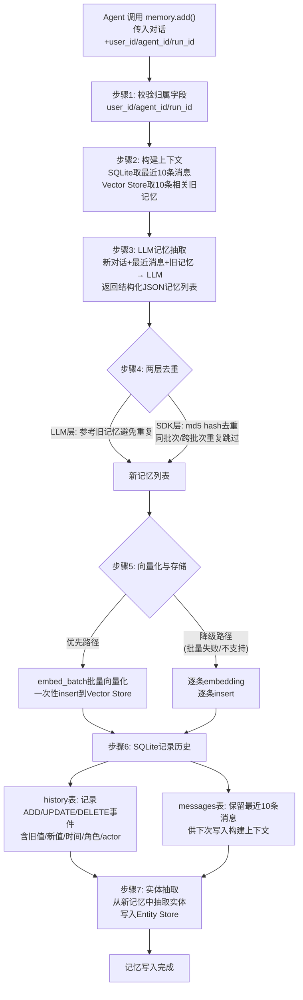
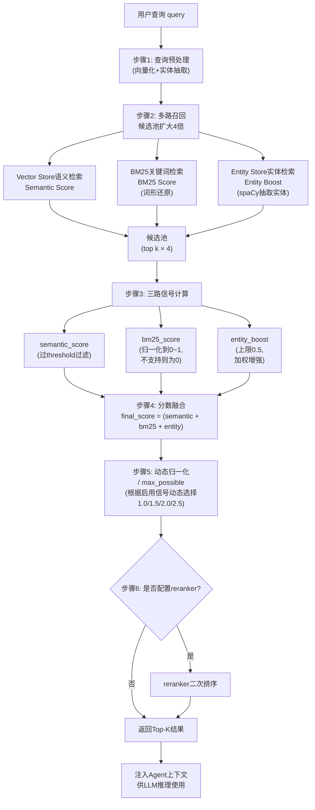

# Mem0 Agent 记忆框架深度技术分析报告

## 摘要

Mem0是一款拥有59.9k Star的开源Agent记忆框架，旨在解决大模型无状态痛点，为Agent提供可检索、可追溯、可演化的长期记忆能力。本报告基于Python SDK v3版本深度拆解其核心设计：六大组件协作架构、ADD-only写入策略（保留事实演化轨迹）、三路检索融合机制（Semantic+BM25+Entity Boost动态归一化）、Entity Store实体索引、以及批量优先失败降级等生产级工程实践。报告系统总结了接入原则、适用场景与潜在局限，为Agent记忆层设计提供可复用的参考蓝图。

---

## 第一部分：文章概览

### 1.1 元信息

| 项目 | 内容 |
|---|---|
| 文章标题 | Agent 记忆层拆解：Mem0 如何把对话变成长期记忆？ |
| 作者/公众号 | 叶小钗 |
| GitHub | https://github.com/mem0ai/mem0 |
| 官网 | https://mem0.ai/ |
| Star 数量 | 59.9k |
| 分析对象 | Mem0 Python SDK（v3 ADD-only 策略） |

### 1.2 核心问题背景

- **大模型无状态痛点**：大模型本身是无状态的，一次请求结束后不会记住用户身份和历史交互。单纯将历史消息放入上下文只能解决短期记忆问题，无法支持Agent长期协作。
- **短期上下文 vs 长期记忆**：短期上下文依赖对话窗口，受token限制且无法跨会话保留；长期记忆需要将历史交互压缩为结构化存储，支持跨会话检索与利用。
- **记忆层本质**：不是简单的聊天记录，而是可检索、可追溯、可演化的长期上下文。一个好用的Agent需要记住用户偏好、历史决策、任务状态，并在未来合适时机检索回来辅助决策。

### 1.3 文章结构

文章按照"问题引入→接入方式→架构解析→写入流程→检索流程→接入指南→总结"的逻辑展开：
1. 引言：阐述大模型无状态痛点与记忆层价值
2. Agent如何接入Mem0：介绍三种接入方式与六大核心组件
3. 写入流程：深度拆解`add()`方法七步完整链路，解析ADD-only策略
4. 检索流程：详解三路信号融合机制与动态归一化算法
5. 如何接入自己的Agent：总结五大接入原则与工程经验
6. 总结：提炼记忆层本质与开发者需要思考的核心问题

---

## 第二部分：架构解析

### 2.1 三种接入方式对比

Mem0官方提供三种接入方式，代码逻辑一致，仅使用方式不同：

| 接入方式 | 适用场景 | 特点 |
|---|---|---|
| 官方云端API | 不想自己部署折腾的用户 | 无需部署，直接使用官方服务 |
| 自建部署服务 | 企业使用场景 | 自主可控，数据本地化 |
| 直接使用SDK | 个人本地Agent | 数据保存在本地，轻量便捷 |

### 2.2 六大核心组件

在开源Python SDK中，核心入口是`mem0/memory/main.py`里的`Memory`和`AsyncMemory`。初始化时创建以下六类组件：

- **llm（必选）**：负责从对话中抽取值得记住的事实。将"新对话+最近消息+相关旧记忆"作为输入，判断是否有需要长期保存的事实（用户偏好、计划、长期目标等），输出结构化记忆JSON。旧记忆仅用于去重和关联，不会从旧记忆重新生成新记忆。

- **embedding_model（必选）**：负责把记忆文本和查询文本向量化。写入时对新记忆文本向量化；检索时对用户查询向量化，用于语义相似度计算。

- **vector_store（必选）**：主记忆库，记忆的主要存储载体。默认使用Qdrant（本地数据默认在`/tmp/qdrant`，主collection叫`mem0`），支持替换为pgvector、Redis、Milvus、Pinecone等。存储内容包括：记忆文本`data`、向量embedding、作用域信息（`user_id`/`agent_id`/`run_id`）、元数据（创建时间、更新时间、hash、角色、过期日期等）、BM25辅助字段（词形还原后的`text_lemmatized`）。

- **SQLiteManager（必选）**：本地SQLite，保存记忆变更历史和最近消息窗口。包含两张关键表：
  - `history`表：记录每条memory的ADD、UPDATE、DELETE事件，保存旧值、新值、时间、角色、actor信息，用于完整追溯记忆变更
  - `messages`表：保存最近消息窗口，每个session scope只保留最新10条，用于下次`add()`时构建上下文

- **entity_store（必选，懒加载）**：懒加载的实体索引库，建立"实体→linked_memory_ids→多条相关记忆"的关联索引。从记忆文本中抽取实体（人名、组织、地点、产品名、引号关键词、复合名词短语等），系统可通过实体查到关联的历史记忆。实体写入有去重逻辑，命中后更新`linked_memory_ids`而非新增实体。

- **reranker（可选）**：负责对召回结果二次排序。适用于客服、医疗、法务、企业知识库等高精度场景，比单纯向量召回更稳。配置后在候选结果融合后做二次排序处理。

### 2.3 组件协作架构

```mermaid
flowchart TD
    Input["用户输入<br/>(对话/查询)"] --> Entry["Memory / AsyncMemory<br/>(核心入口)"]

    subgraph Compute["计算层"]
        LLM["llm<br/>(事实抽取)"]
        Embedding["embedding_model<br/>(向量化)"]
        Reranker["reranker<br/>(二次排序·可选)"]
    end

    subgraph Storage["存储层"]
        SQLite["SQLiteManager<br/>(history+messages)"]
        VectorStore["vector_store<br/>(主记忆库·默认Qdrant)"]
        EntityStore["entity_store<br/>(实体索引)"]
    end

    subgraph Optional["可选增强层"]
        BM25["BM25关键词检索"]
        EntityBoost["实体命中加权"]
    end

    Entry --> WriteOp{"写入/检索?"}

    WriteOp -->| "写入(add)" | W1["从SQLite取最近10条消息"]
    W1 --> W2["从Vector Store取10条相关旧记忆"]
    W2 --> W3["新对话+最近消息+旧记忆 → LLM抽取"]
    W3 --> W4["embedding_model向量化"]
    W4 --> W5["md5去重"]
    W5 --> W6["批量写入Vector Store"]
    W6 --> W7["SQLite记录history"]
    W7 --> W8["抽取实体写入Entity Store"]
    W8 --> OutputWrite["记忆写入完成"]

    WriteOp -->| "检索(search)" | S1["查询向量化+实体抽取"]
    S1 --> S2["三路召回"]
    S2 --> S2a["Vector Store语义检索<br/>(Semantic Score)"]
    S2 --> S2b["BM25关键词匹配<br/>(BM25 Score)"]
    S2 --> S2c["Entity Store实体检索<br/>(Entity Boost)"]
    S2a --> S3["候选池(扩大4倍召回)"]
    S2b --> S3
    S2c --> S3
    S3 --> S4["阈值过滤"]
    S4 --> S5["分数融合<br/>final_score=(semantic+bm25+entity)/max_possible"]
    S5 --> S6{"是否配置reranker?"}
    S6 -->| "是" | S7["reranker二次排序"]
    S6 -->| "否" | S8["返回Top-K结果"]
    S7 --> S8
    S8 --> OutputSearch["检索结果返回"]

    Entry -.-> LLM
    Entry -.-> Embedding
    Entry -.-> Reranker
    LLM -.-> SQLite
    LLM -.-> VectorStore
    Embedding -.-> VectorStore
    Embedding -.-> EntityStore
    VectorStore -.-> BM25
    EntityStore -.-> EntityBoost
```

---

## 第三部分：写入流程深度拆解

### 3.1 add() 方法完整链路

核心源码位于`mem0/memory/main.py`的`add()`方法，负责将聊天内容整理成长期记忆，分为7个步骤：

**步骤1：输入校验——归属字段是必选项**
Agent调用`add()`时，不能只传用户消息和模型回复，还必须提供归属字段（`user_id`/`agent_id`/`run_id`）以区分记忆所属者，否则检索时无法隔离不同用户/任务的记忆。

**步骤2：上下文构建——最近消息 + 相关旧记忆**
Mem0不会直接保存原始对话，而是先构建两层上下文：
- 从SQLite取出该用户/作用域下最近**10条消息**，理解近期对话连续性
- 从Vector Store检索**10条相关旧记忆**，判断新对话是否与已有记忆重复或需要关联

**步骤3：LLM记忆抽取**
将"新对话+最近消息+相关旧记忆"交给LLM，由LLM判断哪些事实值得长期保存。寒暄等无意义聊天不会产出新记忆。LLM只从新对话抽取记忆，旧记忆仅用于去重和关联。

**步骤4：两层去重**
- LLM层：LLM在Prompt中看到旧记忆，主动避免重复抽取相同事实
- SDK层：对新记忆文本计算`md5` hash，若hash已存在于相关旧记忆或同批次内已出现，则跳过写入

**步骤5：向量化与存储（批量优先、失败降级）**
优先调用`embed_batch`批量向量化，再一次性`insert`到Vector Store；若provider不支持批量或调用失败，降级为逐条embedding、逐条insert。

**步骤6：SQLite记录历史**
记忆写入Vector Store后，在SQLite记录两类信息：
- `history`表：记录ADD/UPDATE/DELETE事件，含旧值/新值/时间/角色/actor
- `messages`表：保留最近10条消息，供下次写入构建上下文

**步骤7：实体抽取与Entity Store写入**
从新记忆文本中抽取实体（人名、组织、地点、产品名、引号关键词、复合名词短语等），写入Entity Store建立关联索引。



### 3.2 代码示例

**memory.add() 调用示例**：

```python
memory.add(
    [
        {
            "role": "user",
            "content": "我下个月要去东京，想住精品酒店。我不吃生鱼片，帮我以后推荐餐厅时避开寿司 omakase。"
        },
        {
            "role": "assistant",
            "content": "好的，我之后给你推荐东京餐厅时会避开寿司 omakase，并优先考虑适合精品酒店行程的餐厅。"
        }
    ],
    user_id="u_123",
    metadata={"app": "travel-agent"}
)
```

**LLM Prompt 简化版示例**：

```
你是一个 Memory Extractor。
你的任务不是回答用户，而是从新对话里抽取值得长期保存的事实。

请同时阅读 user 和 assistant 的消息：
- user 消息里可能有偏好、计划、经历、长期目标
- assistant 消息里可能有推荐、方案、安排、已经给出的建议

下面是系统已经知道的相关旧记忆，只能用来去重和关联，
不要从旧记忆里重新生成新记忆：
[
  {"id": "old-1", "text": "用户计划 7 月去日本旅行"},
  {"id": "old-2", "text": "用户喜欢轻松、不赶路的旅行安排"}
]

下面是最近几条对话，用来理解上下文：
user: 上次说的日本行，我想把京都多留两天。
assistant: 可以，那行程可以改成东京 3 天、京都 4 天、大阪 2 天。

输出格式要求是：只返回能被解析的 JSON，不要解释、不要推理过程。结构类似这样：
{
"memory": [
    {
      "id": "0",
      "text": "一条从新对话里抽取出的长期记忆",
      "attributed_to": "user",
      "linked_memory_ids": ["相关旧记忆 id"]
    },
    {
      "id": "1",
      "text": "另一条从新对话里抽取出的长期记忆",
      "attributed_to": "assistant",
      "linked_memory_ids": []
    }
  ]
}
```

**LLM 返回的记忆 JSON 示例**：

```json
{
  "memory": [
    {
      "id": "0",
      "text": "User plans to visit Tokyo next month",
      "attributed_to": "user"
    },
    {
      "id": "1",
      "text": "User prefers boutique hotels",
      "attributed_to": "user"
    },
    {
      "id": "2",
      "text": "User does not eat raw fish and wants future restaurant recommendations to avoid sushi omakase",
      "attributed_to": "user"
    }
  ]
}
```

### 3.3 ADD-only 策略

Mem0 v3采用ADD-only写入策略，新事实默认作为新记忆加入，而非直接覆盖旧记忆。

**与摘要式记忆对比**：

| 维度 | ADD-only（Mem0 v3） | 摘要式记忆 |
|---|---|---|
| 写入方式 | 新事实作为新记忆加入，不覆盖旧记忆 | 持续更新一条摘要，覆盖原始信息 |
| 时间信息 | 保留事实的演化轨迹，可追溯变化时间 | 时间信息被消除，只保留最终状态 |
| 典型场景 | "我是什么时候开始喜欢喝茶的？"可回答 | 只知道"用户喜欢喝茶"，无法回答时间问题 |
| 举例 | 先记录"喜欢喝咖啡"，再记录"后来喜欢喝茶"，两条共存 | 只保留"用户喜欢喝茶"，丢失偏好变更历史 |

**核心优势**：
- **时间推理**：可以回答"什么时候开始/改变的"类问题
- **多跳检索**：多条记忆通过`linked_memory_ids`形成关联链，支持跨记忆推理
- **冲突处理**：新旧记忆矛盾时可同时保留并标注时间，不直接覆盖导致信息丢失

**两层防膨胀机制**：
1. **LLM层**：LLM看到旧记忆后主动避免重复抽取相同事实
2. **SDK层**：对新记忆文本计算md5 hash，同批次和跨批次的重复记忆均被拦截

**update/delete补充方法**：虽然默认采用ADD-only，但Mem0仍提供`update()`和`delete()`方法，支持业务系统显式维护记忆，满足修正或删除错误记忆的场景。

### 3.4 多存储设计

**Vector Store存储字段**：

| 字段 | 说明 |
|---|---|
| `data` | 记忆文本内容 |
| `embedding` | 记忆文本的向量表示 |
| 作用域字段 | `user_id`、`agent_id`、`run_id`，用于多维度隔离 |
| `metadata` | 元数据：创建时间、更新时间、hash、角色、过期日期等 |
| `text_lemmatized` | BM25辅助字段：词形还原后的文本，用于关键词匹配 |

**SQLite双表设计**：
- `history`表：记录每条memory的ADD、UPDATE、DELETE事件，保存旧值、新值、时间、角色、actor信息，实现事件可追溯
- `messages`表：保存最近消息窗口，每个session scope只保留最新**10条**消息，用于下次`add()`时构建轻量上下文

**"批量优先、失败降级"生产级策略价值分析**：

| 策略 | 实现方式 | 生产价值 |
|---|---|---|
| 批量优先 | `embed_batch`批量向量化 + 一次性`insert`；历史记录`batch_add_history` | 最大化吞吐，减少API调用次数，降低延迟和成本 |
| 失败降级 | provider不支持批量或调用失败时，自动降级为逐条embedding + 逐条insert | 保证系统韧性，API失败不崩溃，不因个别provider限制导致整体写入失败 |

这一设计细节表明Mem0不是demo级封装，而是充分考虑了生产环境中的吞吐需求和失败容错。

---

## 第四部分：检索机制深度解析

### 4.1 search() 检索流程

Agent在生成回答前调用`memory.search(...)`，检索相关长期记忆注入模型上下文。Mem0将用户查询转换为多路查询，融合排序后返回结果，完整流程分为6步：

**步骤1：查询预处理**：对用户输入进行向量化和实体抽取，为多路召回做准备。

**步骤2：候选池构建——top k扩大4倍**：内部检索时不直接取用户指定的top k，而是将召回数量**扩大4倍**先形成候选池。原因：多路召回阶段多召回一些候选，后续通过融合打分精细排序，避免过早丢弃语义相关但向量相似度不高的记忆。

**步骤3：三路信号计算**：对候选池中每条记忆分别计算Semantic Score、BM25 Score、Entity Boost。

**步骤4：分数融合**：将三路信号按融合公式计算最终分数。

**步骤5：动态归一化**：根据本次实际启用的信号数量，使用动态`max_possible`分母将分数归一化到0~1区间。

**步骤6：可选reranker二次排序**：如果配置了reranker，在融合排序后做二次排序进一步提升精度。



### 4.2 三路信号详解

**Semantic Score（语义分数）**：
- 来源：主记忆Vector Store的embedding语义相似度
- 含义：衡量这条memory与query在语义上有多相似
- 过滤机制：语义分数先经过`threshold`阈值过滤，低于阈值的候选直接丢弃
- 适用场景：语义理解类问题，如"用户喜欢什么样的旅行方式"

**BM25 Score（关键词分数）**：
- 来源：底层向量数据库的关键词检索（BM25算法）
- 处理：底层数据库给出BM25原始分数后，压缩到0~1区间；查询时做词形还原（lemmatization），让关键词匹配更稳健
- 降级处理：如果底层向量库不支持`keyword_search`，此项为0，不影响其他信号
- 适用场景：精确词、日期、术语匹配，如"7月"、"东京"、"sushi omakase"

**Entity Boost（实体加权）**：
- 来源：Entity Store实体索引
- 流程：从query中抽取实体（使用spaCy NLP模型+规则，不调用LLM），向量化后去Entity Store查找相似实体，若实体关联某条memory则加分
- 权重控制：加分最高受`ENTITY_BOOST_WEIGHT`控制，默认值为**0.5**
- 设计意图：实体boost是**加权增强**，不是直接压过语义检索。0.5上限意味着实体命中最多贡献0.5分（满分归一化后约占20%），确保语义相关性始终是主导因素
- 适用场景：围绕人、项目、地点、产品的查询，如"Project Atlas相关的记忆"

### 4.3 分数融合与动态归一化

**融合公式**：

```
final_score = (semantic_score + bm25_score + entity_boost) / max_possible
```

**计算示例**：
假设一条memory的语义分数为`0.72`，BM25归一化后为`0.60`，实体增强为`0.30`，三路信号全部启用：

```
final_score = (0.72 + 0.60 + 0.30) / 2.5 = 1.62 / 2.5 = 0.648
```

**max_possible对照表**：

| 启用的信号 | max_possible |
|---|---|
| 只有语义检索 | 1.0 |
| 语义 + BM25 | 2.0 |
| 语义 + Entity Boost | 1.5 |
| 语义 + BM25 + Entity Boost | 2.5 |

**为什么需要动态归一化？**
如果不做归一化，启用多路信号时分数会因为项数增加而虚高。例如：只有语义时一条记忆得0.8分，三路全用时另一条记忆得0.7+0.6+0.3=1.6分。不归一化的话1.6>0.8，但高分纯粹是因为加了更多项，并不代表更相关。通过动态max_possible分母，不同信号组合下的分数具有可比性：
- 只有语义时：0.8 / 1.0 = 0.8
- 三路全用时：1.6 / 2.5 = 0.64

这样不会因为启用更多检索方式导致分数膨胀。

**为什么需要4倍候选池扩容？**
多路召回阶段如果初始召回量太小（只取top k），可能在分数融合前就丢掉了语义上相关但向量相似度不高、但被BM25或实体信号命中的记忆。扩大4倍形成候选池，多召回一些候选，后续通过融合打分精细排序，避免过早丢弃相关记忆，提升整体召回率。

### 4.4 三种信号互补性

| 信号类型 | 优势场景 | 短板 | 互补关系 |
|---|---|---|---|
| Semantic Score | 语义理解、同义表达、意图匹配 | 精确词/数字/专有名词可能匹配不准 | 基础信号，承担主要召回职责 |
| BM25 Score | 精确词、日期、术语、产品名精确匹配 | 无法理解同义表达和语义相近 | 补充语义检索在精确匹配上的不足 |
| Entity Boost | 围绕人/项目/地点/产品的关联记忆召回 | 不直接评估记忆内容相关性 | 通过实体关联增强相关记忆排名，作为辅助信号 |

**互补逻辑示例**：当用户查询"我上个月在东京说过什么饮食禁忌"时，BM25精确命中"东京"等关键词，Semantic Score捕捉"饮食禁忌"的语义（对应"不吃生鱼片"），Entity Boost如果"东京"被识别为实体则进一步加权——三者协同提升召回质量。

- BM25解决"精确词/日期/术语"的硬匹配问题
- 语义解决"意思相近但用词不同"的软匹配问题
- 实体解决"围绕某个实体的所有记忆"的关联召回问题

---

## 第五部分：实体索引机制

### 5.1 设计理念：实体→记忆关联，不是知识图谱

Entity Store是独立于Vector Store和SQLite的第三个存储组件，核心建立"实体→linked_memory_ids→多条相关记忆"的关联，形成"实体到事件"的索引。

**与知识图谱的本质区别**：

| 维度 | Entity Store（Mem0） | 知识图谱 |
|---|---|---|
| 关系类型 | 只建立"实体→记忆ID"的关联 | 建立"实体→实体"之间的语义关系（如A是B的子公司、C位于D） |
| 复杂度 | 低，只维护实体到记忆的映射 | 高，需要维护实体间的多元关系和属性 |
| 准确性要求 | 只要求实体识别和记忆关联准确 | 需要关系抽取准确，错误传播风险高 |
| 维护成本 | 低，新记忆到来时只需更新实体的linked_memory_ids | 高，需要持续维护实体关系的一致性和完整性 |
| 检索能力 | 围绕实体检索关联记忆 | 支持多跳推理、关系路径查询 |

**为什么不做实体间关系（设计取舍）**：
1. **复杂度控制**：实体间关系抽取需要复杂NLP或LLM调用，增加系统复杂度和成本
2. **准确性风险**：关系抽取错误率高，错误的实体会直接影响检索质量
3. **维护成本**：知识图谱需要持续维护关系一致性，新记忆到来时需推理和更新实体间关系，成本极高
4. **场景匹配**：Agent记忆层核心需求是"给定查询找到相关记忆"，而非"推理实体间关系网络"，实体→记忆索引已能满足围绕实体检索记忆的需求

### 5.2 实体抽取与去重

**抽取方式：spaCy NLP + 规则（不用LLM）**：
实体抽取使用**spaCy NLP模型+规则**，**不调用LLM**。原因：
1. **降低成本**：每次add和search都要抽取实体，调LLM成本随交互频次线性增长
2. **提高速度**：spaCy是本地轻量模型，推理速度远快于LLM API调用
3. **任务适配**：命名实体识别（NER）是NLP成熟任务，专用模型在常见实体类型上表现足够好

**抽取范围**：
- 人名（PERSON）
- 组织（ORG）
- 地点（GPE/LOC）
- 产品名
- 被引号包裹的关键词
- 复合名词短语

**两层去重**：
1. **规范化精确匹配**：对实体文本规范化处理（去多余空格、转小写）后精确匹配，命中则更新已有实体
2. **向量相似度阈值**：精确匹配未命中时，对实体文本向量化做相似搜索，分数达阈值则认为是同一实体

命中后**不新增实体记录**，而是更新该实体payload中的`linked_memory_ids`，将新记忆ID追加到关联列表。这样一个实体可逐渐连接越来越多的记忆，形成不断丰富的"实体→记忆"索引。

### 5.3 实体数据结构

```json
{
  "id": "entity-vector-id-001",
  "vector": "embedding(Project Atlas)",
  "payload": {
    "data": "Project Atlas",
    "entity_type": "PROPER",
    "linked_memory_ids": [
      "memory-id-001",
      "memory-id-002"
    ],
    "user_id": "user-123"
  }
}
```

| 字段 | 说明 |
|---|---|
| `id` | 实体记录唯一ID，向量库主键标识 |
| `vector` | 实体文本的向量表示（embedding），真实存储为多维浮点数组 |
| `payload.data` | 实体文本内容，如"Project Atlas"、"东京" |
| `payload.entity_type` | 实体类型，如PROPER（专有名词）、PERSON、ORG、GPE等 |
| `payload.linked_memory_ids` | **最关键字段**，记录该实体关联的长期记忆ID列表 |
| `payload.user_id` | 作用域字段，还包括`agent_id`、`run_id`等，保证实体检索不跨用户/任务串扰 |

### 5.4 实体检索流程与Entity Boost

**实体检索流程**：
```
query → spaCy抽取实体 → 实体文本向量化 → Entity Store相似搜索 → 找到相似实体 → 读取linked_memory_ids → 根据memory_ids召回关联记忆 → 给予entity_boost加分
```

详细步骤：
1. 对用户查询使用spaCy NLP模型+规则抽取实体
2. 将实体文本通过embedding_model向量化
3. 用实体向量在Entity Store中查找相似实体
4. 从命中实体的payload.linked_memory_ids取出关联记忆ID列表
5. 根据linked_memory_ids从Vector Store召回原始记忆，施加entity_boost加分（上限0.5）

**Entity Boost权重0.5的意义**：
1. **定位为辅助信号**：Entity Boost是加权增强，不是主要排序依据。0.5上限意味着三路全启用时（max_possible=2.5），实体加分最多占总分20%，语义分数仍占主导
2. **避免实体命中压制语义相关性**：防止"实体匹配但语义不相关"的记忆排到前面（如查询"东京寿司店"时，实体"东京"关联的酒店/交通记忆不应盖过寿司相关记忆）
3. **适配实体抽取误差**：spaCy NER并非100%准确，较低权重上限降低实体抽取错误对最终排序的负面影响
4. **适配实体关联宽召回特性**：一个实体可能关联数十条记忆，并非全部语义相关，限制boost上限让语义和BM25做精细排序

---

## 第六部分：工程实践与接入指南

### 6.1 接入时序

将Mem0接入Agent的正确时序为三个阶段：

```
用户消息 → 1. memory.search() 检索记忆，注入 system/context
         → 2. Agent 基于上下文推理并回复用户
         → 3. 异步 memory.add() 抽取本轮对话的长期记忆
```

**时序关键原则**：
- **检索必须在推理之前**：不先检索就回复相当于模型"失忆"状态下回答，无法利用历史偏好和决策
- **写入必须在回复之后**：先响应用户，再异步执行记忆抽取。LLM抽取记忆是耗时操作，同步等待会严重阻塞用户响应速度
- **写入建议异步化**：将add()放入后台任务/消息队列执行，不阻塞主请求链路

### 6.2 五大接入原则

**1. 作用域设计清晰**

| 作用域字段 | 适用对象 | 设计理由 |
|---|---|---|
| `user_id` | 用户个人偏好、历史决策、长期目标 | 区分不同用户的记忆，保证A用户偏好不泄露给B用户 |
| `run_id` | 单次任务/会话的上下文 | 同一用户不同任务之间相互隔离，避免任务间记忆串扰 |
| `agent_id` | Agent自身行为记录或能力沉淀 | Agent可积累跨用户的通用知识和操作经验 |

设计理由：三层作用域实现用户维度、任务维度、Agent维度的记忆隔离，检索时通过作用域字段精确过滤。

**2. 检索在推理前**
先调用`search()`，再将Top-K相关记忆作为上下文注入业务LLM的system message或context中。

设计理由：大模型本身无状态，不先检索注入记忆，模型无法知道用户偏好、历史决策和任务状态，相当于每次对话都是"第一次见面"。

**3. 写入在回复后（异步不阻塞）**
先完成用户响应，再异步调用`add()`抽取和保存记忆。

设计理由：
- 性能考虑：`add()`涉及LLM调用、向量化、多存储写入等多个步骤，同步执行显著增加等待时间
- 用户体验：用户最关心得到回复，记忆保存是后台行为，不应阻塞主交互
- 容错考虑：即使add()失败（如LLM API临时不可用），用户已收到回复，不影响核心交互

**4. metadata业务隔离**
在add()时通过metadata传入业务维度标识，如`project_id`、`workspace_id`、`category`等。

设计理由：user_id/agent_id/run_id是Mem0内置作用域，但实际业务往往需要更多维度过滤能力（如同一用户在不同项目下的记忆隔离），metadata提供灵活的业务层过滤手段。

**5. 高精度场景启用reranker**
在客服、医疗、法务、企业知识库等对召回精度要求极高的场景，配置并启用reranker对候选结果二次排序。

设计理由：多路召回虽然提升召回率，但融合排序结果不一定完全符合人工判断的相关性标准。Reranker（通常用交叉编码器Cross-Encoder）对query-memory对做更精细的相关性打分，比单纯向量相似度+分数融合更准确，适合错误容忍度低的场景。

### 6.3 生产级工程经验汇总表

| 经验点 | 设计价值 |
|---|---|
| 批量优先、失败降级 | 生产吞吐保障：优先`embed_batch`批量向量化+一次性insert，最大化吞吐；provider不支持或调用失败时自动降级逐条处理，API失败不崩溃，兼顾性能与韧性 |
| 候选池4倍扩容 | 多召回后排序：内部将top k扩大4倍形成候选池，避免多路召回阶段过早丢弃语义相关但初始分数不高的记忆，为后续融合打分保留更多候选 |
| 动态归一化max_possible | 多信号分数不虚高：根据实际启用信号数量（1.0/1.5/2.0/2.5）动态选择归一化分母，确保不同信号组合下分数可比，不会因为开更多检索方式导致分数膨胀 |
| ADD-only保留演化轨迹 | 支持时间推理、多跳检索：新事实作为新记忆加入而非覆盖旧记忆，保留事实变更历史，可回答"什么时候改变的"类问题；同时支持冲突记忆并存 |
| 多层去重（LLM+md5） | 防止记忆膨胀：LLM层在Prompt中参考旧记忆主动避免重复抽取；SDK层对记忆文本计算md5 hash，跨批次精确去重，两层配合控制ADD-only策略下的记忆数量 |
| SQLite双表分离 | 事件追溯与上下文窗口各司其职：`history`表记录ADD/UPDATE/DELETE完整事件链（含旧值/新值/时间/角色/actor），支持记忆审计与回溯；`messages`表只保留每个scope最近10条消息，供下次add构建轻量上下文 |
| 实体抽取用轻量模型（spaCy） | 成本/速度考虑：不每次调LLM做实体抽取，而是使用本地spaCy NLP模型+规则，大幅降低每次add/search的成本和延迟，适合高频交互场景 |
| BM25+语义+实体三路互补 | 关键词精确+语义理解+实体关联：BM25解决精确词/日期/术语硬匹配，语义解决同义表达软匹配，实体解决围绕实体的关联召回，三者覆盖不同类型信息需求 |
| 异步写入 | 不阻塞用户响应：add()包含LLM调用、向量化、多存储写入等耗时操作，异步执行确保用户先收到回复，记忆保存作为后台任务不影响交互体验 |

### 6.4 重要提醒：并非所有Agent都适用

文章明确指出，不是所有Agent都适合Mem0这种全量长期记忆架构。

**不适用场景：写作Agent长文本场景**
- 问题：写作Agent可能输出长草稿甚至完整正文，内容量极大。如果全量调用`memory.add()`抽取记忆和实体，会抽取出大量零散、非长期价值的信息，导致记忆库膨胀、信噪比极低。
- 本质原因：长文本创作的输出大多是过程性草稿、措辞选择、段落组织，这些不属于"值得长期记住的用户偏好/计划/事实"，不应进入长期记忆。
- 代码生成、数据分析等输出大量结构化内容的Agent也可能存在类似问题——Agent的输出不等于需要长期记住的事实。

**替代建议**：
1. **筛选写入**：在调用`memory.add()`前，先由业务逻辑或Agent自身判断哪些内容值得写入长期记忆，只将关键决策、用户偏好、最终结论等传入add()，丢弃草稿和过程性内容。
2. **封装为工具让Agent按需调用**：将`memory.add()`封装为Agent可调用的工具（function/tool），让Agent自主判断什么时候需要记住什么信息，而不是每轮对话自动写入。Agent认为有必要时主动调用工具保存记忆，既保留记忆能力，又避免无差别全量写入带来的膨胀问题。

---

## 第七部分：评估与思考

### 7.1 方案优势（5点）

**1. 生产级设计，非demo级封装**
Mem0在多个细节上体现面向生产环境的工程考量：批量优先失败降级保证吞吐与韧性、多层去重防护记忆膨胀、多路召回提升召回质量、4倍候选池扩容避免过早丢弃、动态归一化防止分数虚高。这些设计表明Mem0经过实际生产场景打磨。

**2. 多存储分工明确，架构清晰**
三种存储各司其职，职责边界清晰：Vector Store作为主记忆库负责持久化存储和语义检索；SQLite双表分离（history追溯事件+messages维护10条消息窗口）；Entity Store做实体→记忆关联索引。三者无功能重叠，架构简洁职责分明。

**3. 灵活可替换，组件解耦**
核心组件均支持配置替换：向量库默认Qdrant但支持pgvector/Redis/Milvus/Pinecone等、Embedding模型可配置、LLM可配置、接入方式三选一（云端/自建/SDK）、reranker可选。松耦合设计让Mem0可嵌入不同技术栈，不造成厂商锁定。

**4. ADD-only保留记忆演化轨迹**
相比摘要式记忆的覆盖式写入，ADD-only策略保留事实演化时间线，支持时间推理、多跳检索、冲突记忆并存；辅以LLM语义去重+md5 hash精确去重的两层防膨胀机制，在保留轨迹和控制膨胀之间取得平衡。

**5. 开源生态活跃**
GitHub上拥有**59.9k Star**，社区认可度高、生态活跃，遇到问题更容易找到解决方案和社区支持，持续更新迭代有保障。

### 7.2 潜在局限（7点）

**1. LLM抽取成本：高频场景成本压力**
每次`add()`都需调用LLM进行记忆抽取，每轮对话产生LLM API费用。日均百万级对话的高频场景下，LLM调用成本线性累积，可能成为显著运营开支。

**2. 记忆膨胀风险：ADD-only的长期隐患**
虽然有两层去重，但LLM去重依赖模型判断可能遗漏语义相近但表述不同的重复；md5 hash只能去重完全相同文本；长期运行后可能积累大量过时、低价值、语义重叠记忆，影响检索效率和精度；过期日期字段存在但过期/遗忘/清理机制未明确说明。

**3. 中文实体抽取效果存疑**
实体抽取使用spaCy NLP模型+规则，spaCy默认模型对英文效果好，但中文NER需加载中文语言模型（zh_core_web_sm/md/trf），中文分词、命名实体识别准确率可能不如英文，直接影响Entity Boost效果，需实测验证。

**4. 记忆遗忘机制不完善**
metadata包含"过期日期"字段但未展开说明：过期记忆是否自动清理？是否有基于访问频率/时间衰减的遗忘机制？如何处理已过时的用户偏好（搬家、换工作、改变喜好）？仅有过期日期而无完善的遗忘/衰减/清理策略，长期运行后过时记忆可能干扰检索。

**5. 抽取质量依赖LLM能力**
记忆抽取完全依赖LLM理解能力：小参数开源模型可能抽取不准、遗漏重要事实、误抽取无意义内容；Prompt设计影响大；不同LLM对同一对话可能抽取不同记忆，质量一致性难以保证。

**6. 大规模多租户性能未说明**
多租户隔离主要通过user_id/agent_id/run_id在查询时过滤而非物理隔离，百万级用户、千万级记忆规模下查询性能、向量库分片索引策略、SQLite服务化部署并发写入瓶颈等问题未详细说明。

**7. 写作/创意类Agent适用性有限**
长文本输出场景（写作、代码生成、数据分析）全量add()会导致记忆库充斥大量草稿、过程性等非长期价值信息，需业务方自行筛选或封装为工具按需调用，增加接入复杂度。

### 7.3 Mem0 vs 自建决策建议

**适合直接使用Mem0的场景**：
1. **快速原型验证**：需快速为Agent添加记忆能力，不想从零搭建向量库+LLM抽取+检索融合完整链路
2. **对话型Agent**：客服、个人助理、推荐助手等以对话交互为主、每轮输出较精炼的Agent，记忆抽取价值高噪声低
3. **中小规模部署**：用户量和交互量在Mem0承载范围内，不需要极致性能优化
4. **偏好/计划类记忆为主**：业务场景主要记住用户偏好、计划安排、历史决策，适合ADD-only+事实抽取方式
5. **团队资源有限**：没有足够人力投入自建记忆层的工程开发和持续优化

**适合自建记忆方案的场景**：
1. **大规模多租户SaaS**：百万级用户、千万级记忆规模，需深度定制分片策略、索引优化、租户隔离方案
2. **特殊领域需求**：医疗、金融、法律等对记忆准确性、可解释性、审计追溯有极高要求，需定制抽取逻辑和验证机制
3. **长文本/创作类Agent**：输出内容结构复杂，通用LLM事实抽取无法满足需求，需领域特定记忆筛选和结构化逻辑
4. **已有成熟基础设施**：团队已有完善向量数据库、LLM网关、特征平台等，自建记忆层边际成本低
5. **深度定制需求**：需要知识图谱级实体关系推理、复杂记忆衰减/遗忘/合并策略、跨用户记忆聚合等Mem0未提供的高级能力
6. **成本敏感且高频**：超高频场景下LLM抽取成本不可接受，需更经济方案（规则抽取、小模型专用抽取等）

### 7.4 对自有Agent开发的启示

即使不直接使用Mem0，其设计理念中有以下几点值得自建记忆层时借鉴：

**1. 三层信号融合检索，不要只靠向量相似度**
仅用embedding语义相似度是最常见的"朴素记忆"实现，但召回质量有限。应借鉴三路互补思路：语义检索（embedding）处理同义表达和意图理解、关键词检索（BM25）处理精确词/数字/日期/术语硬匹配、实体关联处理围绕人名/项目/地点/产品的关联召回；三路信号通过动态归一化融合，采用"多召回→精排序"策略（候选池扩大）避免过早丢弃。

**2. ADD-only + 多层去重，保留演化轨迹而非覆盖**
不要简单用摘要式记忆覆盖旧信息。摘要虽简洁但丢失时间维度和演化过程。采用ADD-only策略同时配合多层去重机制（语义去重+hash去重），在保留轨迹和控制膨胀间取得平衡；提供update/delete能力处理显式修正场景；SQLite双表分离（history追溯事件+messages维护窗口）是简洁有效的模式。

**3. 批量优先+降级容错，面向生产而非demo**
自建记忆层最容易忽略生产级容错：批量操作优先（embedding、insert、history都优先批量路径减少API调用）、自动降级（批量失败时自动降级逐条处理）、异步写入（记忆抽取写入放用户响应后异步执行不阻塞主链路）、高频操作用轻量组件（实体抽取用spaCy等本地模型而非每次调LLM，平衡成本与效果）。

---

## 第八部分：核心要点总结

### 一句话记忆层本质

**把发生过的事儿存下来，保证将来能再翻出来用。**

### 三个关键设计决策

1. **ADD-only而非摘要覆盖**：保留事实演化轨迹，支持时间推理、多跳检索、冲突处理，辅以LLM+md5两层去重控制膨胀
2. **三路检索融合而非纯向量**：Semantic（语义理解）+ BM25（精确匹配）+ Entity Boost（实体关联）三路互补，动态归一化防止分数虚高，4倍候选池扩容避免过早丢弃
3. **多存储分工而非单一向量库**：向量库（主存储）+ SQLite（history事件追溯 + messages最近10条窗口）+ Entity Store（实体索引），三者各司其职职责清晰

### 开发者需要想清楚的三个核心问题

1. **什么内容值得写入记忆？**：不是所有对话内容都值得长期保存，寒暄、草稿、过程性内容应过滤，只保留用户偏好、计划、决策、关键事实等有长期价值的信息
2. **怎么隔离不同用户的记忆？**：通过user_id/agent_id/run_id三层作用域+metadata业务维度做精确隔离，防止记忆串扰和信息泄露
3. **什么时候需要去查询记忆？**：检索必须在Agent推理前执行，将相关记忆注入上下文；写入在回复后异步执行，不阻塞用户响应

### 开放问题

- Mem0 v3相比v2有哪些具体架构变化？（文中只提了v3的ADD-only策略）
- 默认使用的Qdrant向量库在生产环境性能表现如何？支持多大规模记忆？
- LLM记忆抽取的Prompt完整版本有哪些质量控制细节？
- Entity Boost使用的spaCy模型支持中文效果如何？是否有中文优化？
- 记忆的过期/遗忘机制是如何设计的？（文中提到过期日期字段但未展开）
- 多用户/多租户场景下的记忆隔离性能如何保证？
