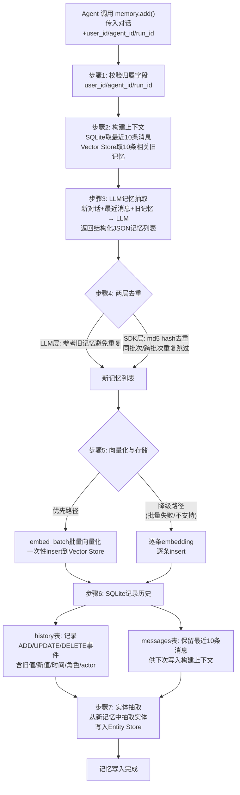

# 记忆写入流程全链路拆解

## 一、`add()` 方法七步完整流程

核心源码位于 `mem0/memory/main.py` 的 `add()` 方法，负责将一段聊天内容整理成长期记忆。以下是完整的七步流程拆解。

### 步骤 1：输入要求——归属字段是必选项

Agent 调用 `add()` 时，不能只传递用户消息和模型回复，还必须提供归属字段以区分记忆的所属者，否则检索时无法隔离不同用户/任务的记忆。

必需的归属字段包括：

- `user_id`：用户个人维度的偏好与历史
- `agent_id`：Agent 自身行为或能力沉淀
- `run_id`：单次任务/会话维度的上下文

调用示例：

```python
memory.add(
    [
        {
            "role": "user",
            "content": "我下个月要去东京，想住精品酒店。我不吃生鱼片，帮我以后推荐餐厅时避开寿司 omakase。"
        },
        {
            "role": "assistant",
            "content": "好的，我之后给你推荐东京餐厅时会避开寿司 omakase，并优先考虑适合精品酒店行程的餐厅。"
        }
    ],
    user_id="u_123",
    metadata={"app": "travel-agent"}
)
```

### 步骤 2：上下文构建——最近消息 + 相关旧记忆

Mem0 收到消息后，不会直接保存原始对话，而是先构建两层上下文：

1. **SQLite 最近消息**：从 SQLite 数据库中取出该用户/作用域下的最近 **10 条消息**，用于理解近期对话的连续性。
2. **Vector Store 相关旧记忆**：从向量库中检索 **10 条相关旧记忆**，用于判断新对话是否与已有记忆重复、是否需要关联。

通过这两层上下文，系统同时掌握了"最近聊了什么"和"以前是否聊过相关话题"。

### 步骤 3：LLM 记忆抽取——Prompt 核心逻辑与输入输出

Mem0 将"新对话 + 最近消息 + 相关旧记忆"组合后交给 LLM，让 LLM 判断这段对话中是否有值得长期保存的事实（如用户偏好、计划、长期目标等）。寒暄等无意义聊天不会产出新记忆。

**Prompt 简化版示例**（真实 prompt 更长，包含更多质量要求和边界条件，但核心逻辑一致）：

```
你是一个 Memory Extractor。
你的任务不是回答用户，而是从新对话里抽取值得长期保存的事实。

请同时阅读 user 和 assistant 的消息：
- user 消息里可能有偏好、计划、经历、长期目标
- assistant 消息里可能有推荐、方案、安排、已经给出的建议

下面是系统已经知道的相关旧记忆，只能用来去重和关联，
不要从旧记忆里重新生成新记忆：
[
  {"id": "old-1", "text": "用户计划 7 月去日本旅行"},
  {"id": "old-2", "text": "用户喜欢轻松、不赶路的旅行安排"}
]

下面是最近几条对话，用来理解上下文：
user: 上次说的日本行，我想把京都多留两天。
assistant: 可以，那行程可以改成东京 3 天、京都 4 天、大阪 2 天。

输出格式要求是：只返回能被解析的 JSON，不要解释、不要推理过程。结构类似这样：
{
"memory": [
    {
      "id": "0",
      "text": "一条从新对话里抽取出的长期记忆",
      "attributed_to": "user",
      "linked_memory_ids": ["相关旧记忆 id"]
    },
    {
      "id": "1",
      "text": "另一条从新对话里抽取出的长期记忆",
      "attributed_to": "assistant",
      "linked_memory_ids": []
    }
  ]
}
```

**LLM 返回的 JSON 示例**（3 条记忆）：

```json
{
  "memory": [
    {
      "id": "0",
      "text": "User plans to visit Tokyo next month",
      "attributed_to": "user"
    },
    {
      "id": "1",
      "text": "User prefers boutique hotels",
      "attributed_to": "user"
    },
    {
      "id": "2",
      "text": "User does not eat raw fish and wants future restaurant recommendations to avoid sushi omakase",
      "attributed_to": "user"
    }
  ]
}
```

关键约束：旧记忆仅用于去重和关联，LLM 不会从旧记忆中重新生成新记忆。

### 步骤 4：去重机制——两层防护防止重复记忆

去重分两层执行：

1. **LLM 层去重**：LLM 在 Prompt 中已看到相关旧记忆，会尽量不重复抽取已存在的事实。
2. **SDK 层去重**：SDK 对新记忆文本计算 `md5` hash，如果 hash 已存在于相关旧记忆中，或同一批次内已出现相同 hash，则跳过写入。

两层去重共同防止同一条记忆被重复保存。

### 步骤 5：向量化与存储——批量优先、失败降级

通过去重后的新记忆进入向量化和存储阶段：

1. **批量优先策略**：优先调用 `embed_batch` 对所有新记忆文本批量生成向量，再一次性 `insert` 到 Vector Store。
2. **失败降级策略**：如果向量库 provider 不支持批量操作，或批量调用失败，则降级为逐条 embedding、逐条 insert。

写入目标是 Mem0 的 Vector Store 抽象层（默认 Qdrant，主记忆 collection 为 `mem0`），不绑定特定数据库。

### 步骤 6：历史记录——SQLite 双表各司其职

记忆写入 Vector Store 后，Mem0 在 SQLite 中记录两类信息：

- **`history` 表**：记录每条 memory 的 ADD、UPDATE、DELETE 事件，保存旧值、新值、时间、角色、actor 信息，用于完整追踪记忆的变更历史。
- **`messages` 表**：保存最近消息窗口，每个 session scope 只保留最新 **10 条**消息，用于下次 `add()` 时构建上下文。

两表分离的设计使得事件追溯与上下文窗口管理互不干扰。

### 步骤 7：实体抽取与 Entity Store 写入

最后一步，Mem0 从新记忆文本中抽取实体（人名、组织、地点、产品名、被引号包裹的关键词、复合名词短语等），写入独立的 Entity Store，建立"实体 → linked_memory_ids → 多条相关记忆"的关联索引。

## 二、ADD-only 策略深度分析

### 2.1 与摘要式记忆的本质区别

| 维度 | ADD-only（Mem0 v3） | 摘要式记忆 |
|---|---|---|
| 写入方式 | 新事实作为新记忆加入，不覆盖旧记忆 | 持续更新一条摘要，覆盖原始信息 |
| 时间信息 | 保留事实的演化轨迹，可追溯变化时间 | 时间信息被消除，只保留最终状态 |
| 典型场景 | "我是什么时候开始喜欢喝茶的？"可回答 | 只知道"用户喜欢喝茶"，无法回答时间问题 |
| 举例 | 先记录"喜欢喝咖啡"，再记录"后来喜欢喝茶"，两条共存 | 只保留"用户喜欢喝茶"，丢失偏好变更历史 |

### 2.2 ADD-only 的核心优势

- **时间推理**：可以回答"什么时候开始/改变的"类问题，因为事实按时间线独立存在。
- **多跳检索**：多条记忆之间可以通过 `linked_memory_ids` 形成关联链，支持跨记忆推理。
- **冲突处理**：当新旧记忆矛盾时，可以同时保留并标注时间，而不是直接覆盖导致信息丢失。

### 2.3 两层防膨胀机制

ADD-only 天然面临记忆膨胀风险，Mem0 通过两层机制控制：

1. **LLM 层**：LLM 看到旧记忆后主动避免重复抽取相同事实。
2. **SDK 层**：md5 hash 精确去重，同批次和跨批次的重复记忆均被拦截。

### 2.4 update/delete 作为补充

虽然默认采用 ADD-only，但 Mem0 仍提供 `update()` 和 `delete()` 方法，支持业务系统进行显式的记忆维护，满足需要修正或删除错误记忆的场景。

## 三、Vector Store 存储结构字段

每条记忆在 Vector Store 中包含以下字段：

| 字段 | 说明 |
|---|---|
| `data` | 记忆文本内容 |
| `embedding` | 记忆文本的向量表示 |
| 作用域字段 | `user_id`、`agent_id`、`run_id`，用于多维度隔离 |
| `metadata` | 元数据：创建时间、更新时间、hash、角色、过期日期等 |
| `text_lemmatized` | BM25 辅助字段：词形还原后的文本，用于关键词匹配 |

## 四、"批量优先、失败降级"生产级策略价值分析

| 策略 | 实现方式 | 生产价值 |
|---|---|---|
| 批量优先 | `embed_batch` 批量向量化 + 一次性 `insert`；历史记录 `batch_add_history` | 最大化吞吐，减少 API 调用次数，降低延迟和成本 |
| 失败降级 | provider 不支持批量或调用失败时，自动降级为逐条 embedding + 逐条 insert | 保证系统韧性，API 失败不崩溃，不因个别 provider 限制导致整体写入失败 |

这一设计细节表明 Mem0 不是 demo 级封装，而是充分考虑了生产环境中的吞吐需求和失败容错。

## 五、写入流程 Mermaid 图


