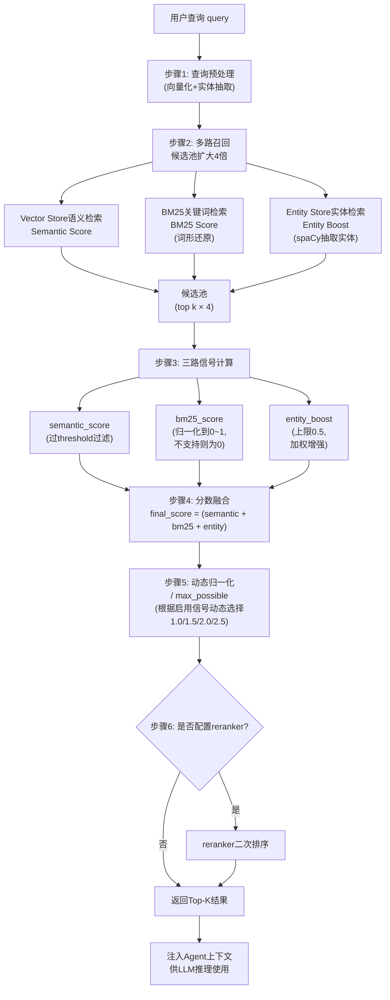

# 三路检索融合机制深度解析

## 一、检索流程六步骤

Agent 在生成回答前调用 `memory.search(...)`，检索相关长期记忆内容注入模型上下文。Mem0 将用户查询转换为多路查询，融合排序后返回结果。完整检索流程分为六步：

### 步骤 1：查询扩展

对用户输入的查询进行预处理和扩展，为后续多路召回做准备。

### 步骤 2：候选池构建——top k 扩大 4 倍

内部检索时，不直接取用户指定的 top k，而是将召回数量**扩大 4 倍**先形成候选池。**原因**：多路召回阶段多召回一些候选，后续通过融合打分精细排序，避免过早丢弃相关记忆。如果初始召回量太小，可能在分数融合前就丢掉了语义上相关但向量相似度不高的记忆。

### 步骤 3：三路信号计算

对候选池中每条记忆，分别计算三路信号分数：Semantic Score、BM25 Score、Entity Boost。

### 步骤 4：分数融合

将三路信号按融合公式计算最终分数。

### 步骤 5：动态归一化

根据本次实际启用的信号数量，使用动态 `max_possible` 分母将分数归一化到 0~1 区间。

### 步骤 6：可选 reranker 二次排序

如果配置了 reranker，在融合排序后的候选结果上进行二次排序，进一步提升精度。

## 二、三路信号详解

### 2.1 Semantic Score（语义分数）

- **来源**：主记忆 Vector Store 的 embedding 语义相似度。
- **含义**：衡量这条 memory 与 query 在语义上有多相似。
- **过滤机制**：语义分数先经过 `threshold` 阈值过滤，低于阈值的候选直接丢弃，不进入后续融合计算。
- **适用场景**：语义理解类问题，如"用户喜欢什么样的旅行方式"。

### 2.2 BM25 Score（关键词分数）

- **来源**：底层向量数据库的关键词检索（BM25 算法）。
- **处理**：底层数据库给出 BM25 原始分数后，Mem0 将其压缩到 0~1 区间，方便与语义分数相加。查询时会做词形还原（lemmatization），让关键词匹配更稳健。
- **降级处理**：如果底层向量库不支持 `keyword_search`，此项为 0，不影响其他信号计算。
- **适用场景**：精确词、日期、术语匹配，如"7月"、"东京"、"sushi omakase"。

### 2.3 Entity Boost（实体加权）

- **来源**：Entity Store 实体索引。
- **流程**：先从 query 中抽取实体（使用 spaCy NLP 模型 + 规则，不调用 LLM），将实体文本向量化后去 Entity Store 中查找相似实体，若某实体关联了某条 memory，则给该 memory 加分。
- **权重控制**：加分最高受 `ENTITY_BOOST_WEIGHT` 控制，当前默认值为 **0.5**。
- **设计意图**：实体 boost 是**加权增强**，不是直接压过语义检索。0.5 的上限意味着实体命中最多贡献 0.5 分（满分归一化后约占 20%），确保语义相关性始终是主导因素。
- **适用场景**：围绕人、项目、地点、产品的查询，如"Project Atlas 相关的记忆"。

## 三、分数融合公式

最终融合在 `score_and_rank` 中完成，公式如下：

```
final_score = (semantic_score + bm25_score + entity_boost) / max_possible
```

**分数计算示例复现**：

假设一条 memory 的语义分数为 `0.72`，BM25 归一化后为 `0.60`，实体增强为 `0.30`，且三路信号全部启用：

```
final_score = (0.72 + 0.60 + 0.30) / 2.5 = 1.62 / 2.5 = 0.648
```

## 四、max_possible 动态对照表

`max_possible` 是归一化分母，根据本次实际启用了哪些检索信号动态变化：

| 启用的信号 | max_possible |
|---|---|
| 只有语义检索 | 1.0 |
| 语义 + BM25 | 2.0 |
| 语义 + Entity Boost | 1.5 |
| 语义 + BM25 + Entity Boost | 2.5 |

## 五、动态归一化必要性分析

**问题**：如果不做归一化，会发生什么？

假设一条记忆只有语义分数 0.8（只有语义检索时），另一条记忆语义 0.7 + BM25 0.6 + 实体 0.3 = 1.6（三路全启用时）。不归一化的话，1.6 远大于 0.8，但 1.6 分高纯粹是因为加了更多项，并不代表它真的更相关——这就是**分数虚高**问题。

**解决**：通过动态 `max_possible` 分母：
- 只有语义时：0.8 / 1.0 = 0.8
- 三路全用时：1.6 / 2.5 = 0.64

这样不同信号组合下的分数具有可比性，不会因为启用了更多检索方式就导致分数膨胀。

## 六、三种信号互补性分析

| 信号类型 | 优势场景 | 短板 | 互补关系 |
|---|---|---|---|
| Semantic Score | 语义理解、同义表达、意图匹配 | 精确词/数字/专有名词可能匹配不准 | 基础信号，承担主要召回职责 |
| BM25 Score | 精确词、日期、术语、产品名精确匹配 | 无法理解同义表达和语义相近 | 补充语义检索在精确匹配上的不足 |
| Entity Boost | 围绕人/项目/地点/产品的关联记忆召回 | 不直接评估记忆内容相关性 | 通过实体关联增强相关记忆排名，作为辅助信号 |

**互补逻辑**：
- 当用户查询"我上个月在东京说过什么饮食禁忌"时，BM25 精确命中"东京"等关键词，Semantic Score 捕捉"饮食禁忌"的语义（对应"不吃生鱼片"），Entity Boost 如果"东京"被识别为实体则进一步加权——三者协同提升召回质量。
- BM25 解决的是"精确词/日期/术语"的硬匹配问题；语义解决的是"意思相近但用词不同"的软匹配问题；实体解决的是"围绕某个实体的所有记忆"的关联召回问题。

## 七、检索流程 Mermaid 图


