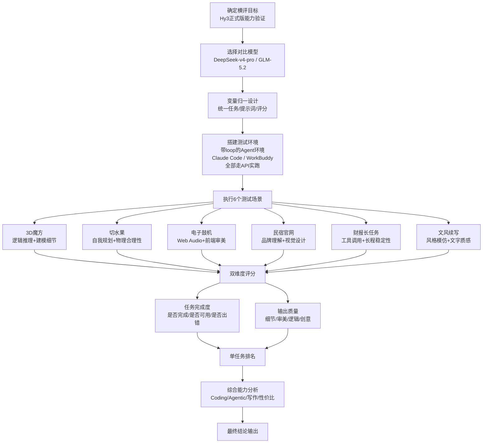

# 横评方法论深度解析

---

## 评测流程总览



---

## 一、"变量归一"评测原则

### 1.1 设计思路

"变量归一"原则源自科学实验的**控制变量法**核心思想：在对比实验中，只保留"模型"这一个自变量，其余所有可能影响实验结果的外部变量全部保持一致，从而确保观测到的性能差异确实来自模型本身的能力差异，而非其他混淆因素。

在大模型横评场景下，设计思路可概括为**"三同三不同"**：
- **三同**：任务相同、输入相同、评判标准相同
- **三不同**：模型不同、API不同、最终输出结果不同

这种设计直接回应了大模型评测领域长期存在的"评测作弊"和"结果不可复现"问题——很多评测因为提示词微调、prompt engineering过度、评判标准主观化，导致结果缺乏公信力。

### 1.2 重要性

"变量归一"是本次横评结果具备可信度的基石，其重要性体现在三个层面：

1. **结果可解释性**：当所有外部条件一致时，A模型比B模型表现好的结论才能直接归因于模型能力，而非"用了更好的提示词"或"任务描述更详细"
2. **公平性保障**：避免"提示词工程套利"——某些模型可能对特定提示词格式更敏感，如果每个模型用不同提示词，本质上是在测试"提示词优化能力"而非"模型原生能力"
3. **可复现性**：任何第三方都可以使用完全相同的任务、提示词、环境复现本次横评结果，具备学术严谨性

文中明确提到："和之前的横评一样，提示词一字未改"——这是变量归一原则在执行层面的严格体现。

### 1.3 具体执行三要素

#### 要素一：统一任务类型

- 所有模型面对完全相同的6个测试任务，任务覆盖领域（3D编程、游戏开发、前端、网站、Agent长任务、写作）预先确定
- 任务素材完全一致：包括民宿官网的图片/视频素材包、财报任务的检索范围、文风续写的原文内容，全部使用同一份
- 任务约束条件完全一致：例如"只输出一个单HTML文件"、"生成10页PPT"等硬性要求对所有模型相同

#### 要素二：统一提示词

- 对每个任务，三个模型接收到的提示词**一字不差**
- 不针对任何模型做提示词优化，不使用"DeepSeek你擅长...""GLM请用你最强的..."这类差异化引导
- 小游戏任务甚至特意使用"极其简单，就一句话"的提示词，测试模型在弱约束下的自主规划能力，避免提示词中隐含的步骤指导掩盖模型真实的Agent能力

#### 要素三：统一评分标准

从"任务完成度"和"输出质量"两个维度进行评价，评价标准对所有模型一致：
- 3D任务统一考察"运算逻辑正确性+建模阴影细节+色彩搭配+功能丰富度"
- 切水果任务统一考察"物理设计合理性+可玩性"（水果高度62%~90%是可量化的可玩性标准）
- 长程任务统一考察"上下文连贯性+工具调用稳定性+分析深度+产物完整性"

---

## 二、两大评测维度拆解分析

本次横评没有采用简单的"打分求和"方式，而是将评价拆解为**任务完成度**和**输出质量**两个正交维度，这种二分法设计精准捕捉了大模型实际使用中的两类核心问题。

### 2.1 维度一：任务完成度

**考察核心**：模型能不能把事情"做完、做对、不出错"，这是能力的底线。

| 子维度 | 具体考察点 | 文中对应案例 |
|---|---|---|
| 功能完整性 | 是否交付了要求的全部产物 | 财报长任务中三个模型都交付了Excel/Word/PPT三份产物 |
| 功能正确性 | 核心逻辑是否正确、能否正常运行 | 3D魔方三个模型都能正确打乱、还原，运算逻辑正确 |
| 可用性 | 产物是否可直接使用、无需二次修改 | 切水果任务中只有Hy3生成的版本"真正能玩"，另外两个"不二次修改基本都玩不了" |
| 错误率 | 过程中是否出现崩溃、空白、bug | GLM-5.2生成的PPT第一次打开空白，上下文用到99%导致出错 |
| 长程稳定性 | 长链路下是否指令漂移、上下文遗忘 | GLM虽然有1M窗口但长任务容易撑爆上下文，Hy3 256k反而更稳 |

**关键洞察**：任务完成度是"0或1"的门槛维度——完成度不及格的模型，质量再高也没有实际使用价值。例如GLM在财报任务中PPT打开空白，哪怕设计再好也是无效产出。

### 2.2 维度二：输出质量

**考察核心**：模型做完的事情"好不好、美不美、有没有深度"，这是能力的上限。

| 子维度 | 具体考察点 | 文中对应案例 |
|---|---|---|
| 视觉审美 | UI设计、色彩搭配、视觉高级感 | GLM-5.2在3D建模、鼓机、民宿官网三个任务中都因审美更好胜出 |
| 细节丰富度 | 功能丰富度、细节打磨程度 | 3D任务GLM阴影细节、功能丰富度更胜一筹 |
| 逻辑深度 | 是否有独立分析、推理、判断 | 财报任务DeepSeek有完整分析过程，Hy3/GLM只是汇总分析师观点 |
| 物理合理性 | 交互设计是否符合真实世界规律 | Hy3切水果抛物线设计保证水果飞到62%~90%高度，可玩性高 |
| 文字质感 | 写作是否自然、有灵魂、不堆砌 | Hy3续写"有人味儿，有灵魂，不是浮躁词汇的堆砌" |
| 声音设计 | 音频类任务的听感体验 | GLM鼓机"随便调都能出片"，Hy3声音设计需提升，DeepSeek配乐不对 |

**关键洞察**：输出质量是区分"能用"和"好用"的梯度维度——同样完成任务的两个模型，质量差异决定了实际生产环境中的用户体验和生产力效率。

### 2.3 双维度的关系

两个维度不是简单的加权求和，而是呈现**"门槛-梯度"**关系：
- 任务完成度是**准入门槛**：不达标直接淘汰
- 输出质量是**竞争梯度**：在完成度达标的前提下比拼质量

文中的排名逻辑清晰体现了这一点：例如3D任务三个模型都能正确还原魔方（完成度都达标），最终排名由建模质量决定；切水果任务DeepSeek和GLM生成的游戏玩不了（完成度不达标），即使视觉再好也排在完成度达标的Hy3之后。

---

## 三、测试环境选择合理性分析

本次横评选择**带loop的Agent环境（Claude Code / WorkBuddy）+ 走API实跑**，而非传统的"裸模型问答"或"官方Demo环境"，这一选择具有深刻的合理性。

### 3.1 为什么选择带loop的Agent环境？

| 选择理由 | 具体说明 |
|---|---|
| **贴近真实使用场景** | 2025年的大模型主要使用方式已经从"单轮问答"转向"Agent循环执行"——用户给一个goal，模型自动规划、调用工具、迭代修改、交付产物。Claude Code和WorkBuddy正是当前最主流的Agent化开发环境，测试结果直接反映真实生产力 |
| **测试Agentic能力** | 带loop的环境可以测试模型的**自我规划能力**（切水果任务只给一句话goal，看模型自己拆步骤）、**工具调用能力**（财报任务需要联网搜索、生成Word/Excel、调用PPT Skill）、**错误修复能力**（GLM的PPT出问题后Claude Code会自动修复）、**上下文管理能力**（长任务多次循环不漂移） |
| **发挥MoE模型真实实力** | Hy3是MoE架构（295B总参数/21B激活），这类模型的优势在于长上下文、工具调用、多轮交互，在单轮问答中可能无法充分发挥，Agent环境才能测到真实水平 |
| **loop机制暴露真实稳定性** | 传统单轮测试中模型"一次生成对"就算过，但Agent环境下模型需要在几十轮循环中保持稳定——GLM上下文用到99%导致PPT空白，这种问题只有在loop环境中才会暴露 |

### 3.2 为什么走API实跑而非官方Demo？

| 选择理由 | 具体说明 |
|---|---|
| **避免"演示版作弊"** | 官方Demo/Playground通常有额外的prompt工程、后处理、重试机制，不能反映开发者通过API调用时获得的真实能力 |
| **测试真实 latency 和成本** | 文中记录了"GLM耗时是Hy3和DeepSeek的两倍以上"、"Hy3第5任务只花了10分钟"——这些效率数据只有走API实跑才能获得，直接影响生产环境使用成本 |
| **测试真实上下文窗口表现** | 官方标称的上下文窗口（GLM 1M / Hy3 256k）不代表实际能用满——API实跑中发现GLM用到99%就崩了，Hy3 256k反而更稳，这种"标称vs实际"的差异只有实跑才能发现 |
| **环境一致性** | API调用保证三个模型在完全相同的Agent环境（Claude Code / WorkBuddy）中运行，只是底层API不同，符合"变量归一"原则 |

### 3.3 为什么同时用Claude Code和WorkBuddy？

- Hy3官方声称"针对WorkBuddy做了专门的适配与优化，在WorkBuddy上使用效果最佳"——在WorkBuddy上测Hy3可以验证官方说法
- Claude Code是目前最成熟的Agent开发环境，在上面测三个模型可以得到中立的基准对比
- 双环境测试可以观察"模型-环境适配"对结果的影响，这本身也是评测的一部分

---

## 四、6个测试场景能力覆盖度分析

6个测试场景不是随意选择的，而是精心设计的能力矩阵，每个场景侧重考察不同维度的模型能力，形成互补覆盖。

| 序号 | 测试场景 | 侧重考察的核心能力 | 能力维度分类 | 关键区分点 |
|---|---|---|---|---|
| 1 | **3D魔方** | 逻辑推理能力、空间思维、Three.js编程、3D建模细节（阴影/色彩/材质）、算法实现（自动解谜算法） | Coding能力-3D/算法 | GLM因建模细节胜出；DeepSeek有空间bug |
| 2 | **切水果（小游戏）** | 极简提示下的自我规划能力、物理引擎设计、交互合理性、用户体验直觉（可玩性）、one-shot交付能力 | Agent能力-规划/执行 | Hy3因物理设计合理（62%~90%高度）真正可玩胜出；另外两个玩不了 |
| 3 | **电子鼓机** | Web Audio API音频编程、前端UI审美、交互设计、声音合成能力、节奏感/音乐性理解 | Coding能力-前端/音频 | GLM因"随便调都能出片"的声音设计胜出；Hy3界面好但声音差 |
| 4 | **民宿官网** | 品牌调性理解、视觉设计品味、素材取舍能力（不是所有素材都用上）、排版布局、响应式设计、营销感（让人看了就想去） | Coding能力-前端/设计 | GLM因更好看更有品味胜出；Hy3有排版错乱；公平之处在于三个模型都没有VLM，无法"看图说话" |
| 5 | **财报长任务** | 工具调用链（联网搜索→Word→Excel→Skill调用→PPT）、长上下文管理、信息检索与筛选、财务建模与分析能力、独立判断（不是只汇总）、多产物协调能力、长程稳定性 | Agent能力-长程/工具 | DeepSeek因有独立分析、建模质量好胜出；GLM上下文99%崩盘 |
| 6 | **文风续写** | 风格模仿能力、文学质感、情感共鸣、上下文连贯性、人物/场景一致性、语言自然度（避免AI腔） | 创作能力-写作 | Hy3因"有人味儿、有灵魂"胜出；DeepSeek次之；GLM第三 |

### 能力覆盖矩阵

```
能力维度         3D魔方  切水果  电子鼓机  民宿官网  财报长任务  文风续写
─────────────────────────────────────────────────────────────────────
逻辑推理          ●●●     ●●      ●        ●        ●●●        ○
空间思维          ●●●     ●       ○        ○        ○          ○
算法实现          ●●●     ●●      ●        ○        ●●         ○
前端/UI审美        ●●      ●●      ●●●      ●●●      ●●         ○
音频编程          ○       ○       ●●●      ○        ○          ○
物理/交互设计      ○       ●●●     ●●       ●        ○          ○
自我规划能力       ○       ●●●     ●        ●        ●●         ○
工具调用链         ○       ○       ○        ○        ●●●        ○
长上下文管理       ○       ○       ○        ○        ●●●        ○
独立分析判断       ○       ○       ○        ○        ●●●        ○
品牌/调性理解      ○       ○       ○        ●●●      ○          ●
风格模仿/文学性    ○       ○       ○        ○        ○          ●●●
可玩性/用户体验    ○       ●●●     ●●       ●        ○          ○
```

（●●●=核心考察，●●=次要考察，●=涉及，○=不考察）

从矩阵可以看出，6个场景形成了相当全面的能力覆盖：
- **Coding能力**：从算法（3D魔方）→ 游戏物理（切水果）→ 音频编程（鼓机）→ Web前端（官网），覆盖了编程的多个子领域
- **Agent能力**：从短链one-shot规划（切水果）→ 长链多工具协调（财报），覆盖了Agent能力的不同复杂度层级
- **创作能力**：通过文风续写单独测试非代码类的语言创作能力，弥补纯技术任务的盲区

特别值得注意的是第4个场景的"公平性设计"：因为三个模型都没有VLM能力，所以带图片素材的任务对大家都一样，不会出现某模型能看图、其他模型不能的不公平情况——这是"变量归一"原则在场景设计中的体现。

---

## 五、与传统基准测试的差异与优势

当前大模型评测领域主流的基准测试如MMLU（知识问答）、HumanEval（代码生成）、GSM8K（数学推理）等，本质上都是**"人工标注的静态数据集测试"**，与本次实跑横评存在本质差异。

### 5.1 核心差异对比

| 对比维度 | 传统基准测试（MMLU/HumanEval/GSM8K） | 本次实跑横评 |
|---|---|---|
| **测试形式** | 静态数据集、选择题/填空题、单轮输出 | 动态任务、开放式产物、多轮Agent循环 |
| **答案形式** | 唯一标准答案，可自动判分 | 无标准答案，产物需要人工体验评估 |
| **任务复杂度** | 单步任务（选个答案/写个函数） | 多步复合任务（规划→编码→调试→交付） |
| **评估维度** | 正确率（对/错二元判断） | 完成度+质量双维度，含审美/体验/质感等主观维度 |
| **环境** | 裸模型API调用，无工具、无循环 | 真实Agent环境，有工具调用、有loop、有错误修复 |
| **考察重点** | 知识记忆、单步推理、基础代码能力 | 真实生产力、端到端交付能力、长程稳定性 |
| **结果可解释性** | 分数高=能力强（但什么能力强说不清） | 每个任务都有具体产物、具体排名理由，可解释哪里好哪里不好 |
| **成本/耗时** | 低成本，几小时跑完几万题 | 高成本，需要人工设计任务、实跑、体验产物，每个任务几十分钟 |
| **可复现性** | 高（数据集公开，自动判分） | 中（提示词和环境可复现，但质量评估带有一定主观性） |

### 5.2 本次方法论的相对优势

#### 优势1：测试"能用的能力"而非"考试的能力"

传统基准测试更像"考试"——模型只要见过类似题目、记住了知识点，就能答对。但实际工作中，用户不会给你一道有标准答案的选择题，而是说"帮我做个能玩的切水果游戏"、"帮我分析财报出研报"。

本次横评的6个任务都是**端到端的真实生产力任务**，交付的是可运行的HTML、可播放的鼓机、可打开的PPT/Excel/Word——这些产物能不能直接用、好不好用，才是用户真正关心的。

例如切水果任务：HumanEval可能会让模型写一个"计算抛物线的函数"，模型能写对函数（考试得分高），但生成的游戏水果飞到天上去切不到（实际不能用）。本次横评直接测试"最终游戏能不能玩"，这才是真实能力。

#### 优势2：暴露"标称能力"与"实际能力"的差距

传统基准测试测的是模型的"标称能力"——例如官方宣称GLM有1M上下文窗口，在长文本基准测试中可能确实表现好。但本次实跑发现GLM用到99%上下文就崩溃了（PPT空白），反而是256k窗口的Hy3更稳。

这种"标称参数好看但实际用起来拉胯"的问题，只有在真实Agent环境的长任务实跑中才能暴露。

#### 优势3：评估传统基准无法测量的"软能力"

MMLU和HumanEval完全无法测量以下能力，但这些能力在实际工作中至关重要：
- **审美能力**：网站好不好看、鼓机声音好不好听、设计有没有高级感
- **物理直觉**：水果抛物线高度62%~90%才好切，这种"用户体验直觉"
- **写作质感**：文字是"有人味儿"还是"AI腔堆砌辞藻"
- **规划能力**：给一句话goal，模型能不能自己拆成合理步骤完成
- **长程稳定性**：几十轮工具调用后会不会"失忆"、会不会"跑偏"

本次横评通过开放式任务+人工体验评估，恰恰覆盖了这些传统基准的盲区。

#### 优势4：直接反映"生产力效率"

传统基准只关心"对不对"，不关心"快不快"、"要不要改"。本次横评记录了：
- Hy3第5任务只花10分钟，效率最高
- GLM耗时是其他模型两倍以上
- DeepSeek和GLM生成的游戏"不二次修改基本都玩不了"——这意味着用户还需要花时间debug，生产力大打折扣

"能不能一次交付可用产物"、"耗时多久"，这些指标直接决定了模型在生产环境中能替代多少人力，是比正确率更有商业价值的指标。

### 5.3 两者不是替代关系，而是互补关系

需要说明的是，本次实跑横评不是要否定传统基准测试的价值——传统基准在**模型预训练后的快速筛查**、**能力回归测试**、**大规模横向对比**方面仍然有不可替代的优势（低成本、高吞吐量、可自动化）。

科学的评测体系应该是**"漏斗式"**的：
1. **第一层（海选）**：用MMLU/HumanEval等传统基准快速跑几万个模型，筛掉明显不行的
2. **第二层（复赛）**：用类似本次的实跑横评方法，对候选模型做端到端生产力测试
3. **第三层（决赛）**：在真实业务场景中A/B测试，看实际业务指标提升

本次横评方法论的价值，正是填补了第二层的空白——在传统基准和真实业务之间，提供了一个"比基准更真实、比业务A/B测试成本更低"的中间层评测方案。

---

## 六、方法论优势与局限性客观评估

### 6.1 方法论优势总结

| 优势类别 | 具体优势 | 实际价值 |
|---|---|---|
| **科学性** | 严格的"变量归一"控制变量设计 | 结果可信度高，差异可归因于模型能力而非外部因素 |
| **真实性** | 真实Agent环境+API实跑+端到端产物交付 | 测试结果直接反映真实使用体验，不是"考场高分、工作低能" |
| **全面性** | 6个场景覆盖Coding/Agent/创作三大能力域，含技术+审美+体验多维度 | 避免"偏科模型"在单一维度高分就被吹上天 |
| **可解释性** | 每个任务都有具体排名理由、具体优劣点（如"水果高度62%~90%"、"上下文99%崩盘"） | 不是扔一个干巴巴的分数，而是告诉用户"这个模型擅长什么、不擅长什么、坑在哪里" |
| **实用性** | 评测结果直接指导选型（作者决定"后续写作工作流都换成Hy3"） | 对开发者和企业选型有直接参考价值，不是为了评测而评测 |
| **洞察深度** | 能发现参数表上看不到的问题（如GLM 1M窗口实际用不满、Hy3 256k反而更稳） | 帮助用户避坑，这些洞察比参数表更有价值 |

### 6.2 方法论局限性

任何评测方法论都有其适用边界，本次横评也不例外，客观存在以下局限性：

#### 局限性1：样本量小，统计显著性不足

- 每个任务只跑了一次，没有多次重复测试
- 大模型输出具有随机性（temperature参数），单次结果可能受运气影响
- 6个任务虽然覆盖广，但绝对数量不多，可能存在任务选择偏差

**影响**：单个任务的排名可能有一定波动，但6个任务的综合结论（GLM Coding强、DeepSeek长程分析强、Hy3均衡且写作好）应该是稳健的。

#### 局限性2：质量评估存在主观性

- "好不好看"、"有没有人味儿"、"高级感"这类评价没有量化标准，依赖作者个人审美
- 作者作为评测者，可能存在个人偏好偏差（例如偏好某种写作风格）
- 没有双盲评审，作者知道哪个输出是哪个模型生成的，可能存在潜意识的偏见

**影响**：质量维度的绝对分数可能有主观偏差，但相对排名（A比B好）应该问题不大，因为对比是在相同标准下进行的。

#### 局限性3：场景选择偏向"前端/创意类"任务

- 6个任务中4个是前端/可视化/创意类（3D、游戏、鼓机、官网、写作）
- 缺少后端开发、数据库设计、系统架构、DevOps、算法题（LeetCode hard）等技术场景
- 缺少企业级场景：如大规模代码重构、复杂系统debug、多文件项目开发等

**影响**：评测结果对"前端开发者、内容创作者、独立开发者"参考价值大，但对"后端工程师、算法工程师、企业级开发团队"的参考价值可能有限。

#### 局限性4：没有量化评分，只有相对排名

- 本次横评只有"谁第一谁第二"的排名，没有量化的分数差距
- 无法回答"GLM比Hy3强多少？"、"Hy3比DeepSeek领先几个百分点？"这类问题
- 不适合用来做精确的模型版本迭代对比（例如"Hy3比Hy3 Preview提升了百分之多少"）

**影响**：适合定性的选型对比，不适合定量的版本迭代追踪。

#### 局限性5：成本高，难以规模化

- 每个任务需要设计提示词、准备素材、实跑、人工体验产物、写评测，人力成本高
- 6个任务三个模型跑下来，作者花费了相当多时间（单是第5个任务Hy3就跑了10分钟，GLM跑了20+分钟）
- 很难像MMLU那样一次跑几万个模型、几百个任务

**影响**：适合少量重点模型的深度横评，不适合大规模模型筛查。

#### 局限性6：没有测试VLM等多模态能力

- 文中明确提到"恰好这三个模型都没有VLM能力"，所以选了带图片素材的任务也算公平
- 但这意味着本次评测完全没有测试视觉理解、图片生成、多模态推理等能力
- 而2025年多模态已经是大模型的核心能力之一，这是一个明显的盲区

**影响**：评测结论只适用于文本/代码/Agent能力，不适用于多模态能力。

### 6.3 改进建议（如果要做v2版本）

基于以上局限性，如果未来要优化这套方法论，可以考虑：
1. 每个任务跑3-5次取平均，减少随机性影响
2. 邀请多个评审双盲打分，减少个人偏见
3. 增加后端/算法/企业级场景，平衡场景覆盖
4. 对质量维度设计更细的量化评分rubric
5. 加入多模态任务（VLM看图、图生代码等）
6. 增加错误率、重试次数、token消耗、耗时等量化效率指标

---

## 七、总结

本次横评的方法论是一套**面向真实生产力的大模型评测方案**，其核心价值在于：

1. **用"变量归一"保证科学性**：控制变量，结果可信
2. **用"Agent环境+API实跑"保证真实性**：测真实使用场景下的表现，不是考场刷分
3. **用"完成度+质量"双维度保证全面性**：既测能不能做完，也测做得好不好
4. **用"6个互补场景"保证覆盖度**：技术、审美、体验、长程能力都测到
5. **用"端到端产物+具体优劣点"保证可解释性**：不是给个干巴巴的分数，而是告诉用户好在哪里、坑在哪里

这套方法论特别适合**模型选型阶段的深度对比**——当你纠结"我该用DeepSeek还是GLM还是混元"时，这种实跑横评比MMLU分数有用得多。

它的局限性也很明确：样本小、有主观性、成本高、场景偏前端——但这些局限性是"追求真实"的必然代价，在深度评测场景下是可以接受的权衡。

整体而言，这是一套**务实、接地气、对开发者有实际指导价值**的评测方法论，代表了2025年大模型评测从"刷榜"走向"实测"的重要方向。
