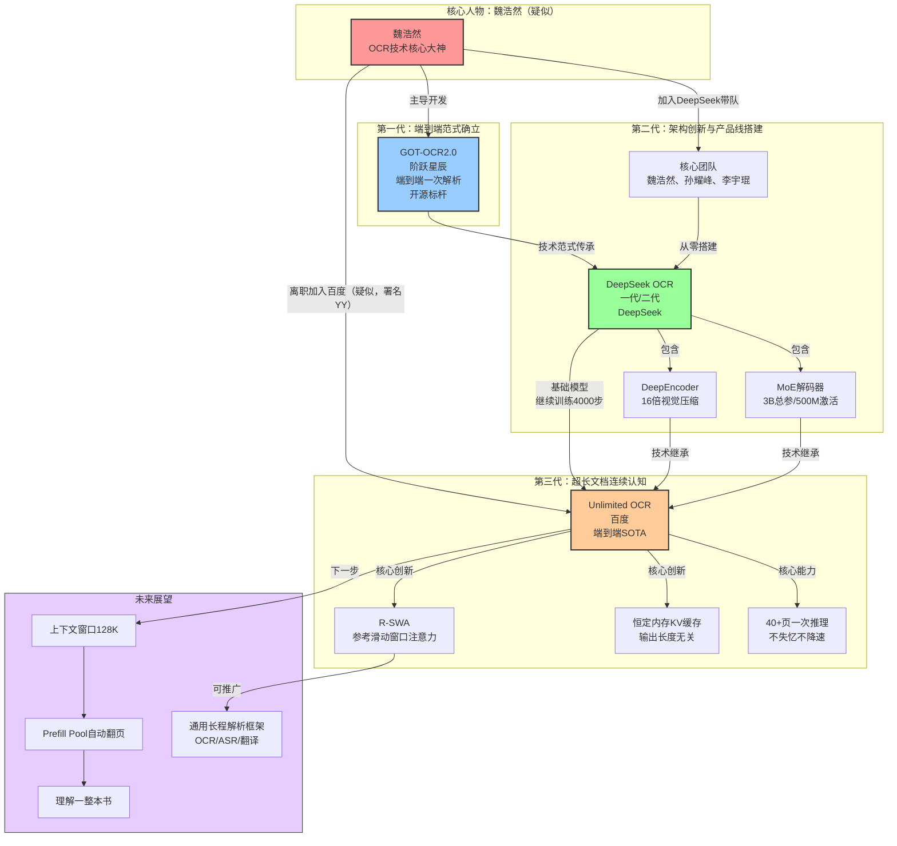

# 百度Unlimited OCR开源深度分析：小模型逆袭、R-SWA范式突破与长程智能的未来

> 本文为多维度综合分析报告，整合了元数据梳理、R-SWA技术解析、性能数据验证、技术演进脉络、人才线索考证、关键概念辨析、信息质量评估、产业深度洞察等8个子任务的分析成果（详见 [task1-metadata-structure.md](task1-metadata-structure.md)、[task2-rswa-tech-analysis.md](task2-rswa-tech-analysis.md)、[task3-performance-data.md](task3-performance-data.md)、[task4-tech-evolution.md](task4-tech-evolution.md)、[task5-author-talent-analysis.md](task5-author-talent-analysis.md)、[task6-key-concepts.md](task6-key-concepts.md)、[task7-quality-assessment.md](task7-quality-assessment.md)、[task8-industry-insights.md](task8-industry-insights.md)）。

---

## 执行摘要

2026年7月，百度开源Unlimited OCR模型，以3B总参数、500M激活的小体量在OmniDocBench v1.5/v1.6分别取得93.23%/93.92%的端到端SOTA成绩，领先235B参数的Qwen3-VL达4.08个百分点，核心突破是**R-SWA（参考滑动窗口注意力）机制**——通过模拟人类"软遗忘"认知模式，实现固定容量KV缓存，一次推理可连续解析40+页文档不失忆、不降速。模型基于DeepSeek OCR仅继续训练4000步即获此突破，被技术报告称为解析任务的"免费午餐"。论文作者中署名"YY†（技术总监）"的神秘人物，经能力、时间线、署名方式三条证据链高度疑似从DeepSeek离职的魏浩然（GOT-OCR2.0、DeepSeek OCR主导者）。R-SWA不仅是OCR领域的技术优化，更可能是通用长程解析框架的雏形，有望推广到ASR、机器翻译、Agent记忆等长序列处理领域，标志着AI从"短序列智能"向"长程连续智能"的重要范式转折。综合可信度评分7.5/10，核心技术数据开源可验证，但评测细节缺失、人才身份为推测。

---

## 1. 事件概述：Unlimited OCR发布与核心亮点

2026年7月，百度正式开源**Unlimited OCR**模型，同时在GitHub和HuggingFace开放代码与模型权重。这一发布迅速引爆AI圈，核心爆点在于其颠覆认知的性能表现——以极小的模型体量，碾压了参数规模数百倍的通用大模型。

### 1.1 基本信息

| 项目 | 内容 |
|------|------|
| 发布方 | 百度 |
| 模型名称 | Unlimited OCR |
| 开源地址 | GitHub: https://github.com/baidu/Unlimited-OCR<br>Hugging Face: https://huggingface.co/baidu/Unlimited-OCR |
| 总参数量 | 3B |
| 激活参数量 | 500M（MoE架构） |
| 核心技术 | R-SWA参考滑动窗口注意力 + DeepEncoder视觉压缩 |
| 训练基础 | 基于DeepSeek OCR继续训练4000步 |
| 核心能力 | 一次推理连续解析40+页文档不失忆 |

### 1.2 三大核心亮点

**亮点一：小模型逆袭大模型**

500M激活参数的Unlimited OCR，在文档理解权威基准OmniDocBench上，系统性击败了235B的Qwen3-VL、Gemini-2.5 Pro、72B的Qwen2.5-VL等数百亿参数级别的通用大模型。这不是跑分波动，而是架构创新对参数暴力的系统性胜利。

**亮点二：40+页文档一次推理不失忆**

传统OCR模型处理长文档时普遍采用"逐页切割+外部调度拼接"的权宜之计，处理完一页就清空记忆，导致跨页语义断裂、"逐页失忆"。Unlimited OCR第一次实现了真正的连续认知——一次前向推理就能转录几十页文档，20页时文本编辑距离仅0.057，40+页时仍控制在0.11以下，Distinct-35重复率指标高达97%，几乎无"复读"现象。

**亮点三：速度不降反升**

在输出达到6144 token时，Unlimited OCR的TPS（每秒生成token数）高达7847，比DeepSeek OCR（5822 TPS）快35%。更关键的是，随着输出长度增加，DeepSeek OCR因标准注意力KV缓存滚雪球式增长导致每步耗时稳步攀升，而Unlimited OCR的R-SWA机制让延迟从头到尾保持水平直线——输出越长，速度优势越大。

> 元数据与文章结构详细分析见 [task1-metadata-structure.md](task1-metadata-structure.md)。

---

## 2. 问题诊断：为什么所有OCR都在"逐页失忆"

在Unlimited OCR之前，整个OCR行业都被同一个问题困扰——**"逐页失忆"**。几十页的文档，模型无法一次性处理，只能切成单页任务逐页处理，再用外部调度器勉强拼接结果。这就像在运行一个`for`循环，处理完一页就清空记忆，从头开始下一页。

### 2.1 "逐页失忆"的现象与代价

这种"切割-缝合"模式虽然能勉强工作，但本质上只是工程上的权宜之计，离真正的连续智能理解还差着一大截：

- **跨页语义断裂**：外部调度器只能做文本级拼接，无法建立真正的跨页语义关联——前后术语引用、跨页图表、逻辑连贯性从机制上就无法解决
- **工程复杂度爆炸**：为了缓解失忆问题，企业需要投入大量工程资源开发复杂的调度系统、上下文窗口管理、结果后处理，这些工程代码不产生核心价值，却占据OCR系统70%以上的代码量
- **边际成本递增**：文档越长，拼接错误率越高，人工校验成本超线性增长
- **速度持续下降**：即使勉强在上下文窗口内处理多页，随着输出增长，速度越来越慢，最终触达硬件极限

### 2.2 技术根源：标准MHA的KV缓存滚雪球

"逐页失忆"的真正元凶，是**标准多头注意力（MHA）机制下KV缓存随输出长度线性增长**的固有缺陷。

在Transformer架构中，每生成一个新token，都需要将当前token的Key（K）和Value（V）向量添加到KV缓存中，后续每个token生成都要attend到缓存中**所有**历史token。这意味着：

```
传统MHA的KV缓存：[K1, V1], [K2, V2], [K3, V3], ..., [Kn, Vn]  →  随n线性增长
```

- **内存占用滚雪球**：输出1000个token时KV缓存是1000份，输出10万个token时就是10万份
- **计算复杂度O(n²)**：每步注意力计算需要与所有历史token交互，解码步数越多，每步耗时越长
- **最终触达硬件极限**：内存吃不消、速度越来越慢，模型无法一次性处理完整长文档

**人类抄书的类比**：这就像一个人抄书时，每写一个字都要把之前写过的所有字重新读一遍——写第一页时还很快，写到第十页时速度慢得无法忍受，最后只能写一页撕一页，重新开始。

正是这个技术瓶颈，逼着所有模型不得不采用逐页处理策略，导致频频"失忆"。

---

## 3. 核心突破：R-SWA参考滑动窗口注意力技术解析

Unlimited OCR的核心突破是**R-SWA（Reference Sliding Window Attention，参考滑动窗口注意力）**。这一机制的设计灵感不是来自纯工程优化，而是来自对人类认知模式的观察——人类抄书时的"软遗忘"智慧。

### 3.1 "软遗忘"：人类抄书的认知智慧

想象一下你正在手抄一本书：

- **眼睛盯着原书**：原文始终全局可见，确保抄的内容准确无误
- **余光瞄着刚写下的几行**：保持书写的连贯性和上下文衔接
- **聚焦即将写的下一个字**：当前注意力集中在即将输出的内容上
- **早些写过的内容自然淡出**：不需要一直记着半小时前写的具体文字，认知负荷维持在低位

这种"该忘就忘"的能力被称为**"软遗忘"（soft forgetting）**，它有三个关键特征：
1. **参考信息全局保留**：原文始终完整可见，不随时间遗忘
2. **工作记忆滑动窗口**：只保留最近一段时间的输出上下文，更早的内容自然淡出
3. **认知负荷恒定**：无论任务多长，工作记忆容量保持不变，因此能持续稳定输出

R-SWA正是将这种认知机制精确工程化的产物。

### 3.2 R-SWA的非对称注意力设计

R-SWA最精妙的地方在于其**非对称的注意力范围设计**，对"参考token"和"输出token"采用完全不同的注意力策略：

#### 参考token侧：全局可见（Full Attention）

每生成一个token，R-SWA都会attend到**全部参考token**，包括：
- 整张图像的所有视觉token（文档页面的视觉编码）
- 提示词（prompt）token

**设计意图**：保证模型在生成过程中始终"看得见"完整原文，就像抄书时眼睛始终盯着原书。这从机制上确保了信息源的完整性，不会因为生成过程而丢失原文信息。

#### 输出侧：滑动窗口（Sliding Window）

在输出token这一侧，模型只回看前面**最近的128个token**，就像抄书时只瞄一眼刚写的那几行。

**设计意图**：维持输出的连贯性和局部上下文，避免语法断裂、格式混乱，但不需要记住所有历史输出。

### 3.3 实现方式：固定容量KV队列

在工程实现上，Unlimited OCR将模型的**所有注意力层全部替换为R-SWA**，从而把传统的无限增长KV缓存改造成一个**固定容量的队列**：

```
传统MHA的KV缓存：[K1, V1], [K2, V2], [K3, V3], ..., [Kn, Vn]  →  随n线性增长
R-SWA的KV缓存：  [K_{n-127}, V_{n-127}], ..., [Kn, Vn]        →  始终只有128个
```

队列工作机制：
1. 每生成一个新token，将其K/V向量加入队尾
2. 如果队列长度超过128，将队首（最老的token）挤出队列
3. 队列大小始终保持128个token的固定容量

### 3.4 标准MHA vs R-SWA对比

| 对比维度 | 标准MHA（多头注意力） | R-SWA（参考滑动窗口注意力） |
|---|---|---|
| **注意力范围** | 对称注意力：所有token attend到全部历史token | 非对称注意力：参考token全局可见，输出token仅看最近128个 |
| **KV缓存大小** | 随输出长度线性增长：O(n) | 固定容量：始终为128个输出token + 参考token数量 |
| **内存增长模式** | 滚雪球式增长，最终OOM | 恒定内存：输出1万token和10万token内存占用相同 |
| **长文档表现** | 被迫逐页切割，跨页上下文断裂 | 一次推理读完几十页，上下文连贯 |
| **单步延迟表现** | 随解码步数稳步攀升 | 从头到尾延迟平线，速度恒定 |
| **计算复杂度** | O(n²)，n为序列长度 | 近似O(1)（解码阶段每步计算量固定） |
| **信息完整性** | 历史输出完整保留，但内存代价极高 | 参考信息完整保留，早期输出"软遗忘" |
| **适用场景** | 短文本生成、对话 | 长文档OCR、长文本转录、连续翻译等超长程解析 |

### 3.5 DeepEncoder：极致视觉压缩的协同

R-SWA解决了输出侧的内存增长问题，但要真正实现几十页文档的一次推理，还需要视觉侧的高效压缩——这就是**DeepEncoder**发挥作用的地方。

DeepEncoder最初源自DeepSeek OCR项目，其核心能力是实现极高倍率的视觉token压缩：
- **输入**：一张1024×1024分辨率的PDF页面图像
- **输出**：仅仅256个视觉token
- **压缩率**：高达16倍

关键特性是**视觉token在R-SWA下不参与状态转移**——它们在prefill阶段一次性编码完成后，就作为固定的参考信息存在，不会进入输出侧的滑动窗口队列被"挤出"。无论解码过程多长，图像信息永远清清楚楚。

DeepEncoder的16倍压缩 + R-SWA的恒定缓存产生了"1+1>2"的效果：单页仅需256个视觉token，20页文档仅需5120个视觉token，在标准的32K上下文窗口里，一次前向推理就能转录数十页文档。

### 3.6 Flash Attention v3延迟验证：平线 vs 爬坡

Flash Attention v3延迟测试结果直观展示了R-SWA的威力：
- **DeepSeek OCR（标准MHA）**：随着解码步数增加，每步耗时**稳步攀升**——曲线从左下到右上持续增长
- **Unlimited OCR（R-SWA）**：从头到尾**一条平线**，纹丝不动

在输出达到6144个token时：
- Unlimited OCR的TPS：7847
- DeepSeek OCR的TPS：5822
- **性能差距35%**——输出越长，差距越大。

> R-SWA技术深度解析详见 [task2-rswa-tech-analysis.md](task2-rswa-tech-analysis.md)。

---

## 4. 性能验证：benchmark数据与长文档表现

Unlimited OCR的性能提升不是某一个指标的偏科，而是全维度、无短板的系统性超越。

### 4.1 OmniDocBench综合得分：刷新SOTA

**OmniDocBench v1.5 综合排名**：

| 排名 | 模型 | 总参数规模 | 激活参数 | 综合得分 | 与 Unlimited OCR 差距 |
|:---:|---|:---:|:---:|:---:|:---:|
| 🥇 | Unlimited OCR | 3B | 500M | **93.23%** | — |
| 🥈 | Qwen3-VL | 235B | 未公开 | 89.15% | -4.08pp |
| 🥉 | Gemini-2.5 Pro | 未公布 | 未公开 | 88.03% | -5.20pp |
| 4 | Qwen2.5-VL | 72B | 未公开 | 87.02% | -6.21pp |
| 5 | DeepSeek OCR | 未公开 | 未公开 | 87.01% | -6.22pp |

在更新的**OmniDocBench v1.6**基准上，Unlimited OCR进一步将成绩提升至**93.92%**，继续保持端到端SOTA地位。

**关键结论**：仅500M激活参数的Unlimited OCR，以3B总参数规模击败了235B的Qwen3-VL，领先第二名4.08个百分点，领先直接竞品DeepSeek OCR 6.22个百分点。

### 4.2 详细指标拆解：全面超越

| 指标类型 | 具体指标 | DeepSeek OCR | Unlimited OCR | 变化幅度 | 方向 |
|---|---|:---:|:---:|:---:|:---:|
| 文本质量 | 文本编辑距离 | 0.073 | 0.038 | ↓ 47.9% | 越低越好 |
| 公式识别 | 公式 CDM | 83.37 | 92.61 | ↑ 11.1% | 越高越好 |
| 表格识别 | 表格 TEDS | 84.97 | 90.93 | ↑ 7.0% | 越高越好 |
| 基础能力 | 文本识别 | — | — | 全面超越 | — |
| 布局理解 | 阅读顺序 | — | — | 全面超越 | — |

**核心提升亮点**：
- 文本编辑距离降低近一半，逐字准确率大幅提升
- 公式识别CDM提升超9个点，数学公式解析能力显著增强
- 表格TEDS提升近6个点，结构化表格还原更准确
- 文本识别与阅读顺序两项基础能力实现全面超越

### 4.3 长文档性能：40+页不失忆

| 文档长度 | 指标 | 数值 | 说明 |
|---|---|:---:|---|
| 20 页同时输入 | 文本编辑距离 | **0.057** | 逐字比对误差极低 |
| 40+ 页一次性输入 | 文本编辑距离 | **< 0.11** | 长文档无明显性能衰减 |
| 任意长度 | Distinct-35 | **97%** | 重复率极低，几乎无"复读"现象 |

R-SWA + DeepEncoder共同实现了固定容量KV缓存，输出1万token与10万token内存占用完全一致，从根本上解决了长文档"逐页失忆"问题。

### 4.4 训练效率：4000步的"免费午餐"

| 项目 | 参数 |
|---|---|
| 基座模型 | DeepSeek OCR |
| 继续训练步数 | 仅 **4000 步** |
| 模型架构 | MoE（混合专家模型） |
| 总参数量 | 3B |
| 激活参数量 | **500M** |

R-SWA被称为解析任务的「**免费午餐**」——极小训练投入获得显著性能提升。这不是微调技巧，而是架构层面的根本性改进：参数不增加、训练成本极低、推理速度更快、效果却大幅提升。

### 4.5 九大文档类型：全场景无短板

Unlimited OCR在PPT、论文、杂志、报纸等**九大文档类型**中表现均衡，无一短板：
- ✅ **7个类别**领先DeepSeek OCR
- ✅ **文本识别**项全面超越
- ✅ **阅读顺序**项全面超越
- ✅ PPT、论文、杂志、报纸等典型场景均表现优异

### 4.6 核心评测指标说明

为帮助准确理解数据意义，对核心指标说明如下：

| 指标 | 含义 | 解读 |
|---|---|---|
| **编辑距离** | 衡量文本转录准确性，数值越低越准确 | 0.038意味着字符级错误较DeepSeek OCR减少近一半 |
| **CDM** | 公式识别质量指标，满分为100 | 92.61接近人工识别水平 |
| **TEDS** | 表格结构识别相似度指标，满分为100 | 90.93意味着复杂表格结构还原精准 |
| **TPS** | 每秒生成token数，衡量推理速度 | 7847 TPS在6144 token长度下比DeepSeek OCR快35% |
| **Distinct-35** | 35-gram去重比例，检测"复读"现象 | 97%意味着几十页输出几乎无重复 |

> 性能数据详细梳理见 [task3-performance-data.md](task3-performance-data.md)。

---

## 5. 技术演进：从GOT-OCR2.0到Unlimited OCR的三代跃迁

OCR技术在短短几年内完成了三次范式跃迁，魏浩然是贯穿始终的核心人物（疑似）。

### 5.1 三代技术概览

#### 第一代：GOT-OCR2.0（阶跃星辰）——端到端范式确立

GOT-OCR2.0是魏浩然在阶跃星辰时期主导开发的开源项目，它**首次证明了端到端OCR范式的可行性**，打破了传统OCR"检测+识别"两阶段流水线的束缚，为后续所有端到端OCR工作奠定了基础，成为开源社区端到端OCR的标杆项目。

#### 第二代：DeepSeek OCR（DeepSeek）——架构创新与产品线搭建

魏浩然加入DeepSeek后，带领核心团队（魏浩然、孙耀峰、李宇琨）从零开始搭建了DeepSeek OCR一代和二代，两大核心创新：
- **DeepEncoder**：将1024×1024的PDF页面压缩到仅256个视觉token，压缩率高达16倍
- **MoE解码器架构**：总参数3B，实际激活仅500M，实现"大模型容量、小模型速度"

DeepSeek OCR在OmniDocBench v1.5上取得87.01%的成绩，成为当时的SOTA。

#### 第三代：Unlimited OCR（百度）——超长文档连续认知

基于DeepSeek OCR继续训练4000步，核心创新是R-SWA参考滑动窗口注意力机制：
- 模拟人类"软遗忘"认知模式
- KV缓存变为固定容量队列，内存占用恒定
- 实现40+页文档一次推理不失忆、不降速

### 5.2 三代技术对比

| 维度 | GOT-OCR2.0 | DeepSeek OCR | Unlimited OCR |
|------|------------|--------------|---------------|
| **研发机构** | 阶跃星辰 | DeepSeek | 百度 |
| **核心主导** | 魏浩然 | 魏浩然团队 | 魏浩然（疑似，署名YY） |
| **技术范式** | 端到端一次解析 | 端到端+视觉压缩+MoE | 超长文档连续认知 |
| **编码器技术** | 基础视觉编码 | DeepEncoder（16倍压缩） | 继承DeepEncoder |
| **解码器架构** | 标准Transformer | MoE（3B总参/500M激活） | MoE（3B总参/500M激活） |
| **注意力机制** | 标准MHA | 标准MHA | R-SWA参考滑动窗口注意力 |
| **KV缓存特性** | 随序列增长膨胀 | 随序列增长膨胀 | 恒定内存（固定容量队列） |
| **长文档能力** | 单页/短文档 | 多页但速度随长度下降 | 40+页一次推理不失忆 |
| **OmniDocBench v1.5** | - | 87.01% | 93.23% |
| **训练基础** | 从零训练 | 从零搭建 | 基于DeepSeek OCR训练4000步 |

### 5.3 Mermaid技术演进图



### 5.4 范式演进路径

OCR技术经历了三次重大范式跃迁：

1. **第一代：逐页处理（传统OCR）**——两阶段流水线+外部调度，本质是工程权宜之计
2. **第二代：端到端一次解析（GOT-OCR2.0/DeepSeek OCR）**——单模型端到端处理，但仍受限于标准MHA的KV缓存膨胀
3. **第三代：超长文档连续认知（Unlimited OCR）**——类人"软遗忘"连续认知，第一次实现了OCR模型对长文档的真正理解

### 5.5 技术路线图展望

根据论文展望，下一步演进方向：
- **上下文窗口扩展到128K**：从当前32K支持40+页，扩展到128K支持更长文档
- **构建Prefill Pool实现自动翻页**：让模型学会自动翻页，无需人工干预
- **终极目标**：OCR不再是"识别一页文字"，而是**理解一整本书**
- **通用长程解析框架**：R-SWA可推广到ASR、机器翻译等长程任务

> 技术演进脉络详细分析见 [task4-tech-evolution.md](task4-tech-evolution.md)。

---

## 6. 人才线索：神秘技术总监YY身份考证

> **⚠️ 重要声明：本章所有涉及"YY即为魏浩然""魏浩然加入百度"的内容，均为基于公开线索的合理推测，非官方确认。截至目前，魏浩然本人未正式宣布加入百度，百度官方未正式宣布魏浩然入职，论文中"YY†"的真实身份尚未得到官方确认。**

### 6.1 耐人寻味的署名方式

Unlimited OCR论文的核心贡献者共三位，署名方式呈现出不对称性：

| 署名 | 身份标注 | 署名方式 |
|------|----------|----------|
| Youyang Yin | - | 真实姓名 |
| Huanhuan Liu\* | 项目leader | 真实姓名 + 星号标记 |
| **YY†** | **技术总监** | **两字母缩写 + 剑号标记** |

关键观察：前两位作者均公开使用真实姓名，唯独标注为"技术总监"的第三位作者仅使用两字母缩写"YY"。剑号(†)在学术论文中常用来标注通讯作者或特殊贡献者。技术总监作为核心技术负责人选择隐匿全名，这种反常的署名方式本身就是一条重要线索。

### 6.2 三条证据链分析

#### 证据链1：能力匹配

国内OCR圈人才池有限，能做出R-SWA级别突破且对DeepSeek OCR架构有"亲手做过"级别熟悉的人极少：
- R-SWA不是渐进式改进，而是对注意力机制的范式级创新，需要对OCR任务本质有极深刻理解
- 基于DeepSeek OCR仅训练4000步就获6.22个百分点提升，说明主导者对DeepEncoder、MoE解码器等内部架构了如指掌
- 魏浩然从GOT-OCR2.0到DeepSeek OCR一代/二代，是国内端到端OCR领域最具连续创新记录的核心人物

#### 证据链2：时间线吻合

| 时间 | 事件 |
|------|------|
| DeepSeek OCR一代/二代 | 核心作者三人：魏浩然、孙耀峰、李宇琨 |
| 2026年4月 | DeepSeek发布V4，魏浩然名字后面多了星号——**已离职标记** |
| 三人中 | 孙耀峰、李宇琨未见公开离职信息，**只有魏浩然一人公开离开DeepSeek** |
| Unlimited OCR发布 | 百度开源Unlimited OCR，时间点在魏浩然离职后（从4月到7月约3个月，与4000步训练周期吻合） |

#### 证据链3：署名方式吻合

- 技术总监用缩写+剑号的隐匿署名方式，符合"已入职但未正式官宣"的过渡期常见做法
- "技术总监"的职位定位，与魏浩然在DeepSeek时期一手搭建整条OCR线的团队负责人身份完全吻合
- GitHub致谢栏将**DeepSeek-OCR和DeepSeek-OCR-2排在致谢栏前两位**，暗示项目主导者与DeepSeek OCR团队的深厚渊源

### 6.3 魏浩然履历梳理（疑似）

#### 阶跃星辰时期：GOT-OCR2.0——端到端范式的开源标杆

主导开发GOT-OCR2.0，首次证明端到端OCR范式可行，打破传统两阶段流水线束缚，树立开源标杆。

#### DeepSeek时期：从零搭建整条OCR线

加入DeepSeek后一手搭起整条OCR技术线，主导DeepSeek OCR一代到二代完整迭代，发明DeepEncoder视觉压缩和MoE解码器架构。

#### 疑似加入百度：Unlimited OCR——R-SWA核心创新

如果推测成立，Unlimited OCR代表了魏浩然技术追求的又一次跃迁——从"端到端做出来"到"解决长程失忆问题"，R-SWA首次让OCR模型具备了类似人类的连续认知能力。

### 6.4 百度AIDU计划："产业底座+前沿研究"的双向奔赴

2026年，百度将AIDU人才计划升级为**集团级战略项目**，明确提出**"薪酬不设上限"**。魏浩然（疑似）选择百度，背后是"产业底座+前沿研究"结合的清晰逻辑：

- **百度的优势**：PaddleOCR是国产OCR代名词，有最广泛的落地场景、成熟的工程体系、海量产业数据
- **魏浩然的擅长**：不是工程优化，而是"先想清楚OCR应该长什么样，再做出来"的前沿范式创新能力
- **结合后的完整闭环**：既有PaddleOCR多年铺就的产业落地网络，又有能持续做出范式创新的顶尖人才，创新到落地的链路被压缩到最短

> 人才身份线索与流动分析详见 [task5-author-talent-analysis.md](task5-author-talent-analysis.md)。

---

## 7. 关键概念词典

为帮助读者准确理解本文涉及的技术术语，以下提供关键概念辨析：

| 概念 | 解释 |
|------|------|
| **R-SWA（参考滑动窗口注意力）** | 核心创新机制：始终可见完整参考信息（视觉token+提示词），但只回看最近128个输出token，将KV缓存固定为恒定大小队列，实现超长文档连续解析不失忆。 |
| **软遗忘（soft forgetting）** | 人类处理长程任务的认知机制——较早内容自然淡出，只保留最近上下文维持进度，原文始终全局可见。R-SWA将这种"该忘就忘"能力工程化。 |
| **KV缓存** | 大模型推理时存储已生成token的Key/Value矩阵加速推理。标准MHA下随输出长度滚雪球增长，是"逐页失忆"的根本原因。 |
| **MHA（多头注意力）** | Transformer标准注意力机制，所有token attend到全部历史token，随解码步数增加延迟稳步攀升。 |
| **DeepEncoder** | 高效视觉编码器，将1024×1024页面压缩到256个视觉token（16倍压缩），视觉token不参与状态转移，图像信息永不退化。 |
| **MoE（混合专家模型）** | 稀疏激活架构：总参数3B但每次只激活500M，实现"大模型容量、小模型速度"兼得。 |
| **编辑距离** | 文本转录准确性指标，数值越低越准确。Unlimited OCR从0.073降至0.038，字符错误减少近一半。 |
| **CDM** | 公式识别质量指标，满分为100。92.61已接近人工识别水平。 |
| **TEDS** | 表格结构识别相似度指标，满分为100。90.93意味着复杂表格结构还原精准。 |
| **TPS** | 每秒生成token数，衡量推理速度。6144 token时Unlimited OCR达7847 TPS，比DeepSeek OCR快35%。 |
| **Distinct-n** | 文本多样性指标，检测"复读"现象。Distinct-35达97%意味着几十页输出几乎无重复。 |
| **OmniDocBench** | 文档理解权威评测基准，综合评估九大文档类型的端到端解析质量。 |
| **SOTA** | State of the Art，"当前最先进水平"。Unlimited OCR以500M激活参数拿下端到端SOTA。 |

### "小模型逆袭"的深层逻辑

3B/500M小模型碾压235B大模型不是偶然，而是三个因素共同作用：
1. **非对称注意力架构精准适配任务**：R-SWA区分参考侧和生成侧，而不是用对称注意力"一刀切"
2. **垂直任务不需要通用世界知识**：OCR是感知-转录任务，答案就在输入图像里，235B中存储通用知识的参数完全是浪费
3. **从"记住一切"到"该忘就忘"**：主动遗忘机制让认知负荷恒定，而非被动截断导致失忆

> 关键概念详细辨析见 [task6-key-concepts.md](task6-key-concepts.md)。

---

## 8. 信息质量与可信度评估

### 8.1 综合可信度评分：7.5/10

#### 加分因素

1. **开源可验证（+3分）**：GitHub+HuggingFace双开源，这是最强的可信度保障——"别信我说的，自己跑一遍"
2. **数据具体且全面（+2分）**：多个维度的具体数值（准确率、速度、长文档稳定性），不是空口说白话
3. **对比对象公开（+1分）**：对比的都是知名公开模型，benchmark也是公开的
4. **技术逻辑自洽（+1分）**：R-SWA的非对称注意力设计从原理上解释得通，延迟曲线图支撑结论
5. **推测部分有标注（+0.5分）**：人才身份推测使用了"大概率""如果"等限定词

#### 扣分因素

1. **评测细节缺失（-1分）**：未说明测试硬件、prompt设置、是否做了针对性优化，benchmark分数公平性无法完全确认
2. **叙事倾向明显（-0.5分）**：大量夸张表述（"碾压""免费午餐""闷声干大的"）和人才八卦叙事，是典型的科技媒体包装风格
3. **关键信息省略（-0.5分）**：未提训练数据规模、推理硬件要求、license、落地案例等实用信息
4. **推测部分引导性过强（-0.5分）**：虽然字面上说"大概率"，但"层层递进、排除其他可能"的叙事结构强烈引导读者接受YY=魏浩然的结论

### 8.2 可验证性高的部分

- 模型和代码完全开源，任何人都可以下载复现
- OmniDocBench是公开benchmark，对比模型均已公开
- 具体数值精确到小数点后两位，TPS、编辑距离、CDM、TEDS等多维度指标可交叉验证
- R-SWA的技术原理逻辑自洽，Flash Attention v3延迟曲线图（平线vs爬坡）是直观证据

### 8.3 需要注意的局限性

**技术实现层面**：未提供论文链接、未说明R-SWA具体实现细节（128窗口大小如何选择、视觉token不参与状态转移的具体机制）、未说明训练数据规模和来源。

**部署落地层面**：未说明推理硬件要求（显存多大、消费级GPU能否跑）、未说明模型license（商用是否免费）、未提供实际落地案例、未说明复杂场景（手写体、模糊图像、多语言混排）表现。

**产业对比层面**：未与PaddleOCR等传统产业级OCR工具对比（PaddleOCR在速度、稳定性、部署成本上可能仍有优势）、未与Surya、Nougat、MinerU等专用OCR工具对比。

### 8.4 阅读建议

- **区分事实与叙事**：去掉所有形容词和比喻，核心事实（开源+SOTA分数+R-SWA架构）依然成立
- **"三查"验证法**：查开源链接（有）、查数据对比（有具体数值）、查评测细节（缺失，需自行验证）
- **警惕上升式叙事**：OCR SOTA是已实现的，推广到ASR/翻译是论文展望，别混为一谈
- **人才八卦看个乐**：只要没官宣就是传闻，技术好不好跑一遍代码就知道，是谁做的不改变结果
- **终极验证是自己跑一遍**：大厂开源可信度再高，也不如自己亲手测10分钟——clone代码、拿自己的真实文档测一测。

> 信息质量与可信度详细评估见 [task7-quality-assessment.md](task7-quality-assessment.md)。

---

## 9. 产业影响与深度洞察

Unlimited OCR和R-SWA的真正价值，不在于OCR准确率提升了几个百分点，而在于它在技术范式、研究方法论、产业竞争三个层面发出了范式转换的信号。

### 洞察一：架构创新的ROI是堆料的100倍——AI从"暴力美学"回归"架构优先"

**核心观点**：过去3年大模型竞赛的主流叙事是"参数越大越好、数据越多越好、算力越强越好"，但Unlimited OCR用500M激活参数吊打235B通用大模型的事实证明——**在垂直领域，架构层面的根本性创新，其投入产出比是堆参数、堆数据、堆算力的10倍到100倍**。AI行业正在经历一场从"暴力美学"到"架构优先"的范式回调。

**论据支撑**：
1. **硬数据对比**：Unlimited OCR仅用500M激活参数（约为Qwen3-VL 235B的1/470），就领先4.08个百分点；仅继续训练4000步（训练成本不到从头训练的1%），就带来6.22个百分点的代际提升。这种效率差距是数量级的。
2. **历史规律验证**：AI发展史上真正的里程碑从来不是参数最大的模型，而是架构创新——Transformer（2017）不是当时最大的模型，但定义了之后所有大模型的基础架构；ResNet（2015）不是最深的网络，但残差连接让训练上百层网络成为可能；CNN（1998）不是参数最多的模型，但卷积结构定义了计算机视觉20年的发展路线。
3. **经济学原理**：AI性能生产函数中，架构是"乘数因子"，参数/数据/算力是"加数因子"——架构对了，同样的资源能产生10倍效果；架构错了，堆再多资源也是事倍功半。

**启示**：
- **对创业者**：不要盲目跟风大模型军备竞赛，去垂直领域深耕，理解具体任务的内在结构，做出针对性架构创新——小团队、小投入也能吊打通用大模型。
- **对大厂**：不要把90%资源都投在堆料上，要拿出足够资源支持架构创新——一个R-SWA这样的创新，价值可能超过训练10个大模型。
- **对研究者**：不要满足于在现有架构上调参刷榜，要敢于质疑现有范式，从第一性原理出发思考更好的架构。

### 洞察二：认知科学是AI架构创新的被严重忽视的金矿——"向人类学习"是下一代AI突破的关键路径

**核心观点**：过去10年连接主义主导的AI研究刻意与认知科学划清界限，强调"让AI自己从数据中学习"。但R-SWA从"人类抄书的软遗忘"获得灵感、做出注意力机制重大突破的事实证明——**认知科学几十年积累的关于人类智能的研究成果，是AI架构创新的巨大金矿，"认知启发+算法实现"可能是下一代AI突破的最高效路径**。

**论据支撑**：
1. **R-SWA的成功验证**：R-SWA的非对称注意力设计不是来自盲目搜索，而是直接来自对人类抄书行为的观察——"原文全局可见、最近输出滑动窗口、软遗忘"这个认知机制直接转化为算法设计，一次就成功，ROI极高。
2. **现有AI架构与人类认知的矛盾**：当前Transformer的对称注意力、无限增长KV缓存、"记住一切"的设计，恰恰与人类认知的核心特征（选择性注意力、有限工作记忆、主动遗忘）背道而驰。Transformer是为短序列大batch训练设计的，从来不是为长程连续任务设计的。
3. **认知启发的成功先例**：注意力机制本身来自人类视觉的选择性注意力；CNN的局部感受野来自视觉皮层结构；强化学习的试错学习来自行为心理学——这些成功没有被上升到方法论层面。

**启示**：
- AI研究者应该打破"连接主义vs符号主义"的陈旧对立，多了解认知科学成果——不需要成为认知科学家，但至少要知道人类处理同类任务时是怎么做的。
- AI实验室应该引入认知科学家、神经科学家深度参与算法设计——不同学科碰撞最容易产生范式级创新。
- 未来5-10年最重要的突破很可能不是更大的模型，而是"类人认知架构"——把选择性注意力、分层记忆、主动遗忘这些认知特性系统性融入AI设计。R-SWA只是一个开始。

### 洞察三：AI人才竞争进入"范式定义者"时代——"产业底座+顶尖人才"的完整闭环是最大竞争壁垒

**核心观点**：AI人才竞争已经走过"抢工程师"和"抢论文作者"阶段，进入了"抢范式定义者"的新阶段。像魏浩然这种能连续三次定义技术范式的顶尖人才，全球也就几十人。未来AI竞争的决胜点不是你有多少钱、多少GPU，而是**你能不能聚拢几个"范式定义者"，并且配好能把技术快速铺到海量场景的产业底座**——"顶尖范式定义者+成熟产业底座"的闭环，是比任何技术、数据、算力都更难复制的壁垒。

**论据支撑**：
1. **人才层级价值差距**：工程人才可以批量培养，研究人才可以高薪挖，但范式定义者可遇不可求——一个人的价值可能超过1000个普通工程师。魏浩然一个人（疑似）就把百度OCR技术领先性往前推进了1-2年，还可能建立长序列处理领域的长期壁垒。
2. **三种模式的胜负已分**：纯研究驱动（DeepSeek）技术好但缺落地，创业公司有冲劲但缺资源，传统大厂有资源但缺前沿品味——只有"大厂产业底座+顶尖范式定义者"的组合能补齐所有短板，形成完整闭环。
3. **历史验证**：香农在贝尔实验室发明信息论是因为有通信产业底座；深度学习三巨头在Google/微软/Facebook取得最多突破是因为有数据算力场景；OpenAI做成ChatGPT是因为有Ilya+微软云底座。

**对产业格局的预判**：
- 未来12-18个月，所有主流OCR厂商都会跟进端到端长文档解析方案，逐页处理方案退守单页票据等极端场景
- 百度PaddleOCR（盾，守产业基本盘）+ Unlimited OCR（矛，冲技术制高点）+ R-SWA（棋局，定义长程解析标准）的三层战略成型
- R-SWA思路可迁移到ASR、机器翻译、Agent记忆、长视频理解等所有长序列任务——OCR只是第一站
- 对Agent领域尤其有启发：Agent可以设计"参考信息全局可见+工作记忆滑动窗口+重要信息升级"的分层记忆系统，解决当前Agent对话越长越慢、越长越"失忆"的痛点

> 产业影响与深度洞察详见 [task8-industry-insights.md](task8-industry-insights.md)。

---

## 10. 开放问题与后续关注

尽管Unlimited OCR展示了令人振奋的突破，但仍有许多开放问题值得持续关注：

### 10.1 技术细节待确认

- **R-SWA实现细节**：128的滑动窗口大小是如何选择的？视觉token不参与状态转移的具体机制是什么？参考侧全局注意力如何高效实现？
- **论文与技术报告**：目前仅有科技媒体报道，尚未看到正式论文或技术报告，缺乏详细的实验设置、消融实验、失败案例分析
- **训练数据与流程**：用了多少数据继续训练？数据组成是什么？4000步训练的超参数设置如何？是否包含OmniDocBench数据？

### 10.2 落地可行性待验证

- **硬件要求**：处理40页文档需要多大显存？消费级GPU（如RTX 4090）能否运行？推理速度在不同硬件上表现如何？
- **商用授权**：开源协议是什么？企业能否免费商用？是否有商业使用限制？
- **真实场景表现**：手写体、低分辨率扫描件、倾斜文档、多语言混排、复杂嵌套表格/公式等真实产业场景表现如何？
- **失败案例边界**：什么情况下R-SWA会失效？40页"不失忆"在什么类型文档上成立？有没有最长长度极限？

### 10.3 泛化能力待观察

- **跨任务迁移**：R-SWA能否真的如论文所言推广到ASR、机器翻译等领域？迁移成本有多高？是否需要针对每个任务重新设计？
- **128K窗口扩展**：下一步将上下文窗口训练到128K的进展如何？128K下R-SWA是否依然有效？
- **自动翻页**：Prefill Pool自动翻页机制如何设计？模型能否真正学会"翻到下一页继续读"？
- **Agent记忆迁移**：R-SWA思路应用到Agent记忆系统时，"重要信息升级"机制如何实现？如何判断哪些信息需要进入长期参考区？

### 10.4 产业生态待观察

- **竞品跟进速度**：其他OCR厂商（通义千问、商汤、旷视、创业公司）多久能跟进类似R-SWA的架构？
- **PaddleOCR整合**：Unlimited OCR多久会整合进PaddleOCR生态？整合后对产业格局影响多大？
- **人才流动后续**：魏浩然是否真的加入百度？百度AIDU计划还会引进哪些顶尖人才？是否会有更多DeepSeek核心人才流动？
- **API服务与商业化**：百度会不会提供Unlimited OCR的API服务？定价如何？会不会集成到文心一言和百度智能云？

---

## 11. 结语

Unlimited OCR和R-SWA的发布，是2026年AI领域一个值得铭记的事件。它的意义远不止一个更好的OCR模型——

在**技术范式**层面，它证明了"非对称注意力+软遗忘"是长序列建模的正确方向，从"记住一切"到"该忘就忘"的转变，可能像当年Transformer替代RNN一样，重塑整个长序列处理领域的技术路线。

在**研究方法论**层面，它证明了"认知科学启发+算法实现"的研究路径有极高的ROI，AI研究应该从"暴力堆料"的单行道，转向"架构创新+堆料"双轮驱动的多元路径。

在**产业竞争**层面，它证明了"产业底座+顶尖范式定义者"的完整闭环是AI时代最强的竞争形态，人才竞争已经从"抢工程师"升级到"抢能定义未来的人"。

R-SWA只是一个开始。正如论文末尾所言，OCR只是第一站。当"全局参考可见+局部工作记忆+软遗忘"这个思路被推广到ASR、翻译、长文本理解、Agent记忆、长视频处理等所有长序列任务时，我们回头看会发现，Unlimited OCR的发布，是AI从"短序列智能"走向"长程连续智能"的重要转折点。

毕竟，人类的绝大多数智能活动——阅读一本书、进行一次几小时的对话、完成一个跨越多天的复杂任务——本质上都是长程连续活动。如果AI不能解决长程连续处理问题，就永远不可能达到人类水平的智能。从这个意义上说，R-SWA和Unlimited OCR，可能是我们通向真正长程智能路上的一块重要铺路石。

当然，我们也需要保持理性——这是一篇科技媒体报道，有包装、有拔高、有推测，核心技术需要自己跑代码验证，通用化前景需要时间检验，人才身份需要等官方确认。但无论如何，R-SWA打开的这扇门——向人类认知学习、用非对称架构处理长序列、用恒定资源支持无限长度——值得所有AI从业者认真关注。

---

## 参考链接

### 原始来源
- 原文链接：https://mp.weixin.qq.com/s/E2FXmFbPrnasrSoM-oirjw

### 项目地址
- GitHub：https://github.com/baidu/Unlimited-OCR
- Hugging Face：https://huggingface.co/baidu/Unlimited-OCR

### 子任务分析文档
- [task1-metadata-structure.md](task1-metadata-structure.md) - 文章元数据与结构梳理
- [task2-rswa-tech-analysis.md](task2-rswa-tech-analysis.md) - R-SWA核心技术深度解析
- [task3-performance-data.md](task3-performance-data.md) - 性能数据系统性梳理
- [task4-tech-evolution.md](task4-tech-evolution.md) - OCR技术演进脉络分析
- [task5-author-talent-analysis.md](task5-author-talent-analysis.md) - 作者身份线索与人才流动分析
- [task6-key-concepts.md](task6-key-concepts.md) - 关键概念辨析与知识要点提炼
- [task7-quality-assessment.md](task7-quality-assessment.md) - 信息质量与可信度评估
- [task8-industry-insights.md](task8-industry-insights.md) - 产业影响与深度洞察

### 相关技术背景
- GOT-OCR2.0：端到端OCR开源标杆
- DeepSeek OCR：Unlimited OCR的基座模型
- PaddleOCR：百度产业级OCR工具，国产OCR事实标准
- OmniDocBench：文档理解领域权威评测基准
