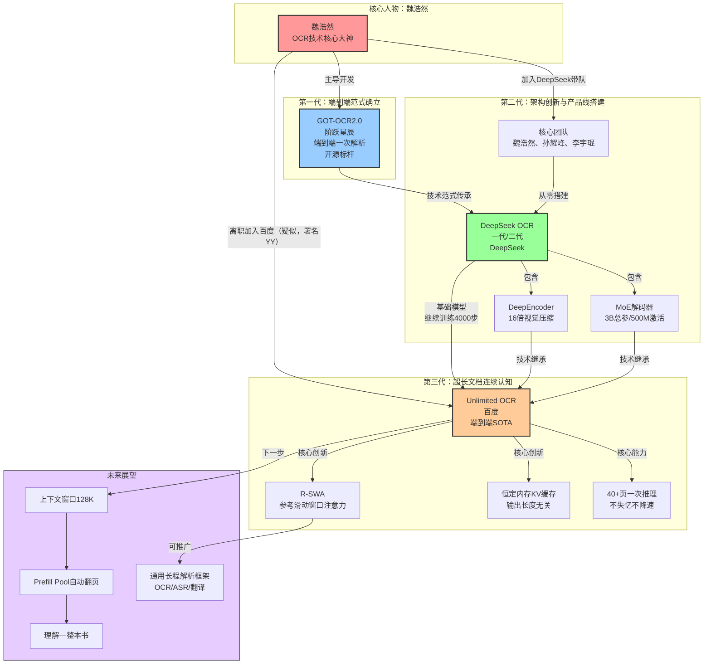

# OCR技术演进脉络分析

## 一、三代OCR技术概览

### 1.1 GOT-OCR2.0（阶跃星辰/魏浩然主导）

**定位**：端到端一次解析的开源标杆，端到端OCR最早跑通的开源项目。

GOT-OCR2.0是魏浩然在阶跃星辰时期主导开发的开源项目，它首次证明了端到端OCR范式的可行性，打破了传统OCR"检测+识别"两阶段流水线的束缚，为后续DeepSeek OCR和Unlimited OCR奠定了技术基础。

**核心贡献**：
- 确立端到端一次解析的技术范式
- 成为开源社区端到端OCR的标杆项目
- 验证了单模型统一处理多种文档类型的可能性

---

### 1.2 DeepSeek OCR（一代/二代，魏浩然团队在DeepSeek时期）

**定位**：从无到有搭建DeepSeek整条OCR技术线，引入视觉压缩和MoE架构。

魏浩然加入DeepSeek后，带领团队（核心成员：魏浩然、孙耀峰、李宇琨）从零开始构建了DeepSeek OCR一代和二代产品，在GOT-OCR2.0的端到端范式基础上进行了关键技术创新。

**核心创新**：

| 技术点 | 说明 |
|--------|------|
| **DeepEncoder视觉压缩技术** | 将一张1024×1024的PDF页面压缩到仅256个视觉token，压缩率高达16倍，大幅降低长文档处理的计算成本 |
| **MoE解码器架构** | 采用混合专家模型架构，总参数3B，实际激活仅500M，在保持性能的同时显著提升推理效率 |
| **完整OCR产品线** | 从无到有搭建DeepSeek整条OCR线，覆盖一代到二代的完整迭代 |

**性能表现**：在OmniDocBench v1.5上取得87.01%的综合得分。

---

### 1.3 Unlimited OCR（百度）

**定位**：超长文档连续认知的突破，解决"逐页失忆"问题，刷新端到端SOTA。

百度Unlimited OCR疑似由从DeepSeek离职的魏浩然（署名YY，技术总监）主导开发，基于DeepSeek OCR继续训练4000步，核心创新是R-SWA长程注意力机制，实现了40+页文档一次推理不失忆。

**核心创新**：

| 技术点 | 说明 |
|--------|------|
| **R-SWA参考滑动窗口注意力机制** | 核心创新：每生成一个token，都看全部"参考token"（整张图像的视觉token和提示词）保证原文全局可见，但在输出侧只回看前面128个token，模拟人类"软遗忘"认知模式 |
| **恒定内存KV缓存** | 将所有注意力层换成R-SWA后，KV缓存变成固定容量队列，每生成新token挤掉最老token，输出1万token和10万token内存占用完全相同 |
| **40+页文档一次推理** | 在标准32K上下文里一次前向推理转录数十页文档，20页编辑距离仅0.057，40页以上仍控制在0.11以下，Distinct-35高达97%几乎无复读 |
| **基于DeepSeek OCR继续训练** | 站在DeepSeek OCR的基础上仅继续训练4000步，投入不大但效果拔群 |

**性能表现**：
- OmniDocBench v1.5：93.23%（超越DeepSeek OCR 6.22个百分点）
- OmniDocBench v1.6：93.92%（端到端SOTA）
- 输出6144 token时TPS达7847，比DeepSeek OCR（5822）快35%
- 总参数3B，激活参数仅500M

---

## 二、三代技术对比表格

| 维度 | GOT-OCR2.0 | DeepSeek OCR | Unlimited OCR |
|------|------------|--------------|---------------|
| **研发机构** | 阶跃星辰 | DeepSeek | 百度 |
| **核心主导** | 魏浩然 | 魏浩然团队（魏浩然、孙耀峰、李宇琨） | 魏浩然（疑似，署名YY） |
| **技术范式** | 端到端一次解析 | 端到端+视觉压缩+MoE | 超长文档连续认知 |
| **编码器技术** | 基础视觉编码 | DeepEncoder（16倍压缩） | 继承DeepEncoder |
| **解码器架构** | 标准Transformer | MoE（3B总参/500M激活） | MoE（3B总参/500M激活） |
| **注意力机制** | 标准MHA | 标准MHA | R-SWA参考滑动窗口注意力 |
| **KV缓存特性** | 随序列增长膨胀 | 随序列增长膨胀 | 恒定内存（固定容量队列） |
| **长文档能力** | 单页/短文档 | 多页但速度随长度下降 | 40+页一次推理不失忆 |
| **上下文窗口** | 较小 | 标准32K | 标准32K（训练中128K） |
| **OmniDocBench v1.5** | - | 87.01% | 93.23% |
| **训练基础** | 从零训练 | 从零搭建 | 基于DeepSeek OCR训练4000步 |
| **核心贡献** | 端到端范式验证开源标杆 | DeepEncoder+MoE架构完整产品线 | R-SWA解决长程失忆恒定内存推理 |

---

## 三、技术传承关系

三代技术形成了清晰的技术传承链条，魏浩然是贯穿始终的核心人物：

```
GOT-OCR2.0（阶跃星辰）
    ↓ 魏浩然主导：确立端到端范式
    ↓
DeepSeek OCR（DeepSeek）
    ├─ 继承：端到端一次解析理念
    ├─ 创新1：DeepEncoder 16倍视觉压缩
    ├─ 创新2：MoE解码器架构（3B/500M）
    └─ 魏浩然带队从零搭建完整产品线
         ↓
         ↓ 魏浩然离职加入百度
         ↓
Unlimited OCR（百度）
    ├─ 继承1：端到端范式
    ├─ 继承2：DeepEncoder视觉压缩
    ├─ 继承3：MoE解码器（3B/500M）
    ├─ 创新：R-SWA参考滑动窗口注意力
    ├─ 创新：恒定内存KV缓存
    └─ 基于DeepSeek OCR仅训练4000步
```

**关键人物流转**：
- 魏浩然：阶跃星辰 → DeepSeek → 百度（疑似）
- 孙耀峰、李宇琨：DeepSeek OCR核心成员（DeepSeek时期）

---

## 四、范式演进路径分析

OCR技术经历了三次重大范式跃迁：

### 4.1 第一代：逐页处理（传统OCR）

**模式**：两阶段流水线 + 外部调度
- 先做文本检测（找到文字位置）
- 再做文字识别（识别文字内容）
- 长文档靠for循环逐页处理，处理完一页清空记忆
- 本质是工程权宜之计，靠外部调度器勉强拼接结果

**问题**：
- 页与页之间无上下文关联，"逐页失忆"
- 无法理解跨页的表格、公式、阅读顺序
- KV缓存随序列长度滚雪球式增长，内存吃不消
- 离真正的智能差距很大

---

### 4.2 第二代：端到端一次解析（GOT-OCR2.0/DeepSeek OCR）

**模式**：单模型端到端处理
- GOT-OCR2.0首次跑通端到端开源范式
- DeepSeek OCR引入DeepEncoder视觉压缩（16倍）和MoE架构
- 不需要"检测+识别"两阶段，模型直接从图像到文本

**进步**：
- 统一架构处理多种文档类型（文本、表格、公式、阅读顺序）
- 性能大幅超越传统OCR
- MoE架构实现小激活参数高性能

**局限**：
- 仍然受限于标准注意力机制的KV缓存膨胀问题
- 长文档处理时速度随解码步数稳步下降
- 无法真正实现几十页文档的连续认知

---

### 4.3 第三代：超长文档连续认知（Unlimited OCR）

**模式**：类人"软遗忘"连续认知
- R-SWA注意力机制模拟人类抄书的注意力模式
  - 参考侧：始终看见完整原文（全部视觉token+提示词）
  - 输出侧：只回看最近128个token（"该忘就忘"）
- KV缓存变为固定容量队列，内存占用恒定
- 40+页文档一次推理，不失忆、不降速、几乎无复读

**突破意义**：
- 从"逐页for循环"进化到"连续认知流"
- 第一次实现了OCR模型对长文档的真正理解
- R-SWA是通用解析机制，OCR只是第一站（可推广到ASR、翻译等）

---

## 五、技术路线图展望

根据Unlimited OCR论文展望，下一步技术演进方向：

### 5.1 上下文窗口扩展到128K
- 当前在标准32K上下文实现40+页一次推理
- 下一步将上下文窗口训练到128K
- 支持更长文档的连续处理

### 5.2 构建Prefill Pool实现自动翻页
- 构建prefill pool机制
- 让模型学会自动翻页
- 无需人工干预即可逐页连续处理

### 5.3 终极目标：理解一整本书
- 当128K窗口+自动翻页实现后
- OCR将不再是"识别一页文字"
- 而是能够理解一整本书的内容
- 实现真正的长文档理解与认知

### 5.4 通用长程解析框架
- R-SWA是通用解析机制，不仅适用于OCR
- 可推广到ASR（语音识别）、机器翻译等长程任务
- 百度有望掌握一套通用长程解析的技术框架

---

## 六、Mermaid流程图：三代技术演进与人物关系



```
[CMD-LOG] | level=INFO | cmd=mermaid | step=S4 | event=CODE_GENERATED | session=mer-20260709-ocr-tech-evolution | msg=Mermaid流程图代码已生成 | ctx={"nodes":18,"edges":18,"subgraphs":5}
```

---

## 七、总结

OCR技术在魏浩然团队的推动下，短短几年内完成了三次范式跃迁：

1. **GOT-OCR2.0**：打破传统两阶段流水线，证明端到端OCR可行，树立开源标杆
2. **DeepSeek OCR**：引入DeepEncoder和MoE架构，在保持高性能的同时实现极致效率，搭建完整产品线
3. **Unlimited OCR**：发明R-SWA注意力机制，解决长程失忆问题，实现40+页文档一次推理，刷新SOTA

三代技术的传承关系清晰可见：每一代都站在前一代的肩膀上，继承核心技术并进行关键创新。魏浩然作为贯穿始终的核心人物，从阶跃星辰到DeepSeek再到百度（疑似），持续推动OCR技术范式向前演进。

未来随着128K窗口和自动翻页技术的实现，OCR将从"识别文字"进化到"理解整本书"，而R-SWA作为通用长程解析机制，有望在ASR、翻译等更多领域带来突破。
