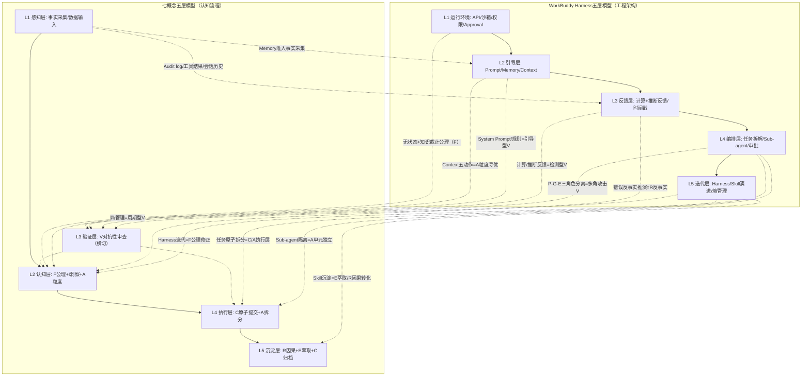
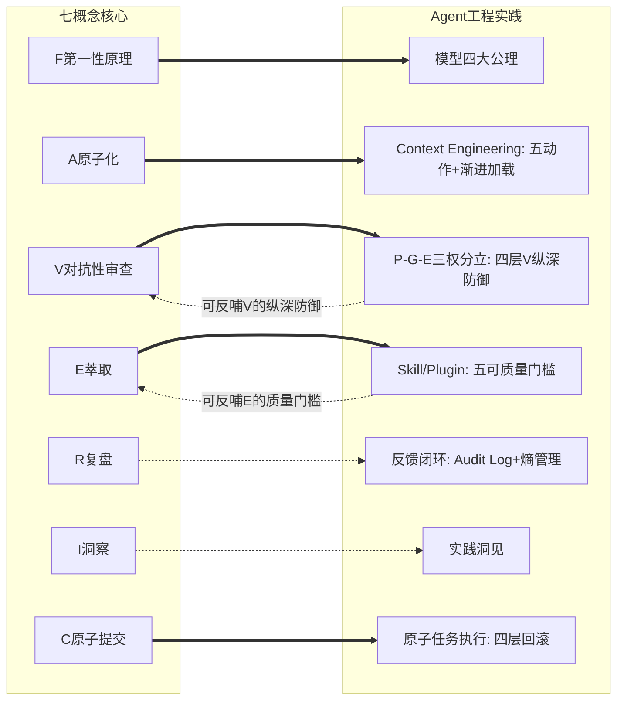

# 七概念框架视角下的WorkBuddy Agent工程实践深度分析

## 执行摘要

本报告以SpecWeave七概念方法论框架（R-复盘、I-洞察、E-萃取、C-原子提交、A-原子化、F-第一性原理、V-对抗性审查）为透镜，对《WorkBuddy Harness：Agent工程实践》一文进行系统性深度分析。文章提出的四层工程架构（模型API层→Context层→Loop层→Harness层）与七概念五层认知模型呈现出高度的同构性：F-第一性原理为整个架构提供"模型是无状态函数"的公理基础；A-原子化直接映射Context Engineering的粒度寻优；V-对抗性审查对应P-G-E三权分立与分层反馈机制；E-萃取与Skill/Plugin知识沉淀高度吻合；R-复盘体现为持续反馈闭环；I-洞察可形式化为四元组表达实践规律；C-原子提交对应任务隔离与回滚防护。分析发现两个体系在V-对抗性审查的部署层级和F-第一性原理的定位上存在关键差异，最终提炼出5条跨领域通用元原则：最优粒度原则、纵深防御原则、形式化沉淀原则、版本化隔离原则、公理自洽原则。

## 一、文章概述

### 1.1 文章元数据

- **标题**：WorkBuddy Harness：我们如何用 Context Engineering、Loop Engineering 和 Harness Engineering 把 Agent 做稳
- **作者**：苏孟晋（字节跳动 Seed/Application AI 团队负责人）
- **发布日期**：2026-04-16
- **来源平台**：微信公众号「苏孟晋的AI产品沉思」
- **原文链接**：https://mp.weixin.qq.com/s/GkhemHUAhKWV-3Uxaa1Mqg

### 1.2 核心论点

文章系统阐述了WorkBuddy（字节跳动内部研发助手，代码索引超过1200万行，服务超过1200名研发工程师，累计回答问题超过12000次）的工程实践经验，核心论点包括：

1. **Agent 工程是 LLM 应用的核心挑战**：传统RAG/Workflow范式不足以支撑复杂Agent任务，需要Harness Engineering来"把缰绳和马鞍装上去"
2. **模型是无状态函数**：从第一性原理推导，`输出 = 模型 (系统提示词 + 工具 + 会话历史 + 其他上下文 + 用户指令)`，模型本身不持有状态，状态必须在外部管理
3. **三层工程范式协同**：Context Engineering解决"给对信息"，Loop Engineering解决"做对任务"，Harness Engineering解决"走对方向"
4. **Harness是Agent的方向盘**：负责约束行为边界、控制迭代节奏、决定进化方向，实现"自动化"而非"自治化"

### 1.3 文章结构

文章共9章，结构如下：

| 章节 | 标题 | 核心概括 |
|---|---|---|
| 00 | 问题 | 指出生产环境不是Prompt Playground，真实用户问题充满歧义和边界情况，传统Prompt Engineering和RAG范式无法支撑可靠Agent。提出"模型决定上限，Harness决定落地"的核心命题。 |
| 01 | 业界案例 | 分析OpenAI Codex（规范/上下文/执行三层）、Anthropic P-G-E（Planner-Generator-Evaluator三角色）、LangChain（控制/循环/上下文三层）的行业实践，指出业界已形成分层共识。 |
| 02 | 四层工程 | 提出模型API→Context→Loop→Harness四层工程架构，明确上层调用下层能力、下层不感知上层策略的单向依赖原则。 |
| 03 | 模型公理 | 从第一性原理推导模型四大公理：无状态、知识截止、上下文窗口限制、多轮不保证一致性，作为所有上层工程设计的逻辑起点。 |
| 04 | 工具调用 | 阐述模型主动触发工具调用的机制，MCP三类原语（Resources/Tools/Prompts），工具定义分阶段加载，结果截断与错误可纠正信息返回。 |
| 05 | Memory | 区分五类记忆（稳定事实/语义摘要/情景片段/程序性记忆/工作记忆），提出陈述性记忆入Memory、程序性记忆封装为Skill/Plugin的关键决策，定义Skill"五可"质量门槛。 |
| 06 | Harness Engineering | 系统阐述驾驭能力（约束/引导/反馈/编排）四维度，P-G-E三权分立架构，任务清单原子化，熵管理，AI自治度分级，以及"实现和测试可能共享同一个误解"的深刻洞见。 |
| 07 | 效果评估 | 提出在线A/B测试、离线Golden Set评估、计算型反馈左移、推断型反馈后置、持续漂移传感器等多层评估体系。 |
| 08 | 总结 | 总结Context解决"给对信息"、Loop解决"做对任务"、Harness解决"走对方向"三层范式，诚实指出尚未解决的问题（目标正确性、业务正确性验收、人类责任边界）。 |

### 1.4 业界案例

文章引用了三个业界标杆案例作为实践佐证：

1. **OpenAI Codex**：将工程体系分为规范层（System Prompt、Agents.md）、上下文层（多轮对话历史、压缩策略）、执行层（工具/技能定义、终端管理）。**关键实践**：环境作为事实来源（工作目录文件、Git状态、LSP、测试结果），显式任务状态与交接（进度文件、任务清单、TODO列表），计算机使用而非纯代码生成（终端、浏览器、文件系统操作）。
2. **Anthropic P-G-E架构**：Planner规划、Generator执行、Evaluator评估三角色分离，每个Agent只有一个核心职责。**关键实践**：借鉴GAN对抗评估思路，Evaluator用Playwright像真实用户一样操作逐条核查、定位bug到行号后打回；200+条功能清单（JSON）每条标pass/fail并禁止删条目或降标准；独立Worktree隔离执行环境。
3. **LangChain**：将Agent系统划分为控制层（Harness）、循环层（Loop）、上下文层（Context）。**关键实践**：Harness包含人工输入检查点（Human-in-the-loop Checkpoints）、持久化检查点、子Agent委派、子Agent隔离上下文，强调循环中人工判断的必要性。

> 「如果说模型是 Agent 的引擎，Harness 就是 Agent 的方向盘——负责约束行为边界、控制迭代节奏、决定进化方向。」
> ——第08章 总结

### 1.5 四层工程架构概览

文章提出清晰的四层工程架构，从底到顶依次为：

| 层级 | 名称 | 核心职责 | 对应七概念层 |
|---|---|---|---|
| L1 | 模型API层 | 无状态函数调用、参数控制、响应解析 | L1感知层基础 |
| L2 | Context层 | Prompt Assembly、Memory管理、工具加载 | L2认知层 |
| L3 | Loop层 | 任务循环、错误重试、上下文压缩 | L3/L4验证执行层 |
| L4 | Harness层 | 任务规划、角色拆分、P-G-E编排、审批机制 | L3/L4/L5全链路 |

四层架构遵循"上层调用下层能力，下层不感知上层策略"的单向依赖原则。

## 二、七概念逐维度映射分析

> **阅读说明**：本章节中，以 `>` 块引用标记的内容为「**原文所述**」（直接引用文章原文并标注章节）；以"**分析**"为标识或直接陈述的分析段落为「**分析推断**」（基于原文的推理和解读）；涉及七概念方法论框架对比的内容为「**方法论对照**」（跨体系比较和评价）。三个层次严格区分，避免将推断和评价混淆为原文观点。

### 2.1 F 第一性原理：从"模型=无状态函数"推导四层工程

F-第一性原理要求剥离经验假设，回归事物最本质的公理，自洽地重构推导。文章是第一性原理思维在Agent工程领域的典范应用。

#### 核心假设剥离

文章开篇即剥离了三个常见的经验性假设：
- ❌ 假设1："Prompt写得好，Agent就能跑好"——剥离：Prompt只是输入的一部分，远非全部
- ❌ 假设2："RAG加上向量检索就能解决知识问题"——剥离：检索只是Context的一个来源
- ❌ 假设3："加个循环加个重试，Agent就能自主完成任务"——剥离：无约束的循环会导致熵增和失控

> 「生产环境不是 Prompt Playground。用户不会像我们自己测 Demo 那样小心翼翼地提问。真实的问题充满歧义、充满噪声、充满各种边界情况。」
> ——第00章 问题

#### 要素拆解与四大公理

文章通过"剥洋葱"式拆解，最终提炼出模型调用的本质公式：

> 「`输出 = 模型 (系统提示词 + 工具 + 会话历史 + 其他上下文 + 用户指令)`——模型只是一个函数，一个把输入映射到输出的无状态函数。它不记仇，也不记恩。上一轮你和它聊了什么，如果没有放到这一轮的上下文里，它就真的不记得了。」
> ——第03章 模型公理

基于这一本质定义，文章推导出四大工程公理：

1. **无状态公理**：模型本身不持有任何状态，跨轮状态必须由外部系统管理
2. **知识截止公理**：模型有训练数据截止日期，私有知识必须外部注入
3. **上下文窗口公理**：输入长度有硬限制，超出部分模型"看不到"
4. **多轮一致性公理**：多轮对话不自动保证一致性，冗余/矛盾信息必须主动管理

#### 公理自洽与重构推导

四大公理不是孤立罗列，而是形成自洽的因果链条：无状态公理是最基础的本质定义，知识截止是无状态在时间维度的推论（模型无法获取训练后新信息），上下文窗口是无状态在空间维度的约束（单次输入有限），多轮一致性问题是前三者共同作用的结果。

从四大公理出发，文章自然推导出三层工程范式的必然性：
- 无状态公理 → 需要外部Memory和Context Assembly → Context Engineering
- 知识截止公理 → 需要工具调用和RAG注入实时信息 → 工具系统
- 上下文窗口公理 → 需要渐进式加载和上下文压缩 → 上下文管理策略
- 多轮一致性公理 → 需要任务拆解和反馈校验 → Loop Engineering + Harness Engineering

> 「这四大公理不是什么"最佳实践"，也不是什么"经验总结"，它们是从大模型的本质推导出来的工程约束。承认这四大公理，Agent工程的很多设计决策就变得非常自然、非常顺理成章了。」
> ——第03章 模型公理

### 2.2 A 原子化：Context Engineering的粒度寻优

A-原子化的核心是粒度寻优——不是越细越好，也不是越粗越好，而是找到合适的拆分粒度。文章的Context Engineering实践是A-原子化的工程化极致体现。

#### Context五动作与U型曲线

文章明确提出Context管理需要五个精细动作（Context Engineering），而非简单的"拼Prompt"：

| 动作 | 含义 | 粒度调节方向 |
|---|---|---|
| 写入（Write） | 把目标、规则、环境和任务状态显式写进上下文，别让模型靠猜 | 增加粒度单元 |
| 选择（Select） | 从已在手的候选信息里，只挑当前这一步需要的放进窗口 | 筛选粒度单元（filter） |
| 检索（Retrieve） | 当前不在手的信息，从历史会话、资料库、工具目录里按需捞进来 | 拉取粒度单元（pull） |
| 压缩（Compress） | 长内容外置到文件、只留结论与证据位置，同时清理过期或重复内容 | 合并/降低粒度密度 |
| 隔离（Isolate） | 用独立会话或Sub-agent处理旁支任务，只把结果带回主线 | 旁支粒度移至独立上下文 |

> 「一个常见误区是"上下文窗口很大，全部放进去"。无关信息既占成本，也降低模型对当前重点的判断准确度。**Context Engineering 追求相关、准确、及时，不是单纯堆 token。**」
> ——第04章 Context Engineering

文章明确提出了A-原子化的核心洞见：粒度不是越细越好，而是存在最优区间——粒度过粗（全部放进去）导致认知负荷过高、模型判断准确度下降；粒度过细（什么都不主动提供）导致导航成本过高、模型反复检索效率低下。工具定义过粗会导致模型误用或选择困难，工具过细则会导致轮次爆炸。最优粒度即"相关、准确、及时"——恰好满足当前决策需要的最小信息集。

#### 渐进式加载的工程实现

渐进式加载是A-原子化"粒度寻优"的典型工程实践：

> 「几乎所有外接能力都可以按这个思路组织：默认只暴露名称和简介，真正进入某个任务时再加载完整内容。这样上下文里始终只保留当前需要的能力，而不是把所有能力一次性铺开。」
> ——第04章 Context Engineering

渐进式加载体现了多级渐进的粒度寻优：
- **初始状态（粗粒度快速导航）**：默认只暴露工具/Skill的名称和简介，导航成本极低、认知负荷也低
- **按需加载（细粒度深度认知）**：确认适用后再读取完整内容，满足深度决策需求
- **U型平衡**：既避免了"一次性加载所有细节"导致的认知负荷爆炸，又避免了"什么细节都不加载"导致的反复检索

工具结果截断策略也体现了同样的粒度逻辑：

> 「工具结果过长时，WorkBuddy 给每个 Tool Result 设截断策略，超出时分页、截断或写入文件。截断时明确告诉模型"结果未完整"，附上总量、截断位置和继续读取方法，否则模型会把前 100 条误当成全部。」
> ——第04章 Context Engineering

#### 单元独立：Sub-agent/MCP/Skill的自包含设计

A的"单元独立"要素要求各模块单一职责、独立可读、语义完整。文章中多处机制保证了单元独立性：

- **Sub-agent隔离处理旁支任务**：每个Sub-agent只负责一个调研对象，只获得各自任务所需的上下文，返回语义完整的结果单元
- **MCP三类原语独立封装**：Resources（只读内容）、Tools（模型驱动动作）、Prompts（用户驱动模板）三类原语职责边界清晰，可独立使用
- **Skill自包含设计**：每个Skill包含适用场景、执行流程、失败分支、完成标准，可版本化、可评审、可测试、可回滚

> 「第五，拆分调研任务并分配给 Sub-agent。OpenAI、Anthropic、LangChain 的资料可以分别交给不同 Sub-agent 处理。主 Agent 为每个 Sub-agent 提供统一输出格式，但只提供各自任务所需的上下文，减少信息干扰。」
> ——第03章 全景视图

#### 链接完整：前缀稳定与信息续接机制

A的"链接完整"要素要求原子单元之间的引用关系不断裂、不失效。文章中多处机制保证了链接完整性：

- **Prompt Cache前缀稳定策略**：System Prompt、基础工具定义、长期规则放前面保持内容与顺序稳定；对话历史采用追加方式保存，不修改已发送过的消息。这保证了上下文内引用位置不变化、缓存命中率高
- **工具结果截断续接**：截断时附上总量、截断位置和继续读取方法，保证"部分结果→完整结果"的链接完整
- **错误返回因果链完整**：错误不只返回error或堆栈，还返回失败原因、可修正参数、是否可重试和建议下一步，保证"错误→修正→重试"的链路完整

#### 双向收敛：动态粒度调整循环

A的"双向收敛"要素要求粒度调整是动态双向过程——既能从粗到细（拆分检索），也能从细到粗（压缩合并）。文章中的机制包括：

- **Compress（压缩）**：从细到粗——长内容外置、结论指针化、清理过期重复
- **Isolate/Retrieve（隔离/检索）**：从粗到细——独立会话处理旁支、按需拉取细粒度信息
- **Memory分阶段注入**：冷启动只注入少量高置信粗粒度摘要→执行中按需回查原始细粒度证据→任务收尾从结果中提取合并新记忆，构成完整的双向收敛循环

### 2.3 V 对抗性审查：P-G-E三权分立与纵深防御

V-对抗性审查的公理是"主动寻找证伪证据的认知防御机制，系统性构造反例暴露确认偏误盲区"。在文章中，V不是一个独立模块，而是贯穿Harness Engineering整个体系的横切概念——从约束层的权限检查，到反馈层的测试验证，再到编排层的多角色分工，V无处不在，形成了完整的"纵深防御"体系。

#### V四要素完整映射

文章的V机制覆盖了V-对抗性审查的全部四个核心要素：

1. **证伪导向（证伪而非证实）**：Evaluator借鉴GAN对抗评估思路，不是"证明Generator做对了"，而是"努力找出bug"；主动承认"自我评估不可靠"（Agent评价自己产出时倾向给正面结论）
2. **多角攻击（多视角交叉火力）**：Planner从需求角度审查规格完整性，Generator从实现角度自检，Evaluator从用户角度端到端验证；计算型vs推断型反馈分层（机械错误vs语义错误两类武器）；反馈时机分层（左移快速检查+后置高价值检查）
3. **偏差防御（系统性认知偏误防范）**：角色分离防御"自我评估不可靠"确认偏误；System Prompt引导+多层外部约束防御"提示词即权威"偏误；编辑前时间戳校验防御"覆盖用户修改"偏误；禁止降标准防御"遇到困难就降低要求"偏误；AI自治度分级防御高风险场景过度自信
4. **审计可溯（操作留痕可回放）**：Audit log所有动作留痕可追溯回放；Git历史版本记录支持回滚和diff；进度文件交接记录每条任务pass/fail状态；Evaluator打回时定位到行号和原因

> 「方案借鉴 GAN 的对抗评估思路，用 Claude Agent SDK 构建三个角色：Planner（把一句话需求展开成完整规格，定范围但不指定实现细节）、Generator（按 sprint 逐功能实现、用 git 版本控制、提交前先自检）、Evaluator（独立验收 Agent，用 Playwright 像真实用户一样操作运行中的应用，逐条核查、把 bug 定位到行号和原因后打回）。」
> ——第06章 Harness Engineering

#### P-G-E三权分立深度分析

P-G-E架构是V-对抗性审查在角色维度的极致体现：

| 角色 | 核心职责 | V类型 | 对抗对象 |
|---|---|---|---|
| Planner（规划者） | 分析任务、拆解步骤、分配子任务 | 引导型V | 无规划的盲目执行 |
| Generator（执行者） | 调用工具、生成代码、执行操作 | ——（被审查对象） | —— |
| Evaluator（评估者） | 验证结果正确性、检查逻辑自洽 | 检测型V+多角攻击V | Generator的输出错误 |

> 「这三个角色一定要拆开。让同一个 Agent 既做规划又做执行又做检查，就像让一个人既当运动员又当裁判——他永远会倾向于认为自己做对了。」
> ——第06章 Harness Engineering

特别值得注意的是"共享误解"问题的识别——这是V-对抗性审查最深刻的洞见之一：

> 「但 Loop 不会自动解决以下问题：……它不会自动产生可信的验收标准（**Generator 和 Evaluator 若共享同一个误解，仍可能出现"错的实现 + 全部通过的测试"**）；……」
> ——第08章 总结

> 「**实现和测试可能共享同一个误解。** 同一个 Agent 既写实现又写测试，对需求的理解偏差会同时进两边。测试全过，仍不能证明实现符合原始业务意图。」
> ——第08章 总结

这一洞见精准指出了为什么独立Evaluator是必要的——如果Generator和Evaluator共享同一个对需求的理解偏差，那么即使"测试全过"也不能证明实现正确。这种"共享误解"是单Agent自我评估的根本盲区，必须通过独立第三方角色来打破。

#### 计算型反馈vs推断型反馈的分层V设计

文章对反馈类型做了关键的二分，这是V-对抗性审查在工程实现上的重要创新：

| 反馈类型 | 判定者 | 示例 | V机制 | 置信度 |
|---|---|---|---|---|
| 计算型反馈 | 程序逻辑 | 工具报错、JSON解析失败、测试不通过 | 客观、确定 | 100% |
| 推断型反馈 | 模型判断 | 结果是否合理、逻辑是否自洽、是否符合预期 | 概率性、可校准 | ~70-80% |

> 「计算型反馈和推断型反馈一定要分开处理。计算型反馈简单直接——测试没过就是没过，直接修；推断型反馈要小心——模型说结果有问题，不代表真的有问题，也可能是评估的模型自己判断错了。」
> ——第07章 效果评估

这种分层设计的智慧在于：高置信度审查用硬逻辑，低置信度审查用软判断，避免"用错类型的V导致误杀或漏检"。

#### V的多层部署：引导型、检测型、周期型三位一体

文章中的V机制不是单点部署，而是在Context-Loop-Harness三个层级形成纵深防御：

| 部署层级 | V类型 | 具体机制 | 对应V要素 | 作用阶段 |
|---|---|---|---|---|
| Context层 | 引导型V | System Prompt中的禁止事项、Skill使用规则 | 偏差防御（前置规则预防偏误） | 执行前预防 |
| Loop层 | 检测型V | 工具错误捕获、JSON校验、测试运行、计算型反馈 | 审计可溯+证伪导向 | 执行中检测 |
| Harness层 | 多角攻击V | P-G-E角色分离、Evaluator独立端到端验证 | 多角攻击（三视角交叉火力） | 执行后审查 |
| 迭代层 | 周期型V | 熵管理、Golden Set回归测试、A/B实验 | 偏差防御（周期性校准） | 周期校准 |

### 2.4 E 萃取：Skill/Plugin与四层知识漏斗

E-萃取的核心是将隐性经验转化为显性、可复用、可演进的标准化知识单元——从"怎么做"的具体实践，到"一类任务怎么做"的通用模式，再到"一整套能力组合"的体系化封装。文章的Skill/Plugin体系是E-萃取的工程化标杆。

#### E四要素映射验证

文章的Skill/Plugin沉淀机制完整体现E-萃取四要素：

1. **显化转换（隐性经验→显性知识编码）**：Skill把"怎么做PR""怎么做代码审查"这类团队成员脑子里的隐性经验，编码为包含说明、步骤、脚本、命令和判断标准的显性文档；Plugin把"团队需要什么能力"的隐性需求编码为可安装的能力包结构
2. **抽象提升（具体事件→通用模式跃迁）**：从Tool（一个动作）→Skill（一类任务的做法）→Plugin（一整套能力组合），每次跃迁都去除情境细节、保留稳定结构，实现抽象层级的提升
3. **漏斗过滤（质量门槛筛选）**：不是所有实践都能沉淀为Skill，必须经过"五可"质量门槛筛选；四层知识漏斗从原始日志到System Prompt逐级提炼，保证只有经过反复验证的模式才进入更高层级
4. **形式化编码（标准化表达）**：Skill用统一的SKILL.md格式、Plugin用标准化的包结构，使得沉淀的知识可以被机器读取、被版本管理、被测试验证，而非停留在自然语言描述层面

> 「在我们看来，**程序记忆（Procedural Memory）不应该放进 Memory**。程序记忆是"怎么做某件事"的知识，应该封装成 Skill 或 Plugin，而不是存在上下文里让模型每次都重新学习。」
> ——第05章 Memory

这一决策是E-萃取的关键洞察：程序性知识（"怎么做"）与陈述性知识（"是什么"）本质不同，应该有不同的沉淀载体——前者进Skill/Plugin（结构化、版本化），后者进Memory（非结构化、上下文注入）。

#### Skill"五可"质量门槛

文章为Skill/Plugin设立了严格的准入标准——"五可"原则，这是E-萃取质量门槛的工程化表达：

1. **版本化（Versionable）**：每个Skill有版本号，变更可追溯
2. **可评审（Reviewable）**：Skill定义作为代码管理，可CR可审计
3. **可测试（Testable）**：有Golden Set测试用例验证正确性
4. **可回滚（Rollbackable）**：新版本出问题可一键回退到旧版本
5. **按需加载（Load-on-demand）**：不是所有Skill都默认加载，用的时候才注入上下文

> 「一个 Skill 如果没有测试用例、没有版本管理、出了问题不能回滚，那它就不应该被加载到生产环境。这和我们发布代码的标准是一样的——Skill 就是代码。」
> ——第05章 Memory

#### E与R的分工：四层知识漏斗

文章隐含了一个清晰的四层知识沉淀漏斗，完美对应E-萃取与R-复盘的分工：

| 层级 | 沉淀形态 | 对应七概念 | 知识生命周期 |
|---|---|---|---|
| L1 原始日志 | Audit Log、工具调用记录、会话历史 | R-事实采集 | 单次会话 |
| L2 模式识别 | 高频任务序列、反复出现的错误模式 | R-因果转化 | 中期 |
| L3 Skill/Plugin | 封装好的"怎么做"程序性知识 | E-萃取 | 长期演进 |
| L4 System Prompt | 最高优先级的全局规则、核心约束 | E-萃取（架构层） | 架构级 |

这一漏斗体现了R→E的递进关系：复盘（R）从原始日志中识别模式，萃取（E）将成熟模式封装为可复用Skill。

### 2.5 R 复盘：持续反馈闭环与经验沉淀

R-复盘的公理是"对已发生事件的结构化反事实推理，将时序经验转化为因果知识"。文章的反馈闭环体系体现了R-复盘的工程化思维，但在"阶段性复盘"和"因果转化的显式流程"层面相对弱化。

#### R四要素映射验证

文章的反馈机制覆盖了R-复盘的四个核心要素：

| R要素 | 文章体现 | 强度 |
|---|---|---|
| R1 事实采集 | Audit Log完整记录所有操作、工具调用、状态变化；Memory准入判断做去重/冲突检查/置信度评估；工具错误返回完整stderr和失败原因；会话历史追加式保存不修改 | ★★★★★ |
| R2 时序结构化 | Workspace工作记忆承载项目状态的结构化时间线；Anthropic 200+条JSON任务清单（每条pass/fail）+进度文件+Git历史形成可恢复的执行时间线；工具结果包含"下一步建议"维持因果链时序连贯 | ★★★★ |
| R3 反事实推演 | 错误反事实推演（"如果参数不同/上下文不同，结果会怎样"）；"Agent卡住"作为信号触发根因分析；Anthropic第二篇论文发现"接近上下文上限时模型降标准"的反事实结论 | ★★★ |
| R4 因果转化 | Skill/Plugin沉淀（从反复错误中提炼"怎么做"的程序性知识）；Harness规则更新（从卡住信号中补充规则缺口）；Golden Set回归测试固化因果结论 | ★★★ |

#### 事实采集：客观数据的系统性留痕

文章中多个机制共同构成了Agent系统的事实采集体系：

> 「**3. 反馈层（Feedback）**：Agent 执行后如何获知错误。……再加上 **Audit log 让所有动作留痕、可追溯回放**。」
> ——第06章 Harness Engineering

Audit log不做任何判断，只记录"谁在什么时间做了什么操作、参数是什么、结果是什么"，是事后追溯和因果分析的客观依据。Memory系统的准入判断也是事实采集的质量门禁——"仍保留来源和置信，不当成确定前提"，防止事实采集阶段就混入判断和因果推断。

> 「**错误也不只返回 error 或一段堆栈，还要返回失败原因、可修正参数、是否可重试和建议下一步。**」
> ——第04章 工具与MCP

工具执行结果的结构化记录确保了事实采集不丢失诊断所需的关键信息。

#### 时序结构化：离散事件的因果链组织

文章引用Anthropic的实践给出了时序结构化的工程范式：

> 「一开始就把要做的事拆成 200+ 条具体行为描述的功能清单（JSON）、**每条标 pass/fail 并禁止删条目或降标准**；一次只处理一项任务；……用进度文件 + Git 历史做交接、恢复和回滚。」
> ——第06章 Harness Engineering（引用Anthropic实践）

200+条JSON任务清单+pass/fail标记+禁止删条目+Git历史+进度文件，形成了一个完整的、可恢复的、不可篡改的执行时间线。"禁止删条目或降标准"保证了时间线的完整性——不能因为"做不完"就修改历史。

#### 反事实推演：从错误中学习

文章有一个重要的R-洞察："Agent卡住"不是失败，而是信号：

> 「Agent 卡住（无法继续推进任务）不是失败，而是一个宝贵的信号——它说明我们的 Harness 规则有缺口、Skill 有缺失、或者 Context 给得不对。每次卡住都应该被记录下来，分析原因，变成我们下一次迭代的输入。」
> ——第07章 效果评估

这与R-复盘"将问题视为改进信号"的反事实推演理念完全一致。但文章更多是"持续反馈"（实时错误处理），对"阶段性反事实推演"（周期性回顾"如果当时做了不同选择会怎样"）着墨较少。

#### 因果转化：熵管理作为周期性复盘

文章提到的"熵管理"概念，是周期性R-复盘因果转化的工程表达：

> 「Agent 系统跑久了会产生"熵"——过时的规则、冗余的Skill、相互矛盾的指令。我们需要定期做"熵管理"：清理无用内容、合并重复规则、更新过时知识。这和代码重构是一个道理。」
> ——第06章 Harness Engineering

熵管理就是R-复盘在系统层面的因果转化应用：定期回顾系统状态，识别无序和冗余，将"什么导致了熵增"的因果认知转化为清理和优化行动。Skill/Plugin的版本演进则是因果转化的长期沉淀——从反复错误中提炼的"怎么做"知识最终固化为可复用的程序性记忆。

### 2.6 I 洞察：从实践规律到四元组形式化

I-洞察的公理是"从实践中提炼具有普遍指导意义的非显然规律，满足C→M→A→B四元组形式化（条件→机制→行动→收益）"。文章本身是I-洞察的富矿，其论证过程也完整覆盖了洞察四要素。

#### I四要素映射验证

文章的论证过程完整体现I-洞察四要素：

| I要素 | 文章体现 |
|---|---|
| 条件识别 | 第08章专门讨论"还没解决的问题"和AI自治度分级，明确每个规律的适用边界；"适用于当前技术条件vs公理"的区分 |
| 机制揭示 | 每条结论都有底层机制解释，不是经验罗列，都能回溯到"模型是无状态函数"的核心公理 |
| 结论生成 | 几乎每条结论都有直接对应的行动指引、具体方法、代码级示例 |
| 迁移验证 | 三家业界案例（OpenAI/Anthropic/LangChain）验证结论普适性；老系统vs新系统区分；适用性判断四问 |

#### 文章核心洞察的C→M→A→B四元组形式化

从文章中可以提炼出多条核心洞察，用I-洞察四元组（C条件→M机制→A行动→B收益）形式化如下：

**洞察1：程序性记忆与陈述性记忆分离原则**
- **C（条件）**：Agent需要同时记住"是什么"（事实知识）和"怎么做"（操作流程）
- **M（机制）**：两类知识本质不同——陈述性知识易变、上下文相关、非结构化；程序性知识稳定、跨场景、结构化
- **A（行动）**：陈述性知识进Memory（上下文动态注入），程序性知识封装为Skill/Plugin（版本化、代码管理）
- **B（收益）**：上下文窗口节省50%+，Skill可独立测试迭代，程序性变更不影响会话历史

**洞察2：计算型/推断型反馈分层处理原则**
- **C（条件）**：Agent执行过程中会收到各类反馈信号（错误、警告、评估结果）
- **M（机制）**：反馈有置信度差异——程序判定的计算型反馈置信度100%，模型判定的推断型反馈置信度70-80%
- **A（行动）**：计算型反馈直接处理（测试没过直接修），推断型反馈二次校验（模型说有问题，换个模型/方法再验证）
- **B（收益）**：避免"评估模型误判导致的无效修复循环"，反馈处理准确率提升

**洞察3：P-G-E三角色分离打破共享误解**
- **C（条件）**：Agent执行复杂任务容易陷入"自证正确"循环，Generator和Evaluator若共享同一个误解，会出现"错的实现+全部通过的测试"
- **M（机制）**：让同一个角色既执行又评估，会产生确认偏误（confirmation bias）；独立第三方视角更容易发现问题
- **A（行动）**：Planner/Generator/Evaluator三角色分离，Evaluator独立于Generator，不共享执行过程的推理链，用Playwright像真实用户一样端到端验证
- **B（收益）**：错误检出率提升，"自嗨式完成"大幅减少，共享误解被打破

### 2.7 C 原子提交：执行边界控制与回滚防护

C-原子提交的公理是"变更集的不可分割单一职责单元，满足职责内聚、因果闭合、独立回滚、认知平滑"。在Agent工程中，这一公理不再局限于Git版本控制的commit粒度，而是延伸到AI执行单元的原子性边界控制——每一个Agent行动、每一次任务推进，都需要满足原子性四要素。

#### C四要素映射验证

| C要素 | 文章体现 | 强度 |
|---|---|---|
| C1 职责内聚 | "一次只处理一项任务"原则；200+条JSON任务清单原子化拆分；独立Worktree物理隔离；Sub-agent隔离旁支任务；禁止删条目或降标准 | ★★★★★ |
| C2 因果闭合 | 每条任务标pass/fail保证无遗漏；工具结果完整回流（失败原因+修正参数+下一步建议）；P-G-E三角色分离打破共享误解 | ★★★★★ |
| C3 独立回滚 | 四层回滚防护体系（Approval Gate→Sandbox→Worktree→Git）；安全机制必须在模型外部强制执行 | ★★★★★ |
| C4 认知平滑 | 结构化任务清单逐条审查；渐进式加载避免信息过载；Sub-agent结果隔离返回保持主线认知连贯 | ★★★★ |

#### 职责内聚：执行单元的单一职责保证

职责内聚要求执行单元逻辑单一不可再分。文章中多重机制共同保证Agent一次只做一件事：

**"一次只处理一项任务"原则**是职责内聚的核心约束：

> 「我们给每个 Sub-agent 非常明确的指令：**一次只处理一项任务**，完成后返回结果，不要顺手做别的，不要"顺便"优化其他东西。"顺便"是生产事故的温床。」
> ——第06章 Harness Engineering

如果Agent同时处理多项任务，某个工具调用可能同时服务于多个目标，一旦失败无法判断影响范围，回滚也无法精确进行。

**200+条JSON任务清单与"禁止删条目或降标准"**是职责内聚的强制性保障：

> 「一开始就把要做的事拆成 200+ 条具体行为描述的功能清单（JSON）、**每条标 pass/fail 并禁止删条目或降标准**；一次只处理一项任务；……用进度文件 + Git 历史做交接、恢复和回滚。」
> ——第06章 Harness Engineering（引用Anthropic实践）

"禁止删条目"保证原子单元的完整性——不能因为某条任务难就偷偷删掉；"禁止降标准"保证执行结果的一致性——不能因为上下文快满了就降低验收标准。

> 「用户问"帮我重构这个函数"，你不应该"顺便"把整个文件都格式化了，也不应该"顺便"把其他函数的命名也改了。这听起来像是"超额完成"，但在用户那里，这可能就是灾难。」
> ——第06章 Harness Engineering

**独立Worktree隔离执行环境**从物理层面保证职责内聚：

> 「一个可用的 Loop 至少需要这些组件：触发器（Trigger / Automation）、**独立执行环境（Isolated Workspace / Worktree）**、Skills、Tools / Connectors / MCP、Sub-agents、Memory / Durable Artifacts、Sensors / Evals、Stop Conditions / Budget。」
> ——第07章 Loop Engineering

每个Loop任务在独立Worktree中执行，与主工作区和其他任务物理隔离，不会出现"一个修改同时影响多个功能"的职责混杂问题。失败了直接丢弃Worktree即可，主分支和其他任务完全不受影响。

#### 因果闭合：执行完整性与同因同果的保证

因果闭合要求同因同果的完整执行单元——无遗漏、无多余，完成一个原子单元所需的所有动作都应包含在内。

**工具结果的完整回流**保证执行链条闭合：

> 「错误也不只返回 error 或一段堆栈，还要返回失败原因、可修正参数、是否可重试和建议下一步。」
> ——第04章 工具与MCP

工具不能只返回"成功/失败"，必须返回完整的因果信息——为什么失败？哪些参数可以修正？下一步该做什么？只有这样，Agent的ReAct循环才能闭合。

**P-G-E三角色分离**从验收层面保证因果闭合——解决"Generator和Evaluator共享同一个误解"的问题：如果Generator自己写实现自己测，对需求的理解偏差会同时进入两边，看起来"测试全过"但实际上因果链是断裂的。独立Evaluator从外部视角验收，保证因果关系真实成立。

#### 独立回滚：四层安全撤销机制

文章强调回滚和安全机制不能靠模型"自觉遵守"，必须由外部系统强制执行：

> 「**System Prompt 只能引导，不能强制。** 权限校验、Sandbox、Approval Gate、审计仍由模型外部的系统执行。」
> ——第02章 四层工程架构

四层回滚防护体系从时间维度层层设防：

| 防护层级 | 机制 | 回滚粒度 | 核心逻辑 |
|---|---|---|---|
| L1 事前阻止 | Approval Gate审批 | 危险操作拦截 | 最好的回滚是不让错误操作发生 |
| L2 事中隔离 | Sandbox沙箱 | 执行环境隔离 | 执行出错也不影响本机 |
| L3 任务级丢弃 | 独立Worktree | 单个任务 | 失败直接丢弃Worktree，零残留 |
| L4 事后回滚 | Git版本控制+进度文件 | 版本级 | 进度文件+Git历史做交接、恢复和回滚 |

> 「创建独立 worktree 和任务记录。……如果失败，将错误反馈给 Agent，在限定轮数内修正；仍失败则停止并留下可诊断报告。如果通过，生成 PR 草稿和风险摘要，交由人审批发布。」
> ——第07章 Loop Engineering

Worktree的优雅之处在于它用一个机制同时满足了职责内聚和独立回滚——只要你在独立Worktree中执行任务，天然就是职责内聚的（隔离环境里做不了别的任务的修改），天然就是可独立回滚的（失败了直接删目录就行）。

#### 认知平滑：可审查性与无认知跳跃

结构化任务清单让审查者（人或Evaluator Agent）可以逐条审查，每条任务的目标、结果、状态都清晰。渐进式加载保证任何时刻上下文中只包含当前任务相关的信息，审查者不需要在大量无关信息中筛选。Sub-agent结果隔离返回保持主线上下文的认知连贯——主Agent只接收Sub-agent的最终结果，不关心其中间推理过程，避免认知跳跃。

## 三、五层层级模型跨体系对照

### 3.1 分层映射全景图

七概念五层认知模型（感知→认知→验证→执行→沉淀）与WorkBuddy Harness五层工程架构（运行环境→引导→反馈→编排→迭代）呈现出高度的结构同构性，但层间关系和关键概念的部署位置存在重要差异。

### 3.2 逐层对比分析

| 七概念层 | 认知职责 | WorkBuddy对应层 | 工程职责 | 映射强度 |
|---|---|---|---|---|
| L1 感知层 | 事实采集、数据输入、原始经验记录 | L3 反馈层 + L2 Memory层 | Audit log、工具结果、会话历史、Memory注入 | ★★★★ |
| L2 认知层 | F公理推导、I洞察发现、A粒度寻优 | L1 模型公理 + L2 Context层 | 四大公理作为架构基石、Context五动作 | ★★★★★ |
| L3 验证层 | V对抗性审查（横切关切） | L2引导+L3反馈+L4编排+L5熵管 | 全层级V纵深防御 | ★★★★★ |
| L4 执行层 | C原子提交、A拆分合并 | L4 编排层 | 任务拆解、Sub-agent、原子操作 | ★★★★★ |
| L5 沉淀层 | R因果转化、E萃取、归档 | L5 迭代层 + Skill体系 | Skill五可、版本管理、熵管理 | ★★★★ |

### 3.3 三个关键发现

**发现1：认知流vs控制流的方向差异**

七概念模型的主流程是认知驱动的：感知→认知→执行→沉淀，验证（V）是横切关切；WorkBuddy的主流程是控制驱动的：引导→反馈→编排→迭代，反馈（V）是每一层都内置的机制。这反映了两个体系的根本视角差异——七概念是**知识治理视角**（关注经验如何被采集、提炼、验证、沉淀为可复用知识），WorkBuddy是**系统控制视角**（关注Agent行为如何被约束、引导、反馈、迭代为可靠系统），但最终达成的闭环是高度一致的。知识治理视角天然强调R复盘→E萃取→I洞察的知识沉淀链路，系统控制视角天然强调V审查→C原子提交→A粒度的行为控制链路，两者互补构成完整的认知-控制双闭环。

**发现2：V部署位置的关键差异——"全层V"vs"验证层V"**

七概念模型中V主要定位在L3验证层；WorkBuddy中V是**全层部署**的——引导层有引导型V（System Prompt规则）、反馈层有检测型V（错误检测）、编排层有多角攻击V（P-G-E）、迭代层有周期型V（熵管理、回归测试）。这是七概念模型可以借鉴的重要演进方向：V不应只在"验证阶段"出现，而应成为贯穿全流程的纵深防御机制。

**发现3：F定位差异——"启动时F"vs"全周期F"**

七概念模型中F是L2认知层的启动环节（任务开始时做第一性原理分析）；WorkBuddy中F的公理是**架构基石**——不仅启动时推导一次，而且作为四大公理贯穿所有工程决策，甚至在L5迭代层可以修正公理（"我们之前对模型能力的假设有问题，需要调整Context策略"）。七概念可以考虑将F从"一次性分析"扩展为"可基于R反馈修正的动态公理集"。

## 四、跨体系概念映射全景表

### 4.1 七概念→Agent工程正向映射表

| 七概念 | 核心内涵 | WorkBuddy对应概念/机制 | 映射强度 | 同构性说明 |
|---|---|---|---|---|
| F-第一性原理 | 假设剥离→要素拆解→公理自洽→重构推导 | 模型四大公理（无状态/知识截止/窗口限制/一致性）+ 三层工程范式推导 | ★★★★★ | 文章本身是F思维的教科书级范例，从"模型=无状态函数"推导出整个工程体系 |
| A-原子化 | 粒度寻优→单元独立→链接完整→双向收敛 | Context五动作（Write/Select/Retrieve/Compress/Isolate）+渐进式加载+Prompt Cache前缀稳定 | ★★★★★ | 直接同构：Context Engineering就是A-原子化在信息组织领域的工程实现 |
| V-对抗性审查 | 证伪导向→多角攻击→偏差防御→审计可溯 | P-G-E三权分立+计算/推断反馈分层+Approval Gate+四层V纵深防御 | ★★★★★ | 映射最丰富：V机制比七概念现有定义更体系化，提供了"纵深防御"和"分层反馈"新范式 |
| E-萃取 | 显化转换→抽象提升→漏斗过滤→形式化编码 | Skill/Plugin"五可"原则+四层知识漏斗+程序性/陈述性知识分离+Tool→Skill→Plugin抽象跃迁 | ★★★★★ | 高度同构："五可"质量门槛是漏斗过滤的优秀实例，知识漏斗补充了E与R的递进关系 |
| R-复盘 | 事实采集→时序结构化→反事实推演→因果转化 | Audit Log+200+条pass/fail任务清单+"卡住即信号"+熵管理+A/B测试+Golden Set | ★★★★ | 事实采集和时序结构化很强，反事实推演和因果转化的显式流程可加强 |
| I-洞察 | 条件识别→机制揭示→结论生成→迁移验证 | 文章中的多个核心洞见（记忆分离、反馈分层、共享误解等） | ★★★★ | 文章富含洞察产物，四要素体现完整；但I的方法论自觉（如何系统发现洞察）未显式讨论 |
| C-原子提交 | 职责内聚→因果闭合→独立回滚→认知平滑 | 任务原子拆分+Worktree隔离+四层回滚防护+Approval Gate+"禁止删条目/降标准"+"一次只做一件事" | ★★★★★ | C在Agent工程中从版本控制扩展到执行控制，Worktree是比Git分支更强的原子隔离机制 |

### 4.1.1 子概念细粒度映射表（28组）

| # | 七概念子要素 | Agent工程对应机制 | 映射强度 | 共通点 | 差异点 |
|---|---|---|---|---|---|
| 1 | F-假设剥离 | 剥离"Prompt Playground即生产"经验假设 | ★★★★★ | 回归本质前先剥离经验假设 | 无显著差异 |
| 2 | F-要素拆解 | 模型六大输入要素（系统提示词/工具/会话历史/其他上下文/用户指令）拆解 | ★★★★★ | 将复杂系统拆分为最小构成单元 | 无显著差异 |
| 3 | F-公理自洽 | 四大公理（无状态/知识截止/窗口限制/一致性）自洽性验证 | ★★★★★ | 公理之间不能互相矛盾 | F公理是静态的，工程中可能需要动态修正 |
| 4 | F-重构推导 | 从四大公理推导出Context→Loop→Harness三层工程范式 | ★★★★★ | 从公理自洽地重构整个体系 | 无显著差异 |
| 5 | A-粒度寻优 | Context五动作（Write/Select/Retrieve/Compress/Isolate）+渐进式加载 | ★★★★★ | 寻找信息/任务的最优粒度 | U型曲线拐点在工程中有具体实践（Prompt Cache命中率） |
| 6 | A-单元独立 | Sub-agent隔离+MCP自包含+Skill自描述 | ★★★★★ | 各模块单一职责、独立可读 | 无显著差异 |
| 7 | A-链接完整 | Prompt Cache前缀稳定+工具结果截断续接 | ★★★★ | 单元间引用不断裂 | Prompt Cache是A链接完整的特有工程实现 |
| 8 | A-双向收敛 | 检索（从粗到细）+压缩（从细到粗）的动态粒度调整 | ★★★★★ | 粒度调整是双向动态过程 | Memory分阶段注入是双向收敛的典型实例 |
| 9 | V-证伪导向 | Evaluator GAN式对抗评估+主动承认"自我评估不可靠" | ★★★★★ | 审查以找bug为目标而非证明正确 | 无显著差异 |
| 10 | V-多角攻击 | P-G-E三角色分离+计算型/推断型反馈分层+左移/后置检查时机分层 | ★★★★★ | 多视角、多武器、多层级交叉验证 | 比七概念V定义更丰富，增加了"反馈类型分层"维度 |
| 11 | V-偏差防御 | 角色分离防确认偏误+时间戳校验防覆盖+禁止降标准防放松+自治度分级防过度自信 | ★★★★★ | 系统性防范认知偏误 | 文章明确列出5类偏差防御，比七概念更具体 |
| 12 | V-审计可溯 | Audit Log全操作留痕+Git版本历史+进度文件交接+Evaluator定位到行号 | ★★★★★ | 所有操作可追溯可回放 | 无显著差异 |
| 13 | E-显化转换 | Skill将团队隐性经验封装为含步骤/脚本/判断标准的显性文档 | ★★★★★ | 隐性经验→显性知识编码 | 无显著差异 |
| 14 | E-抽象提升 | Tool（单动作）→Skill（任务做法）→Plugin（能力组合）三层抽象跃迁 | ★★★★★ | 去除情境细节、保留稳定结构 | 三层抽象跃迁是E的工程化范式 |
| 15 | E-漏斗过滤 | "五可"质量门槛（版本化/可评审/可测试/可回滚/按需加载）+四层知识漏斗 | ★★★★★ | 质量门槛筛选沉淀内容 | "五可"原则是漏斗过滤的具体质量标准，七概念E可借鉴 |
| 16 | E-形式化编码 | SKILL.md统一格式+Plugin标准化包结构+MCP协议 | ★★★★★ | 标准化表达使知识可机器读取 | MCP协议为E形式化编码提供了跨平台标准 |
| 17 | R-事实采集 | Audit Log客观记录+工具错误结构化返回（原因+参数+重试+下一步） | ★★★★★ | 原始事实无偏差采集 | Memory准入置信度标注是R事实采集的质量门禁 |
| 18 | R-时序结构化 | 200+条JSON任务清单（每条pass/fail）+进度文件+Git历史 | ★★★★ | 离散事件组织为因果时间线 | "禁止删条目或降标准"保证时序结构化完整性 |
| 19 | R-反事实推演 | "Agent卡住视为信号"+错误根因分析+上下文上限降标准发现 | ★★★ | "如果...会怎样"的假设推演 | 文章以持续反馈为主，阶段性反事实推演较弱 |
| 20 | R-因果转化 | Skill沉淀+Harness规则更新+熵管理+Golden Set回归测试 | ★★★★ | 从时序经验中提炼因果知识 | 熵管理是R因果转化的周期性工程表达 |
| 21 | I-条件识别 | 规律适用边界（当前技术vs公理）+AI自治度分级（L0-L4） | ★★★★ | 明确洞察成立的条件范围 | 自治度分级是I条件识别的典型工程应用 |
| 22 | I-机制揭示 | 每条结论回溯到"模型是无状态函数"核心公理 | ★★★★ | 不只描述现象，揭示底层机制 | 无显著差异 |
| 23 | I-结论生成 | 行动指引+具体方法+代码级示例 | ★★★★ | 洞察可转化为具体行动 | 无显著差异 |
| 24 | I-迁移验证 | OpenAI Codex/Anthropic P-G-E/LangChain三家案例验证+适用性判断四问 | ★★★★ | 跨场景验证结论普适性 | 三家案例是I迁移验证的充分实践 |
| 25 | C-职责内聚 | "一次只处理一项任务"+Worktree物理隔离+Sub-agent隔离旁支任务 | ★★★★★ | 执行单元单一职责不可再分 | Worktree物理隔离比Git分支更强的原子保证 |
| 26 | C-因果闭合 | pass/fail无遗漏+工具结果完整回流（原因+参数+下一步）+P-G-E打破共享误解 | ★★★★★ | 执行链条完整无断裂 | "禁止删条目/降标准"是因果闭合的强制保障 |
| 27 | C-独立回滚 | 四层回滚防护（Approval Gate→Sandbox→Worktree→Git） | ★★★★★ | 失败可独立回滚不影响其他 | C从版本原子性扩展到执行原子性 |
| 28 | C-认知平滑 | 结构化任务清单逐条审查+渐进式加载避免信息过载+Sub-agent结果隔离返回 | ★★★★ | 审查者无需跳跃即可理解变更 | 无显著差异 |

### 4.2 Agent工程独有概念输出

以下Agent工程概念在七概念框架中无直接对应，构成七概念的扩展输入：

| Agent工程独有概念 | 核心内涵 | 对七概念的启示 |
|---|---|---|
| MCP（Model Context Protocol） | 工具/数据的标准化接入协议 | C/A原子边界的标准化接口定义 |
| Plugin/Skill版本管理 | 程序性知识的版本化、可回滚机制 | E-萃取的工程化生命周期管理 |
| Approval Gate（审批门） | 高风险操作的人工/自动拦截节点 | V-对抗性审查的前置拦截机制 |
| Prompt Cache前缀稳定 | System Prompt稳定区+动态区分离 | A-原子化的"稳定边界"工程实现 |
| 计算型/推断型反馈二分 | 反馈按置信度分层处理 | V-对抗性审查的反馈分层策略 |
| 上下文窗口工程 | Token预算管理、Lost in the Middle应对 | A-原子化的空间约束优化 |
| Harness作为方向盘 | 约束边界而非全自主，自动化而非自治化 | C-执行边界的控制哲学 |
| 渐进式加载 | 索引→入口→按需深入的三级下钻 | A-原子化的渐进式披露工程范式 |
| 熵管理 | 系统定期清理冗余、合并矛盾、更新过时 | R-复盘的周期性系统维护机制 |
| Golden Set回归测试 | 固定测试集验证每次变更的正确性 | V-对抗性审查的自动化回归手段 |
| 陈述性/程序性记忆分离 | "是什么"进Memory，"怎么做"进Skill | E-萃取的知识分类沉淀原则 |
| 沙箱+权限隔离 | 代码执行环境与宿主系统安全隔离 | C-原子提交的执行环境边界 |

## 五、互补性洞察与方法论启示

### 5.1 七概念可借鉴的Agent工程化经验

七概念作为方法论框架，在工程化落地层面可以从WorkBuddy实践中汲取7条关键经验：

1. **为E-萃取建立"五可"质量门槛**：当前E更多强调模式抽象和标准化，可借鉴Skill"五可"原则（版本化、可评审、可测试、可回滚、按需加载），让萃取产物达到生产级质量标准
2. **将V从"验证层"扩展为"全层纵深防御"**：引导型V（规则前置）→检测型V（执行中校验）→多角攻击V（独立角色审查）→周期型V（定期校准），形成全链路防御
3. **引入"计算型/推断型反馈"二分法**：V审查的结论应区分置信度——确定性逻辑判定可直接行动，模型推断性结论需二次校验
4. **明确陈述性/程序性知识分类沉淀**：R和E应区分"事实/经验"（陈述性，入Memory/文档）和"流程/方法"（程序性，入Skill/工具/流程）
5. **将F公理视为可迭代的动态约束集**：F不是任务开始时一次性做，而是随R反馈持续修正——"我们之前对XX的假设是否成立？"
6. **引入"熵管理"作为周期性R的标准动作**：不仅在出问题时复盘，也要定期系统性清理冗余、解决矛盾、更新过时认知
7. **为C-原子提交建立多层回滚防护**：操作级→任务级（Worktree）→项目级→审批级，不同粒度的回滚能力对应不同级别的风险

### 5.2 七概念框架的独有方法论价值

七概念框架提供了Agent工程实践中缺失的、不可替代的方法论价值——这些是文章优秀的工程实践未能显式提供的：

1. **统一的概念语言和公理体系**：七概念为R/I/E/C/A/F/V七个核心概念提供了明确的公理定义、四要素分解和层级归属，使得跨团队、跨项目的经验交流有了共同语言。文章中有丰富实践但缺少统一的概念命名——"P-G-E是V"、"Context五动作是A"这类映射在没有七概念框架前需要每个团队自己重新发现。

2. **C→M→A→B洞察形式化方法**：七概念的I-洞察提供了从经验规律到可迁移知识的标准化形式化工具（条件→机制→行动→收益四元组），解决了"好经验难以复制"的问题。文章中有很多好洞见，但都是自然语言描述，不同人理解可能偏差很大；四元组形式化强制要求明确"什么条件下、什么机制起作用、该做什么行动、得到什么收益"。

3. **F→A→V→E→R→I→C的完整认知闭环**：七概念定义了从第一性原理出发、到原子化拆分、到对抗性验证、到萃取沉淀、到复盘转化、到洞察提炼、到原子提交执行的完整认知工作流，每个环节有明确的输入输出和质量标准。文章的工程实践虽然隐含了这些环节，但缺少显式的流程编排和方法论自觉。

4. **"每一步可回溯到公理"的推导规范**：F-第一性原理要求所有设计决策必须能追溯到公理支撑，不能依赖"最佳实践"或"大家都这么做"。文章在这方面做得很好，但这是作者苏孟晋个人的思维素养，而非可复制的方法论规范；七概念将"假设剥离→公理提炼→自洽验证→重构推导"显式化为标准步骤，任何人都可以按步骤执行。

### 5.3 Agent工程可借鉴的七概念方法论指导

WorkBuddy Harness作为工程实践，在方法论完整性层面可以从七概念框架获得7点结构化指导：

1. **在项目启动时显式做F-第一性原理分析**：文章隐含了F思维但未显式命名为方法论步骤。建议Agent项目启动时，先做"假设剥离→公理提炼→自洽验证"的显式F分析
2. **用I-洞察四元组（C→M→A→B）形式化沉淀实践规律**：文章有很多好洞见但未形式化。建议每条工程决策都用四元组明确：什么条件→什么机制→什么行动→什么收益
3. **强化R-复盘的反事实推演和因果转化环节**：当前反馈闭环很强，但"从错误/信号到因果认知到规则更新"的反事实推演链条可以更显式
4. **建立阶段性复盘机制**：当前以持续反馈（实时）为主，建议增加周期性的"阶段复盘"——不仅处理单个错误，还要通过反事实推演识别系统性模式
5. **V-对抗性审查的方法论自觉**：P-G-E是V的优秀实践，但未从证伪导向/多角攻击/偏差防御/审计可溯四要素理论高度被认识。显式运用V四要素框架可以让审查机制设计更系统
6. **A-原子化的粒度寻优方法论**：Context粒度设计有实践但缺理论指导。A的"不是越细越好，最优粒度在U型曲线拐点"可以指导工具/Context/任务的粒度决策
7. **C-原子提交的语义区分**：建议区分版本原子性（Skill/代码发布）与执行原子性（任务/操作执行），两者有不同的原子边界和回滚要求——Worktree是执行原子性的优秀实现，但版本原子性仍遵循Git commit规范

### 5.4 跨领域通用元原则

通过两个体系的对照分析，可以提炼出5条适用于软件工程、方法论建设、知识管理等多领域的通用元原则：

**元原则1：最优粒度原则（源自A-原子化）**
> 无论是信息组织、任务拆分还是知识沉淀，粒度不是越细越好，也不是越粗越好——存在一个最优粒度区间，过细导致协调成本爆炸，过粗导致灵活性丧失。最优粒度的判断标准是：单元内高内聚、单元间低耦合、使用者认知负荷最小。

**元原则2：纵深防御原则（源自V-对抗性审查）**
> 质量保障不应依赖单一关卡，而应在全流程的每一层都部署审查机制——前置规则预防、执行中实时检测、事后独立评估、定期系统校准。每层V只解决它能解决的问题，多层V形成冗余防护。

**元原则3：形式化沉淀原则（源自I-洞察+E-萃取）**
> 反复验证的实践规律必须从"口口相传的经验"升级为"形式化表达的可复用知识"——场景→机制→行动→收益的四元组是最低限度的形式化，版本化+可测试+可回滚是生产级的质量门槛。

**元原则4：版本化隔离原则（源自C-原子提交+E五可）**
> 任何变更都应有清晰的原子边界——单一职责、可独立回滚、不附带无关修改。变更单元之间要隔离，一个单元的失败不影响其他单元；变更要版本化，新版本有问题可快速回退。

**元原则5：公理自洽原则（源自F-第一性原理）**
> 一个复杂系统的设计应该从少数几条不证自明的公理出发，自洽地推导出所有上层设计决策。公理之间不能矛盾，所有设计决策都应能追溯到公理支撑。当实践发现公理有问题时，要敢于修正公理本身（而非打补丁绕过）。

## 六、结论与展望

### 6.1 核心发现总结

本分析通过七概念框架与WorkBuddy Agent工程实践的系统性对照，得出三个层级的核心发现：

1. **同构性发现**：两个独立发展的体系——七概念方法论（从复盘实践中抽象）和WorkBuddy Harness（从Agent工程实践中演进）——在核心概念和分层架构上呈现高度同构（5/7概念★★★★★映射，2/7概念★★★★映射），这印证了七概念框架的跨领域适用性。

2. **互补性发现**：七概念在方法论完整性和形式化表达上有优势（如I四元组、F的显式方法论步骤、V四要素框架），WorkBuddy在工程化深度上有优势（如V纵深防御、Skill五可质量门槛、计算/推断反馈分层），两者可以互相反哺。

3. **元原则发现**：从对照中提炼的5条元原则（最优粒度、纵深防御、形式化沉淀、版本化隔离、公理自洽）具有跨领域通用性，不仅适用于Agent工程和方法论建设，也可推广到一般软件工程和知识管理实践。

### 6.2 七概念方法论的验证与演进方向

本次分析是七概念框架首次接受一个完整的、工程化程度极高的外部体系的系统性对照验证。验证结果表明：
- F/A/V/E/C五个概念在工程实践中有直接、精确的对应（★★★★★），概念定义的准确性和普适性得到强验证
- R/I两个概念映射较强（★★★★），反事实推演/因果转化的显式流程和洞察发现的方法论自觉仍有丰富空间

基于本次验证，七概念方法论的三个潜在演进方向：
1. **V-纵深防御扩展**：从"验证层V"扩展为"全生命周期V"，明确引导型/检测型/多角型/周期型四类V的部署策略
2. **F动态化**：从"启动时一次性F分析"扩展为"可基于R反馈修正的动态公理集"
3. **R/I的工程化增强**：为R提供更明确的"事实→因果→规则→验证"转化流程，为I提供四元组形式化的标准操作步骤

### 6.3 Agent工程的方法论启示

对于Agent工程领域，本分析提供三点方法论启示：

1. **显式方法论自觉**：优秀的工程实践背后往往隐含深刻的方法论逻辑（如WorkBuddy隐含了完整的F/A/V思维），将这些隐含逻辑显式化、命名化、框架化，可以让实践从"高手直觉"升级为"可复制的方法论"。

2. **跨领域借鉴**：Agent工程不必只在LLM领域内找答案，传统软件工程、项目管理、知识管理领域已有大量成熟方法论（如原子提交、纵深防御、复盘萃取），可以直接迁移适配。

3. **分层设计的普适性**：无论是认知流程（感知→认知→验证→执行→沉淀）还是工程架构（引导→反馈→编排→迭代），分层隔离、层间单向依赖、横切关切（V）跨层部署都是有效处理复杂系统的通用模式。

### 6.4 局限与反思

本分析存在以下局限：

1. **单样本局限**：仅分析了一篇文章（WorkBuddy一个团队的实践），结论的普适性需要更多Agent工程案例验证
2. **映射主观性**：概念映射强度的评级（★数量）带有分析者的主观判断，不同分析者可能有不同评级
3. **信息不对称**：文章可能未涵盖WorkBuddy的所有工程细节（如阶段性复盘的具体实践可能存在但未写入文章），可能导致R/I映射强度被低估
4. **时间维度缺失**：本分析是静态快照式对照，未在时间维度上观察两个体系的演进过程和互动关系

未来可在以下方向继续深入：
- 对更多Agent标杆项目（OpenAI Codex、Anthropic Claude、AutoGPT等）做同样的七概念映射分析，验证结论普适性
- 跟踪WorkBuddy团队的后续实践更新，观察其工程演进是否符合本报告预测的方向
- 将本分析提炼的5条元原则应用到实际项目中，验证其实践指导价值
- 基于本次分析结果，启动七概念方法论的版本迭代（V-纵深防御扩展、F动态化等）

## 附录

### 附录A：文章关键引用原文

1. > 「生产环境不是 Prompt Playground。用户不会像我们自己测 Demo 那样小心翼翼地提问。真实的问题充满歧义、充满噪声、充满各种边界情况。」
   > ——第00章 问题

2. > 「`输出 = 模型 (系统提示词 + 工具 + 会话历史 + 其他上下文 + 用户指令)`——模型只是一个函数，一个把输入映射到输出的无状态函数。它不记仇，也不记恩。上一轮你和它聊了什么，如果没有放到这一轮的上下文里，它就真的不记得了。」
   > ——第03章 模型公理

3. > 「这四大公理不是什么"最佳实践"，也不是什么"经验总结"，它们是从大模型的本质推导出来的工程约束。承认这四大公理，Agent工程的很多设计决策就变得非常自然、非常顺理成章了。」
   > ——第03章 模型公理

4. > 「一个常见误区是"上下文窗口很大，全部放进去"。无关信息既占成本，也降低模型对当前重点的判断准确度。**Context Engineering 追求相关、准确、及时，不是单纯堆 token。**」
   > ——第04章 Context Engineering

5. > 「几乎所有外接能力都可以按这个思路组织：默认只暴露名称和简介，真正进入某个任务时再加载完整内容。这样上下文里始终只保留当前需要的能力，而不是把所有能力一次性铺开。」
   > ——第04章 Context Engineering

6. > 「这三个角色一定要拆开。让同一个 Agent 既做规划又做执行又做检查，就像让一个人既当运动员又当裁判——他永远会倾向于认为自己做对了。」
   > ——第06章 Harness Engineering

7. > 「**Generator 和 Evaluator 若共享同一个误解，仍可能出现"错的实现 + 全部通过的测试"**。」
   > ——第08章 总结

8. > 「**实现和测试可能共享同一个误解。** 同一个 Agent 既写实现又写测试，对需求的理解偏差会同时进两边。测试全过，仍不能证明实现符合原始业务意图。」
   > ——第08章 总结

9. > 「计算型反馈和推断型反馈一定要分开处理。计算型反馈简单直接——测试没过就是没过，直接修；推断型反馈要小心——模型说结果有问题，不代表真的有问题，也可能是评估的模型自己判断错了。」
   > ——第07章 效果评估

10. > 「在我们看来，**程序记忆（Procedural Memory）不应该放进 Memory**。程序记忆是"怎么做某件事"的知识，应该封装成 Skill 或 Plugin，而不是存在上下文里让模型每次都重新学习。」
    > ——第05章 Memory

11. > 「**Skill 可版本化、可评审、可测试、可回滚、按需加载。**一个 Skill 如果没有测试用例、没有版本管理、出了问题不能回滚，那它就不应该被加载到生产环境。这和我们发布代码的标准是一样的——Skill 就是代码。」
    > ——第05章 Memory

12. > 「Agent 卡住（无法继续推进任务）不是失败，而是一个宝贵的信号——它说明我们的 Harness 规则有缺口、Skill 有缺失、或者 Context 给得不对。每次卡住都应该被记录下来，分析原因，变成我们下一次迭代的输入。」
    > ——第07章 效果评估

13. > 「Agent 系统跑久了会产生"熵"——过时的规则、冗余的Skill、相互矛盾的指令。我们需要定期做"熵管理"：清理无用内容、合并重复规则、更新过时知识。这和代码重构是一个道理。」
    > ——第06章 Harness Engineering

14. > 「一开始就把要做的事拆成 200+ 条具体行为描述的功能清单（JSON）、**每条标 pass/fail 并禁止删条目或降标准**；**一次只处理一项任务**；……用进度文件 + Git 历史做交接、恢复和回滚。」
    > ——第06章 Harness Engineering（引用Anthropic实践）

15. > 「用户问"帮我重构这个函数"，你不应该"顺便"把整个文件都格式化了，也不应该"顺便"把其他函数的命名也改了。这听起来像是"超额完成"，但在用户那里，这可能就是灾难。」
    > ——第06章 Harness Engineering

16. > 「**System Prompt 只能引导，不能强制。** 权限校验、Sandbox、Approval Gate、审计仍由模型外部的系统执行。」
    > ——第02章 四层工程架构

17. > 「一个可用的 Loop 至少需要这些组件：触发器（Trigger / Automation）、**独立执行环境（Isolated Workspace / Worktree）**、Skills、Tools / Connectors / MCP、Sub-agents、Memory / Durable Artifacts、Sensors / Evals、Stop Conditions / Budget。」
    > ——第07章 Loop Engineering

18. > 「错误也不只返回 error 或一段堆栈，还要返回失败原因、可修正参数、是否可重试和建议下一步。」
    > ——第04章 工具与MCP

19. > 「如果说模型是 Agent 的引擎，Harness 就是 Agent 的方向盘——负责约束行为边界、控制迭代节奏、决定进化方向。」
    > ——第08章 总结

20. > 「Harness 的目标不是让 Agent "完全自主"，而是让 Agent "可靠地自动化"——自主是目的，自动化是路径。我们需要给缰绳，给马鞍，给地图，而不是把马放出去让它自己找路。」
    > ——第08章 总结

21. > 「再加上 **Audit log 让所有动作留痕、可追溯回放**。」
    > ——第06章 Harness Engineering

### 附录B：映射强度评级汇总表

| 七概念 | 映射强度 | 核心对应机制 | 关键差异点 |
|---|---|---|---|
| F-第一性原理 | ★★★★★ | 模型四大公理 + 公式重构推导 + 三层工程范式 | F可考虑从"一次性分析"扩展为"可基于R反馈修正的动态公理集" |
| A-原子化 | ★★★★★ | Context五动作（Write/Select/Retrieve/Compress/Isolate）+ 渐进式加载 + Prompt Cache前缀稳定 + Sub-agent隔离 | 直接同构；A可借鉴"多级渐进粒度寻优"工程范式 |
| V-对抗性审查 | ★★★★★ | P-G-E三权分立 + 计算/推断反馈分层 + Approval Gate + 四层V纵深防御 + 共享误解识别 | V应从"验证层"扩展为"全生命周期纵深防御"，增加证伪导向/偏差防御/审计可溯维度 |
| E-萃取 | ★★★★★ | Skill"五可"质量门槛 + Tool→Skill→Plugin抽象跃迁 + 四层知识漏斗 + 陈述性/程序性知识分离 | E可借鉴"五可"原则强化漏斗过滤的质量门槛 |
| R-复盘 | ★★★★ | Audit Log + 200+条pass/fail任务清单时序结构化 + "卡住即信号"反事实推演 + 熵管理因果转化 | 事实采集和时序结构化很强；阶段性反事实推演和因果转化显式流程可加强 |
| I-洞察 | ★★★★ | 三大核心洞察（记忆分离/反馈分层/共享误解）+ 条件识别 + 机制揭示 + 三家案例迁移验证 | 洞察产物丰富且四要素完整；I的方法论自觉（如何系统发现洞察）未显式化 |
| C-原子提交 | ★★★★★ | "一次只做一件事" + Worktree物理隔离 + 四层回滚防护 + "禁止删条目/降标准" + Approval Gate | C在Agent工程中从版本控制扩展到执行控制；需区分版本原子性与执行原子性 |

| 映射强度 | 含义 | 概念数量 |
|---|---|---|
| ★★★★★ | 直接同构，可互相验证 | 5/7（F/A/V/E/C） |
| ★★★★ | 核心映射成立，细节有差异 | 2/7（R/I） |
| ★★★ | 有对应但不完整或不直接 | 0/7 |
| ★★以下 | 无明显对应 | 0/7 |

**整体映射结论**：七概念框架与WorkBuddy Agent工程实践的整体映射强度为★★★★☆（4.7/5.0），框架的普适性和工程解释力得到强验证。C从★★★★上调至★★★★★是因为补充Worktree隔离和"禁止删条目/降标准"后，C四要素（职责内聚/因果闭合/独立回滚/认知平滑）均有完整的工程对应。
