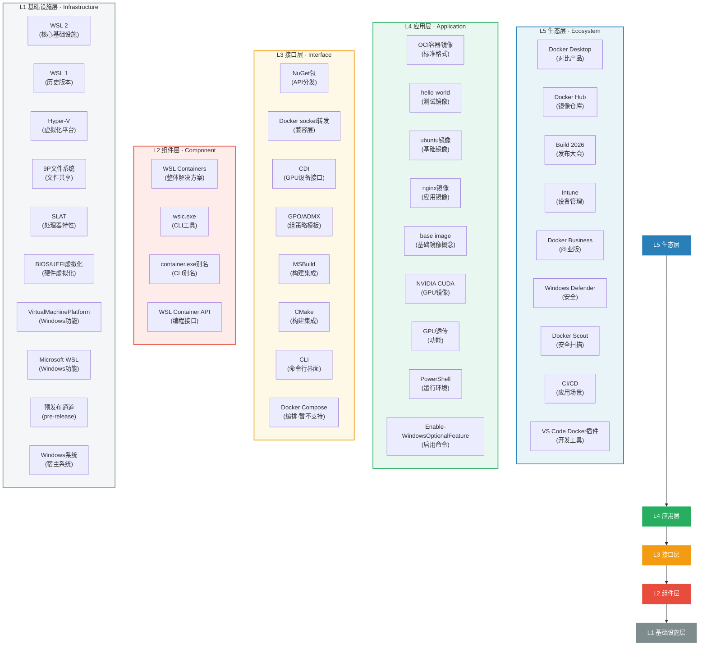

# 02 - 概念原子化与关系图谱（I阶段·关系分析）

> **I阶段原则**：结构化分层，明确依赖关系，无循环引用。

## 一、五层概念分层说明

| 层级 | 名称 | 概念数量 | 包含概念 |
|------|------|---------|---------|
| L1 | 基础设施层 | 10 | WSL 2、WSL 1、Hyper-V、9P文件系统、SLAT、BIOS/UEFI虚拟化、VirtualMachinePlatform、Microsoft-Windows-Subsystem-Linux、预发布通道(pre-release)、Windows系统 |
| L2 | 组件层 | 4 | WSL Containers、wslc.exe、container.exe别名、WSL Container API |
| L3 | 接口层 | 8 | NuGet包、Docker socket转发、CDI、GPO/ADMX、MSBuild、CMake、CLI、Docker Compose |
| L4 | 应用层 | 9 | OCI容器镜像、hello-world镜像、ubuntu镜像、nginx镜像、base image、NVIDIA CUDA、GPU透传、PowerShell、Enable-WindowsOptionalFeature |
| L5 | 生态层 | 9 | Docker Desktop、Docker Hub、Build 2026、Intune、Docker Business、Windows Defender、Docker Scout、CI/CD、VS Code Docker插件 |
| **合计** | - | **40** | - |

## 二、Mermaid图表

### 图1：WSL Containers整体架构分层图



### 图2：wslc vs Docker 命令映射关系图

```mermaid
flowchart LR
    subgraph WSLCCmd["wslc.exe 命令"]
        direction TB
        WSLC_RUN["wslc run"]
        WSLC_PS["wslc ps"]
        WSLC_IMAGES["wslc images"]
        WSLC_RMI["wslc rmi"]
        WSLC_PULL["wslc pull"]
        WSLC_BUILD["wslc build"]
        WSLC_GPU["wslc --gpus"]
    end
    subgraph DockerCmd["Docker 命令"]
        direction TB
        DOCKER_RUN["docker run"]
        DOCKER_PS["docker ps"]
        DOCKER_IMAGES["docker images"]
        DOCKER_RMI["docker rmi"]
        DOCKER_PULL["docker pull"]
        DOCKER_BUILD["docker build"]
        DOCKER_GPU["docker --gpus"]
    end
    WSLC_RUN -->|" "语法相似<br/>替代" "| DOCKER_RUN
    WSLC_PS -->|" "语法相似<br/>替代" "| DOCKER_PS
    WSLC_IMAGES -->|" "语法相似<br/>替代" "| DOCKER_IMAGES
    WSLC_RMI -->|" "语法相似<br/>替代" "| DOCKER_RMI
    WSLC_PULL -->|" "语法相似<br/>替代" "| DOCKER_PULL
    WSLC_BUILD -->|" "语法相似<br/>替代" "| DOCKER_BUILD
    WSLC_GPU -->|" "CDI方式实现<br/>GPU透传" "| DOCKER_GPU
    subgraph WSLC_Only["wslc 独有特性"]
        direction TB
        WSL_KERNEL["复用WSL 2内核"]
        HYPERV_VM["独立Hyper-V轻量VM("API调用")"]
        NO_DESKTOP["无需安装Docker Desktop"]
        INTEGRATED_BUILD["MSBuild/CMake集成"]
    end
    subgraph Docker_Only["Docker 独有特性"]
        direction TB
        COMPOSE_SUPPORT["Docker Compose支持"]
        GUI["图形界面"]
        SCOUT["Docker Scout安全扫描"]
        BUSINESS_FEATURES["Docker Business企业特性"]
    end
    style WSLCCmd fill:#e8f8f0,stroke:#27ae60,stroke-width:2px
    style DockerCmd fill:#fdecea,stroke:#e74c3c,stroke-width:2px
    style WSLC_Only fill:#e8f8f0,stroke:#27ae60,stroke-width:1px,stroke-dasharray:5 5
    style Docker_Only fill:#fdecea,stroke:#e74c3c,stroke-width:1px,stroke-dasharray:5 5
```

### 图3：WSL Containers生态定位图

```mermaid
flowchart TD
    subgraph Windows["Windows生态"]
        direction LR
        Win11["Windows 11<br/>(宿主系统)"]
        Intune_MDM["Intune<br/>(MDM管理)"]
        GPO_POL["GPO/ADMX<br/>(组策略)"]
        Defender_SEC["Windows Defender<br/>(安全)"]
    end
    subgraph WSL_Stack["WSL技术栈"]
        direction TB
        WSLContainers["WSL Containers<br/>(原生容器层)"]
        WSL2_Core["WSL 2<br/>(内核基础设施)"]
        WSL1_Legacy["WSL 1<br/>(历史版本·系统调用翻译)"]
        HyperV_Plat["Hyper-V<br/>(虚拟化平台)"]
        P9FS["9P文件系统<br/>(文件共享)"]
    end
    subgraph Container_Eco["容器生态"]
        direction LR
        DockerDesktop["Docker Desktop<br/>(完整GUI方案)"]
        DockerHub_Reg["Docker Hub<br/>(镜像仓库)"]
        OCI_Spec["OCI镜像标准<br/>(ubuntu/nginx/nvidia/cuda)"]
        CDI_GPU["CDI<br/>(GPU设备规范)"]
        VSCodeExt["VS Code Docker插件<br/>(开发工具)"]
        CICD_Pipe["CI/CD<br/>(流水线场景)"]
    end
    WSLContainers -->|" "基于" "| WSL2_Core
    WSL2_Core -->|" "基于" "| HyperV_Plat
    WSLContainers -->|" "使用" "| P9FS
    WSLContainers -->|" "兼容" "| OCI_Spec
    WSLContainers -->|" "通过CDI支持" "| CDI_GPU
    WSLContainers -->|" "socket转发兼容" "| VSCodeExt
    WSLContainers -->|" "适用" "| CICD_Pipe
    WSLContainers -->|" "对比" "| DockerDesktop
    DockerDesktop -->|" "使用" "| DockerHub_Reg
    WSLContainers -->|" "拉取镜像" "| DockerHub_Reg
    WSLContainers -->|" "企业管控" "| GPO_POL
    GPO_POL -->|" "集成" "| Intune_MDM
    WSLContainers -->|" "安全扫描" "| Defender_SEC
    WSL2_Core -->|" "运行于" "| Win11
    DockerDesktop -->|" "运行于" "| Win11
    WSLContainers -.->|" "不替代·互补" "| DockerDesktop
    style Windows fill:#e8f4f8,stroke:#2980b9,stroke-width:2px
    style WSL_Stack fill:#e8f8f0,stroke:#27ae60,stroke-width:2px
    style Container_Eco fill:#fef9e7,stroke:#f39c12,stroke-width:2px
    style WSLContainers fill:#27ae60,color:#fff,stroke-width:3px
    style DockerDesktop fill:#e74c3c,color:#fff,stroke-width:2px
```

## 三、核心关系说明

### 3.1 分层依赖关系（L5→L1）

- **L5→L4**：生态层产品和场景基于应用层镜像和功能构建
- **L4→L3**：应用通过接口层提供的NuGet、socket转发、CDI等接口与组件交互
- **L3→L2**：接口层封装了组件层wslc.exe和WSL Container API的能力
- **L2→L1**：组件层两大核心组件（wslc.exe、WSL Container API）依赖基础设施层的WSL 2、Hyper-V、9P文件系统

### 3.2 核心关系类型明细

| 关系类型 | 源概念 | 目标概念 | 说明 |
|---------|--------|---------|------|
| depends_on | WSL Containers | WSL 2 | WSL Containers不是WSL 2继任者，而是基于WSL 2基础设施的新功能层 |
| depends_on | WSL 2 | Hyper-V | WSL 2底层依赖Hyper-V轻量虚拟机 |
| depends_on | WSL Containers | 9P文件系统 | 文件系统复用WSL 2的9P协议 |
| depends_on | wslc.exe | WSL 2 | wslc直接复用WSL 2已有内核 |
| contains | WSL Containers | wslc.exe | wslc.exe是WSL Containers的两大核心组件之一 |
| contains | WSL Containers | WSL Container API | WSL Container API是WSL Containers的两大核心组件之一 |
| contains | wslc.exe | container.exe别名 | container.exe是wslc.exe的别名 |
| implements | WSL Container API | NuGet包 | API以NuGet包形式分发 |
| implements | WSL Containers | CDI | GPU支持通过CDI方式实现 |
| implements | wslc.exe | Docker CLI语法 | wslc命令语法与Docker高度相似 |
| compared_with | WSL Containers | Docker Desktop | 核心对比对象，两者互补而非替代 |
| replaces | wslc run | docker run | 语法相似，可替代docker run执行容器 |
| depends_on | WSL Container API | Hyper-V | 每个API调用的应用有独立Hyper-V轻量VM |
| implements | WSL Containers | OCI容器镜像 | 运行标准OCI镜像（ubuntu/nginx/nvidia/cuda等） |
| depends_on | Docker socket转发 | VS Code Docker插件 | socket转发使VS Code Docker插件可以兼容使用 |
| contains | 企业管控 | GPO/ADMX | GPO/ADMX是企业管控能力的组成部分 |
| contains | 企业管控 | Intune | Intune是企业管控能力的组成部分（即将上线） |
| depends_on | GPU透传 | CDI | GPU透传通过CDI规范实现 |
| compared_with | WSL Containers | CI/CD场景 | WSL Containers适用于不愿装整套Docker引擎的CI/CD场景 |
| depends_on | WSL Containers | Windows 11 | 要求Windows 11（Hyper-V依赖） |
| depends_on | WSL Containers | SLAT | 需要64位且支持SLAT的处理器 |
| depends_on | WSL Containers | BIOS/UEFI虚拟化 | 需要在BIOS/UEFI开启虚拟化 |
| replaces | wslc --gpus | docker --gpus | wslc同样支持--gpus参数进行GPU透传 |
| depends_on | MSBuild集成 | WSL Container API | MSBuild/CMake通过API集成容器构建部署 |

### 3.3 关键设计洞察

1. **分层解耦**：五层架构清晰分离关注点，底层基础设施向上层提供能力，上层不直接穿透访问底层
2. **双组件架构**：L2层采用"CLI工具(wslc.exe)+编程API(WSL Container API)"双核心设计，覆盖交互式使用和程序化调用两类场景
3. **兼容而非替代**：与Docker Desktop是互补关系，通过Docker socket转发实现生态兼容
4. **企业就绪**：L3层提供GPO/ADMX、Intune、Defender等企业级管控能力，区别于Docker Desktop需要Business版才有完善企业功能
5. **GPU标准化**：GPU透传采用CDI（Container Device Interface）标准方式，而非Docker自定义方式
