# 一画开天商业模式会议记录深度分析 - The Implementation Plan (Decomposed and Prioritized Task List)

> 主题：retrospectives-insights（复盘与洞察萃取）
> 方法论：第一性原理 + 复盘 + 洞察 + 萃取 + 导出 五步法

## [x] Task 1: 分析准备与上下文加载
- **Priority**: high
- **Depends On**: None
- **Description**: 
  - 完整读取并理解源文件 `.temp/record.md`（32行会议记录）
  - 加载五大指令集规范（第一性原理/复盘/洞察/萃取/导出）作为分析框架
  - 参考已有同类分析报告的结构与风格（如 methodology-analysis-report、first-principles-knowledge-system-retrospective）
  - 确定报告输出目录（使用 `playground/reports/` 并新建日期子目录，因含私密内容）
  - 确定报告结构框架（背景→事实梳理→第一性原理分析→复盘→洞察→模式萃取→总结）
- **Acceptance Criteria Addressed**: [AC-1, AC-2]
- **Test Requirements**:
  - `programmatic` TR-1.1: 确认源文件存在且内容完整读取
  - `human-judgement` TR-1.2: 确认分析框架与已有规范保持一致
- **Notes**: 参考 `.agents/commands/` 下的五个指令集文件，确保方法论合规

## [x] Task 2: 第一性原理深度分析
- **Priority**: high
- **Depends On**: Task 1
- **Description**: 
  - **步骤1：问题界定** - 明确分析对象："一画开天"文化-商业体系的本质逻辑
  - **步骤2：假设剥离与归零** - 列出所有隐含假设（如"文化理念能促进商业变现"、"五品模型是最优漏斗"等），逐条验证，剥离未经证实的经验性假设
  - **步骤3：基础要素识别** - 将体系拆解至不可再分的基础要素：
    - 文化层：道、一、利他、共赢
    - 系统层：心中结果、接受最坏、三值体验、理想国度
    - 产品层：免费/199/1990/体系/衍生品
    - 激励层：50份门槛、高额分红、长期分红
    - 执行层：目标→策略→行动
  - **步骤4：公理提炼** - 从基础要素中提炼自洽的公理体系（文化公理、商业公理、执行公理）
  - **步骤5：自下而上重构** - 基于公理重新推导商业模式的逻辑链
  - **步骤6：验证** - 验证重构方案是否覆盖会议全部内容
  - 执行元审查（自检）：完整性检查、偏差自检、方法论合规、反模式检测
- **Acceptance Criteria Addressed**: [AC-1]
- **Test Requirements**:
  - `human-judgement` TR-2.1: 假设清单完整，至少列出5个隐含假设并验证
  - `human-judgement` TR-2.2: 基础要素真正不可再分，无经验假设混入
  - `human-judgement` TR-2.3: 公理之间自洽无矛盾，推导链完整可追溯
  - `human-judgement` TR-2.4: 完成元审查自检清单
- **Notes**: 严格遵循 `.agents/commands/first-principles.md` 的六步流程，避免跳步

## [x] Task 3: 复盘式内容结构化梳理
- **Priority**: high
- **Depends On**: Task 2
- **Description**: 
  - **事实收集** - 按三大模块整理会议原始内容：
    1. 文化理念模块（一画开天、伏羲→道德经→道商、身份转变）
    2. 商业模式模块（五品模型、激励政策）
    3. 执行方法模块（识别好系统、铁三角、目标设定）
    4. 课后作业模块
  - **过程分析** - 分析各模块之间的逻辑关联（文化如何支撑系统、系统如何支撑产品、产品如何支撑激励）
  - **识别设计亮点与潜在盲区** - 亮点如五品漏斗设计、身份转变降低权威距离；盲区如缺乏风险提示、缺乏具体落地路径
  - 遵循"验证优先"原则：所有分析点需标注对应的会议原文出处（行号引用）
- **Acceptance Criteria Addressed**: [AC-2]
- **Test Requirements**:
  - `human-judgement` TR-3.1: 事实梳理覆盖record.md全部32行内容，无遗漏
  - `human-judgement` TR-3.2: 模块间逻辑关联分析清晰，形成完整因果链
  - `programmatic` TR-3.3: 所有关键引用标注源文件行号（使用相对路径）
- **Notes**: 使用 `.agents/commands/retrospective.md` 的「事实→分析→洞察→建议」结构

## [x] Task 4: 洞察提炼与5-Whys根因分析
- **Priority**: high
- **Depends On**: Task 3
- **Description**: 
  - 使用5-Whys方法对核心设计进行根因分析：
    - Why1：为什么设计五品模型？→ 建立信任阶梯
    - Why2：为什么需要信任阶梯？→ 降低用户决策门槛
    - Why3：为什么用免费公益品做入口？→ 零风险建立初次连接
    - Why4：为什么设置50份激励门槛？→ 筛选真正行动者
    - Why5：为什么强调"兄弟姐妹"而非"老师"？→ 建立平等共治关系
  - 提炼核心洞察（至少3个）：
    - 洞察1：文化-系统-产品-激励-执行五层嵌套结构
    - 洞察2：身份转变作为组织变革催化剂
    - 洞察3：逆向思维（接受最坏结果）作为行动障碍破解器
  - 识别异常点与潜在风险
- **Acceptance Criteria Addressed**: [AC-3]
- **Test Requirements**:
  - `human-judgement` TR-4.1: 至少完成1组完整的5-Whys根因分析
  - `human-judgement` TR-4.2: 提炼至少3个核心洞察，每个洞察有明确的证据支撑
  - `human-judgement` TR-4.3: 洞察不是简单复述，而是有提炼和升华
- **Notes**: 参考 `.agents/commands/insight.md` 的步骤执行

## [x] Task 5: 可复用模式萃取
- **Priority**: high
- **Depends On**: Task 4
- **Description**: 
  - 标记并结构化萃取可复用的商业模式/方法论模式（至少2个）：
    - **模式1：五品漏斗模型**（公益品→引流品→粘性品→盈利品→衍生品）
      - 成熟度：L2（已定义，有清晰结构）
      - 适用场景：知识付费、社群变现、服务型产品
      - 使用方法：按信任阶梯设计产品矩阵，每层有明确的转化目标
      - 注意事项：各层之间需有明确的价值升级路径
    - **模式2：铁三角目标执行法**（目标→策略→行动）
      - 成熟度：L2（已定义）
      - 适用场景：个人目标设定、团队任务拆解
      - 使用方法：先定SMART目标，再定策略路径，最后拆解行动
      - 注意事项：防止跳过策略直接行动
    - **模式3：逆向心理建构法**（心中结果→接受最坏→体验三值→抵达理想）
      - 成熟度：L1（观察到，待验证）
      - 适用场景：高焦虑决策、创业启动、重大选择
      - 使用方法：先预想理想结果，再接受最坏可能，通过过程价值消解焦虑
      - 注意事项："接受最坏"不等于"追求最坏"
  - 为每个模式编写结构化描述
- **Acceptance Criteria Addressed**: [AC-3]
- **Test Requirements**:
  - `human-judgement` TR-5.1: 至少萃取2个可复用模式，推荐3个
  - `human-judgement` TR-5.2: 每个模式包含：名称、成熟度等级、适用场景、使用方法、注意事项
  - `human-judgement` TR-5.3: 模式描述清晰，可独立复用
- **Notes**: 参考 `docs/retrospective/patterns/` 下的现有模式格式

## [x] Task 6: 分析报告撰写与Mermaid可视化
- **Priority**: high
- **Depends On**: Task 5
- **Description**: 
  - 创建报告目录：`playground/reports/retrospective-yihuakaitian-meeting-20260711/`（因含私密内容，已从docs迁移至playground）
  - 撰写完整的Markdown分析报告，包含以下章节：
    1. YAML frontmatter（id、title、source、date、tags、maturity等）
    2. 执行摘要
    3. 背景与源文件说明
    4. 会议内容事实梳理（三大模块）
    5. 第一性原理分析（假设清单/要素清单/公理列表/重构方案/元审查）
    6. 复盘分析（逻辑链/设计亮点/潜在盲区）
    7. 核心洞察（5-Whys分析+洞察列表）
    8. 可复用模式萃取（模式卡片）
    9. 总结与启示
  - 使用Mermaid图表可视化：
    - 五品漏斗模型流程图
    - 文化-系统-产品-激励-执行五层架构图
    - 铁三角执行流程图
  - 执行"数据验证三查法"：
    1. 查关键数据（字数、行数用实际统计）
    2. 查链接有效性（使用check-links.py）
    3. 查章节结构（确认所有预期章节存在）
- **Acceptance Criteria Addressed**: [AC-2, AC-3, AC-4, AC-6]
- **Test Requirements**:
  - `programmatic` TR-6.1: 报告目录创建成功，文件命名符合规范
  - `human-judgement` TR-6.2: YAML frontmatter完整，包含所有必要字段
  - `human-judgement` TR-6.3: 七大章节完整，结构清晰
  - `human-judgement` TR-6.4: Mermaid图表语法正确，能正常渲染
  - `programmatic` TR-6.5: 运行 `python .agents/scripts/check-links.py --path <report-dir>` 无断链
  - `programmatic` TR-6.6: 使用Grep检查章节结构（grep "^#"）确认完整
- **Notes**: Mermaid遵循安全编码六规则，参考 `docs/development-standards.md#mermaid-编码规范`

## [x] Task 7: 报告导出与归档
- **Priority**: medium
- **Depends On**: Task 6
- **Description**: 
  - 确认Markdown报告格式正确（作为主要导出格式）
  - 在报告目录添加README.md索引文件（如需要）
  - 生成导出清单文件（说明导出内容、格式、时间）
  - 验证报告可正常打开阅读
- **Acceptance Criteria Addressed**: [AC-4, AC-5]
- **Test Requirements**:
  - `programmatic` TR-7.1: Markdown文件存在且格式正确
  - `human-judgement` TR-7.2: 报告内容完整可读，无格式错误
- **Notes**: 遵循 `.agents/commands/export-report.md` 规范，默认导出MD格式即可

## [x] Task 8: 索引更新与spec收尾
- **Priority**: medium
- **Depends On**: Task 7
- **Description**: 
  - 在 `docs/retrospective/README.md` 中添加报告链接（指向playground/reports/下的私密报告）
  - 更新本spec主题README（`.trae/specs/retrospectives-insights/README.md`），在"学习分析类"表格中添加本spec条目，状态标记为✅完成
  - 交叉引用检查：用Grep搜索是否有其他文档需要更新引用
  - 更新本tasks.md，将所有任务标记为[x]完成
- **Acceptance Criteria Addressed**: [AC-5]
- **Test Requirements**:
  - `programmatic` TR-8.1: docs/retrospective/README.md中已添加报告链接
  - `programmatic` TR-8.2: retrospectives-insights/README.md中已登记本spec状态为完成
  - `human-judgement` TR-8.3: 所有索引更新正确，链接使用相对路径
- **Notes**: 遵循"交叉引用检查"要求，避免模式升级后引用断链

# Task Dependencies

```mermaid
flowchart LR
    T1[Task 1: 分析准备] --> T2[Task 2: 第一性原理分析]
    T2 --> T3[Task 3: 复盘梳理]
    T3 --> T4[Task 4: 洞察提炼]
    T4 --> T5[Task 5: 模式萃取]
    T5 --> T6[Task 6: 报告撰写]
    T6 --> T7[Task 7: 导出归档]
    T7 --> T8[Task 8: 索引更新]
    
    style T1 fill:#fff3cd,stroke:#ffc107
    style T2 fill:#d1ecf1,stroke:#17a2b8
    style T3 fill:#d4edda,stroke:#28a745
    style T4 fill:#d4edda,stroke:#28a745
    style T5 fill:#d4edda,stroke:#28a745
    style T6 fill:#cce5ff,stroke:#007bff
    style T7 fill:#f8d7da,stroke:#dc3545
    style T8 fill:#f8d7da,stroke:#dc3545
```

- Task 1 必须最先执行（上下文加载是高质量分析的前提）
- Task 2-5 是核心分析阶段，按方法论顺序串行执行
- Task 6 是报告撰写，依赖全部分析完成
- Task 7-8 是归档收尾，最后执行
- **重要**：分析保持客观中立，聚焦于方法论萃取而非价值评判
