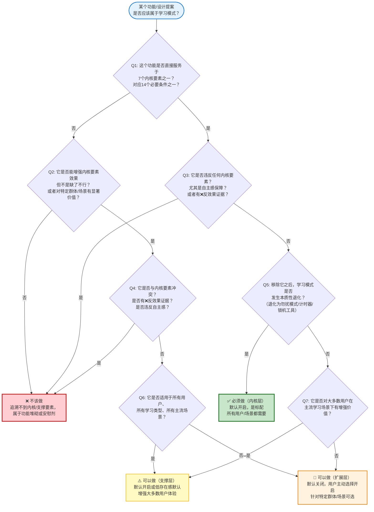
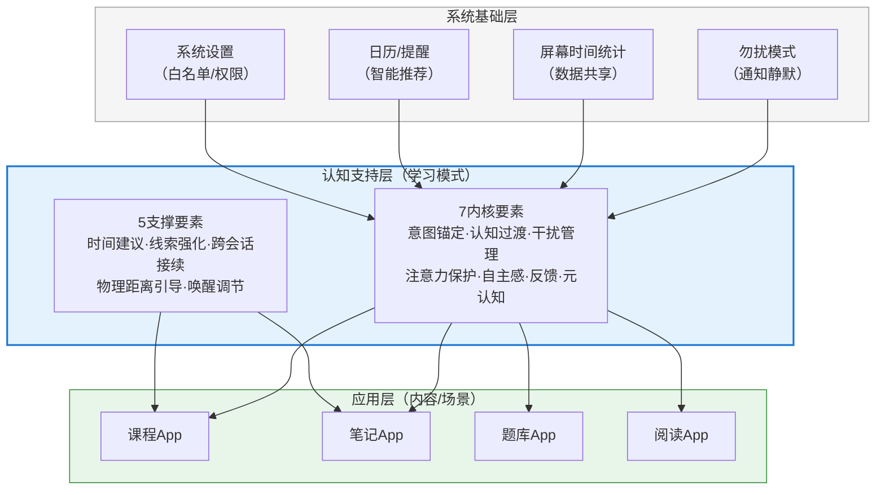

# 第9章：价值主张陈述

前8章完成了从第一性原理出发的学习本质拆解、用户痛点溯源、必要条件建模、干扰机制分析、技术-心理映射、群体差异分析、根本假设验证，以及核心构成要素定义。本章在这些分析基础上，回答一个根本性问题：**学习模式到底是什么？它为用户提供什么独特价值？**

这个问题的答案不能是"更好的勿扰模式"，也不能是"带白噪音的番茄钟"——我们必须清晰地阐明学习模式的价值主张，与现有相似功能划清本质界限。

---

## 9.1 从"免打扰"到"认知支持"的范式转变

在定义价值主张之前，我们必须首先理解一个根本的范式转变：现有产品对"学习模式"的理解，与我们从第一性原理推导出来的理解，存在**本质上的目标差异**——不是程度上的改进（"更好的免打扰"），而是范式层面的替换。

### 旧范式：学习模式 = 让世界安静下来

现有几乎所有专注/学习类产品的设计哲学，都建立在一个隐含假设之上：**学习无法发生的原因是外部干扰太多**。因此，解决方案就是"让世界安静下来"——屏蔽通知、锁定手机、隐藏App、播放白噪音掩盖环境声音、用种树惩罚阻止你退出。这个范式的核心隐喻是**防火墙**：手机是危险的干扰源，学习模式是一道防火墙，把有害的干扰挡在外面，让用户在墙内"安全地"学习。

防火墙范式有三个核心特征：

第一，**问题定位在外部**——干扰来自手机通知、来自其他App、来自环境声音、来自"忍不住玩手机"的意志力薄弱。解决方案就是控制这些外部因素：屏蔽通知、锁死手机、增加退出成本（植物枯死）。

第二，**手段是限制和禁止**——核心机制是"你不能做X""你不应该做Y"。应用锁定禁止你打开其他App，惩罚机制禁止你提前退出，白名单以外的通知禁止打扰你。用户处于"被管理"的位置。

第三，**目标是"没有干扰"**——成功的标准是"学习期间没有弹出通知""用户没有打开其他App""用户坐满了设定的时长"。至于用户在这段时间里是否真的在学习、是否真正理解了内容、是否进入了深度加工状态——这些不在测量范围内，也不是产品关心的。

这个范式的问题在哪里？Task 5的干扰分类学已经给出了明确答案：外部感官干扰（通知、声音）只占所有干扰的约25%，剩下75%的干扰来自认知后台（brain drain、蔡格尼克张力）、内部心理（走神、焦虑、唤醒偏离）、行为习惯（自动刷手机的线索触发）——这些是防火墙完全无法触及的。你可以挡住所有通知，但你挡不住用户心里"万一有急事找我"的焦虑；你可以锁死手机，但你锁不住大脑在想刚才刷的视频内容；你可以让用户坐满25分钟，但你无法强迫工作记忆装载学习内容而非未完成的事务。

这就是为什么很多用户的真实体验是："开了严格模式，对着书坐了2小时，手机确实没玩成，但习也没学成"——防火墙成功挡住了外部干扰，但内部干扰毫发无损，用户如坐针毡，认知资源被"和App对抗"消耗殆尽。

### 新范式：学习模式 = 让大脑进入学习状态

我们从第一性原理推导出来的学习模式，建立在一个完全不同的假设之上：**学习无法发生的根本原因，不是外部干扰太多，而是大脑没有进入适合深度学习的认知状态**。学习不是"在一个安静的房间里坐着"这么简单——它需要工作记忆有足够空间、ECN（执行控制网络）稳定激活、DMN（默认模式网络）被适度抑制、唤醒水平处于最优区间、没有未完成事务的认知张力、有明确的目标锚定、有持续的进展反馈、有元认知觉察支持。

这个范式的核心隐喻是**温室**而非防火墙：防火墙阻挡有害物，温室创造适合生长的条件。温室不只是"挡住风雨"——它主动调节温度、湿度、光照、通风，为植物创造最适合生长的环境；同样，学习模式不只是"挡住通知"——它主动建构适合深度学习的认知条件，帮助大脑完成从日常状态到学习状态的切换，并在整个学习周期中提供持续的认知支持。

温室范式有三个核心特征：

第一，**问题定位在认知状态**——干扰不只是来自外部，更来自大脑内部的状态：工作记忆被占用、注意力残留未清空、唤醒水平偏离、目标模糊、缺乏反馈、元认知觉察滞后。解决方案是主动建构这些认知条件，而不只是屏蔽外部刺激。

第二，**手段是支持和赋能**——核心机制是"我帮你做X""我支持你做到Y"。认知过渡帮你清空注意力残留，意图锚定帮你明确学习目标，进展反馈帮你感知前进方向，元觉察帮你温和地从走神中返回。用户始终是主体，学习模式是用户的工具和助手，而非狱警和监工。

第三，**目标是"深度学习发生"**——成功的标准不是"坐满了多久"，而是"图式是否建构""长时记忆是否改变""ECN是否稳定激活""内在动机是否维持"。学习模式关心的不是"你有没有玩手机"，而是"你的大脑是否在进行深度加工"。

### 这不是改进，是本质替换

需要特别强调：这不是"把防火墙做得更好"的渐进式改进，而是目标层面的本质替换。防火墙的目标是"没有干扰"，温室的目标是"适合生长"——这两个目标即使在概念上也是不同的。一个安静的房间（完美的防火墙）不一定适合学习：如果温度太低/太高、光线太暗/太亮、没有通风，植物仍然长不好；同样，一个没有通知的手机（完美的勿扰模式）不一定支持深度学习：如果用户的目标模糊、工作记忆堆满了未完成事务、唤醒水平焦虑过高、没有进展反馈、走神了10分钟才觉察到——即使一个通知都没有，学习仍然无法高质量发生。

防火墙范式做的是"减法"——移除可能有害的东西；温室范式做的是"加法+减法"——移除有害物的同时，主动建构必要的支持条件。Task 9定义的7个内核要素中，只有C3（干扰预期管理）的一部分属于"减法"（屏蔽通知），剩下6个内核要素——意图锚定、认知过渡、注意力保护、自主感保障、进展反馈、元认知支持——全都是"加法"，都是防火墙范式完全没有触及的认知支持。这就是为什么我们说学习模式和勿扰模式有本质区别：勿扰模式只做了学习模式约10-15%的工作，而且是最简单、最表层的那部分。

旧范式问的是："我们怎么阻止用户玩手机？"
新范式问的是："我们怎么帮助用户的大脑进入并维持深度学习状态？"

这两个问题的答案，从底层哲学到具体功能设计，几乎没有重叠。

---

## 9.2 核心价值主张陈述

基于上述范式转变，我们可以清晰地陈述学习模式的核心价值主张。我们提供四个版本，适用于不同场景。

### 一句话版本（电梯演讲）

**学习模式不是帮你"忍住不玩手机"，而是帮你的大脑真正进入学习状态——从启动前的认知准备，到学习中的注意力保护、元认知支持，再到结束后的收尾复盘，为深度学习的完整认知链条提供脚手架。**

### 一段话版本（产品定义）

学习模式是一个基于认知科学原理设计的**系统级认知状态脚手架**——它不同于简单的通知屏蔽（勿扰模式）或行为限制（应用锁），而是针对深度学习发生的14个必要条件，在学习会话的完整周期（启动→过渡→维持→疲劳→退出→恢复）中，主动建构适合深度加工的认知环境：通过意图锚定和认知过渡帮助大脑快速完成状态切换，通过干扰预期管理和注意力资源保护为工作记忆腾出空间，通过自主感保障维护内在动机，通过非侵入式进展反馈提供持续的小奖赏对抗双曲贴现，通过元认知觉察支持帮助用户温和应对走神和疲劳。它是用户学习的"支持者"而非"监工"——永远允许退出、没有惩罚机制、所有约束都是用户自主选择的帮助而非强制。

### 用户视角版本（"对我有什么用"）

当你想学习但总是"坐下来半天进不了状态""学20分钟就忍不住摸手机""感觉学了很久但什么都没记住"的时候，学习模式能帮你：

- **快速进入状态**：不用再熬过前15分钟"心神不宁"的启动期，30-60秒的认知过渡帮你把脑子里的杂事清空、把注意力从之前刷的内容上拉回来，快速切换到学习模式；
- **真正专注进去**：不只是挡住通知——它会帮你消除"万一有急事找我"的焦虑，帮你把手机放远消除看不见的brain drain效应，界面极简不占用你的认知资源，你不会被倒计时压力、种树焦虑、积分比较这些东西分心；
- **温和地对待自己**：你随时可以退出，没有植物枯死、没有"你放弃了"的指责、没有道德绑架；走神了它会用极温和的方式提醒你（就像发现自己走岔路了，转回来就行），不会骂你"又分心了"；累了它会提醒你休息，不会让你硬撑到效率为零；
- **感受到真实的进展**：你能感知到自己学了多久、完成了什么小目标，这些反馈不是虚拟的树或积分，而是"我完成了一件事"的真实成就感——学习结束后你会记得自己学到了什么，而不只是"我坐了2小时"。

简单说：勿扰模式是"我帮你把世界关在外面"，学习模式是"我帮你准备好学习需要的一切条件"。

### 技术视角版本（"系统层面做什么"）

学习模式在系统层面实现以下机制：

1. **启动期认知脚手架**：启动后30-60秒过渡阶段，通过认知卸载（写下未完成事务释放蔡格尼克张力）、目标回顾、多通道情境线索（视觉/听觉/触觉）、可选呼吸调节，完成从日常模式到学习模式的认知切换，将10-15分钟的启动脆弱期缩短至2-3分钟；
2. **动态认知环境保护**：不是一刀切的静态保护——启动期（前10-15分钟）启用最强级别的干扰屏蔽和界面简化，度过启动期后自动降低干预强度让用户"忘记"模式存在；检测到疲劳信号时主动提示休息而非强制打断；用户需要临时退出时提供"上下文书签"和快速恢复机制，将打断重建成本从10-15分钟缩短至1-2分钟；
3. **全周期元认知支持**：非侵入式的走神觉察（屏幕边缘呼吸光效而非弹窗指责）、唤醒水平检测与调节提示、不带评判的态度——不统计分心次数、不做专注力评分、不制造愧疚感；
4. **自主感优先的交互设计**：所有约束都是"帮助"而非"限制"——永远可见的退出按钮、零惩罚机制、退出时提供信息提示而非道德绑架、约束强度用户可自主调节、不自动强制启动。

---

## 9.3 价值主张的三层含义

学习模式的价值主张可以从三个递进的层面理解，每一层都与现有产品的设计哲学形成鲜明对比。

### 第一层：赋能而非限制

学习模式的第一层价值，是**它站在用户这边，帮助用户做到他们想做的事，而不是阻止用户做"不该做"的事**。这是设计哲学最根本的分野。

现有专注类产品的底层逻辑是"性恶论"——它们假设用户"意志力薄弱""管不住自己""一有机会就会玩手机"，因此产品的角色是"外部权威"，通过强制约束、惩罚机制、损失厌恶来"帮"用户管住自己。这种逻辑下，用户和产品是对立的：用户想办法绕过限制（重启手机、强制退出），产品想办法堵漏洞，形成一场"猫鼠游戏"。用户在这个过程中消耗的不是意志力用于学习，而是意志力用于和App对抗。

学习模式的底层逻辑是"自主支持论"——它假设用户**本身就有学习的内在动机**，只是这个动机被启动摩擦、认知张力、习惯线索、状态偏离等障碍阻挡了。产品的角色不是"警察"而是"助手"——不是"我不让你玩手机"，而是"我帮你把学习路上的障碍搬走，让你更容易做到你本来就想做的事"。

这个区别体现在每一个交互细节上：

| 场景 | 限制型设计（现有产品） | 赋能型设计（学习模式） |
|---|---|---|
| 用户想退出 | "你确定吗？植物会死！你的努力会白费！"（威胁+道德绑架） | "现在退出会丢失12分钟的专注状态，你可以选择：①继续 ②快速看一眼消息（30秒后提示返回） ③结束本次学习"（提供信息+给选择权） |
| 用户走神/切换App | "你又分心了！请专心学习！"（指责+弹窗打断） | 屏幕边缘极淡的呼吸光效（非侵入式提示，无文字无声音，觉察到了温和回来即可） |
| 用户没有设置目标就开始 | "请先设置今日学习目标才能开始"（强制设置墙） | 直接开始，启动期内温和提示"今天打算学什么？"（可选填写，也可以跳过） |
| 学习45分钟后 | 什么都不提示，直到番茄钟"叮"一声强制打断 | 检测到疲劳信号时温和提示"看起来有点累了，现在是不错的休息时机"（建议而非强制） |

核心区别在**自主感**：当约束是用户自主选择的帮助时，它不会触发心理抗拒，不会消耗额外的意志力资源，反而会增强掌控感；当约束是外部强加的控制时，即使表面上达到了"不能玩手机"的效果，用户的心理状态是"被囚禁"，认知资源被"想夺回自由"的渴求占据，根本无法用于学习。

这就是为什么"我自己把手机放到另一个房间"比"App把我手机锁死"有效得多——两者在行为层面结果相同（不能玩手机），但在心理层面天差地别：前者是自主选择，增强动机；后者是外部控制，触发逆反。赋能而非限制，不是"更温柔的限制"，而是**完全站在用户这边，和用户一起对抗学习的障碍，而非和用户对抗**。

### 第二层：认知脚手架而非干扰防火墙

学习模式的第二层价值，是**它主动建构学习所需的认知条件，而不只是消极地屏蔽干扰**。这是功能层面的本质差异。

防火墙范式假设"没有干扰=能学习"，因此它的所有功能都是"减法"——移除通知、移除App、移除颜色（灰度）、移除退出选项。但Task 3-5的分析清晰地表明：学习的发生需要一整套"加法"条件——需要明确的目标锚定（否则大脑会持续寻找"什么时候可以停"的信号）、需要认知过渡清空注意力残留（否则前15分钟工作记忆堆满之前的内容）、需要进展反馈提供即时奖赏（否则双曲贴现会让即时诱惑持续占上风）、需要元认知支持觉察走神和疲劳（否则走神5-10分钟才反应过来、硬撑到效率为零）、需要工作记忆保护（否则界面上的倒计时、积分、励志语录本身就是外在认知负荷）。

这些都是"加法"——是学习模式需要主动提供的脚手架，而不是"移除干扰"就能自然出现的。就像建房子：防火墙范式是"把工地上的闲杂人等赶出去"，但赶完人不会自动出现房子——你还需要打地基、搭脚手架、提供建筑材料、按照正确的顺序施工。认知脚手架就是学习模式提供的"施工支架"：

- 意图锚定是"施工图纸"——明确这次要建什么、建多少，避免工人到了工地不知道干什么；
- 认知过渡是"工地清理"——把上一个项目留下的建材垃圾清走，腾出工作台；
- 干扰预期管理是"工地围挡"——不是不让任何人进来，而是让无关的人不要随便进，让紧急事务有专门的通道；
- 注意力资源保护是"工地安全规范"——施工期间不要随便打断工人、保持工作台整洁、材料按顺序摆放；
- 进展反馈是"施工进度牌"——让工人随时看到已经建了多少、还有多少，保持动力；
- 元认知觉察支持是"工地安全员"——温和地提醒工人"你看起来累了，该休息了""你刚才走神了，回到工作上吧"，不是拿着鞭子监工；
- 自主感保障是"工人权益保障"——工人随时可以休息、可以调整工作节奏、可以离开，因为这是他们自己的工程。

防火墙只做了"围挡"这一件事的1/3（而且还做不好——它把所有入口都封死了，包括紧急通道，反而让工人担心"会不会有急事找不到我"），剩下的所有脚手架工作它完全没做。这就是为什么开了勿扰模式还是学不进去——工地围挡起来了，但没有图纸、工作台堆满垃圾、没有进度反馈、工人累了不让休息——这样的工地当然建不好房子。

学习模式不只是"更好的围挡"，它是一整套完整的认知施工脚手架。

### 第三层：学习全周期而非单次专注

学习模式的第三层价值，是**它覆盖学习的完整生命周期，而不只是"学习中"这一个时间切片**。这是时间视野的根本差异。

现有专注产品的时间视野极其狭窄——它们只关心"从点击开始到点击结束"这一段时间，这段时间里用户没有打开其他App、通知被屏蔽了，就算"成功"了。至于：

- 开始之前：用户是如何从刷手机的状态切换过来的？有没有未完成的事务在拉扯注意力？目标是否清晰？启动摩擦是否足够小？——这些它们不关心；
- 启动阶段：前10-15分钟用户还在"心神不宁"的脆弱期，需要特殊保护——它们不关心，从第一秒开始保护强度就和后面完全一样；
- 中断处理：用户中途需要回紧急消息怎么办？回来之后如何快速找回状态？——它们要么完全不允许中断（锁死），要么中断了就前功尽弃（植物枯死）；
- 疲劳阶段：45分钟后认知效率非线性下降，需要休息引导——它们要么用番茄钟强制打断不管你在不在心流，要么完全不提醒让你硬撑；
- 结束之后：如何收尾？如何总结这次学到了什么？如何为下次学习留下接续点？休息的时候应该做什么才能真正恢复认知资源？——它们完全不关心，计时器停了就结束了；
- 跨会话：上次学到哪里了？核心概念是什么？这次如何快速接续？——它们不关心，每次都是从零开始。

这就像一个医生只在你手术期间看着你，手术前不做准备、手术后不做康复、出了问题不处理——手术中看起来一切顺利，但病人可能因为术前准备不足死在手术台上，或者术后感染死亡。

学习模式采用**全周期时间视野**，覆盖从"产生学习念头"到"学习后恢复"的完整链条：

- **启动前**：一键启动最小化摩擦，入口放在最容易触达的位置（锁屏、控制中心）；
- **启动期（0-60秒过渡+0-15分钟脆弱期）**：认知卸载→目标回顾→多通道线索切换→启动期超强保护，帮助大脑快速完成状态切换；
- **维持期（15-45分钟）**：降低干预强度让用户"忘记"模式存在→非侵入式进展反馈→非评判的元觉察支持→加工连续性保障不主动打断；
- **疲劳期（45分钟后）**：疲劳检测→自然断点休息建议→休息质量引导（不鼓励刷手机，而是远眺/走动/闭目）；
- **中断处理**：上下文书签记录→30秒快速处理紧急消息→1分钟上下文恢复引导；
- **退出收尾**：学习小结引导（可选，"这次学到了什么？"）→为下次留下接续点→友好告别没有愧疚；
- **跨会话接续**：记住上次的断点→下次启动时在过渡阶段快速回顾→减少重启成本。

全周期视角的核心洞见是：学习不是一个孤立的时间块，而是一个有起承转合的完整过程。启动期的15分钟决定了整个会话的质量，结束后的收尾决定了长期记忆的巩固，跨会话的接续决定了多会话学习项目的成败——只关心"学习中"这一个切片，就像只关心小说的中间章节而不管开头和结尾，必然无法支持深度学习的发生。

---

## 9.4 与"勿扰模式"的本质区别对照表

为了最清晰地划清界限，我们用表格从七个维度系统对比学习模式与系统级勿扰模式（Do Not Disturb）的本质区别。这不是"学习模式比勿扰模式功能多"的程度差异，而是目标、哲学、机制层面的本质差异。

| 对比维度 | 系统级勿扰模式（DND） | 学习模式（Learning Mode） | 本质差异 |
|---|---|---|---|
| **核心目标** | 让手机保持安静，不打扰用户 | 让大脑进入并维持深度学习状态 | **目标层级不同**：勿扰模式的目标是"没有声音/弹窗"，是输入层面的；学习模式的目标是"认知状态适合学习"，是加工层面的。完全无干扰的环境仍然可能无法学习（目标模糊、工作记忆堆满杂事、唤醒过高焦虑），但学习模式在建构认知条件的同时自然包含了勿扰模式的核心功能。 |
| **设计哲学** | 限制/阻挡——"禁止打扰"；防火墙隐喻：把外部世界挡在外面 | 支持/建构——"帮助学习"；温室隐喻：创造适合生长的条件 | **用户-产品关系不同**：勿扰模式是被动的、防御性的，假设"干扰来自外部，挡住就好"；学习模式是主动的、建设性的，假设"学习需要一整套认知条件，产品帮助建构这些条件"。 |
| **作用层面** | 外源性刺激层面——只处理声音、震动、弹窗等外部感官刺激 | 全认知链条层面——外部感知+工作记忆+注意力+动机+情绪+元认知 | **问题解决深度不同**：勿扰模式只解决Task 5分类中的"干扰1（通知干扰）"，占所有干扰的约25%；学习模式解决全部6种干扰（通知、brain drain、注意力残留、习惯触发、走神、意志力耗竭），覆盖100%的干扰来源。 |
| **时间视野** | 静态切片——开启后状态不变，直到关闭；只关心"开启期间"不被打扰 | 动态全周期——启动期/维持期/疲劳期保护强度动态变化；覆盖启动前→过渡→维持→疲劳→中断→退出→跨会话接续完整周期 | **时间观不同**：勿扰模式是"开关式"的静态状态，假设整个期间需求不变；学习模式是"过程式"的动态支持，尊重学习会话的时间动态性——不同阶段主导干扰不同，需要的支持也不同。 |
| **用户关系** | 用户是"被保护者"——被动接受屏蔽规则，要么开要么关，粒度粗 | 用户是"主体"——自主选择约束强度、随时可退出可调整、所有约束是帮助而非控制 | **自主性程度不同**：勿扰模式是"全有或全无"的粗粒度控制，白名单有限；学习模式以自主感为内核要素，永远允许退出、没有惩罚、所有设置用户可控，用户始终掌握主导权。 |
| **核心机制** | 通知拦截+来电静音——单一机制：屏蔽刺激 | 7内核+5支撑的完整体系：意图锚定→认知过渡→干扰预期管理→注意力保护→自主感保障→进展反馈→元认知支持 | **机制复杂度不同**：勿扰模式只有一个机制（拦截）；学习模式有一整套针对不同认知过程的脚手架机制，其中通知拦截只占约10-15%。 |
| **成功指标** | 开启期间没有弹出通知、没有声音震动 | 深度学习发生：图式建构、长时记忆改变、内在动机维持、用户主观体验为"我学到了东西"而非"我坐了多久" | **成功定义不同**：勿扰模式的成功是可客观测量的"没有干扰"；学习模式的成功是主观+客观结合的"学习发生了"——坐满2小时但没学进去不算成功，学了30分钟但真正理解了一个重要概念算成功。 |

**一句话总结区别**：勿扰模式能做到"学习期间不被手机打扰"，但学习模式要做到"大脑真正在学习"。前者是后者的必要但不充分条件——勿扰模式是学习模式的一个子集功能，而学习模式是认知科学驱动的、针对学习这个特定认知活动的完整解决方案。

如果你需要的只是"开会/睡觉时不要被手机吵到"，用勿扰模式就够了；但如果你需要的是"坐下来真正学进去东西"，勿扰模式只能帮你挡住最表层的干扰，剩下75%的认知障碍需要学习模式来支持。

---

# 第10章：功能边界界定

定义了价值主张之后，我们必须清晰地划定功能边界——学习模式**是什么**，更重要的是，它**不是什么**。好的产品知道自己应该做什么，伟大的产品知道自己不应该做什么。本章建立边界判定的方法论，系统区分学习模式与6种相似功能的本质差异，回答8个最常见的边界问题，提供可操作的决策树，并阐明学习模式与其他系统功能的协作关系。

---

## 10.1 边界判定方法论

在讨论具体功能之前，我们必须先建立清晰、可操作的边界判定标准——面对一个功能提案，我们用什么标准来判断它应该属于学习模式（必须做）、可以属于学习模式（可选做）、还是不应该属于学习模式（不该做）？

### 三层判定标准

我们采用三层分类体系，与Task 9的要素分层一脉相承：

**第一层：必须做（内核层）——服务于7个内核要素，缺了它就不叫学习模式**

判定标准：如果移除这个功能，学习模式会发生本质性退化，不再是"学习模式"，而变成某种更简单、效果更有限的东西（如退化为勿扰模式、计时器、强制锁机工具）。这个功能必须直接服务于Task 9定义的7个内核要素之一：
1. 学习意图锚定
2. 认知过渡引导
3. 干扰预期管理
4. 注意力资源保护
5. 自主感保障
6. 进展反馈供给
7. 元认知觉察支持

同时，它必须追溯到Task 4定义的14个必要条件之一，且有Task 6证据分级中✅强支持或⚠️弱支持（有条件）的证据基础。

内核层功能是学习模式的"标配"——所有用户、所有学习场景下都需要，默认开启，不应该让用户手动选择"要不要开启认知过渡"（就像汽车不应该让用户选择"要不要装刹车"）。

**第二层：可以做（支撑/扩展层）——增强效果但非必须，可因群体/场景选择**

判定标准：这个功能能增强学习效果或改善体验，但即使完全移除，内核要素仍然成立，学习模式仍然能有效支持深度学习。具体分为：
- **支撑要素**：对大多数用户在大多数场景下有增强价值，但不是"缺了不行"；
- **扩展要素**：只对特定群体（如学生）、特定场景（如通勤）有显著价值，对其他群体/场景可能无用甚至有干扰。

支撑/扩展层功能应该默认关闭或提供低存在感的默认选项，由用户自主选择开启——它们是"可选配件"而非"标准配置"（就像汽车的座椅加热，对北方用户很有用，但对南方用户不是必须，不应该默认强制开启）。

**第三层：不该做（禁止层）——与内核要素冲突、违反自主感、有反效果证据**

判定标准：这个功能满足以下任一条件，就应该被明确排除：
1. **直接违反内核要素**：比如强制锁机违反自主感保障，固定番茄钟打断违反注意力资源保护；
2. **有Task 6证据分级中❌反效果的明确证据**：比如虚拟奖励+惩罚、社交排行榜、连续打卡；
3. **混淆产品层级定位**：学习模式是通用认知支持层，不应该侵入内容层、社交层等其他层级；
4. **鼓励伪专注而非真学习**：比如以时长为核心指标、鼓励"磨时间"而非深度加工。

禁止层功能不是"做得不好"，而是"根本不应该做"——就像汽车不应该装一个会突然抢方向盘的"驾驶辅助"，不管这个功能听起来多么"有创意"。

### 追溯原则：功能必须溯源到内核要素/必要条件

判定一个功能是否应该属于学习模式，唯一可靠的方法是**追溯原则**：不断追问"这个功能服务于哪个内核要素？对应哪个必要条件？通过什么认知机制起作用？"如果能清晰追溯到某个内核要素和必要条件，且机制符合认知科学原理，它至少是"可以做"的；如果追溯不到，或者追溯后发现它和某个内核要素冲突，它就是"不该做"的。

追溯原则是对抗"功能堆砌"和"行业惯例盲从"的最有力武器。面对"别人家产品都有X功能，我们是不是也应该加？"的问题，不要看"别人家有没有"，而要问"X服务于哪个必要条件？如果移除X，哪个内核要素会受损？"如果答案是"不知道"或者"好像没什么受损"，那X就是不必要的。

举个例子："学习模式应该有励志语录吗？"追溯一下：励志语录服务于哪个内核要素？——不是意图锚定（语录不是具体目标），不是认知过渡（语录不清空注意力残留），不是注意力保护（语录是额外的视觉元素，反而增加外在认知负荷），不是进展反馈（"加油！"不是具体的进展信息）。追溯不到任何内核要素，反而违反C2认知负荷最小化——结论：不该做。

再比如："学习模式应该有认知卸载输入框吗？"追溯：认知卸载服务于C2认知过渡引导，对应必要条件E2无认知张力（释放蔡格尼克张力），机制是"写下来=明确搁置"（Zeigarnik, 1927）——结论：必须做，是内核要素C2的核心组成部分。

### "不作为"的勇气：好的产品知道什么不该做

边界界定最需要的不是"应该做什么"的远见，而是"不做什么"的勇气。软件产品有一种天然的功能膨胀倾向——每个版本都要加新功能才能发版，每个竞品有而我们没有的功能都被视为"差距"，每个用户反馈"我想要X"都被当成需求。但真正优秀的产品恰恰是那些敢于说"不"的产品。

对于学习模式，我们必须特别警惕三类功能陷阱：

第一，**"听起来有道理"的功能**——白噪音、双耳节拍、励志语录、主题皮肤，这些功能"听起来很合理"，用户也可能说"我觉得有用"，但追溯不到任何内核要素，甚至有证据表明反效果（如双耳节拍是伪科学）。不要因为"听起来有道理"就加，要有证据和机制支撑。

第二，**"别人家都有"的功能**——种树、排行榜、打卡、番茄钟，这些是现有产品的标配，但Task 6已经明确评级为❌反效果。不要因为"行业惯例"就盲从——行业惯例可能建立在未经验证的错误假设之上（Task 8识别的根本假设H2："越严格=越有效"），而我们的整个分析就是为了挑战这些错误假设。

第三，**"用户说他们想要"的功能**——用户可能说"我想要更严格的锁机""我想要排行榜激励自己"，但用户要的不是"锁机"本身，而是"能专注学习"这个结果；用户以为锁机是解决方案，但实际上锁机长期反效果。亨利·福特说过："如果我当初问人们想要什么，他们会说想要更快的马。"用户反馈是重要的输入，但不能替代第一性原理的分析——用户知道问题（"我专注不了"），但不一定知道正确的解决方案。

知道什么不该做，比知道什么该做更难，也更重要。学习模式的内核要素只有7个，支撑要素5个，扩展要素3个——这看起来"功能不多"，但每一个都是经过第一性原理检验的、真正有价值的，而不是堆砌了20个功能其中15个是安慰剂或反效果。少即是多——当你去掉所有不该做的功能，剩下的才是真正有力量的。

---

## 10.2 学习模式 vs 其他相似功能的本质区别

为了彻底划清边界，我们系统对比学习模式与6种常见相似功能的本质区别。对比的核心不是"功能多寡"，而是**目标、设计哲学、用户意图、神经机制**层面的根本差异——很多功能表面上看起来"和学习模式差不多"，但它们要解决的是完全不同的问题。

### 10.2.1 vs 勿扰模式（Do Not Disturb）

这对区别我们在9.4节已经详细讨论过，这里简要总结本质差异：

| 维度 | 勿扰模式 | 学习模式 |
|---|---|---|
| **核心目标** | 通知管理——让手机安静，不打断用户正在做的事（whatever that is） | 认知环境管理——专门为深度学习这个特定认知活动建构完整的认知条件 |
| **适用场景** | 通用场景——开会、睡觉、看电影、开车、吃饭，任何不想被打扰的时候 | 专用场景——只针对深度学习，不针对开会/睡觉/休息等其他活动 |
| **作用机制** | 被动静音——通知来了不响不震，但它们仍然存在，用户心里仍然可能惦记 | 主动状态建构——不仅静音，还做认知过渡、预期管理、注意力保护、元认知支持等一整套认知脚手架 |
| **时间动态** | 静态——开启后状态不变，直到手动关闭 | 动态——启动期/维持期/疲劳期自动调整保护强度，有过渡、有收尾、有跨会话接续 |

**本质区别一句话**：勿扰模式是"通用的静音开关"，学习模式是"专用的学习认知脚手架"。勿扰模式可以用于开会、睡觉、看电影，它不知道也不关心你在做什么；学习模式只做一件事——支持深度学习——但把这件事做到极致。你开会时不会用学习模式，就像你学习时不会用驾驶模式。

### 10.2.2 vs 系统级专注模式（iOS Focus / Android Digital Wellbeing）

iOS 15之后推出的"专注模式"（Focus）和Android的"数字健康"（Digital Wellbeing）是比勿扰模式更复杂的系统功能，允许用户自定义不同场景下的通知过滤、主屏幕页面、App限制。很多人会问："既然系统已经有专注模式了，还需要专门的学习模式吗？"答案是需要，因为它们有本质区别。

| 维度 | 系统级专注模式（通用专注） | 学习模式（学习特异性） |
|---|---|---|
| **设计目标** | 通用场景分割——让用户为不同场景（工作、个人、睡眠、健身、驾驶）自定义不同的通知和界面规则，分割不同的"生活模式" | 认知活动特异性支持——针对"学习"这一种特定的、有复杂认知需求的活动，提供从认知科学原理出发的深度支持 |
| **可配置性** | 高度可配置但无引导——用户可以自由设置允许哪些App、哪些联系人、显示哪些页面，但系统不提供"学习场景应该怎么设置"的认知科学指导，所有配置靠用户自己摸索 | 基于原理的默认配置——基于14个必要条件和7个内核要素提供经过优化的默认配置，用户不需要懂认知科学就能获得正确的支持；同时保留自主调整空间 |
| **场景假设** | 专注是"场景标签"——工作模式、睡眠模式、驾驶模式，不同模式的区别是"谁能联系我、能看到哪些App"，本质上是通知管理+界面自定义 | 学习是"认知状态"——学习模式的区别不只是通知和界面，而是一整套认知脚手架：过渡引导、目标锚定、注意力保护、元认知支持、唤醒调节，这些是通用专注模式完全没有的 |
| **认知深度** | 行为层面——只管理"用户能看到什么、能打开什么"，不触及认知加工过程 | 认知层面——管理工作记忆、注意力、动机、情绪、元认知，支持深度加工的完整链条 |
| **适用活动** | 所有需要"不被打扰"的活动——工作、写作、编程、驾驶、睡眠、冥想，都可以用"专注模式" | 只针对深度学习——写作/编程等其他专注活动有不同的认知需求（比如写作需要DMN参与创造性联想，而深度学习需要抑制DMN），学习模式不追求覆盖所有专注活动，只把学习这一件事做深 |

**本质区别一句话**：系统专注模式是"多场景的通知和界面自定义工具"，学习模式是"针对学习认知需求的深度支持系统"。专注模式可以用来配置"工作模式""睡眠模式""游戏模式"，它是一个空的容器，用户自己往里填规则；学习模式是一个装满了认知科学原理的专用工具，它知道深度学习需要什么条件，主动为用户建构这些条件。

特别需要指出：即使是"工作专注"和"学习"的认知需求也有差异——工作可能涉及频繁的沟通切换、任务切换，需要保持一定的响应性；而深度学习（尤其是理解领悟型）需要长时间的加工连续性、工作记忆完全用于学习内容、DMN被适度抑制。驾驶模式需要保持对环境的警觉，睡眠模式需要完全静音不唤醒，冥想模式需要DMN活跃——这些不同的认知状态，不是一个通用"专注模式"靠调整通知设置就能支持的。

### 10.2.3 vs 阅读模式（Reading Mode）

阅读模式（如iOS的Safari阅读模式、Android的阅读模式、微信读书的阅读模式）是另一个容易和学习模式混淆的功能——毕竟很多学习是通过阅读进行的。但它们的目标和机制有本质差异。

| 维度 | 阅读模式 | 学习模式 |
|---|---|---|
| **核心目标** | 内容消费体验优化——优化视觉呈现和阅读体验，让"读内容"这个动作更舒适 | 知识建构支持——优化从信息输入到长时记忆改变的完整认知链条，让"读到的内容真正变成自己的" |
| **作用阶段** | 输入阶段——只优化内容呈现的视觉体验：去掉广告、调整字体/行距/配色、隐藏无关UI | 全认知链条——输入阶段（去干扰）+加工阶段（工作记忆保护、元认知支持）+巩固阶段（小目标反馈、收尾总结、跨会话接续）+元认知阶段（觉察走神、疲劳提醒） |
| **优化对象** | 外在认知负荷——通过更好的排版减少阅读时的外在负荷（这确实是学习的必要条件之一） | 完整认知负荷——外在负荷最小化+内在负荷合理管理+相关负荷（真正产生学习的深加工）预留足够空间 |
| **支持的活动** | 阅读/内容消费——看新闻、读小说、刷文章，任何需要长时间阅读屏幕内容的场景 | 深度学习——不仅支持阅读，还支持做题、整理笔记、思考、背诵、看课程、复习等多种学习活动；甚至支持"不用手机学习"的场景（手机只是计时和支持工具，学习本身在纸上/电脑上进行） |
| **成功标准** | 阅读体验舒适——"读起来不累眼睛""排版好看""没有广告干扰" | 学习真正发生——"我理解了这个概念""我能复述核心观点""这个知识和我已有的知识建立了联系""我记住了关键内容" |

**本质区别一句话**：阅读模式是"让你舒服地读完内容"，学习模式是"让你读完后真正学会内容"。阅读模式解决的是"眼睛舒服"的问题，学习模式解决的是"大脑学会"的问题。你可以用阅读模式舒服地读一下午小说但什么都没记住（这没问题，因为读小说的目标就是享受过程），但学习的目标不是"舒服地看完"，而是"看完后长时记忆发生改变"——这需要阅读模式完全不涉及的深加工、检索练习、元认知监控、间隔重复等认知机制的支持。

这也解释了为什么很多人"用阅读模式看了很多干货文章但感觉什么都没学会"——阅读模式让输入变舒服了，但没有支持输入之后的加工和巩固。

### 10.2.4 vs 冥想模式（Meditation Mode）

这是最容易被忽略、但神经机制层面差异最大的一对区别。冥想类App（如Headspace、Calm、潮汐）也有"冥想模式"，看起来也是"帮助你进入某种心理状态"——但冥想和学习在神经层面需要的是**几乎相反**的脑网络激活状态！

| 维度 | 冥想模式 | 学习模式 |
|---|---|---|
| **核心心智状态目标** | 觉察、平静、当下——不评判地觉察当下的体验，接纳走神温和回来，追求平静和清明 | 深度加工、理解、记忆——主动进行概念联结、逻辑推理、图式重构，追求理解和掌握 |
| **目标脑网络激活** | **DMN（默认模式网络）活跃，ECN（执行控制网络）下调**——冥想时不做主动的问题解决和目标导向思考，而是开放地觉察当下体验、呼吸、身体感受，DMN（负责自我反思、心智游移、当下觉察）是主导网络 | **ECN（执行控制网络）活跃，DMN被适度抑制**——深度学习需要目标导向的主动思考、工作记忆保持多个概念、逻辑推理和意义建构，ECN（负责执行控制、工作记忆、目标维持）必须稳定主导，DMN（走神）需要被抑制但不关闭 |
| **对走神的态度** | 开放接纳——冥想中走神是完全正常的，练习的核心就是"觉察到走神，温和地回来，不评判"；走神本身就是冥想练习的对象，不是"失败" | 温和返回——学习中走神也是正常的，但走神不是练习对象，目标是缩短觉察滞后时间，尽快回到ECN主导的加工状态；觉察是为了返回学习，不是为了练习觉察本身 |
| **时间体验** | 无目标、无进度——冥想不追求"完成什么"，不设置进度目标，整个过程就是目的；"坐满X分钟"不是目标，"保持觉察"才是 | 有目标、有进展——学习有明确的目标（理解X、完成Y），有进展反馈，追求小目标完成带来的成就感；时间是服务于学习目标的 |
| **唤醒水平目标** | 低-中唤醒——追求平静、放松，降低过高的唤醒（焦虑、压力） | 最优唤醒（倒U型曲线中段）——需要适度的唤醒维持ECN激活，但不能太高（焦虑）也不能太低（困倦） |

**本质区别一句话**：冥想追求"ECN下调、DMN活跃的开放觉察状态"，学习追求"ECN稳定激活、DMN适度抑制的目标导向加工状态"——这两个状态在大尺度脑网络层面是拮抗的！这就是为什么"学习前冥想5分钟帮你平静下来"可能有帮助（降低过高唤醒），但"在学习过程中用冥想模式"或者"把学习模式设计成冥想那样"是完全错误的——你不可能在ECN下调的冥想状态下进行需要ECN高强度激活的深度概念理解。

这也是为什么"冥想类App做专注/学习功能"往往做不好——它们的团队擅长设计引导觉察、呼吸、平静的体验，但这些设计哲学和神经机制与深度学习需要的状态恰恰相反。

### 10.2.5 vs 儿童/学生模式（Kids / Student Mode）

儿童模式（如iOS的"屏幕使用时间"家长控制、安卓的儿童空间）和学习模式表面上都是"限制手机使用、让人专注学习"，但约束的主体和哲学完全不同。

| 维度 | 儿童/家长控制模式 | 学习模式 |
|---|---|---|
| **约束主体** | 他人约束（他律）——家长/老师/学校控制孩子/学生的手机使用，设置限制、规定可用App、查看使用报告。约束者和使用者是不同的人 | 自我约束（自律/自主）——用户自己控制自己的手机使用，学习模式是用户自己选择的工具，帮助自己做到想做的事。约束者和使用者是同一个人 |
| **设计哲学** | 不信任假设——假设被控制者（孩子）"没有自控能力""会偷偷玩""需要被管着"，因此需要外部权威施加限制、监控使用、惩罚违规 | 信任假设——假设用户（学习者）有学习的内在动机，只是需要帮助克服障碍；用户始终是主体，产品是助手而非狱警 |
| **核心机制** | 强制+监控+惩罚——密码保护的限制、家长远程查看使用时长、违规后父母能看到、应用限额到点强制退出 | 自主+支持+赋能——用户自主选择模式、随时可退出、没有惩罚、所有限制定位为"帮助我减少诱惑"而非"禁止我做" |
| **权力关系** | 不平等——家长有全部控制权，孩子几乎没有选择权（除了"请求更多时间"），退出需要家长密码 | 完全平等——用户有全部控制权，可以随时调整、随时退出、随时关闭，不需要任何人的密码或许可 |
| **长期目标** | 行为管控——在家长管控期间让孩子"少玩手机多学习"，不关心（也无法培养）离开管控后的自主学习能力 | 能力培养——通过支持性的环境帮助用户建立自主学习的习惯和能力，长期目标是让用户即使不依赖学习模式也能自主专注，内在动机增强而非削弱 |

**本质区别一句话**：儿童模式是"家长管孩子的他律工具"，学习模式是"用户支持自己的自律工具"。儿童模式的逻辑是"我（权威）不让你（孩子）玩"，学习模式的逻辑是"我（用户自己）帮我自己更容易学"。这就是为什么用设计儿童模式的思路来设计成人学习模式必然失败——对成人用户来说，被一个App"管着"会触发强烈的心理抗拒，就像一个成年人被当成孩子对待会感到冒犯一样。

很多现有专注产品犯的根本错误就是：它们本质上是用"设计儿童模式的思路"设计给成人用的产品——强制锁机、无法退出、惩罚机制、专注力评分（像家长给孩子打分）、排行榜（像老师排名次），这些设计对儿童（他律情境）可能有一定作用，但对自主的成人用户必然触发逆反、削弱内在动机。

### 10.2.6 vs 应用锁/屏幕时间管理（App Timer / App Lock）

应用锁（如安卓的应用锁、iOS的"屏幕使用时间"应用限额）和学习模式看起来都"限制App使用"，但目标和机制完全不同。

| 维度 | 应用锁/屏幕时间管理 | 学习模式 |
|---|---|---|
| **核心目标** | 使用限制——限制你对某些App的使用时长/访问权限，"防止你过度使用"或"防止别人打开你的App" | 学习支持——在你想学习的时候，帮助你的大脑进入学习状态，限制App只是其中很小的一部分机制 |
| **时间范围** | 全时段——限额通常是按天计算的（"每天微信最多用1小时"），24小时生效，和你是否在学习无关 | 会话时段——只在你主动开启学习模式的会话期间生效，学习结束后一切恢复正常，不对日常使用做限制 |
| **约束性质** | 持续性限制——到了限额就锁定，不管你当时在做什么、是不是需要用这个App处理急事 | 会话期帮助——只在学习会话期间临时调整通知和界面，结束后恢复；学习期间也允许白名单突破、临时退出，永远给用户选择权 |
| **哲学定位** | "你不能用"——是禁止性的、限制性的，告诉你"你不能打开X""你今天用Y太久了" | "我帮你学"——是支持性的、赋能性的，告诉你"我帮你把干扰收起来，这样你能更专注于学习"，学习结束后你可以正常使用所有App |
| **用户感受** | 被限制——"我的App被锁了""我今天额度用完了"，容易产生逆反，想办法绕过限制（改时间、卸载重装） | 被支持——"我开启学习模式是为了帮助自己学习"，是自主选择的，没有被限制的感觉 |

**本质区别一句话**：应用锁是"全天候的使用警察"，学习模式是"你主动召唤的学习助手"。应用锁的逻辑是"你不能用这些App，因为你用太久了"，学习模式的逻辑是"在你学习的这段时间里，我帮你把这些App的通知收起来，让你不用忍着不看，这样你能专注——学完了你可以正常用"。前者是惩罚性的限制，后者是支持性的临时调整。

---

## 10.3 边界问题解答库

应用上述判定标准，我们明确回答8个最常见、最容易产生争议的边界问题。每个问题都给出**明确答案**（是/否/有条件）、**判定理由**（追溯到内核要素/必要条件/证据分级），以及**正确的实现方式**（如果是"有条件"）。

### 问题1：学习模式应该整合番茄工作法吗？

**明确答案**：**固定时长番茄钟（25分钟强制打断）不应该——属于明确排除；弹性时间结构建议属于支撑要素，可以做。**

**判定理由**：
- 固定25分钟番茄钟在Task 6中被明确评级为❌反效果——25分钟是完全任意的数字（来自厨房计时器，无科学依据）；固定时间打断会强制中断深度加工和心流状态，认知代价和外部通知打断完全一样（工作记忆清空+10-15分钟重建成本）；25分钟刚好是很多人度过启动期、开始进入深度加工的时间点，此时打断相当于前功尽弃。这直接违反内核要素C4（注意力资源保护）中的加工连续性原则。
- 但番茄工作法的真正价值是真实的：**"我只学25分钟"这个时间盒承诺能显著降低启动门槛**（"要学很久"的压力让很多人拖延启动，而"只学25分钟"心理负担小很多）。这个价值应该被保留，但必须和"25分钟强制打断"脱钩。

**正确实现方式**（支撑要素S1：时间结构建议）：
- 保留"我只学X分钟"作为**可选的启动策略**——用户可以在启动时选择"就学25分钟试试"来降低启动心理门槛；
- 但时间到了**不强制打断**——只是温和提示"25分钟了，你可以选择休息或者继续"；
- 提供**弹性时间建议**而非固定时长——根据任务类型给出建议范围（机械记忆20-30分钟，深度理解45-60分钟），但不强制执行；
- 休息提醒在**自然断点或检测到疲劳信号**时出现，而非固定时间。

### 问题2：学习模式应该提供背景音乐/白噪音吗？

**明确答案**：**属于扩展要素可选，不应默认开启或强推。**

**判定理由**：
- 白噪音/环境音在Task 6中评级为❓无证据——研究结果高度不一致，个体差异极大，部分研究发现白噪音损害记忆编码、增加认知负荷；
- 白噪音的真正作用机制可能是：①掩蔽环境中突然的微小声音变化（这是真实价值，但稳定的空调声/背景交通声也能做到，不一定需要播放白噪音）；②成为学习的情境线索（"我一听这个声音就知道该学习了"，这是习惯化的结果，不是声音本身的功效）；③缓解"太安静了"的焦虑（这是期待性焦虑，属于干扰预期管理应该处理的，不是白噪音的功效）；
- 追溯内核要素：白噪音不直接服务于任何内核要素——它不是意图锚定、不是认知过渡、不是注意力保护的必须（反而可能增加听觉通道负荷）、不是进展反馈。因此它不属于内核或支撑层。

**正确实现方式**（扩展层可选）：
- 默认**不开启**，不把白噪音作为核心功能宣传，不暗示"不开白噪音就专注不了"；
- 放在设置的"可选工具"里，用户主动选择才开启；
- 提供多种选项（白噪音、自然音、纯静音），承认个体差异；
- 提醒用户：如果环境已经有稳定的背景音（空调、远处交通），不需要额外播放；如果可能，耳塞/物理隔音比白噪音效果更好。

### 问题3：学习模式应该锁屏吗？

**明确答案**：**不应该强制锁屏（违反自主感）；可以引导物理远离但不强制软件锁屏。**

**判定理由**：
- 强制锁屏/无法退出直接违反内核要素C5（自主感保障），Task 6评级为❌反效果——触发心理抗拒（Brehm, 1966）、用户如坐针毡即使不玩手机也无法专注、长期削弱内在动机、锁机结束后报复性反弹；
- 物理距离管理（ENV2）是必要条件——Ward et al. (2017)的brain drain效应明确表明手机在视线内/手边会降低20%认知表现。但解决这个问题的正确方式是**引导用户自主物理隔离**（"我帮你把手机放远"），而非**软件强制锁屏**（"我不让你用手机"）——两者行为结果类似，但心理效果天差地别。

**正确实现方式**：
- 永远不做无法退出的强制锁屏，退出按钮始终可见、始终可用；
- 开始时**温和引导物理距离**："试试把手机放到包里/另一个房间，研究表明这能提升20%以上的认知表现"——提供信息和建议，不强制；
- 支持**"非手机学习"模式**：明确支持用户不用手机学习（手机只是计时），检测到屏幕朝下/静止后自动降低手机活动（降亮度、减少采样）；
- 如果用户确实在用手机学习（看课程、背单词），通过"界面去手机化"（隐藏状态栏、Home指示条、去除典型手机UI元素）削弱brain drain效应。

### 问题4：学习模式应该追踪学习时长吗？

**明确答案**：**可以作为进展反馈的数据源（内核要素C6），但不应成为主要目标、不应公开展示、不应作为排行依据。**

**判定理由**：
- 时长统计追溯到内核要素C6（进展反馈供给）——用户需要感知到自己学了多久，这是进展感的一部分；对应必要条件M2（即时反馈可得）；
- 但时长是**极其不完美的代理指标**——"坐了多久"≠"学了多少/学得多深"。如果把时长作为核心指标，会鼓励"磨时间"的伪专注（开着App但没在学）、增加时间压力（大倒计时数字增加焦虑）、引导用户为了时长而学习而非为了学习本身；
- Task 6评级时长统计为⚠️弱支持——有价值但使用方式很重要，用不好反而有害。

**正确实现方式**（内核要素C6）：
- 学习过程中时长显示**低存在感**——不放在界面中央用大字体（不做倒计时压力），只在角落不显眼的位置存在，类似汽车仪表盘；
- **不做"今日目标X小时"这类压力性目标**——不显示"你还差X分钟完成今日目标"，避免把学习变成KPI；
- 结束后展示时长统计作为**自我反思的参考**，但和自己的过去比，不和别人比；
- 更重要的反馈是**目标完成情况**（"你完成了今天的3个小目标"）而非时长——完成一个20分钟的深度理解目标，比"磨"了1小时但什么都没学进去更有价值。

### 问题5：学习模式应该有社交/排行榜功能吗？

**明确答案**：**不应该——属于明确排除功能。**

**判定理由**：
- 社交排行榜在Task 6中被明确评级为❌反效果——Zajonc (1965)的社会促进理论明确指出，他人在场/社会比较会降低复杂/新任务的表现（唤醒升高超出最优区间）；
- 社会比较严重损害低自尊用户的自我效能感（必要条件E3），增加焦虑、让唤醒水平偏离最优区间（E1）；
- 鼓励"专注表演"和数据造假（开着App但不学习），让专注从内在目标变为外在表演；
- "好友一起学"如果做成无比较的"知道有人也在学"的低强度连接，可以作为扩展层要素，但排行榜、排名、比较是明确的反模式。

**正确替代方案**：
- 内核层完全不做社交，专注于个体认知支持；
- 如果确实需要社交连接（扩展层EX1：社交协同学习），做成**"一起学但不比较"**——可以看到好友是否在学习，但不显示时长、不排名、不比拼、没有"谁更努力"的压力；自愿加入、随时退出；
- 默认关闭，用户主动选择才开启，不强制社交。

### 问题6：学习模式应该整合学习内容吗？（如课程、笔记、题库）

**明确答案**：**不应该——学习模式是通用认知支持层，与内容提供是不同层。**

**判定理由**：
- 追溯内核要素：学习模式的7个内核要素都是**通用认知支持**——不管你学什么（数学、编程、语言、历史）、用什么内容（书、课程、题库、笔记）、在什么载体上学（手机、纸、电脑），这些认知条件都是需要的；
- 如果学习模式绑定特定内容，它就变成了"XX课程App的专注功能"，而非"系统级的通用学习认知支持层"；
- 分层架构原则：系统应该分层——认知支持层（学习模式）是通用基础设施，内容层（课程/笔记/题库）是上层应用，两层应该解耦。就像操作系统的勿扰模式不绑定特定App，学习模式也不应该绑定特定内容；
- 整合内容会导致利益冲突——如果学习模式自己做内容，它会有动机让用户"在App里待更久"（广告/付费），这和"支持用户最高效地学习"可能冲突。

**正确的协作方式**（见10.5节）：
- 学习模式作为系统级功能，通过API向第三方学习App（课程App、笔记App、题库App）提供**学习状态上下文**——第三方App可以知道"学习模式已启动"，从而调整自己的界面（去广告、简化UI、开启深色模式）配合学习状态；
- 学习模式本身不提供内容，它是所有学习App和学习场景的通用"认知基础设施"。

### 问题7：学习模式应该在结束时提供学习小结/测试吗？

**明确答案**：**可以作为支撑要素（元认知+检索练习），但需注意不要变成负担，默认可选。**

**判定理由**：
- 结束时的快速回顾/小结追溯到两个内核要素：①C6（进展反馈）——总结完成了什么给用户成就感；②C7（元认知觉察）——帮助用户反思"我学到了什么"；
- 检索练习（retrieval practice，即主动回忆所学内容）本身是被认知科学研究反复证明的最强学习策略之一（Roediger & Karpicke, 2006）——主动回忆比反复阅读记忆效果好得多。学习结束时快速尝试回忆核心要点，是非常有效的巩固方式；
- 但必须注意：小结/测试不能变成负担——如果每次学习结束都必须做10道题、写300字总结，这会增加结束摩擦，让用户因为"不想做小结"而提前放弃学习或者干脆不启动。

**正确实现方式**（支撑层可选）：
- 默认**轻量、可选**——学习结束时问一句"用一句话总结一下这次学到了什么？"（可选填写，可以直接跳过），而不是强制测试；
- 填写的内容自动成为**下次接续点**（支撑要素S3跨会话接续）——下次学习开始时在过渡阶段快速回顾上次的总结，一石二鸟；
- 不做评分、不做对错判断——小结是元认知反思工具，不是考试；
- 如果用户选择跳过，完全不惩罚、不提醒、没有压力。

### 问题8：学习模式应该自动检测走神吗？

**明确答案**：**元认知觉察支持的方向正确，但技术实现需谨慎，不能过于侵入；只做非侵入式的温和提示，不做监控、不做记录、不做评判。**

**判定理由**：
- 走神检测追溯到内核要素C7（元认知觉察支持）——对应必要条件C3（注意稳定维持），核心价值是缩短元认知觉察滞后时间（从走神5-10分钟才觉察到，到几秒后就温和提示）；
- 但必须严格区分"非侵入式元觉察提示"和"侵入式分心监控"：前者是用户元认知能力的延伸（像一个温柔的提醒"嘿，你好像走神了"），后者是监考老师式的监视（"你又分心了！这次分心了12次！"）——后者属于Task 6评级的反模式；
- 技术上，基于手机交互模式（长时间无交互、阅读速度异常、无意义频繁滑动）只能推测"可能走神"，无法准确检测内部心智游移（人坐在App前但脑子在想别的）——所以不能100%相信检测结果，更不能因为"检测到走神"就惩罚用户或弹窗指责。

**正确实现方式**（内核要素C7）：
- **不做"分心检测"的表述**——定位为"温和的觉察提醒"而非"分心监控"；
- **极端非侵入式**：不用弹窗、不用声音、不用文字提示"你分心了"，只用屏幕边缘极淡的呼吸光效、一次几乎察觉不到的轻触觉振动——提示的目的是唤醒元觉察，而不是批评；
- **零记录零统计**：不记录"分心了多少次""走神了多久"，不展示给用户，更不做评分或比较——这些数据只会增加焦虑和自我批判；
- **允许用户关闭**——如果用户觉得提示太频繁或打扰，可以完全关闭；
- **承认局限**——明确知道技术无法100%准确检测内部走神，所以提示只是"温柔的轻推"，用户如果确实在思考（只是没有交互），完全可以忽略提示继续学。

---

## 10.4 边界判定决策树Mermaid图

为了让边界判定可操作、可复现，我们绘制一个决策树流程图。面对任何一个功能/设计提案，从根节点开始回答问题，沿着路径最终到达"必须做/可以做/不该做"的结论。

**决策树使用说明**：

1. **从Q1开始**：任何功能提案先问"它服务于哪个内核要素？"——这是最重要的过滤器。如果追溯不到任何内核要素，直接进入Q2看是否属于支撑/扩展；
2. **Q3/Q4是否决门**：不管看起来多么"应该做"的功能，只要违反自主感、有反效果证据，就直接排除——没有"虽然反效果但用户喜欢"的折中；
3. **Q5区分内核vs支撑**：用反事实验证——"移除它，学习模式还成立吗？"如果不成立了，就是内核；如果只是效果差一点但本质不变，就是支撑或扩展；
4. **Q6/Q7区分支撑vs扩展**：支撑对大多数人都有用，扩展只对特定人群/场景有用。

举几个决策示例：

- **认知卸载输入框**：Q1→是（服务于C2认知过渡）→Q3→否（不违反任何要素，✅强支持）→Q5→是（移除后退化为即按即走计时器）→**必须做**；
- **固定番茄钟强制打断**：Q1→否（不服务于任何内核要素，反而打断C4加工连续性）→Q2→否（有反效果证据）→**不该做**；
- **弹性时间结构建议**：Q1→是（服务于C4加工连续性+C7疲劳提醒）→Q3→否（不违反）→Q5→否（移除后学习模式仍然成立）→Q7→是（对大多数新手用户有用）→**可以做（支撑层）**；
- **白噪音播放**：Q1→否（不直接服务于任何内核要素）→Q2→是（对部分用户在特定环境下有价值）→Q4→否（没有明确反效果，但个体差异大）→Q6→否（不适用于所有用户/场景）→**可以做（扩展层）**；
- **社交排行榜**：Q1→否→Q2→否（有明确反效果证据）→**不该做**。

---

## 10.5 学习模式与其他功能的协作关系

最后需要明确：学习模式不是一个孤立的、"闭关锁国"的功能——它是系统认知架构中的一层，需要和其他系统功能优雅协作，既不越界侵入其他功能的领域，也不封闭自己拒绝协作。

### 与勿扰模式的关系：增强而非替代

学习模式启动时，**自动启用勿扰模式作为基础**——通知静默、来电静音是学习模式的基础要求，不需要重新发明轮子。但学习模式比勿扰模式做得更多：

- 勿扰模式只做通知屏蔽，学习模式在此基础上增加认知过渡、干扰预期管理（白名单+安心提示）、注意力保护、元认知支持等认知脚手架；
- 学习模式退出时，自动恢复到之前的勿扰状态，不改变用户的系统设置；
- 系统勿扰模式的白名单设置可以被学习模式继承和增强，但不替代——学习模式的白名单是"学习期间的紧急通道"，和普通勿扰的白名单可以有不同配置。

简单说：**勿扰模式是学习模式的基础组件之一，但学习模式在它之上构建了完整的认知支持体系**。这是分层复用——基础功能复用系统组件，上层认知功能由学习模式专门实现。

### 与屏幕时间统计的关系：数据共享但目标不同

屏幕时间统计（Screen Time / Digital Wellbeing）是系统级的使用时长监测功能，它和学习模式有数据共享的空间，但目标完全不同：

- **屏幕时间统计**的目标是**觉察和反思**——让用户看到自己每天用手机多久、用在哪些App上，作为自我量化和习惯反思的工具；它不做实时干预，不提供学习支持；
- **学习模式**的目标是**实时认知支持**——在学习会话期间建构认知条件，帮助用户进入深度学习状态；它产生的学习时长数据可以共享给屏幕时间统计作为数据源之一，但学习模式本身不是"使用时长监控工具"。

数据共享方向：学习模式记录的学习会话数据（时长、目标完成情况、大致状态）可以提供给屏幕时间统计，但屏幕时间统计的全时段监控数据不应该被学习模式用来"评判"用户（"你今天玩了3小时手机才学习1小时"）——这种比较会增加焦虑和愧疚，违反内核要素。

### 与日历/提醒事项的关系：智能推荐启动但不自动开启

学习模式可以和日历、课程表、提醒事项协作，但必须遵守"用户自主启动"原则：

- **智能推荐启动**：如果日历上显示用户有课、有考试复习计划、或者到了用户平时习惯学习的时间，可以在锁屏/通知中心温和提示"现在是你平时学习的时间，要开启学习模式吗？"——提供建议，用户点击才启动；
- **不自动强制开启**：永远不要因为"到时间了""日历上有安排"就自动开启学习模式——这是外部控制，违反自主感原则，会触发心理抗拒；
- **从日程自动提取学习目标**：如果用户同意，学习模式可以从日历事件/提醒事项中自动提取学习目标建议（如日历上写着"复习第3章"，启动时默认建议这个目标），减少用户输入，但仍然允许修改和跳过。

### 与笔记/学习类App的关系：状态上下文API

学习模式作为系统级认知支持层，可以通过公开API向第三方笔记App、课程App、题库App提供学习状态上下文，但不侵入这些App的内容领域：

- **学习模式启动信号**：第三方App可以知道"学习模式已启动"，从而自动调整自己的界面配合学习状态——比如阅读App自动开启阅读模式、笔记App自动进入专注写作界面、课程App自动跳过广告和推荐内容；
- **学习状态元数据**：提供基础状态信息（学习已持续多久、当前阶段是启动期/维持期/疲劳期），第三方App可以据此调整交互（如启动期不弹任何提示、疲劳期提示用户休息）；
- **不提供用户数据**：不向第三方App提供用户的学习目标、学习内容、走神次数等隐私数据，只提供"学习模式是否激活"这类状态信号；
- **不反向控制**：第三方App不能绕过用户直接启动/退出学习模式，也不能强制用户开启学习模式才能使用——学习模式的启动权永远在用户手里。

这种分层协作的架构保证了：学习模式专注做好"通用认知支持"这一件事，不越界做内容；内容App做好"内容提供"这一件事，不重复造"专注模式"的轮子（大多数学习App自己做的专注功能都做得不好，因为它们不理解认知科学原理）。两层通过松耦合的API协作，共同为用户提供更好的学习体验。

### 协作关系总结：分层架构，各司其职

学习模式在系统架构中处于"认知支持层"的位置——向下复用系统基础能力（勿扰、日历、权限），向上为所有学习类应用提供统一的认知状态支持，但自己不做内容、不做社交、不做监控。它是一个**专注、克制、知道自己边界**的功能——只做7个内核要素该做的事，把其他事情留给其他层，通过协作而非吞并来实现最大价值。

这才是一个优秀的系统级功能应有的样子：它自己不做所有事，但它让所有事都变得更好。

<!-- changelog -->
