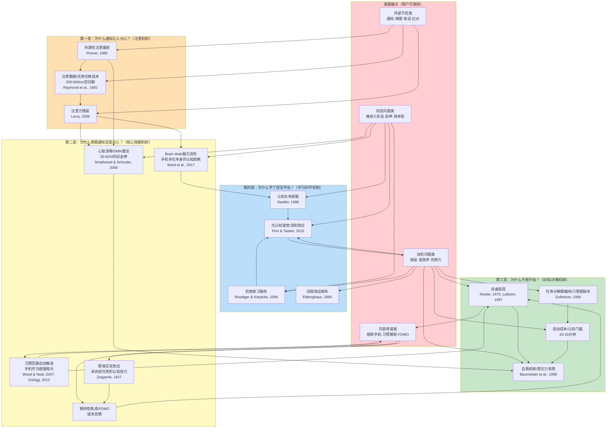

# 第2章：用户痛点的第一性溯源

## 2.1 表面痛点清单与分类

当我们悬置对"学习模式应该是什么"的先入之见，直接观察用户在手机上学习时的真实抱怨和行为表现，可以将表面痛点归纳为四大类：外部干扰类、内部诱惑类、状态问题类、动机问题类。这些痛点不是孤立存在的——它们是同一棵"问题树"上不同高度的枝叶，本节先罗列这些可观测的表层现象，后续章节再逐层向下挖掘其认知根源。

### 2.1.1 外部干扰类

这是用户最容易感知、也是现有产品最关注的一类痛点：
1. **消息通知突然打断**：微信/短信/邮件/应用推送的声音、震动、弹窗在学习过程中突然出现，"叮"的一声注意力就被拉走
2. **红点持续焦虑**：即使关掉声音，App图标上的红色角标、锁屏上的通知预览仍然在视线范围内持续提示"有未读消息"
3. **电话强制插入**：来电直接全屏打断，无论你在学什么都被迫暂停，接完电话后很难立刻回到之前的状态
4. **弹窗广告/更新提示**：免费学习App中的插屏广告、系统更新提示、App评分弹窗在最不恰当的时候出现
5. **他人消息催促**："在吗？""回一下消息"——社交压力让人无法安心忽略消息，担心错过重要的事

### 2.1.2 内部诱惑类

这是比外部干扰更隐蔽的一类痛点，干扰源来自用户内心：
1. **"就看一眼"的冲动**：学着学着手就自动伸向手机，想解锁看看有没有新消息、刷刷朋友圈
2. **习惯性解锁-刷App序列**：拿起手机本来想查个单词，结果解锁后习惯性点开微信、刷10分钟朋友圈才想起本来要做什么
3. **学习内容关联诱惑**：查资料时被相关推荐链接吸引，从一个知识点跳到另一个不相关的内容，偏离原定学习轨道
4. **短视频/游戏的即时满足渴望**：学习时脑子里不断浮现"刷5分钟短视频放松一下""打一局游戏奖励自己"的念头
5. **信息饥渴/FOMO**：害怕错过热点新闻、朋友圈动态、群里的有趣讨论，觉得"几分钟不看手机就会与世界脱节"

### 2.1.3 状态问题类

即使没有明显的内外部干扰，学习状态本身也会出问题：
1. **难以进入状态**：坐下来打开书/学习App，翻了10分钟还是"没进入状态"，脑子转不起来
2. **学着学着就走神**：眼睛盯着屏幕/书本，脑子已经飘到别的地方去了——想今天晚上吃什么、想昨天看的剧、想周末去哪玩
3. **学一会儿就累**：专注20-30分钟就感觉大脑疲劳、注意力涣散，无法持续深入思考
4. **学习效率低下**：坐了两小时，感觉自己"一直在学习"，但合上书回想不起任何实质内容，笔记记得工整但没往心里去
5. **频繁切换任务**：学一会儿数学、背一会儿单词、再看会儿视频，在不同任务间跳来跳去，哪个都没学透

### 2.1.4 动机问题类

这是最深层也最容易被忽视的一类痛点：
1. **拖延不开始**：明明知道该学习了，坐在书桌前就是不想开始——先喝杯水、再整理下桌子、刷会儿手机"等状态好"，一两个小时就过去了
2. **开始后容易放弃**：学了十几分钟觉得"太难了""好无聊"，就停下来去做别的了
3. **"伪努力"自我欺骗**：开着学习视频但人在走神、抄了满满一本笔记但没理解、在图书馆坐一下午但大部分时间在刷手机——看起来很努力但自己知道没学会
4. **没有即时反馈**：学了很久看不到进步，不知道自己学会了没有，缺乏继续下去的动力
5. ** guilt与焦虑的恶性循环**：没学习时内疚焦虑，带着焦虑开始学习又无法专注，学不进去更内疚——形成负面循环

这些表面痛点构成了用户可感知的问题全貌。但第一性原理分析要求我们不能停留在表面——"通知让人分心"是现象，不是原因。下一节开始，我们将连续追问五个"为什么"，逐层挖掘这些痛点背后的认知机制。

## 2.2 第一层溯源："为什么消息通知让人分心？"

外部干扰是最直观的痛点，我们从这里开始第一层溯源。消息通知之所以能轻易打断学习，不是因为用户"意志力薄弱"，而是因为它们精准利用了人类注意力系统的三个固有机制——这些机制是人类在数百万年进化中形成的生存优势，在智能手机时代反而变成了学习的障碍。

### 2.2.1 外源性注意捕获机制

Michael Posner (1980)在其经典的注意定向研究中，首次系统区分了两种注意定向方式：**内源性注意（endogenous attention）**和**外源性注意（exogenous attention）**。内源性注意是目标驱动的、自上而下的、需要意志努力的——你主动决定把注意力集中在学习材料上，这就是内源性注意在起作用。外源性注意是刺激驱动的、自下而上的、自动发生的——外部刺激的突然变化会自动捕获你的注意力，不需要你有意识地决定去注意它。

外源性注意捕获有明确的进化意义：在原始环境中，草丛中的突然移动、身后的异常声响可能意味着捕食者逼近，那些能自动将注意转向这些刺激的个体有更高的生存概率。智能手机的通知系统，正是精准利用了这套进化而来的"预警系统"：

- **声音**：通知提示音是突然出现的新异听觉刺激，听觉系统对突然变化的声音极其敏感——声像记忆（echoic memory）会在2-4秒内保持这些声音，立即触发注意转向（Cherry, 1953的鸡尾酒会效应也证明：即使在专注对话时，你的名字或其他重要刺激也能自动捕获注意）
- **震动**：触觉通道的突然刺激同样会自动捕获注意，而且震动具有"私密性"——只有你能感受到，不像铃声那样会打扰他人，因此被更频繁地使用
- **弹窗**：视觉通道的突然运动（新窗口弹出、状态栏消息滚动）会触发视觉系统的运动检测机制，外源性注意立即被吸引
- **红点**：红色在进化中与血液、危险、重要信号关联，视觉系统对红色尤其敏感；红点是持续存在的视觉突出刺激，只要在视野内就持续"拉"着你的注意

关键在于：**外源性注意捕获是完全自动的，发生在你意识到之前**。你无法"决定不注意到"一个突然响起的声音或弹出的窗口——在你有意识地决定"我要忽略它"之前，你的注意已经被它捕获了至少200-300毫秒。这不是意志力问题，而是神经反射——就像你无法"决定不眨眼"当一个物体快速飞向你的眼睛。

### 2.2.2 注意瞬脱与任务切换成本

如果说注意捕获是"被打断的起点"，那么**注意瞬脱（attentional blink）**则解释了为什么"只是看一眼通知"的代价比你想象的大得多。Raymond, Shapiro & Arnell (1992)在快速系列视觉呈现（RSVP）实验中发现了一个惊人的现象：当被试成功识别了第一个目标刺激后，在之后200-500毫秒内呈现的第二个目标刺激往往无法被识别——仿佛注意"眨了一下眼"。

注意瞬脱反映了注意的"脱离-转移-投入"三阶段时间成本：注意从当前任务（学习）上脱离需要时间，转移到新刺激（通知）上需要时间，处理完新刺激后再重新投入回原任务又需要时间。这个过程不是瞬间完成的——每一次任务切换，都存在200-500毫秒的"注意空白期"，期间你无法有效处理任何信息。

但这还不是全部代价。更严重的是**工作记忆上下文的丢失**。如Task 2所述，工作记忆只有4±1个信息组块的容量，当你在学习时，这4个组块都被当前的学习内容占据——你正在理解的概念、刚刚推导到一半的逻辑、与当前内容相关的先备知识。当注意被通知捕获、切换到消息内容时，工作记忆中之前保持的学习上下文会被迅速覆盖清空。等你"回完消息"回来时，你需要重新激活那些先备知识、重新推导到一半的逻辑、重新建立思考上下文——这个重建过程不是几秒就能完成的，往往需要数分钟。

这就像你在用电脑写文章，突然弹出一个窗口把你当前写的内容全部清空，等你关掉弹窗回来，需要重新打开之前的文档、找到上次写到的位置、回忆之前的思路——"回一条消息就回来"之所以这么难，是因为你的大脑"工作台"已经被清空了，重新摆好工具和材料需要时间。

### 2.2.3 注意力残留效应

Sophie Leroy (2009)的研究发现了另一个加剧切换成本的机制：**注意力残留（attention residue）**。当人们从任务A切换到任务B时，注意力并不会完全从任务A转移——部分注意力仍然"残留"在任务A上，表现为任务A相关的想法仍在工作记忆中活跃，导致任务B的表现下降。而且，任务切换越频繁，残留越多，后续任务的表现下降越严重。

这解释了一个常见现象：你"回完一条消息"回到学习中，但脑子里还在想刚才的对话内容——"他说那句话是什么意思？""我刚才那么回复合不合适？""接下来他会说什么？"这些残留的想法占据了宝贵的工作记忆容量，导致你虽然"人回来了"，但认知资源并没有完全回来。更糟糕的是：如果你回完消息后又刷了两分钟朋友圈，那么不仅有消息的注意力残留，还有朋友圈内容的注意力残留，两层残留叠加，能用于学习的工作记忆资源就更少了。

注意力残留效应还解释了为什么"回一条消息就回来"往往演变成"回了十条消息刷了半小时朋友圈"：当你切换到微信后，微信本身的信息会触发更多的注意力残留——未读的群聊消息、朋友圈更新、公众号推送——每一个都是新的未完成任务，产生新的认知张力，把你越拉越深。等你终于"回来"时，可能半小时已经过去了，而你还需要重新付出10-15分钟的启动成本才能进入学习状态。

现在我们可以回答"为什么消息通知让人分心"：不是因为你不专心，而是因为（1）通知利用外源性注意机制自动捕获你的注意——这是神经反射，不是意志力能完全阻止的；（2）每一次切换都存在注意瞬脱和工作记忆清空的代价；（3）注意力残留让你即使回来也无法立刻全身心投入。但这还只是第一层溯源——如果这就是全部问题，那"屏蔽通知"应该能完全解决分心问题。但用户经验告诉我们：即使把手机调到勿扰模式、通知全部关掉、甚至手机反过来扣在桌上，你还是可能分心。这就把我们带到更关键的第二层溯源。

## 2.3 第二层溯源："为什么屏蔽了通知还是会分心？"

这是本章最关键的一节，也是对现有产品设计最具颠覆性的一节。如果"屏蔽通知=解决干扰"的假设成立，那么勿扰模式/专注模式应该是完美的解决方案。但无数用户的亲身经验告诉我们：即使手机不响不亮不弹窗、即使你把它反过来扣在桌上、甚至即使你关了机，分心仍然会发生。"为什么屏蔽了通知还是会分心？"——对这个问题的回答，需要五个独立但相互强化的认知机制，它们共同构成了比外部通知更深层、更隐蔽、现有产品几乎完全没有解决的干扰源。

### 2.3.1 Brain drain效应：手机存在本身的认知损耗

2017年，德克萨斯大学奥斯汀分校的Adrian Ward及其同事在《Journal of the Association for Consumer Research》上发表了一项震惊学界的研究：**仅仅是智能手机的存在本身，就足以降低可用认知容量，导致认知表现下降——即使手机是关机的、即使屏幕朝下、即使你完全没有碰它**。研究者将这种效应命名为"brain drain"（脑力流失）。

Ward等人的实验设计精巧而严谨：他们招募了近800名被试，随机分配到三种实验条件下：
1. **手机在桌面上**：手机放在被试面前的桌上，屏幕朝下
2. **手机在包里/口袋里**：手机放在被试身边的包或口袋里，不在视线内但同一房间
3. **手机在另一个房间**：手机被研究者拿到房间外面

在这三种条件下，被试完成两项认知功能测试：**操作广度任务（OSPAN）**测量工作记忆容量，**瑞文标准推理测验（Raven's Progressive Matrices）**测量流体智力。实验过程中，手机全程保持静音、不会有任何通知，被试也被明确要求不要碰手机。

实验结果令人震惊：
- "手机在另一个房间"组的认知表现显著最好
- "手机在包里/口袋里"组表现次之
- "手机在桌面上"组表现最差——即使手机是关机的、屏幕朝下的！

效应量有多大？后续研究（Ward et al., 2017; Thornton et al., 2014）重复验证发现，手机在视线内导致的认知容量下降，相当于**一整晚没睡觉**造成的认知损伤，或者相当于**持续进行高强度脑力劳动后的疲劳状态**的损伤程度。而且，这种效应与被试的自我报告完全无关——绝大多数被试坚称"手机没有影响我"，但客观测试数据明确显示他们的表现下降了。**你意识不到自己的认知资源被消耗了，这正是brain drain效应最危险的地方。**

机制解释是什么？研究者提出，手机作为我们生活中最重要的信息枢纽和社交连接工具，已经成为一个**具有高度奖赏相关性的刺激**——它意味着可能有重要的人联系你、可能有有趣的信息、可能有需要你处理的事。你的大脑，具体来说是负责监控环境中重要刺激的前额叶-顶叶注意网络，会**持续在后台监控手机的状态**：有没有亮屏？有没有震动？有没有新消息？这种后台监控不是你有意识进行的——它发生在意识层面之下，但持续消耗中央执行系统的有限资源。

这就像你的手机后台运行着一个你看不到的App，它持续占用CPU和内存——你在前台用其他App时感觉不到它，但你的系统整体变慢了、电池掉得更快了。大脑的"后台手机监控进程"就是这样：你在前台专注学习时意识不到它，但它持续占用工作记忆容量（可能占用了宝贵的4个组块中的1个），导致你能用于学习本身的认知资源减少了20-25%。

关键的调节变量是**物理距离和可见性**：当手机在视线内、手边时，后台监控强度最高，brain drain效应最强；当手机放在包里/口袋里，虽然仍在同一房间，但因为不在视线内、需要刻意去拿，监控强度下降，效应减弱；当手机放在另一个房间，物理距离产生了"眼不见心不烦"的效果——大脑知道就算有消息你也无法立刻处理，后台监控进程基本停止，brain drain效应消失。

这一发现对现有学习模式设计构成了根本挑战：**软件层面的通知屏蔽完全无法解决brain drain问题**——只要手机还在你面前的桌上、在你手边，哪怕它关了机、哪怕你开了勿扰模式，你的大脑仍然在为它消耗认知资源。这就是为什么"把手机反过来扣在桌上"仍然不够——它仍然在你手边，你的大脑仍然知道它在那里。

### 2.3.2 心智游移：内部产生的分心

如果说brain drain是手机存在导致的"外部后台干扰"，那么**心智游移（mind-wandering）**就是完全从内部产生的分心——即使没有任何外部刺激、即使手机在另一个房间，你仍然会走神。

Jonathan Smallwood和Jonathan Schooler (2006)在《Psychological Bulletin》上发表的里程碑综述系统总结了心智游移研究：心智游移是指注意力从当前外部任务转移到内部生成的想法和感受上，是一种极其普遍的意识现象。经验取样研究表明，**人们在清醒时的30%-50%时间里都在走神**——也就是说，你以为自己在专注工作学习，但实际上有接近一半时间你的脑子在想别的事。

心智游移与大脑的**默认模式网络（Default Mode Network, DMN）**激活密切相关（Raichle et al., 2001）。DMN是大脑在没有专注于外部任务时、处于"静息状态"时激活的大尺度脑网络，它参与自我反思、回忆过去、想象未来、思考他人想法等内部导向的认知活动。DMN与负责专注外部任务的执行控制网络（ECN）呈**反相关关系**——一个激活时另一个往往被抑制。专注学习需要ECN持续激活、DMN被抑制；而走神就是DMN重新激活、ECN活动下降的状态。

心智游移不是"坏"现象——它有重要功能：计划未来、整合记忆、创造性问题解决、社会认知理解都需要DMN激活和一定程度的心智游移。但对于需要持续专注的深度学习来说，心智游移是致命的：当你走神时，工作记忆被内部生成的想法占据（想晚饭、想周末、想昨天的对话），学习内容的加工完全停止。更糟糕的是，**元认知对心智游移的觉察存在严重滞后**——你通常不是"一开始走神就知道自己走神了"，而是走神了几分钟之后才突然反应过来："我刚才在想什么？怎么看到这里来了？"

心智游移的发生概率受几个因素影响：
1. **任务难度**：任务太简单（无聊）或太难（挫败）都会增加走神，难度与技能匹配时（心流状态）走神最少
2. **动机水平**：对当前任务越不感兴趣、动机越低，越容易走神
3. **疲劳和压力**：疲劳、焦虑、压力会消耗执行控制资源，ECN无法有效抑制DMN，走神增加
4. **练习程度**：越熟练的任务越不需要持续ECN控制，越容易走神——这就是为什么做高度熟练的事（如开车走熟悉的路）时特别容易走神
5. **外部干扰频率**：频繁的外部干扰会打破ECN的稳定激活，每次被打断后重新进入专注前都更容易走神——外部干扰和内部分心不是独立的，它们互相强化

关键在于：**即使完全没有外部干扰，心智游移仍然会发生**——这是大脑的默认运作模式。但现有学习模式产品几乎完全忽略了心智游移——它们认为只要挡住外部干扰就万事大吉，却没有提供任何帮助用户觉察走神、温和地将注意力拉回来的机制。更糟糕的是，某些严格的锁机、倒计时设计反而可能增加压力和焦虑，消耗ECN资源，导致更多心智游移。

### 2.3.3 习惯回路自动触发：手机作为超强暗示线索

Wendy Wood和David Neal (2007)在《Psychological Review》上系统阐述了习惯的心理学机制，Charles Duhigg (2012)在《习惯的力量》一书中将其普及为广为人知的**习惯回路模型**：习惯由三个要素构成——暗示（cue/trigger）→ 惯常行为（routine）→ 奖赏（reward）。当这个回路重复足够多次后，暗示和惯常行为之间建立起牢固的神经连接——只要暗示出现，惯常行为就会被自动触发，不需要有意识的决策、不需要意志力参与，甚至你自己都意识不到它发生了。

智能手机是人类有史以来最强的习惯暗示聚合体。拿起手机、看到手机、摸到手机——这些动作本身，已经成为一整套高度自动化的手机使用习惯回路的"暗示"：
- **暗示**：手机在手中/在视线内/解锁屏幕
- **惯常行为**：自动点开微信→下拉刷新朋友圈→切换到微博→刷10分钟短视频
- **奖赏**：获得社交信息、新异刺激、短暂的放松和愉悦

经过成百上千次重复后，这个回路变得高度自动化：你的手可能在你意识到之前就已经解锁了手机、点开了微信。很多人都有过这样的经历：你拿起手机本来想查一个单词、设一个闹钟，但等你反应过来时，你已经在刷朋友圈了——你完全不记得自己是怎么打开微信的，这就是习惯回路自动触发的典型表现。习惯行为发生在System 1（快思考）层面，是自动的、无意识的、低能耗的——System 2（慢思考，负责理性决策和自我控制）甚至还没来得及介入，行为已经发生了。

更严重的是，手机的**多用途特性**让习惯回路变得格外强大。手机不是只用来做一件事的工具——它是通讯工具、娱乐中心、信息平台、钱包、相机、导航、游戏机……当你拿起手机时，你不是只有一个习惯回路被触发，而是几十个甚至上百个习惯回路同时被激活：有人习惯用手机看时间结果顺便刷了微信，有人习惯用手机查资料结果刷起了短视频，有人只是想解锁看一眼有没有消息结果玩了半小时游戏。

这解释了为什么"锁屏""白名单"等设计效果有限：当习惯回路被触发时，用户会主动绕过这些约束——强制锁机就重启手机，App白名单就切换到其他App。因为习惯回路的力量比短期意志力强大得多。

要对抗习惯回路，靠"意志力忍住"是效率最低的方式。根据Wood & Neal (2007)的研究，改变习惯最有效的方法不是"抑制惯常行为"，而是**改变环境中的暗示线索**——如果暗示不出现，习惯回路就不会被自动触发。这就是为什么把手机放到另一个房间效果这么好：物理上移除了"手机在眼前/手边"这个最强的暗示，解锁-刷App的习惯回路根本不会被触发。

### 2.3.4 蔡格尼克效应：未完成任务的认知张力

Bluma Zeigarnik (1927)在柏林大学做了一个经典实验：她让被试做一系列简单任务（拼图、算术、手工等），其中一半任务允许被试完成，另一半任务在中途被打断。事后回忆时，被试对未完成任务的记忆是已完成任务的约两倍——未完成的任务仿佛在脑海中"挥之不去"，持续占据心理资源。这就是**蔡格尼克效应**：人们对未完成或被中断的任务有更强的记忆，并且会产生一种持续的"认知张力"，直到任务被完成或被明确"搁置"。

智能手机是蔡格尼克效应的完美放大器：
- **未读消息/未接来电**：每一条未读消息都是一个指向你的未完成社交任务——你需要回复、需要回应、不回复可能有社交后果
- **未读邮件/未处理通知**：工作邮件、App推送、待办事项提醒都是"需要你处理"的未完成任务
- **没看完的朋友圈/短视频**：刷到一半的内容、正在进行的对话、看到一半的视频，都是未完成的信息消费
- **未回的消息**：哪怕你只是"看到了"消息但没来得及回，这个未完成任务就会持续在你脑中萦绕

关键在于：**即使你关掉了通知，这些未完成任务仍然存在**。你知道微信里可能有人找你、可能有重要消息、可能有有趣的群聊——这种"有什么事没处理"的认知张力，即使手机不响不亮，也会持续拉扯你的注意力。你的大脑会不断产生"要不要看一眼手机确认一下有没有重要事"的冲动——这不是你意志力薄弱，而是蔡格尼克效应在起作用：未完成任务产生的认知张力必须得到释放，否则它会一直占用后台认知资源。

这也解释了为什么"学完习再看手机"有时反而更难：你学习的时候，脑子里一直悬着"手机里可能有什么事"这个念头，这个未完成的预期本身就在持续消耗认知资源。

### 2.3.5 期待性焦虑："会不会有重要消息找我"的持续心理负荷

与蔡格尼克效应密切相关但又独立的一个机制是**期待性焦虑（anticipatory anxiety）**。智能手机让我们处于一种"永远在线、永远可及"的社会规范中——别人发消息给你，就期待你能及时回复。如果长时间不回复，可能会被认为"不礼貌""失联""不重视对方"。这种社会规范产生了一种持续的低水平焦虑："如果我现在不看手机，会不会有人找我有急事？会不会错过重要的工作消息？会不会让朋友生气？"

这种期待性焦虑有几个特点：
1. **它是面向未来的**：它不是关于已经发生的事（如未读消息），而是关于"可能发生但还没发生"的事
2. **它是概率性的**：绝大多数时候根本没有重要消息，但"万一有呢"这个小概率可能性就足以持续消耗心理资源
3. **它与手机依赖程度正相关**：越依赖手机进行社交和工作的人，这种期待性焦虑越强
4. **它在"手机就在身边但你不看它"时最强**：如果你完全无法接触手机（比如在飞机上、在考试中），你反而能放下心来——因为你知道就算有消息你也看不到，没有选择就没有焦虑。但如果手机就在你手边，你"可以"看但"选择"不看，这种焦虑会持续存在，因为你随时可以选择打破自己的决定

期待性焦虑可以看作是一种特殊的**FOMO（Fear of Missing Out，错失恐惧）**——害怕错过社交机会、重要信息、紧急事件。它持续激活大脑的威胁检测系统，让你无法完全放松地专注于学习——你的一部分注意力始终"竖起耳朵"在监听有没有重要消息的信号。

---

现在我们可以完整回答"为什么屏蔽了通知还是会分心"这个关键问题：**至少有五个独立机制在同时起作用**：
1. **Brain drain效应**：手机存在本身（哪怕关机屏幕朝下）就让大脑持续后台监控，消耗工作记忆资源
2. **心智游移**：大脑默认模式网络的自然倾向——30-50%时间走神是正常的，即使没有任何外部干扰
3. **习惯回路自动触发**：手机作为超强暗示线索，看到/摸到手机就自动触发解锁-刷App的习惯序列
4. **蔡格尼克效应**：未读消息/未完成任务产生持续认知张力，即使没有通知你也知道那里有未处理的事
5. **期待性焦虑**："会不会有重要消息找我"的持续低水平焦虑和错失恐惧

这五个机制共同作用，解释了为什么"免打扰"远远不够——现有专注模式产品只解决了2.2节的第一层问题（外部通知的外源性捕获），完全没有触及2.3节的这五个深层机制。这是现有产品最大的盲区。

但还有更深层的问题需要回答：就算我们解决了所有内外部干扰、让手机完全不造成认知损耗，还有一个更根本的问题——很多时候，用户甚至根本"不想开始"学习。这就把我们带到第三层溯源。

## 2.4 第三层溯源："为什么明明知道该学习却不开始？"

所有干扰问题的前提是：你已经开始学习了，然后被各种干扰打断。但更常见、更根本的痛点是：你明明知道自己应该学习、知道学习很重要、也有时间学习，但就是拖延着不开始——刷手机、整理桌子、喝水、"再等五分钟"，几个小时就过去了。为什么？这同样不是"懒惰""意志力差"这么简单的道德评判，背后有四个相互交织的行为经济学和认知机制。

### 2.4.1 双曲贴现：即时5分钟刷手机的快乐 > 2小时学习的延迟收益

**双曲贴现（hyperbolic discounting）**是行为经济学中最稳健、证据最充分的发现之一。传统经济学假设人们对未来收益的贴现是指数型的——未来的收益按照固定比例随时间贬值。但George Ainslie (1975)和David Laibson (1997)等人的研究表明，人类的时间贴现实际上是**双曲型**的：人们对"现在就能获得"的奖赏有极强的偏好，这种偏好强度远超指数贴现模型的预测。

具体来说：当两个奖赏都在遥远的未来时，人们能做出理性选择——"100天后获得1000元"比"100天后获得500元"好，几乎所有人都会选前者。但当小的奖赏"现在"就能获得时，选择就会反转——很多人会选择"现在获得50元"而不是"明天获得100元"，尽管明天的收益是现在的两倍。双曲贴现曲线的特征是：在"当下"这个时间点，主观价值有一个极其陡峭的下跌——离你越近的奖赏，主观价值被高估得越厉害。

这完美解释了学习拖延：
- **刷5分钟手机的快乐**是**即时的、确定的、现在就能获得**的奖赏——多巴胺立即释放，你立刻就能感到放松和愉悦
- **学习2小时后的成长**是**延迟的、不确定的、遥远的**收益——你可能要几周甚至几个月后才能看到学习带来的成果（考试成绩提高、技能提升、工作晋升），而且这个收益不是100%确定的（你可能学了但没学会，可能学会了但没用上）

在双曲贴现的作用下，当你坐在书桌前面临"现在开始学习"还是"先刷10分钟手机"的选择时，你大脑中的价值计算是这样的：刷手机的快乐**现在就在眼前**，主观价值被无限放大；学习的收益在遥远的未来，主观价值被严重贴现。尽管从理性上你知道"学习2小时的长期价值远大于刷10分钟手机的短期快乐"，但在当下的决策点，双曲贴现让**即时小奖励总是战胜延迟大奖励**——这不是你"不懂道理"，而是人类大脑奖赏系统的固有运作方式。

更糟糕的是，这不是一次性决策——你不是只需要在"开始学习前"抵抗一次诱惑。在学习过程中，每一分钟你都在面临同样的选择："我是继续学这个困难的东西，还是现在就拿起手机刷一下？"每一个这样的决策点，双曲贴现都在把你推向即时满足。靠意志力在每一个决策点都战胜双曲贴现，就像在每一个路口都逆着人流走——你或许能坚持几个路口，但很快就会精疲力竭。

### 2.4.2 启动成本/认知门槛：进入专注状态需要10-15分钟

如Task 2第1.4.4节详细分析的，进入深度专注/心流状态不是瞬间完成的，而是需要一个**启动期**——通常需要10-15分钟的持续专注，大脑才能完成从DMN主导到ECN主导的切换、激活相关先备知识、建立当前任务的认知上下文、抑制无关想法。

这个启动期是一个**必须预先支付的固定成本**——就像你开车前必须先热车、飞机起飞前必须在跑道上加速一段距离才能升空一样。你必须先付出10-15分钟的"入门费"，才能开始获得深度学习的收益。而且，如果你在这10-15分钟内被打断，你之前支付的启动成本就全部作废——需要重新支付一次。

大脑对"需要预先支付成本才能获得收益"的活动有本能的回避倾向——这就是**延迟满足困难**的本质。刷手机、看短视频几乎不需要启动成本：解锁、点开App、立即获得刺激和快乐——0启动成本，即时奖赏。而学习需要先"付费"——坐下来、打开书/学习App、熬过最初10-15分钟的"没进入状态"期，才能开始获得学习的收益。

这就解释了一个常见现象：一旦你度过了启动期、真正进入学习状态，继续学下去反而没那么难——你甚至可能"学进去了"不想停下来。但最难的就是**开始那一下**——因为你本能地知道开始意味着要先支付10-15分钟的"启动成本"，而且这个成本在当下是确定的、需要立刻付出的，而收益在未来是不确定的。双曲贴现再次发挥作用："现在付出10分钟痛苦"的主观成本，在当下的决策点被放大，让你本能地回避开始。

这也解释了为什么"再等五分钟就开始"是一个陷阱：你等待的不是"状态变好"，而是在推迟支付启动成本——但启动成本不会因为你等待就减少或消失，你等得越久，双曲贴现对即时快乐的偏好越强，开始就越难。

### 2.4.3 自我损耗/自我控制资源：意志力是有限的

Roy Baumeister及其同事(1998)提出的**自我损耗理论（ego depletion）**虽然近年来存在一些重复验证争议，但其核心洞见仍然具有很强的解释力：**自我控制（意志力）是一种有限的资源，类似于肌肉力量——使用后会疲劳，需要休息才能恢复**。

所有需要自我控制的行为都消耗同一资源池：
- 抑制冲动（忍住不刷手机、不吃零食）
- 情绪调节（忍住不发脾气、在烦躁时强迫自己平静）
- 决策（做选择、权衡利弊）
- 主动思考（解决难题、理解困难概念）
- 坚持（在疲劳/挫败时继续做不喜欢的事）

关键问题在于：**学习本身就是一项高度消耗自我控制资源的活动**——理解困难概念需要自我控制，在挫败时坚持需要自我控制，保持专注需要自我控制。而"开始学习"这个决定本身，还需要额外消耗自我控制资源来克服启动成本、抵抗即时诱惑。如果你一开始就把意志力用在"忍住不刷手机"上，那么你能用于学习本身（理解、思考、解决问题）的意志力就减少了。

对比一下"刷手机"和"学习"的意志力消耗：
- **刷手机**：完全是System 1主导的自动化行为，习惯回路自动运行，不需要抑制冲动、不需要主动思考、不需要坚持——**几乎不消耗意志力**
- **开始学习**：需要抑制刷手机的冲动、需要做出"现在开始"的决策、需要支付启动成本——**大量消耗意志力**

当你工作/学习了一天、意志力已经消耗得差不多了的时候，让你"现在开始学习"几乎是不可能的——不是你不想学，而是你的意志力"电池"已经没电了，无法支持你克服启动成本和即时诱惑。这也解释了为什么"靠意志力坚持学习"往往不可持续——意志力是有限资源，你可以靠它坚持一天、一周，但不可能靠它永远坚持下去。

好的设计应该是让"不分心""开始学习"不需要消耗意志力，成为默认状态，把宝贵的意志力资源留给学习本身——理解困难概念、解决难题、创造性思考。但现有学习模式设计往往反其道而行之：严格的锁机、频繁的"你确定要退出吗"弹窗、惩罚机制（植物枯死），这些设计反而让用户需要消耗更多意志力来抵抗"退出专注模式"的诱惑，进一步加剧自我损耗。

### 2.4.4 任务分解模糊："学习"是一个模糊的大目标

Peter Gollwitzer (1999)的**执行意图（implementation intentions）**研究揭示了一个影响目标达成的关键因素：仅仅有"我要学习"这样的目标意图是不够的，你还需要有"我在什么时间、什么地点、用什么方式、具体做什么"的执行意图——即"如果-那么"计划（if-then plans）。

Gollwitzer的实验表明，仅仅是让被试写下"我将在X时间Y地点做Z行为"这样具体的执行意图，就能将目标达成率提高2-3倍。为什么？因为模糊的目标（"我要学习""我要健身"）不直接指向具体行动，大脑无法自动启动执行——你需要每次都做出决策："现在学什么？怎么开始？从哪里开始？"每一个这样的决策都消耗意志力、都为拖延创造了空间。

"学习"是一个尤其模糊的大目标——它可以意味着看书、做题、背单词、看视频、写作业、复习、预习等等。当你告诉自己"我要学习了"时，你的大脑面对的是一个模糊的、未定义的任务，没有明确的第一步行动。这种模糊性本身就是行动的障碍——大脑面对模糊的大任务时会本能地回避，因为它不知道该从何入手、需要付出多少成本。

对比一下：
- "我要刷手机"是一个极其具体、路径清晰的任务——拿起手机→解锁→点开常刷的App→开始刷。不需要思考、不需要决策、路径已经被习惯千百次重复。
- "我要学习"是一个模糊的大目标——学什么？用什么学？学多久？学到什么程度？第一步做什么？这些问题都没有答案，每一个问号都是一个决策点，每一个决策点都消耗意志力、都为拖延创造机会。

这解释了为什么"待办清单"有时候反而增加焦虑：如果待办事项写的是"学习数学"这种模糊大任务，它不会帮你开始，反而会因为看起来"很大、很吓人"让你更想回避。而当你把任务分解为具体的、可立即执行的小步骤——"先做第3章的前5道选择题"——行动门槛就大大降低了，因为大脑不需要思考"第一步做什么"，直接执行就可以。

现在我们可以回答"为什么明明知道该学习却不开始"：不是因为你懒、不是因为你不懂道理，而是因为四个机制同时在阻碍你开始：（1）双曲贴现让即时刷手机的主观价值远大于学习的延迟收益；（2）学习需要预付10-15分钟的启动成本，大脑本能回避需要预付成本的活动；（3）开始学习本身消耗大量意志力，而意志力是有限资源；（4）"学习"是模糊的大目标，缺乏具体执行意图，大脑不知道从何入手。

但即使你成功开始了、也没有内外部干扰，还有最后一层痛点：很多时候你"学了很久"，但感觉自己"没学会"。这就是第四层溯源要回答的问题。

## 2.5 第四层溯源："为什么学了很久感觉没学会？"

前三层溯源回答了"为什么开始不了""为什么被打断""为什么分心"的问题，但假设你克服了所有这些障碍——你成功开始了学习、在学习过程中没有被打断、也没有明显分心——你坐了整整两个小时看书/看视频/记笔记，但合上书/关掉视频后，你发现自己好像什么都没记住、什么都没理解，感觉这两小时"白学了"。这是最令人沮丧的一类痛点，也是"伪努力"的核心——你花了时间、你看起来很努力、你没有分心也没有拖延，但学习就是没有发生。为什么？这同样有四个认知机制在起作用。

### 2.5.1 认知负荷超载：外在负荷挤占相关负荷

John Sweller (1988)的**认知负荷理论**将学习过程中的认知负荷分为三类：
1. **内在认知负荷（intrinsic cognitive load）**：由学习材料本身的复杂度决定——学习1+1=2内在负荷很低，学习量子力学内在负荷很高。这是学习本身必须付出的代价，无法消除。
2. **外在认知负荷（extraneous cognitive load）**：由不良的教学设计/界面设计带来的额外负荷——比如难懂的教材排版、频繁打断思路的界面元素、需要分心处理的无关信息。这是完全不必要的、应该被最小化的负荷。
3. **相关认知负荷（germane cognitive load）**：用于图式建构、深加工、理解的有益负荷——这是真正产生学习的认知投入，相关认知负荷越高，学习效果越好。

三者加起来的总和不能超过工作记忆的4±1组块容量上限——如果总负荷超过容量上限，学习就会失败。

手机本身就是一个巨大的**外在认知负荷**来源——即使你"在学习"，即使你没有分心去看手机：
- brain drain效应导致的后台手机监控持续占用工作记忆资源（约1个组块）
- 未完成任务（未读消息、未回消息）的蔡格尼克认知张力持续占用资源
- 期待性焦虑持续消耗中央执行系统资源
- 如果学习App本身设计不良，弹窗、广告、通知提示、花哨的界面元素都会带来额外的外在负荷

当这些外在负荷加起来占用了工作记忆2-3个组块时，留给内在负荷和相关负荷的容量只剩下1-2个组块——这足够你做简单的机械阅读、划线、记笔记这些浅加工活动，但完全不足以支撑需要深度加工的理解、推理、图式建构——因为这些活动需要同时在工作记忆中保持多个概念并建立联系，需要至少2-3个空闲组块。

你感觉"学了很久但没学会"，本质上是：你的工作记忆容量被外在认知负荷占满了，你只能进行最浅层次的信息加工——眼睛看到了文字、手写下了笔记、视频播放完了，但信息没有经过深加工，没有在长时记忆中留下牢固的痕迹。你花了时间，但相关认知负荷投入严重不足——这不是你的错，是认知容量被挤占后的必然结果。

### 2.5.2 检索练习缺失：反复阅读/观看≠学会

Henry Roediger和Jeffrey Karpicke (2006)在《Psychological Science》上发表的经典研究，彻底颠覆了"反复阅读=有效学习"的常识。他们的实验表明：**反复阅读给人"学会了"的感觉，但实际记忆保持效果远不如检索练习（retrieval practice）——即主动从记忆中提取信息（自测、回忆、合上书复述）**。这就是著名的"测试效应（testing effect）"。

在他们的实验中，被试分为两组学习同一篇文章：
- **反复阅读组**：反复阅读文章4遍
- **检索练习组**：读1遍文章，然后尝试尽可能多地回忆文章内容（自由回忆测试），如此重复3次"学习-回忆"循环

学习结束5分钟后测试，两组表现差不多；但2天后测试，检索练习组的记忆保持比反复阅读组好得多；1周后测试，差距进一步拉大——检索练习组记住了约60%的内容，而反复阅读组只记住了约40%。而且，被试对自己学习效果的主观判断正好相反：反复阅读组在学习结束时自信地认为自己"学得很好"，而检索练习组因为回忆过程很困难，觉得自己"没学好"——但实际记忆结果正好相反。

为什么反复阅读效果差？因为反复阅读主要产生**加工流畅性（processing fluency）**——你第二次读同一段文字时，因为对文字已经熟悉了，读起来很顺畅，这种流畅感让你误以为"我已经会了"。但这种流畅感只是因为你对文本的表面特征（字词、句子）变得熟悉，并不代表你理解了内容的深层含义，也不代表你能在不看文本时主动提取这些信息。

而检索练习（合上书回忆、自测、给别人讲）为什么效果好？因为（1）检索练习是"困难的"——提取过程本身就需要深度加工，会强化记忆痕迹（Karpicke & Roediger, 2008称之为"提取诱发重构"）；（2）检索练习能准确告诉你"哪些你没记住"——你回忆不起来的地方就是你需要再学习的地方，提供了精准的元认知反馈；（3）成功检索会让记忆痕迹在未来更容易被提取——每次提取都在强化神经通路。

手机上的学习尤其容易陷入"反复阅读/观看但不检索"的陷阱：
- 看学习视频是最被动的学习方式——你只需要"跟着看"，不需要主动提取任何信息，视频会一直播放下去，流畅感极强
- 在手机上做题时，不会做可以立刻看答案/提示，跳过了困难的提取过程
- 划线、高亮、抄笔记这些"看起来很努力"的行为，本质上都是阅读的变体——你是在处理眼前的信息，而不是从记忆中提取信息
- 手机上的学习内容往往被切得很碎（短视频、短文章），你还没来得及尝试回忆，下一个内容就来了

你感觉"学了很久但没学会"，很大程度上是因为你一直在做流畅的浅加工（反复读、反复看、划线抄笔记），没有进行困难的、真正有效的检索练习——你以为自己在学习，实际上只是在"熟悉学习材料"，熟悉不等于学会。

### 2.5.3 元认知错觉/流利效应：信息呈现流畅让人产生"我会了"的错觉

与检索练习缺失密切相关的机制是**元认知错觉（metacognitive illusion）**，特别是**流利效应（fluency effect）**带来的理解高估。

如Task 2第1.2.4节所述，人们对自己学习效果的判断高度依赖加工流畅性——信息呈现得越流畅、越容易理解、越"看着眼熟"，人们就越认为自己"学会了"。但这种判断往往是错误的。Finn & Tauber (2015)的综述总结了大量研究：学习者在几乎所有情况下都会**高估自己的理解程度和记忆效果**，这种高估在信息呈现流畅时尤其严重。

哪些因素会增加流畅感、导致"我会了"的错觉？
- **清晰的排版和美观的设计**：字体好看、排版清晰、配色舒适的学习材料读起来更流畅，让人误以为内容也更容易、自己理解得更好
- **视频讲解**：好老师的视频讲解会把复杂内容讲得通俗易懂、节奏流畅，你看的时候觉得"听懂了"，但这是讲师在帮你思考——讲师已经完成了最难的图式建构工作，你只是跟着走了一遍，并没有自己建构
- **高亮和色彩标记**：彩色高亮的重点内容看起来更醒目、更容易识别，产生流畅感，但高亮本身只是让信息"更容易被看到"，不是"更容易被记住和理解"
- **熟悉感**：同一个内容看第二遍、第三遍时产生的熟悉感很容易被误认为"学会了"
- **做笔记时的机械抄写**：手在动、字在写，这种活动感也会产生"我在学习"的错觉，但如果抄写时没有主动思考，笔记只是墨水在纸上的痕迹

手机上的学习App尤其擅长利用和放大流利效应——它们的UI设计得流畅美观、动画顺滑、交互反馈及时，视频老师讲得生动有趣，重点内容用鲜艳颜色高亮，学习体验非常"顺滑"。这种顺滑体验让你感觉"学习体验很好""我学进去了"，但实际上你可能只是被动地跟着流畅的体验走了一遍，没有经过自己的深度加工。合上书/关掉视频后，流畅感消失了，你才发现自己什么都没记住——但为时已晚。

### 2.5.4 间隔效应缺失：单次长时间集中学习不如间隔分散学习

Hermann Ebbinghaus (1885)在自己身上做了开创性的记忆实验，发现了著名的遗忘曲线：学习后遗忘立即开始，而且遗忘速度先快后慢——学习结束20分钟后忘记约40%，1天后忘记约60%，1周后忘记约75%。Ebbinghaus同时发现了对抗遗忘最有效的方法：**间隔重复（spaced repetition）**——在记忆即将遗忘时进行复习，比一次性集中学习（填鸭式学习）效果好得多。

后续大量研究（Cepeda et al., 2006的元分析包含254项研究、超过14000名被试）一致验证了**间隔效应（spacing effect）**的稳健性：对于同样的总学习时间，分散到多个间隔的学习时段，比集中在一个长时段学习，记忆保持效果好50%以上，而且学习间隔与记忆保持时间正相关——要记住1周的内容需要间隔1-2天复习，要记住1年的内容需要间隔数周复习。

为什么间隔效应这么强？目前的解释有几个：
1. **编码变异性**：在不同时间、不同情境下学习同一内容，会形成更多样的编码线索，提取路径更多，记忆更牢固
2. **巩固需要时间**：突触巩固（蛋白质合成、突触结构改变）发生在学习后数小时内，系统巩固需要数天到数月——集中学习没有给巩固过程留出时间
3. **提取难度的理想值**：间隔一段时间后再复习，你需要付出一定努力才能提取出记忆——这种"适度困难的提取"是最有效的记忆强化方式，比刚学完立刻重复效果好得多（这与检索练习效应是一致的）
4. **注意力衰减**：单次学习时间过长会导致注意力下降、心智游移增加，后面的时间学习效率急剧降低

而大多数人（包括大多数学习模式产品）的默认假设是："单次专注学习时间越长越好"——2小时比1小时好，4小时比2小时好。但间隔效应告诉我们：你一口气学4小时，不如分成两个2小时（中间间隔几小时或一天），或者四个1小时（分散在几天），总学习时间一样，但记忆效果好得多。

你感觉"学了一下午但没学会"，部分原因就是**单次学习时间过长导致边际收益递减**——前30分钟你确实在学习，中间30分钟你在走神和浅加工，最后1小时你只是"待在书桌前"，工作记忆已经疲劳，几乎没有产生有效学习。从认知科学角度看，连续学习超过45-60分钟后，学习效率已经降到很低的水平，继续"坚持"更多是在制造"我很努力"的幻觉，而不是在产生实际的学习效果。

但这并不意味着"碎片化学习"就是答案——间隔效应需要的是"有间隔的整块学习"，不是"刷两分钟手机学30秒"的碎片化。学习仍然需要足够长的连续时间块（至少25-30分钟）来度过启动期和进行深度加工，但不应该是无间断的3-4小时马拉松。

---

四层溯源到此完成。我们从最表面的"消息通知让人分心"开始，逐层向下挖掘：第一层发现了注意捕获和切换成本机制；第二层发现屏蔽通知仍然无效的五个深层机制（brain drain、心智游移、习惯回路、蔡格尼克效应、期待性焦虑）；第三层追溯到"不开始"的四个动机/决策机制（双曲贴现、启动成本、自我损耗、目标模糊）；第四层挖到了"学了但没学会"的四个学习科学机制（认知负荷超载、检索缺失、元认知错觉、间隔效应缺失）。下一节我们将把这些分散的机制整合为一个统一的映射表和层级图。

## 2.6 痛点-机制映射总表

经过四层溯源，我们从16个表面痛点向下挖到了17个底层认知/心理机制。这些机制不是孤立的——它们在时间序列上和因果链条上相互关联、相互强化，共同构成了"手机上学习为什么这么难"的完整因果网络。本节首先用表格建立表面痛点到深层机制的映射，然后用Mermaid图可视化完整的四层溯源层级结构。

### 2.6.1 痛点-机制映射表

| 痛点类别 | 表面痛点 | 第一层机制 | 第二层机制 | 第三/四层机制 |
|---|---|---|---|---|
| **外部干扰类** | 消息通知突然打断 | 外源性注意捕获（Posner, 1980） | 注意瞬脱（Raymond et al., 1992） 注意力残留（Leroy, 2009） | — |
| | 红点持续焦虑 | 视觉突出刺激捕获 | 蔡格尼克效应（Zeigarnik, 1927） 期待性焦虑 | — |
| | 电话强制插入 | 外源性注意捕获 | 工作记忆清空 注意力残留 | 启动成本重置 |
| | 弹窗广告/更新提示 | 外源性注意捕获 | 任务切换成本 | — |
| | 他人消息催促 | 外源性注意捕获 | 社交压力→期待性焦虑 | 双曲贴现（即时回复的压力） |
| **内部诱惑类** | "就看一眼"的冲动 | — | 习惯回路（Wood & Neal, 2007; Duhigg, 2012） 蔡格尼克效应 | 双曲贴现（Ainslie, 1975; Laibson, 1997） |
| | 习惯性解锁-刷App序列 | — | 习惯回路自动触发 | 双曲贴现 |
| | 学习时关联诱惑跳转 | 外源性注意捕获（相关推荐） | 注意力残留 任务切换成本 | 双曲贴现 |
| | 短视频/游戏渴望 | — | 多巴胺奖赏预期 | 双曲贴现 自我损耗（Baumeister et al., 1998） |
| | FOMO信息饥渴 | — | 蔡格尼克效应 期待性焦虑 | — |
| **状态问题类** | 难以进入状态 | — | — | 启动成本/认知门槛（10-15分钟） 自我损耗 |
| | 学着学着就走神 | 外部干扰触发 | 心智游移（Smallwood & Schooler, 2006） DMN激活（Raichle et al., 2001） | 认知负荷超载 |
| | 学一会儿就累 | — | 注意力资源持续消耗 ECN疲劳 | 自我损耗 |
| | 学习效率低下 | 外部干扰 | Brain drain（Ward et al., 2017） 认知负荷挤占 | 检索练习缺失（Roediger & Karpicke, 2006） 元认知错觉（Finn & Tauber, 2015） |
| | 频繁切换任务 | 任务切换成本 | 注意力残留 | 目标模糊→执行意图缺失（Gollwitzer, 1999） |
| **动机问题类** | 拖延不开始 | — | 习惯回路（刷手机是默认路径） | 双曲贴现 启动成本 自我损耗 目标模糊 |
| | 开始后容易放弃 | — | 心智游移增加 任务难度导致DMN激活 | 双曲贴现 自我损耗 挑战-技能不匹配 |
| | "伪努力"自我欺骗 | 行为投入≠认知投入 | — | 元认知错觉/流利效应 检索练习缺失 间隔效应缺失（Ebbinghaus, 1885） |
| | 没有即时反馈 | — | 奖赏延迟 | 双曲贴现 缺乏即时奖赏强化习惯回路 |
| | guilt焦虑恶性循环 | — | 焦虑消耗ECN资源 | 自我损耗 元认知监控失败 |

### 2.6.2 痛点层级溯源图（Mermaid）

下面的Mermaid图完整可视化了从表面痛点到根因的四层溯源结构，标注了每个机制的提出者和年代，以及关键的因果关系：

### 2.6.3 因果链条总结

从图中可以清晰看到几个关键的因果强化循环：
1. **外部干扰→注意捕获→任务切换→注意力残留→工作记忆清空→重新进入需要启动成本→更容易被新的干扰捕获**——这是一个分心的恶性循环，每被打断一次就更容易被下一次打断
2. **双曲贴现→即时诱惑→习惯回路强化→更难抵抗下一次诱惑→自我损耗加剧→意志力更弱→更容易屈服于即时诱惑**——这是拖延的恶性循环
3. **手机存在→brain drain→工作记忆资源被占用→只能进行浅加工→流利效应产生"学会了"错觉→没有检索练习→实际记忆脆弱→以为自己学会了但合上书就忘→伪努力感→guilt焦虑→焦虑消耗更多资源→认知负荷更超载**——这是"伪学习"的恶性循环

这些循环不是线性的因果链，而是**相互强化的反馈环**——打破其中任何一个节点都能削弱整个循环，但只解决一个节点（如只屏蔽通知）无法打破整个循环网络。

## 核心洞察总结：被现有产品忽略的深层痛点

完成四层溯源后，我们可以识别出至少三个被现有学习/专注模式产品普遍忽略、但根据认知科学证据至关重要的深层痛点，以及一个关键的"伪痛点"识别。

### 洞察1：Brain drain效应——手机存在本身就是干扰源，"免打扰"远远不够

这是本分析最具颠覆性的发现：**现有产品几乎100%的注意力都放在"屏蔽通知"上，但通知屏蔽只能解决第一层问题（外源性注意捕获），完全无法解决第二层最隐蔽、持续时间最长的brain drain效应**——只要手机还在你面前、在你手边、在同一房间，哪怕它关了机、哪怕通知全关、哪怕屏幕朝下，你的大脑仍然在持续后台监控它，消耗约20-25%的工作记忆容量。这种效应你意识不到，但它客观存在，持续降低你的认知表现。

**现有产品为什么忽略了这一点？**因为brain drain效应是"不可见"的——用户不会抱怨"我的大脑在后台监控手机"，他们只会抱怨"我学不进去""我效率低"，但不知道原因是什么。产品设计者也和用户一样，被自己的主观体验误导——"我把通知都关了，手机没打扰我，为什么还是学不好？"——因为认知科学告诉我们：你的主观体验是错的，手机存在本身就在影响你，只是你意识不到。

**设计含义**：真正有效的学习模式必须考虑**物理可见性和距离管理**——这不是软件能完全解决的问题，但软件可以引导和帮助用户：提示用户把手机放到视线外、放到另一个房间、或者用其他方式物理隔离手机。现有的"屏幕朝下才开始计时"功能（如Offscreen的深度专注模式）是一个正确方向的尝试，但还远远不够——它只解决了"视觉可见性"，没有解决"手边可及性"（手机还在你手边，你随时可以拿起来）。

### 洞察2：启动期脆弱性——前10-15分钟是生死线，现有设计没有提供针对性保护

如Task 2和本章分析，进入深度专注需要10-15分钟的启动期，这段时间是学习会话中最脆弱的阶段——ECN还没有稳定激活，DMN随时可能重新主导，任何干扰都会把你打回原点，需要重新支付启动成本。但现有学习模式产品几乎完全忽略了启动期的特殊性——它们用统一的保护强度对待整个学习会话，没有认识到前10-15分钟需要**最强级别的保护**，而度过启动期进入心流状态后，保护强度反而可以适当降低。

更糟糕的是，很多产品在启动期反而增加了用户的认知负担：开始专注前需要选时长、选白噪音、选主题、设置白名单、写今日目标——这些操作本身就在消耗启动期的宝贵认知资源，让你还没开始学习就已经疲劳了。

**设计含义**：学习模式应该对启动期（前10-15分钟）提供差异化的、最强级别的干扰保护；启动流程应该极简（一键开始，不需要设置任何参数）；启动期内应该有特殊的设计防止用户轻易退出（但不是强制锁机）；度过启动期后可以适当放松约束，允许用户查看重要消息等。

### 洞察3：注意力残留——"回一条消息就回来"是谎言，现有设计没有帮助"干净切换"

现有产品要么采取极端策略（完全锁机，不允许任何切换，导致用户逆反心理强、错过重要消息），要么完全不做任何处理（用户可以随时切换出去，但切回来时状态全丢）。它们都没有认识到：任务切换的最大代价不是"花了几秒回消息"，而是**切出去后注意力残留在其他任务上，切回来时工作记忆上下文丢失，需要重建**。

注意力残留效应意味着：如果用户确实需要回一条重要消息（比如家人有急事、工作有紧急情况），问题不是"是否允许回消息"，而是"如何帮助用户回完消息后干净地切换回来，不带注意力残留"。现有产品完全没有提供这种"切换辅助"——它们要么锁死不让切，要么放任不管，切回来后你得自己重新进入状态。

**设计含义**：如果用户必须在学习中途处理消息，学习模式应该帮助用户：（1）先标记当前学习进度和思考上下文（类似断点保存）；（2）快速处理消息后，提示用户做一个简短的"注意力重置"动作（比如深呼吸、回顾刚才学到哪里了）；（3）恢复学习上下文，帮助快速回到之前的状态。这比"要么完全不让切、要么切了就不管"的二元设计要有效得多。

### 伪痛点识别："没有白噪音"是解决方案倒置，不是真痛点

最后，我们需要识别一个被广泛误认为是痛点的**伪痛点**："学习需要白噪音/背景音乐才能专注"。很多学习类App把白噪音作为核心功能，很多用户也认为"我学习必须听白噪音/雨声/咖啡馆声音"。但从第一性原理分析，这是典型的**解决方案倒置**——把手段当成了需求。

白噪音为什么有时候有用？不是因为"学习需要白噪音"，而是因为：（1）白噪音是稳定、可预测的背景声音，可以掩蔽不可预测的突然声音（如外面的车声、旁人说话），减少外源性注意捕获；（2）对于某些人，完全安静的环境反而让他们更容易注意到自己的内部想法（心智游移），适度的背景噪音可以"占用"一部分听觉注意资源，减少心智游移；（3）白噪音可以成为情境线索——"听到这个声音就知道该学习了"，帮助触发学习的习惯回路。

但白噪音不是必要条件——在真正安静的图书馆里、在完全没有声音的环境中，很多人反而能学得更好；白噪音也不是对所有人有效——对某些人来说，任何声音（包括白噪音）都是干扰；更重要的是，白噪音完全无法解决我们本章分析的任何一个深层机制——brain drain、心智游移、习惯回路、双曲贴现、启动成本，这些问题没有一个是白噪音能解决的。把"没有白噪音"当成核心痛点来解决，是典型的"症状解"——它可能让人"感觉更好"，但没有解决根本问题。

这提醒我们：在设计学习模式时，要警惕"用户说他们需要什么"和"用户真正需要什么"之间的区别——用户可能会说"我需要白噪音""我需要番茄钟""我需要种树"，但这些都是他们根据现有产品形成的需求认知，不是从第一性原理出发的真正痛点。我们的分析表明，真正的痛点是那些用户可能自己都说不清楚、但被认知科学证据反复验证的深层机制。

<!-- changelog -->
