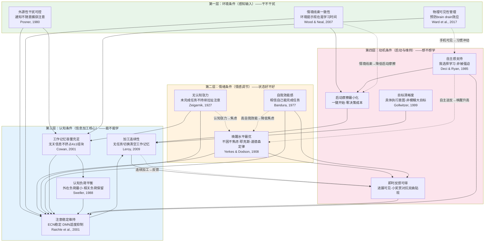

# 第3章：深度专注学习的必要条件模型

## 3.1 必要条件方法论

在开始构建模型之前，我们必须首先明确定义什么是"必要条件"，以及如何将其与充分条件、增强条件、无关因素严格区分开来。这个区分至关重要——混淆不同类型的条件会导致功能设计要么遗漏关键要素，要么堆砌不必要的功能，最终偏离第一性原理。

### 3.1.1 四类条件的区分标准

我们借鉴逻辑学和科学哲学中的条件分类，结合植物生长类比，建立四类条件的严格区分标准：

| 条件类型 | 逻辑学定义 | 植物生长类比 | 判断标准 |
|---|---|---|---|
| **必要条件（Necessary Condition）** | 如果没有X，则Y必然不发生；但有了X，Y不一定发生。X是Y的必要不充分条件。 | 阳光：没有阳光植物会死，但有阳光不一定长得好（还需要水、土壤等） | "缺了它就一定不行"——反事实验证：去掉X，举出Y失败的反例 |
| **充分条件（Sufficient Condition）** | 如果有了X，则Y必然发生；但Y发生不一定需要X。X是Y的充分不必要条件。 | 极端高温+缺水：必然导致植物死亡，但植物死亡不一定因为这个 | "有了它就一定行"——正向验证：有X，举出Y成功的正例；但没有X，Y仍可能通过其他路径发生 |
| **增强条件（Enhancing Condition）** | 既不是必要也不是充分，但有了X，Y发生的概率更高、质量更好。 | 有机肥：有了它植物长得更好，但没有也能活 | "有了更好，没有也行"——边际验证：去掉X，Y仍然可能发生但质量/概率下降；加上X，Y效果提升 |
| **无关因素（Irrelevant Factor）** | X的存在与否对Y的发生概率和质量没有统计显著的影响。 | 花盆的颜色：红色花盆和蓝色花盆对植物生长没有影响 | "有没有都一样"——控制实验：改变X，Y的结果没有系统性变化 |

### 3.1.2 反例检验法：如何判断必要条件

判断一个条件是否是必要条件的唯一可靠方法是**反事实验证（counterfactual test）**：假设我们把这个条件完全移除，其他条件都保持不变，学习是否还能高质量发生？

这个检验有三个严格的操作步骤：

**第一步：极端化移除**。不要温和地削弱条件，而是将其极端化到完全不存在的状态。例如检验"外源性干扰可控"是否必要，不是"减少通知"，而是"每30秒弹出一个无法关闭的全屏通知"——在这种极端情况下，学习是否还能发生？

**第二步：寻找或构造反例**。如果条件移除后，存在**任何一种现实场景**中学习仍然高质量发生，那么这个条件就不是普遍必要条件。反之，如果在所有现实场景中，条件移除后学习都无法高质量发生，那么它就是必要条件。注意：我们讨论的是"手机端深度学习"场景，不考虑极端特例（如经过多年冥想训练的僧人能在炮火中学习）。

**第三步：因果机制解释**。仅仅观察到"没有X就没有Y"是不够的——相关性不等于因果性。必须解释清楚：X的缺失通过什么认知/心理机制导致Y失败？这个机制是否与第1、2章阐述的认知科学原理一致？

### 3.1.3 本模型的边界声明

本模型有明确的适用边界，超出边界的结论不成立：

1. **场景边界**：仅针对"智能手机端的深度学习"场景，不适用于纸质书学习、电脑端学习、课堂听讲、技能实操等其他学习场景。这些场景有不同的必要条件。
2. **学习类型边界**：以理解领悟型学习和技能熟练型学习初期为主要分析对象，机械记忆型和创造生成型有特殊条件，将在第6章差异化分析中讨论。
3. **承诺边界**：本模型**只承诺必要条件**——缺了这些条件学习一定无法高质量发生，但**不承诺充分条件**——即使所有必要条件都满足，学习也不一定高质量发生（还需要学习内容质量、学习者先备知识、有效学习策略等其他因素）。这就像阳光、水、土壤、空气都有了，植物不一定长得好（还需要合适的温度、没有病虫害、种子本身质量等），但缺了任何一个一定活不了。
4. **个体差异边界**：必要条件是统计意义上对绝大多数人成立的，不排除极少数经过特殊训练的个体可能突破某些条件限制，但产品设计必须面向普通用户而非特例。

### 3.1.4 必要条件不承诺"有了就行"

需要特别强调：我们识别的14个必要条件，构成了手机端深度学习的"最小存活集"——它们是学习的"空气、阳光、水"，缺了不行，但不是"豪华套餐"。现有产品的常见错误是：把某些增强条件当成必要条件（如白噪音、番茄钟、种树动画），却遗漏了真正的必要条件（如物理可见性管理、认知张力释放、启动摩擦最小化）。本模型的目标是建立最小完备集——不多一个，不少一个。

---

## 3.2 环境条件：感知层面的基础支持

环境条件位于必要条件金字塔的最底层，作用于感知输入阶段。它们的作用是：减少或消除从外部环境侵入认知系统的无关刺激，为后续的认知加工创造"干净的感知输入通道"。如果环境条件不满足，认知系统从一开始就被"污染"，后续所有加工都会受影响。

### 3.2.1 外源性干扰可控：通知、声音、视觉刺激不能随意捕获注意

**条件定义**：学习会话期间，所有由手机产生的外源性注意捕获刺激（通知声音、震动、弹窗、红点、状态栏变化、动画效果）要么被完全阻止，要么其捕获注意的能力被显著削弱到不会自动中断学习进程的程度。用户对"什么刺激可以进入注意"拥有控制权，而非App或系统随意决定。

**反例论证（为什么是必要条件）**：如果没有这个条件会怎样？想象一个极端场景：你每30秒就会收到一个全屏弹窗通知，伴随响亮的提示音和震动，必须手动点击才能关闭。在这种情况下，学习是否还能发生？根据Posner (1980)的外源性注意理论，这种刺激会**自动、无意识、在你做出决定之前**就捕获你的注意——这是神经反射，不是意志力能阻止的。每一次捕获都会触发Raymond et al. (1992)的注意瞬脱（200-500ms注意空白期），然后是工作记忆上下文清空，然后是Leroy (2009)的注意力残留。频繁到每30秒一次的打断，意味着你永远无法度过10-15分钟的启动期——你始终在"开始→被打断→重置→重新开始"的循环中，永远无法进入深度加工状态。

**反例追问**：有人可能说"我可以忽略通知"——但认知科学证据表明你做不到。Ward et al. (2017)的brain drain研究表明，即使你成功"忽略"了一个通知，它仍然在感觉记忆和注意系统层面产生了激活，消耗了认知资源。注意捕获是完全自动的前意识过程，发生在你意识到之前。你可以决定"我不点开通知"，但你无法决定"我不注意到它"——就像你无法决定不眨眼当一个物体快速飞向你的眼睛。

**缺失后果**：
- 频繁的注意捕获导致工作记忆反复清空，始终无法建立稳定的加工上下文
- 永远停留在启动期，无法进入深度加工状态
- 每次打断后注意力残留叠加，可用认知资源持续减少
- 最终演变为"学5分钟被打断2分钟"的碎片化状态，有效学习时间接近零

**满足标准**：
- 学习会话期间，不会有任何声音、震动、弹窗打断当前操作
- 红点、角标、状态栏通知等视觉突出刺激要么被隐藏，要么被去强化（如变为灰色、缩小）
- 系统级通知（如来电）有明确的处理规则（白名单、自动回复、稍后提醒），不会全屏强制打断
- 学习App内部没有广告弹窗、评分请求、更新提示等干扰
- 如果用户选择允许某些通知（如紧急联系人），这些通知的呈现方式经过特殊设计，最小化注意捕获强度和切换成本

### 3.2.2 物理可见性管理：手机不在持续消耗后台注意资源

**条件定义**：学习会话期间，手机本身不处于用户的直接视线范围内或即时可及范围内，或者通过软件设计削弱手机作为"高奖赏刺激物"的线索强度，从而预防Ward et al. (2017)发现的brain drain效应——大脑不需要持续在后台监控手机状态。

**反例论证（为什么是必要条件）**：如果没有这个条件会怎样？回到Ward等人2017年的经典实验：手机放在桌面上、屏幕朝下、关机状态——没有任何通知、没有任何声音震动，但认知表现仍然显著下降，相当于一整晚没睡觉的认知损伤程度。为什么？因为你的大脑知道手机在那里——它是你生活中最重要的信息枢纽和社交连接工具，你的前额叶-顶叶注意网络会持续在后台监控它：有没有亮屏？有没有震动？有没有新消息？这种后台监控发生在意识层面之下，你感觉不到它，但它持续占用约1个工作记忆组块（宝贵的4个组块中的25%）。

想象一下：如果你的工作记忆容量被占用了25%，就像你的电脑后台一直运行着一个占内存25%的病毒程序——前台程序能跑，但会变慢、变卡、容易崩溃。对于理解领悟型学习，你需要全部4个组块（甚至全部4个都不够，需要组块化）来同时保持多个概念并建立联系——少了1个组块，理解过程就会变得困难、缓慢、容易卡壳。这就是为什么很多人感觉"手机放在桌上哪怕不碰也学不进去"——不是他们不专心，是他们的大脑确实少了25%的认知容量。

**反例追问**："我把手机扣在桌上/开了勿扰模式，为什么还是分心？"——因为brain drain效应的关键变量是**物理距离和可见性**，不是通知开关。Ward等人的实验中手机就是屏幕朝下且无通知的，但仍然有显著效应。扣在桌上只是减少了视觉可见性，但手机仍然在你手边、在同一房间——你知道它在那里，随时可以拿起来，后台监控就不会停止。只有当手机被放到另一个房间、包里、或者物理上被隔离到需要刻意努力才能拿到的地方，后台监控才会显著减弱。

**缺失后果**：
- 约20-25%的工作记忆容量被持续占用，能用于学习的认知资源不足
- 认知加工速度变慢，理解困难概念时更容易卡壳
- 更容易疲劳——后台监控持续消耗注意资源
- 为"就看一眼"的冲动提供持续的线索触发，习惯回路更容易被激活
- 用户主观体验为"学不进去""脑子转不动"，但不知道原因是手机就在旁边

**满足标准**：
- 软件层面：明确提示用户将手机放到视线外、包中，或物理隔离（而非只是放在桌上扣过来）
- 如果手机必须在视线内（如用手机学习），通过界面设计改变手机的"熟悉感"——使其看起来、感觉起来"不像平时那个手机"，削弱习惯线索强度
- 学习界面消除所有典型的手机UI元素（状态栏、通知栏、Home指示条、红点、App图标），让用户进入一个"非手机"的视觉情境
- 提供"物理隔离引导"：如检测到手机未被移动、屏幕朝上持续在桌面，温和提示"试试把手机放到包里，学习效果会更好"

### 3.2.3 情境线索一致性：环境线索稳定提示"现在是学习时间"

**条件定义**：学习会话启动后，视觉、听觉、触觉、交互方式等多通道情境线索保持一致且独特，明确且持续地向大脑传递"现在是学习时间，不是娱乐/社交时间"的信号，形成稳定的情境线索，激活与学习相关的行为模式，抑制与刷手机/社交/娱乐相关的习惯回路。

**反例论证（为什么是必要条件）**：如果没有这个条件会怎样？如果你打开"学习模式"，但界面看起来和平时一模一样——同样的状态栏、同样的通知、同样的Home手势、同样的微信图标在旁边，会发生什么？根据情境认知理论（Lave & Wenger, 1991）和习惯回路研究（Wood & Neal, 2007），环境线索是行为的最强触发物。你平时用手机时90%的时间是在刷微信、看视频、社交——这些行为的线索就是"普通的手机界面"。当"学习模式"的界面和普通手机界面没有区别时，大脑会持续接收到矛盾的线索：这到底是学习时间还是娱乐时间？习惯回路会持续被激活——你的手会下意识想去点微信图标，你的眼睛会下意识去看状态栏有没有新消息。

反例：想象你在卧室床上学习，床是你平时睡觉、刷手机的地方——这个环境线索持续提示"该睡觉了""该刷手机了"，你需要持续用意志力抵抗这些线索触发的习惯，很快就会疲劳、分心、睡着。但如果你坐在图书馆书桌前——这个环境的视觉、听觉、甚至气味线索都在提示"这里是学习的地方"——你不需要用意志力提醒自己"该学习了"，环境本身就在帮你激活学习模式。手机上的学习模式也需要创造这样一套独特的、一致的情境线索。

**缺失后果**：
- 大脑持续接收矛盾线索，习惯回路（刷手机、社交、娱乐）持续被激活
- 需要持续消耗意志力抑制习惯行为，加速自我损耗
- 无法建立"打开学习模式→进入学习状态"的自动化习惯联结
- 学习模式和普通模式的边界模糊，用户随时可能"滑出"学习状态
- 即使没有外部干扰，也更容易心猿意马、产生刷手机的冲动

**满足标准**：
- 学习模式有独特且一致的视觉主题：不同于普通手机界面的配色、排版、字体、壁纸
- 学习模式有独特的交互方式：简化或改变常规的手机交互手势，减少习惯性操作的触发
- 学习模式启动时有清晰的"进入仪式"：一个明确的过渡动画或交互，标志着状态切换（类似图书馆坐下、拿出书本的仪式）
- 学习期间所有界面元素都服务于学习情境，没有任何娱乐/社交相关的视觉线索（如App图标、消息提示）
- 学习模式结束时有明确的"退出仪式"，清晰地切换回正常手机模式
- 多通道一致性：如果使用了提示音/震动/触觉反馈，这些反馈也应该是学习模式独有的，和普通通知的反馈不同

---

## 3.3 认知条件：信息加工层面的核心支持

环境条件是基础，但即使环境完美（手机在另一个房间、绝对安静、没有任何干扰），认知层面的条件不满足，学习仍然无法高质量发生。认知条件直接作用于工作记忆和信息加工链条，是深度学习发生的核心机制层。

### 3.3.1 工作记忆容量充足：无关信息不挤占4±1组块的有限空间

**条件定义**：学习会话期间，工作记忆的4±1个信息组块（Cowan, 2001）中，至少有2-3个组块可用于当前学习任务的加工，不被以下无关信息持续占用：（1）未完成任务的蔡格尼克张力；（2）brain drain导致的后台手机监控；（3）注意力残留的先前任务内容；（4）焦虑/担忧等情绪性想法；（5）学习界面不良设计带来的外在认知负荷。

**反例论证（为什么是必要条件）**：工作记忆是信息加工的"工作台"，所有主动的思考、理解、推理都发生在这里——而且这个工作台只有4个组块大小，没有任何办法扩容。这是硬件级的硬约束，不是靠"努力""专心"就能突破的。

想象你在一个只有4个抽屉的工作台上做拼图：如果你已经在3个抽屉里放了别的东西（未回的消息、等下要做的事、刚才的聊天内容），只剩1个抽屉可以用来放拼图，你能拼好吗？理解一个复杂概念需要同时在脑中保持3-4个相关概念并建立它们之间的联系——这是为什么理解型学习对工作记忆容量要求这么高。如果可用组块少于2个，你甚至无法进行最简单的推理——你会感觉"脑子一片空白""看了半天不知道在说什么"，因为字你都认识，但你没有足够的"内存"把它们组合起来形成意义。

更严重的是，工作记忆被挤占不是你能主观觉察到的——就像你不会觉察到电脑后台程序占用内存一样，你只会感觉"今天脑子不好使""怎么都学不进去"，但不知道是因为有太多无关信息在后台占用了你的"内存"。

**反例追问**："为什么有人能在嘈杂环境中学习？"——这是因为（1）嘈杂环境中的声音是稳定可预测的背景，注意系统可以快速适应，不持续占用工作记忆；（2）这些人可能在进行机械记忆或浅加工学习，只需要1-2个组块就够了；（3）高动机可以在一定程度上补偿，但不能突破容量上限——如果环境极端嘈杂（如每10秒有人叫你名字触发鸡尾酒会效应），再高动机也无法学习。

**缺失后果**：
- 只能进行最浅层次的加工（认字、读句子、划线），无法进行需要同时保持多个概念的深度理解
- "读了半天不知道在说什么"——眼睛看过了文字，但没有足够工作记忆容量进行意义建构
- 推理、解决问题、图式重构等高阶认知活动无法进行
- 学习材料稍微复杂一点就卡壳、看不懂
- 容易疲劳——因为认知系统在"内存不足"的情况下强行运行，能耗更高

**满足标准**：
- 学习前提供"认知清理"机制：帮助用户明确搁置未完成任务（如"把担心的事写下来，学完再处理"），释放蔡格尼克张力
- 学习界面极简，没有任何与当前学习无关的信息元素（时间、天气、消息提示、其他App入口等），最小化外在认知负荷（Sweller, 1988）
- 学习内容呈现符合认知负荷原则：信息分段呈现，避免一次性呈现过多新信息
- 从其他任务切换到学习时，提供"注意力重置"机制（如深呼吸3次、回顾学习目标），帮助清空注意力残留
- 学习过程中如果检测到用户频繁退出/分心，温和提示是否需要先处理完急事再回来，而不是强行锁机让用户带着认知张力学习

### 3.3.2 认知负荷平衡：外在负荷最小化，为相关负荷保留空间

**条件定义**：根据Sweller (1988)的认知负荷理论，学习期间三类认知负荷的总和不超过工作记忆容量上限，且满足：（1）外在认知负荷（由不良界面/环境/教学设计带来的不必要负荷）被最小化到接近零；（2）内在认知负荷（学习材料本身复杂度决定的必要负荷）被合理管理（如分段、渐进化）；（3）留出足够的容量给相关认知负荷（用于图式建构、深加工、理解的有益负荷）——这部分才是真正产生学习的部分。

**反例论证（为什么是必要条件）**：认知负荷理论的核心公式是：**内在负荷 + 外在负荷 + 相关负荷 ≤ 工作记忆容量上限**。如果外在负荷过高，即使内在负荷很低，相关负荷也会被挤压到零——此时学习无法发生。

反例1：你在一个弹窗乱飞、广告不断、排版混乱的盗版小说网站上读一篇深度科普文章——文章本身写得很好（内在负荷适中），但弹窗、闪烁广告、奇怪的排版、需要不断点击关闭按钮（外在负荷极高）占用了你所有的工作记忆容量，你读完了但完全没理解内容——因为相关负荷为零，你所有的认知资源都用来处理界面干扰了。

反例2：为什么"在学习App里放励志语录、倒计时、积分、成就徽章"有时候反而降低学习效果？因为这些元素本身就是外在认知负荷——每一个额外的视觉元素都需要占用工作记忆资源去识别、忽略、处理，即使你"没在看它们"，它们仍然在视觉通路中被加工，消耗资源。

**缺失后果**：
- 即使内容很好、没有外部干扰，也学不进去——认知资源都被无关界面元素消耗了
- "学习体验很流畅但什么都没学会"——流畅感来自界面设计良好，不是来自认知加工
- 学习速度慢，需要反复重读同一段内容
- 认知疲劳加速——外在负荷是"无效能耗"，不产生学习但消耗精力

**满足标准**：
- 学习界面遵循"极简但不空洞"原则：只显示对当前学习任务绝对必要的信息
- 所有非必要UI元素（倒计时数字、积分、成就、励志语录、装饰性动画）默认隐藏，需要时才显示
- 学习内容的呈现遵循分段原则（Mayer, 2009多媒体学习理论）：文字+图像邻近呈现、避免冗余信息、信号化重点
- 不在学习过程中弹出与当前学习无关的提示（如"你已经学习了20分钟""要不要休息一下"）
- 反馈和提示采用非侵入方式：如细微的颜色变化、边缘提示，而非弹窗打断
- 界面动画极简：没有花哨的转场动画、粒子效果、装饰性动效，避免不必要的视觉注意捕获

### 3.3.3 注意稳定维持：ECN持续激活，DMN被抑制但非完全关闭

**条件定义**：学习会话期间，执行控制网络（ECN，包括背外侧前额叶等区域）保持稳定激活，主导认知加工；默认模式网络（DMN，负责心智游移、自我反思、走神）被有效抑制但不是被完全关闭——允许短暂、自发的DMN激活（轻度走神），但能在元认知觉察后快速回到ECN主导状态，且DMN激活不会导致任务完全中断。

**反例论证（为什么是必要条件）**：首先，DMN被完全关闭是不可能也不可取的。Raichle et al. (2001)的研究表明DMN和ECN是大尺度脑网络的两个拮抗状态——一个激活时另一个抑制，但两者不可能同时完全关闭，也不应该完全关闭。DMN有重要功能：记忆巩固、创造性联想、理解整合都需要DMN参与。完全强制抑制DMN（如通过极强的外部约束、压力、焦虑）会导致思维僵化、无法进行创造性联系、也无法整合知识。

但如果DMN过度激活、ECN无法稳定维持，就会变成持续走神——这也是不行的。Smallwood & Schooler (2006)的研究表明，人们清醒时30-50%时间在走神，但对于需要持续专注的深度学习，走神频率需要控制在一定范围内。如果频繁走神且长时间无法觉察（元认知觉察滞后），学习就变成了"眼睛盯着书本脑子在想别的"，工作记忆被内部想法占据，学习加工完全停止。

关键不是"完全不走神"——这不可能，也不符合大脑运作规律。关键是：（1）减少DMN被外部触发的频率（外部干扰越少，DMN越不容易被激活）；（2）当DMN自发激活（走神）时，元认知能尽快觉察到；（3）觉察后能温和、不费力地将注意拉回当前任务，不需要强烈的自我谴责和意志力消耗。

**缺失后果**：
- 如果DMN完全无法抑制：持续走神，"看书不进字"，大部分时间注意力在内部想法上
- 元认知觉察滞后：走神了5-10分钟才突然反应过来"我刚才在想什么"
- 如果DMN被过度抑制（焦虑/压力过大）：思维僵化，无法理解需要创造性联想的内容，感觉"脑子转不动""像卡住了一样"
- 反复的"走神→自责→强迫自己集中→更焦虑→更走神"恶性循环

**满足标准**：
- 减少外部触发源：外部干扰越少，DMN越不容易被激活
- 提供非侵入性的元觉察提示：当检测到长时间无交互、阅读速度异常、或其他可能走神的信号时，用极温和的方式提示（如屏幕边缘轻微的呼吸光效，不是弹窗和声音）
- 不对走神进行惩罚：不用"你又分心了"这类负面反馈，不记录分心次数让用户焦虑
- 允许并接纳适度走神：把轻度走神视为大脑运作的正常部分，不追求100%专注
- 学习分段：45-60分钟后安排休息，让DMN有机会在休息时间光明正大地激活，减少学习期间偷偷走神的冲动

### 3.3.4 加工连续性：学习会话期间无任务切换导致的工作记忆清空

**条件定义**：学习会话度过启动期（10-15分钟）后，信息加工链条保持连续不被打断——没有非预期的任务切换（如回消息、接电话、被弹窗引导到其他App），工作记忆中的学习上下文（正在思考的概念、推导到一半的逻辑、激活的先备知识）不会被完全清空和重置。

**反例论证（为什么是必要条件）**：我们在第2章已经详细分析了任务切换的三重代价：（1）注意瞬脱的200-500ms空白期（Raymond et al., 1992）；（2）工作记忆上下文完全清空——你正在思考的所有内容、建立的所有临时联系都丢失了；（3）注意力残留（Leroy, 2009）——切换回来后，之前任务的想法仍然残留在工作记忆中。

反例：你正在解一道复杂的数学题，已经在脑中建立了5个变量之间的关系，快要找到解题思路了——这时一个电话打来，你接了2分钟电话。挂掉电话后，你还记得刚才在解数学题，但你脑中那5个变量的关系、快要成型的解题思路——全部消失了。你需要从头开始重新读题、重新建立变量关系、重新推导——这个重建过程可能需要10-15分钟，和重新进入学习状态的启动成本一样高。如果这种打断每15分钟发生一次，你永远在重建上下文，永远无法到达真正的深度加工。

对于创造生成型学习，加工连续性的要求更高——你需要在脑中保持一个复杂的"问题空间"，打断后重建成本极高，可能一个小时都无法恢复到之前的思考状态。

**反例追问**："番茄钟25分钟就打断休息，难道不对吗？"——番茄钟的问题在于它的打断是**人为的、固定时间的、不考虑当前加工状态的**。如果你刚好在25分钟时快要理解一个概念、快要找到解题思路，这时番茄钟"叮"的一声打断你——这和外部通知打断的认知代价是一样的！正确的分段应该是在自然的断点（如学完一节、做完一道题、理解了一个概念后）主动休息，而不是机械地按固定时间打断。

**缺失后果**：
- 每次打断都需要重新付出10-15分钟启动成本来重建工作记忆上下文
- 频繁打断导致永远无法度过启动期，始终停留在浅加工
- 正在进行的深度思考、灵感、顿悟被打断后可能永远找不回来
- 学习变成断断续续的碎片，无法形成连贯的知识结构
- "学了很久但感觉什么都没学透"——因为每次刚要深入就被打断

**满足标准**：
- 度过启动期后（前10-15分钟），提供最强级别的打断保护，尽量避免任何非紧急打断
- 不使用固定间隔的强制打断（如番茄钟的25分钟强制休息），而是引导用户在自然断点主动休息
- 如果必须打断（如用户主动选择回紧急消息），提供"上下文保存"机制：让用户快速记录下"我刚才在想什么/学到哪里了"，类似断点续传
- 打断后返回时，提供"上下文恢复"机制：快速回顾之前学习的内容和进度，帮助重建工作记忆上下文，缩短重新进入状态的时间
- 明确告知用户启动期的存在："前15分钟是进入状态的关键期，尽量不要打断"

---

## 3.4 动机条件：启动与维持的动力

环境和认知条件解决了"能不能学"的问题，但如果没有动机条件，用户根本不会开始学习，或者开始后很快放弃。动机条件作用于行为启动和维持阶段，解决"想不想开始""能不能坚持"的问题。

### 3.4.1 启动摩擦最小化：从"想学习"到"开始学习"的阻力尽可能小

**条件定义**：从用户产生"我要学习"的念头，到真正进入学习状态（度过启动期）之间的操作步骤、决策点、认知消耗、时间延迟被最小化。启动学习的路径是所有可能路径中阻力最小的——比刷微信、看短视频的启动阻力更小（或至少相当）。

**反例论证（为什么是必要条件）**：根据双曲贴现理论（Ainslie, 1975; Laibson, 1997），在决策点上，任何需要现在付出的成本都会被主观放大，而未来的收益会被贴现。如果启动学习需要经过很多步骤——找到学习App、选择学习模式、设置时长、选择白噪音、设置白名单、写今日目标、点击开始——每多一个步骤，就多一个决策点，就多消耗一点意志力，就给双曲贴现多一个把你推向"先刷5分钟手机再学"的机会。

对比一下：刷手机的启动摩擦是多少？几乎为零——拿起手机→解锁→习惯性点开常刷的App→立即获得奖赏。0步决策，0等待时间，启动成本为零。而如果启动学习需要8个步骤、30秒时间、做5个决策，在双曲贴现的作用下，绝大多数人会选择"先刷5分钟"——而5分钟往往变成半小时，然后变成"今天算了明天再学"。

更严重的是，启动操作本身就在消耗宝贵的意志力资源（Baumeister et al., 1998）。当你终于完成所有设置、点击"开始学习"时，你已经在设置过程中消耗了一部分意志力——而这些意志力本来应该用在学习本身（理解困难概念、解决难题）上。

**反例追问**："这些设置不是只需要一次吗？下次可以用默认设置啊"——是的，但默认设置往往不是用户想要的，所以每次开始前还是会想调整一下。而且更重要的是心理上的启动门槛：当你想到"开始学习要做这么多事"，这个预期本身就会让你拖延——大脑在预期到需要付出努力时，会本能地回避。

**缺失后果**：
- 严重拖延："等一下再学"变成"今天不学了"
- 即使开始了，也在启动过程中消耗了过多意志力，后续学习动力不足
- 启动期认知资源已经被决策消耗，难以进入深度加工状态
- 启动过程越复杂，用户启动学习的频率越低——久而久之形成"学习很麻烦"的心理预期

**满足标准**：
- 一键启动：打开学习模式后不需要任何设置，点击一个按钮就立即开始
- 智能默认：所有参数（时长、白噪音、白名单等）都有经过优化的默认值，不需要用户每次调整
- 渐进式设置：如果确实需要设置（如选择学习任务），在学习开始后、启动期过程中温和引导设置，而不是在开始前设置一堵"设置墙"
- 启动路径最短：学习模式入口在手机最容易触达的位置（如锁屏界面、控制中心），不需要翻找App
- 消除启动仪式中的冗余步骤：不强制用户写目标、选主题、选声音才能开始

### 3.4.2 即时反馈可得：进展可见，持续获得小奖赏对抗双曲贴现

**条件定义**：学习过程中，用户能持续获得关于自己进展的清晰、即时、具体的反馈——能看到自己学了多久、学了多少、取得了什么进展。这些反馈提供持续的、即时的小奖赏，对抗双曲贴现效应（即时诱惑>延迟收益），让学习过程本身产生持续的正强化。

**反例论证（为什么是必要条件）**：学习的天然问题是收益延迟——你今天学2小时，可能要几周后考试才能看到成果，可能要几个月后技能提升才能感受到。而刷手机的奖赏是即时的——点开下一个视频立刻获得新刺激，刷到新消息立刻获得社交信息。根据双曲贴现，在每一个决策点上，即时小奖赏的主观价值都远大于延迟大奖赏——如果学习过程中完全没有即时反馈，你就需要在每一分钟都靠意志力对抗"现在退出去刷手机"的诱惑，这是不可能持续的。

反例：想象你在一个完全没有反馈的黑屋子里学习——你不知道学了多久，不知道学了多少页，不知道自己进步了多少，没有任何声音或视觉提示你进展如何。你能坚持多久？研究表明，即使是高动机的被试，在完全无反馈的任务中坚持时间也会大幅缩短，因为大脑的奖赏系统需要持续的正强化才能维持行为。心流理论（Csikszentmihalyi, 1975）也把"即时反馈"列为心流的三个核心前提条件之一——没有反馈，你不知道自己做得好不好，无法调整行为，也无法获得成就感。

但注意：反馈≠干扰。反馈必须是即时但非侵入的——它应该在你需要的时候能看到，而不是一直跳出来打断你。这就像开车时的仪表盘——你不需要一直盯着它，但你想看的时候随时能看到车速、油量、里程，它不会一直弹窗告诉你"你已经开了20分钟了"。

**缺失后果**：
- 双曲贴现效应无法被对抗，"现在退出刷手机"的诱惑持续增大
- 学习过程感觉像在黑屋子里走路，不知道走了多远、还有多久，容易产生疲惫和无助感
- 无法形成"学习→获得反馈→成就感→继续学习"的正强化循环
- 成就感缺失，只能靠意志力和远期目标坚持，难以持续
- "学了半天不知道学了什么"的空虚感，容易导致放弃

**满足标准**：
- 进展可视化：用户能随时看到已经学习了多久，但这个信息默认不显眼、不打扰
- 分段里程碑：在自然学习节点（如25分钟、学完一节）提供温和的正反馈（如一个细微的动画、轻柔的提示音）
- 反馈非侵入：反馈不弹窗、不打断当前学习流，用边缘光效、颜色变化、状态栏微提示等方式呈现
- 反馈具体而非空泛：不用"你真棒！"这类空泛表扬，而是"你已经专注学习了30分钟，完成了今天第一个学习块"这类具体信息
- 避免负反馈：不用"你又分心了""坚持住"这类压力性反馈，只提供正向进展反馈
- 长期进展可见：学习结束后能看到本次学习的总结、累计学习时长等，但学习过程中不展示这些容易引发焦虑的统计

### 3.4.3 目标清晰度：学习任务具体明确（符合执行意图）

**条件定义**：用户开始学习时，有一个具体、明确、可执行、可衡量的学习目标，而不是"我要学习"这类模糊的大目标。这个目标符合Gollwitzer (1999)提出的执行意图（implementation intentions）格式——不是"我要学习X"，而是"我将在接下来的30分钟里，完成Y任务（如做完第3章的5道选择题/看完第二节视频并复述核心观点）"，明确"做什么、做多少、做到什么程度"。

**反例论证（为什么是必要条件）**："我要学习"是一个极其模糊的目标——它可以意味着看书、做题、背单词、看视频、整理笔记，也没有明确的完成标准。Gollwitzer (1999)的研究表明，仅仅有"我要学习"这类目标意图是不够的，执行意图（"如果-那么"计划）能将目标达成率提高2-3倍。为什么？因为模糊的目标不直接指向具体行动——你每次都需要做决策："现在学什么？""从哪里开始？""学多少算够？"每一个决策点都消耗意志力，都为拖延和分心创造了机会。

反例1：你坐下来告诉自己"我要学习数学"——但打开数学书后，你不知道该看哪一章、做哪些题，翻了两页觉得这也不会那也不会，很快就拿起手机刷起来了——因为模糊的目标让你不知道第一步该做什么，大脑面对模糊会本能回避。

反例2：你坐下来告诉自己"接下来30分钟，我要做完第3章的前5道选择题，对答案并理解错题"——这个目标非常具体，你不需要做任何决策，打开书翻到第3章直接开始做题就可以了。没有决策内耗，启动速度快，也更容易衡量进展和获得成就感。

模糊的目标还会导致注意力更容易分散——因为你没有一个明确的"完成"标准，大脑会持续寻找"是不是可以停下来了"的信号，而任何干扰都可以成为"停下来"的理由。

**缺失后果**：
- 启动前决策内耗：不知道学什么、从哪开始，拖延启动
- 学习过程中方向感缺失：学着学着就偏离轨道，被其他内容吸引
- 没有明确的完成标准：不知道什么时候算"学好了"，容易提前放弃或者无意义磨时间
- 成就感缺失：因为不知道完成了什么，无法获得"我完成了一个目标"的满足感
- 更容易分心：没有明确任务锚点，注意力更容易被内外部干扰带走

**满足标准**：
- 引导用户设定具体目标：开始时（或启动期内）温和提示"今天打算学什么？"，提供简单的输入方式（不需要长篇大论）
- 目标格式引导：不是让用户写长篇计划，而是引导"做什么+做多少"的具体格式，如"看20页书""做10道题""背30个单词"
- 目标可见但不施压：学习过程中目标在界面上，但不是倒计时压力，而是"我在做什么"的锚点
- 完成时明确反馈：当用户标记任务完成时，给出明确的完成反馈，强化"完成目标"的奖赏感
- 支持"小目标"：鼓励用户设定25-45分钟能完成的小目标，而不是"我要学完这本书"这类大目标——小目标更容易开始，也更容易获得完成反馈

### 3.4.4 自主感支持：用户感受到是"我选择学习"而非"被强迫学习"

**条件定义**：学习模式的所有约束和规则都是用户自主选择的，用户在任何时候都有控制权——可以暂停、可以退出、可以调整设置、可以处理紧急事务。学习模式是用户的"工具"和"支持者"，不是"狱警"和"监工"。用户感受到的是"我在使用学习模式帮助我更好地学习"，而不是"学习模式在管着我、强迫我学习"。这符合Deci & Ryan (1985)自我决定理论（Self-Determination Theory）中的自主感需求——自主感是内在动机的三个基本心理需求之一。

**反例论证（为什么是必要条件）**：自我决定理论（Deci & Ryan, 1985, 2000）数十年的研究一致表明：当人们感到行为是被外部控制、强迫、压力驱使时，内在动机会被严重削弱，会产生心理逆反（psychological reactance）——一种"你不让我做我偏要做"的本能反抗。严格的锁机、无法退出的专注模式、"你确定要退出吗？植物会枯死！"的威胁、强制不能提前结束——这些设计都在破坏自主感，把"我选择学习"变成了"我被关起来了不得不学习"。

反例1：很多人都有过这样的体验——严格模式锁机后，你反而更想玩手机了——不是你真的想玩，而是"我被锁住了不能玩"这个事实本身，就让玩手机的欲望变得无比强烈。这就是心理逆反在起作用：当你的自由感被威胁时，你会本能地想要夺回控制权，即使那个自由本来你也不一定会用。就像你本来不想吃零食，但如果有人把你绑起来不让你吃，你会满脑子都想吃零食。

反例2：对比"我把手机放到另一个房间"和"App把我手机锁死不能退出"——这两种情况都达到了"不能玩手机"的效果，但心理感受完全不同：前者是"我自主选择把手机放远，帮助自己学习"，这会增强自主感和掌控感，反而能提升动机；后者是"App不让我退出"，这会引发逆反，你满脑子都在想怎么绕过锁机、怎么重启手机、这个App真讨厌。

更严重的是，长期被外部强制约束，会削弱内在动机——你会逐渐觉得"学习是因为学习模式让我学"，而不是"我自己想学"。当没有学习模式约束时，你就更难自主学习了——这就是为什么很多人用了很久专注App，不用的时候反而更无法专注。

**缺失后果**：
- 心理逆反：越约束越想反抗，越不让玩手机越想玩
- 内在动机削弱：学习从"我想做的事"变成"被强迫做的事"，体验变差
- 用户与产品对抗：用户想办法绕过约束（重启手机、强制退出），产品想办法堵漏洞，形成恶性循环
- 无法形成自主学习能力：离开学习模式后更难自主专注
- 退出后反弹：一旦结束学习模式，会报复性地刷更久手机，补偿被剥夺的自由感

**满足标准**：
- 没有强制锁机：永远允许用户退出，但可以在退出时温和提示"现在退出会丢失12分钟的专注状态，确定吗？"——提示而非阻止
- 没有惩罚机制：不搞"植物枯死""记录失败""扣分"这类惩罚设计，惩罚会破坏内在动机
- 用户随时掌控：可以随时暂停、调整时长、查看紧急消息，不需要和App"斗智斗勇"
- 约束是帮助性的而非强制性的：所有限制都定位为"我帮你减少诱惑"，而非"我不让你做"
- 自主选择启动：学习模式必须用户主动开启，不自动强制开启（除非用户自主设置了自动开启规则）
- 退出是自由的：退出时没有指责、没有道德绑架（如"你放弃了！"），而是友好的"今天的学习到这里，休息一下吧"

---

## 3.5 情绪条件：情感层面的调节支持

情绪条件是最容易被忽视但至关重要的一类条件。认知和动机都不是在真空中运行的——它们受到情绪状态的深刻影响。焦虑、压力、困倦、自我怀疑等负面情绪会直接作用于注意资源分配、工作记忆容量、ECN/DMN平衡，让即使环境和认知条件都满足的情况下，学习仍然无法发生。

### 3.5.1 唤醒水平最优：耶克斯-道德森定律的最佳区间

**条件定义**：学习期间的生理唤醒水平（arousal level）处于耶克斯-道德森定律（Yerkes & Dodson, 1908）描述的最优区间——既不过低（昏昏欲睡、疲劳、无聊、精神萎靡），也不过高（焦虑、紧张、压力过大、心跳加速、过度兴奋），而是处于中等唤醒水平，此时注意资源最充足，ECN能稳定激活，认知加工效率最高。

**反例论证（为什么是必要条件）**：耶克斯和道德森1908年在小鼠实验中发现、后续被大量人类研究反复验证的定律表明：唤醒水平和表现之间不是线性关系，而是倒U型曲线关系——唤醒太低或太高，表现都会下降，只有中等唤醒时表现最佳。而且，任务越复杂、越需要认知加工，最优唤醒水平越低——复杂学习任务的最优唤醒水平比简单体力劳动的最优唤醒水平要低。

反例1（唤醒过低）：你熬夜之后、非常困的时候看书——字都认识，但你读了三遍还是不知道在说什么，眼皮打架，脑子像灌了铅一样转不动。这是因为唤醒水平过低时，神经活动强度不足，ECN无法有效激活，工作记忆容量下降，DMN更容易激活（昏昏欲睡本身就是DMN占主导的状态）。此时即使环境再安静、没有任何干扰，你也学不进去——你的大脑"没电了"。

反例2（唤醒过高）：明天就要考试了，你非常焦虑，心跳很快，手心出汗，满脑子都是"我要是考砸了怎么办""我还没看完""时间不够了"。这时候你坐在书桌前想学习，但发现——你无法集中注意力，刚看两行字脑子里就冒出"来不及了"的焦虑想法，越想集中注意力越集中不了，越集中不了越焦虑。这是因为过高的唤醒（焦虑）会导致杏仁核激活，抑制前额叶（ECN）的功能，工作记忆被焦虑相关的想法占满，认知资源被情绪消耗，你无法进行任何深度加工。

**缺失后果**：
- 唤醒过低时：昏昏欲睡、精神涣散、阅读效率极低、无法进行深度思考、容易睡着
- 唤醒过高时：焦虑紧张、注意力无法集中、工作记忆被焦虑想法占据、思维奔逸/大脑空白、越想学越学不进去
- 两种情况都会导致ECN无法稳定激活，认知加工效率极低
- 持续的非最优唤醒会让学习和负面情绪形成联结，产生"学习=痛苦"的经典条件反射，长期损害学习动机

**满足标准**：
- 唤醒检测与提示：通过使用时长、交互模式（如反应变慢、频繁解锁）等信号，推测用户可能唤醒过低（疲劳），温和提示"看起来有点累了，要不要休息10分钟？"
- 不制造焦虑：不用倒计时、剩余时间紧迫提示、"你已经落后了"这类增加压力和唤醒的设计
- 学习前的放松引导：如果检测到用户可能很焦虑（如短时间内频繁打开又退出），提供1分钟的呼吸放松引导，帮助降低唤醒水平
- 合理的学习时长建议：默认学习块不超过45-60分钟，避免过度疲劳导致唤醒过低
- 休息质量支持：休息时不鼓励用户刷手机（刷手机会提高唤醒水平，休息后反而更累），而是引导闭目养神、远眺、走动
- 不传递"时间紧迫"的感觉：界面不用红色、不用急促动画、不用"倒计时还剩X分钟"这类压力性提示

### 3.5.2 无认知张力：未完成的社交/工作事务不持续产生蔡格尼克张力

**条件定义**：学习开始前和学习期间，没有未完成的重要任务（工作消息、家庭急事、待办事项）持续在意识或潜意识层面产生蔡格尼克张力（Zeigarnik, 1927）——即"有什么事没处理"的持续心理负荷。如果确实有重要未完成事务，这些事务已经被明确搁置或处理过了，不会持续拉扯注意力。

**反例论证（为什么是必要条件）**：蔡格尼克效应告诉我们，未完成的任务会比已完成的任务更让人记忆深刻，并且会产生一种持续的"认知张力"，直到任务被完成或被明确"搁置"。这种张力是潜意识层面的——你可能觉得自己"已经把工作的事放下了"，但如果有一封重要邮件没回、有一个重要消息没看、有一件急事等着处理，你的大脑会持续在后台"惦记"着它，占用工作记忆资源，并且持续产生"要不要看一眼手机确认一下"的冲动。

反例1：你和朋友吵架了，矛盾没解决，你坐下来学习——你可能觉得自己"已经不想这事了"，但你会发现自己特别容易分心，看两行字就走神，脑子里不自觉地回放吵架的场景。这就是未完成的社交任务产生的认知张力——它像一个后台进程持续占用资源，你无法通过意志力"命令"自己不想它。

反例2：你在等一个重要的工作offer/医院检查结果/家人的消息，手机就在旁边——你可能告诉自己"先学习，消息来了再说"，但你会发现你每隔几分钟就下意识看一眼手机，完全无法深度专注。因为这种"等待重要消息"的状态本身就是一个高度唤醒的未完成任务，它产生的认知张力极强，会持续把你的注意力拉向手机。

更严重的是，认知张力和期待性焦虑结合在一起时，破坏力会倍增——不只是"有件事没做"，还有"那件事可能有坏结果"的焦虑，双重消耗认知资源。

**缺失后果**：
- 持续的注意力分散：脑子反复飘向未完成的事，无法深度专注
- "总觉得有什么事没做"的坐立不安感
- 频繁想看手机确认：即使没有通知，也想"就看一眼有没有消息"
- 工作记忆被未完成任务相关的想法占用，可用容量减少
- 焦虑水平升高，唤醒水平偏离最优区间
- 如果未完成的事确实很重要，强行学习反而效率极低，不如先花10分钟处理完再学

**满足标准**：
- 学习前的"认知卸载"引导：开始学习前提供一个简单的快速输入框，"有什么担心的事？写下来，学完再处理"——写下来这个动作本身就是一种"明确搁置"，能显著释放蔡格尼克张力
- 紧急消息处理机制：允许用户设置"只有XX联系人的消息可以提醒"，其他消息一律稍后处理，减少"万一有急事"的焦虑
- 如果用户确实需要处理紧急事务，鼓励"先处理完再回来"，而不是强行锁机让用户带着张力学习
- 不制造新的未完成张力：学习模式内部不留下"学了一半"的悬而未决的状态，每次学习结束有明确的收尾（如总结一下学了什么）
- 清晰的会话边界：学习开始和结束有明确的仪式感，帮助大脑在心理上"切换频道"——学习时放下其他事，休息时再处理

### 3.5.3 自我效能感：相信自己能够完成当前学习任务

**条件定义**：用户对自己能否完成当前学习任务有适度的信心——不因为任务太难而产生"我肯定学不会"的无力感（低自我效能感），也不因为任务太简单而感到无聊。根据Bandura (1977)的自我效能感理论，自我效能感是动机和表现的关键预测变量——相信自己能做到，是真的能做到的重要前提。

**反例论证（为什么是必要条件）**：班杜拉（Bandura, 1977, 1997）数十年的研究表明，自我效能感（self-efficacy）——即个体对自己是否有能力完成某一行为的信念——会深刻影响：（1）你选择尝试还是回避任务；（2）你面对困难时坚持多久；（3）你在任务中的焦虑水平和思维方式。低自我效能感会形成恶性循环：觉得自己学不会→面对困难时很快放弃→真的学不会→更觉得自己学不会。

反例：你打开一本远超你当前水平的教材——比如让一个刚学完代数的学生直接学量子力学——你看了第一页就发现完全看不懂，每个概念都陌生，每个公式都像天书。这时候你会发生什么？你会很快合上书，因为你的大脑立刻判断"这个我不可能学会"——这不是意志力问题，而是自我效能感降到了零，动机系统直接关闭了。继续坐下去也是浪费时间，因为ECN在"我做不到"的信念下不会有效动员认知资源，工作记忆会被"我不行""太难了"的想法占满，焦虑水平飙升（唤醒过高），学习无法发生。

反过来，如果任务太简单——让一个大学生做10以内的加减法——你会很快感到无聊、走神，唤醒水平过低，也无法进入深度学习状态。心流理论中的"挑战-技能平衡"其实就是自我效能感的最优区间：挑战比当前技能略高一点，你相信"我努力一下能做到"，这时候动机最强，专注度最高。

**缺失后果**：
- 任务过难→低自我效能感→焦虑、无助感、很快放弃、回避学习
- 任务过易→无聊、唤醒过低、容易走神、感觉浪费时间
- 持续的低自我效能感会形成"我不擅长学习"的负面自我信念，长期损害学习动机
- 面对困难时更容易放弃，无法坚持度过理解的"卡壳期"
- 焦虑水平升高，进一步损害认知加工能力

**满足标准**：
- （学习模式本身不提供学习内容，所以这一条更多是"不损害"而非"主动提供"）不通过比较、排名、负面反馈降低用户的自我效能感
- 不做"你比XX%的人专注时间短"这类社会比较——社会比较会严重损害低特质自尊用户的自我效能感
- 鼓励小步前进：把大的学习目标分解为小目标（这与3.4.3的目标清晰度一致），让用户在完成小目标的过程中持续获得"我能做到"的效能感
- 不因为用户退出、分心、提前结束而批评或贬低用户——"没关系，下次再试"比"你怎么又分心了"更能保护自我效能感
- 强调进步而非完美：反馈关注"你比上次进步了"，而不是"你还没有达到XX标准"
- 允许用户调整难度和节奏：如果任务太难，用户可以随时暂停、调整、换一个简单点的任务，不必硬着头皮死磕

---

## 3.6 必要条件模型金字塔与交互关系图

下面的Mermaid图完整展示了14个必要条件的层级结构：底层是环境和情绪两类基础条件（感知和情感层面），中层是认知条件（信息加工核心），顶层是动机条件（启动与维持）。同时标注了关键条件之间的交互作用箭头。

**金字塔层级解读**：

- **第一层（最底层）：环境条件**——这是基础中的基础。如果外源性干扰满天飞、手机就在眼前持续brain drain、环境线索持续提示"刷手机时间"，上层所有条件都很难满足。这就是为什么很多人"去图书馆就能学进去，在家就学不进去"——图书馆满足了环境条件，家里的手机、床、零食都在破坏环境条件。

- **第二层：情绪条件**——环境条件满足了，但如果情绪不对（极度困倦、高度焦虑、心里有事、觉得自己肯定学不会），认知加工仍然无法有效进行。情绪是认知的"背景色"——它决定了大脑整体的激活状态和资源分配模式。

- **第三层（核心层）：认知条件**——这是学习真正发生的地方。环境和情绪都是为了给认知加工创造条件，工作记忆、认知负荷、注意稳定、加工连续性——这四个条件直接决定了信息能否被有效加工、图式能否被建构、长时记忆能否被改变。它们是深度学习的核心机制。

- **第四层（顶层）：动机条件**——认知条件再好，如果你根本不开始、开始了很快放弃、或者感觉是被强迫的，学习仍然无法持续。动机是"启动器"和"燃料"——它让你从"想学"到"开始学"，并在学习过程中持续提供动力。

需要特别注意：这不是一个"下层满足了上层自然满足"的线性金字塔——层级之间存在复杂的交互作用（图中虚线箭头标注了部分关键交互），下一节将详细分析这些交互。

---

## 3.7 条件缺失后果矩阵：每个条件缺失对应什么痛点

本节用矩阵形式建立"必要条件缺失→具体学习失败模式→对应第2章痛点"的映射，帮助理解为什么用户感受到的那些痛点存在——它们其实是某个或某几个必要条件未被满足的外在表现。

| 必要条件类别 | 具体必要条件 | 条件缺失时的典型失败模式 | 对应第2章的用户痛点 |
|---|---|---|---|
| **环境条件** | 外源性干扰可控 | 频繁被通知打断→注意瞬脱→工作记忆反复清空→永远无法度过启动期 | 消息通知突然打断、红点持续焦虑、弹窗广告/更新提示、电话强制插入 |
| | 物理可见性管理 | 手机在视线内→brain drain持续占用25%工作记忆→脑子转不动、学不进去 | 学习效率低下、"手机放桌上但我没碰怎么也学不进去" |
| | 情境线索一致性 | 界面和普通手机一样→习惯回路持续被激活→总下意识想刷微信 | "就看一眼"的冲动、习惯性解锁-刷App序列、学着学着就刷起手机 |
| **情绪条件** | 唤醒水平最优 | 过低→昏昏欲睡看不进去；过高→焦虑紧张无法集中注意 | 学一会儿就累、难以进入状态、guilt焦虑恶性循环 |
| | 无认知张力 | 心里有事→未完成任务持续拉扯注意→坐立不安总想看手机 | FOMO信息饥渴、他人消息催促、"总觉得有什么事没做" |
| | 自我效能感 | 任务太难→"我肯定学不会"→很快放弃；任务太易→无聊走神 | 开始后容易放弃、学习效率低下、伪努力自我欺骗 |
| **认知条件** | 工作记忆容量充足 | 内存被占满→只能认字无法理解→"看了半天不知道在说什么" | 学习效率低下、学着学着就走神、看了但没往心里去 |
| | 认知负荷平衡 | 界面元素过多→外在负荷挤占相关负荷→"体验流畅但什么都没学会" | 伪努力自我欺骗、学习App里花里胡哨但没学到东西 |
| | 注意稳定维持 | DMN过度激活→持续走神→元认知觉察滞后→走神半天才反应过来 | 学着学着就走神、"眼睛盯着书脑子在想别的" |
| | 加工连续性 | 频繁切换任务→上下文反复丢失→重建成本累积→永远在启动 | 频繁切换任务、学几分钟被打断一次、"学了很久感觉什么都没学透" |
| **动机条件** | 启动摩擦最小化 | 启动步骤太多→决策内耗→"等一下再学"→拖延 | 拖延不开始、"万事俱备就是不想开始" |
| | 即时反馈可得 | 没有进展反馈→黑屋子里走路→双曲贴现让即时诱惑占上风 | 没有即时反馈、开始后容易放弃、学了很久没成就感 |
| | 目标清晰度 | 目标模糊→不知道学什么→决策疲劳→容易偏离轨道 | 拖延不开始、频繁切换任务、学着学着就偏离正题 |
| | 自主感支持 | 强制锁机→心理逆反→越不让玩越想玩→和App对抗 | "越锁越想玩"、想办法绕过约束、退出后报复性刷手机 |

这个矩阵揭示了一个关键洞察：**用户感受到的每一个具体痛点，都能追溯到至少一个必要条件的缺失**。现有产品的问题是，它们只解决了矩阵中最上面的1-2个条件（外源性干扰可控，部分解决情境线索一致性），而剩下的12个必要条件几乎完全没有被触及。这就是为什么"开了勿扰模式/专注模式还是学不好"——你只解决了14个必要条件中的1个半，当然不行。

---

## 3.8 条件间的交互关系分析

必要条件之间不是简单的"并列缺一不可"关系——它们存在复杂的交互作用：补偿效应、放大效应、瓶颈效应、链式反应。理解这些交互是避免"教条式满足条件"的关键。

### 3.8.1 补偿效应：某些条件可以部分补偿其他条件的不足

补偿效应是指：某一个条件特别强时，可以在一定程度上弥补另一个条件的不足，但这种补偿是有限度的，无法完全替代。

**最典型的例子：极强动机可以部分补偿环境干扰**。毛泽东青年时期刻意在菜市场读书训练专注力——这不是因为"干扰不影响学习"，而是因为极强的内在动机（自我训练、救国救民的宏大目标）让ECN能以更高的激活强度抑制干扰，即使环境条件不满足（菜市场很吵），认知加工仍然能勉强进行。但这种补偿有明确的限度：如果干扰极端强烈（如每10秒有人拍你肩膀问你问题），再强的动机也无法学习——因为外源性注意捕获是神经反射，不是动机能完全压制的。而且这种补偿的代价是极高的动机消耗——你需要付出比安静环境下多得多的意志力，很容易疲劳，无法长时间持续。

**其他补偿关系**：
- 高度清晰的具体目标（M3）可以部分补偿启动摩擦（M1）——如果你对"要做什么"极其明确，即使多几个启动步骤，你也会跳过设置直接开始
- 强即时反馈（M2）可以部分补偿中等程度的唤醒偏离（E1）——如果你在做一件有持续反馈、越做越起劲的事，即使有点困或者有点焦虑，也能进入状态
- 完美的环境条件（ENV1-3）无法补偿认知条件的缺失——把你关在没有任何干扰的隔音室里，如果你心里有事（E2缺失）或者工作记忆被占满（C1缺失），你还是学不进去。环境是必要条件但不是充分条件，它无法替代上层条件。

### 3.8.2 放大/削弱效应：某些条件会强化或削弱其他条件的效果

放大效应是指：一个条件的满足会让另一个条件的效果倍增；削弱效应则相反——一个条件不满足会让其他条件即使满足也效果大减。

**最典型的放大链：情境线索一致性→启动摩擦降低→动机增强→认知稳定**。当学习模式有独特一致的视觉/交互线索时（ENV3），这个线索本身就会成为启动学习的暗示——用户看到这个界面就知道"该学习了"，习惯回路被引导向学习而非刷手机，这大幅降低了启动摩擦（M1）；启动容易了，开始的次数多了，成功体验多了，自我效能感提升（E3）；自我效能感高了，焦虑水平降低（E1），注意更容易稳定（C3）——一个条件的满足沿着链条向上放大，产生连锁正向效应。

**最典型的削弱链：强制锁机破坏自主感→逆反→焦虑升高→注意不稳定→学习失败**。强制锁机（M4被破坏）会引发心理逆反——这破坏了自主感；逆反带来愤怒和挫败感，让唤醒水平升高偏离最优区间（E1被破坏）；高唤醒下杏仁核抑制前额叶，ECN无法稳定激活（C3被破坏）；即使手机被锁死了没法玩，但你的注意力已经被情绪扰乱了，你学不进去——最后结果是：手机确实没玩成，但习也没学成。这就是为什么很多用户抱怨"锁机模式一点用都没有，我对着书坐了2小时什么都没看进去"。

### 3.8.3 瓶颈效应：特定场景下总有一个"最短木板"

瓶颈效应源自利比希最小因子定律——木桶能装多少水取决于最短的那块木板，而非最长的。在特定场景下，14个条件中总有一个是最薄弱的，它决定了整体学习效果的上限——其他条件再好，只要这个瓶颈不解决，学习效果就上不去。

**不同场景下的典型瓶颈**：
- **在家学习的初期**：瓶颈通常是物理可见性管理（ENV2）——手机就在桌上，brain drain持续消耗资源，其他条件再好也学不进去。这时最有效的单一干预不是屏蔽通知（你已经屏蔽了），而是把手机放到另一个房间——这一个动作解决了瓶颈，效果比任何软件设置都好。
- **等重要消息时学习**：瓶颈是无认知张力（E2）——心里惦记着消息，其他条件再完美也无法专注。这时不要强行学习，不如花2分钟把消息处理完，或者明确告诉自己"这个消息2小时后再看"，先释放认知张力，否则坐着也是浪费时间。
- **熬夜后学习**：瓶颈是唤醒水平最优（E1）——你太困了，这时什么学习模式、什么专注App都救不了你，不如小睡20分钟再学，效果比硬撑3小时好得多。
- **拖延不开始时**：瓶颈是启动摩擦最小化（M1）——不是你不想学，是"开始"这个动作门槛太高。这时不要想着"我要学2小时"，而是告诉自己"我就打开书看5分钟"——降低启动门槛，一旦开始了，后续的坚持反而容易。
- **学很难的新内容时**：瓶颈是工作记忆容量充足（C1）——内容本身已经占用了大量内在认知负荷，这时任何一点额外的外在负荷（手机在旁边、弹窗、心里有事）都会压垮工作记忆。这时需要把所有其他条件都调到最优——手机放远、环境安静、处理完杂事、确保不困——才能给高难度学习留出足够认知空间。

瓶颈效应的设计含义至关重要：**学习模式不应该对所有用户、所有场景都用同一套固定策略**——它应该识别当前场景下的瓶颈条件是什么，优先解决那个瓶颈，而不是所有条件都用同样的力度去满足。这是"个性化学习模式"的真正认知科学基础——不是根据用户的表层偏好（喜欢什么颜色、什么白噪音）做个性化，而是根据当前的认知瓶颈是什么做个性化支持。

### 3.8.4 交互的时间动态：不同阶段主导条件不同

条件之间的主导关系不是固定的，而是随学习会话的时间进程动态变化：

- **启动前（决定要不要开始）**：动机条件（尤其是M1启动摩擦、M3目标清晰度）主导——这时候认知和环境条件都不重要，关键是"能不能迈过开始那道坎"。
- **启动期（0-15分钟）**：环境条件和认知条件中的C4加工连续性主导——这段时间最脆弱，任何干扰都是致命的，需要最强级别的环境保护和打断保护。
- **维持期（15-60分钟）**：认知条件（C1-C4）主导——进入状态后，只要认知条件满足、不被打断，学习就能自然持续。
- **疲劳期（60分钟后）**：情绪条件（E1唤醒水平）主导——这时候认知资源已经消耗得差不多了，唤醒开始下降，疲劳感出现，DMN更容易激活，需要休息而非硬撑。

理解时间动态意味着：学习模式的支持策略不应该是静态的——它应该随着学习会话的阶段动态调整：启动前重点帮你"开始"，启动期重点"保护不被打断"，维持期尽量"不打扰"，疲劳期提醒"该休息了"。现有产品用统一的静态策略对待整个会话，本质上是没有理解学习的时间动态特性。

---

<!-- changelog -->
