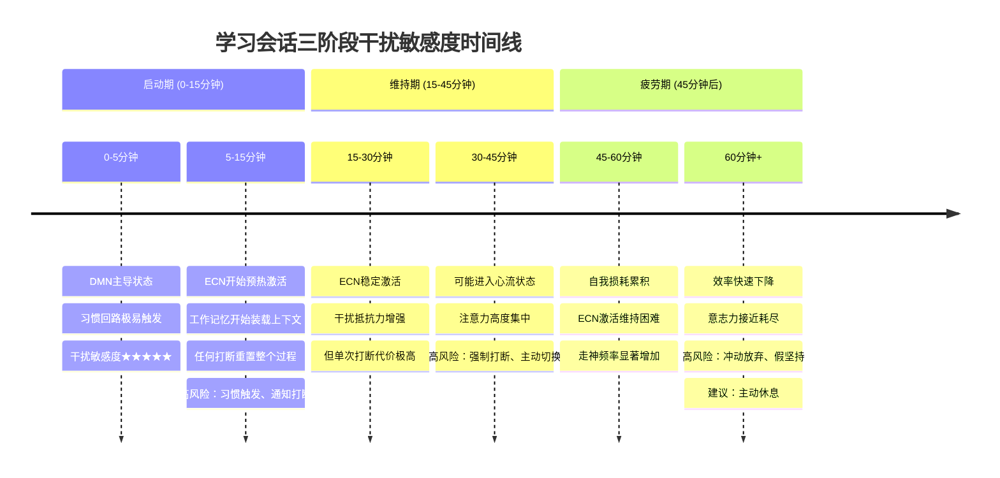
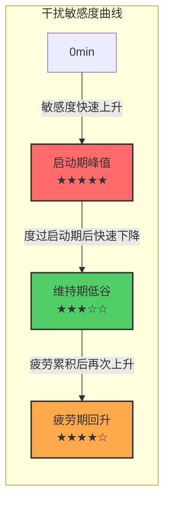
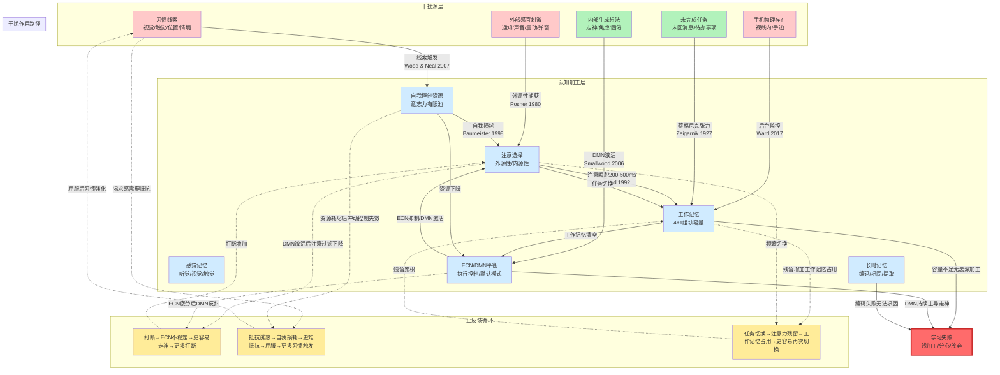

# 第4章：干扰因素的作用机制分析

第2章对用户痛点进行了四层溯源，识别出17个底层认知/心理机制。但这些机制分散在不同痛点层级中，尚未形成一个关于"干扰如何系统地破坏学习"的统一理论框架。本章将这些分散的机制重新组织，建立干扰因素的分类学，详细解析6种核心干扰的具体作用路径，分析干扰在学习会话不同阶段的时间动态特征，并用这些机制解释4个反直觉现象，最终建立一个完整的干扰作用机制模型。

理解干扰的作用机制至关重要——它决定了什么样的应对策略是有效的。现有学习模式产品之所以效果有限，根本原因在于它们只处理了最表层的一类干扰（外部感官干扰），而对其他三类更深层、更隐蔽的干扰几乎完全没有应对措施。对症下药的前提是准确诊断——本章就是这份诊断书。

## 4.1 干扰因素分类学

干扰不是一个单一现象，而是多种不同性质、不同来源、不同作用机制的认知破坏因素的统称。将所有干扰混为一谈是现有产品设计的根本误区之一——"一刀切"的屏蔽策略只能应对其中一类，对其他三类几乎无效。我们根据干扰的来源、可感知性、可控制性、作用时间和恢复难度，建立四大类干扰的分类体系。

### 4.1.1 外部感官干扰

**定义**：来自外部环境、通过感觉通道（视觉、听觉、触觉）进入认知系统的干扰刺激。

**典型例子**：通知声音/震动、弹窗、红点角标、来电全屏打断、他人说话、环境噪音、屏幕闪烁、突然的运动。

**特征维度**：
- **可感知性**：高——用户通常能明确感知到这类干扰的发生（"刚才有个通知弹出来"）
- **可控制性**：中高——通过软件设置（勿扰模式、通知屏蔽）或物理手段（静音、戴耳塞）可以在很大程度上控制
- **作用时间**：短暂但具有破坏性——单次刺激本身只持续几百毫秒到几秒，但引发的后续认知影响持续10-15分钟
- **恢复难度**：一旦发生，需要重新付出启动成本才能恢复
- **意识参与**：前意识捕获（注意捕获发生在你意识到之前），但你能意识到自己被打断了

这是现有产品最关注、也是用户最容易抱怨的一类干扰。它确实是一个真实问题，但它只是冰山一角——解决了外部感官干扰，只解决了约25%的干扰问题。

### 4.1.2 认知后台干扰

**定义**：不直接进入意识焦点、但在认知后台持续运行、持续消耗工作记忆和注意资源的干扰过程。

**典型例子**：brain drain（手机存在导致的后台监控）、未完成任务的蔡格尼克张力、注意力残留、期待性焦虑（"会不会有重要消息找我"）、"有什么事没做"的模糊坐立不安感。

**特征维度**：
- **可感知性**：极低——用户通常完全意识不到这些干扰的存在，只会模糊地感觉"今天脑子不好使""学不进去"，但不知道原因
- **可控制性**：低——因为你觉察不到它在发生，也就无法主动控制；单纯的通知屏蔽对这类干扰完全无效
- **作用时间**：持续、稳定、贯穿整个学习会话——从你坐下开始学习到结束，它一直在后台消耗资源
- **恢复难度**：一旦移除干扰源（如把手机放到另一个房间），效应立即消失；但如果干扰源持续存在，它会持续占用约20-25%的工作记忆容量
- **意识参与**：完全潜意识——这些过程发生在意识层面之下，你无法通过内省觉察到它们

这是最隐蔽、最被现有产品忽视的一类干扰。Ward et al. (2017)发现的brain drain效应是这类干扰的典型代表——手机放在桌上哪怕关机、屏幕朝下，仍然持续消耗认知资源，但99%的用户坚称"手机没有影响我"。这类干扰虽然单次看起来"不严重"（只是占用1个工作记忆组块），但它是持续性的"慢性失血"，让整个学习过程的认知容量基线下降了20-25%，深度学习根本无法发生。

### 4.1.3 内部心理干扰

**定义**：从认知系统内部产生的、不依赖外部刺激的干扰，是大脑默认运作模式的自然结果。

**典型例子**：心智游移（走神）、焦虑性反刍（反复想烦心事）、困倦/疲劳、对未来的担忧、对过去的回忆、自我批判的想法（"我怎么又分心了""我学不会"）。

**特征维度**：
- **可感知性**：低到中——你能意识到自己在走神，但通常走神几分钟后才觉察到（元认知觉察滞后）；焦虑和困倦可能被归因于"我状态不好"而非被识别为干扰
- **可控制性**：低——你无法命令自己"不要走神"，越强迫自己集中反而越容易走神（韦格纳的"白熊效应"）；困倦和疲劳更是生理状态，无法靠意志直接消除
- **作用时间**：间歇性、阵发性——不是持续存在，而是每隔几分钟就"来袭"一次，每次持续几十秒到几分钟
- **恢复难度**：可以通过元认知觉察后温和拉回，但强行压制反而会加剧；疲劳和困倦需要真正的休息才能恢复
- **意识参与**：半意识——走神时你在想别的事，但没有觉察到自己不在学习；焦虑想法是有意识的，但很难控制

这是最"内在"的一类干扰——即使手机在另一个房间、绝对安静、没有任何外部干扰，心智游移仍然会发生（占清醒时间的30-50%，Smallwood & Schooler, 2006）。现有产品完全没有应对这类干扰的机制——它们假设"没有外部干扰=专注"，但这个假设根本不成立。

### 4.1.4 行为习惯干扰

**定义**：由环境线索自动触发的、高度练习过的习惯性行为序列，不需要意识参与就会自动执行。

**典型例子**：习惯性解锁手机（拿起手机就解锁，甚至不知道自己为什么解锁）、解锁后自动点开微信/短视频App、刷手机的自动化行为序列（解锁→下拉刷新→切换App→刷Feed流）、学一会儿就下意识伸手去拿手机。

**特征维度**：
- **可感知性**：极低——习惯行为发生时你通常完全没有觉察，等你反应过来时已经在刷手机了；"我本来想查个单词，怎么在刷朋友圈？"是这类干扰的典型体验
- **可控制性**：极低——习惯是System 1（快思考）层面的自动化行为，发生在System 2（慢思考）介入之前；靠意志力"忍住"是效率最低的应对方式，因为意志力本身是有限资源
- **作用时间**：一旦触发，会持续数分钟到数十分钟（"就看一眼"变成"刷了半小时"）；习惯回路本身的触发只需要几百毫秒
- **恢复难度**：习惯一旦被触发并开始执行，停下来需要付出意志力成本；最有效的方法是不让触发线索出现，而不是在线索出现后抵抗
- **意识参与**：完全无意识——习惯行为的执行不需要意识决策，甚至你事后可能不记得自己做过这些动作

这是最"自动化"的一类干扰。手机是人类有史以来最强的习惯暗示聚合体（Wood & Neal, 2007），经过成百上千次重复后，"看到手机→拿起手机→解锁→刷App"这个序列已经变得像"看到台阶就抬脚踏上去"一样自动化。锁机、白名单等设计试图用System 2的约束对抗System 1的自动化，本质上是用鸡蛋碰石头——习惯回路的神经连接比短期意志力强大得多。

### 4.1.5 四类干扰的特征对比总结

| 干扰类型 | 来源 | 可感知性 | 可控制性 | 作用模式 | 现有产品应对效果 |
|---|---|---|---|---|---|
| 外部感官干扰 | 外部环境刺激 | 高 | 中高 | 突发性、脉冲式 | 较好——通知屏蔽能解决大部分 |
| 认知后台干扰 | 潜意识后台过程 | 极低 | 低 | 持续性、稳定占用 | 几乎为零——通知屏蔽完全无效 |
| 内部心理干扰 | 大脑内部产生 | 低到中 | 低 | 间歇性、阵发性 | 几乎为零——无任何应对机制 |
| 行为习惯干扰 | 线索触发的自动化行为 | 极低 | 极低 | 触发式、一旦启动持续很久 | 差——强制约束反而引发逆反 |

理解了这个分类体系，就能立刻看出一个关键结论：现有学习模式产品几乎把所有精力都花在了应对第一类干扰（外部感官干扰）上，但这类干扰只占所有干扰的约四分之一。剩下三类更深层、更隐蔽、破坏性更强的干扰，几乎完全没有被触及。这就是为什么很多用户感觉"开了专注模式还是学不进去"——因为只堵住了一个漏风口，另外三个大敞着。

## 4.2 每类干扰的作用机制详解

分类学告诉我们有哪些类型的干扰，但没有告诉我们这些干扰具体是如何作用于认知系统、如何一步步破坏学习的。本节将详细解析6种核心干扰机制的完整作用路径——从干扰源出现，到注意被捕获，到工作记忆变化，到最终对学习产生的具体影响。理解这些机制是设计有效应对策略的前提。

### 4.2.1 通知干扰：外源性捕获→注意瞬脱→工作记忆清空→重建成本

通知干扰是外部感官干扰的典型代表，也是研究最充分、机制最清晰的一种干扰。它的作用路径可以分为四个阶段，每个阶段都有明确的认知科学证据支持。

**第一阶段：外源性注意捕获（0-100ms）**

Michael Posner (1980)在其经典的注意定向实验中，系统区分了内源性注意和外源性注意两种注意定向方式。内源性注意是目标驱动的、自上而下的——你主动决定把注意力集中在学习材料上，这是需要意志努力的。外源性注意是刺激驱动的、自下而上的——外部刺激的突然变化会**自动、无意识、在你做出任何决定之前**就捕获你的注意力。

外源性注意捕获有明确的进化根源：在原始环境中，草丛中的突然移动、身后的异常声响可能意味着捕食者逼近，那些能自动将注意转向这些刺激的个体有更高的生存概率。这套"预警系统"在数百万年的进化中被打磨得极其敏锐和快速——从刺激出现到注意被捕获，只需要80-120毫秒。

智能手机的通知系统精准利用了这套进化而来的预警机制：
- **听觉通道**：通知提示音是突然出现的新异听觉刺激，声像记忆（echoic memory）会在2-4秒内保持这些声音，立即触发注意转向。Cherry (1953)发现的鸡尾酒会效应也证明：即使你完全专注于当前对话，你的名字或其他重要刺激仍然能自动捕获注意——这说明注意过滤发生在比较晚的加工阶段，早期的感觉输入是"先捕获再筛选"的。
- **触觉通道**：震动具有私密性和突然性，触觉感受器对突然的机械刺激极其敏感，而且震动不会像声音那样打扰他人，因此被更频繁地使用。
- **视觉通道**：弹窗的突然出现、红点的鲜艳红色、状态栏图标的变化，都是视觉系统特别敏感的刺激类型。红色在进化中与血液、危险、重要信号关联，视觉系统对红色的反应速度比其他颜色快20-30毫秒。

关键在于：这个阶段是**完全不可控的神经反射**。你无法"决定不注意到"一个突然响起的声音或弹出的窗口——在你有意识地决定"我要忽略它"之前，你的注意已经被它捕获了。这不是意志力问题，就像你无法决定不眨眼当一个物体快速飞向你的眼睛。

**第二阶段：注意瞬脱（200-500ms）**

如果说注意捕获是"被打断的起点"，那么注意瞬脱（attentional blink）则是打断的第一个实质性认知代价。Raymond, Shapiro & Arnell (1992)在快速系列视觉呈现（RSVP）实验中发现：当被试成功识别了第一个目标刺激后，在之后200-500毫秒内呈现的第二个目标刺激往往无法被识别——仿佛注意"眨了一下眼"。

注意瞬脱反映了注意的"脱离-转移-投入"三阶段时间成本：
1. 注意从当前任务（学习）上脱离需要约100-200毫秒
2. 注意转移到新刺激（通知）上需要约100毫秒
3. 处理完新刺激后，注意再重新投入回原任务又需要约100-200毫秒

这个过程不是瞬间完成的——每一次任务切换，都存在200-500毫秒的"注意空白期"，期间你无法有效处理任何信息。这意味着，即使你"只是看一眼通知"然后立刻回来，你也已经损失了至少半秒钟的有效加工时间——而且这还只是最表层的代价。

**第三阶段：工作记忆上下文清空（500ms-2s）**

更严重的代价发生在工作记忆层面。如Baddeley (1974)的工作记忆理论所述，工作记忆是信息加工的"工作台"，容量极其有限（约4±1个信息组块，Cowan, 2001）。当你在深度学习时，这4个组块都被当前的学习内容占据：你正在理解的概念、刚刚推导到一半的逻辑、与当前内容相关的先备知识、正在形成的图式联结。

当注意被通知捕获、你切换到消息内容时，大脑会执行一个快速的"工作台清理"过程——因为工作记忆容量不够同时处理两套独立的上下文，之前保持的学习上下文会被迅速覆盖清空。这个过程就像你在用电脑写文章，突然弹出一个窗口把你当前写的内容全部清空——你虽然关掉了弹窗，但你之前写的东西已经不见了。

工作记忆清空的速度有多快？研究表明，只需要1-2秒的注意转移，工作记忆中未被主动复述的内容就会开始快速消退（Peterson & Peterson, 1959发现工作记忆的保持时间只有约18秒，没有复述的话消退更快）。如果你真的"点开看了一眼"通知内容（哪怕只花了2秒钟），工作记忆中的学习上下文已经丢失了大部分。

**第四阶段：上下文重建成本（10-15分钟）**

等你"看完通知"决定回来学习时，你面临的是一个空荡荡的"工作台"——你需要重新激活那些先备知识、重新找到之前读到的位置、重新推导到一半的逻辑、重新建立思考上下文。这个重建过程不是几秒就能完成的。

心流理论（Csikszentmihalyi, 1975）和注意力恢复研究一致表明：从被打断的状态重新回到深度专注/心流状态，需要**10-15分钟**的连续无打断时间。这不是一个随意的数字——它是大脑完成从DMN（默认模式网络）主导到ECN（执行控制网络）主导的切换、激活相关脑区、建立稳定加工上下文所需要的时间，是一个神经生理学上的硬约束。

这就是为什么"回一条消息就回来"的代价比你想象的大得多：你以为只花了30秒回消息，但实际上你付出了10-15分钟的重建成本。如果你每10分钟被打断一次，你永远在重建上下文，永远无法到达真正的深度加工状态——你的有效学习时间接近零。

而且，如果你的"回一条消息"演变成了"回了十条消息刷了5分钟朋友圈"，那么除了工作记忆清空，还有Leroy (2009)发现的**注意力残留**效应——你回来后，刚才的聊天内容、朋友圈信息仍然残留在工作记忆中，进一步挤占可用容量，让重建过程变得更慢、更困难。

**完整链条总结**：通知出现→（80-120ms）外源性注意自动捕获→（200-500ms）注意瞬脱，注意脱离学习任务→（500ms-2s）工作记忆中的学习上下文被清空→（10-15分钟）需要重新建立上下文，付出完整启动成本。这就是为什么一个只有1秒的通知，可以让你接下来10分钟都无法高效学习。

### 4.2.2 手机存在干扰（brain drain）：后台监控→工作记忆持续占用→认知容量系统性下降

通知干扰是"看得见"的干扰——通知弹出来，你知道自己被打断了。但有一种干扰是完全"看不见"的：手机只是静静放在那里，不响不亮不震动，甚至关机屏幕朝下，但你的认知表现仍然显著下降。这就是Adrian Ward及其同事2017年发现的**brain drain（脑力流失）效应**——一个对现有学习模式设计最具颠覆性的发现。

**Ward et al. (2017)实验详解**

Ward等人在德克萨斯大学奥斯汀分校招募了近800名被试，进行了一项设计精巧的实验。被试被随机分配到三种实验条件下，这三种条件的唯一区别是手机放置的位置：

1. **桌面组**：手机放在被试面前的桌上，屏幕朝下
2. **口袋/包组**：手机放在被试自己的口袋或包里，不在视线内但在同一房间
3. **另一个房间组**：手机被研究者拿到房间外面

实验过程中，所有手机都被调到静音模式，不会有任何通知、震动或亮屏——被试被明确要求不要碰手机。在这种条件下，被试完成两项标准化认知功能测试：
- **操作广度任务（OSPAN）**：测量工作记忆容量——被试需要在记忆字母序列的同时解决简单数学题，模拟真实场景中"同时记住多个信息并进行加工"的认知需求
- **瑞文标准推理测验（Raven's Progressive Matrices）**：测量流体智力——解决新颖的抽象推理问题，不依赖已有知识，反映当前的认知功能水平

实验结果令人震惊，且完全违背了绝大多数人的直觉：
- **另一个房间组**的认知表现显著最好
- **口袋/包组**的表现次之，比另一个房间组差
- **桌面组**的表现最差——即使手机是关机的、屏幕朝下的、完全没有任何动静！

效应量有多大？后续重复验证研究（Ward et al., 2017; Thornton et al., 2014; Przybylski & Weinstein, 2013）一致发现：手机在视线内导致的认知容量下降，效应量约为d=0.3-0.4，这相当于什么概念？这相当于**一整晚没睡觉**造成的认知损伤程度，或者相当于**持续进行2小时高强度脑力劳动后的疲劳状态**的损伤。这不是"有点影响"——这是显著的、实质性的认知能力下降。

更令人不安的是：这种效应与被试的主观报告完全无关。实验结束后，绝大多数桌面组的被试坚称"手机没有影响我""我完全没有注意到手机的存在"——但客观测试数据明确显示他们的表现下降了20%左右。**你意识不到自己的认知资源被消耗了，这正是brain drain效应最危险的地方。**你只会模糊地感觉"今天脑子不太好使""怎么都学不进去"，但不知道罪魁祸首就是静静放在桌上的手机。

**机制解释：后台注意监控**

为什么手机只是静静放在那里就会消耗认知资源？Ward等人提出的机制解释是：智能手机作为我们生活中最重要的信息枢纽和社交连接工具，已经成为一个**具有高度奖赏相关性和个人重要性的刺激物**。它不仅仅是一个物理设备——它代表着：
- 可能有重要的人联系你
- 可能有有趣的新信息等着你
- 可能有需要你处理的工作/社交事务
- 可能有你期待的消息或回复

你的大脑，具体来说是负责监控环境中重要、相关、奖赏性刺激的**前额叶-顶叶注意网络（fronto-parietal attention network）**，会针对这种高优先级刺激维持一种**持续的、低水平的后台监控状态**：手机有没有亮屏？有没有震动？有没有新消息提示？这种监控不是你有意识进行的——你不会坐在那里告诉自己"我要盯着手机有没有动静"——它完全自动化地发生在意识层面之下，就像你在嘈杂的派对上仍然会在有人说你名字时自动注意到一样（鸡尾酒会效应的后台版本）。

这个后台监控进程的资源消耗虽然单次看起来不大，但它是**持续性的**——它全程占用中央执行系统的一部分资源。根据实验结果的效应量推算，它大约占用了工作记忆4个组块中的1个，也就是约20-25%的认知容量。

这就像你的手机后台运行着一个你看不到的App——你在前台用其他App时感觉不到它，但你的系统整体变慢了、电池掉得更快了、切换App时卡顿更明显了。大脑的"后台手机监控进程"就是这样：你在前台专注学习时意识不到它，但它持续占用着宝贵的认知资源，让你的思考速度变慢、理解困难概念时更容易卡壳、工作记忆能同时保持的概念更少、更容易疲劳。

对于需要深度加工的理解型学习，这20-25%的认知容量损失是致命的——因为理解一个复杂概念需要同时在工作记忆中保持3-4个相关概念并建立它们之间的联系，少了1个组块，你就无法完成这种多概念的同时加工，只能进行单线程的浅阅读——字都认识，但连不起来形成意义。

**距离与可见性的调节作用**

关键的调节变量是**物理距离**和**可见性**，它们决定了后台监控的强度：
- **同一房间、视线内（桌面）**：监控强度最高——你知道手机就在眼前，伸手就能拿到，大脑持续保持"手机可能随时有消息"的预期，brain drain效应最强
- **同一房间、视线外（口袋/包里）**：监控强度显著减弱——手机还在身边，但你看不到它、需要刻意去拿才能用，大脑知道"就算有消息我也不会立刻看到"，后台监控强度下降，但没有完全消失
- **另一个房间**：监控基本停止——手机不在身边，就算有消息你也无法立刻处理，大脑"放弃"了持续监控，资源被释放回来用于当前任务，brain drain效应消失

Ward等人的实验明确验证了这个梯度：桌面组表现最差，口袋组次之，另一个房间组最好。这解释了为什么"把手机反过来扣在桌上"效果有限——它只是减少了视觉可见性，但手机仍然在你手边、在同一房间，后台监控仍然在运行。这也解释了为什么"开了勿扰模式还是学不进去"——勿扰模式只是阻止了通知（解决了第一类外部感官干扰），但手机仍然在你面前，brain drain效应（第二类认知后台干扰）完全没有被触及。

**为什么你意识不到？**

brain drain效应最反直觉的一点是：你完全意识不到它在发生。这是因为这个后台监控过程消耗的是**中央执行系统的资源**，而不是工作记忆中可被意识访问的内容。就像你不会意识到电脑后台进程占用了多少内存——你只会感觉前台程序变卡了，但不知道具体是哪个进程在占用资源。你的主观体验只能到达"我现在感觉脑子好不好使"这个层面，无法到达"是什么具体进程在消耗资源"这个层面。

这种意识不到的特性让brain drain效应格外危险——如果你被一个通知打断了，你至少知道"我被打断了"，可以有意识地调整状态回来；但brain drain是在你完全不知道的情况下悄悄消耗你的认知能力，你可能花了两小时"学习"，但因为认知容量被占用了25%，你实际只进行了浅加工，什么都没学会，然后你还会怪自己"意志力差""不专心"——但这根本不是你的错，是手机在你不知道的情况下偷走了你的认知资源。

### 4.2.3 切换干扰/注意力残留：任务切换→残留持续→返回重建困难

通知干扰通常是"被动打断"——你本来在学习，一个通知弹出来打断了你。但还有一种非常普遍的情况是"主动切换"：你学了一会儿，想着"我就回一条消息，很快就回来"——你主动从学习切换到微信，打算回完消息立刻回来。但大多数时候，"回一条消息"会演变成回十条消息、刷5分钟朋友圈、看两个短视频，等你终于"回来"时，半小时已经过去了，而且你还需要10-15分钟才能重新进入学习状态。为什么"回一条消息"这么容易回不来？Sophie Leroy (2009)发现的**注意力残留（attention residue）**效应解释了其中的关键机制。

**Leroy (2009)的经典研究**

Sophie Leroy在华盛顿大学商学院进行了一系列关于任务切换的实验。她发现了一个此前被忽视的现象：当人们从任务A切换到任务B时，注意力并不会完全从任务A转移——即使你已经明确停止做任务A、开始做任务B了，**部分注意力仍然"残留"在任务A上**。

这种残留表现为：
- 任务A相关的想法仍然在工作记忆中活跃
- 你仍然在无意识地思考任务A中未解决的问题
- 大脑仍在对任务A的内容进行某种程度的后台加工
- 这些残留的想法会持续占用工作记忆容量，导致任务B的表现下降

Leroy的实验还发现了一个关键的调节因素：**任务切换的频率和原因**。如果你是因为完成了任务A而自然切换到任务B，注意力残留很少、很快消散；但如果你是在任务A还没完成时被打断或主动中断，注意力残留会非常强、持续很久。未完成的任务产生的蔡格尼克张力（Zeigarnik, 1927）会和注意力残留叠加，让原任务的内容持续占据认知资源。

**"回一条消息"的完整认知过程**

让我们以"回一条微信消息就回来学习"这个典型场景为例，拆解完整的认知过程：

**阶段1：切换决策**。你学了一会儿，脑子里冒出"我看一眼有没有消息"的念头。这个念头可能是习惯触发的，可能是期待性焦虑驱动的（"万一有人找我有急事呢"），也可能是学习遇到困难时的轻微逃避。在这个决策点，双曲贴现（Ainslie, 1975）已经在起作用：回消息是简单、即时、低门槛的——拿起手机点开微信就能做，而继续学习需要持续付出认知努力，收益在未来。此时如果学习刚好遇到一点小困难，大脑会非常倾向于"就看一眼，很快回来"这个选项，而且你会真诚地相信自己真的"很快就回来"——因为你低估了切换的认知代价。

**阶段2：离开学习任务**。当你拿起手机、退出学习App、打开微信的那一刻，注意力开始从学习任务上脱离。但根据Leroy的研究，此时学习内容并没有立即从工作记忆中消失——你刚才正在理解的概念、推导到一半的逻辑仍然残留在那里，但已经开始消退了。更关键的是：如果你当时正在思考一个难题、快要形成一个理解，这个未完成的思考过程会产生蔡格尼克张力——"我刚才想到哪里了？"这个念头会持续存在。

**阶段3：进入微信**。当你打开微信、看到消息列表的那一刻，你的工作记忆被迅速"覆盖"——未读消息、群聊小红点、朋友圈更新提示，每一个都是新的刺激、新的未完成任务。此时发生了两件事：
1. 工作记忆中的学习上下文被微信内容快速替换——你开始处理消息，大脑的加工目标从"理解概念"切换到了"社会信息处理"
2. 但注意力残留仍然存在——学习的内容并没有100%消失，只是被推到了后台，继续占用一部分资源（这会让你在回消息时也有点心不在焉，但你通常注意不到）

**阶段4：消息处理中的连锁触发**。当你开始回第一条消息时，你已经进入了微信的信息生态：回完这条消息，你看到另一个群有新消息→点进去看一眼→看到有人发了个有趣的链接→点进去看→看完链接回来发现朋友圈有更新→刷两下朋友圈→看到有人分享了一个短视频→点开看……这是一个典型的"注意力连锁捕获"过程——微信本身就是为了最大化你的使用时长而设计的，每一个内容都会触发下一个内容，每一个未完成的社交互动都会产生蔡格尼克张力把你拉向更深的地方。

更重要的是：你在微信里处理的每一条消息、每一个内容，都会产生它自己的注意力残留——你回完一条消息后，脑子里还在想"我那么回复合不合适？""他接下来会说什么？"；你刷完朋友圈后，朋友的动态还在你脑子里萦绕。这些残留层层叠加，让你离学习状态越来越远。

**阶段5：决定回来学习**。终于，你意识到自己刷了太久，决定回去学习。此时你面临的是：
1. 工作记忆里充满了刚才的微信内容——聊天对话、朋友圈信息、视频内容
2. 多层注意力残留叠加——你刚才在微信里处理的每一件事都有残留
3. 学习的上下文已经完全清空——你15分钟前在想什么、看到哪里了，已经完全不记得了
4. 蔡格尼克张力反向作用——微信里可能还有没看完的内容、没回完的消息，这些未完成任务在拉你回去

你以为"我只是回了一条消息，花了2分钟"，但实际上你面临的重建难度，比你第一次坐下来开始学习时还要大——因为第一次开始时你的工作记忆是"空"的，而现在你的工作记忆被微信内容填满了，你还需要额外消耗意志力把这些内容"推出去"，才能腾出空间给学习内容。

这就是为什么"回一条消息就回来"几乎总是失败——不是你意志力差，而是你严重低估了任务切换的认知代价。你以为切换的成本只有回消息本身的时间（30秒），但实际上你付出的是：（1）注意力残留导致回来后工作记忆被占用；（2）微信生态的连锁触发让你很难只回一条就停下来；（3）回来后需要重新付出完整的10-15分钟启动成本。三项加起来，一次"30秒的回消息"可能让你损失20-30分钟的有效学习时间。

**如何减少注意力残留？**

Leroy的研究也发现了减少注意力残留的关键：如果你必须切换任务，**在切换前明确标记一个"停止点"和"返回点"**，能显著减少残留。比如，在拿起手机之前，先在看到的地方折个角、或者在笔记上快速写下"我刚才看到这里，在想XX问题"——这个简单的动作给大脑一个"这个任务暂时告一段落，我知道在哪里继续"的信号，能显著降低蔡格尼克张力，减少注意力残留。这就像你读一本书读到一半要停下来，放个书签——有书签，你下次能快速翻到继续读；没有书签，你下次要花很多时间找读到哪里了，而且你停下来之后会一直想着"我读到哪里了"。

但这是一个缓解措施，不是解决方案——最好的策略仍然是：在学习会话期间，不要进行任何任务切换，哪怕是"只回一条消息"。

### 4.2.4 习惯干扰：暗示触发→惯常行为→奖赏强化→渴求感循环

前三类干扰（通知、brain drain、注意力残留）都是"认知"层面的干扰——它们影响你的注意、工作记忆、认知资源。但还有一类更深层、更难对抗的干扰，它不是发生在认知层面，而是发生在行为层面——它是高度自动化的习惯回路，在你意识到之前就已经触发并执行了。这就是为什么很多人有这样的体验："我拿起手机本来想查单词，怎么在刷朋友圈？"——等你反应过来时，行为已经发生了。

**习惯回路的神经基础：Wood & Neal (2007)与Duhigg (2012)**

Wendy Wood和David Neal (2007)在《Psychological Review》上发表的综述系统阐述了习惯的心理学机制，Charles Duhigg (2012)在《习惯的力量》一书中将其普及为广为人知的**习惯回路模型（Habit Loop）**。这个模型指出，习惯由三个核心要素构成一个闭环：

1. **暗示（Cue/Trigger）**：环境中的某个线索触发习惯——可以是视觉线索（看到手机）、听觉线索（通知声）、位置线索（坐在书桌前）、时间线索（下午3点）、情绪状态（无聊、焦虑）、或者前一个行为（解锁手机）
2. **惯常行为（Routine）**：暗示触发后自动执行的行为序列——可以是身体动作（拿起手机、解锁）、心理活动（焦虑时胡思乱想）、或情绪反应（看到红点就想点）
3. **奖赏（Reward）**：惯常行为带来的满足感——可以是直接的愉悦（刷短视频的快乐）、信息获取（看到新消息的知晓感）、紧张释放（焦虑时分心）、或者社交奖赏（被人回复的感觉）

当这个"暗示→惯常行为→奖赏"的回路重复足够多次后（研究表明通常需要18-254天，平均66天，Lally et al., 2010），大脑会发生两个关键变化：
- 首先，暗示和惯常行为之间建立起直接的神经连接——位于基底神经节（basal ganglia）的习惯系统直接"硬编码"了这个联结，不需要前额叶皮层（负责理性决策的脑区）参与
- 其次，大脑会开始**预期奖赏**——当暗示出现时，多巴胺系统开始释放，产生对奖赏的"渴求感"（craving），这种渴求感驱动你执行惯常行为

习惯一旦形成，就会表现出三个关键特征：
- **自动化**：不需要有意识的决策、不需要目标、不需要意图，暗示一出现，行为就自动触发
- **低能耗**：习惯行为由System 1（快思考）执行，几乎不消耗意志力和认知资源，这也是为什么习惯行为做起来"毫不费力"
- **无意识**：习惯行为执行时，你的注意力可能在别的地方，你甚至可能不记得自己做过这个行为

**手机作为人类有史以来最强的习惯暗示聚合体**

智能手机是习惯形成的完美载体，原因有三：

第一，手机本身就是一个**多通道暗示源**：
- **视觉暗示**：只要手机在你的视线范围内，它本身就是一个超强的视觉暗示——你看到它，大脑里的习惯回路就被激活了
- **触觉暗示**：手碰到手机、手指摸到Home键/屏幕边缘的触觉，也是强暗示——很多人把手插在口袋里碰到手机，就会忍不住拿出来解锁
- **位置暗示**：如果你习惯在床上刷手机、在马桶上刷手机、在沙发上刷手机，那么这些位置本身就会触发刷手机的习惯——这就是为什么在床上学习效果特别差，因为"床"这个位置线索触发的是"睡觉/刷手机"的习惯，不是"学习"的习惯
- **情境暗示**：无聊时、排队时、等电梯时、广告时间——这些情境都会自动触发"拿出手机刷一下"的习惯

第二，手机提供**即时且多变的奖赏**：
- 刷微信获得社交信息和连接感
- 刷短视频获得新奇刺激和娱乐
- 看新闻获得信息知晓感
- 玩游戏获得成就感和即时反馈
- 而且这些奖赏是**变比率强化（variable ratio reinforcement）**——你不知道下一条消息什么时候来、不知道下一个视频好不好看，这种不确定性让多巴胺系统疯狂释放，是最强的习惯强化程式（这也是老虎机让人上瘾的原理）

第三，手机**整合了上百个独立的习惯回路**：你不是只有一个"使用手机"的习惯，而是有几十个甚至上百个与手机相关的习惯——看到时间想顺便刷微信（看时间的习惯→刷微信的习惯）、解锁后自动点开微信（解锁的习惯→点图标的习惯→下拉刷新的习惯）、学习遇到困难就拿起手机（挫败感→逃避→刷手机的习惯）。这些习惯回路相互关联、相互触发，形成了一个极其强大的习惯网络。

**"我本来想查单词，怎么在刷朋友圈？"——习惯的自动触发过程**

让我们拆解一个典型的习惯干扰场景：你正在用手机学习，遇到一个不认识的单词，你拿起手机本来想查词典——但等你反应过来时，你已经在刷朋友圈刷了10分钟了。这个过程在你大脑里是这样发生的：

1. 你遇到不认识的单词，产生"查单词"的意图（System 2启动了一个目标）
2. 你的手拿起手机——**触觉暗示触发**：手碰到手机，这是你成百上千次刷手机时都有的触觉
3. 你的手指按下Home键解锁——**行为暗示触发**：解锁这个动作本身，就是后续整个习惯序列的开关
4. 解锁后，你的手指**自动**（没有经过意识决策）点开了微信图标——因为"解锁后点微信"这个序列你已经重复了几千次，基底神经节直接执行，前额叶还在想"查单词"的事，没有介入
5. 你进入微信，手指**自动**下拉刷新——又是一个高度练习过的自动化动作
6. 你开始刷朋友圈，新内容带来新的奖赏，多巴胺释放，渴求感被满足——此时你已经完全进入了习惯行为模式
7. 5-10分钟后，某个瞬间你突然反应过来："等等，我本来要做什么来着？哦对！查单词！"——此时System 2终于重新上线，意识到了刚才发生的事，但时间已经浪费了

在这个整个过程中，你的System 2（理性决策）其实在一开始是有明确目标的（查单词），但习惯回路的触发和执行速度太快了——System 1处理信息的速度是System 2的几百到几千倍——在System 2还没来得及反应、还没来得及发出"不要点微信"的指令之前，你的手指已经点开了微信、已经开始刷了。这不是"意志力薄弱"——这是一场速度不对等的竞赛，System 1永远赢。

**渴求感：为什么越抵抗越想做**

习惯回路的另一个关键特征是**渴求感（craving）**。当习惯形成后，仅仅是暗示的出现就会让多巴胺系统释放，产生对奖赏的强烈预期和渴望——这种渴求感本身就是一种不舒服的紧张状态，只有执行了惯常行为、获得了奖赏，这种紧张才会缓解。

这就是为什么"看到手机在桌上但忍着不拿"这么消耗意志力——你不仅是在"不做一个动作"，你是在抵抗多巴胺驱动的渴求感，这种渴求感会越来越强，直到你屈服或者它消退。更糟糕的是：根据**白熊效应（Wegner, 1989）**——当你刻意试图抑制一个想法时，那个想法反而会变得更频繁、更强烈——"我不要想手机、我不要想手机"的自我提示，反而会激活大脑中与手机相关的概念，让渴求感更强。

改变习惯最有效的方法，Wood & Neal (2007)的研究明确指出：不是靠意志力抑制惯常行为（效率最低、最消耗资源、成功率最低），而是**改变环境中的暗示线索**——如果暗示不出现，习惯回路根本不会被触发，你不需要抵抗任何东西，因为根本没有渴求感需要抵抗。这就是为什么"把手机放到另一个房间"效果这么好——物理上移除了最强的暗示（看到手机、摸到手机），解锁-刷App的习惯回路根本不会被启动，你不需要"忍住不看手机"，因为你根本看不到、也摸不到手机，脑子里压根不会冒出这个念头。

这也是现有"锁机"类设计效果有限的根本原因：锁机强行阻止了惯常行为（无法打开其他App），但暗示仍然存在（手机就在你面前、在你手里），渴求感仍然被触发——你会感到一种强烈的、不舒服的渴望，想要用手机，这种渴望会持续消耗你的意志力，让你无法把注意力集中在学习上。最后你要么想尽办法绕过锁机（重启手机、强制退出），要么在锁机状态下如坐针毡、学不进去——锁机看似"挡住了"行为，实际上制造了持续的内在冲突，认知代价甚至比不锁机还大。

### 4.2.5 心智游移（走神）：DMN激活→ECN抑制→元认知觉察滞后→正反馈循环

即使你完美解决了前面四类干扰——手机放到另一个房间、绝对安静、没有任何通知、习惯回路也没有被触发——你仍然会分心。这是因为大脑有一个内置的"默认模式"，它会不断把你的注意力从外部任务拉向内部生成的想法——这就是**心智游移（mind-wandering）**，也就是我们常说的"走神"。这是最"内在"的一种干扰，它不依赖任何外部刺激，是大脑运作的自然方式。

**Smallwood & Schooler (2006)的心智游移理论**

Jonathan Smallwood和Jonathan Schooler在2006年发表于《Psychological Bulletin》的里程碑综述，系统总结了数十年的心智游移研究，确立了这一现象的核心特征：心智游移是指注意力从当前外部任务转移到内部生成的想法和感受上，是一种极其普遍的意识现象。

使用经验取样法（experience sampling）——在一天中随机时间点询问被试"你现在在想什么？是在想当前正在做的事吗？"——的研究一致发现：**人们在清醒时的30%-50%时间里都在走神**（Killingsworth & Gilbert, 2010）。也就是说，你以为自己在专注工作学习，但实际上有接近一半时间你的脑子在想别的事。这个数字高得惊人，但它是被反复验证的科学事实。

心智游移不是"坏"现象——它有重要的适应功能：
- **计划未来**：走神时大脑会模拟未来场景、预演可能的问题、制定计划
- **整合记忆**：DMN激活时，大脑会对近期的记忆进行巩固和整合
- **创造性联想**：很多创造性洞见发生在走神时——因为DMN激活时，大脑会进行大范围的联想联结，而不是局限于当前任务的窄范围加工
- **社会认知**：理解他人想法、反思人际关系、处理社交情绪都需要DMN参与

但是，对于需要持续、专注于外部材料的深度学习来说，心智游移是致命的——当你走神时，你的眼睛可能还在看着书本/屏幕，但学习内容的加工完全停止了。工作记忆被内部生成的想法占据（想晚饭、想周末、想昨天的对话、想烦心事），信息不再从感觉记忆进入工作记忆进行深加工。

**DMN与ECN的拮抗关系：神经基础**

心智游移的神经基础是大脑的两个大尺度脑网络的拮抗关系（Raichle et al., 2001; Fox et al., 2005）：

- **默认模式网络（Default Mode Network, DMN）**：包括内侧前额叶皮层、后扣带回皮层、角回等区域。当你没有专注于外部任务、大脑处于"静息"状态时，DMN激活。它负责内部导向的认知：自我反思、回忆过去、想象未来、思考他人想法、心智游移。
- **执行控制网络（Executive Control Network, ECN）**：包括背外侧前额叶皮层、顶叶皮层等区域。当你需要专注于外部任务、进行工作记忆加工、解决问题、抑制干扰时，ECN激活。

这两个网络呈**反相关（anti-correlation）**关系——一个激活时另一个往往被抑制。它们就像大脑的两个"模式开关"：要么ECN主导（专注外部任务），要么DMN主导（专注内部想法），但两者不能同时高强度激活。

专注学习需要ECN持续激活、DMN被抑制；而走神就是DMN重新激活、ECN活动下降的状态。每次走神，都是一次神经模式的切换——从"外部任务模式"切换到"内部想法模式"。每次你觉察到自己走神、把注意力拉回来，又是一次反向切换——DMN抑制，ECN重新激活。

**元认知觉察滞后：为什么走神几分钟后你才发现？**

心智游移最麻烦的特征是**元认知觉察的严重滞后**。元认知是"对认知的认知"——你对自己当前认知状态的监控和觉察。对于外部干扰（如一个通知弹出来），你的元认知几乎是即时的——你立刻知道"我被打断了"。但对于心智游移，觉察存在明显的延迟：你通常不是"一开始走神就知道自己走神了"，而是走神了几十秒、几分钟、甚至十几分钟之后，才突然反应过来："等等，我刚才在想什么？我怎么看到这里来了？刚才那两页讲了什么？我完全没印象。"

为什么会有这种滞后？Smallwood & Schooler (2006)的解释是：当你开始走神时，你的元认知监控本身也"溜号"了——负责监控你注意力状态的，正是ECN的一部分功能；而当DMN激活、ECN抑制时，不仅你的注意力从外部任务上移开了，你对自己注意力状态的监控能力也同时下降了。这就像一个保安——他本来应该监控有没有人闯入，但当他自己开始玩手机时，他不仅没在监控，他甚至没意识到自己没在监控。

元认知觉察滞后的时间长度因人而异：新手学习者可能走神5-10分钟才发现，而经过冥想训练或元认知练习的人可能在走神几秒后就能觉察到。但即使是训练有素的人，也无法做到"完全不走神"——因为DMN的激活是大脑的默认状态，你只能提高觉察速度、缩短每次走神的持续时间，不能彻底消除走神。

**外部干扰与心智游移的正反馈循环**

心智游移不是孤立发生的——它和外部干扰之间存在危险的**正反馈循环**：

1. 你开始学习，ECN激活，DMN被抑制
2. 一个外部干扰（通知、声音、手机震动）捕获你的注意，ECN激活被打破，DMN有机会"冒出来"
3. 即使你成功忽略了外部干扰、没有去看它，ECN的稳定激活已经被暂时打断了——就像一个稳定旋转的陀螺被碰了一下，开始摇晃
4. 在ECN重新稳定下来的这10-15秒窗口内，DMN更容易激活——你更容易开始走神
5. 如果你在这个窗口真的开始走神了，走神会持续几十秒到几分钟
6. 等你终于觉察到自己走神、把注意力拉回来时，你的ECN需要重新激活、重新稳定——在这个重建过程中，你又更容易被下一个外部干扰打断
7. 如此循环——外部干扰打断ECN稳定→DMN激活走神→觉察回来后ECN脆弱→更容易被下一个干扰打断→更多走神

这就解释了为什么"一旦开始分心，就越来越容易分心"——一次干扰打断了你的专注状态，之后你进入了一个"干扰→走神→更脆弱→更多干扰"的恶性循环，很难再回到最初的深度专注状态。这也解释了为什么启动期（前10-15分钟）是最高危阶段——此时ECN还没有稳定激活，DMN特别容易夺取主导权，任何微小的干扰都可能把你拉入这个正反馈循环。

**应对走神：为什么"强行集中注意力"没用**

很多人发现自己走神后，会对自己说"集中注意力！别走神！"——但这种策略往往适得其反。为什么？因为：
1. 自责和自我批判（"我怎么又走神了""我真不专心"）会激活情绪相关脑区，消耗ECN资源，进一步削弱你维持专注的能力
2. "别走神"这个指令本身就符合韦格纳的**白熊效应**——你告诉自己"不要想白熊"，你的大脑反而会先激活"白熊"这个概念来检查你有没有在想它，结果就是白熊一直在你脑子里转
3. 强行"用力集中"会让你很快疲劳——维持高强度的ECN激活是能耗很高的，你不可能一直"绷着"

正确的应对方式是**温和的元觉察+不带评判的返回**：当你发现自己走神了，不要自责，不要批判自己，就只是简单地注意到"哦，我刚才走神了"，然后温和地、轻轻地把注意力带回到当前的学习内容上。这就像你发现自己走岔路了，不需要打自己一巴掌——你只需要停下脚步，转个方向，走回正确的路上就好。冥想练习（特别是正念冥想）本质上就是在反复练习这个"觉察→返回"的过程，研究表明8周的正念练习就能显著减少心智游移频率、缩短觉察滞后时间。

但最重要的仍然是：减少外部干扰，保护ECN的稳定激活——外部干扰越少，正反馈循环就越难启动，走神的频率自然就会下降。

### 4.2.6 意志力耗竭：连续自我控制→资源下降→冲动控制能力下降→屈服于诱惑

最后一种核心干扰机制与意志力本身有关——你用来抵抗所有其他干扰的"武器"，本身就是一种有限的、会被耗尽的资源。这就是Roy Baumeister及其同事提出的**自我损耗理论（ego depletion/self-control resource model）**。理解这个机制至关重要——它解释了为什么你早上起来学习能专注1小时，而晚上学了一天之后，哪怕手机放在另一个房间你也学不进去；它也解释了为什么靠意志力"忍住不玩手机"是效率极低的策略。

**Baumeister et al. (1998)的自我损耗理论**

Baumeister等人在1998年提出了一个影响深远的理论模型，其核心命题可以概括为四点：

1. **自我控制是一种有限资源**：自我控制（意志力）类似于肌肉力量——你使用它之后，它会暂时疲劳，力量下降，需要休息才能恢复。这不是比喻，而是有实验证据支持的论断。
2. **所有自我控制行为消耗同一资源池**：不管你用意志力做什么——抑制冲动（忍住不吃零食、忍住不刷手机）、调节情绪（忍住不发脾气、在烦躁时强迫自己平静）、做决策（在多个选项中权衡选择）、主动思考（解决困难问题、理解复杂概念）——都从同一个"能量池"里消耗资源。
3. **初始的自我控制努力会损害后续的自我控制表现**：如果你先做了一件需要意志力的事（比如忍住不吃饼干），那么你在接下来的另一件不相关的自我控制任务上（比如坚持解无解的难题）表现会更差——因为前一个任务已经消耗了部分资源。
4. **资源耗尽时，人们倾向于选择"轻松选项"**：当意志力资源不足时，人会变得更冲动、更难延迟满足、更容易屈服于诱惑、更倾向于做简单舒服的事而不是困难但重要的事。

Baumeister等人用一系列经典实验验证了这个模型。其中最著名的一个实验是：饥饿的被试被带到一个房间，桌上放着刚烤好的巧克力饼干（香气扑鼻）和一盘萝卜。一组被试被要求只能吃萝卜、不能吃饼干（需要意志力抑制吃饼干的冲动），另一组被试允许吃饼干（不需要自我控制）。之后，让两组被试解一个实际上无解的几何难题，测量他们坚持多久才放弃。结果非常显著：允许吃饼干的被试平均坚持了约19分钟，而需要忍住不吃饼干的被试平均只坚持了约8分钟——仅仅是几分钟"忍住不吃饼干"的意志力消耗，就让他们在后续的困难任务上坚持时间下降了一半以上。

**学习是一项极高自我消耗的活动**

这里有一个关键但被大多数人忽视的事实：**学习本身就是一项高度消耗自我控制资源的活动**。

让我们列举学习过程中需要持续消耗意志力的环节：
- **启动阶段**：克服拖延、抵抗即时诱惑、做出"现在开始学习"的决定——需要意志力
- **启动期**：熬过最初10-15分钟"没进入状态"的不舒服感、抵抗随时冒出来的"不然先刷5分钟手机"的念头——需要意志力
- **学习过程中**：维持专注、抑制分心的念头、在遇到困难时坚持而不是放弃、理解困难概念时主动思考——所有这些都需要持续消耗意志力
- **抵抗诱惑**：手机就在旁边时，忍住不拿起来；冒出"看一眼消息"的念头时，抵抗冲动——每抵抗一次，都在消耗资源

如果你的学习策略是"靠意志力忍住不玩手机"，那么你在做一件非常不划算的事：你把宝贵的意志力资源浪费在了"抵抗手机诱惑"上——这些资源本来应该用在学习本身（理解困难概念、解决难题、进行深度思考）。这就像你开车去一个目的地，你一边开车一边一直踩着刹车——你的油（意志力）都浪费在刹车（抵抗诱惑）上了，用来前进（学习）的油自然就少了。

对比一下两种策略的意志力消耗：
- **策略A（靠意志力抵抗）**：手机放在桌上，开着通知，靠意志力"忍住不看""忍住不点"——每一分钟都在消耗意志力抵抗诱惑，学习本身还需要消耗大量意志力。你很快就会疲劳，然后屈服。
- **策略B（环境设计减少抵抗需求）**：手机放到另一个房间，通知全部关掉，环境中没有触发习惯和诱惑的线索——你不需要"忍住不看手机"，因为手机根本不在那里、你根本看不到它，脑子里压根不会冒出"看手机"的念头。你节省下来的意志力，全部可以用在学习上。

Wood & Neal (2007)的习惯研究和Baumeister的自我损耗理论指向同一个结论：**好的设计不是考验意志力，而是让"不分心"成为默认状态，根本不需要动用意志力**。需要持续意志力维持的状态注定无法长久——你可以靠意志力坚持一天、一周，但你不可能永远绷着。

**资源耗尽时的行为特征**

当意志力资源被消耗到较低水平时，人的行为会表现出几个典型特征，你可以很容易在自己身上观察到：

1. **冲动性显著增加**：平时能忍住不做的事（刷手机、吃零食、放弃学习），此时忍不住了——不是你"不想忍"，是你"没力气忍"了
2. **决策质量下降**：倾向于做简单、快速、不需要思考的决策——比如"算了不学习了，刷手机吧"，而不是权衡利弊
3. **情绪调节能力下降**：更容易烦躁、更容易挫败、更容易因为一点小困难就放弃
4. **被动性增加**：更倾向于做被动的、不需要主动投入的事（刷视频、看无脑内容），而不是主动的、需要付出努力的事（学习、深度阅读、思考）
5. **"我不在乎了"的心态**：会产生一种"管他呢，先玩了再说"的解脱感——这是大脑在资源耗尽时放弃自我控制、选择即时满足的信号

这解释了一个常见现象：你早上学习时状态很好、能专注很久、也不怎么想玩手机；但到了晚上，工作/学习了一整天之后，你明明知道自己还有学习任务、明明知道应该看书，但你就是忍不住拿起手机刷——不是你变懒了、不是你意志力变差了，是你的意志力"电池"经过一整天的消耗已经快没电了，剩下的电量不足以支撑你同时抵抗诱惑和进行深度学习。

**关于自我损耗理论的争议与我们的立场**

需要说明的是，近年来自我损耗理论面临一些重复验证争议——部分大规模重复实验没有发现最初Baumeister等人报告的那么大的效应量（Hagger et al., 2016的元分析发现效应量较小但仍然存在）。但在本分析中，我们认为自我损耗理论的核心洞见仍然成立，理由有三：
1. 即使效应量比最初认为的小，大量日常经验和教育实践仍然一致支持"意志力是有限的"这个基本观察
2. 资源模型可能不是100%准确（有研究者提出"动机"和"信念"也起作用），但"连续自我控制后表现下降"这个现象本身是稳健的
3. 即使不考虑"资源"这个比喻，"持续的冲动抑制消耗认知资源，导致后续自我控制能力下降"这个基本事实对产品设计有直接指导意义——不管你叫它"资源"还是"疲劳"还是"动机下降"，结果是一样的：靠意志力持续抵抗诱惑不可持续，好的设计应该减少而不是增加用户需要动用意志力的场景。

## 4.3 干扰的时间动态：学习会话中的干扰分布

6种干扰机制不是均匀分布在整个学习会话中的——它们的发生概率、破坏力、高风险类型在学习会话的不同阶段有显著差异。理解干扰的时间动态特征至关重要：它告诉我们应该在什么时候投入最多的保护资源、什么时候最需要警惕打断、什么时候应该主动休息而不是继续硬撑。

我们可以把一个典型的深度学习会话（从开始学习到第一次主动休息）划分为三个阶段，每个阶段有不同的神经状态、干扰敏感度和高风险干扰类型。

### 4.3.1 启动期（0-15分钟）：最高危的脆弱窗口

**神经状态**：从DMN主导到ECN主导的切换过程。你刚开始学习时，大脑还处于"默认模式"——DMN高度激活，你可能还在想学习之前的事（刚才的对话、等下要做的事），ECN还没有被充分动员和激活。这个阶段是神经模式的"过渡阶段"——就像飞机起飞前在跑道上加速，还没有升空，任何一点干扰都可能让你偏离跑道。

**干扰敏感度**：★★★★★（最高）。这个阶段的认知状态极其脆弱——ECN还在"预热"、还没有建立稳定的激活模式，工作记忆还没有装载当前学习任务的上下文，你对干扰的抵抗能力最弱。任何微小的外部干扰、任何一次习惯回路触发、任何一个走神的念头，都可能轻易打破这个脆弱的启动过程，让你倒回到DMN主导状态，需要重新开始启动。

**高风险干扰类型**：
- **习惯干扰**：最危险——刚开始学习时，你的手还"记得"拿起手机、解锁、刷App的动作序列，习惯回路特别容易被触发。很多人就是在开始学习的前2分钟，"拿起手机想设个计时器"，结果一拿起就刷了半小时，根本没开始学习。
- **外部感官干扰**：启动期听到一个通知声、看到手机亮屏，外源性注意捕获会直接打断脆弱的ECN激活过程，让你之前几分钟的启动努力全部作废。
- **心智游移**：启动期ECN还不够强，DMN特别容易夺取主导权——你坐下刚看了两行书，脑子就飘到别的地方去了，等你反应过来10分钟已经过去了。
- **"开始拖延"干扰**：严格来说这是启动之前的干扰，但它和启动期密切相关——启动期的不舒服感（"还没进入状态"的轻微焦虑和挫败感）会让大脑强烈倾向于推迟启动，"再等5分钟""先喝杯水""先整理下桌子"——这些都是回避启动成本的表现。

**关键数据**：Mark et al. (2005)的研究发现，工作者被打断后，通常需要23分钟才能回到被打断的任务——但这是在已经进入工作状态之后的数据。对于启动期的打断，恢复时间更长——如果你在第3分钟被打断，你可能需要重新付出完整的10-15分钟启动成本，相当于净损失15分钟以上。

**这一阶段的核心原则**：启动期需要最强级别的保护——尽一切可能消除所有干扰源，在前15分钟不要接受任何打断、不要进行任何任务切换、不要碰手机。就像飞机起飞的前3分钟是最危险的阶段，学习的前15分钟也需要最严密的保护。很多人学习失败，不是因为他们无法维持专注，而是因为他们从来没有成功度过启动期——每次刚要进入状态就被打断，然后从头再来，反复几次后就放弃了。

### 4.3.2 维持期（15-45分钟）：心流可能出现，单次打断代价极高

**神经状态**：如果你成功度过了启动期，ECN会进入稳定激活状态，DMN被有效抑制，工作记忆装载了当前学习任务的上下文，你开始进入"状态"——如果挑战和技能匹配，你甚至可能进入心流状态（Csikszentmihalyi, 1975）：注意力高度集中、行动和意识融合、时间感扭曲、学习本身变得有内在奖励性。这个阶段是深度学习真正发生的阶段，也是学习效率最高的阶段。

**干扰敏感度**：★★★☆☆（单次打断代价极高，但相对不容易被打断）。进入维持期后，ECN稳定激活，你对干扰的抵抗力显著增强——微小的干扰（如远处的声音、轻微的震动）你可能根本注意不到，注意过滤机制开始有效工作。但是，一旦干扰真的突破了过滤、成功打断了你，代价极高——你已经在工作记忆中建立了复杂的上下文（正在思考的问题、多个概念之间的联结、快要成型的理解），一旦被打断，这些上下文全部清空，重新恢复需要付出完整的10-15分钟启动成本。

**高风险干扰类型**：
- **强制打断类干扰**：来电全屏打断、有人过来跟你说话、火警警报——这类你无法"忽略"的强打断，对维持期的破坏最大。它们不仅打断当前的思考，还会造成工作记忆的完全清空，而且如果你在进行创造性思考或解决难题，那些快要成型的灵感和思路可能永远找不回来。
- **主动切换类干扰**："就回一条消息"——这类你主动发起的切换，在维持期特别有诱惑力，因为你学了一会儿感觉"状态不错，回一条消息应该没关系"。但如4.2.3节分析的，主动切换的代价比你想象的大得多，注意力残留和重建成本会让你损失大量有效时间。
- **认知后台干扰**：进入维持期后，外部感官干扰你可能能抵抗，但brain drain和未完成任务的蔡格尼克张力这类后台干扰仍然在悄悄消耗资源——它们不会立刻打断你，但会降低你的认知加工深度，让你无法进行最深层次的思考。

**关键数据**：心流状态下，打断的恢复时间不是10-15分钟——研究表明，如果你在心流状态下被打断，你可能在整个学习会话中都无法再回到同样深度的心流状态。这是因为心流不仅需要ECN激活，还需要挑战-技能平衡、明确目标、即时反馈等多个条件的微妙配合——这种配合一旦被打破，很难在同一个会话中重建。

**这一阶段的核心原则**：进入维持期后，最重要的是**保护连续性**——不要主动切换任务、不要接受非紧急打断、不要看手机。这个阶段的时间是最宝贵的——每分钟的有效学习价值是启动期的好几倍。不要为了回一条"不紧急"的消息，付出10-15分钟的重建代价，甚至永远失去这次进入深度心流的机会。

### 4.3.3 疲劳期（45分钟后）：自我损耗累积，DMN更容易激活

**神经状态**：连续45-60分钟的ECN高强度激活后，神经疲劳开始出现——自我损耗效应（Baumeister et al., 1998）开始显现，意志力资源下降，ECN维持激活变得越来越困难，DMN"反扑"的力量越来越强。你可能开始感觉累了、注意力开始涣散、阅读同一个段落要读好几遍才能理解、开始频繁看时间、脑子里开始冒出"什么时候结束""休息一下吧"的念头。

**干扰敏感度**：★★★★☆（敏感度回升，但原因与启动期不同）。这个阶段你不是"脆弱"，而是"疲劳"——你的ECN还在工作，但它在"硬撑"，抵抗干扰的能力显著下降。习惯回路、走神、想刷手机的冲动都变得更强烈、更难抵抗。继续硬撑下去，学习效率会快速下降——后面的时间你可能只是"待在书桌前"，而不是在学习。

**高风险干扰类型**：
- **心智游移**：这个阶段是走神的高发期——ECN疲劳，DMN更容易激活，你可能几分钟就走神一次，每次走神持续的时间也更长。
- **意志力耗竭后的冲动行为**：资源耗尽时，你会突然产生"不管了，先玩再说"的心态，然后直接放弃学习拿起手机——这不是你"不想坚持"，是你的意志力电池真的没电了。
- **"假坚持"的自我欺骗**：你可能会"坚持"坐在书桌前，但实际上大部分时间在走神、在浅阅读、在看着书但脑子没动——你是在制造"我学了很久"的幻觉，而不是在真正学习。

**关键数据**：注意力持续时间的研究表明，对于需要高度认知投入的学习任务，大多数人的有效持续时间在45-60分钟左右——超过这个时间后，学习效率呈非线性下降，继续"坚持"的边际收益极低。间隔效应研究（Cepeda et al., 2006）也表明，分散的学习块比单次长时间集中学习效果好得多。

**这一阶段的核心原则**：**主动休息，不要硬撑**。当你感觉到疲劳信号（频繁走神、看不懂内容、想看时间）时，不要责怪自己"意志力差"——这是大脑在给你发信号："我累了，需要休息"。主动休息10分钟（站起来走动、远眺、喝水、闭目养神——但不要刷手机，刷手机不会让你休息，反而会让你更累），让ECN恢复、让DMN在休息时间光明正大地激活，然后再开始下一个学习块。硬撑着继续学，是性价比最低的选择——你花了时间，但没有产生学习效果，还会让你对学习产生疲惫和厌恶感。

### 4.3.4 三阶段干扰敏感度时间线（Mermaid图）

这两个图清晰展示了干扰敏感度的非线性特征：它不是一条平稳的直线，而是"高→低→高"的U型曲线。这意味着——保护资源不应该平均分配，而应该重点投入在最脆弱的两端：启动期的前15分钟需要最强保护，疲劳期（45分钟后）需要识别疲劳信号并主动休息，而在中间的维持期则重点保护连续性。

## 4.4 反直觉现象解释

建立了完整的干扰机制分类和作用路径之后，我们现在可以用这些机制来解释4个关于学习和干扰的反直觉现象。这些现象是很多人在日常经验中观察到、但无法用"屏蔽干扰=促进学习"的简单模型解释的。能解释反直觉现象，是一个理论是否真正深入的重要检验标准。

### 4.4.1 为什么手机放桌上哪怕不亮也会降低表现？

**现象**：很多人学习时习惯把手机放在桌上，屏幕朝下、开着勿扰模式、完全没有通知和声音——但即使这样，学习效率仍然不高，感觉"学不进去""脑子转得慢"。如果把手机放到另一个房间，同样的人、同样的学习内容，效率会明显提升。这不是心理作用——实验数据证明了这一点。

**解释**：这是**brain drain效应（4.2.2节）**和**习惯线索触发（4.2.4节）**两个机制共同作用的结果。

首先，手机只是放在桌上、哪怕不响不亮不震动，甚至关机，也会触发Ward et al. (2017)发现的brain drain效应——你的前额叶-顶叶注意网络会持续在后台监控手机状态，这个过程发生在意识层面之下，你完全觉察不到，但它持续占用约20-25%的工作记忆容量（4个组块中的1个）。你的工作记忆"工作台"上少了四分之一的空间，你自然感觉"脑子转得慢""理解困难"——因为深度理解需要同时在工作记忆中保持多个概念并建立联系，少了1个组块，你就无法完成这种多概念加工。

其次，手机放在视线内是一个极强的**视觉习惯线索**。根据Wood & Neal (2007)的习惯回路研究，环境线索是习惯的最强触发物——你看到手机在桌上，这个视觉线索本身就会激活与手机相关的整个习惯网络（解锁、刷微信、看短视频），让多巴胺系统开始释放，产生"看一眼手机"的渴求感。虽然你可能成功"忍住"了没去拿手机，但抵抗这种渴求感本身就在持续消耗你的意志力资源（Baumeister et al., 1998）——你每分每秒都在"忍住不看"，这些意志力本来应该用在学习上，现在被浪费在了抵抗诱惑上。

这就是为什么"眼不见心不烦"是真的——把手机放到另一个房间，不仅仅是"物理上拿远了"，更重要的是：（1）你消除了brain drain的后台监控，释放了25%的工作记忆容量；（2）你移除了"看到手机"这个视觉习惯线索，习惯回路不会被自动触发，你不需要抵抗渴求感，意志力资源被节省下来用于学习。两项加起来，你相当于多了50%以上的认知资源可以用在学习上——这不是小差异，这是"能深度理解"和"只能浅阅读"的差异。

**关键启示**：学习模式的设计不能只停留在"软件层面的通知屏蔽"——它需要想办法管理手机的物理可见性和线索强度。如果软件无法让物理上的手机消失（当然做不到），它至少应该通过界面设计，让手机在学习时"看起来不像平时那个手机"，削弱它作为习惯线索和高奖赏刺激物的强度。

### 4.4.2 为什么有时候越严格屏蔽越想退出？

**现象**：很多专注/学习App提供"严格模式"——一旦开始就无法退出、退出会有惩罚（植物枯死、记录失败、扣分）、甚至需要重启手机才能退出。但很多用户发现：开了严格模式之后，反而更想退出了——不是真的有什么急事要处理，而是"我被锁住了不能退"这个事实本身，就让退出的欲望变得无比强烈。最后要么想尽办法绕过锁机（强制重启、卸载App），要么在锁机状态下如坐针毡、根本学不进去。

**解释**：这是**心理抗拒理论（Psychological Reactance Theory, Brehm, 1966）**和**自主感缺失（Self-Determination Theory, Deci & Ryan, 1985）**的结果。

Jack Brehm在1966年提出的心理抗拒理论指出：当人们感到自己的自由或控制权受到威胁时，会产生一种唤醒的动机状态——"心理抗拒"——这种状态驱动人们去恢复被威胁的自由。简单来说：**你越不让我做某事，我就越想做某事——不是因为我真的想做，而是因为我想证明我有选择做不做的自由**。

这是一个非常反直觉但极其稳健的心理现象：
- 你本来不想吃零食，但如果有人把你绑起来不让你吃，你会满脑子都想吃零食
- 你本来不一定想刷手机，但如果一个App把你锁住、告诉你"你不能退出"，你会立刻产生强烈的退出冲动——即使退出之后你也不一定真的会刷很久
- 父母越禁止孩子早恋，孩子越想早恋——不是因为那个对象有多好，而是因为"我不能自己选择"这件事让人无法忍受

为什么会这样？因为自主感（autonomy）——感到自己的行为是自己选择的、自己有控制权——是人类的基本心理需求（Deci & Ryan, 2000的自我决定理论将其列为三个核心心理需求之首）。当这个需求被威胁时，大脑会把"恢复控制权"变成最高优先级的任务——比学习、比任何其他目标优先级都高。此时你满脑子想的都是"我要退出""我要拿回控制权"，学习已经变成次要的了。

严格的强制锁机还和**习惯渴求感（4.2.4节）**形成了危险的叠加：锁机阻止了你执行刷手机的惯常行为，但它没有消除暗示（手机就在你手里、在你面前），所以渴求感仍然被触发——你感到一种强烈的、不舒服的紧张感，想要用手机缓解这种紧张，但锁机让你无法缓解——于是紧张感越来越强，你越来越焦虑，越来越想逃离这个状态。

对比两种"不能玩手机"的情境，心理感受完全不同：
- **自主选择的隔离**：我自己决定把手机放到另一个房间——这是"我选择这么做，帮助我学习"，自主感被满足，你感到掌控感，能安心学习
- **被强制的锁机**：App把我锁死了，我不能退出——这是"App不让我做"，自主感被威胁，你感到被囚禁，满脑子想的都是怎么挣脱

这就是为什么严格模式往往适得其反——它把"我要学习"这个内在动机驱动的行为，变成了"我被App强迫学习"的外部控制行为，削弱了内在动机，触发了心理抗拒，最后你不是在和"分心"战斗，而是在和App战斗。

**关键启示**：学习模式应该是用户的"工具"和"助手"，不是"狱警"和"监工"。它应该帮助用户减少诱惑、提供支持，但永远把最终控制权交给用户——允许用户随时退出，只是在退出时提供信息（"现在退出会丢失12分钟的专注状态，确定吗？"）而不是惩罚和阻止。自主感得到尊重的用户，反而更有可能坚持学习——因为这是"我自己的选择"。

### 4.4.3 为什么在咖啡馆反而学得更好？

**现象**：很多人有这样的经验——在绝对安静的家里/图书馆里学不进去、容易分心，反而在有点背景噪音的咖啡馆里学习效率更高。咖啡馆明明有很多潜在干扰（人来人往、说话声、咖啡机声音、音乐），为什么反而学得更好？这看起来和"安静无干扰的环境最适合学习"的常识完全矛盾。

**解释**：这个现象有四个独立但相互强化的机制在起作用，有趣的是，这四个机制大多与"消除了我们前面分析的几类干扰"有关，而不是"咖啡馆真的更安静"。

**第一，背景噪音是"稳定的非信息性刺激"，不会捕获注意**。咖啡馆的背景噪音（轻柔的音乐、人们模糊的交谈声、咖啡机的声音）有两个关键特征：一是**稳定可预测**——它是持续的、没有突然变化的"白噪音"式背景，你的听觉系统会快速适应这种稳定刺激，产生**感觉适应（sensory adaptation）**——就像你戴上手表后很快就感觉不到手表的存在一样，稳定的背景噪音很快会被你的感觉系统"过滤掉"，不会持续占用注意资源。二是**非信息性**——这些声音和你无关、不包含你的名字或对你重要的信息，不会触发鸡尾酒会效应（Cherry, 1953），也不会像突然的通知声那样产生外源性注意捕获。

相比之下，绝对安静的环境反而有问题——在绝对安静中，**任何微小的突然声音**（走廊的脚步声、远处的关门声、自己的呼吸声）都会变得格外突出，更容易捕获注意——因为没有稳定的背景音"掩盖"这些微小变化。这就是为什么白噪音能帮助专注——它提供了一个稳定的声音基底，让微小的突然变化不那么明显。

**第二，手机通常不在手边/视线内，消除了brain drain和习惯触发**。这是最关键但最少被意识到的原因——在咖啡馆里，你通常不会把手机一直拿在手里或放在眼前的桌上。可能放在包里、可能放在口袋里、可能放在桌子一边但不是你随时能拿到的位置。如4.2.2节所述，仅仅是手机不在视线内、在包里这一个变化，就能显著减弱brain drain效应，释放工作记忆资源；同时，"看不到手机"也移除了最强的视觉习惯线索（4.2.4节），解锁-刷App的习惯回路不会被自动触发，你不需要抵抗"看一眼手机"的渴求感。

而在家里学习时，手机通常就在桌上、在手边、在视线内——brain drain持续消耗资源，视觉线索持续触发习惯渴求，你持续需要消耗意志力抵抗诱惑，效率自然低。很多人误以为"咖啡馆让我更专注是因为氛围"，但更大的原因其实是：在咖啡馆你不像在家里那样把手机一直放在眼前。

**第三，情境线索改变，"日常习惯"不被触发**。如3.2.3节的情境线索一致性所述，环境线索是行为的强触发物。家里有太多和"休闲""刷手机""睡觉"相关的线索——沙发是你看电视的地方、床是你睡觉和刷手机的地方、餐桌是你吃饭的地方——这些线索持续激活与学习无关的习惯回路。而咖啡馆是一个"中性"环境——你平时不会在咖啡馆刷手机刷很久、不会在咖啡馆睡觉、不会在咖啡馆做那些和休闲相关的习惯性行为。在咖啡馆里，唯一合理的行为就是坐着、喝点东西、做点事（工作或学习）——这个情境线索和"学习/工作"的联结反而更清晰。

**第四，社会促进效应（Social Facilitation, Zajonc, 1965）**。Robert Zajonc在1965年的经典研究表明：他人在场会提高简单/熟练任务的表现（虽然会降低复杂/新任务的表现）。在咖啡馆里，周围都有人在做事（工作、学习、聊天），这种"他人都在做事"的社会线索会微妙地激活你的社会规范意识——"在这个场合我也应该做点事"，从而提高你的动机水平和任务坚持性。这和"图书馆学习效果好"是同一个原理——当你周围的人都在学习，你也更可能学习。而且，咖啡馆里的人都是陌生人，你不需要和他们社交互动，只是"有他人在旁边做自己的事"——这种"低强度社会存在"刚好能触发社会促进效应，又不会产生社交干扰。

这四个因素加起来，解释了咖啡馆的"神奇效果"：稳定背景音减少了微小干扰的注意捕获、手机不在手边消除了brain drain和习惯线索、新环境没有触发旧的休闲习惯、他人在场提供了轻微的社会促进。这四个机制全部符合我们本章分析的干扰原理——咖啡馆不是"违背"了干扰理论，恰恰是它碰巧满足了更多"减少干扰"的条件。

**关键启示**：学习模式不需要"绝对安静"（绝对安静反而可能有问题），它需要的是：（1）稳定可预测的背景、没有突然的信息性刺激；（2）手机不在视线内/手边；（3）独特一致的学习情境线索。软件可以创造独特的视觉/听觉情境线索，可以引导用户把手机放远，但无法替代物理环境的作用——但理解了这个机制，我们就知道哪些设计方向是真正有效的。

### 4.4.4 为什么回一条消息后就停不下来？

**现象**：几乎所有人都经历过——学习过程中想着"我就回一条消息，10秒钟就回来"，结果回完一条又一条，顺便刷了刷朋友圈、看了两个短视频，等反应过来时半小时、一小时已经过去了，而且完全不记得时间是怎么溜走的。为什么"回一条消息"这个看似微小的行为，会像滚雪球一样越滚越大、停不下来？

**解释**：这个现象是四个机制的连锁反应——注意力残留（4.2.3节）、蔡格尼克效应（Zeigarnik, 1927）、多巴胺奖赏预期、习惯回路连锁触发（4.2.4节）——它们像多米诺骨牌一样一个接一个倒下，把你越拉越深。

**第一块骨牌：注意力残留让你"人回来了心没回来"**。如Leroy (2009)的研究所述，当你从学习切换到消息时，注意力不会立刻完全转移——你回消息时，学习的内容还有部分残留在工作记忆中。但更重要的是反方向的残留：当你回完消息想要回学习时，消息内容也会残留——你刚才回复的对话、看到的新消息、群里的讨论，都会残留在工作记忆中，让你无法立刻全身心回到学习。但这还只是开始。

**第二块骨牌：蔡格尼克效应——未完成的对话持续拉扯你**。每一条未读消息、每一个进行到一半的对话、每一个你看到了但没回复的内容，都是一个"未完成任务"，都会产生蔡格尼克张力——一种"这件事还没结束"的认知紧张，持续占用资源，把你的注意力往回拉。你回了张三的消息，看到李四的消息还没回——张力存在；你回完了所有消息，看到朋友圈有更新——"朋友圈有新内容我还没看"，张力又产生了；你刷完朋友圈，看到公众号有新推送——又一个未完成任务。微信（以及所有社交App）的设计本质上就是一个"蔡格尼克效应生成器"——它永远让你有未读、未看、未回的内容，永远有认知张力存在，永远把你往回拉。

**第三块骨牌：多巴胺奖赏预期——"下一条可能更有趣"**。当你打开微信、刷朋友圈、看短视频时，你的大脑在做一件事：寻找奖赏。社交信息、新奇内容、有趣的视频——这些都会激活多巴胺奖赏系统。关键在于：这些奖赏是**不确定的、变比率的**——你不知道下一条消息是谁发的、不知道下一个视频好不好看、不知道下一条朋友圈有没有意思。变比率强化程式（variable ratio schedule）是已知最强的行为强化程式——这就是老虎机让人上瘾的原理：你永远不知道下一次拉杆会不会中大奖，这种不确定性让多巴胺持续释放，让你一直"再玩一把""再看一条"。当你回完第一条消息时，你的多巴胺系统已经被激活了——它在预期"下一条可能更有趣"，这种预期驱使你再看一条、再看一条……你不是因为这一条特别好看才继续，而是因为"下一条可能更好"的预期。

**第四块骨牌：习惯回路连锁触发——"自动化导航"接管行为**。如4.2.4节所述，手机使用不是单一习惯，而是一整套相互关联的习惯序列：解锁→点微信→下拉刷新→点未读消息→回消息→退回→点朋友圈→下拉刷新→刷朋友圈→点有趣的链接→看链接→退回→点发现→点视频号→刷视频……这整个序列你已经重复了成千上万次，已经被基底神经节"硬编码"成了一个自动化的行为链——只要启动了第一步（拿起手机点开微信），后面的步骤就像多米诺骨牌一样自动触发，不需要你有意识地决策。你不需要决定"我现在要刷朋友圈"——你的手指在你意识到之前已经点进去了。当你进入这个自动化序列后，System 2（理性思考）基本下线，System 1（习惯自动模式）接管，你就像开了自动驾驶一样——直到某个外部线索（时间突然变晚、手机没电、有人叫你）或者内部线索（突然的自我觉察）把你拉出来，你才会反应过来："我怎么刷了这么久？"

这四个机制一个接一个触发，形成了一个强大的"吸引子"——一旦你进入微信/手机的信息生态，就会被越拉越深，很难主动停下来。你以为你只是做了一个"回一条消息"的小决定，但实际上你触发了一整套认知、神经、行为的连锁反应——就像你只在雪山上踩了一小步，但这一小步引发了雪崩。

**关键启示**：不要对自己的自制力有过高估计——"就回一条消息"不是一个小决定，它是一个可能让你损失几十分钟有效学习时间的高风险行为。最有效的策略不是"回一条然后靠意志力停下来"，而是根本不要迈出第一步——在学习会话期间，不要进行任何任务切换，哪怕是"只回一条消息"。如果真的有紧急消息需要回，最好的做法是：明确标记学习断点（放个书签、写个笔记），然后起身离开学习位置，专门花10分钟把消息处理完，再回来重新进入学习状态——而不是在学习位置上"就回一条"，因为学习位置的线索本身就会和"快速回消息然后回来"的意图产生冲突。

## 4.5 干扰机制整合模型（Mermaid图）

前面我们分别解析了6种核心干扰机制和四类干扰，现在我们需要把这些分散的机制整合为一个统一的模型，展示各类干扰如何作用于信息加工链条的不同阶段，以及它们之间如何相互作用、形成正反馈循环。

这个整合模型揭示了几个关键洞察：

**第一，干扰作用于信息加工链条的不同阶段，单一防御无法覆盖所有入口**：
- 外部感官干扰作用于最早期的感觉记忆和注意选择阶段
- brain drain和蔡格尼克效应直接作用于工作记忆，占用容量
- 习惯干扰和心智游移作用于ECN/DMN网络平衡和自我控制资源
- 没有任何一个单一的应对措施（如"屏蔽通知"）能阻断所有干扰路径

**第二，干扰之间不是独立的——它们相互强化，形成危险的正反馈循环**：
- 打断循环：外部打断→ECN失稳→更容易走神→更容易被下一次打断
- 损耗循环：持续抵抗诱惑→自我损耗→更难抵抗→屈服→习惯回路被强化→下次更难抵抗
- 切换循环：任务切换→注意力残留→工作记忆被占用→认知效率下降→更容易再次切换寻求放松

这三个正反馈循环解释了为什么"一旦开始分心就越来越容易分心"——干扰不是简单叠加，而是指数级恶化。

**第三，最终共同通路是工作记忆容量不足和ECN无法稳定激活**：不管干扰从哪个入口进入，它们最终都会导致两个结果：工作记忆被无关内容占满、ECN无法维持稳定激活而DMN夺取主导权。这两者中的任何一个，都足以让深度学习失败——你要么无法在工作记忆中同时保持多个概念进行深度加工，要么注意力持续飘向内部想法，学习内容无法进入深加工环节。

## 4.6 干扰应对策略的初步启示

本章系统分析了四类干扰和六种核心作用机制，最后我们可以基于这些分析，得出关于干扰应对策略的几点关键启示——这些启示为第5章的"技术-心理学映射矩阵"做铺垫，指明什么样的设计方向是真正有效的。

**启示1：一刀切的"屏蔽"只能应对约四分之一的干扰问题**。现有学习模式产品几乎把所有精力都放在了"屏蔽通知""锁机"这类措施上，这些措施只能应对第一类干扰——外部感官干扰。但我们的分类体系明确表明，外部感官干扰只是四类干扰中的一类，而且不是最隐蔽、最具破坏性的一类。对于认知后台干扰（brain drain）、内部心理干扰（心智游移）、行为习惯干扰（习惯回路），单纯的通知屏蔽几乎完全无效——你关掉通知，手机仍然在桌上消耗25%的工作记忆；你锁住App，手机仍然在你面前触发习惯渴求感；你挡住外部干扰，大脑仍然会走神。

**启示2：不同类型的干扰需要本质上不同的应对策略，不能用一种方法解决所有问题**：
- 对外部感官干扰：屏蔽、减弱外源性捕获刺激的强度是有效的——这是现有产品做得相对好的部分
- 对认知后台干扰：关键不是"屏蔽"，而是物理距离管理和认知卸载——把手机放到视线外/另一个房间消除brain drain，帮助用户明确搁置未完成任务释放蔡格尼克张力
- 对内部心理干扰：关键不是"阻止走神"（这不可能），而是缩短元认知觉察滞后、温和地拉回注意力，以及在疲劳时主动休息
- 对行为习惯干扰：关键不是"靠意志力忍住"（效率最低），而是改变环境线索——让手机看起来/感觉起来"不像平时那个手机"，移除触发习惯的暗示

**启示3：保护启动期是最高优先级**。干扰敏感度不是线性的——启动期（前15分钟）是最脆弱、打断代价最高的阶段。资源应该优先投入在帮助用户成功度过启动期上，而不是平均分配到整个学习会话。很多用户学习失败，不是因为他们无法维持专注，而是因为他们从来没有成功度过启动期——每次刚要进入状态就被打断，反复几次后就放弃了。

**启示4：意志力是最宝贵也最容易被浪费的资源，好的设计应该最小化而不是最大化意志力需求**。需要持续意志力维持的状态注定无法长久。好的学习模式应该让"不分心"成为默认状态——用户不需要"忍住不看手机"，因为手机根本不在视线内、习惯线索根本没有被触发、渴求感根本没有产生。把用户的意志力节省下来，留给学习本身——理解困难概念、解决难题、深度思考——而不是浪费在抵抗诱惑上。

**启示5：自主感是底线，约束必须是帮助性的而非强制性的**。心理抗拒理论告诉我们，越强制的约束越容易触发反抗。锁机、惩罚、无法退出这类设计，看似"挡住了"干扰，实际上破坏了自主感、触发了逆反、把用户变成了产品的对手——用户开始和App斗智斗勇，而不是专注于学习。最好的约束是用户自主选择的约束、是提供帮助而非强制的约束——"我帮你减少诱惑"，而不是"我不让你做"。

这些启示只是方向性的——在第5章中，我们将基于这些机制分析，建立具体的"技术手段→心理机制→预期效果"的映射矩阵，系统评估每一类常见功能的科学依据、证据强度和可能的反效果，最终识别出哪些设计是真正基于原理的、哪些是行业跟风的类比产物。

<!-- changelog -->
