# 第5章：技术-心理学映射矩阵

第3章建立了手机端深度学习的14个必要条件模型，第4章系统分析了6种核心干扰机制。本章将基于这两个理论基础，对当前手机端学习/专注类产品中广泛使用的26种技术手段进行系统性评估，建立"技术手段→心理学原理→必要条件/干扰机制→证据强度→适用边界"的完整映射矩阵，最终识别出哪些设计是真正有科学依据的、哪些是行业惯例缺乏证据、哪些甚至可能产生反效果。

## 5.1 映射方法说明

### 5.1.1 技术手段分类框架

我们将当前手机端常见的专注/学习技术手段分为七大类，每一类作用于认知加工链条的不同阶段：

| 技术类别 | 作用阶段 | 核心目标 | 典型例子 |
|---|---|---|---|
| **通知管理类** | 感知输入阶段 | 阻止外源性注意捕获 | 通知静默、白名单、自动回复 |
| **界面约束类** | 感知+习惯阶段 | 削弱奖赏线索、改变情境 | 应用锁定、屏幕灰度、页面隐藏 |
| **感官环境类** | 感知+唤醒阶段 | 调节唤醒水平、掩蔽微小干扰 | 白噪音、环境音、双耳节拍、触觉引导 |
| **时间管理类** | 行为组织阶段 | 结构化学习会话、减少启动摩擦 | 番茄钟、自定义计时、休息提醒、启动仪式 |
| **反馈激励类** | 动机维持阶段 | 提供即时反馈、对抗双曲贴现 | 时长统计、虚拟奖励、社交排行、连续打卡 |
| **状态感知类** | 元认知阶段 | 觉察分心、提供元认知反馈 | 分心提醒、使用时长监测 |
| **任务引导类** | 启动+目标阶段 | 降低启动摩擦、明确目标 | 待办关联、目标设定 |

### 5.1.2 证据强度分级标准详述

我们采用四级证据强度分级体系，每一级都有明确的判定标准：

- **✅ 强支持**：有同行评审的认知科学/心理学实验研究直接支持该手段的有效性，或有大样本、严格控制的A/B测试数据显示统计显著的正向效果；效应量在多个独立研究中可重复；机制解释清晰且符合已建立的认知理论。
- **⚠️ 弱支持**：有理论依据支持该手段的合理性，但直接实验证据有限；或研究结果不一致，部分研究支持、部分研究不支持；或效果存在显著个体差异，只对特定人群/特定场景有效；或效应量较小，在统计上显著但实际意义有限。
- **❓ 无证据**：缺乏系统的科学研究支持其有效性；属于行业惯例、用户主观偏好、安慰剂效应，或只是"听起来有道理"但没有被实验验证；用户自我报告感觉有效，但客观认知表现测量没有显著提升；或机制解释不清晰，停留在类比层面。
- **❌ 反效果**：有研究证据表明该手段在特定条件下可能降低学习效果、产生逆反心理、削弱内在动机、或引发其他负面后果；效应方向与预期相反；短期可能有表面效果但长期损害自主学习能力。

### 5.1.3 映射维度说明

对每一种技术手段，我们从以下五个维度进行系统分析：
1. **核心心理学原理**：该手段通过什么认知/心理机制起作用，标注理论提出者和年代
2. **对应解决的必要条件**：对应第3章14个必要条件中的哪一个或几个
3. **对抗的干扰机制**：对应第4章6种干扰机制中的哪一种或几种
4. **适用边界**：在什么条件下、对什么人群、在学习会话的哪个阶段有效
5. **潜在风险**：可能的反效果、误用场景、长期负面影响

需要特别强调的是：证据强度不是非黑即白的——同一个技术手段在不同场景、对不同人群、在学习会话的不同阶段，效果可能完全不同。我们会在每个条目中明确标注这些边界条件。

---

## 5.2 核心映射矩阵

下面的表格对26种技术手段进行系统性评估。表格之后，我们对几个关键且有争议的技术手段进行深入分析。

### 5.2.1 完整映射矩阵表

| 类别 | 技术手段 | 核心心理学原理 | 对应必要条件 | 对抗的干扰机制 | 证据强度 | 适用边界 | 潜在风险 |
|---|---|---|---|---|---|---|---|
| **通知管理** | 通知全部静默 | 外源性注意理论（Posner, 1980）：阻止声音/震动等突然刺激自动捕获注意 | ENV1 外源性干扰可控 | 1. 通知干扰 | ✅ 强支持 | 全人群、全阶段；是基础中的基础 | 可能错过真正紧急的信息，导致FOMO焦虑（认知张力E2） |
| | 白名单联系人/App突破 | 认知张力释放（Zeigarnik, 1927）：允许真正重要的信息通过，减少"万一有急事"的持续焦虑 | E2 无认知张力 | 1. 通知干扰 5. 心智游移（焦虑引发） | ✅ 强支持 | 需要保持工作通讯畅通的职场人士；有紧急家庭事务的用户 | 白名单设置过宽会削弱通知屏蔽效果；可能导致选择性注意偏差 |
| | 自动回复消息 | 社会规范+蔡格尼克张力释放：告知对方"我在专注中，稍后回复"，减少等待回复的社交压力和认知张力 | E2 无认知张力 | 1. 通知干扰 3. 注意力残留（未回消息的张力） | ⚠️ 弱支持 | 消息量较大的用户；有明确社交回应义务感的用户 | 如果对方知道自动回复是机器发送，效果下降；可能被滥用为逃避社交的借口 |
| | 专注状态对外共享 | 社会认同+预期管理：提前告知社交对象"我在专注"，降低"不回消息是不礼貌"的社交压力 | E2 无认知张力 M4 自主感支持 | 5. 心智游移（社交担忧引发） | ❓ 无证据 | 年轻用户、社交活跃用户；没有直接证据证明这能提升客观专注度 | 可能引发社交攀比（"你看我多努力"），将专注从内在目标变为外在表演；状态虚假（开了专注模式但在刷手机）损害信任 |
| **界面约束** | 应用锁定（无法打开其他App） | 行为阻断：物理上阻止习惯行为执行；表面上看是"减少诱惑" | （预期：ENV1、C4加工连续性） | 4. 习惯干扰 3. 切换干扰 | ❌ 反效果 （有条件⚠️） | **仅在用户完全自主选择、无惩罚机制、且伴随物理隔离时可能有效**；单独使用严格锁机反效果显著 | 严重破坏自主感（M4），触发心理抗拒（Brehm, 1966）：越不让玩越想玩；强制约束下用户如坐针毡，即使不玩手机也无法深度专注；长期削弱内在动机，离开锁机后更难自主专注；用户与App对抗（重启、强制退出）消耗大量认知资源 |
| | 屏幕灰度化 | 去奖赏化：彩色是多巴胺奖赏系统的强触发剂——彩色App图标、红点、彩色内容都是高奖赏视觉刺激。灰度化移除了颜色带来的奖赏预测误差，显著削弱视觉刺激的吸引力（类似香烟包装去品牌化） | ENV3 情境线索一致性 C2 认知负荷平衡 | 4. 习惯干扰（视觉线索触发） 1. 通知干扰（红点彩色捕获） | ✅ 强支持 （效应量中等） | 全人群；尤其对视觉敏感度高、容易被彩色内容吸引的用户；启动期效果最显著 | 效果有限——只能削弱视觉线索，无法消除触觉/位置线索；灰度化后使用手机的愉悦感下降，可能降低整体使用满意度；部分用户适应后效果减弱 |
| | 主屏幕页面隐藏/distracting App隐藏 | 线索移除（Wood & Neal, 2007）：移除触发习惯的视觉线索，习惯回路无法自动启动 | ENV3 情境线索一致性 | 4. 习惯干扰 | ⚠️ 弱支持 | 有明确分心App、习惯触发点明确的用户；需要配合使用习惯改变 | 用户如果记住App位置，仍然可以通过搜索/资源库找到；只是增加了一点摩擦，对于强习惯渴求效果有限；隐藏重要App可能导致找不到，增加挫败感 |
| | 极简锁屏界面 | 情境线索改变：移除锁屏上的通知预览、消息内容、App快捷方式，减少锁屏阶段的刺激和诱惑 | ENV3 情境线索一致性 C2 认知负荷平衡 | 4. 习惯干扰（解锁前的视觉线索） | ⚠️ 弱支持 | 经常从锁屏阶段就开始分心的用户；通知预览容易引发"想看一眼"冲动的用户 | 锁屏只是使用手机的第一步，进入主屏幕后线索仍然存在；效果停留在表层 |
| | 屏幕朝下检测开始计时（Flora深度模式） | 物理可见性管理+行为承诺：用户主动将手机屏幕朝下放置，这是一个明确的"我要专注"的物理承诺，同时实现了物理可见性管理——手机不在视线内，直接消除brain drain效应 | ENV2 物理可见性管理 M4 自主感支持 ENV3 情境线索一致性 | 2. brain drain效应 4. 习惯干扰（视觉线索） | ✅ 强支持 | 全人群；是少数真正解决了物理可见性管理这个深层必要条件的软件功能 | 检测准确性问题：如果只是盖上而不是真正放到视线外，效果打折扣；手机仍然在同一房间（只是屏幕朝下），brain drain效应只是减弱而非消除（Ward et al., 2017显示口袋组效果优于桌面组但不如另一个房间组） |
| **感官环境** | 白噪音播放 | 感觉掩蔽：稳定的广谱声音可以掩蔽环境中突然的微小声音变化，减少这些微小变化触发的外源性注意捕获；提供稳定的听觉背景，让感觉系统快速适应 | （预期：E1唤醒最优、ENV1外源性干扰可控） | 1. 通知干扰（微小声音捕获） | ❓ 无证据 （个体差异极大） | **对部分人群在特定环境下有效**：环境中确实有断断续续的微小噪音时（如办公室、家里有人活动）；对背景噪音敏感的用户；但对绝对安静环境下的学习没有帮助甚至有害 | 研究结果高度不一致：部分研究发现白噪音提升注意力，部分研究发现白噪音损害记忆编码、增加认知负荷、导致疲劳；白噪音本身占用听觉通道资源，对于需要语音工作记忆的任务（如阅读、语言学习）可能有干扰；长期暴露在白噪音下可能对听觉系统有潜在影响；"白噪音有助于专注"很大程度上是安慰剂效应和习惯化的结果 |
| | 自然环境音（雨声/森林/咖啡馆） | 感觉掩蔽+唤醒调节+注意力恢复理论（ART, Kaplan, 1995）：自然声音有两个特性——稳定可预测（掩蔽微小噪音），且与自然环境关联，可能有助于注意力恢复和压力降低 | E1 唤醒水平最优 | 1. 通知干扰（微小声音） 5. 心智游移（高/低唤醒） | ⚠️ 弱支持 | 唤醒水平偏高（焦虑）或偏低（困倦）时，特定自然音可能有调节作用；对自然音有正向联结的用户 | 同样缺乏一致的强实验证据；效果高度依赖个人联结——喜欢雨声的人觉得有用，觉得雨声像在尿尿的人觉得烦躁；音量控制很重要，过大的环境音本身就是干扰；很多"咖啡馆音"里包含人声片段，这反而可能触发语言加工，干扰阅读 |
| | 双耳节拍/binaural beats | 声称的原理：双耳分别输入频率略有差异的声音，大脑会"感知"到这个频率差的节拍，并可能被"夹带"到对应的脑波状态（如α波放松、β波专注） | （声称：E1唤醒最优、C3注意稳定） | 5. 心智游移 | ❌ 反效果 （或至少❓无证据） | 没有可靠证据支持其有效性 | 绝大多数严格控制的实验研究没有发现双耳节拍对认知表现、注意力、唤醒水平有任何统计显著的影响；所谓的"脑波夹带"效应在科学上不成立或效应极小无法测量；部分研究发现双耳节拍反而会引起头痛、烦躁、注意力下降；是典型的"听起来很科学"的伪科学概念，利用了人们对脑科学的朴素信任进行营销 |
| | 触觉反馈引导（呼吸振动） | 具身认知+生理反馈调节：通过振动节奏引导用户的呼吸频率，降低过高的唤醒水平（焦虑）；深呼吸已被证明能激活副交感神经系统，降低心率和焦虑 | E1 唤醒水平最优 M1 启动摩擦最小化（启动前的过渡） | 5. 心智游移（焦虑引发） 6. 意志力耗竭（焦虑加速损耗） | ⚠️ 弱支持 | 启动前焦虑、唤醒水平过高时；有焦虑倾向的用户；启动期过渡 | 只能调节唤醒水平，无法解决其他干扰；效果是暂时的；如果振动本身太明显或不舒适，反而会变成触觉干扰；对于唤醒过低（困倦）的用户无效甚至有害（更放松=更困） |
| **时间管理** | 番茄钟固定25分钟 | 时间盒+结构化停顿：将学习时间切割为固定小块，承诺"只学25分钟"降低启动心理门槛；强制休息防止过度疲劳 | （预期：M1启动摩擦、C4加工连续性、E1唤醒最优） | 5. 心智游移（疲劳引发） 6. 意志力耗竭 | ❌ 反效果 （有条件⚠️） | **仅对机械记忆型、重复性学习任务可能有帮助**；对需要深度理解、创造性思考、正在心流中的学习有害 | 固定25分钟是完全任意的数字，没有任何认知科学依据表明25分钟是"最优时长"——不同任务、不同人、不同状态下最优时长差异极大；**最严重的问题：固定时间打断会强制中断正在进行的深度加工和心流状态**，造成工作记忆清空，和外部通知打断的认知代价完全相同（Leroy, 2009）；25分钟在很多情况下刚好是进入深度加工的时间点，此时打断相当于前功尽弃；机械的时间压力反而可能增加焦虑，损害内在动机；适合作为"不想开始时"的启动策略（"就25分钟"），但不适合作为深度专注的计时器 |
| | 自定义时长计时器 | 时间盒+自主控制：允许用户根据当前任务类型、自己的状态选择合适的学习时长，保留自主感 | M1 启动摩擦最小化 M4 自主感支持 | 6. 意志力耗竭 | ⚠️ 弱支持 | 有一定自我认知、了解自己专注时长的用户；作为启动策略而非严格时间限制 | 同样存在"计时打断加工连续性"的问题，只是打断时间由用户自己选择；如果用户频繁看计时器，计时器本身就成为干扰（增加外在认知负荷）；倒计时产生的时间压力可能对部分用户增加焦虑 |
| | 休息提醒 | 疲劳管理：提醒用户在疲劳时休息，防止过度疲劳导致的效率下降和唤醒过低 | E1 唤醒水平最优 | 5. 心智游移（疲劳引发） 6. 意志力耗竭 | ⚠️ 弱支持 | 疲劳期（45分钟后）；经常忘记休息、硬撑导致效率急剧下降的用户 | 如果提醒时机不对（用户正在深度加工/心流中），休息提醒本身就是干扰，打断认知加工连续性；固定时间的休息提醒和番茄钟有同样的问题；"提醒休息"如果变成强制休息，会破坏自主感；用户正在心流中时提醒休息，会被用户本能忽略，提醒本身反而成了无意义的干扰 |
| | 启动过渡仪式（如倒计时3秒进入） | 情境线索+认知切换：一个明确的、简短的仪式性行为标志着"从普通模式切换到学习模式"，帮助大脑完成注意力从之前任务上脱离、切换到学习任务的认知准备；类似图书馆坐下、拿出书本的仪式 | ENV3 情境线索一致性 M1 启动摩擦最小化 C3 注意稳定（ECN启动引导） | 3. 注意力残留（之前任务的残留） 4. 习惯干扰（仪式建立新线索） | ✅ 强支持 | 全人群、启动期；是现有产品普遍忽视但效果显著的功能 | 仪式不能太长太复杂（否则增加启动摩擦）；3-5秒是合适的长度；仪式如果和学习内容无关（如花哨的动画），会增加外在认知负荷；关键是仪式要独特、一致、和学习模式形成稳固联结 |
| **反馈激励** | 专注时长统计与可视化 | 即时反馈+进展可见：让用户看到自己的学习进展，提供持续的小奖赏，对抗双曲贴现（Ainslie, 1975）；数据可视化满足胜任感需求（Deci & Ryan, 2000） | M2 即时反馈可得 | 6. 意志力耗竭（反馈补充动力） | ⚠️ 弱支持 | 结束后查看统计；目标导向型用户；需要注意的是：学习过程中不应该可见 | 过程中显示时长/倒计时会增加外在认知负荷和时间压力，反而干扰专注；统计只能反映"学了多久"，无法反映"学得有多深"——可能导致用户追求时长而非质量，产生"伪努力"（坐在书桌前2小时但实际没学进去）；和他人比较会损害低自尊用户的自我效能感（E3）；长期来看，过度依赖外部反馈可能削弱内在动机 |
| | 虚拟奖励（种树/养花/成就徽章） | 即时奖赏替代+可视化承诺：将"专注时间"转化为虚拟植物的生长，为抽象的"专注"提供具体、即时的视觉奖赏，填补学习延迟奖赏的空白；退出则植物枯萎，利用损失厌恶（Kahneman & Tversky, 1979）增加退出的心理成本 | M2 即时反馈可得 M4 自主感支持（？） | 6. 意志力耗竭（退出成本增加） | ❌ 反效果 （短期有效但长期有害） | **仅在短期、初次使用时可能有一定动机增强效果**；对内在动机极低、完全无法开始的用户可能作为"启动拐杖"使用 | 严重的过度合理化效应（overjustification effect, Lepper et al., 1973）：为了外在的虚拟奖励而学习，会严重削弱内在学习动机——当你移除奖励后，用户的学习动机会比用奖励之前更低；植物枯萎等惩罚机制触发心理抗拒和负罪感，破坏自主感和积极情绪关联；长期使用产生耐受性，需要越来越强的奖励才能维持同样的动机水平，最终失效；用户可能开始"作弊"（开着专注模式但不学习）来获取奖励，奖励和真实专注脱钩；将学习从本身有意义的活动异化为"养虚拟植物"的手段 |
| | 社交排行榜/好友一起专注 | 社会促进效应（Zajonc, 1965）+社会比较：他人在场或感知到他人一起做事，可能提升简单任务的表现；排行榜提供社会比较的竞争动机 | （预期：M2反馈、M1启动） | 6. 意志力耗竭（社会压力补充） | ❌ 反效果 | 对高竞争动机、简单任务可能有暂时效果 | 社会比较对复杂学习任务（需要深度理解、创造性思考）有显著负面影响——Zajonc的社会促进理论明确指出，他人在场会降低复杂/新任务的表现，因为唤醒升高超出最优区间；社会比较严重损害内在动机和自我效能感（E3），尤其对排名靠后的用户；引发"专注表演"——开着专注模式但做别的事，数据造假；增加社交压力和焦虑，唤醒水平过高（E1偏离）；和朋友一起专注时，"朋友"这个线索本身可能触发社交习惯，反而想聊天 |
| | 连续打卡天数 | 间断强化+损失厌恶：连续记录形成"不中断"的心理承诺，利用损失厌恶增加中断成本；打卡本身是一个小的完成奖赏 | （预期：M2反馈、长期动机） | （表面：动机维持） | ❌ 反效果 | 对简单习惯养成（如喝水、早起）可能有一定效果，对深度学习不适用 | "为了不断卡而学习"是典型的外在动机取代内在动机；某天中断后产生"破罐破摔"效应（"反正已经断了，今天不学了"）；不考虑学习质量，只看天数——可能导致为了打卡而形式化学习；长期来看削弱对学习本身的兴趣，变成数字执念；学习的好坏和连续天数没有任何因果关系 |
| **状态感知** | 分心提醒（检测到离开App时提醒） | 元认知提示：在用户分心（切换到其他App）时提供即时反馈，帮助用户觉察到自己分心了，缩短元认知觉察滞后 | C3 注意稳定（元认知支持） | 5. 心智游移/分心觉察 | ⚠️ 弱支持 | 分心频率较高、元觉察能力较弱的新手用户；启动期 | 只有在用户"真的是无意分心"时才有用，如果用户是主动选择退出，提醒会变成烦人的干扰，触发逆反；提醒不能太频繁、不能带惩罚语气（"你又分心了"），否则增加焦虑和自我批判，反而让分心更严重；检测准确性有限——用户可能只是暂时回一条紧急消息，不是分心；无法检测"人在App里但脑子走神了"的内部心智游移，而这才是更常见的分心形式 |
| | 使用时长监测 | 自我量化+元认知反馈：让用户看到自己每天使用手机/各App的时间分布，提高对自己使用习惯的觉察 | （元认知层面） | （提升对习惯干扰的觉察） | ⚠️ 弱支持 | 对自己手机使用情况缺乏觉察的用户；作为反思工具而非实时干预工具 | 只是监测不提供干预，效果取决于用户是否根据数据主动改变；"看到自己用了很久手机"本身不改变行为；可能引发数字焦虑和健康焦虑；和专注时长统计一样，无法测量学习质量，只测量时间；部分用户对监测产生抗拒心理，刻意"表演"好的数据 |
| **任务引导** | 待办清单关联 | 执行意图（Gollwitzer, 1999）+目标具体化：将学习会话和具体的待办任务关联，明确"这次学习要做什么"，减少启动时的决策内耗 | M3 目标清晰度 M1 启动摩擦最小化 | 3. 注意力残留（任务模糊导致的飘移） | ✅ 强支持 | 全人群；尤其对目标模糊、经常"不知道学什么"的用户；启动前设置效果最好 | 待办清单如果太长太复杂，反而增加决策疲劳；待办项必须是具体可执行的小任务，"学数学"这类模糊任务无效；待办和学习模式的关联要自然，不能增加启动步骤（如强制写100字计划才能开始） |
| | 学习目标设定 | 执行意图+目标设置理论（Locke & Latham, 1990）：具体、有挑战性但可实现的目标能显著提升动机和表现；小目标提供持续的完成反馈 | M3 目标清晰度 M2 即时反馈可得 E3 自我效能感（小目标完成提升效能感） | 5. 心智游移（目标锚定减少走神） | ✅ 强支持 | 全人群；需要引导用户设定具体的、25-45分钟能完成的小目标，而非"我要学完这本书"这类大目标 | 目标太大、太远会增加挫败感，降低自我效能感；目标太简单会无聊；目标压力过大增加焦虑；目标设定应该在启动期内温和引导，而不是在开始前形成一堵"设置墙"增加启动摩擦 |

### 5.2.2 关键技术手段深度分析

#### （1）应用锁定（严格锁机）的矛盾效应分析

应用锁定是现有专注类App最核心的功能之一，但也是我们标注为❌反效果的最典型例子。它的矛盾之处在于：**短期看起来确实"减少了玩手机"，但长期来看它损害了自主感、触发心理抗拒、削弱内在动机，最终效果适得其反**。

根据Brehm (1966)的心理抗拒理论，当人们感到自己的行为自由被外部力量限制时，会产生一种强烈的动机状态去恢复被威胁的自由——"你不让我做，我偏要做"。这不是"意志力差"，而是人类的基本心理反应。Deci & Ryan (1985, 2000)的自我决定理论数十年的研究一致表明：自主感是内在动机的三个基本心理需求之首，当自主感被破坏时，内在动机会被严重削弱。

严格锁机的问题在于它混淆了"物理上无法执行"和"心理上不想执行"：
- **前者（锁机）**：行为被外力阻止，但动机仍然存在——你仍然想玩手机，只是不能玩。这种情况下，渴求感持续存在，持续消耗意志力资源，你如坐针毡，即使不玩手机也无法深度专注（认知资源被"想玩手机"的渴求占据了）。而且当锁机结束时，会出现"反弹效应"——报复性地刷更久手机，补偿被剥夺的自由感。
- **后者（线索移除+自主选择）**：你自己选择把手机放到另一个房间，习惯线索被移除，渴求感根本没有被触发，你不需要"忍住不玩"，因为脑子里压根没这个念头。这时候你是自由的——你随时可以去拿手机，但你选择不拿。这种情况下自主感被满足，内在动机增强，你能真正专注于学习。

这就是为什么"我把手机放到另一个房间"和"App把我手机锁死"表面上看结果一样（不能玩手机），但心理效果天差地别——前者是自主支持的，后者是控制型的。

当然，我们也标注了"有条件⚠️"：**当锁机是用户完全自主选择、没有惩罚机制、且用户理解锁机的目的是"帮我减少诱惑"而非"管着我"，并且同时配合物理隔离（如屏幕朝下）时，锁机可能有一定的辅助作用**。但严格锁机+无法退出+植物枯死惩罚这个"经典组合"，有充分的理论和实证依据表明它是反效果的。

#### （2）屏幕灰度化的"去奖赏化"机制

屏幕灰度化是一个被低估但实际上机制清晰、证据较强的功能。它的核心原理是**去奖赏化（de-rewarding）**——利用了视觉系统和多巴胺奖赏系统的一个关键联结：

进化过程中，颜色（尤其是红色、黄色、蓝色等鲜艳饱和色）与成熟果实、危险信号、重要资源等生存相关的高价值刺激关联在一起。大脑的视觉系统对彩色刺激的加工优先级远高于灰度刺激——彩色刺激会更快地捕获注意、更强地激活多巴胺奖赏系统、产生更强的"点击/趋近"冲动。Traylor et al. (2020)等研究发现，将手机屏幕设置为灰度能显著减少手机使用时长，因为App图标和内容的"奖赏吸引力"被大幅削弱了——彩色的微信图标、红色的红点通知、彩色的短视频缩略图，这些都是精心设计的"多巴胺触发器"，而在灰度模式下，它们变成了平淡无奇的灰色块，奖赏预期大幅下降。

灰度化还有第二个重要作用：**情境线索改变**。彩色是"普通手机模式"的标志性特征——你平时用手机时99%的时间是彩色的。当屏幕变成灰度，这个强烈的视觉变化立即向大脑发送信号："现在不是平时刷手机的模式了"，这符合情境认知理论（Lave & Wenger, 1991）和习惯线索改变（Wood & Neal, 2007）的原理——通过改变关键感知特征，快速切换情境模式，抑制刷手机的习惯回路。

但需要明确灰度化的局限：它只能削弱视觉线索的奖赏强度，无法消除触觉线索（手碰到手机）、位置线索（坐在床上/沙发上）、以及brain drain效应（手机在视线内的后台监控）。它是一个有效的辅助手段，但不是万能药。

#### （3）为什么"虚拟种树"类奖励长期反效果？

Forest、Flora等App的"专注种树"功能是专注类产品中最受欢迎的设计之一，很多用户真诚地觉得"种树很有用"。为什么我们仍然将其标注为❌反效果？因为这里有一个关键的时间尺度和测量维度的差异：

- **短期（几天到几周）、主观感受层面**：种树确实提供了即时的、具象的反馈，让"专注25分钟"这个抽象行为有了可视化的结果（一棵小树），也让退出有了明确的即时成本（树会死）。对于完全无法开始、动机极低的用户，这种即时反馈确实能帮助他们迈出第一步。用户主观感觉"有种树我能专注更久"。
- **长期（几周到几个月）、客观动机层面**：Lepper et al. (1973)的经典实验已经明确证明了过度合理化效应——当人们为了外在奖励而做一件本来有内在兴趣的事时，他们的内在动机会被削弱。原本你学习是因为"我想学会这个知识"，现在变成"我要种活这棵树"。学习从目的变成了手段。当你某一天不想种树了（比如奖励疲劳、忘记打开App），你学习的动机可能还不如用种树功能之前。
- **更严重的是惩罚机制**："退出则植物枯萎"是典型的惩罚设计，它利用损失厌恶（Kahneman & Tversky, 1979）增加退出成本，但同时也：
  1. 破坏自主感——"我不能退出，不然树会死"把"我选择学习"变成了"我被树绑架了不得不学"
  2. 关联负面情绪——学习过程中伴随着"千万别退出"的焦虑，退出后有"我杀死了一棵树"的负罪感，让学习和负面情绪形成经典条件反射
  3. 鼓励作弊——用户很快发现"我可以开着Forest但实际上在刷手机，树照样活"，于是专注和种树脱钩，奖励失去意义

这不是说种树这类功能一无是处——对于还没有建立任何专注习惯、完全无法启动的用户，它可以作为临时的"启动拐杖"使用一段时间。但产品应该明确告知用户这是一个临时辅助工具，并且应该设计"退出机制"——帮助用户逐渐摆脱对虚拟奖励的依赖，发展内在的学习动机，而不是让用户永远依赖"种树"才能专注。遗憾的是，现有产品的商业模式决定了它们希望用户永远依赖奖励，永远需要种更多的树、养更多的花。

---

## 5.3 证据分级汇总

基于上面的映射矩阵，我们将26种技术手段按证据强度进行汇总，并分析每一类的特点。

### 5.3.1 ✅ 强支持功能列表（真正有科学依据的）

只有少数几种技术手段获得了强证据支持，它们共同的特点是：直接作用于必要条件的底层机制，而不是停留在表面症状：

1. **通知全部静默**——直接阻止外源性注意捕获（Posner, 1980），是解决外部感官干扰的基础，几乎所有其他功能的前提
2. **屏幕灰度化**——通过去奖赏化和情境线索改变，直接削弱习惯触发和视觉奖赏刺激，机制清晰且有实证支持
3. **屏幕朝下检测开始计时**——少数直接干预物理可见性管理（brain drain效应，Ward et al., 2017）的软件功能，用户主动将手机屏幕朝下是一个物理承诺行为，同时实现了物理隔离
4. **启动过渡仪式（3-5秒）**——利用情境线索切换和认知过渡原理，帮助注意力从之前任务脱离，减少注意力残留，低成本高收益
5. **白名单机制（联系人/App）**——解决"万一有急事"的认知张力（Zeigarnik, 1927），避免用户因FOMO而主动退出
6. **待办清单关联+学习目标设定**——直接对应Gollwitzer (1999)的执行意图理论和Locke & Latham (1990)的目标设置理论，具体化目标能减少决策内耗和启动摩擦，是启动前的关键干预点

**观察**：强支持的功能数量很少（只有6个，不到四分之一），而且大部分是用户觉得"不起眼"的基础功能，而不是那些花哨的、营销中重点宣传的功能。这符合一个普遍规律：真正有效的干预往往是简单、基础、针对底层机制的，而不是听起来酷炫的。

### 5.3.2 ⚠️ 弱支持/因人而异功能列表

这类功能有一定理论依据，但效果依赖于具体场景、人群和使用方式，不能一概而论"有效"或"无效"：

- **自动回复消息**、**自然环境音**、**触觉呼吸引导**：在特定条件下（高焦虑、有环境噪音、唤醒过高）有辅助作用，但不是对所有人都有效
- **主屏幕页面隐藏**、**极简锁屏界面**：线索移除有一定效果，但只是增加一点摩擦，对强习惯效果有限
- **自定义时长计时器**、**休息提醒**：时间管理本身有用，但固定时间打断有代价，需要柔性而非强制
- **专注时长统计（结束后）**、**分心提醒**、**使用时长监测**：元认知反馈工具有价值，但不能在学习过程中频繁打扰，也不能变成压力源
- **分心提醒**：对新手元认知觉察有帮助，但要注意时机和语气

**观察**：这类功能的核心原则是"柔性、可选、非侵入、非惩罚"。它们应该是用户可以自主选择开启/关闭的辅助工具，而不是强制的、默认的、惩罚性的规则。用得好是助力，用得不好是干扰。

### 5.3.3 ❓ 无证据但广泛使用功能列表

这些功能是当前产品的标配，但缺乏可靠的科学证据支持其有效性，更多是行业惯例、安慰剂效应或用户主观偏好：

1. **白噪音播放**：研究结果高度不一致，个体差异极大，很大程度上是习惯化和安慰剂效应。它的真正作用可能不是"白噪音本身有助于专注"，而是"白噪音掩蔽了环境中突然的微小声音"+"我习惯了学习时听白噪音，所以它成为了学习的情境线索"
2. **专注状态对外共享**：没有证据证明共享状态能提升客观专注度，更多是社交层面的功能，还可能引发专注表演
3. **（需要补充）**：很多产品的"励志语录"、"主题皮肤"、"专注日记"等都属于这一类——它们可能让用户感觉更好，但没有证据表明它们提升了客观学习效果

**观察**：为什么这些无证据的功能会广泛存在甚至成为标配？有三个原因：（1）**类比思维**："白噪音能掩盖噪音，所以能帮助专注"这个类比听起来很合理，不需要证据；（2）**主观感受≠客观效果**：用户"觉得"白噪音有用，因为它减少了"我是不是应该更安静点"的焦虑，这种焦虑缓解被误认为是专注度提升；（3）**产品差异化需求**：基础的通知静默所有产品都能做，产品需要"特色功能"来差异化，这些功能是营销卖点，不管有没有实际效果。

### 5.3.4 ❌ 可能反效果功能列表（重点关注）

这类功能不仅可能无效，在很多情况下还会产生和预期相反的效果，我们需要特别警惕：

1. **严格应用锁定（无法退出+惩罚）**：触发心理抗拒（Brehm, 1966），破坏自主感（Deci & Ryan, 1985），越锁越想玩，用户如坐针毡，长期削弱内在动机
2. **双耳节拍/binaural beats**：伪科学概念，没有可靠证据支持脑波夹带效应，部分用户反而出现头痛、烦躁
3. **固定25分钟番茄钟（强制打断）**：固定时间打断深度加工和心流状态，认知代价和外部通知打断一样大，25分钟是完全任意的数字
4. **虚拟奖励（种树/养花/徽章）+退出惩罚**：过度合理化效应（Lepper et al., 1973）削弱内在动机，惩罚机制引发负罪感和逆反，奖励耐受后需要越来越强的刺激
5. **社交排行榜/好友一起专注**：社会比较和社会压力对复杂学习任务有害（Zajonc, 1965），增加焦虑，鼓励数据造假和专注表演
6. **连续打卡天数**：外在动机取代内在动机，破罐破摔效应，形式化学习而非深度学习

**反效果的共同机制分析**：这些反效果功能虽然具体形式不同，但它们几乎都违反了两个核心心理学原理：

第一，**违反自我决定理论（Deci & Ryan, 1985）**——它们都是控制型设计而非自主支持型设计：锁机控制你的行为退出自由，惩罚控制你的选择，排行榜用社会压力控制你的动机，打卡用数字执念控制你的坚持。控制型设计短期可能有表面效果，但长期必然削弱内在动机，引发心理抗拒。

第二，**它们都在解决"表面症状"而非"底层机制"**——锁机试图阻止习惯行为但不改变习惯线索，奖励试图用外部奖赏填补动机缺口但不解决内在动机缺失的原因，番茄钟试图结构化时间但不尊重认知加工的连续性，排行榜试图用社会压力补充意志力但不解决意志力真正被浪费的原因（用意志力抵抗手机诱惑）。解决表面症状的问题是：症状被压下去了，但病因还在，而且还会产生副作用。

---

## 5.4 解决方案倒置识别

"解决方案倒置（solution inversion）"是一个常见的设计陷阱：用户遇到问题Y，他们以为自己需要解决方案X，产品也提供了X，但X只是Y的一个不完全的、甚至方向错误的实现方式，真正的解决方案其实是Z。用户和产品都把X当成了目标本身，而忘记了X本来应该服务于Y。

### 案例1：白噪音——以为需要"背景声音"，实际需要"减少突发干扰+降低焦虑"

**用户的问题**：在不够安静的环境里（家里、办公室、咖啡馆），突然的声音（门响、别人说话、手机震动声）总是打断注意力；有时候环境太安静了，反而觉得有点焦虑，"静得慌"。

**用户以为自己需要**：白噪音/背景音乐/环境音，"用声音掩盖声音"。

**真正需要的是**：
1. **稳定可预测的声音环境，没有突然的信息性变化**——这才是为什么咖啡馆有时候反而有效的真正原因（见4.4.3节），不是因为咖啡馆的声音"好听"，而是因为它是稳定、可预测、非信息性的，不会触发外源性注意捕获。绝对安静反而让微小的声音变化更突出。
2. **降低对"有没有突发声音"的期待性焦虑**——很多时候你不是被声音本身打断，而是在"等待可能出现的声音"，这种预期本身就占用认知资源。

**白噪音为什么是倒置的解决方案**：白噪音只是实现"稳定声音背景"的众多方式之一，而且不是最好的方式——它本身占用听觉通道，对语音工作记忆有潜在干扰，长期使用可能有听觉疲劳。更重要的是，用户和产品都把"播放白噪音"本身当成了目标，而忘记了它只是实现"稳定声音背景"的手段——真正的解决方案应该是：（1）如果环境本身已经有稳定的背景音（如空调声、远处的交通声），不需要再加白噪音；（2）更好的物理隔音（耳塞、关门窗）可能比白噪音效果更好；（3）降低对声音的过度敏感本身是一个可训练的元认知能力，不一定需要外部声音干预。

**为什么解决方案倒置会发生**：因为"播放白噪音"是一个产品化、可售卖的功能——它可见、可感知、用户觉得"我在主动做些什么来改善专注"，给用户一种掌控感。而"适应环境的稳定背景音"、"降低对声音的焦虑"是不可见的、无法做成功能按钮的、需要用户自己练习的，所以产品不会做这些，用户也不会想到要这些。

### 案例2：锁机——以为需要"手机被锁住不能玩"，实际需要"不想玩手机+手机不抢注意力"

**用户的问题**：学习时总是忍不住拿起手机刷，控制不住自己。

**用户以为自己需要**：一个把手机锁住、让我打不开其他App的功能，"这样我就没法玩了，只能学习"。

**真正需要的是**：
1. **手机不在视线内/手边（物理可见性管理，Ward et al., 2017）**——从根源上消除brain drain效应和视觉习惯线索，让"玩手机"这个念头根本不冒出来，而不是冒出来之后再去抵抗。
2. **自主感和掌控感（Deci & Ryan, 1985）**——我自己选择把手机放远，这是我的决定，我随时可以拿回来，但我选择不拿。
3. **降低启动摩擦，让学习比刷手机更容易开始**——很多时候"忍不住刷手机"不是真的想刷，而是学习启动太难，刷手机是最容易的逃避路径。

**锁机为什么是倒置的解决方案**：锁机试图用外力"阻止行为发生"，但它不解决"想玩手机"的动机来源——习惯线索还在（手机在面前）、brain drain还在（手机在视线内）、渴求感还在（多巴胺被释放但无法被满足）、启动摩擦可能还更大了。结果是：行为被阻止了，但动机没有消失，反而因为心理抗拒变得更强了。用户和产品都以为"不能玩=会学习"，但实际上"不能玩但满脑子想玩"比"能玩但不想玩"要糟糕得多——后者你能专注学习，前者你只是坐在那里不玩手机而已。

**为什么解决方案倒置会发生**：因为锁机给用户一种"我已经采取措施了"的确定感和安全感——"我开了严格模式，我把自己管住了"，这种确定感本身就能暂时缓解"我控制不住自己"的焦虑。而且锁机是一个技术上容易实现、营销上容易宣传的功能（"我们的严格模式真的锁死，不让你玩！"），而"引导用户把手机放到另一个房间"、"帮助用户降低启动摩擦"这些真正有效的措施，技术上更难实现，也不如"锁机"听起来有力量感和确定性。

---

## 5.5 被忽视的高潜力技术方向

基于第3章的必要条件模型和第4章的干扰机制分析，我们发现现有产品几乎都集中在7大类26种技术手段上，但这些手段大多只解决了表层问题。有几个方向完全符合认知科学原理、针对性解决深层必要条件、但几乎没有产品做。我们认为这些是高优先级的技术方向。

### 高潜力方向1：认知过渡引导（注意力残留清空）

**必要性**：根据Leroy (2009)的注意力残留理论，当用户从其他任务（刷微信、看视频、聊天）切换到学习时，注意力并不会立刻完全转移——之前任务的想法会残留在工作记忆中5-15分钟，占用宝贵的认知资源。现有产品完全没有应对这个问题——你点开学习App，计时器开始走，但你的大脑还在想刚才刷的内容，这是启动期最脆弱的原因之一。这也是为什么很多人"打开了番茄钟，但前10分钟根本学不进去"。

**可能的实现方式**：
- **"认知卸载"输入框**：开始学习前，提供一个简单的输入框："有什么事还在你脑子里？写下来，学完再处理。"——把未完成的任务写下来这个动作本身就是一种"明确搁置"，能显著释放蔡格尼克张力（Zeigarnik, 1927），就像读完书放个书签能减少"我读到哪里了"的惦记一样。
- **30-60秒过渡引导**：不是直接开始计时，而是有一个简短的（30-60秒）过渡阶段，引导用户做几次深呼吸、看一眼今天的学习目标、回顾一下上次学到哪里——这个过程帮助注意力从之前的任务上温和脱离，主动"清理工作台"，为学习内容腾出工作记忆空间。
- **"上下文书签"机制**：如果用户确实需要在学习中途退出处理急事，提供一个快速记录"我刚才在想什么/学到哪里了"的功能，类似断点续传——回来时能快速恢复上下文，减少重建成本。

**为什么现有产品不做**：因为这增加了启动步骤——在这个"一键开始"的时代，要求用户花30秒过渡看起来像增加了摩擦。但实际上，这是"以退为进"——多花30秒过渡，能换来后续15分钟启动期效率的大幅提升，净收益是正的。问题在于这30秒是可见的、用户能直接感知到的"成本"，而后续15分钟效率提升是不可见的、用户不会归因于"刚才的过渡引导有用"。

### 高潜力方向2：启动期差异化保护

**必要性**：第4章的时间动态分析明确指出，启动期（0-15分钟）是干扰敏感度最高的阶段（★★★★★），而维持期（15-45分钟）的干扰敏感度显著降低（★★★☆☆）。但现有产品对整个学习会话使用完全相同的保护策略，这是资源错配——启动期需要最强级别的保护，维持期需要的是"不打扰"而非"严格限制"。

**可能的实现方式**：
- **启动期超强保护模式**：启动期前15分钟，自动启用最严格的通知屏蔽、最激进的界面简化、最温和的状态提示；同时明确告知用户"前15分钟是进入状态的关键期，尽量不要切换任务"——给用户一个明确的心理预期。
- **状态自适应的保护强度**：不是固定保护15分钟，而是通过用户交互模式（阅读速度、输入频率、切换尝试次数）推测用户是否已经度过启动期、进入稳定状态，然后动态调整保护强度——进入维持期后，减少界面上的提示和约束，让用户"忘记"学习模式的存在。
- **启动期"最小交互"原则**：启动期内不弹出任何提示、不显示任何统计数据、不做任何分心提醒——这些元认知反馈在维持期有用，但在启动期本身就是干扰，会打破脆弱的ECN激活过程。

**为什么现有产品不做**：因为这需要产品"理解"用户当前的认知状态，而不是简单地按固定规则运行。固定时长的番茄钟实现起来最简单，"一刀切"的设置对开发者最友好，但不符合认知的时间动态特性。

### 高潜力方向3：物理距离与可见性的主动引导

**必要性**：Ward et al. (2017)的brain drain效应是本分析中最具颠覆性的发现——手机放在桌面屏幕朝下降20%认知表现，放在口袋里降10%，放到另一个房间基本没有影响。但几乎没有学习类App会主动引导用户把手机放到视线外——它们都假设"用户用手机学习，手机当然在用户手里/桌上"。Flora的屏幕朝下检测是唯一的例外，但它的引导也不够。

**可能的实现方式**：
- **"物理距离建议"智能提示**：开始学习时，根据用户场景（是否在用手机学习、是否在家/办公室/图书馆），温和提示物理隔离建议："试试把手机放到包里/另一个房间，学习效果会显著提升哦"——不要强制，只是提供信息。
- **"非手机学习"模式**：明确支持用户不是用手机学习的场景——用户只是用手机记录专注时间，手机本身可以放到远处。检测到手机屏幕朝下静止后，自动降低手机端的活动（降低亮度、减少传感器采样），进一步减少干扰。
- **物理距离的反馈**：学习结束后，可以告诉用户"本次学习期间手机始终在桌面上/口袋里/另一个房间，研究表明这会影响/不影响你的认知表现"——用数据帮助用户建立"手机放远=效率更高"的直觉，培养用户自主管理物理距离的习惯。
- **界面"去手机化"设计**：如果必须用手机学习（比如用手机看课程、背单词），通过界面设计最大程度地让手机"看起来不像手机"——隐藏状态栏、隐藏Home指示条、移除所有典型的手机UI元素、使用独特的视觉主题，削弱手机作为"刷手机习惯触发物"的线索强度。

**为什么现有产品不做**：这里有一个根本的悖论——学习App本身是手机App，它们的商业模式建立在"用户在手机上使用我的App"之上。引导用户把手机放到另一个房间，等于在减少用户和App的交互时间，这和产品的核心商业指标（日活、使用时长）是冲突的。Flora的屏幕朝下模式已经是一个例外，但它也只是屏幕朝下（手机还在桌上），没有鼓励用户真正把手机放远。这是一个典型的"产品KPI和用户真正利益不一致"的情况。

---

## 5.6 技术-心理学-机制映射关系图

下面的Mermaid分层图可视化了七大类技术手段如何通过特定心理学原理，作用于14个必要条件并对抗6种干扰机制，最终指向深度学习发生。图中用颜色标注了证据强度：绿色为✅强支持，黄色为⚠️弱支持，灰色为❓无证据，红色为❌反效果。

```mermaid
flowchart TD
    subgraph sg1 ["第七层：深度学习发生"]
        RESULT["图式建构·长时记忆改变<br/>ECN稳定激活·工作记忆容量充足"]
    end
    subgraph sg2 ["第六层：14个必要条件（第3章）"]
        direction LR
        subgraph sg3 ["环境条件"]
            ENV1["外源性干扰可控"]
            ENV2["物理可见性管理"]
            ENV3["情境线索一致性"]
        end
        subgraph sg4 ["情绪条件"]
            E1["唤醒水平最优"]
            E2["无认知张力"]
            E3["自我效能感"]
        end
        subgraph sg5 ["认知条件"]
            C1["工作记忆容量充足"]
            C2["认知负荷平衡"]
            C3["注意稳定维持"]
            C4["加工连续性"]
        end
        subgraph sg6 ["动机条件"]
            M1["启动摩擦最小化"]
            M2["即时反馈可得"]
            M3["目标清晰度"]
            M4["自主感支持"]
        end
    end
    subgraph sg7 ["第五层：心理学原理层"]
        P1["外源性注意理论<br/>Posner 1980"]
        P2["brain drain效应<br/>Ward 2017"]
        P3["习惯回路理论<br/>Wood & Neal 2007"]
        P4["情境认知理论<br/>Lave & Wenger 1991"]
        P5["耶克斯-道德森定律<br/>Yerkes & Dodson 1908"]
        P6["蔡格尼克效应<br/>Zeigarnik 1927"]
        P7["工作记忆理论<br/>Baddeley 1974"]
        P8["认知负荷理论<br/>Sweller 1988"]
        P9["DMN/ECN拮抗<br/>Raichle 2001"]
        P10["注意力残留<br/>Leroy 2009"]
        P11["双曲贴现<br/>Ainslie 1975"]
        P12["执行意图<br/>Gollwitzer 1999"]
        P13["自我决定理论<br/>Deci & Ryan 1985"]
        P14["心理抗拒理论<br/>Brehm 1966"]
        P15["过度合理化效应<br/>Lepper 1973"]
        P16["目标设置理论<br/>Locke & Latham 1990"]
    end
    subgraph sg8 ["第四层：26种技术手段（证据强度颜色标记）"]
        direction LR
        subgraph sg9 ["通知管理类"]
            T1["通知全部静默 ✅"]
            T2["白名单突破 ✅"]
            T3["自动回复 ⚠️"]
            T4["状态共享 ❓"]
        end
        subgraph sg10 ["界面约束类"]
            T5["应用锁定 ❌"]
            T6["屏幕灰度化 ✅"]
            T7["页面隐藏 ⚠️"]
            T8["极简锁屏 ⚠️"]
            T9["屏幕朝下检测 ✅"]
        end
        subgraph sg11 ["感官环境类"]
            T10["白噪音 ❓"]
            T11["自然环境音 ⚠️"]
            T12["双耳节拍 ❌"]
            T13["触觉呼吸引导 ⚠️"]
        end
        subgraph sg12 ["时间管理类"]
            T14["固定番茄钟 ❌"]
            T15["自定义计时 ⚠️"]
            T16["休息提醒 ⚠️"]
            T17["启动过渡仪式 ✅"]
        end
        subgraph sg13 ["反馈激励类"]
            T18["时长统计 ⚠️"]
            T19["虚拟奖励/种树 ❌"]
            T20["社交排行榜 ❌"]
            T21["连续打卡 ❌"]
        end
        subgraph sg14 ["状态感知类"]
            T22["分心提醒 ⚠️"]
            T23["使用时长监测 ⚠️"]
        end
        subgraph sg15 ["任务引导类"]
            T24["待办关联 ✅"]
            T25["目标设定 ✅"]
        end
    end
    T1 --> P1 --> ENV1
    T2 --> P6 --> E2
    T3 --> P6 --> E2
    T4 -.-> P6 -.-> E2
    T5 --> P14 -.-> M4
    T6 --> P3 --> ENV3
    T7 --> P3 --> ENV3
    T8 --> P3 --> ENV3
    T9 --> P2 & P4 --> ENV2 & ENV3
    T10 -.-> P5 -.-> E1
    T11 --> P5 --> E1
    T12 -.-> P5 -.-> E1
    T13 --> P5 --> E1
    T14 -.-> P10 -.-> C4
    T15 -.-> P10 -.-> C4
    T16 --> P5 --> E1
    T17 --> P4 & P10 --> ENV3 & M1
    T18 --> P11 --> M2
    T19 --> P15 -.-> M2
    T20 -.-> P11 -.-> M2
    T21 -.-> P15 -.-> M2
    T22 --> P9 --> C3
    T23 --> P9 --> C3
    T24 --> P12 --> M3 & M1
    T25 --> P12 & P16 --> M3 & M2 & E3
    ENV1 & ENV2 & ENV3 --> C1 & C2 & C3
    E1 & E2 & E3 --> C3 & M2
    C1 & C2 & C3 --> C4 & M2
    M1 & M2 & M3 & M4 --> C3 & C4
    C1 & C2 & C3 & C4 --> RESULT
    style T1 fill:#8ce99a
    style T2 fill:#8ce99a
    style T6 fill:#8ce99a
    style T9 fill:#8ce99a
    style T17 fill:#8ce99a
    style T24 fill:#8ce99a
    style T25 fill:#8ce99a
    style T3 fill:#ffd43b
    style T7 fill:#ffd43b
    style T8 fill:#ffd43b
    style T11 fill:#ffd43b
    style T13 fill:#ffd43b
    style T15 fill:#ffd43b
    style T16 fill:#ffd43b
    style T18 fill:#ffd43b
    style T22 fill:#ffd43b
    style T23 fill:#ffd43b
    style T4 fill:#dee2e6
    style T10 fill:#dee2e6
    style T5 fill:#ff8787
    style T12 fill:#ff8787
    style T14 fill:#ff8787
    style T19 fill:#ff8787
    style T20 fill:#ff8787
    style T21 fill:#ff8787
    style RESULT fill:#8ce99a,stroke:#2b8a3e,stroke-width:3px
```

这个映射图清晰地揭示了几个关键洞察：

1. **证据支持的"密度"在不同层之间分布不均**：环境条件和动机条件层有较多✅强支持的技术手段对应，而认知条件层（工作记忆、认知负荷、注意稳定、加工连续性）对应的技术手段大多是⚠️弱支持或❌反效果——这说明现有产品对最核心的认知加工层支持最弱。

2. **反效果功能（红色）几乎都集中在反馈激励类，并且它们都是通过削弱M4自主感来起作用的**——这验证了我们之前的分析：控制型激励设计是反效果的重灾区。

3. **有几个关键的心理学原理（P2 brain drain、P8认知负荷、P10注意力残留）对应的技术手段极少**——这些正是5.5节识别出的被忽视的高潜力方向：物理可见性管理、认知过渡引导、认知负荷最小化的界面设计。

4. **很多虚线连接（弱/无证据）集中在感官环境类和时间管理类**——这说明这些领域的很多功能是"理论上可能相关"，但缺乏直接的因果链条和强证据支持，更多是类比和直觉的产物。

---

<!-- changelog -->
