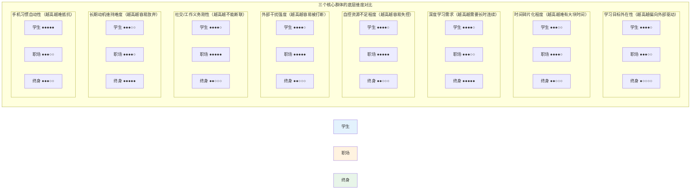

# 第6章：用户群体差异化需求分析

前5章建立的必要条件模型和干扰机制理论，是面向"典型学习者"的通用框架。但现实中，不同用户群体在学习目标、时间结构、认知资源基线、干扰来源、自控能力等底层维度上存在系统性差异——这些差异不是"偏好不同"，而是认知条件和约束结构的本质不同。如果忽视这些差异，用同一套策略服务所有用户，就会出现"对某些群体恰到好处、对另一些群体完全不可用"的情况。

本章从底层维度出发建立差异化分析框架，深入剖析三个核心用户群体的需求结构，识别共性需求与差异化需求，最终回答一个关键问题：为什么同一功能在不同群体身上效果差异巨大？

## 6.1 差异化分析维度框架

用户群体差异分析不能停留在"学生需要白噪音、职场人士需要日程整合"这类表层功能偏好上，必须深入到底层维度——这些维度直接决定了14个必要条件中哪些天然满足、哪些最容易缺失，以及四类干扰机制中哪几类对该群体破坏力最强。我们定义八个底层分析维度：

**学习目标维度**：区分应试导向（有明确考试deadline、成绩可量化、内容固定）、技能提升导向（解决实际工作问题、可立即应用、目标相对灵活）、兴趣探索导向（无外部压力、过程本身即目的、方向可能变化）、工作需要导向（任务驱动、必须完成、可能毫无兴趣）。目标性质直接决定动机来源（内在/外在）、自我效能感的建立方式、以及对时间压力的容忍度——应试者可以接受倒计时带来的唤醒提升，但兴趣探索者会因此直接放弃。

**时间结构维度**：区分大块完整时间（2小时以上连续可用、外界打断少）、碎片化时间（5-30分钟不等、常被不可控事件切割）、混合模式（有大块也有碎片、但大块时间不确定）。时间结构直接决定了加工连续性条件的满足难度、启动成本的容忍度、以及不同学习类型的适配性——大块时间适合理解和创造型学习，碎片化只能支持机械记忆。时间结构不是用户选择的结果，而是其生活结构的客观约束。

**学习类型维度**：即Task2第1.3节定义的四类学习——机械记忆型、理解领悟型、技能熟练型、创造生成型。不同学习类型对工作记忆容量、连续加工时间、干扰敏感度的要求有数量级差异。一个以记忆型学习为主的用户，对"连续不被打断20分钟"的需求远低于以理解型学习为主的用户。学习类型通常由学习目标决定，但同一用户在不同时段可能进行不同类型的学习。

**自控资源维度**：需要同时考虑特质自控水平（个体稳定的自控能力差异，与前额叶发育程度、习惯养成历史相关）和状态自控资源（当前可用的自控能量，受疲劳、压力、睡眠、先前自我控制任务的影响，遵循Baumeister的自我损耗规律）。学生群体特质自控水平相对较低（前额叶尚未完全发育），职场人士的状态自控资源在下班后已被工作大量消耗——两者的"自控资源基线"都低，但原因完全不同，应对策略也应不同。

**环境干扰特征维度**：区分安静环境（图书馆、自习室，外部感官干扰少）、嘈杂环境（宿舍、开放式办公室，背景噪音持续）、移动环境（地铁、公交，物理晃动+环境快速变化+不稳定网络）、频繁打断环境（工作中随时可能被同事/领导打断，家庭中可能被家人打断）。环境特征决定了哪类干扰占主导——移动环境中外部感官干扰是最大问题，频繁打断环境中认知后台干扰（"随时可能有事"的期待性焦虑）才是瓶颈。

**社交义务维度**：即消息必须及时回复的程度。高社交义务意味着不回消息有真实的负面后果（领导批评、工作失误、关系受损），中社交义务意味着大部分消息可以稍后回但少数重要消息不能漏，低社交义务意味着基本没有即时回复压力。这个维度直接决定了"无认知张力"条件能否满足——高社交义务用户即使屏蔽了通知，"万一有急事找我"的期待性焦虑仍然持续占用工作记忆，简单的通知屏蔽对他们完全无效。

**内在动机水平**：区分内在驱动（因为好奇、兴趣、成长渴望而学习，活动本身即奖赏）、外在驱动（因为考试、升职、压力、他人要求而学习，奖赏在外部）、混合驱动。内在动机水平直接影响启动摩擦的容忍度、对自主感支持的需求强度、以及面对困难时的坚持性——外在驱动用户对强制约束的逆反更强，但同时也更需要外部结构提供方向感。

**手机依赖基线**：即日常手机使用习惯的强度，包括日均使用时长、解锁频率、习惯性刷App的自动化程度。手机依赖基线高意味着行为习惯干扰极强——"拿起手机就自动刷微信"的回路已经高度自动化，单纯靠意志力抵抗几乎不可能；也意味着brain drain效应更强，因为手机作为高奖赏刺激物的心理显著性更高。这一维度与年龄无必然关系，但学生群体平均基线更高。

这八个维度不是独立的——它们相互关联、共同构成一个用户的"认知-环境-动机"约束结构。后续三节我们将看到，三个核心群体在这八个维度上呈现出系统性的、非随机的特征组合。

## 6.2 K12/大学生群体

### 群体画像

典型场景：一个大二学生，期末周前两周。课程表将一天切割成上午两节课、下午两节课，课间10-15分钟碎片，午饭后到下午上课前有1小时，晚7点到11点是大块自习时间。在图书馆自习时，手机放在桌面上，微信不断弹出班级群消息、社团通知、室友问"晚上吃什么"、暧昧对象的消息——每一条都可能"很重要"。手机使用习惯已经高度自动化：学15分钟就下意识拿起手机解锁，甚至不知道自己为什么解锁。考前一周焦虑感飙升，越焦虑越学不进去，越学不进去越焦虑，形成恶性循环。

这不是刻板印象——而是时间结构、社交生态、神经发育阶段、生活环境共同塑造的典型约束结构。当然有高度自律、能在嘈杂环境中深度学习的大学生，但他们是例外而非统计意义上的典型。

### 底层维度特征

| 维度 | 典型特征 |
|---|---|
| 学习目标 | 应试导向为主（期中/期末/考研/考公/四六级），目标清晰但外部强加，deadline明确且刚性 |
| 时间结构 | 课程表切割+大块晚自习/周末时间+课间碎片，混合模式但大块时间可预期 |
| 学习类型 | 四类混合但应试导向强：记忆（单词/知识点）+理解（概念/原理）+练习（解题）并重，考研阶段理解和练习占比更高 |
| 自控资源 | 特质自控水平相对较低（前额叶皮层在25岁左右才完全发育成熟）；状态资源波动大，考试前高压期焦虑消耗大量资源，平时相对充足但容易被即时诱惑耗尽 |
| 环境干扰特征 | 多场景切换：教室（嘈杂、有人说话）、宿舍（极强干扰：室友说话/打游戏/追剧声音）、图书馆（相对安静但仍有人走动/咳嗽/翻书）、偶尔在家 |
| 社交义务 | 极高：微信/QQ是核心社交基础设施，班级群、社团群、室友、朋友、恋爱关系——消息不及时回复有真实社交代价，错过群通知可能错过作业截止、活动时间变更等关键信息 |
| 内在动机水平 | 混合到偏外在：部分科目有兴趣，但大部分学习是为了考试/绩点/保研/就业，外在压力是主要驱动力 |
| 手机依赖基线 | 高：日均手机使用时长通常在6-10小时，解锁频率高，习惯性刷手机回路已经高度自动化，手机是社交、娱乐、信息获取的核心入口 |

### 必要条件满足/缺失分析

**天然相对满足的条件**：
- **目标清晰度（M3）**：应试目标非常具体——"看完第3章""做50道题""背100个单词"，考试范围和考察形式明确，天然满足具体执行意图的要求，不需要太多引导。
- **即时反馈可得（M2）**的部分要素：做题有对错反馈、背单词有记忆App的反馈、刷题量可以直观看到进度，学习内容本身提供了一定的即时反馈。
- **情境线索一致性（ENV3）的部分要素**：图书馆/自习室作为物理环境提供了较强的"学习"情境线索，但手机界面本身破坏这种一致性。

**最容易缺失的条件**：
- **外源性干扰可控（ENV1）**：微信/QQ消息是持续的外源性干扰源，且不能完全屏蔽——完全屏蔽意味着可能错过重要通知，社交代价高。
- **无认知张力（E2）**：即使消息不弹出，"有没有人找我""群里有没有新通知""ta有没有回我消息"的期待性焦虑持续产生蔡格尼克张力，是最难解决的瓶颈。
- **物理可见性管理（ENV2）**：在图书馆学习时，大多数学生习惯把手机放在桌面上而非包里或另一个房间，brain drain效应持续消耗20-25%工作记忆容量——但他们自己意识不到这一点。
- **自主感支持（M4）**：学习是外在驱动的，容易产生"被迫学习"的感受；如果学习模式再用强制锁机、惩罚（植物枯死）等方式约束，心理逆反会极强——越锁越想玩。
- **唤醒水平最优（E1）**：考试前高压期唤醒水平过高（焦虑），平时在宿舍学习唤醒水平可能过低（躺床上、太放松），两端都容易偏离最优区间。

**认知条件的满足情况**：当环境和情绪条件缺失时（通知干扰+认知张力+brain drain+焦虑），即使有强烈的学习动机，工作记忆容量（C1）也会被严重挤占，注意稳定（C3）难以维持，加工连续性（C4）频繁被打断——这解释了为什么很多学生"在图书馆坐了3小时感觉什么都没学进去"。

### 主导干扰类型分析

对学生群体而言，四类干扰的破坏力排序为：

1. **认知后台干扰（破坏力最大）**：未读消息的蔡格尼克张力+"随时可能有消息"的期待性焦虑+brain drain效应，三者叠加持续占用约30-40%的工作记忆容量。这是学生群体最核心的干扰——即使开了勿扰模式、手机静音，这种后台干扰仍然存在。
2. **外部感官干扰（第二大）**：微信/QQ通知弹窗、声音、震动直接捕获注意，且频率高。但这是最容易被现有产品解决的一类，也是学生最容易感知到的"干扰"。
3. **行为习惯干扰（第三大）**：手机依赖基线高，"学一会儿就想拿手机看看"的习惯回路极强。习惯触发频率高，且因为手机通常放在桌面上（视觉暗示持续存在），仅凭意志力几乎无法抵抗。
4. **内部心理干扰（第四大，但考试期急剧上升）**：平时主要是心智游移，但考试前焦虑性反刍（"我要是考砸了怎么办""还来得及吗"）会成为主要干扰源，将唤醒水平推离最优区间。

### 核心矛盾

学生群体最根本的需求冲突是：**高社交连接需求与高专注需求的剧烈冲突，且自控资源不足以调和这一冲突**。

这不是一个可以通过"屏蔽通知"解决的矛盾——因为社交需求是真实的、刚性的、有后果的。大学生正处于社交需求最强烈的人生阶段，同伴关系、群体归属、恋爱关系是核心心理需求，微信/QQ是满足这些需求的基础设施。完全切断社交连接会产生FOMO（错失恐惧）和被排斥的焦虑，这种焦虑本身对专注的破坏力比消息通知更大。

同时，这一群体的自控资源（无论是特质水平还是因焦虑消耗的状态资源）又相对不足，无法在"保持社交连接"和"深度专注"之间找到有效的平衡策略。他们需要的不是"要么全有要么全无"的极端方案，而是一种能让社交需求和专注需求在不同时间尺度上共存的机制——比如"学习期间消息暂存但让我知道没有紧急消息"而非"完全锁死无法看消息"。

另一个深层矛盾是：外在动机主导下，学习本身的奖赏感不足，容易与痛苦感联结，但学习模式如果用强制和惩罚来约束，又会进一步强化"学习=痛苦"的联结，损害长期的自主学习能力。

**特殊问题**：考研/考公/期末等高压时期的焦虑问题。高压力下唤醒水平过高，ECN被杏仁核抑制，工作记忆被焦虑想法占据，此时即使环境条件完美（手机在另一个房间、绝对安静）也无法深度学习。这种情况下"更严格的锁机""更长的专注时间"不仅无效，反而可能加剧焦虑——因为"学不进去"本身又成为新的焦虑源。学习模式需要识别高焦虑状态并提供唤醒调节支持（如呼吸放松、降低目标难度），而不是继续施压。

### 设计含义

1. **"消息暂存+紧急通道"而非"完全屏蔽"**：必须承认学生无法完全切断社交连接，设计重点应该是"让消息不打断学习但消除不确定性"——比如学习期间消息静默存储，但允许设置3-5个"紧急联系人"可以突破静音，同时显示"没有紧急消息"的安心提示（而非显示有多少条未读）。核心是消除"万一有人急事找我"的认知张力，而不是消除消息本身。

2. **物理隔离引导比软件锁机更有效**：针对brain drain效应和习惯干扰，最有效的单一干预是让学生把手机放到包里/另一个房间。软件设计不应该试图用锁机来对抗物理可见性问题，而应该通过温和的引导、物理距离检测、习惯养成提示来鼓励物理隔离——这符合自主感原则，且效果比任何软件锁机都好。

3. **强制约束需要"弹性边界"**：完全无法退出的严格模式会触发强烈逆反。更好的策略是"默认保护+允许有代价地打破"——比如退出时不是简单的"确定要放弃吗？"，而是"现在退出将丢失12分钟的专注状态，你可以选择：①继续专注 ②快速查看消息（30秒后自动返回） ③结束本次学习"。给用户选择权和控制感，同时让打破专注的代价可见。

4. **焦虑期需要特殊支持模式**：识别高焦虑信号（短时间内频繁启动又退出、设置超长短不实际的目标时长、深夜学习），提供降低唤醒的选项——缩短默认专注时长到25分钟、引导先做1分钟呼吸放松、提示"先做一道简单题进入状态"而非直接开始高强度学习。高压期的目标不是"学多久"，而是"能学进去"。

5. **利用社会规范而非对抗社交需求**：社交需求不只是干扰源，也可以是动力源。"和室友一起在图书馆学习"这种社会学习场景，同伴的存在本身就能提供情境线索和社会促进效应。学习模式可以利用这种同伴效应，而非试图将用户隔离在社交真空中。

## 6.3 职场人士群体

### 群体画像

典型场景：一个工作3-5年的职场人，想利用业余时间提升技能——考职业资格证书、学一门新编程语言、准备MBA。工作日的时间被工作完全切割：早上通勤40分钟地铁，上班时间工作消息不断，午休可能有20-30分钟空闲但经常被工作占用，晚上7点半到家，吃完饭8点半，累得只想瘫在沙发上刷手机，好不容易鼓起劲学到10点半，中间工作群还可能弹出消息问"那个方案改完了吗"。周末有大块时间但常常被加班、家务、社交挤占。手机里工作微信和个人微信混在一起，领导的消息"必须秒回"——不回可能影响绩效考核甚至饭碗。已经工作了一天，意志力资源几乎耗尽，"再学2小时"需要巨大的启动能量，但真的开始后如果被工作消息打断，回来就再也进不了状态。

### 底层维度特征

| 维度 | 典型特征 |
|---|---|
| 学习目标 | 技能提升导向+工作需要导向混合：有些是为了职业发展主动提升（内在+外在混合），有些是工作要求不得不学（纯外在驱动），目标与工作场景直接相关、讲求实用性和即时应用 |
| 时间结构 | 典型碎片化模式：工作日通勤碎片（20-40分钟）+下班后小块时间（1-2小时，但极不确定）+周末不确定大块时间，随时可能被工作消息/加班打断，时间不可控是核心特征 |
| 学习类型 | 理解领悟型+技能熟练型为主：需要理解新概念/新框架、练习新技能（编程/数据分析/业务建模），问题导向、目标明确（"我要学会用XX工具解决YY问题"），纯机械记忆占比较低 |
| 自控资源 | 特质自控水平通常不低（能完成高等教育、进入职场），但**状态自控资源在下班后已被工作大量消耗**——一天的决策、沟通、问题解决、情绪劳动已经耗尽了大部分自我控制能量，晚上可用的意志力处于一天中的低谷 |
| 环境干扰特征 | 多场景且高度不可控：通勤移动环境（地铁/公交晃动、噪音、拥挤、信号不稳）、公司（开放式办公室、同事随时打断、电脑上工作消息不断）、家里（可能有家人/室友干扰、电视声音、沙发/床等放松线索） |
| 社交义务 | 最高：工作消息有真实的职业后果——领导的消息不及时回可能被视为工作态度问题、紧急工作需求不响应可能导致项目失误、客户消息不能漏；相比之下个人社交消息压力较小，但工作消息的刚性义务远高于学生群体的社交义务 |
| 内在动机水平 | 混合且波动大：技能提升初期有新鲜感和成长动力，遇到瓶颈期容易下降；工作需要的学习则偏外在，容易产生"被迫"感；长期坚持是最大挑战，因为学习的收益（升职/跳槽/能力提升）在数月甚至数年后 |
| 手机依赖基线 | 中等偏高：工作要求随时在线，手机使用很大一部分是工作相关；但刷短视频/社交媒体的习惯同样存在，且疲劳时更容易用刷手机来"休息"，结果越刷越累 |

### 必要条件满足/缺失分析

**天然相对满足的条件**：
- **目标清晰度（M3）**：职场人士的学习通常是问题导向的——"我要学会Python数据分析来处理报表""我要考过PMP证书"，目标具体且与实际需求挂钩，天然比"我要学习"这类模糊目标清晰。
- **自我效能感（E3）**的基础水平：职场人士通常有更多成功应对挑战的经验，面对新学习任务时"我能学会"的基础信念通常比（反复经历考试挫败的）学生更强，但过度疲劳时这一信念会快速下降。
- **情境线索一致性（ENV3）的潜力**：如果能建立"到家后坐到书桌前就是学习时间"的仪式，可以形成较好的情境线索；但问题是家里同时是休息、娱乐、生活的空间，线索混杂。

**最容易缺失的条件**：
- **无认知张力（E2）**——这是职场人士最致命的瓶颈：工作消息永远存在，"工作群会不会有紧急事""客户有没有发消息""领导会不会找我"的期待性焦虑24小时在线，即使非工作时间也持续产生蔡格尼克张力。和学生的社交焦虑不同，职场人士的这种焦虑有直接的职业后果，更难通过理性思考放下。
- **启动摩擦最小化（M1）**：下班后意志力已经枯竭，任何需要付出努力的启动步骤（设置参数、选择模式、写目标）都可能成为压垮骆驼的最后一根稻草——"太累了，明天再学吧"是高频结局。启动摩擦对职场人士的阻碍比学生大得多，因为可用意志力太少。
- **加工连续性（C4）**：工作消息随时可能打断，且这种打断无法预测、无法避免（"看到领导消息不回"不是选项）。被打断后，由于本来意志力就低，重新回到学习状态的难度成倍增加——"既然被打断了，今晚就不学了"是很常见的反应。
- **唤醒水平最优（E1）**：下班后经常处于两种非最优状态之一——要么工作太累唤醒过低（瘫在沙发上不想动），要么工作中积累的压力让唤醒过高（还在想工作上的烦心事）。两种状态都不利于深度学习。
- **物理可见性管理（ENV2）**：在家学习时手机通常在手边，因为"万一有工作消息呢"——这个理由让物理隔离几乎不可能实现，brain drain效应持续存在。

### 主导干扰类型分析

对职场人士而言，四类干扰的破坏力排序为：

1. **认知后台干扰（破坏力最大）**：工作相关的蔡格尼克张力+"随时可能有工作消息"的期待性焦虑+工作问题的注意力残留，三者叠加是职场人士最核心的干扰。即使完全没有通知弹出，"工作"这个未完成的大任务持续在后台占用认知资源。这一层干扰是现有专注App完全没有触及的——屏蔽通知解决不了"心里想着工作"的问题。
2. **外部感官干扰（第二大）**：工作消息通知是刚性干扰源，无法完全屏蔽。通勤环境中的噪音、晃动、报站声也是持续的外部干扰源。
3. **内部心理干扰（第三大）**：下班后的疲劳（唤醒过低）和工作压力残留（唤醒过高）是主要的内部干扰。疲劳状态下DMN更容易激活、心智游移更频繁；工作压力残留则让注意力反复飘向工作问题。
4. **行为习惯干扰（第四大但下班后增强）**：疲劳状态下System 2（理性控制）能力下降，System 1（习惯系统）主导行为——"累了就想刷手机放松"的习惯在晚上意志力低谷期特别容易触发。

### 核心矛盾

职场人士最根本的需求冲突是：**学习无法完全脱离工作通讯，但工作通讯持续占用认知资源，且工作已经消耗了绝大部分自控资源，剩余资源不足以支撑深度学习**。

这是一个三重约束叠加的困境：
- 第一重：工作不能完全放下——完全屏蔽工作消息有真实的职业风险，这不是"意志力不够"的问题，而是现实约束。
- 第二重：即使不回消息，"工作在那里"的认知张力持续存在——蔡格尼克效应不是靠意志力能消除的。
- 第三重：白天的工作已经耗尽了自控资源——晚上学习需要从已经见底的能量池里再挤出来，这就是为什么"知道该学习但就是动不起来"。

"严格锁机"对职场人士不仅不可接受，甚至是荒谬的——如果学习模式要求你在学习期间完全无法查看工作消息，大多数职场人士根本不会开启这个模式，因为职业风险太高。这不是"他们不够重视学习"，而是理性的风险计算——错过重要工作消息的代价远大于少学1小时的代价。

通勤学习是职场人士特有的场景，但它面临特殊的困境：移动环境中外部干扰极强（噪音、晃动、上下车、信号不稳定），时间长度不确定（可能坐过站、可能这一站有座下一站没座），且通勤结束时学习被强制打断，几乎不可能完成启动期进入深度加工。通勤学习本质上只能支持机械记忆型和浅度理解型学习，无法支撑深度理解或技能练习——但许多职场人士恰恰是把通勤时间当作"主要学习时间"，期望与现实的错配导致挫败感。

**特殊问题**：
- **"边界模糊"问题**：工作和生活在手机上没有物理边界——同一个微信App里既有工作群也有朋友聊天，同一条通知可能是紧急工作也可能是垃圾推送。工作-生活边界的模糊让认知张力无法通过物理边界（如离开办公室）来释放，"下班"在认知层面并没有真正发生。
- **"休息悖论"**：下班后确实很累，需要休息，但刷手机作为"休息"方式实际上并不能有效恢复认知资源——反而可能因为信息过载和情绪刺激加剧疲劳。但因为自控资源低，又没有比刷手机更容易启动的休息方式，形成"越刷越累、越累越刷"的循环。

### 设计含义

1. **"工作-学习边界建构"而非"完全切断工作"**：核心不是让职场人士"别看工作消息"，而是帮助他们在心理上建立"现在是学习时间，工作的事稍后处理"的边界。具体策略可以包括：学习前快速扫一眼工作群确认没有紧急事项（消除"万一有急事"的焦虑）→设置自动回复"我在专注学习，紧急事项请电话联系"（给他人预期，也给自己安心）→非紧急消息学习结束后统一处理。这比完全屏蔽消息更现实、更有效。

2. **"零启动摩擦"是生死线**：对于下班后意志力见底的用户，启动学习必须做到零决策、零设置、一键开始。学习模式的入口应该在最容易触达的位置（锁屏小组件/控制中心），所有参数都应该有智能默认值——不要让用户在"要不要花30秒设置"这个决策点上放弃。默认时长应该比学生短（25-30分钟而非45分钟），因为状态自控资源低，太长的目标会让人望而却步。

3. **"可中断设计"而非"不可打断保护"**：职场人士的学习大概率会被打断，设计重点不应该是"防止打断"（做不到），而是"打断后快速恢复"。具体包括：打断时提供"30秒快速记录"功能（写下刚才学到哪里、在想什么，类似断点续传的书签）；返回时提供"1分钟上下文恢复"（快速回顾刚才学的内容要点）；接受学习会话被分割成多个小块的现实，不把"连续学45分钟"作为唯一的成功标准。

4. **通勤场景需要特殊模式**：通勤学习不应按深度专注模式设计，而应该适配移动环境的约束——默认时长15-25分钟（匹配平均通勤段长度）、支持离线使用、内容适合音频/碎片化消费（记忆卡片、知识点音频讲解）、检测到走动/晃动时自动切换为"通勤轻量模式"（减少视觉交互、增加语音交互）。承认通勤学习的局限性，不要在通勤场景追求深度学习。

5. **唤醒调节是必备功能**：下班后需要在"太累"和"太焦虑"之间调节到合适的唤醒水平。学习模式可以在启动时做简单的状态检测（询问"现在感觉怎么样？精神饱满/有点累/非常累/心里有事静不下来"），然后根据状态提供不同的启动引导——累的时候先做2分钟拉伸/轻度活动提升唤醒，焦虑的时候先做1分钟呼吸放降低唤醒，而不是一刀切地"开始专注"。

## 6.4 终身学习者群体

### 群体画像

典型场景：一个30-45岁的人，对某个领域有持续的兴趣——可能是历史、哲学、天文学、绘画、音乐理论、一门新语言。没有考试压力，没有人要求他学，纯粹出于好奇心和成长的内在动力。时间安排相对自由——可能是自由职业者、可能是工作相对稳定不加班的职场人、可能是全职父母在孩子上学后的时间。但时间的问题不是"没有"，而是"太灵活以至于永远可以往后推"——今天有事可以明天学，这周忙可以下周学，没有外部deadline，启动永远是最大的难题。学习常常是"浅尝辄止"，看了很多书、听了很多课，但感觉没有真正深入；有时候很投入，但缺乏反馈不知道自己学得怎么样；学了一段时间后兴趣转移到新领域，之前的学习慢慢搁置。没有考试的压力是好事，但也意味着没有外部反馈和验收标准，"学会了"的定义模糊，容易在"舒适区"里重复而没有真正进步。

### 底层维度特征

| 维度 | 典型特征 |
|---|---|
| 学习目标 | 兴趣探索导向为主：内在驱动，出于好奇、热爱、自我实现；目标模糊且可变——"了解罗马帝国历史"而非"期末考90分"；方向可能随兴趣转移，没有固定路径 |
| 时间结构 | 高度灵活但也高度不确定：理论上有可支配时间，但没有外部结构强制保护，容易被家务、琐事、临时安排、情绪状态挤占；大块时间存在但需要主动"保护"不被其他事务占据 |
| 学习类型 | 理解领悟型+创造生成型比例高：不仅是"学知识"，更可能是"理解思想体系""形成自己的见解""进行创作（写作/绘画/音乐）"，记忆型学习占比较低 |
| 自控资源 | 特质自控水平通常较高（成年人、有自我管理能力），但没有外部压力时，自控资源的分配优先级容易让位于更紧急（但不一定更重要）的事务；状态资源波动取决于生活整体状态 |
| 环境干扰特征 | 外部干扰相对较少：通常有相对安静的家庭学习环境或咖啡馆/书店环境，没有工作/考试那种高频打断；但家庭琐事干扰（快递、家务、家人需求）存在 |
| 社交义务 | 低到中：没有必须秒回的工作消息，没有错过群通知就挂科的风险；社交消息可以几小时后再回，社交FOMO较低；但家庭义务（照顾孩子/伴侣需求）可能构成新的打断源 |
| 内在动机水平 | 高但脆弱：以内在动机为主是这一群体的核心特征和核心优势，但内在动机本身是波动的——遇到困难时、长期看不到进展时、兴趣转移时，内在动机会快速下降，且没有外在压力兜底 |
| 手机依赖基线 | 中等：手机使用更多是信息获取和社交，没有"必须随时在线"的工作压力；但在缺乏外部结构时，刷手机仍然是最容易的"默认活动"，是启动学习的主要竞争对手 |

### 必要条件满足/缺失分析

**天然相对满足的条件**：
- **自主感支持（M4）**：学习是自主选择的，没有"被迫"感，心理逆反的基础不存在——只要学习模式不施加不必要的强制约束，自主感天然满足。
- **无认知张力（E2）**：相比学生的社交焦虑和职场人士的工作焦虑，终身学习者的"未完成事务张力"相对较低，可以更从容地进入学习状态。
- **外源性干扰可控（ENV1）**：没有高频、刚性的必须回应的消息源，通知屏蔽的可行性高。
- **唤醒水平最优（E1）**：在没有外部压力的情况下，唤醒水平通常处于较温和的区间，不太会出现考试焦虑或工作压力导致的极端偏离。

**最容易缺失的条件**：
- **目标清晰度（M3）**——这是终身学习者最核心的瓶颈：兴趣驱动的学习天然目标模糊——"学历史"不是一个具体目标，"读罗马帝国衰亡史"也不够具体。没有外部考试/任务来定义"学到什么程度算学会"，目标设定本身就需要认知努力，而模糊的目标直接损害启动和坚持。
- **启动摩擦最小化（M1）**：没有外部压力时，"现在开始学习"永远可以和"再刷10分钟手机""先把衣服洗了""今天有点累明天再学"竞争，而后者的启动摩擦更低。启动不是最难的事，但永远是最容易推迟的事。
- **即时反馈可得（M2）**：没有考试、没有作业批改、没有老师反馈，学习进展的可见性极低——读了100页书，但理解了多少？记住了多少？能不能用自己的话讲出来？缺乏反馈是长期坚持的最大障碍之一，因为大脑的奖赏系统需要证据来证明"我在进步"。
- **加工连续性（C4）**：单次学习的连续性通常没问题（一旦开始且被兴趣驱动，可以持续较长时间），但**跨会话的连续性**是大问题——学了一周停了两周，再回来时之前的理解上下文已经消退，需要从头"找感觉"，这种"重启成本"是长期坚持的隐形杀手。
- **认知负荷平衡（C2）**的"相关负荷"保障：缺乏引导的自主学习容易走两个极端——要么在舒适区里做浅加工（反复看已经懂的内容，产生流畅感错觉），要么突然跳到过难的内容导致自我效能感崩塌。元认知能力不足时，很难自己把握"适当难度"这个度。

### 主导干扰类型分析

对终身学习者而言，四类干扰的破坏力排序与其他两群显著不同：

1. **内部心理干扰（破坏力最大）**：不是外部通知打断，而是内在动机波动、启动困难、方向选择困惑、缺乏反馈的孤独感、"学这个有什么用"的意义质疑。心智游移频率可能不高，但存在更深刻的存在性干扰——"我到底在做什么""这值得吗"。
2. **行为习惯干扰（第二大）**：在没有外部结构和压力时，"刷手机"作为默认行为的吸引力更大——因为它比深度学习的启动摩擦低得多，且能提供即时奖赏。手机依赖基线可能不如学生高，但在启动竞争中，刷手机永远是更轻松的选项。
3. **认知后台干扰（第三大）**：主要不是消息焦虑，而是家庭琐事、待办事项的蔡格尼克张力——"地还没拖""快递要去取""账单要还"这类生活事务的心理负载。
4. **外部感官干扰（第四大）**：相对来说最不严重——可以关掉通知、选择安静环境，外部干扰是四类干扰中最容易解决的。

### 核心矛盾

终身学习者最根本的需求冲突是：**内在动机驱动的学习需要自由和灵活性，但缺乏外部结构时启动困难、方向模糊、难以长期维持**。

这是一个"自由与结构的悖论"：外在约束（考试、deadline）虽然令人痛苦，但它们提供了三样珍贵的东西——明确的方向（学什么、学到什么程度）、启动的压力（到时间了必须学）、反馈的标准（考多少分）。终身学习者恰恰缺少这三样东西，而自由探索的快乐无法完全替代它们的功能。

没有deadline，启动永远可以推迟；没有考试，不知道自己学得怎么样；没有课程大纲，容易在知识的海洋中迷失方向——"什么都想学一点"但什么都没学深。同时，终身学习者又反感被结构束缚——他们之所以选择自主学习，正是因为不想被应试教育的僵化框架约束。所以解决方案不是给他们套上考试式的枷锁，而是提供"轻量结构"——足够引导方向和启动，但不损害自主感和灵活性。

另一个核心矛盾是**长期动机维持vs单次专注**。现有学习模式几乎全部聚焦于"单次学习会话的专注"——锁机、计时、屏蔽干扰。但终身学习者的核心问题不是"学的时候不专注"，而是"今天没有开始学""上周学了这周没学""学了一个月放弃了"。他们需要的不是更强的单次专注工具，而是**长期学习节奏的支持**——帮助维持学习习惯、追踪长期进展、在动机低谷期提供继续下去的理由。

**特殊问题**：
- **方向选择困难**：兴趣广泛时，"学什么"本身就是一个消耗决策资源的问题。今天想学历史，明天想学编程，后天想练吉他——选择太多反而导致无法开始任何一个。
- **无反馈的孤独学习**：长期自主学习缺乏社交反馈和确认——没有人讨论、没有人指出你的理解错误、没有人肯定你的进步，这种孤独感会逐渐侵蚀动机。
- **"舒适区陷阱"**：因为没有挑战标准，容易停留在"看得懂但不会用""读过了但没记住"的浅加工状态，把流畅感错觉当成了真正的理解——元认知错觉在自主学习中尤其普遍，因为没有测试来打破这种错觉。

### 设计含义

1. **"轻量目标结构"而非"无目标自由"**：帮助终身学习者把模糊兴趣转化为具体可执行的小目标，但目标的设定应该足够灵活——比如"今天读20页并写下3个自己的想法"比"今天学2小时"更有意义。不强制设定刚性目标，但提供目标模板和建议，让用户自己选择而非强加。

2. **启动支持优先于专注保护**：对于不缺专注能力但缺启动动力的用户，设计重点应该是降低启动门槛和提供启动线索——比如"学习预约"功能（提前设定好明天下午3点学习，到时自动进入准备状态）、"两分钟启动"引导（不要想"学2小时"，只想"先打开书看2分钟"）、习惯链追踪（连续学习天数记录，但不惩罚中断）。

3. **主动反馈机制替代考试**：没有外部反馈时，学习模式需要帮助用户自己生成反馈——比如"读完一节后，用自己的话总结核心观点（语音或文字输入）"、"学完一个主题后，做几个自测题检验理解"、"记录'今天学到了什么'的学习日志"。这些不是考试，而是主动提取练习，既促进记忆理解，又提供进展反馈。

4. **跨会话连续性支持**：解决"停了两周再回来接不上"的问题。每次学习结束时，自动生成一个"接续点"——包括学到哪里、核心概念是什么、下次建议从哪里开始、一个引导性问题帮助快速激活先备知识。下次开始时，不是从零开始，而是从接续点继续，降低重启成本。

5. **长期节奏支持而非单次会话优化**：提供周/月尺度的学习节奏视图，帮助用户看到自己的长期模式，而非只关注单次时长。在动机低谷期不施压，而是提供温和的回归路径——中断不是失败，"重新开始"永远是受欢迎的。可以引入"学习主题"概念，支持在不同兴趣方向之间切换，不因为一段时间没学某个主题就判定"失败"。

## 6.5 跨群体共性需求与差异化需求总结矩阵

### 14个必要条件的群体敏感度对比

下表对比三个群体在14个必要条件上的敏感度差异——敏感度高意味着该条件缺失时对该群体的学习破坏更大，或者说该条件是该群体的典型瓶颈。

| 必要条件 | K12/大学生 | 职场人士 | 终身学习者 | 说明 |
|---|---|---|---|---|
| **ENV1 外源性干扰可控** | ★★★★★ | ★★★★☆ | ★★☆☆☆ | 学生消息频率最高且刚性，职场次之，终身学习者最不严重 |
| **ENV2 物理可见性管理** | ★★★★☆ | ★★★☆☆ | ★★★★☆ | 学生和终身学习者手机常放桌面，职场人因"随时看消息"难以隔离 |
| **ENV3 情境线索一致性** | ★★★☆☆ | ★★★★☆ | ★★★★★ | 职场和家庭环境线索混杂，终身学习者最需要创造学习情境 |
| **E1 唤醒水平最优** | ★★★★☆ | ★★★★★ | ★★☆☆☆ | 学生考试期焦虑高，职场下班后疲劳/压力两极化，终身学习者相对温和 |
| **E2 无认知张力** | ★★★★★ | ★★★★★ | ★★★☆☆ | 学生社交焦虑+职场工作焦虑是最大瓶颈，终身学习者张力较低 |
| **E3 自我效能感** | ★★★☆☆ | ★★★☆☆ | ★★★★☆ | 终身学习者缺反馈容易效能感下降，学生和职场人基础尚可但受挫时快速下降 |
| **C1 工作记忆容量充足** | ★★★★☆ | ★★★★★ | ★★☆☆☆ | 后台干扰多时容量被挤占，职场人被工作残留占用最多 |
| **C2 认知负荷平衡** | ★★★☆☆ | ★★★☆☆ | ★★★★☆ | 终身学习者自主把握难度易失衡，学生有教材引导相对好 |
| **C3 注意稳定维持** | ★★★★☆ | ★★★★☆ | ★★★☆☆ | 外部/后台干扰多时注意难稳定，内在干扰对终身学习者较大 |
| **C4 加工连续性** | ★★★★☆ | ★★★★★ | ★★★★☆ | 职场人最易被打断，学生社交打断频率高，终身学习者跨会话连续性问题突出 |
| **M1 启动摩擦最小化** | ★★★☆☆ | ★★★★★ | ★★★★★ | 职场人意志力耗尽时启动极难，终身学习者无压力易拖延，学生有考试压力启动相对容易 |
| **M2 即时反馈可得** | ★★☆☆☆ | ★★★☆☆ | ★★★★★ | 学生有做题/考试反馈，职场有应用反馈，终身学习者最缺反馈 |
| **M3 目标清晰度** | ★★☆☆☆ | ★★☆☆☆ | ★★★★★ | 应试/工作目标天然清晰，兴趣学习目标模糊是核心瓶颈 |
| **M4 自主感支持** | ★★★★☆ | ★★★★★ | ★★☆☆☆ | 外在驱动群体对强制约束逆反强，终身学习者自主感天然满足 |

（评分标准：★=几乎不是瓶颈，★★★=中等瓶颈，★★★★★=最核心瓶颈）

### 共性需求（所有群体都需要）

1. **外源性干扰的基础控制**：所有群体都需要通知不随意打断学习——差异在于屏蔽的严格程度和例外机制，而不是要不要屏蔽。
2. **工作记忆保护**：所有深度学习都需要足够的工作记忆容量，任何持续占用后台资源的干扰（brain drain、蔡格尼克张力）都会损害学习。
3. **启动摩擦最小化**：无论哪个群体，启动步骤越简单越好——差异仅在于"可接受的启动步骤数量"，职场和终身学习者的容忍度接近零。
4. **不施加惩罚性约束**：无论哪个群体，惩罚（植物枯死、扣分、负面评价）都会破坏自主感和动机，没有任何群体从惩罚中受益。
5. **加工连续性保护**：所有群体在度过启动期后都需要不被打断——差异在于打断的来源和"可以打断"的例外情况。

### 差异化需求

| 需求维度 | 学生群体 | 职场人士 | 终身学习者 |
|---|---|---|---|
| 核心瓶颈 | 社交-专注冲突+自控资源不足 | 工作-学习边界模糊+意志力耗尽 | 目标模糊+反馈缺失+长期维持难 |
| 消息处理策略 | 暂存+紧急联系人通道 | 预确认+自动回复+稍后统一处理 | 基本屏蔽即可 |
| 默认时长建议 | 30-45分钟（考研期可更长） | 25-30分钟（意志力有限） | 弹性（但建议45-90分钟块） |
| 启动设计重点 | 物理隔离引导+降低焦虑 | 零摩擦一键启动+唤醒调节 | 预约提醒+两分钟启动引导 |
| 打断应对策略 | 快速查看后返回+弹性退出 | 上下文保存+快速恢复 | 跨会话接续点 |
| 反馈重点 | 不做负反馈+保护自我效能 | 进展可见+成就感 | 主动提取+自我生成反馈 |
| 约束弹性 | 高弹性（逆反强） | 中弹性（需要控制感） | 低弹性约束（更需要轻量结构） |
| 焦虑/压力应对 | 高压期唤醒调节 | 下班后疲劳恢复+工作边界 | 意义感维持+方向引导 |

### 三个群体的差异画像雷达图

下面的Mermaid分组条形图可视化了三个群体在八个底层维度上的典型水平：

从这个对比中可以清晰看到三个群体的差异"形状"完全不同：学生群体在社交义务、手机习惯、自控不足上得分高；职场人士在碎片化、外部干扰、社交义务、自控资源耗尽上得分全面最高；终身学习者则在动机维持、深度学习需求上最高，但外部约束维度得分较低。这意味着没有"万能"的学习模式配置——同一套参数在三个群体身上面临的瓶颈完全不同。

## 6.6 核心洞察：为什么同一功能对不同群体效果差异巨大

用户群体差异化分析最终指向一个反直觉但至关重要的洞察：**14个必要条件作为深度学习的底层需求是跨群体普遍成立的，但满足这些条件的具体策略必须因群体的约束结构不同而不同**。没有放之四海而皆准的"最优设置"，只有在特定约束结构下的"最优适配"。

考虑"严格锁机，学习期间完全无法退出和使用其他App"这个功能。为什么它对部分学生用户似乎有短期效果？因为学生群体的核心矛盾是高社交需求+低自控资源，严格锁机用外部强制力暂时解决了"忍不住刷手机"的行为习惯干扰，在考前高压期（外在动机极强）逆反心理被"必须考过"的压力暂时压制，所以短期内"确实能学进去"。但这是一种"借"来的控制力——用户把自己的控制权借给了App，一旦离开App（考完试/卸了App），自主专注能力反而更弱。而对职场人士，严格锁机直接违背了"不能错过工作消息"的现实约束，要求他们在"学习"和"工作风险"之间做选择，绝大多数人会理性选择工作——不是因为他们不重视学习，而是因为错过重要工作消息的代价远大于少学1小时。所以严格锁机在学生群体中可能有短期"有效"的幻觉，对职场人士则完全不可接受，这不是偏好差异，而是约束结构的本质差异。

再考虑"番茄工作法25分钟专注+5分钟休息"。为什么对备考学生可能"感觉合适"？因为应试学习中大量的是记忆+练习型任务，工作记忆不需要同时保持多个复杂概念，25分钟足以完成一个练习单元，且学生的时间结构（课程表也是45分钟切割）天然适配这种节奏。但对于进行深度理解（理解复杂理论、推导证明）或创造生成型学习（写作、编程、设计）的用户，25分钟可能刚好在想法即将涌现、理解即将达成的时刻被强制打断——这种人为打断的认知代价和外部通知打断是一样的：工作记忆上下文被清空，需要重新付出启动成本。所以番茄钟对记忆/练习型学习是合理的，对理解/创造型学习是破坏性的，而终身学习者恰恰是理解/创造型学习占比最高的群体。

这些例子揭示了一个更根本的设计原则：**学习模式不应该是一个固定的"模式"，而应该是一套基于用户当前约束结构动态调整的"支持系统"**。核心要素——保护工作记忆、减少外源性干扰、支持加工连续性、最小化启动摩擦、维护自主感——这些底层原则对所有群体都是一致的。但具体的参数配置（默认时长、通知策略、约束强度、反馈方式、启动流程）必须根据用户在八个底层维度上的位置来适配。

更进一步，即使是同一个用户，在不同场景下（比如同一个大学生，考研冲刺期vs平时写作业vs通勤背单词），其维度特征也会发生变化——考研期理解型学习为主、唤醒过高需要调节；平时碎片时间背单词属于记忆型、对连续性要求低；通勤场景外部干扰极强、只能做轻度学习。真正智能的学习模式不应该让用户手动切换"学生模式""职场模式"，而应该通过学习类型识别、时间结构感知、环境信号检测、状态评估来动态调整支持策略——但这是第7章设计原则要讨论的内容。

差异化分析的最终结论是：**不存在"最好的学习模式"，只存在"最适配当前用户、当前场景、当前学习类型的支持策略"**。理解不同群体的底层约束结构，不是为了给用户贴标签，而是为了在正确的时间、以正确的方式、提供正确的支持——既不缺失必要的保护，也不施加不必要的约束。

<!-- changelog -->
