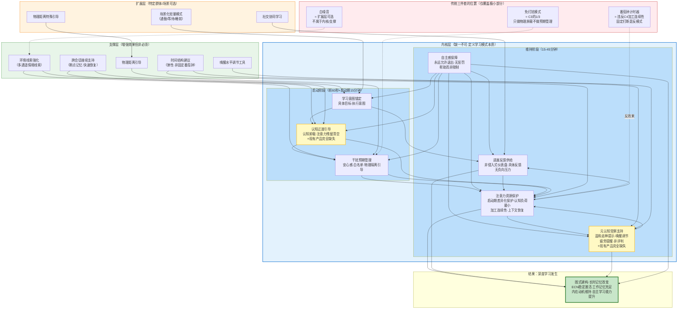

# 第8章：学习模式核心构成要素定义

前7章完成了学习本质的拆解、用户痛点溯源、必要条件建模（14个条件）、干扰机制分析（6种机制）、技术-心理映射、群体差异分析和根本假设验证。本章是整个第一性原理分析的综合产出：基于前面所有分析，推导出学习模式的**最小完备要素集**——回答一个根本问题："一个真正能促进深度学习的学习模式，必须包含哪些构成要素？"

本章不讨论具体功能实现，而是定义"什么是学习模式"的本质——缺了任何一个内核要素，它就不再是"学习模式"，而退化为"勿扰模式+计时器+白噪音"这类表层工具。

---

## 8.1 核心要素设计原则

在定义具体要素之前，必须先确立核心要素的筛选和设计原则。这些原则本身源自前7章的分析结论，是判断"什么算内核要素、什么不算"的元标准。

### 8.1.1 最小完备性原则

核心要素集必须是**最小**且**完备**的。"最小"意味着没有冗余——任何一个内核要素都不能被其他要素的组合所替代，去掉它系统就会发生本质性退化；"完备"意味着没有遗漏——满足所有内核要素后，即使没有任何扩展功能，学习模式也能有效支持深度学习。

这与Task 4建立的必要条件方法论一脉相承：内核要素就是学习模式的"必要条件"——缺了它不行，但它不承诺"有了就行"。我们追求的不是"功能越多越好"，而是"不多一个，不少一个"的精确平衡。现有产品的通病是功能堆砌（白噪音、种树、排行榜、打卡、成就徽章……），却遗漏了真正关键的内核要素。

### 8.1.2 原理溯源原则

每个核心要素必须能**明确追溯**到Task 4的14个必要条件和Task 5的6种干扰机制。不接受"听起来有道理"的直觉设计，不接受"别人家产品都有"的行业惯例，不接受"用户说他们想要"的表面需求——每个要素都必须有清晰的认知科学或心理学原理支撑，对应明确的必要条件，对抗明确的干扰机制。

这一原则直接回应了Task 8识别的根本假设问题：现有产品的很多设计基于未经验证的隐含假设（如"越严格的约束越有效""白噪音有助于专注"），而我们的要素体系建立在经过Task 6证据分级的科学原理之上。

### 8.1.3 不可替代性原则

判断一个要素是否属于内核层，核心标准是**反事实验证**：假设我们把这个要素完全移除，学习模式会变成什么？如果它退化成某种我们已知但效果有限的东西（如移除意图锚定就退化成"勿扰模式"，移除自主感就退化成"强制锁机"），那这个要素就是内核要素；如果移除后只是"效果差一点"但本质不变，那它属于支撑层或扩展层。

这一原则严格区分了"锦上添花"和"缺了不行"。很多现有产品的功能属于前者——有它用户体验好一点，但没有它学习模式仍然成立。

### 8.1.4 三层分类原则

核心要素分为三个层级，每层有不同的判定标准和设计逻辑：
- **内核层（Core）**：缺一不可，定义"什么是学习模式"的本质；反事实验证：去掉后退化为非学习模式
- **支撑层（Supporting）**：增强效果但非必须；反事实验证：去掉后学习模式仍能工作，但效果下降、适用场景变窄
- **扩展层（Extended）**：针对特定群体/场景可选；反事实验证：去掉后对主流用户和核心场景没有影响

三层不是"重要性"的区分（支撑要素可能对特定用户极其重要），而是"必要性"的区分——内核层是所有场景、所有用户都需要的底线。

### 8.1.5 为什么这不是"更好的勿扰模式"

需要特别强调：我们定义的学习模式与"免打扰+白噪音+番茄钟"三件套有**本质差异**，这种差异体现在三个根本层面：

第一，**问题域不同**。三件套解决的是"如何减少外部干扰"这个问题，它假设"没有外部干扰=专注学习"——但Task 5的干扰分类学明确告诉我们，外部感官干扰只占所有干扰的约25%，剩下75%的认知后台干扰（brain drain、蔡格尼克张力）、内部心理干扰（走神、焦虑）、行为习惯干扰（自动刷手机）是三件套完全没有触及的。学习模式需要应对全部四类干扰。

第二，**理论起点不同**。三件套从"现有功能"出发——它是勿扰模式（系统已有的）+计时器（人人都懂的）+白噪音（听起来有道理的）的组合，本质上是"已有功能的打包"。而我们从"深度学习发生的必要条件"出发——不是问"我们能做什么功能"，而是问"学习要发生，必须满足什么条件，产品如何支持这些条件"。这是第一性原理思维与类比思维的根本区别。

第三，**时间结构不同**。三件套隐含"静态均匀保护"假设——整个学习会话期间，保护强度不变。但Task 5的干扰时间动态分析明确指出：学习会话有启动期（0-15分钟，高危脆弱）、维持期（15-45分钟，需要连续性保护）、疲劳期（45分钟后，需要休息引导）三个阶段，每个阶段的主导干扰和保护需求完全不同。学习模式需要有时间动态的自适应支持，而非一刀切的静态设置。

---

## 8.2 内核要素（Core Elements）

内核要素共7个，它们共同定义了"学习模式"的本质。缺了任何一个，系统就会发生本质性退化——不再是"学习模式"，而变成某种更简单、效果更有限的工具。

对每个内核要素，我们提供：精确定义、对应必要条件（引用Task4编号）、对抗的干扰机制（引用Task5编号）、反事实验证（为什么是内核）、设计原则、反模式、现有产品实现度评估。

### 8.2.1 要素一：学习意图锚定

**精确定义**：在学习会话启动的极早期（启动期内），帮助用户建立具体、可执行、可衡量的学习目标——明确"我要学什么、学多久、什么算完成"，将模糊的"我要学习"意图转化为符合执行意图格式的具体行动锚点。

**对应必要条件**：
- M3 目标清晰度（Gollwitzer, 1999执行意图理论）
- M1 启动摩擦最小化

**对抗的干扰机制**：
- 干扰6（意志力耗竭）——减少启动阶段的决策内耗，节省意志力资源
- 干扰5（心智游移）——具体目标提供注意锚点，减少目标模糊导致的走神
- 干扰4（习惯干扰）——明确的目标意图减少启动阶段因"不知道做什么"而逃避到刷手机的概率

**反事实验证（为什么是内核）**：如果移除意图锚定要素，学习模式会发生什么？用户打开学习模式，计时器开始走，但用户脑子里想的是"我要学习"这个极其模糊的意图——没有明确"学什么、做多少、怎么算完成"。此时会发生三件事：第一，启动摩擦急剧增大——"学什么"这个决策本身消耗意志力，大脑在决策点上很容易被"先刷5分钟手机再想"诱惑；第二，学习过程中方向感缺失——因为没有明确的完成标准，大脑持续寻找"是不是可以停下来了"的信号，任何微小干扰都会成为放弃的理由；第三，成就感无法建立——因为不知道完成了什么，无法获得"我完成了一个目标"的奖赏反馈。

这正是为什么很多人"开了番茄钟坐了2小时但感觉什么都没学"——没有意图锚定的计时器，只是在记录"你坐了多久"，而不是支持"你学到了什么"。移除意图锚定后，学习模式退化为"带白噪音的计时器"，它可以记录时间，但无法真正支持学习启动和方向维持。

**设计原则**：
1. **轻量引导而非强制设置**：目标设定必须在启动期内温和引导，绝不能在启动前形成"设置墙"增加启动摩擦。理想方式是一键启动后，在启动期的前1-2分钟提供非侵入式的目标输入提示，用户可以选择填写也可以跳过。
2. **执行意图格式引导**：不是让用户写长篇计划，而是引导"做什么+做多少"的具体格式，如"看20页书""做10道题""背30个单词"，符合Gollwitzer执行意图的"如果-那么"结构。
3. **小目标优先**：鼓励用户设定25-45分钟能完成的小目标，而非"我要学完这本书"这类大目标——小目标更容易启动，也更容易获得完成反馈，提升自我效能感。
4. **目标可见但不施压**：学习过程中目标在界面上作为"我在做什么"的锚点存在，但不是倒计时压力，也不用目标完成度来评判用户。
5. **支持无目标启动**：允许用户在没有明确目标时直接开始（比如"我就是想看会儿书"），目标可以在启动后再补设，或者本次会话就是"无特定目标的探索式学习"。

**反模式**：
- **"设置墙"反模式**：启动前强制用户填写目标、选择标签、设置项目、写备注——5-6个设置步骤，看起来"很专业"，但极大增加启动摩擦，用户在设置阶段就放弃了。
- **大目标反模式**：引导用户设定"今天学3小时""本周学完一章"这类大目标，不仅无法提供即时锚点，反而因目标过大产生压力和挫败感，降低自我效能感。
- **目标考核反模式**：用目标完成率来评判用户、给用户打分、在未完成时显示负面反馈——这把目标从"方向锚点"变成了"考核标准"，增加焦虑和压力。
- **强制目标反模式**：不填写目标就无法开始学习——这违反了M1启动摩擦最小化原则，也违反了M4自主感原则。

**现有产品实现度评估**：**普遍较差，约10-20%**。极少数产品（如番茄ToDo的待办关联）提供了初步的目标关联功能，但普遍存在三个问题：一是目标设置放在启动前，成为启动摩擦的一部分；二是目标格式没有引导，用户写的还是"学习数学"这类模糊目标；三是目标在学习过程中不可见，没有发挥持续锚定的作用。绝大多数产品完全没有这个要素——计时器就是计时器，目标是用户自己的事。

### 8.2.2 要素二：认知过渡引导

**精确定义**：在学习会话启动阶段（进入学习模式后的前30-60秒），提供一个简短、明确的认知过渡过程，帮助用户：（1）将未完成的事务"认知卸载"，释放蔡格尼克张力；（2）从之前任务的注意力残留中温和脱离；（3）主动回顾学习目标，完成从"日常手机模式"到"学习模式"的心理切换。这是现有产品**完全缺失**的关键要素。

**对应必要条件**：
- E2 无认知张力（Zeigarnik, 1927蔡格尼克效应）
- C1 工作记忆容量充足
- ENV3 情境线索一致性（仪式感作为情境切换线索）
- C4 加工连续性（为连续加工做好"工作台清理"）

**对抗的干扰机制**：
- 干扰3（注意力残留/切换干扰）——清空之前任务的残留，为学习内容腾出工作记忆空间
- 干扰2（认知后台干扰/brain drain）——通过认知卸载释放蔡格尼克张力，减少后台监控占用
- 干扰5（心智游移）——启动期DMN最活跃，过渡引导帮助ECN完成预热激活
- 干扰4（习惯干扰）——过渡仪式作为新的行为线索，打破"拿起手机就刷"的习惯序列

**反事实验证（为什么是内核）**：如果移除认知过渡引导，学习模式会发生什么？用户点开学习App，点击"开始"，计时器立刻开始走——但用户的大脑还停留在之前的状态：可能刚刷完微信，脑子里还想着刚才的聊天；可能在等一个重要消息，潜意识里持续监控手机；可能刚看完视频，情绪还被视频内容调动着。根据Leroy (2009)的注意力残留研究，这种情况下之前任务的想法会在工作记忆中残留5-15分钟，持续占用认知资源。

这就是"启动期10-15分钟"为什么这么脆弱、这么容易分心的核心原因之一——不是用户"不专心"，是他们的"认知工作台"还没清理干净，堆满了之前任务的残留，学习内容放不上去。现有产品完全忽略了这个问题：计时器在走，但用户的大脑还没切换过来，前10-15分钟本质上是在"浪费时间"——大脑在后台慢慢清理残留，而不是在学习。

移除认知过渡引导后，学习模式退化为"即按即走的计时器"——它记录时间，但不支持大脑的状态切换，用户必须自己熬过那段"心神不宁"的启动期，很多人就在这个阶段放弃了。更严重的是，没有认知过渡，情境线索无法有效建立——用户每次都是"立刻开始"，没有一个明确的"切换仪式"告诉大脑"现在是学习时间了"，习惯回路（刷手机）持续被激活。

**设计原则**：
1. **简短不拖沓**：过渡过程控制在30-60秒，最多不超过90秒——太长反而增加启动摩擦，变成新的负担。它是"快速清理工作台"，不是冗长的冥想仪式。
2. **认知卸载优先**：提供一个简单的输入框——"有什么事还在你脑子里？写下来，学完再处理。"把未完成的任务写下来这个动作本身，就是对蔡格尼克张力的有效释放（类似读书放书签）。不需要长篇大论，几个关键词就够。
3. **多通道过渡仪式**：结合视觉（界面颜色/布局平滑切换到学习主题）、听觉（一个轻柔、独特的提示音，和普通通知音完全不同）、触觉（一次温和的振动反馈），通过多通道线索明确告知大脑"状态切换了"——这比单纯的文字提示有效得多。
4. **目标回顾**：过渡的最后一步，让用户快速看一眼本次的学习目标（如果已设定），或者快速设定一个简单目标——这既是意图锚定的一部分，也帮助工作记忆开始装载学习相关的上下文。
5. **呼吸调节可选**：对于检测到高唤醒（焦虑、烦躁）状态的用户，提供可选的3次深呼吸引导（通过触觉振动节奏引导呼吸），帮助降低唤醒水平到最优区间。这是可选的，不是强制的。

**反模式**：
- **零过渡反模式**：点击"开始"立刻进入计时，没有任何过渡——这是所有现有产品的默认做法，也是启动期高失败率的核心原因之一。
- **冗长仪式反模式**：3分钟冥想、5分钟引导呼吸、10分钟准备流程——仪式太长变成新的启动摩擦，用户直接跳过，仪式感消失。
- **强制填写反模式**：必须写下烦心事才能开始——用户随便写几个字跳过，或者因为不想写而放弃启动，这违背了自主感和启动摩擦原则。
- **花哨动画反模式**：用酷炫的粒子效果、转场动画作为过渡——这些动画本身是外在认知负荷（Sweller, 1988），占用工作记忆资源，反而干扰认知切换。

**现有产品实现度评估**：**几乎为0，约0-5%**。这是本分析识别出的现有产品最重大的缺失。极少数产品有3秒倒计时，但那只是"数字倒计时"，没有认知卸载、没有注意力残留清空、没有多通道情境切换——本质上还是"零过渡"。Task 6的"高潜力方向1"明确指出了这个缺失，但截至目前没有主流产品实现这一要素。这是一个典型的"用户不知道自己需要，但原理上极其重要"的功能。

### 8.2.3 要素三：干扰预期管理

**精确定义**：不是简单粗暴地"屏蔽所有干扰"，而是系统性地管理用户对"会不会有干扰"的预期——通过明确的规则、可见的安心提示、可控的例外机制，消除"万一有急事找我""会不会有人发重要消息"这类期待性焦虑。核心不是"让干扰不存在"，而是"让用户确信干扰不会在学习期间意外打断自己，紧急情况有可靠通道"。

**对应必要条件**：
- ENV1 外源性干扰可控（Posner, 1980外源性注意理论）
- ENV2 物理可见性管理（Ward et al., 2017 brain drain效应）
- E2 无认知张力

**对抗的干扰机制**：
- 干扰1（通知干扰）——通过合理的通知管理阻止外源性注意捕获
- 干扰2（认知后台干扰/brain drain）——消除期待性焦虑是释放后台资源的关键
- 干扰3（注意力残留）——知道"紧急消息不会漏"减少"要不要看一眼手机"的残留冲动

**反事实验证（为什么是内核）**：如果移除干扰预期管理，只做"物理屏蔽"会发生什么？你开了勿扰模式、屏蔽了所有通知、甚至开了严格锁机——但你心里仍然在想"领导会不会发紧急消息？""孩子学校会不会打电话来？""快递到了会不会没人接？"这种"万一有急事"的期待性焦虑本身，就是持续占用工作记忆的认知后台干扰（干扰2）——即使没有任何通知弹出，你的大脑仍然在后台监控"有没有重要消息"，brain drain效应持续存在。

更严重的是，完全屏蔽没有例外机制会产生新的焦虑——"完全看不到消息"本身就成为新的压力源，你会更频繁地想"退出看一眼"，这反而增加了主动切换的概率。这就是为什么很多人开了严格勿扰模式还是忍不住隔几分钟看一眼手机——不是他们意志力差，是"不确定性"本身就在制造认知张力。

移除干扰预期管理后，学习模式退化为"通知拦截器"——它可以挡住弹窗，但挡不住用户心里的担忧；它制造了"没有干扰"的表象，但没有消除"干扰可能存在"的焦虑。真正的干扰控制必须管理预期，而不只是屏蔽刺激。

**设计原则**：
1. **"安心感"优先于"零干扰"**：核心目标不是"让用户什么都收不到"，而是"让用户确信重要的事不会错过，不重要的事不会打扰"。可见的"无紧急消息"提示，比看不见的"全屏蔽"更能消除焦虑。
2. **白名单机制透明化**：允许用户设置"紧急联系人/重要App"可以突破静音，但这个白名单必须是用户完全自主控制的，而且哪些人/App在白名单里要清晰可见——知道"只有这3个人能打断我"比"所有通知都屏蔽但不知道会不会漏"更让人安心。
3. **物理距离主动引导**：不是只做软件层面的屏蔽，而是温和提示物理隔离的价值——"试试把手机放到包里/另一个房间，研究表明这能提升20%以上的认知表现"。不强制，只是提供信息和建议。
4. **"非手机学习"支持**：明确支持用户不是用手机学习的场景——用户只是用手机记录专注时间，手机本身可以放到远处。检测到手机屏幕朝下静止后，降低手机端活动（降低亮度、减少传感器采样），进一步减少干扰。
5. **界面"去手机化"**：如果必须用手机学习（看课程、背单词），通过界面设计最大程度让手机"看起来不像手机"——隐藏状态栏、隐藏Home指示条、移除所有典型的手机UI元素，削弱手机作为习惯触发物的线索强度。

**反模式**：
- **全屏蔽无例外反模式**：一刀切屏蔽所有通知，没有白名单、没有紧急通道——这制造了新的FOMO焦虑（错失恐惧），用户因担心错过急事而频繁主动退出查看。
- **未读数字显示反模式**：学习期间显示"你有12条未读消息"——这个数字本身就是强视觉刺激，持续制造"有东西没处理"的认知张力，比不屏蔽还糟糕。
- **强制物理隔离反模式**：要求用户必须把手机屏幕朝下/放到远处才能开始——这违反自主感原则，用户会觉得被强迫，产生逆反心理。
- **只做软件屏蔽反模式**：完全依赖通知屏蔽和应用锁定，从不引导用户关注物理距离——brain drain效应（手机在视线内导致的25%认知容量下降）完全没有被解决。

**现有产品实现度评估**：**部分实现，但方向错误，约30-40%**。几乎所有产品都实现了通知屏蔽（ENV1的基础要求），但这只是干扰预期管理的1/3。白名单机制部分产品有，但很少把"安心提示"作为核心设计——屏蔽了通知但不告诉用户"没有紧急消息"，焦虑仍然存在。物理可见性管理（ENV2）是普遍盲区——Flora的屏幕朝下检测是唯一的例外，但它没有主动引导物理隔离，也没有"非手机学习"模式。总体而言，现有产品停留在"物理屏蔽"层面，完全没有触及"预期管理"这个更根本的层面。

### 8.2.4 要素四：注意力资源保护

**精确定义**：在整个学习会话期间，系统性地保护用户有限的注意力资源和工作记忆容量——通过启动期差异化保护、外源性捕获预防、外在认知负荷最小化、加工连续性保障、打断后上下文恢复，确保工作记忆的4±1组块（Cowan, 2001）有足够空间用于学习相关的深度加工，而非被无关信息占用。

**对应必要条件**：
- C1 工作记忆容量充足
- C2 认知负荷平衡（Sweller, 1988认知负荷理论）
- C3 注意稳定维持（ECN/DMN拮抗平衡）
- C4 加工连续性
- ENV1 外源性干扰可控（作为保护的基础）

**对抗的干扰机制**：
- 干扰1（通知干扰）——阻止外源性注意捕获导致的工作记忆清空
- 干扰2（brain drain/认知后台干扰）——释放被后台监控占用的工作记忆容量
- 干扰3（注意力残留/切换干扰）——减少切换导致的上下文丢失，提供断点恢复
- 干扰5（心智游移）——通过ECN稳定激活减少DMN过度激活的机会
- 干扰6（意志力耗竭）——通过环境设计减少"抵抗诱惑"的意志力消耗

**反事实验证（为什么是内核）**：如果移除注意力资源保护，学习模式会发生什么？工作记忆是所有认知加工的"工作台"——理解一个复杂概念需要同时在脑中保持3-4个相关概念并建立联系。如果这个工作台被无关信息占满——被通知打断清空、被brain drain占用25%、被注意力残留塞满之前的内容、被花哨界面增加外在负荷——就像你在一个堆满杂物的工作台上做拼图，根本没有空间放拼图块。

这时候会发生Task 4描述的典型失败模式："字都认识，但连不起来形成意义""读了半天不知道在说什么""学了很久但什么都没学透"。移除注意力资源保护后，学习模式退化为"一个安静的房间"——房间里确实没有外部噪音，但你的工作记忆"工作台"上堆满了杂物，你还是没法工作。

更具体地说，移除这个要素后：（1）启动期没有特殊保护，前15分钟和维持期保护强度一样，用户在最脆弱的阶段最容易被打断；（2）界面上有太多无关元素（倒计时数字、积分、励志语录、成就图标），这些都是外在认知负荷，持续消耗资源；（3）被打断后没有上下文保存/恢复机制，回来需要从零开始重建；（4）固定时间打断（番茄钟）主动破坏加工连续性，在深度加工的关键点清空工作记忆。

**设计原则**：
1. **启动期超强保护**：启动期（前10-15分钟）自动启用最强级别的保护——最严格的通知屏蔽、最激进的界面简化、最不显眼的状态提示、不弹出任何分心提醒。同时明确告知用户"前15分钟是进入状态的关键期，尽量不要切换任务"，给用户明确的心理预期。
2. **外在认知负荷最小化**：学习界面遵循"极简但不空洞"原则——只显示对当前学习任务绝对必要的信息。倒计时数字、积分、成就、励志语录、装饰性动画默认隐藏，需要时才显示。界面动画极简，没有花哨的转场或粒子效果。
3. **加工连续性优先**：度过启动期后，不做任何主动打断——没有固定时间的休息提醒（番茄钟"叮"的一声），没有"你已经学习了20分钟"这类进度弹窗。休息引导只在自然断点或检测到疲劳信号时才出现。
4. **打断后上下文恢复**：如果用户确实需要主动退出处理急事（这必须是允许的，不能强制），退出前提供"30秒快速记录"——让用户快速写下"我刚才在想什么/学到哪里了"（类似上下文书签）。回来时提供"1分钟快速回顾"，帮助重建工作记忆上下文，将10-15分钟的重建成本缩短到1-2分钟。
5. **状态自适应保护强度**：不是固定保护15分钟，而是通过用户交互模式（阅读速度、输入频率、切换尝试次数）推测用户是否已经度过启动期、进入稳定状态，然后动态调整——进入维持期后减少界面上的提示和约束，让用户"忘记"学习模式的存在。

**反模式**：
- **一刀切保护反模式**：整个学习会话期间保护强度完全相同——启动期和维持期、疲劳期没有区别，资源错配，最该保护的时候保护不够，最该不打扰的时候打扰太多。
- **界面元素堆砌反模式**：学习界面上显示倒计时、剩余时间、今天已学时长、积分、种树动画、励志语录——每一个额外元素都是外在认知负荷，用户"看起来很丰富"，但工作记忆被挤占，实际无法深度加工。
- **固定时间打断反模式**：番茄钟25分钟强制打断休息——这是对加工连续性最严重的破坏，和外部通知打断的认知代价完全一样（工作记忆清空+10-15分钟重建成本）。
- **"坚持住"压力反模式**：界面上显示"再坚持X分钟""加油，不要放弃"这类压力性提示——这些提示本身就是干扰，增加焦虑和自我控制压力，加速意志力耗竭。

**现有产品实现度评估**：**基础部分有实现，但关键机制普遍缺失，约25-35%**。通知屏蔽（ENV1）和应用锁定（虽然方向错误）属于对注意力保护的初步尝试，但这只是基础。三个关键机制完全缺失：（1）启动期差异化保护——所有产品都是"开始即计时，全程一样"；（2）外在认知负荷管理——大多数产品界面元素过多，倒计时、积分、种树动画本身就是干扰源；（3）上下文保存/恢复——打断后没有任何断点续传机制，用户回来必须自己重新找状态。固定番茄钟打断更是普遍存在，属于"主动破坏注意力保护"的反模式。

### 8.2.5 要素五：自主感保障

**精确定义**：学习模式的所有约束和规则都是用户自主选择的，用户在任何时候都拥有完全的控制权——可以随时暂停、可以随时退出、可以调整设置、可以处理紧急事务。学习模式是用户的"工具"和"支持者"，不是"狱警"和"监工"。用户感受到的是"我在使用学习模式帮助我更好地学习"，而非"学习模式在管着我、强迫我学习"。这是自我决定理论（Deci & Ryan, 1985）在学习模式设计中的核心应用。

**对应必要条件**：
- M4 自主感支持（Deci & Ryan自我决定理论的核心心理需求）
- M1 启动摩擦最小化（自主选择启动vs被迫启动）

**对抗的干扰机制**：
- 干扰4（习惯干扰）——自主选择的约束不会触发"抵抗约束"的额外渴求感，减少需要意志力抵抗的诱惑
- 干扰6（意志力耗竭）——不需要消耗意志力"和App对抗"，节省下来的资源可以用于学习
- 干扰5（心智游移）——心理逆反引发的焦虑和愤怒会升高唤醒水平，让ECN无法稳定激活

**反事实验证（为什么是内核）**：如果移除自主感保障，采用强制锁机+无法退出+退出惩罚的设计，会发生什么？Task 6的证据评级已经明确指出这类设计是❌反效果——短期看用户"确实没法打开其他App"，行为上被限制了，但心理层面发生了三件危险的事：

第一，**心理抗拒（Brehm, 1966）被触发**——"你不让我退出，我偏要退出"成为大脑最高优先级的任务，比学习优先级还高。用户不是"不想玩手机了"，而是"想玩但玩不了，满脑子都在想怎么绕过"——渴求感持续存在，持续消耗意志力资源，用户如坐针毡，即使不玩手机也无法深度专注。

第二，**内在动机被削弱**——"我选择学习"变成了"我被强迫学习"，根据Deci & Ryan数十年的研究，外部控制会严重削弱内在动机。长期下来，用户会觉得"学习是因为学习模式让我学"，而不是"我自己想学"——离开学习模式后，自主专注能力反而下降。

第三，**反弹效应**——锁机结束后，用户会报复性地刷更久手机，补偿被剥夺的自由感，形成"专注→压抑→报复性刷手机→愧疚→更严格锁机"的恶性循环。

移除自主感保障后，学习模式退化为"电子脚镣"——它确实限制了行为，但代价是摧毁动机、触发逆反、长期损害自主学习能力。很多用户的真实体验是："开了严格模式，对着书坐了2小时什么都没看进去"——手机确实没玩成，但习也没学成。这不是学习模式，这是行为监狱。

**设计原则**：
1. **永远允许退出**：没有无法退出的"严格模式"，退出按钮始终可见、始终可用。退出时不是"你确定要放弃吗？植物会死！"的惩罚威胁，而是提供信息的温和提示——"现在退出会丢失12分钟的专注状态，你可以选择：①继续专注 ②快速查看消息（30秒后提示返回） ③结束本次学习"。提示而非阻止，给用户选择权。
2. **没有惩罚机制**：不搞"植物枯死""记录失败""扣分""学习中断标记"这类惩罚设计。提前退出不是"失败"，只是"这次学习到这里"——惩罚会破坏内在动机，让学习和负面情绪形成联结。
3. **约束定位为"帮助"而非"限制"**：所有限制都以"我帮你减少诱惑"的姿态呈现，而非"我不让你做"的控制姿态。例如"我帮你把通知暂时收起来，这样你不用忍着不看"，而不是"我禁止你看通知"。
4. **用户自主启动**：学习模式必须用户主动开启，不自动强制开启（除非用户自主设置了自动开启规则）。自动触发的"专注模式"本质上是外部控制，会触发逆反。
5. **退出友好**：退出时没有指责、没有道德绑架（"你放弃了！""你今天只学了X分钟"），而是友好的"今天的学习到这里，休息一下吧"——如果用户在启动期退出，甚至可以问一句"是有什么急事吗？还是目标不太清晰？"（可选反馈，不是必填）。

**反模式**：
- **强制锁机反模式**：开始后无法退出，必须等时间结束，或者需要重启手机才能退出——这是自主感最严重的破坏，Task 6明确评级为❌反效果。
- **退出惩罚反模式**：植物枯死、记录失败、扣除积分、"放弃学习"的负面标记——利用损失厌恶增加退出成本，但同时也破坏了自主感和内在动机，长期反效果。
- **道德绑架反模式**：退出时显示"你确定吗？你的努力会白费！""想想你的目标！""别人都在坚持！"——这类道德施压会引发内疚和羞耻感，进一步损害自我效能感。
- **默认严格反模式**：第一次使用默认开启严格模式、无法退出——用户第一次体验就感受到被控制，直接卸载。
- **虚假选择反模式**：看起来有"退出"按钮，但点击后弹出5层确认弹窗、"你真的真的确定吗？"——这不是真正的选择，是软性强制，用户会感受到被操控。

**现有产品实现度评估**：**普遍方向错误，约15-25%**。这是现有产品最容易犯错的领域——Forest、Flora、番茄ToDo等主流产品的核心卖点就是"严格锁机无法退出+植物枯死惩罚"，这些设计短期让用户"感觉有用"（因为确实没法打开其他App），但长期损害动机和自主学习能力。少数新兴产品开始意识到这个问题，提供温和模式，但严格模式+惩罚仍然是行业主流。根本原因是行业普遍持有一个未经验证的根本假设（Task8的H2）："越严格的约束=越好的专注效果"——这个假设被心理抗拒理论和自我决定理论明确否定，但产品仍然坚持，因为严格模式"看起来有力量"、好营销。

### 8.2.6 要素六：进展反馈供给

**精确定义**：在学习过程中，为用户提供清晰、即时、非侵入式的进展反馈——让用户能感知到自己"学了多久、学了多少、取得了什么进展"，用持续的小奖赏对抗双曲贴现效应（即时诱惑>延迟收益），让学习过程本身产生正强化。反馈必须是"像开车时的仪表盘"——你不需要一直盯着它，但你想看的时候随时能看到，它不会弹窗打扰你。

**对应必要条件**：
- M2 即时反馈可得（Csikszentmihalyi心流理论的核心前提）
- E3 自我效能感（Bandura, 1977——进步反馈提升效能感）
- M3 目标清晰度（目标完成是最自然的反馈）

**对抗的干扰机制**：
- 干扰6（意志力耗竭）——反馈提供持续的小奖赏，补充动机资源，减少纯靠意志力硬撑的消耗
- 干扰5（心智游移）——进展感让用户感知到"我在前进"，减少"不知道学了多久、还有多久"的焦虑导致的走神
- 干扰3（主动切换干扰）——可见的进展增加了"现在退出会丢失进度"的感知成本（但这是自主选择的成本感知，不是惩罚）

**反事实验证（为什么是内核）**：如果移除进展反馈供给，学习模式会发生什么？想象你在一个完全没有反馈的黑屋子里走路——你不知道走了多远、不知道走了多久、不知道还有多远、不知道自己走的方向对不对。即使你一开始动机很强，在这种"零反馈"状态下你能坚持多久？

学习的天然问题是**收益延迟**——你今天学2小时，可能要几周后考试才能看到成果，可能要几个月后技能提升才能感受到。而刷手机的奖赏是即时的——点开下一个视频立刻获得新刺激。根据双曲贴现理论（Ainslie, 1975），在每一个决策点上，即时小奖赏的主观价值都远大于延迟大奖赏。如果学习过程中完全没有即时反馈，你就需要在每一分钟都靠意志力对抗"现在退出去刷手机"的诱惑，这不可能持续。

移除进展反馈后，学习模式退化为"没有仪表盘的驾驶"——你在开车，但不知道车速、不知道油量、不知道走了多远、不知道什么时候到。你可能"开了很久"，但你没有方向感、没有进展感、没有成就感，很容易疲劳和放弃。很多学生的体验是"坐了3小时感觉什么都没学到"——不是真的什么都没学，是没有反馈让他们感知到自己的进展。

**设计原则**：
1. **非侵入式默认可见**：进展信息（已学时间、当前目标完成情况）在界面上有一个不显眼的位置持续存在，但不突出、不闪烁、不弹窗吸引注意。类似汽车仪表盘——它一直在那里，但你不需要一直盯着。
2. **反馈具体而非空泛**：不用"你真棒！""加油！"这类空泛的表扬，而是提供具体信息——"你已经专注学习了30分钟，完成了今天第一个学习块"。具体的反馈比空泛的表扬更能提升自我效能感。
3. **里程碑温和反馈**：在自然学习节点（如25分钟、完成一个小目标、学完一节）提供温和的正反馈——一个细微的颜色变化、一次轻柔的振动、一个不遮挡内容的小动画。没有声音、没有弹窗打断当前学习流。
4. **只做正向反馈**：不做负反馈——不用"你又分心了""坚持住""你比昨天退步了"这类压力性反馈。负反馈会增加焦虑、降低自我效能感，弊大于利。
5. **长期反馈结束后展示**：累计学习时长、周/月统计、学习趋势这些长期反馈在学习结束后展示，学习过程中不展示——过程中看到"我已经学了2小时"会增加"我已经学了很久，可以休息了"的退出冲动，也会让学得短的用户感到挫败。

**反模式**：
- **倒计时压力反模式**：界面中央用大字体显示剩余时间，红色数字跳动——这创造了持续的时间压力，升高唤醒水平（偏离耶克斯-道德森最优区间），让用户频繁看时间、焦虑"怎么还没到"。
- **弹窗祝贺反模式**：每过10分钟/完成一个小目标就弹出全屏祝贺动画和声音——这本身就是严重的打断，破坏加工连续性，和微信通知的干扰机制一样。
- **负反馈提醒反模式**：检测到用户分心/切换App时弹出"你又分心了！""请专心学习"——这不仅本身是干扰，还会引发自我批判和焦虑，让走神更严重（白熊效应）。
- **社交比较反模式**：学习过程中显示"你的好友XXX已经学了2小时""你超过了全国80%的用户"——社会比较对复杂学习任务有害（Zajonc, 1965社会促进理论），增加焦虑，还会鼓励"磨时间"的伪专注。
- **进度焦虑反模式**：显示"你今天的目标还差X小时""再学Y分钟就能完成今日目标"——这把学习从内在导向的活动变成了完成KPI，增加压力，削弱内在动机。

**现有产品实现度评估**：**表面有，但方向大多错误，约30-40%**。几乎所有产品都有时长显示和计时功能，但三个问题普遍存在：第一，倒计时/时长显示过于突出，大字体放在界面中央，本身成为压力源和干扰源；第二，虚拟奖励（种树、积分、徽章）代替了真实的进展反馈——用户得到的是"我的树长大了"，而不是"我学到了什么"的真实反馈，过度合理化效应（Lepper et al., 1973）会削弱内在动机；第三，负反馈和惩罚普遍存在，正向反馈反而不足。总体而言，现有产品把"反馈"理解成了"奖励和惩罚"，而不是"进展信息的温和供给"。

### 8.2.7 要素七：元认知觉察支持

**精确定义**：以非侵入、非评判的方式，帮助用户觉察自己的认知状态变化——包括走神、疲劳、唤醒水平偏离（过困/过焦虑）——并在合适的时机提供温和的调节引导。核心不是"监督用户有没有认真"，而是"作为用户元认知能力的延伸"，帮助用户更快觉察到状态变化，更温和地把注意力带回来，在需要休息时提醒休息。这是现有产品**普遍缺失**的认知支持类要素。

**对应必要条件**：
- C3 注意稳定维持（元认知是DMN激活后快速返回的关键）
- E1 唤醒水平最优（耶克斯-道德森定律的调节）
- E3 自我效能感（非评判的态度保护效能感）

**对抗的干扰机制**：
- 干扰5（心智游移）——缩短元认知觉察滞后时间，让用户在走神几秒后而非几分钟后觉察到，温和返回而非自责
- 干扰6（意志力耗竭）——疲劳期主动提醒休息，避免硬撑导致的资源耗竭和效率骤降
- 干扰2（认知后台干扰）——唤醒过高/过低时帮助调节，避免极端唤醒导致的工作记忆容量下降

**反事实验证（为什么是内核）**：如果移除元认知觉察支持，即使所有其他要素都满足，会发生什么？第一，即使环境完美、没有外部干扰、工作记忆充足，人仍然会走神——Smallwood & Schooler (2006)的研究表明人们清醒时30-50%时间在走神，这是大脑的默认运作模式，不是"不专心"。没有元认知支持，走神的觉察滞后时间会很长——新手学习者可能走神5-10分钟才突然反应过来，这5-10分钟完全浪费了。

第二，用户会在疲劳时硬撑——超过45-60分钟后认知效率非线性下降，但没有元认知提示，用户会觉得"我应该坚持更久"，结果是后面的时间都在"磨"，效率极低，还让学习和疲劳/痛苦形成联结。

第三，唤醒水平偏离时无法自我调节——太困的时候硬撑（应该小睡20分钟或活动一下），太焦虑的时候强行集中（应该先做1分钟呼吸放松），用户自己往往觉察不到"我现在状态不对，应该调节而不是硬撑"。

移除元认知觉察支持后，学习模式退化为"被动的保护壳"——它可以挡住外部干扰，但无法帮助用户应对自己大脑内部的状态变化。用户就像在一条没有仪表盘也没有警示灯的路上开车——车确实能开，但你不知道自己是不是在偏离车道、不知道引擎是不是过热、不知道油快用完了，直到出问题才发现。

需要特别强调：元认知觉察支持**不是**"分心检测+提醒"——很多产品已经做了"检测到离开App就提醒你回来"，但这只是元认知支持最粗糙的形式，而且如果处理不好（带评判语气、太频繁），本身就成为干扰。

**设计原则**：
1. **非侵入式觉察提示**：当检测到可能走神的信号（长时间无交互、阅读速度异常、频繁滑动无意义操作）时，用极温和的方式提示——比如屏幕边缘极淡的呼吸光效、一次几乎察觉不到的轻触觉振动，而不是弹窗、声音或文字提示"你分心了"。提示的目的是"唤醒元觉察"，而不是"批评用户"。
2. **不带评判的态度**：永远不对走神做价值判断——没有"你又分心了"这类负面反馈，没有分心次数统计（不要让用户为走神感到愧疚）。走神是大脑的正常运作，觉察到了温和回来就好，就像发现自己走岔路了，转回来就行，不需要打自己一巴掌。
3. **唤醒状态识别与调节**：通过交互模式（反应变慢、频繁解锁、操作急躁）推测用户可能的唤醒状态——唤醒过低（疲劳）时，温和提示"看起来有点累了，要不要休息10分钟？"；唤醒过高（焦虑/烦躁）时，提供可选的1分钟呼吸引导（触觉振动节奏引导）。不强制，只是提供选项。
4. **疲劳期主动休息引导**：学习45-60分钟后，如果检测到疲劳信号（交互频率下降、阅读速度变慢、频繁退出尝试），主动提示休息——不是强制打断，而是建议"现在是不错的休息时机"。休息时不鼓励刷手机，而是引导闭目养神、远眺、走动——刷手机不会恢复认知资源，反而增加疲劳。
5. **不做"分心监控"**：不统计、不记录、不展示用户分心了多少次、走神了多久——这些数据会增加焦虑和自我批判，反而让元认知觉察变成元认知压力。元认知支持应该是"看不见的助手"，而不是"监考老师"。

**反模式**：
- **"你又分心了"弹窗反模式**：检测到用户切换App/无交互就弹出指责性弹窗——这是最糟糕的设计，不仅本身是严重打断，还会引发自我批判、焦虑和逆反，让走神更严重。
- **分心统计反模式**：在学习结束后显示"你本次分心了12次"——这会让用户为自己"不够专注"感到愧疚，把学习变成了自我评判的过程，损害自我效能感和内在动机。
- **强制休息反模式**：到时间强制锁屏/强制退出休息——这破坏加工连续性，如果用户正在心流中，强制休息和通知打断的代价一样大。
- **"专注力评分"反模式**：给用户的专注程度打分、评级、排名——这是把复杂的认知状态简化为一个数字，鼓励用户为了高分而"表演专注"（开着App但不学习），而不是真正投入学习。
- **过度干预反模式**：每检测到一点风吹草动就提示——太频繁的提示本身就是最大的干扰，用户会觉得被监控、被打扰，直接关闭提示功能。

**现有产品实现度评估**：**几乎完全缺失，约5-10%**。这是本分析识别出的第二个重大缺失。少数产品有"分心提醒"功能，但那些提醒基本都是"检测到离开App→弹窗指责"的模式，属于反模式而非真正的元认知支持。非侵入式的走神觉察、唤醒水平调节、疲劳期主动休息引导、不带评判的态度——这些真正的元认知支持要素，没有任何主流产品系统地实现。核心原因是：现有产品把用户当成"需要被监督的对象"，而元认知支持要求把用户当成"需要被支持的学习者"——这是产品哲学层面的根本差异。

---

## 8.3 支撑要素（Supporting Elements）

支撑要素共5个，它们不是必须的——缺了它们学习模式仍然能工作、仍然能支持深度学习，但有了它们效果会显著增强，适用场景会更广，使用体验会更流畅。支撑要素可以根据用户偏好、场景、群体差异选择开启或关闭。

对每个支撑要素，我们提供：定义、对应原理、为什么是支撑而非内核、适用场景。

### 8.3.1 时间结构建议

**定义**：根据学习类型和用户状态，提供弹性的时间结构建议——不是机械的"25分钟固定番茄钟"，而是基于任务类型的建议时长范围、自然断点识别、休息时机提示。

**对应原理**：
- C4加工连续性——避免在深度加工中途打断
- E1唤醒水平最优——疲劳前主动休息，避免过度疲劳
- 耶克斯-道德森定律——不同任务类型需要不同的持续时间

**为什么是支撑而非内核**：没有时间结构建议，用户仍然可以自主掌握节奏，内核要素（尤其是注意力资源保护和元认知支持）已经能提供基础的连续性保护和疲劳引导。时间结构建议是"锦上添花"的优化——它帮助不擅长自我调节节奏的用户，但不是深度学习的必要条件。对于有经验的自主学习者，他们天然能找到自己的节奏，时间建议可能反而多余。

**适用场景**：
- 新手学习者，还没有形成自己的学习节奏
- 机械记忆型任务（如背单词、刷题），这类任务确实适合较短的时间块（20-30分钟）
- 职场人士等状态自控资源较低的用户，他们可能没有额外精力去判断"什么时候该休息"
- 不适用：深度理解/创造型任务，这类任务需要更长的连续时间（45-90分钟），固定短块打断反而有害

### 8.3.2 环境线索强化

**定义**：通过多通道（视觉、听觉、触觉）的独特、一致的线索设计，强化"现在是学习时间"的情境感——包括独特的视觉主题（颜色、字体、排版）、独特的提示音（和普通通知完全不同）、可选的触觉反馈模式，建立稳定的情境线索联结。

**对应原理**：
- ENV3情境线索一致性（Lave & Wenger情境认知理论；Wood & Neal习惯线索理论）
- 经典条件反射——独特的线索成为"学习模式启动"的条件刺激

**为什么是支撑而非内核**：情境线索一致性是内核要素吗？不——它是干扰预期管理和认知过渡引导自然产生的结果。当你做好了认知过渡（仪式感）、做好了界面去手机化（注意力保护），独特的情境线索自然就存在了。环境线索强化是在此基础上的进一步增强——更刻意、更系统地设计多通道线索，让情境切换更明确。但即使没有这种刻意强化，只要内核要素做好了，情境线索的基本功能仍然存在。

**适用场景**：
- 习惯养成初期——用户需要更明确的线索帮助建立"打开学习模式→进入学习状态"的联结
- 在手机上直接学习的场景（看课程、背单词）——更需要通过界面设计让手机"不像平时那个手机"
- 环境线索混杂的场景（家里、宿舍、沙发/床上等平时刷手机/休息的地方）——更强的情境线索能对抗环境中冲突的线索
- 不适用：用户在图书馆/自习室等本身就有强学习线索的环境，或者用户已经形成了稳固的学习习惯

### 8.3.3 跨会话接续支持

**定义**：记住用户上次学习的断点——学到哪里了、核心概念是什么、当时在思考什么问题——下次开始学习时（在认知过渡阶段）快速呈现这些信息，帮助用户快速激活先备知识、恢复上下文，减少"重新找感觉"的重启成本。

**对应原理**：
- C4加工连续性（跨会话维度的连续性）
- C1工作记忆容量充足——接续提示帮助工作记忆快速装载之前的上下文
- E2无认知张力——知道"上次学到哪里了"减少"我上次学到哪了"的认知张力

**为什么是支撑而非内核**：跨会话接续针对的是"多次学习会话之间的连续性"，这对于长期学习项目很重要，但不是"单次学习会话中深度学习发生"的必要条件。一次孤立的学习会话（比如今天临时学半小时）完全不需要跨会话接续，内核要素已经能支持它。只有当用户进行长期、多会话的学习项目时，这个要素的价值才会体现出来。

**适用场景**：
- 终身学习者，他们的学习是长期、多会话、无外部考试deadline的，跨会话连续性是他们的核心痛点之一（Task7）
- 读书、学课程这类需要多会话完成的学习内容
- 间隔一段时间后重新开始学习（如隔了几天/几周再学同一个内容）——接续提示能显著降低重启成本
- 不适用：一次性的、独立的学习任务（如做一套题、背一组单词），或者用户每天都在持续学习、不需要断点提醒

### 8.3.4 物理距离引导

**定义**：温和引导用户管理手机的物理距离——开始时提示物理隔离的价值（"试试把手机放到包里/另一个房间"），检测手机位置状态（屏幕朝下/静止/在移动），学习结束后反馈物理距离对本次学习的可能影响，帮助用户建立"手机放远=效率更高"的直觉。

**对应原理**：
- ENV2物理可见性管理（Ward et al., 2017 brain drain效应）
- M4自主感——引导而非强制，用户自主选择
- 习惯线索移除（Wood & Neal, 2007）——物理距离增加后，视觉/触觉习惯线索被移除

**为什么是支撑而非内核**：物理可见性管理（ENV2）是内核要素"干扰预期管理"的一部分——我们必须处理brain drain效应。但是，"软件主动引导物理距离"是支撑层的，因为：（1）对于用手机直接学习的场景（看课程、用App背单词），手机必须在手里，物理隔离不可行，需要通过"界面去手机化"来部分替代；（2）即使没有软件引导，用户如果理解了brain drain原理，也可以自主把手机放远——引导是"帮助用户做到"，但不是"必须软件做"。内核层我们已经通过"界面去手机化"和"非手机学习模式支持"部分应对了brain drain，物理距离引导是在此基础上的增强。

**适用场景**：
- 学生、终身学习者等不用手机学习内容、只是用手机计时/记录的用户——物理隔离对他们效果最好
- 手机依赖基线高、习惯回路极强的用户——物理距离是比软件锁机有效得多的干预
- 在家、宿舍等容易把手机放桌上的环境
- 不适用：通勤学习场景、用手机直接学习的场景（此时物理隔离不可行）

### 8.3.5 唤醒水平调节工具

**定义**：提供可选的唤醒调节小工具——当用户感到疲劳（唤醒过低）时，有2分钟轻度活动/拉伸引导；当用户感到焦虑（唤醒过高）时，有1分钟呼吸放松/ grounding练习；在认知过渡阶段根据推测的用户状态自动推荐合适的调节方式。

**对应原理**：
- E1唤醒水平最优（耶克斯-道德森定律）
- 具身认知——身体动作影响心理状态
- 呼吸调节激活副交感神经系统，降低焦虑

**为什么是支撑而非内核**：唤醒水平调节是元认知觉察支持（内核要素七）的自然延伸——元认知支持识别到唤醒偏离，调节工具帮助用户恢复。但基础的元认知提示（"看起来有点累了，要不要休息？"）已经属于内核，具体的调节工具（呼吸引导、拉伸引导）是额外的支撑——用户也可以自己选择喝水、走动、远眺等方式调节，软件不需要提供具体工具。这些工具让调节更方便、门槛更低，但不是必须的。

**适用场景**：
- 考试/高压期焦虑的学生群体——呼吸放松对降低焦虑有明确帮助
- 下班后疲劳状态的职场人士——轻度唤醒提升帮助从"瘫着"状态切换到学习状态
- 冥想/呼吸练习新手——引导式练习比自己做更容易
- 不适用：已经有自己调节方式的用户（比如会自己冥想、自己拉伸），或者唤醒水平本来就在最优区间的用户

---

## 8.4 扩展要素（Extended Elements）

扩展要素是针对特定群体、特定场景、特定需求的可选功能——它们对核心用户群体的主流学习场景不是必须的，但对部分用户在特定场景下有显著价值。扩展要素应该是用户主动选择开启的，默认关闭，不强制所有用户使用。

### 8.4.1 社交协同学习

**定义**：允许用户和朋友/同学/学习伙伴"一起学习"——可以看到彼此的学习状态（是否在学习、学了多久），但不做排行榜、不做比较、不做竞争，只是"知道有人也在学习"的低强度社会连接。

**对应原理**：
- 社会促进效应（Zajonc, 1965）——他人在场提升简单/熟练任务表现
- 社会规范——"身边的人都在学习"的线索激活学习行为
- 自主感支持——自愿加入、随时退出、没有比较压力

**为什么是扩展而非支撑/内核**：社交协同是高度群体特异性的——对学生群体（尤其是K12/大学生，他们的社交生态和学习场景高度融合）有价值，但对职场人士（下班后的学习是私人时间，不想和同事关联）和终身学习者（很多人享受独自学习的状态）可能完全不需要甚至有干扰。而且如果设计不好（加入排行榜、比较），反而会反效果（Task6评级社交排行榜为❌反效果）。它是典型的"部分人非常需要，部分人完全不需要"的功能。

**适用群体/场景**：
- 学生群体（尤其是图书馆/自习室和同学一起学习的场景）
- 备考同伴（考研、考公、考证小组）
- 需要外部 accountability（责任感）但又不喜欢竞争的用户

### 8.4.2 物理距离特殊引导

**定义**：针对高手机依赖用户的更主动、更有引导性的物理距离管理——比如"把手机放到离你3步远的地方"的渐进式引导、物理距离检测后的正向反馈（不是比较，只是"这次手机放得很远，很棒"）、甚至和智能手表/外部设备联动（手机放远后，手表提供极简的计时和紧急通知提醒）。

**对应原理**：
- ENV2物理可见性管理（Ward et al., 2017）
- 习惯改变的渐进式策略——不是要求用户"立刻把手机放另一个房间"，而是逐步增加距离
- 行为承诺——主动放置手机是一个承诺行为，增强执行意图

**为什么是扩展而非支撑**：基础的物理距离引导已经在支撑层了——这个扩展是针对手机依赖基线极高、"即使知道要放远还是做不到"的用户的强化干预。对大多数用户来说，支撑层的温和提示已经足够，过度的引导反而可能变成控制和干扰。

**适用群体/场景**：
- 手机依赖程度极高、习惯性解锁-刷手机回路已经高度自动化的用户
- 习惯养成初期，需要更强的外部提示和渐进式改变的用户
- 学生群体（手机依赖基线普遍较高，Task7）

### 8.4.3 场景化轻量模式

**定义**：针对特殊场景的轻量化学习模式——比如"通勤模式"（地铁/公交上的碎片学习，适配晃动、不稳定网络、短时间块）、"等待模式"（排队、等人时的5-15分钟碎片学习）、"睡前轻读模式"（低唤醒、低强度、适合记忆巩固的轻松学习）。这些模式不追求深度学习，而是适配场景约束，支持轻度学习或学习相关的辅助活动（复习、回忆、听知识点音频）。

**对应原理**：
- 场景适配——不同场景有不同的干扰特征和约束条件，不可能用一种模式覆盖所有场景
- 间隔效应（Cepeda et al., 2006）——碎片时间的复习/回忆能增强长期记忆
- 唤醒调节——睡前是记忆巩固的窗口，适合低强度回顾而非高强度学习

**为什么是扩展而非支撑/内核**：内核要素和支撑要素针对的是"深度学习"的核心场景——用户有25分钟以上整块时间、能相对安静地坐下来学习。通勤、等待等碎片场景根本不满足深度学习的必要条件（尤其是C4加工连续性和C1工作记忆容量充足），这些场景下的"学习"是辅助性、补充性的，不是核心。承认这些场景的特殊性并提供适配是有价值的，但不应该把它们和深度学习模式混为一谈，更不应该让这些场景的设计妥协深度学习模式的体验。

**适用群体/场景**：
- 通勤时间较长的职场人士（Task7的核心痛点之一）
- 时间碎片化严重、很少有大块时间的用户
- 利用碎片时间进行复习、回忆、听知识点的用户
- 睡前15-20分钟轻量回顾（帮助记忆巩固）

---

## 8.5 明确排除的功能

有些功能是现有产品的"标配"，用户也觉得"应该有"，但根据Task4-8的分析，这些功能要么不属于核心要素，要么与内核要素冲突，要么有明确证据表明长期反效果。本节明确列出这些应该被排除的功能，并说明排除理由。

### 8.5.1 强制锁机+无法退出

**排除理由**：直接违反内核要素五（自主感保障）。Task6明确评级为❌反效果——短期行为层面看似有效（用户没法打开其他App），但触发心理抗拒（Brehm, 1966）、削弱内在动机（Deci & Ryan, 1985）、用户如坐针毡即使不玩手机也无法专注、锁机结束后报复性反弹。这是现有产品最普遍、也是危害最大的反模式。

**正确替代**：永远允许退出+退出时提供信息提示（而非阻止）+引导物理隔离（比软件锁机有效得多）。

### 8.5.2 虚拟奖励+退出惩罚（种树/养花/枯死/积分/徽章）

**排除理由**：直接违反内核要素五（自主感）和要素六（进展反馈）。Task6明确评级为❌反效果——过度合理化效应（Lepper et al., 1973）会严重削弱内在动机，让用户"为了种树而学习"而非"为了学习本身"；植物枯死等惩罚机制触发负罪感和心理抗拒；长期使用产生奖励耐受，需要越来越强的刺激，最终失效；还鼓励作弊（开着App但不学习）。

虚拟奖励可以作为**可选的、临时的、有退出机制的启动拐杖**（给完全无法开始的极低动机用户临时使用），但绝不能作为默认功能和核心机制，更不能和惩罚绑定。

**正确替代**：真实的进展反馈（你学了什么、完成了什么目标）+小目标完成的自然成就感+结束后的总结反馈。这些是真实的、不会过度合理化的反馈。

### 8.5.3 社交排行榜/好友比较/专注排名

**排除理由**：直接违反内核要素六（进展反馈供给）和要素四（注意力资源保护）。Task6明确评级为❌反效果——Zajonc (1965)的社会促进理论指出他人在场/社会比较会降低复杂任务表现；社会比较严重损害低自尊用户的自我效能感（E3）；增加焦虑和唤醒水平，让唤醒偏离最优区间（E1）；鼓励"磨时间"的伪专注和数据造假；把学习变成社交表演。

看到朋友学了多久可能有暂时的动机效果，但这种外在动机是脆弱且有副作用的。

**正确替代**：内核层的自主感、真实进展反馈、非比较性的自我进度追踪（和自己的过去比，不和别人比）。如果用户需要社交连接，做扩展层的"社交协同"（一起学但不比较），而非排行榜。

### 8.5.4 固定时长番茄钟（25分钟强制打断）

**排除理由**：直接违反内核要素四（注意力资源保护）中的加工连续性原则。Task6明确评级为❌反效果——25分钟是完全任意的数字（来自Francesco Cirillo的厨房计时器，没有任何科学依据）；固定时间打断会强制中断深度加工和心流状态，认知代价和微信通知打断完全一样（工作记忆清空+10-15分钟重建成本）；25分钟刚好是很多人度过启动期、开始进入深度加工的时间点，此时打断相当于前功尽弃。

番茄工作法的真正价值是"时间盒降低启动门槛"（"我只学25分钟"这个承诺能降低"要学很久"的心理压力），这个价值是真实的——但它被错误地和"25分钟强制打断"捆绑在一起了。

**正确替代**：支撑层的"时间结构建议"（弹性、根据任务类型建议、自然断点休息而非固定时间打断）+保留"我只学25分钟"作为可选的启动策略（帮助启动，但25分钟到了不强制打断，只是提示"25分钟了，你可以选择休息或继续"）。

### 8.5.5 白噪音/环境音作为默认标配

**排除理由**：不属于内核要素，甚至不属于支撑要素。Task6明确评级为❓无证据——研究结果高度不一致，个体差异极大，白噪音本身占用听觉通道资源，对需要语音工作记忆的理解型学习可能有干扰；"白噪音有助于专注"很大程度上是安慰剂效应、习惯化和情境线索效应（白噪音成为学习的条件刺激，不是白噪音本身有用）。

白噪音可以作为**扩展层可选功能**——对确实习惯听白噪音、或者在有断续噪音环境中的用户有用，但不能作为默认、不能作为核心功能宣传、更不能暗示"不开白噪音就专注不了"。

**正确替代**：内核层的干扰预期管理（处理期待性焦虑）+如果环境有断续噪音，更好的物理隔音（耳塞）可能更有效+承认个体差异，让用户自主选择。

### 8.5.6 连续打卡/天数记录+断签惩罚

**排除理由**：直接违反内核要素五（自主感）和要素六（进展反馈）。Task6明确评级为❌反效果——"为了不断卡而学习"是外在动机取代内在动机的典型；某天中断后产生"破罐破摔"效应（"反正已经断了，今天不学了"）；不考虑学习质量，只看天数，鼓励形式化学习而非深度学习；长期削弱对学习本身的兴趣。

**正确替代**：支撑层的"跨会话接续支持"——关注学习内容的连续性而非打卡天数的连续性；允许中断，欢迎回来，中断不是失败。

---

## 8.6 要素间关系模型

本节用Mermaid图可视化7个内核要素、5个支撑要素、3个扩展要素的三层结构，以及它们之间的支撑关系、时序关系（启动前→启动期→维持期→疲劳期各要素的作用），并标注与传统"免打扰+白噪音+番茄钟"三件套的对应关系。

**模型解读**：

1. **时序关系**：内核要素的作用有明确的时间动态——C1（意图锚定）和C2（认知过渡）主要在启动前和启动期前60秒作用；C3（干扰预期管理）贯穿启动期，为后续保护建立基础；C4-C7在维持期（15-45分钟）持续发挥作用，其中C5（自主感）是所有其他要素的基础底色，必须贯穿始终。

2. **自主感的基础性**：C5（自主感保障）是唯一一个向所有其他内核要素提供支撑的要素——如果自主感被破坏，其他要素的效果都会大打折扣甚至反效果（比如没有自主感的保护就是强制锁机，没有自主感的反馈就是惩罚）。这就是为什么自主感是内核的内核。

3. **两个缺失的关键要素**：C2（认知过渡引导）和C7（元认知觉察支持）用黄色高亮标注——这是现有产品完全缺失、但根据分析至关重要的认知支持类要素。它们分别解决"启动期大脑没切换过来"和"学习中走神/疲劳/唤醒偏离无法觉察"两个深层问题。

4. **传统三件套的位置**：红色虚线标注了"免打扰+白噪音+番茄钟"三件套在我们的要素体系中的位置——免打扰只实现了C3（干扰预期管理）的约1/3（只做物理屏蔽，不做预期管理和物理距离引导）；白噪音连支撑层都算不上，只是扩展层的可选项；固定番茄钟不仅不是内核，反而直接违反C4（注意力资源保护）的加工连续性原则，是反模式。三件套加起来只覆盖了内核要素的约5-10%，这就是为什么用户感觉"开了专注模式还是学不进去"。

---

## 8.7 核心要素 vs 常见功能映射表

本节用表格形式系统映射：当前市场上学习/专注类App中常见的功能，分别对应我们要素体系中的哪个位置（内核/支撑/扩展/无对应/冲突），以及对应的证据强度（引用Task6的证据分级）。这个表格能帮助快速判断一个功能是真正有价值、还是安慰剂、还是反效果。

| 常见功能 | 对应要素层级/要素 | 与核心要素的关系 | 证据强度（Task6） | 说明 |
|---|---|---|---|---|
| 通知全部静默 | 内核-C3干扰预期管理 | 是C3的基础组成部分（但只是1/3） | ✅ 强支持 | 必要但不充分，只解决了外部物理屏蔽 |
| 应用锁定（无法退出） | 内核-C5自主感保障 | **直接冲突** | ❌ 反效果 | 触发心理抗拒，长期削弱内在动机 |
| 白名单联系人突破 | 内核-C3干扰预期管理 | 是C3的重要组成部分 | ✅ 强支持 | 消除"万一有急事"的焦虑 |
| 屏幕灰度化 | 内核-C3干扰预期管理+C4注意力保护 | 是C3/C4的辅助手段 | ✅ 强支持 | 去奖赏化+情境线索改变 |
| 屏幕朝下检测开始 | 内核-C3+支撑-S4物理距离引导 | 是物理距离管理的良好开端 | ✅ 强支持 | Flora的设计，但引导仍不足 |
| 白噪音播放 | 扩展层-可选 | 不属于内核/支撑 | ❓ 无证据 | 个体差异大，安慰剂效应为主 |
| 自然环境音（雨声/森林） | 支撑-S5唤醒调节 | 可选辅助手段 | ⚠️ 弱支持 | 对部分人在特定场景下有唤醒调节作用 |
| 固定25分钟番茄钟 | 内核-C4注意力资源保护 | **直接冲突**（打断加工连续性） | ❌ 反效果 | 25分钟无科学依据，固定打断代价高 |
| 自定义时长计时器 | 支撑-S1时间结构建议 | 是S1的可选工具 | ⚠️ 弱支持 | 有用但不能主动打断，也不能显示太突出 |
| 休息提醒（固定时间） | 内核-C4+C7 | 部分冲突（时机不对就是打断） | ⚠️ 弱支持 | 需要在自然断点/疲劳时提醒，不能固定时间 |
| 启动过渡仪式（3秒） | 内核-C2认知过渡引导 | 是C2的一个组成部分 | ✅ 强支持 | 但需要是认知过渡而不只是数字倒计时 |
| 专注时长统计（结束后） | 内核-C6进展反馈供给 | 是C6的长期反馈部分 | ⚠️ 弱支持 | 应该在结束后看，过程中不能突出显示 |
| 虚拟种树/养花+枯死惩罚 | 内核-C5+C6 | **直接冲突**（惩罚+过度合理化） | ❌ 反效果 | 短期行为效果，长期摧毁内在动机 |
| 社交排行榜/好友排名 | 内核-C6+C5+E3 | **直接冲突**（社会比较+焦虑） | ❌ 反效果 | 复杂任务中社会比较有害 |
| 连续打卡天数 | 内核-C5+C6 | **直接冲突**（外在动机取代内在） | ❌ 反效果 | 破罐破摔效应+形式化学习 |
| 分心提醒（弹窗"你又分心了"） | 内核-C7元认知觉察 | **反模式实现**（评判+打断） | ⚠️ 弱支持（但实现方式错误） | 需要非侵入非评判的提示，不是指责弹窗 |
| 使用时长监测 | 支撑层辅助 | 元认知辅助工具 | ⚠️ 弱支持 | 作为反思工具可以，不能作为实时反馈 |
| 待办清单关联 | 内核-C1学习意图锚定 | 是C1的重要实现方式 | ✅ 强支持 | 但不能放在启动前形成设置墙 |
| 学习目标设定 | 内核-C1学习意图锚定 | 是C1的核心 | ✅ 强支持 | 需要引导具体小目标，在启动期内温和设定 |
| 呼吸引导/触觉反馈 | 支撑-S5唤醒调节 | 是S5的工具之一 | ⚠️ 弱支持 | 焦虑时有用，困倦时反而有害 |
| 自动回复消息 | 内核-C3干扰预期管理 | 是C3的辅助手段 | ⚠️ 弱支持 | 帮助减少社交回复压力 |
| 双耳节拍/binaural beats | 无 | **伪科学** | ❌ 反效果 | 没有可靠证据支持脑波夹带，可能引起头痛 |
| 励志语录/名言 | 无 | 外在认知负荷 | ❓ 无证据 | 可能增加外在负荷，分散注意 |
| 主题皮肤/花哨界面 | 内核-C4注意力保护 | **冲突**（增加外在认知负荷） | ❓ 无证据 | 装饰性动画是外在负荷，损害深度加工 |
| 成就徽章/积分系统 | 内核-C5+C6 | **冲突**（过度合理化） | ❌ 反效果 | 外在奖励削弱内在动机 |
| 认知卸载输入框 | 内核-C2认知过渡引导 | 是C2的核心组成部分 | ✅ 强支持（理论） | 现有产品完全没有 |
| 上下文保存/断点续传 | 内核-C4注意力资源保护 | 是C4的重要恢复机制 | ✅ 强支持（理论） | 现有产品完全没有 |
| 非侵入式走神呼吸光效 | 内核-C7元认知觉察 | 是C7的正确实现方式 | ✅ 强支持（理论） | 现有产品完全没有 |
| 物理距离主动引导 | 支撑-S4物理距离引导 | 是S4的核心 | ✅ 强支持（理论） | 几乎没有产品做 |
| 唤醒状态检测与调节 | 内核-C7元认知觉察 | 是C7的重要部分 | ⚠️ 弱支持（理论） | 几乎没有产品系统做 |
| 跨会话接续点 | 支撑-S3跨会话接续 | 是S3的核心 | ✅ 强支持（理论） | 几乎没有产品做 |

### 表格总结观察

从这个映射表中可以得出几个关键结论：

第一，**现有产品的功能重心严重错位**。获得✅强支持评级的功能中，"待办关联""目标设定""启动仪式""屏幕灰度""白名单""屏幕朝下检测"这些真正有科学依据的功能，往往是产品中不起眼的边缘功能；而被评为❌反效果的功能——强制锁机、种树惩罚、社交排行榜、固定番茄钟、连续打卡——恰恰是大多数产品的核心卖点和主打功能。

第二，**两个最重大的缺失是认知支持类功能**。"认知卸载输入框""上下文保存/断点续传""非侵入式走神提示""物理距离主动引导""唤醒状态检测""跨会话接续点"——这些有强理论支持、针对深层认知机制的功能，现有产品几乎完全没有实现。它们的缺失不是因为技术难度大（很多实现起来很简单），而是因为行业思维停留在"行为约束"层面，还没有进入"认知支持"层面。

第三，**传统三件套的覆盖度极低**。免打扰只覆盖了C3的1/3，白噪音连支撑层都进不去，固定番茄钟还是反效果——三件套加起来只实现了内核要素的不到15%。这从要素层面解释了"为什么开了专注模式还是学不进去"——因为你只做了15%的工作。

第四，**很多"听起来有道理"的功能其实是外在认知负荷**。励志语录、主题皮肤、成就动画、花哨界面——这些功能让产品"看起来很丰富"，但每一个额外的视觉元素都在消耗宝贵的工作记忆容量（C2认知负荷平衡），属于"看起来友好实际上有害"的设计。

第五，**证据强度和功能可见性成反比**。真正有强证据支持的功能（通知静默、灰度化、认知卸载、目标设定、上下文恢复）大多是安静的、不显眼的、用户"感觉不到"的基础功能；而被评为反效果的功能（锁机、种树、排行榜、番茄钟打断）反而是最显眼、最有营销卖点、用户"感觉很有用"的功能。这符合一个普遍规律：最好的设计是无形的——用户感觉不到它在工作，但它确实在支持认知加工；而那些不断让你"感觉到它在工作"的功能（弹窗、动画、提醒、惩罚），往往本身就是干扰源。

<!-- changelog -->
