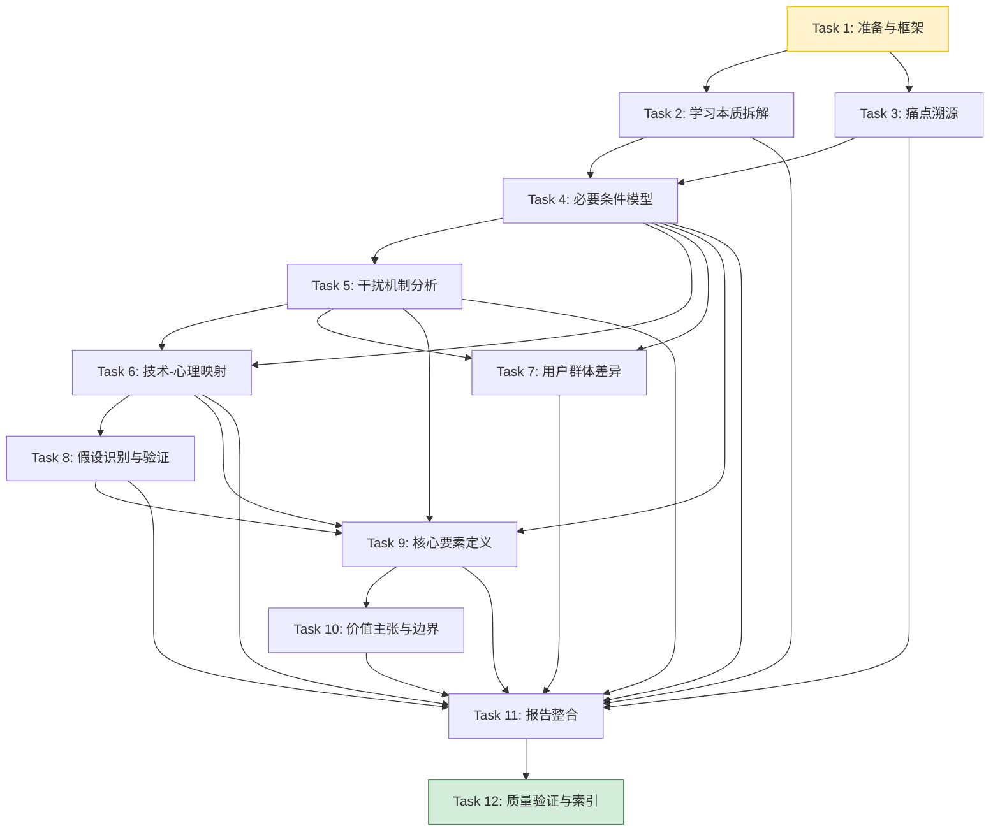

# 手机应用"学习模式"功能第一性原理分析与定义 - The Implementation Plan

## [x] Task 1: 分析准备与理论框架搭建
- **Priority**: high
- **Depends On**: None
- **Description**: 
  - 明确第一性原理分析方法在本项目中的具体操作步骤（拆解→质疑→重构）
  - 建立分析的学科理论框架：认知心理学、学习科学、注意力机制、行为经济学基础概念梳理
  - 确定分析报告的文档结构和存放位置
  - 收集现有"学习模式"常见实现作为"类比思维"的靶子（用于后续对比，但不作为设计起点）
- **Acceptance Criteria Addressed**: [AC-1, AC-2]
- **Test Requirements**:
  - `human-judgement` TR-1.1: 分析方法描述清晰，可操作，每一步有明确产出
  - `human-judgement` TR-1.2: 理论框架覆盖学习行为涉及的主要认知过程（注意、记忆、动机、情绪）
  - `human-judgement` TR-1.3: 报告结构与spec.md中FR-1到FR-11的需求对应
  - `programmatic` TR-1.4: 输出目录 `docs/retrospective/reports/insight-extraction/standalone/first-principles-learning-mode/` 已创建
- **Notes**: 此阶段最关键的是"悬置"已有对学习模式的认知，避免被现有产品设计锚定

## [x] Task 2: 学习本质第一性拆解（对应FR-1）
- **Priority**: high
- **Depends On**: Task 1
- **Description**: 
  - 剥离所有具体学习形式（看书、听课、做题等），追问"学习发生时，大脑中究竟发生了什么根本性变化？"
  - 从认知科学角度拆解：工作记忆→长时记忆的转化、认知图式的重构、技能的自动化、神经元连接的强化
  - 区分"学习行为"（可观测的活动）与"学习效果"（不可观测的认知变化）
  - 分析心流状态与学习的关系（心流是最优体验，但心流≠深度学习）
  - 绘制"学习的认知过程模型"Mermaid图
- **Acceptance Criteria Addressed**: [AC-1]
- **Test Requirements**:
  - `human-judgement` TR-2.1: 成功剥离表象，回归到认知/神经层面的基础机制
  - `human-judgement` TR-2.2: 明确回答了"为什么人在咖啡馆也能学习，但在手机前很难学习"这类问题
  - `human-judgement` TR-2.3: 认知过程模型逻辑自洽，覆盖输入→处理→存储→提取全链路
- **Notes**: 关键追问："如果没有手机，学习需要什么条件？手机为什么会破坏这些条件？"

## [x] Task 3: 用户痛点溯源分析（对应FR-2）
- **Priority**: high
- **Depends On**: Task 2
- **Description**: 
  - 收集用户关于手机学习的常见抱怨（消息打扰、忍不住刷手机、学习效率低、学完记不住等）
  - 对每个痛点进行多轮"为什么"追问，穿透到心理/认知机制层
  - 分析核心矛盾：手机作为学习工具vs手机作为干扰源的双重身份
  - 识别"伪痛点"和"真痛点"：例如"没有白噪音"是伪痛点（解决方案倒置），"注意力残留"是真痛点
  - 分析"想学习但无法开始"（启动困难）和"开始后无法持续"（维持困难）的不同机制
- **Acceptance Criteria Addressed**: [AC-2]
- **Test Requirements**:
  - `human-judgement` TR-3.1: 每个痛点至少追溯2层以上的"为什么"，不停留在表面
  - `human-judgement` TR-3.2: 区分了至少3个被现有产品忽略的深层痛点
  - `human-judgement` TR-3.3: 对"为什么屏蔽了通知还是会分心"给出了基于认知科学的解释
- **Notes**: 重点关注"手机存在感"本身（即使不使用）对认知表现的影响（相关研究：brain drain效应）

## [x] Task 4: 专注必要条件模型构建（对应FR-3）
- **Priority**: high
- **Depends On**: Task 2, Task 3
- **Description**: 
  - 基于学习的认知本质，推导深度学习发生的必要条件集合
  - 将条件分为四大类：环境条件（外部干扰控制）、认知条件（工作记忆空间、注意力资源）、动机条件（目标清晰度、价值感知）、情绪条件（焦虑水平、自我效能感）
  - 对每个条件分析：缺失该条件会导致什么具体后果？该条件的满足程度如何影响学习质量？
  - 构建"专注学习必要条件金字塔/模型"，用Mermaid图可视化
  - 分析这些条件之间的交互关系（如动机不足时，环境再好也无法专注）
- **Acceptance Criteria Addressed**: [AC-3]
- **Test Requirements**:
  - `human-judgement` TR-4.1: 每个条件都通过"反事实验证"——去掉它，学习确实无法高质量发生
  - `human-judgement` TR-4.2: 条件集合是完备的（没有遗漏关键条件）且最小的（没有多余条件）
  - `human-judgement` TR-4.3: 模型图清晰表达条件之间的层级或支撑关系
  - `human-judgement` TR-4.4: 明确区分了必要条件和充分条件（本分析只承诺必要条件）
- **Notes**: 类比：植物生长需要阳光、水、土壤、空气——缺了任何一个都会死，但都有了不一定长得好。我们要找出学习的"阳光、水、土壤、空气"。

## [x] Task 5: 干扰因素作用机制分析（对应FR-4）
- **Priority**: high
- **Depends On**: Task 4
- **Description**: 
  - 罗列所有可能干扰手机学习的因素，不仅是显而易见的（通知、来电）
  - 对每种干扰，分析其作用于认知系统的具体机制：
    - 外源性注意捕获（通知弹窗、红点、振动）
    - 内源性注意力分散（任务相关想法侵入、心智游移）
    - 工作记忆挤占（后台应用、未读消息的"蔡格尼克效应"）
    - 任务切换代价（从学习到回消息再回来的认知重建成本）
    - 期待性焦虑（"会不会有人找我"的持续心理负荷）
    - 手机存在感的认知损耗（brain drain效应）
  - 分析不同干扰的作用强度、持续时间、恢复难度
  - 绘制"干扰因素-认知影响"映射图
- **Acceptance Criteria Addressed**: [AC-4]
- **Test Requirements**:
  - `human-judgement` TR-5.1: 覆盖外源性和内源性两类干扰，至少识别6种以上干扰机制
  - `human-judgement` TR-5.2: 对"手机放在视线内即使不用也影响认知"给出机制解释
  - `human-judgement` TR-5.3: 不同干扰有差异化的应对策略含义（不是一刀切屏蔽）
  - `human-judgement` TR-5.4: 解释了为什么"短暂看一眼消息"的代价比想象的大得多
- **Notes**: 关键洞察：最大的干扰可能不是通知本身，而是"可能有通知"这个预期带来的持续认知负荷

## [x] Task 6: 技术手段与心理学原理映射矩阵（对应FR-5）
- **Priority**: high
- **Depends On**: Task 4, Task 5
- **Description**: 
  - 罗列手机端可用于学习模式的所有技术手段（通知屏蔽、白名单、锁屏、应用锁定、白噪音、番茄钟、环境光检测、使用统计、专注时长记录、界面去色、任务清单、呼吸引导、锁屏壁纸激励等）
  - 对每个技术手段，分析其对应的心理学原理、解决哪个必要条件/对抗哪种干扰
  - 标注证据强度：
    - ✅ 强支持：有认知科学研究或可靠实验证据支持
    - ⚠️ 弱支持：有理论依据但缺乏直接实验证据，或效果因人而异
    - ❓ 无证据：缺乏科学依据，属于惯例或安慰剂效应
    - ❌ 反效果：有证据表明该手段可能降低学习效果或产生其他负面后果
  - 特别标注常见功能中哪些属于"解决方案倒置"（把手段当目的）
- **Acceptance Criteria Addressed**: [AC-5]
- **Test Requirements**:
  - `human-judgement` TR-6.1: 至少覆盖15种以上常见或可能的技术手段
  - `human-judgement` TR-6.2: 至少识别2-3个被广泛使用但实际缺乏科学支持甚至有反效果的功能
  - `human-judgement` TR-6.3: 对每个技术手段的分析不止于"有用/没用"，而是说明"在什么条件下对什么人有用"
  - `human-judgement` TR-6.4: 矩阵格式清晰，可直接作为产品功能决策参考
- **Notes**: 可能有争议的发现：白噪音的效果缺乏一致证据、过度严格的应用锁可能引发逆反心理、番茄钟的25分钟一刀切不符合注意力自然波动

## [x] Task 7: 用户群体差异化需求分析（对应FR-6）
- **Priority**: medium
- **Depends On**: Task 4, Task 5
- **Description**: 
  - 选取主要用户群体：K12学生、大学生、职场人士（考证/技能提升）、终身学习者
  - 从以下底层维度分析差异：
    - 学习目标：应试/技能/兴趣/职业发展
    - 时间结构：大块连续/碎片时间/固定/弹性
    - 学习类型：记忆为主/理解为主/练习为主/创造为主
    - 自控资源：高低（与年龄、疲劳程度相关）
    - 环境干扰特征：教室/图书馆/办公室/通勤/家中
    - 社交压力：消息必须及时回复的程度
    - 手机依赖程度：不同群体的基线差异
  - 分析每个群体在必要条件上的满足/缺失差异
  - 推导出差异化的设计含义（但仍然保持核心要素的一致性）
- **Acceptance Criteria Addressed**: [AC-6]
- **Test Requirements**:
  - `human-judgement` TR-7.1: 差异分析在底层维度进行，而非表层功能偏好
  - `human-judgement` TR-7.2: 至少覆盖3个核心用户群体，每个群体有清晰的需求画像
  - `human-judgement` TR-7.3: 差异化结论能够解释"为什么同一个功能学生觉得有用但职场人士觉得鸡肋"
- **Notes**: 注意避免刻板印象，以场景和任务特征而非身份标签作为分类的主要依据

## [x] Task 8: 根本假设识别与验证框架（对应FR-7）
- **Priority**: high
- **Depends On**: Task 6
- **Description**: 
  - 识别当前"学习模式"设计中隐含的根本假设，例如：
    - "屏蔽所有干扰=促进学习"
    - "用户需要被强制约束才能专注"
    - "学习时长=学习效果"
    - "统一时长（如25分钟）适合所有人和所有学习类型"
    - "学习时不能使用任何其他应用"
    - "白噪音有助于专注"
    - "用户知道自己什么时候需要学习"
  - 对每个假设，追溯其来源（是经验总结？类比推理？还是有科学依据？）
  - 为每个关键假设设计可操作的验证方法（用户实验、A/B测试、日志分析、问卷调查等），明确：
    - 实验设计：分组、条件、流程
    - 测量指标：客观行为数据、主观报告、学习效果测量
    - 判定标准：什么结果支持假设，什么结果否定假设
    - 实验难度和成本评估
- **Acceptance Criteria Addressed**: [AC-7]
- **Test Requirements**:
  - `human-judgement` TR-8.1: 至少识别8个以上隐含假设
  - `human-judgement` TR-8.2: 每个假设的验证方法具体可操作，指标可测量
  - `human-judgement` TR-8.3: 对高风险假设（错了会导致整个功能方向偏误的）标注风险等级
  - `human-judgement` TR-8.4: 包含至少1-2个"意料之外"的假设（即设计者自己都没意识到的假设）
- **Notes**: 这是最能体现第一性原理价值的部分——质疑那些"从来不被质疑"的设计前提

## [x] Task 9: 核心构成要素定义（对应FR-8）
- **Priority**: high
- **Depends On**: Task 4, Task 5, Task 6, Task 8
- **Description**: 
  - 基于前面的分析，定义"学习模式"必须包含的核心构成要素（最小完备集）
  - 对每个核心要素：
    - 要素名称和定义
    - 对应的必要条件/解决的问题
    - 设计原则（不是具体设计，而是设计时必须遵守的原则）
    - 反模式：什么做法看似合理但违背该要素的本质
  - 将要素分层：内核要素（必须有，否则不叫学习模式）、支撑要素（增强效果但非必须）、扩展要素（针对特定群体/场景的可选要素）
  - 明确指出哪些常见功能不属于核心要素（如白噪音、励志语录）
- **Acceptance Criteria Addressed**: [AC-8]
- **Test Requirements**:
  - `human-judgement` TR-9.1: 核心要素集合与"免打扰+白噪音+番茄钟"三件套有实质性差异
  - `human-judgement` TR-9.2: 每个要素都能追溯到前面分析的必要条件或干扰机制
  - `human-judgement` TR-9.3: 明确区分了内核/支撑/扩展三个层次
  - `human-judgement` TR-9.4: 至少包含1-2个现有产品普遍缺失但根据分析至关重要的要素（可能涉及元认知支持、过渡状态管理等）
- **Notes**: 内核要素预计包括但不限于：认知过渡引导（进入状态）、干扰预期管理（而非单纯屏蔽）、注意力资源保护、退出自主性保障、学习意图锚定等

## [x] Task 10: 价值主张陈述与功能边界界定（对应FR-9, FR-10）
- **Priority**: high
- **Depends On**: Task 9
- **Description**: 
  - 撰写精炼的价值主张陈述（电梯演讲版+详细版），清晰回答"学习模式是什么、不是什么、为谁解决什么根本问题"
  - 与其他相似功能进行本质区分：
    - vs 勿扰模式（Do Not Disturb）：勿扰是"通知管理"，学习模式是"认知状态支持"
    - vs 专注模式（Focus Mode）：专注模式可以用于工作/写作/编程，学习模式针对学习的特殊认知需求
    - vs 阅读模式（Reading Mode）：阅读模式优化视觉体验，学习模式优化整个认知过程
    - vs 应用锁/屏幕时间管理（Digital Wellbeing）：这些是"使用限制"工具，学习模式是"学习支持"工具
    - vs 儿童模式/学生模式：后者是家长控制，学习模式是用户自主的状态管理
  - 建立边界判定标准：一个功能是否应该属于"学习模式"的判断准则
  - 分析"学习模式"与其他功能的协作关系（而非孤立功能）
- **Acceptance Criteria Addressed**: [AC-9, AC-10]
- **Test Requirements**:
  - `human-judgement` TR-10.1: 价值主张清晰、独特、不与其他模式混淆
  - `human-judgement` TR-10.2: 与每个相似功能的区别都是本质层面的，而非功能多寡的区别
  - `human-judgement` TR-10.3: 边界判定标准能够明确回答具体功能（番茄钟、白噪音、锁屏、任务清单等）是否属于学习模式
  - `human-judgement` TR-10.4: 价值主张能够回答"为什么系统需要一个独立的学习模式，而不是让勿扰模式多几个选项"
- **Notes**: 关键区分：勿扰模式是"让世界安静下来"，学习模式是"让大脑进入学习状态"——这是两种完全不同的设计目标

## [x] Task 11: 报告整合、Mermaid可视化与可复用模式萃取（对应FR-11）
- **Priority**: medium
- **Depends On**: Task 2, Task 3, Task 4, Task 5, Task 6, Task 7, Task 8, Task 9, Task 10
- **Description**: 
  - 将所有分析内容整合为一份结构完整的分析报告
  - 添加必要的Mermaid图表：学习认知过程模型、必要条件模型、干扰机制模型、核心要素架构图、功能边界对比图等
  - 萃取第一性原理功能分析的可复用方法论模式（可复用于其他功能的重构分析）
  - 添加总结章节：核心发现、设计启示、后续研究方向
  - 添加frontmatter和changelog
  - 确保所有引用使用相对路径，符合项目文档规范
- **Acceptance Criteria Addressed**: [AC-11]
- **Test Requirements**:
  - `human-judgement` TR-11.1: 报告逻辑连贯，从原理到推论到结论形成完整链条
  - `human-judgement` TR-11.2: 至少包含4个以上Mermaid图表辅助说明
  - `human-judgement` TR-11.3: 萃取了至少1个可复用的方法论模式（第一性原理功能分析SOP）
  - `programmatic` TR-11.4: 所有链接使用相对路径，无file:///绝对路径
  - `programmatic` TR-11.5: 文档YAML frontmatter完整（version、source等字段）

## [x] Task 12: 质量验证与索引同步
- **Priority**: medium
- **Depends On**: Task 11
- **Description**: 
  - 对照spec.md中的11个验收标准逐一自检
  - 检查是否所有FR都被覆盖
  - 运行链接校验脚本确认无断链
  - 在docs/retrospective/的对应索引中登记本报告
  - 在retrospectives-insights主题README.md中更新本spec状态
- **Acceptance Criteria Addressed**: [AC-1, AC-2, AC-3, AC-4, AC-5, AC-6, AC-7, AC-8, AC-9, AC-10, AC-11]
- **Test Requirements**:
  - `programmatic` TR-12.1: `python .agents/scripts/check-links.py --path docs/retrospective/reports/insight-extraction/standalone/first-principles-learning-mode/` 无错误
  - `human-judgement` TR-12.2: 所有11个AC都能在报告中找到对应内容
  - `human-judgement` TR-12.3: 所有11个FR都有对应的分析章节
  - `programmatic` TR-12.4: retrospectives-insights/README.md已更新，本spec登记在册
- **Notes**: 最终交付物是完整的分析报告，可直接用于指导产品设计决策

---

## Task Dependencies Graph

