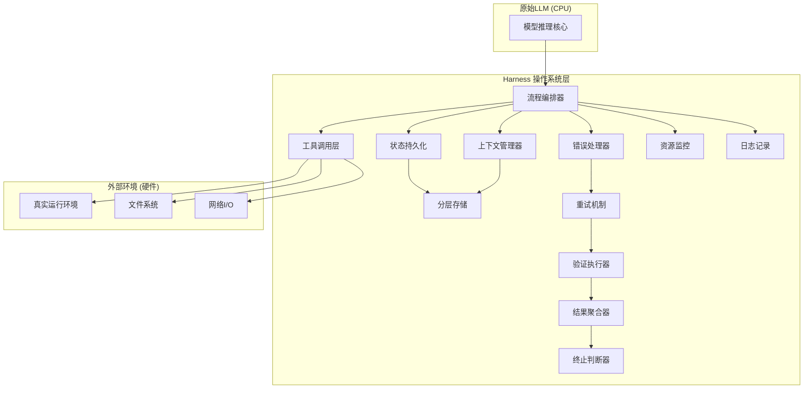
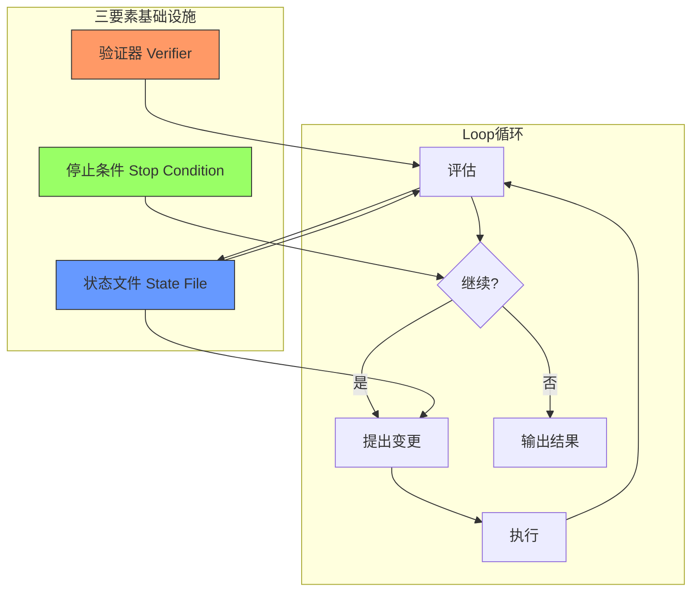
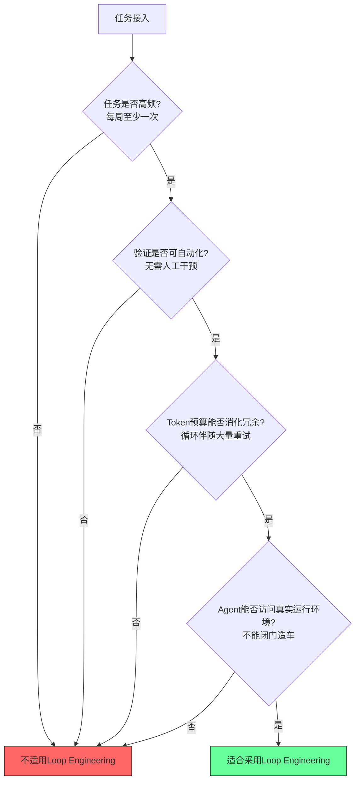

# Loop Engineering 标准化知识库

## 目录

- [第一章：核心概念体系](#第一章核心概念体系)
  - [1.1 Harness外层执行机制](#11-harness外层执行机制)
  - [1.2 Loop Engineering五步循环框架](#12-loop-engineering五步循环框架)
  - [1.3 三要素基础设施](#13-三要素基础设施)
  - [1.4 四项适用标准](#14-四项适用标准)
  - [1.5 双层自动研究](#15-双层自动研究)
- [第二章：关键数据手册](#第二章关键数据手册)
- [第三章：经典案例库](#第三章经典案例库)
- [第四章：关键人物与观点引言](#第四章关键人物与观点引言)
- [第五章：风险知识库](#第五章风险知识库)
- [第六章：中英文术语对照表](#第六章中英文术语对照表)
- [第七章：快速参考卡](#第七章快速参考卡)

---

## 第一章：核心概念体系

### 1.1 Harness外层执行机制

**定义**：Harness是包裹在原始LLM外层的操作系统级执行框架，负责管理模型的内存、I/O操作、工具调用、错误处理等所有外围能力。Akshay提出核心隐喻："一个原始的LLM只是一个没有内存或硬盘的CPU；Harness是管理内存、I/O和驱动程序的操作系统。"

**设计原则**：
- 模型与Harness解耦：模型能力固定，Harness可独立进化
- 操作系统类比：CPU=LLM，内存=上下文窗口，硬盘=状态文件，驱动=工具适配器
- 12个核心组件协同工作：流程编排、工具调用、分层存储、上下文管理、错误处理、重试机制、状态持久化、资源监控、日志记录、验证执行、结果聚合、终止判断

**Harness架构关系图**：



---

### 1.2 Loop Engineering五步循环框架

**定义**：Loop Engineering是一种通过自动化闭环迭代优化Agent执行能力的工程方法论，核心是"进化Harness而非训练模型"。五步构成一个完整的自进化闭环。

**设计原则**：
- 探索边界先行：无边界则无方向
- 验证器铁律：评分脚本绝对不可被Agent修改
- 真实环境原则：所有执行必须在真实环境中运行，禁止模拟
- 自动化筛选：优胜劣汰完全基于客观评分，无人工干预

**五步循环流程图**：


**各环节详细说明**：
1. **编写探索文档**：定义问题边界、成功标准、约束条件、探索方向，是整个循环的"宪法"
2. **锁定评分脚本**：部署确定性验证器，一旦锁定后Agent无修改权限，是循环的"裁判"
3. **提出变更**：Agent基于当前状态提出对执行脚本的修改建议，禁止触碰验证脚本
4. **训练与执行**：在真实环境中运行修改后的方案，收集完整执行轨迹和结果数据
5. **评估与筛选**：用锁定的评分脚本对结果打分，保留高分方案作为下一轮基线

---

### 1.3 三要素基础设施

**定义**：支撑Loop Engineering稳定运行的三大核心基础设施，缺一不可。

**设计原则**：
- 验证器确定性：优先使用非LLM验证，杜绝主观判断
- 状态不可变性：历史状态永久记录，支持断点续传和完整回溯
- 停止条件前置：循环启动前必须明确定义终止规则，避免无限循环

**三要素协作关系图**：



**各要素详细说明**：

| 要素 | 核心属性 | 功能定位 |
|------|----------|----------|
| **验证器** | 确定性、非LLM优先、不可篡改 | 客观评分标准，循环的"黄金裁判"，杜绝Agent作弊 |
| **状态文件** | 历史记录、断点续传、避免重复、进化基线 | 循环的"记忆硬盘"，记录每一轮的代码、评分、执行轨迹 |
| **停止条件** | 目标达成/轮次上限/收益递减/预算耗尽 | 循环的"刹车系统"，防止资源无限消耗 |

---

### 1.4 四项适用标准

**定义**：判断一个任务是否适合采用Loop Engineering方法论的四项准入标准，必须全部满足（四项全能，缺一不可）。

**设计原则**：
- 高频才有进化价值：一次性任务无法摊销循环成本
- 自动化验证是前提：无法自动评分则无法闭环
- Token预算支撑冗余：循环伴随大量失败重试，需有成本承受力
- 真实环境可访问：闭门造车的模拟会掩盖真实问题

**四项标准判定流程图**：



---

### 1.5 双层自动研究

**定义**：Bilevel Autoresearch是Loop Engineering的进阶架构，包含内外两层循环：内层负责具体任务/模型的优化执行，外层负责优化内层的搜索策略，突破思维定势。

**设计原则**：
- 内外层解耦：内层专注执行，外层专注策略
- 思维定势突破：外层可强制切换内层的搜索方向，避免局部最优
- 性能跃迁：双层架构相比单层循环可实现5倍性能提升

**双层循环架构图**：

```mermaid
graph TB
    subgraph "外层循环 (Meta-Optimization)"
        OUTER[外层优化器]
        STRATEGY[搜索策略库]
        HISTORY[全局历史]
    end
    subgraph "内层循环 (Task Execution)"
        INNER[内层执行器]
        EXEC[执行脚本]
        SCORE[内层评分]
    end
    subgraph "基础设施"
        VERIFY[验证器]
        STATE[状态文件]
    end
    
    OUTER -->|生成/调整搜索策略| STRATEGY
    STRATEGY -->|注入先验/方向| INNER
    INNER --> EXEC
    EXEC -->|真实环境执行| VERIFY
    VERIFY --> SCORE
    SCORE -->|内层结果| STATE
    STATE -->|全局数据分析| HISTORY
    HISTORY -->|发现思维定势| OUTER
    SCORE -->|反馈| OUTER
    
    note over OUTER,HISTORY: 突破先验认知，5倍性能提升
```

---

## 第二章：关键数据手册

**数据来源说明**：本手册共收录19个核心数据点，来自Hugging Face SWE-bench对照实验、Karpathy AutoResearch开源项目、Shopify生产环境验证、X平台公开传播数据。

| 序号 | 指标 | 数值 | 数据来源 | 说明 |
|------|------|------|----------|------|
| 1 | mini-swe-agent得分 | 3.5% | Hugging Face SWE-bench实验 | 裸Agent基线，无Harness优化 |
| 2 | Goose得分 | 23.2% | Hugging Face SWE-bench实验 | 初代Agent框架 |
| 3 | Pi得分 | 45.4% | Hugging Face SWE-bench实验 | 优化版Agent框架 |
| 4 | 原始LAB harness得分 | 63.4% | Hugging Face SWE-bench实验 | 未优化Harness基线 |
| 5 | 优化后harness得分 | 80.1% | Hugging Face SWE-bench实验 | Loop Engineering迭代后得分 |
| 6 | 得分波动区间 | 3.5%-80.1%（76.6分差距） | Hugging Face SWE-bench实验 | 同一模型下Harness优化带来的性能跨度 |
| 7 | 代码自动迭代轮次 | 约22轮 | Hugging Face SWE-bench实验 | 从63.4%进化到80.1%所需轮次 |
| 8 | held-out test任务数 | 100个 | Hugging Face SWE-bench实验 | 测试集规模，保证统计显著性 |
| 9 | pooled score提升 | 63.4%→80.1%（16.7个百分点） | Hugging Face SWE-bench实验 | 汇总得分提升幅度 |
| 10 | all-pass rate变化 | 0%→5.0% | Hugging Face SWE-bench实验 | 全量通过率从无到有 |
| 11 | 运行成本 | 为原来的1/7 | Hugging Face SWE-bench实验 | Harness优化后的成本降低比例 |
| 12 | DeepSeek-V4-Flash提升 | 14.4分 | Hugging Face SWE-bench实验 | 另一模型上的泛化提升效果 |
| 13 | AutoResearch Star数 | 9万 | GitHub开源数据 | Karpathy AutoResearch项目关注度 |
| 14 | 自动实验次数 | 700次 | Karpathy AutoResearch实践 | Agent自主开展的实验总量 |
| 15 | 发现改进项 | 20项 | Karpathy AutoResearch实践 | Agent发现的连作者都忽略的代码改进 |
| 16 | 原代码行数 | 630行 | Karpathy AutoResearch实践 | 初始代码规模 |
| 17 | X平台阅读量 | 超200万 | X平台传播数据 | 相关话题的社交平台曝光量 |
| 18 | Shopify质量提升 | 19%，模型大小减半 | Shopify CEO连夜测试 | 生产环境业务指标提升 |
| 19 | 双层循环性能提升 | 5倍 | Bilevel Autoresearch论文/实践 | 双层架构相比单层的性能倍率 |
| 20 | 上下文腐烂性能下降 | 30%以上 | Harness工程实践 | 上下文管理缺失导致的性能衰减 |

> **核心洞察**：同一模型（DeepSeek-V4-Pro）下，仅通过Harness优化即可实现3.5%→80.1%的22倍性能提升，追平Claude Sonnet 4.6，同时成本降至1/7，证明Harness进化的杠杆效应远超模型升级。

---

## 第三章：经典案例库

### 案例1：Hugging Face Harness优化对照实验

**背景**：SWE-bench是软件工程领域权威基准测试，主流Agent得分长期在低位徘徊，行业普遍认为需要更强的模型才能突破。

**过程**：
- 固定使用DeepSeek-V4-Pro模型，不更换模型
- 仅对Harness外层执行机制进行Loop Engineering迭代
- 约22轮自动迭代，每轮在真实测试环境运行
- 从流程编排、错误处理、工具调用、上下文管理等12个组件逐步优化

**结果**：
- 得分从原始3.5%（mini-swe-agent）提升至80.1%
- 22倍性能提升，追平Claude Sonnet 4.6水平
- 运行成本降至原来的1/7
- held-out test 100个任务上all-pass rate从0%提升至5.0%

**启示**：模型能力的发挥高度依赖Harness质量，行业普遍高估了模型本身的作用，低估了外层执行机制的价值。Don't Train the Model, Evolve the Harness。

---

### 案例2：Karpathy 700次自动实验

**背景**：Andrej Karpathy开源AutoResearch项目，探索Agent自主开展代码研究的能力，代码初始规模仅630行。

**过程**：
- 启动Loop Engineering循环，Agent自主提出改进假设
- 自动运行实验、收集数据、评估结果、迭代优化
- 累计自动运行700次实验，全程无人工干预代码修改
- 状态文件完整记录所有迭代轨迹

**结果**：
- Agent找出20项连Karpathy自己都忽略的代码改进点
- 项目在GitHub获得9万Star，成为现象级开源项目
- 相关话题在X平台获得超200万阅读量
- 验证了Loop Engineering发现人类认知盲区的能力

**启示**：即使是领域专家编写的代码，也存在大量认知盲区；自动化循环的系统性搜索可以发现人类难以察觉的改进空间。

---

### 案例3：Shopify CEO连夜生产验证

**背景**：Shopify CEO看到Harness相关研究后，连夜在生产环境中开展验证测试。

**过程**：
- 将Loop Engineering方法应用于Shopify核心代码生成流程
- 不升级底层模型，仅优化Harness执行机制
- 直接在真实业务流量上进行A/B测试
- 采用自动化业务指标验证

**结果**：
- 代码生成质量提升19%
- 所需模型大小减半，推理成本大幅降低
- 生产环境验证了实验室结果的可复现性
- 推动Shopify工程团队全面采纳Harness优先策略

**启示**：Loop Engineering的价值不仅限于学术基准，在真实生产环境中同样能带来显著的业务指标提升，且具备快速落地的特性。

---

### 案例4：0分文件名错误案例

**背景**：某Agent在代码生成任务中，模型推理逻辑完全正确，但最终得分为0。

**过程**：
- Agent完成所有代码逻辑编写，单元测试在模拟环境全部通过
- 提交后在真实验证环境得分为0
- 经排查发现：代码逻辑完全正确，但保存时文件名写错了一个字符
- 模拟环境中文件名不敏感，真实环境严格校验

**结果**：
- 暴露了"模拟环境通过≠真实环境可用"的核心问题
- 强化了"必须在真实环境运行"的铁律
- 推动Harness增加文件名校验层

**启示**：真实环境的细节（文件系统、权限、路径、环境变量等）是模拟无法覆盖的，任何闭门造车的测试都会产生虚假的安全感。0分的根因可能与模型推理能力完全无关。

---

### 案例5：双层循环突破思维定势

**背景**：单层Loop Engineering在优化到一定阶段后陷入局部最优，无法继续突破。

**过程**：
- 内层循环按照人类提供的先验策略反复搜索，始终无法突破性能瓶颈
- 引入外层循环，对内层的搜索策略本身进行优化
- 外层分析全局历史数据，发现内层陷入了某类先验认知陷阱
- 外层强制内层切换搜索方向，探索被人类先验排除的区域

**结果**：
- 性能相比单层循环提升5倍
- 发现了人类专家因思维定势而完全忽略的优化方向
- 验证了双层自动研究在突破认知盲区上的巨大价值

**启示**：人类的先验知识既是指引也是枷锁，单层循环容易继承人类的思维定势；外层循环通过元优化可以有效跳出局部最优，实现认知突破。

---

## 第四章：关键人物与观点引言

### Andrej Karpathy
（OpenAI联合创始人、前特斯拉AI总监、AI领域标志性人物）

> "今天AI行业最大的误区，是大家都在逼Agent尽快干活，却没有先把底层模型和系统机制理解吃透。"

> "OpenAI早年在基础能力还没成熟时就急着让Agent完成复杂任务，结果白白浪费了五年时间。"

**核心立场**：反对"Agent立即干活"的浮躁风气，主张先吃透Harness等系统机制再谈Agent能力，系统架构的优先级高于功能堆砌。

---

### Akshay
（Harness理论提出者、Agent Runtime架构师）

> "一个原始的LLM只是一个没有内存或硬盘的CPU；Harness是管理内存、I/O和驱动程序的操作系统。"

**核心立场**：提出LLM=CPU的经典类比，系统阐述了Harness作为操作系统层的核心地位，模型能力需要通过Harness才能转化为实际生产力。

---

### Niklaus
（Harness Evolution方法论倡导者）

> "Don't Train the Model, Evolve the Harness."
> （不要训练模型，去进化Harness）

**核心立场**：旗帜鲜明地提出Harness进化优先于模型训练的工程路线，Harness优化的杠杆率更高、成本更低、迭代更快，是当前阶段Agent能力提升的最短路径。

---

## 第五章：风险知识库

### 5.1 理解债（Comprehension Debt）

**形成机制**：
Loop Engineering通过自动化循环快速生成大量代码迭代，但开发者无法跟上代码进化的速度，导致自动生成的代码与开发者理解之间出现巨大鸿沟。代码在"黑箱"中进化，虽然评分越来越高，但没人能完全理解每一行代码为什么存在、为什么这样写。Debug时需要反向追溯22轮甚至更多迭代的决策逻辑，成本呈指数级上升。

**识别信号**：
- 看到代码不知道某段逻辑的来源和目的
- 修改一行代码引发连锁失败，无法快速定位根因
- 新人接手需要数周才能理解代码库
- 出现bug后需要花数倍于写代码的时间调试
- 只能"祈祷"代码能跑，不敢做重构

**防范措施**：
1. **变更日志强制化**：每轮迭代必须附带自然语言解释，说明变更原因和逻辑
2. **关键节点人工审计**：每N轮（如5轮）进行一次人工代码审查，消化理解
3. **文档同步生成**：要求Agent在改代码的同时更新对应文档
4. **最小变更原则**：鼓励小步迭代而非大幅重构，降低单次理解成本
5. **可解释性指标**：将代码可读性纳入评分体系，不只看功能得分

---

### 5.2 认知让渡（Cognitive Abdication）

**形成机制**：
开发者长期依赖Loop Engineering自动优化，逐渐停止主动思考，把判断和决策完全交给工具。存在两种模式：
- **加速思考模式（良性）**：工具作为思考的延伸，人保持判断权，工具提升思考效率
- **逃避思考模式（恶性）**：工具成为思考的替代，人放弃判断权，能力逐渐退化

恶性模式下，开发者不再理解问题本质，不再能提出好的假设，只能被动接受Agent的输出，最终丧失独立解决问题的能力。

**识别信号**：
- 遇到问题第一反应是"让Agent跑循环"，自己不先想方案
- 看不懂Agent给出的改进为什么有效，但也不深究
- 无法判断Agent的输出质量，只能看评分
- 脱离工具后无法独立完成同类任务
- 对"为什么"的问题回答不上来，只知道"这样分高"

**防范措施**：
1. **人工基线要求**：启动循环前，人必须先写出一个可工作的baseline并理解透彻
2. **假设前置原则**：每轮迭代前，人先提出自己的假设，再与Agent的方案对比
3. **定期脱机练习**：周期性脱离工具，手动完成部分任务，保持能力
4. **理解检查点**：关键节点要求自己向别人讲清楚方案原理，讲不清楚就继续消化
5. **模式自省**：时刻区分"我在用工具加速思考"还是"我在用工具逃避思考"

---

### 5.3 上下文腐烂（Context Rot）

**形成机制**：
Harness的上下文管理组件缺失或设计不良时，随着循环轮次增加，上下文窗口中堆积大量无效、冗余、过期的信息，导致模型注意力被稀释，推理质量下降。

**识别信号**：
- 后期迭代轮次的改进幅度越来越小，甚至出现倒退
- 模型开始犯早期不会犯的低级错误
- 输出中出现与当前任务无关的历史残留信息
- 性能下降30%以上，但找不到代码逻辑问题

**防范措施**：
- 每轮迭代前进行上下文压缩和清理
- 只保留与当前决策相关的历史信息
- 采用分层存储：全量历史落盘，上下文只放摘要
- 定期进行上下文"冷启动"，从干净状态重新基线

---

## 第六章：中英文术语对照表

| 中文术语 | 英文术语 | 定义 |
|----------|----------|------|
| 外层执行机制 | Harness | 包裹LLM的操作系统级执行框架 |
| 循环工程 | Loop Engineering | 通过自动化闭环迭代优化Agent的方法论 |
| 验证器 | Verifier | 确定性的自动化评分组件 |
| 状态文件 | State File | 记录完整迭代历史的持久化存储 |
| 停止条件 | Stop Condition | 循环终止的判断规则 |
| 双层自动研究 | Bilevel Autoresearch | 内层执行+外层策略优化的双层架构 |
| 理解债 | Comprehension Debt | 自动生成代码与开发者理解的差距 |
| 认知让渡 | Cognitive Abdication | 过度依赖工具导致的思考能力退化 |
| 上下文腐烂 | Context Rot | 上下文堆积导致的推理质量下降 |
| 流程编排 | Orchestration | Harness核心组件，负责整体流程控制 |
| 工具调用 | Tool Calling | Harness与外部环境交互的能力 |
| 分层存储 | Tiered Storage | 内存/磁盘分级的状态存储机制 |
| 真实环境 | Real Environment | Agent实际运行的生产/沙箱环境，非模拟 |
| 进化基线 | Evolution Baseline | 每轮迭代保留的当前最优方案 |
| 断点续传 | Checkpoint Resume | 从任意历史状态恢复循环的能力 |
| 搜索策略 | Search Strategy | 内层循环的探索方向与方法 |
| 思维定势 | Cognitive Lock-in | 陷入局部最优无法跳出的认知状态 |
| 保留测试集 | Held-out Test Set | 用于最终验证的未见过的测试数据 |
| 全量通过率 | All-pass Rate | 所有测试用例全部通过的比例 |
| 元优化 | Meta-optimization | 对优化过程本身的优化（外层循环） |

---

## 第七章：快速参考卡

### 一页纸核心要点

**核心哲学**：Don't Train the Model, Evolve the Harness

**Harness = LLM的操作系统**
- CPU = 原始LLM
- 内存 = 上下文窗口
- 硬盘 = 状态文件
- 驱动 = 工具适配器

**Loop五步循环**：
1. 写探索文档 → 划边界
2. 锁评分脚本 → 铁律（不可改）
3. 提变更 → 只改执行，不改验证
4. 训练执行 → 必须真实环境
5. 评估筛选 → 自动化优胜劣汰

**三要素**：
- ✅ 验证器：确定性、非LLM、不可篡改
- ✅ 状态文件：记历史、可续传、防重复
- ✅ 停止条件：目标达成/轮次上限/收益递减/预算耗尽

**四项准入（缺一不可）**：
- 任务高频：每周至少一次
- 验证自动：无需人工干预
- 预算充足：能消化重试冗余
- 环境真实：Agent可访问真实运行环境

**关键数据记忆点**：
- 同模型Harness优化：3.5% → 80.1%（22倍）
- 成本：1/7
- 迭代轮次：约22轮
- 双层提升：5倍
- 上下文腐烂损失：30%+

**两大风险**：
1. **理解债**：代码进化太快人跟不上 → 每轮写解释、定期人工审计
2. **认知让渡**：不思考只靠工具 → 先写人工baseline、区分加速vs逃避

**铁律三条**：
1. 验证器绝对不能被Agent修改
2. 所有执行必须在真实环境运行
3. 先吃透Harness机制，再逼Agent干活

**人物金句**：
- Karpathy："行业最大误区是逼Agent尽快干活，却没吃透底层机制"
- Akshay："LLM是没有内存硬盘的CPU，Harness是操作系统"
- Niklaus："Don't Train the Model, Evolve the Harness"
