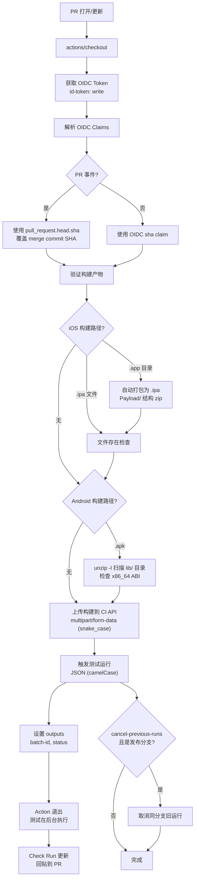
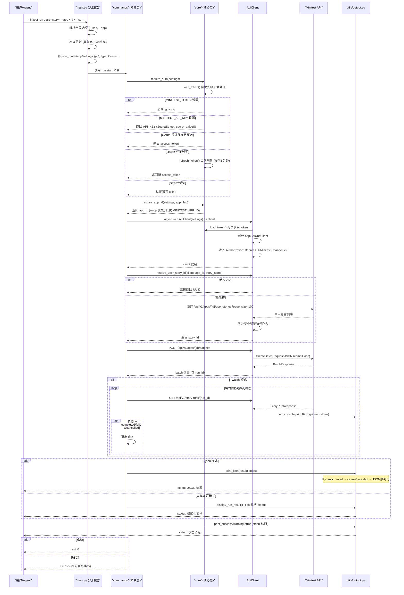

# Minitest 生态系统深度洞察报告

## 1. 执行摘要

Minitest 是面向移动应用（iOS/Android/Web）的 AI 驱动自动化 QA 测试平台，其核心价值在于**让没有专门 QA 团队的开发团队无需雇佣 QA 人员即可获得移动端测试覆盖率**。平台以 Mini ——一个 AI QA 工程师智能体——为核心，在虚拟设备上自主执行用户故事测试，提供从测试编写、维护、执行到修复建议的全流程自动化能力。

**技术栈概览：**

| 层级 | 技术选型 | 仓库 |
|------|---------|------|
| CLI 工具 | Python 3.12+, Typer, httpx, Pydantic, Rich | file:///d:/AI/.chaos/libs/minitap-ai/minitest-cli |
| CI Action | TypeScript, Node.js 20, @actions/core, @vercel/ncc | file:///d:/AI/.chaos/libs/minitap-ai/minitest-trigger |
| AI Skill | Markdown + YAML frontmatter, Agent Skills 标准 | file:///d:/AI/.chaos/libs/minitap-ai/agent-skills |
| DevOps 共享库 | GitHub Composite Actions | file:///d:/AI/.chaos/libs/minitap-ai/devops-common |
| 依赖更新配置 | Renovate 共享预设 | file:///d:/AI/.chaos/libs/minitap-ai/renovate-config |
| 示例应用 | Flutter 3.38.9, Dart 3.10.8, Provider 6.x | file:///d:/AI/.chaos/libs/minitap-ai/demo-app |
| 训练数据集 | CSV 任务单 + Markdown 规格 | file:///d:/AI/.chaos/libs/minitap-ai/minisweeper |

---

## 2. 产品概述与核心概念

### 2.1 产品定位

Minitest 是一个 AI Agent 驱动的端到端自动化测试平台，核心角色是 **Mini**——一个具备完整 QA 能力的 AI 智能体。与传统录制回放工具不同，Mini 像真人 QA 工程师一样理解和操作应用，能够：

1. **自主维护测试套件**：持续监控默认分支代码变更，自动适配 UI 漂移（按钮重命名、标签调整）、功能增删（移除功能下线故事、新功能起草新故事）、依赖管理（自动建立故事间依赖）
2. **虚拟设备执行**：在虚拟 iOS/Android 设备上直接从 GitHub 构建应用并运行测试，使用配置文件自动登录，支持共享 Google 账户
3. **可行动结果交付**：失败时提供操作视频录像、精确失败验收标准、可直接粘贴到 Cursor/Claude 的 Fix Prompt、相关设备日志
4. **主动问题发现**：在预定测试之外主动发现 UX 问题、边缘情况、UI 不一致性，以 Suggestions 形式独立呈现（不阻塞发布）

### 2.2 核心数据模型

**User Story（用户故事）** 代表应用中的一段完整用户旅程，是 Mini 执行测试的脚本单元，包含：
- **Name**：动作导向标题（如 `Sign in with email`）
- **Type**：旅程分类（内置 10 种 + 自定义类型）
- **Description**：一句话描述用户目标
- **Acceptance Criteria**：可观察条件列表，Mini 执行后逐项判定 PASS/FAIL

**Acceptance Criteria 三条黄金规则**：
1. 一行一条件：一个步骤做两件事则拆分
2. 像用户一样说话：用用户看到的方式引用 UI 元素
3. 跳过输入步骤：附加配置文件时从登录后状态开始写标准

**Profiles（配置文件/测试身份）** 用于需要登录的故事，支持四种模式：
1. `@qa.minitap.ai` 共享收件箱 OTP 自动读取（默认推荐）
2. BYO 真实账户（stdin 密码输入）
3. 特定状态账户预配置（如 Premium 用户）
4. 匿名模式（无 Persona 绑定，必要时自动生成临时账户）

### 2.3 测试结果类型

| 结论类型 | 含义 | 处理方式 |
|---------|-----|---------|
| Passed | 所有关键标准成立 | 构建可安全发布 |
| Warning | 关键标准成立但警告标准不成立 | 需关注但不阻塞 |
| Failed | 至少一个关键标准不成立 | 存在 bug，需修复 |
| Unprocessable | Mini 运行了故事但无法评分 | 前置问题需排查 |

### 2.4 多渠道触达

Mini 在四个工作场景中与团队交互：Dashboard（主界面）、Slack（实时心跳通知）、Pull Request（检查状态）、IDE（通过 MCP 服务器在 Cursor/Claude 中操作）。

---

## 3. 生态系统架构总览

Minitest 生态系统采用五层架构，各仓库各司其职，通过标准化接口协同工作：

```mermaid
flowchart TD
    subgraph UserLayer["用户层"]
        Dev["开发者"]
        Agent["AI Agent<br/>(Cursor/Claude/OpenCode)"]
        CI["CI/CD 流水线<br/>("GitHub Actions")"]
    end
    subgraph ToolLayer["工具层"]
        CLI["minitest-cli<br/>("Python CLI")"]
        Action["minitest-trigger<br/>("GitHub Action")"]
        Skill["agent-skills<br/>("AI Skill 定义")"]
    end
    subgraph PlatformLayer["平台层"]
        TS["testing-service<br/>("测试执行 API")"]
        AM["apps-manager<br/>("应用管理 API")"]
        Auth["auth.minitap.ai<br/>("Supabase OAuth")"]
        Mini["Mini AI Agent<br/>("虚拟设备执行")"]
    end
    subgraph ExecutionLayer["执行层"]
        iOS["iOS 模拟器"]
        Android["Android 模拟器"]
        Web["Web 浏览器<br/>(Chrome/Firefox/Safari)"]
    end
    subgraph InfrastructureLayer["基础设施层"]
        DevOps["devops-common<br/>("共享 Actions")"]
        Renovate["renovate-config<br/>("依赖更新预设")"]
        Demo["demo-app<br/>("Flutter 示例")"]
        Sweep["minisweeper<br/>("训练数据集")"]
    end
    Dev --> CLI
    Dev --> Dashboard
    Agent --> Skill
    Agent --> CLI
    CI --> Action
    CLI --> TS
    CLI --> AM
    CLI --> Auth
    Action --> TS
    Skill --> CLI
    TS --> Mini
    AM --> Mini
    Mini --> iOS
    Mini --> Android
    Mini --> Web
    CLI -.-> DevOps
    Action -.-> DevOps
    CLI -.-> Renovate
    Action -.-> Renovate
    Demo -.-> Mini
    Sweep -.-> Mini
```

**架构分层说明：**

- **用户层**：三种用户角色（开发者、AI Agent、CI 流水线）通过不同入口与系统交互
- **工具层**：三个面向用户的工具仓库，封装平台 API 提供统一访问入口
- **平台层**：后端服务集群，testing-service 处理测试执行，apps-manager 处理应用管理，Mini 智能体在虚拟设备上运行测试
- **执行层**：实际运行测试的虚拟设备环境，支持 iOS、Android、Web 三端
- **基础设施层**：支撑工具层开发的共享资源，包括 DevOps Action、依赖更新配置、示例应用和训练数据集

---

## 4. 仓库职责与依赖关系

Minitest 生态系统共包含 7 个公开仓库，各仓库职责清晰，依赖方向单向流动：

```mermaid
graph TD
    CLI["minitest-cli<br/>("Python CLI")"]
    Action["minitest-trigger<br/>("TypeScript Action")"]
    Skill["agent-skills<br/>("AI Skill")"]
    DevOps["devops-common<br/>("共享 Actions")"]
    Renovate["renovate-config<br/>("更新配置")"]
    Demo["demo-app<br/>("Flutter 示例")"]
    Sweep["minisweeper<br/>("训练数据集")"]
    Platform["Minitest 平台<br/>("testing-service 等")"]
    CLI -->|"HTTP API"| Platform
    Action -->|"HTTP API"| Platform
    Skill -->|"文档描述"| CLI
    Skill -.->|"配对 PR 同步"| CLI
    CLI -.->|"CI 使用"| DevOps
    Action -.->|"CI 使用"| DevOps
    CLI -.->|"extends"| Renovate
    Action -.->|"extends"| Renovate
    DevOps -.->|"extends"| Renovate
    Demo -.->|"extends"| Renovate
    Demo -.->|"测试对象"| Platform
    Sweep -.->|"AI 训练基准"| Platform
```

**仓库职责详解：**

| 仓库 | 职责 | 对外接口 | 依赖 |
|------|-----|---------|------|
| minitest-cli | 开发者与 AI Agent 使用的命令行工具，覆盖应用管理、用户故事 CRUD、构建上传、测试执行、结果查看等全流程 | 命令行接口 + JSON 管道模式 | testing-service API, apps-manager API, Supabase Auth |
| minitest-trigger | GitHub Action，用于 CI 工作流中触发测试，通过 OIDC 无密钥认证 | GitHub Action inputs/outputs | testing-service CI API |
| agent-skills | AI Agent 使用的 Skill 定义，包含 onboarding playbook、命令速查表、最佳实践约定 | SKILL.md (Agent Skills 标准格式) | minitest-cli（文档同步） |
| devops-common | 跨仓库共享的 GitHub Composite Actions 库，包含 Docker 构建、数据库迁移、ArgoCD 部署、选择性测试等 12 个 Action | Composite Actions | 无（被其他仓库引用） |
| renovate-config | Renovate 依赖更新共享预设，定义 14 天冷却期、周二至周四开窗、分级自动合并等策略 | Renovate config preset | 无（被其他仓库 extends） |
| demo-app | Flutter 实现的扫雷游戏，作为 Minitest 功能演示和测试验证的参考应用 | Flutter 移动应用 | 无（被平台测试） |
| minisweeper | 扫雷游戏功能规格 + 11 个 AI 开发任务 Issue 数据集，用于 AI 代码生成工具训练和基准测试 | CSV 数据集 + Markdown 规格 | 无（用于 AI 训练） |

---

## 5. minitest-cli 深度分析

minitest-cli 是生态系统的核心工具，基于 Python 3.12+ 构建，采用现代异步技术栈，当前版本 0.16.3。

### 5.1 六层分层架构

CLI 采用清晰的六层架构设计，职责分离明确：

| 层级 | 目录 | 核心职责 |
|------|------|---------|
| 入口层 | `main.py` | Typer 应用注册、全局选项（`--json`/`--app`/`--version`）、状态传递、非阻塞更新检查 |
| 命令层 | `commands/` | 15 个命令组，每个命令是独立 Typer 子应用，业务逻辑拆分到 `*_helpers.py` 保持主文件小于 150 行 |
| 核心层 | `core/` | 配置加载（pydantic-settings）、三种认证凭证优先级、OAuth PKCE 流程、token 自动刷新、多租户解析、凭证持久化（0o600 权限） |
| 客户端层 | `api/` | ApiClient 异步上下文管理器、自动认证注入、X-Minitest-Channel 头、双超时配置（30s 普通/300s 上传） |
| 模型层 | `models/` | Pydantic CamelModel 基类（自动 camelCase 别名序列化），包含 App/Batch/StoryRun/Build/UserStory 等核心模型 |
| 工具层 | `utils/` | stdout/stderr 分离输出、Mermaid 图表生成、24h 缓存非阻塞更新检查、Agent Skill 同步 |

### 5.2 15 个命令组

| 命令组 | 核心功能 |
|--------|---------|
| `init` | AI Agent onboarding playbook 输出，自动检测 agent 环境 |
| `auth` | OAuth PKCE 登录/登出/状态查看、API Key 管理 |
| `apps` | 应用列表、创建（支持多平台/icon 上传）、依赖图可视化 |
| `user-story` | 用户故事 CRUD、验收标准管理、绑定管理 |
| `test-profile` | 测试配置文件四种模式管理 |
| `test-file` | 测试文件上传/管理 |
| `flow-types` | 有效故事类型列表查询 |
| `app-knowledge` | 应用知识库读取/更新 |
| `build` | 构建管理与上传 |
| `env` | 应用环境变量管理（五重安全保护） |
| `run` | 测试执行启动/轮询/列表/取消/全量运行 |
| `batch` | 批量执行管理（多故事） |
| `skill` | Agent Skill 刷新同步 |
| `upgrade` | CLI 自更新 |
| `user-story-bindings` | 用户故事绑定管理 |

### 5.3 三种认证凭证优先级

`load_token()` 函数按以下优先级解析认证凭证，高优先级覆盖低优先级：

1. **MINITEST_TOKEN 环境变量**：原始 bearer token 覆盖（遗留场景）
2. **MINITEST_API_KEY 环境变量**：租户级 API Key（`mtk_` 前缀，CI/脚本推荐，使用 SecretStr 类型）
3. **OAuth 持久化凭证**（`~/.minitest/credentials.json`，0o600 权限）：交互式登录凭证，自动刷新（提前 5 分钟缓冲区）

当 TOKEN 和 API_KEY 同时设置时，向 stderr 输出一次警告。

### 5.4 细粒度退出码（0-5）

| 退出码 | 含义 | 触发场景 |
|--------|-----|---------|
| 0 | 成功 | 命令正常完成 |
| 1 | 通用错误 | 参数错误、缺少必需参数、互斥参数同时设置 |
| 2 | 认证错误 | 未认证、token 过期无法刷新、TOKEN 模式下尝试 OAuth 操作 |
| 3 | 网络/API 错误 | httpx.HTTPError、API 返回非 404 的 4xx/5xx |
| 4 | 资源未找到 | API 返回 404、外键约束违反、名称未找到 |
| 5 | 构建无效 | Build 验证失败 |

---

## 6. minitest-trigger CI/CD 集成

minitest-trigger 是公开的 GitHub Action（`minitap-ai/minitest-trigger@v1`），用于从 CI 工作流触发 Minitest 测试套件，核心特性是通过 GitHub OIDC 实现无密钥认证。

### 6.1 核心特性

- **无密钥认证**：通过 GitHub OIDC 获取短期 token，无需管理长期 Secrets
- **构建上传**：支持 iOS（.app 自动打包 .ipa）、Android（x86_64 ABI 检查）、Web 构建上传
- **Fire-and-forget**：Action 触发后立即退出，测试在后台异步执行
- **Check Runs 回报**：测试结果通过 GitHub Check Runs 回报到 PR
- **发布分支自动取消**：同一发布分支上的旧运行自动取消，避免队列堆积

### 6.2 CI 触发流程图



### 6.3 关键设计细节

**PR Head SHA 覆盖问题**：对于 pull_request 事件，OIDC token 中的 `sha` 和 `GITHUB_SHA` 指向 `refs/pull/{n}/merge` 临时合并提交，而非 PR 真实 head commit，会导致 Checks 标签页无法解析锚定的 Check Run。解决方案是从事件 payload 读取 `pull_request.head.sha`，并进行 SHA 格式校验（40 位十六进制）。

**iOS .app 自动打包**：用户提供模拟器 `.app` 目录时，Action 自动创建临时目录、建立 Payload/ 子目录、复制 .app、打包为 .ipa，上传完成后清理临时文件。

**Android x86_64 ABI 检查**：使用 `unzip -l` 列出 APK 内容，通过正则扫描 `lib/` 目录下的架构，无 native 库或包含 x86_64 时通过，否则报错并列出找到的架构，实现早期失败。

**Web 目标映射**：
- `safari:mobile` / `chrome:mobile` → 真机运行（无 viewport）
- `chrome:desktop` / `firefox:desktop` → 桌面浏览器（viewport: pc）
- `chrome:tablet` / `firefox:tablet` → 平板浏览器（viewport: tablet）

**字段命名约定**：multipart 表单字段使用 snake_case（符合 multipart form params 传统），JSON 请求体使用 camelCase（符合 JSON API 惯例）。

### 6.4 版本分发机制

1. 用户创建 semver tag 的 GitHub Release（如 v1.0.0）
2. Release workflow 自动执行 `npm run all`（tsc 编译 → ESLint 检查 → Prettier 检查 → ncc 打包）
3. 强制提交 `dist/` 目录到该 tag（dist 在 .gitignore 中，仅发布时构建）
4. 强制更新 v1 主版本标签指向新 release
5. 用户引用 `@v1` 自动获得最新版本

---

## 7. agent-skills AI 协作模式

agent-skills 仓库遵循 [Agent Skills](https://agentskills.io/) 标准格式，定义了 AI Agent 使用 minitest-cli 的权威指令源。

### 7.1 Onboarding Playbook 引导流程

`minitest init` 命令（或 `minitest init --agent` 强制原始 markdown 输出）输出端到端 onboarding playbook，按顺序引导完成 7 个步骤：

1. **认证**：`minitest auth login`（浏览器 OAuth PKCE 流程）
2. **查找/创建应用**：`minitest apps list` / `minitest apps create`
3. **定义 Personas（测试 Profile）**：为每个角色/订阅层级创建测试配置文件
4. **映射用户旅程**：枚举所有关键用户路径（happy path + 失败路径）
5. **创建带依赖关系的场景**：使用 `--depends-on` 声明 DAG 依赖
6. **上传虚拟设备构建**：上传模拟器兼容的 `.apk`/`.ipa`
7. **运行测试套件**：执行全量测试

### 7.2 验收标准四条规则

| 规则 | 说明 |
|-----|------|
| 视觉可验证 | 必须是 Agent 在屏幕上能看到的内容 |
| 具体明确 | 无歧义，specific 且 unambiguous |
| 单断言 | 每个 criterion 只包含一个断言 |
| 时间顺序 | 按照旅程中出现的先后顺序排列 |

### 7.3 Story DAG 依赖管理

- `--depends-on <id>` 可重复使用声明多个父依赖
- 更新时支持完整替换（`--depends-on`）、单移除（`--remove-dependency`）、清空（`--depends-on ""`）
- 依赖失败时子故事被跳过，避免重跑已知损坏的旅程
- `minitest apps dependencies <app_id>` 输出 Mermaid flowchart TD 格式可视化依赖图

### 7.4 CLI-Skill 配对 PR 同步机制

CLI 命令变更时必须同步更新 SKILL.md：
1. CLI 与 Skill 在配对 PR 中同时更新
2. Quick Reference 表（29 项命令）必须与实际命令一致
3. `minitest flow-types list` 动态获取有效类型，避免 Skill 硬编码枚举过时
4. CLI 退出码标准化（0-4），便于 Skill/脚本可靠处理

---

## 8. 工程基础设施与 DevOps 实践

### 8.1 Renovate 依赖更新风控配置

renovate-config 定义了一套平衡更新频率与稳定性的策略：

| 策略 | 配置 | 目的 |
|-----|------|------|
| 14 天冷却期 | `minimumReleaseAge: "14 days"` | 规避 day-0 发布版本中可能存在的 bug |
| 周二至周四开窗 | `schedule: before 12pm on tue-thu` | 周一保持安静，周五不创建 PR，预留充足审查时间 |
| 并发限制 5 | `prConcurrentLimit: 5` | 避免 PR 队列堆积 |
| 安全更新立即处理 | `vulnerabilityAlerts` 绕过冷却期和时间窗口 | 安全漏洞最高优先级 |
| 分级自动合并 | patch/pin/digest 自动合并，devDependencies 小版本自动合并，GitHub Actions 自动合并，major 人工审查 | 风险分级，低风险更新无人值守 |

### 8.2 devops-common 共享 Action 库

包含 12 个可复用 GitHub Composite Actions：

| Action | 功能 | 关键点 |
|--------|-----|--------|
| affected-pytest | 受影响测试选择性执行 | PR 时基于 git diff + AST 导入图分析仅运行受影响测试，非 PR 事件全量测试安全网，uv.lock/pyproject.toml/conftest.py 变更强制全量，退出码 5（无测试）视为成功 |
| gcp-docker-build-push | GCP Docker 构建推送 | 基于 Git ref 自动标签（SemVer tag → vX.Y.Z, main → latest, development → dev），GCP Artifact Registry 缓存，BuildKit secret 挂载私有模块访问 |
| dockerhub-build-push | DockerHub 镜像构建推送 | 默认多平台构建（linux/amd64, linux/arm64），类似标签策略 |
| argocd-deploy | ArgoCD GitOps 部署 | 更新 Chart.yaml appVersion，提交推送，argocd app sync，等待健康状态（300s 超时） |
| python-migrate | Python 数据库迁移 | 安装 uv → 安装 Python → uv sync → uv run migrate，支持 extra-env |
| setup-go-private | Go 私有模块配置 | GOPRIVATE 设置，Git insteadOf 替换为带 token 的认证 URL |
| deployment-setup | 部署环境确定 | Tag → prod + 标签名，分支 → dev + commit-sha，输出作者信息 |

### 8.3 代码质量门禁标准化

| 检查项 | Python 项目 (minitest-cli) | TypeScript 项目 (minitest-trigger) |
|--------|---------------------------|-----------------------------------|
| 编译/类型检查 | pyright（严格模式） | tsc --strict（ES2022, CommonJS） |
| Lint | ruff（pycodestyle + pyflakes + tidy-imports + pyupgrade） | ESLint flat config + typescript-eslint |
| 格式检查 | ruff format（line-length=100, double quotes） | Prettier（无分号, 单引号） |
| 打包 | — | @vercel/ncc 单文件打包到 dist/ |
| 测试 | pytest（PR 选择性 + main 全量，覆盖率 80%+） | — |
| 执行顺序 | ruff → pyright → pytest | tsc → eslint → prettier:check → ncc |

### 8.4 开发规范要点

- **文件长度**：目标 < 150 行，业务逻辑拆分到 `*_helpers.py`
- **导入规范**：绝对导入强制（ruff `ban-relative-imports = "all"`），顺序为标准库 → 第三方 → 本地
- **类型注解**：Python 使用 `X | None` 语法（3.10+ 风格），Typer 参数用 `Annotated[Type, ...]` 包装
- **输出约定**：stdout 保留给结构化数据（--json 时输出 JSON，否则 Rich 表格），stderr 用于诊断/警告/进度消息

---

## 9. 示例应用与数据模式

### 9.1 demo-app Flutter 扫雷游戏

demo-app 是一个完整可运行的 Flutter 扫雷游戏，采用 MVC + Provider 架构：

**Model 层**：
- `Cell`：不可变坐标（row, col）+ 可变状态（isMine, isRevealed, isFlagged, adjacentMines）
- `Difficulty`：三个静态常量级别（Beginner 9×9/10 雷、Intermediate 16×16/40 雷、Expert 16×30/99 雷）
- `GameState`：ready → playing → won/lost 状态机
- `Mood` / `User`：扩展模型（5 种情绪、用户资料）

**Controller 层**：
- `GameController` 继承 ChangeNotifier，通过 Provider 注入
- 核心机制：首次点击安全（首次点击时才布雷，排除点击坐标）、长按标记旗子、DFS 洪水填充自动展开、实时计时器、胜负判定

**View 层**：
- `GameScreen`：顶部 AppBar → 信息栏（雷数计数器 → 表情重置按钮 → 计时器）→ 可滚动棋盘 → 胜负消息
- `BoardWidget`：响应式计算格子尺寸（clamp 20-40px），双向滚动支持大棋盘
- `CellWidget`：经典扫雷数字配色（1蓝2绿3红4紫5橙6青7黑8灰）

### 9.2 minisweeper AI 训练数据集

minisweeper 是一个为 AI 代码生成工具准备的任务分解数据集：
- **功能规格**：现代化移动端优先扫雷游戏完整规格
- **11 个 Issue**：按后端算法 → 前端 UI → 交互体验 → 打磨优化顺序排列
- **标签分类**：backend/frontend、core/mechanic/logic、algorithm、ui/ux、mobile-specific、polish
- **验收标准**：每个 Issue 使用 `- [ ]` 复选框格式列出具体 Requirements

**demo-app vs minisweeper 对比**：demo-app 是已实现的演示应用（长按标记，无 Chord/缩放/触觉/统计），minisweeper 是更完整的功能规格（模式切换 + 长按、Chord 快速揭示、双指缩放平移、三级触觉反馈、暂停/恢复、统计功能、自定义难度）。

---

## 10. CLI 命令执行流转

CLI 命令从输入到结果输出的完整执行流程如下：



---

## 11. 核心设计决策与权衡分析

Minitest 生态系统中包含多个经过深思熟虑的关键设计决策：

### 决策 1：Typer 作为 CLI 框架选型

**选型原因**：
- 基于 Python 类型注解自动生成命令行接口，开发效率高
- 原生支持异步命令（`async def`），与 httpx 异步客户端完美配合
- 自动生成帮助文档、参数校验、子命令嵌套
- 通过 `typer.Context` 支持全局状态传递
- 生态成熟，社区活跃

**权衡**：相比 Click（Typer 的底层）学习曲线稍陡，但类型安全和开发效率收益显著。

### 决策 2：OIDC 作为 CI 默认认证方式，API Key 作为备选

**设计原因**：
- OIDC 提供短期 token（通常 1 小时），无需管理长期 Secrets，无密钥泄露风险
- GitHub 原生支持，仅需 `id-token: write` 权限配置
- 无需在仓库中存储 MINITEST_API_KEY Secret
- API Key 保留给非 GitHub CI 环境或特殊脚本场景

**权衡**：OIDC audience 绑定到特定 API URL，自定义部署时需要注意配置；API Key 不会过期但需要用户自行轮换（mint 新 key → 更新 secret → revoke 旧 key）。

### 决策 3：stdout/stderr 严格分离

**设计理由**：
- stdout 保留给结构化数据（--json 时输出 JSON，否则输出 Rich 表格），可安全管道到 jq 等工具
- stderr 用于诊断、警告、进度消息、spinner 动画，永远不会被管道捕获
- 这是 Unix 哲学的经典实践：stdout 是程序的"数据输出"，stderr 是" side channel 通信"

**实现方式**：双 Console 设计——`err_console = Console(stderr=True)` 用于诊断，`console = Console()` 用于数据输出。

### 决策 4：@qa.minitap.ai 共享收件箱设计

**设计理由**：
- 测试账户邮件验证/OTP 是自动化测试的常见痛点
- 所有 `@qa.minitap.ai` 地址邮件投递到共享收件箱，测试 Agent 运行时自动读取验证码
- 用户无需准备真实邮箱、无需手动查看邮件、无需管理测试账户密码
- 留空 username 时自动生成随机地址，进一步降低使用门槛
- 非 `@qa.minitap.ai` 域且无密码的账户被拒绝创建（安全校验）

**权衡**：依赖 Minitap 维护邮件基础设施，但极大简化了用户测试配置流程。

### 决策 5：退出码 0-5 细粒度设计

**设计理由**：
- 单一非零退出码无法区分错误类型，脚本/CI 需要根据错误类型采取不同行动
- 0=成功、1=通用错误（参数问题）、2=认证错误（需要重新登录）、3=网络/API 错误（可重试）、4=资源未找到（需要检查参数）、5=构建无效（需要修复构建）
- 这种细粒度设计使得 CI 流水线可以智能处理错误：认证失败时提示重新登录，网络错误时自动重试

### 决策 6：.app 目录自动打包为 .ipa

**设计理由**：
- iOS 模拟器构建产物是 `.app` 目录，但 IPA 是标准分发格式
- Xcode 构建模拟器产物默认是 .app，用户额外打包一步增加 friction
- Action 自动检测 .app 目录，按标准 IPA 结构（Payload/<AppName>.app/）临时打包
- 上传完成后清理临时文件，用户无感知

**权衡**：zip 打包需要几秒钟时间，但用户体验收益显著。

### 决策 7：PR Head SHA 覆盖 Merge Commit SHA

**问题背景**：GitHub pull_request 事件中，GITHUB_SHA 和 OIDC sha claim 指向的是 `refs/pull/{n}/merge` 上的临时合并提交（GitHub 自动创建的测试合并），这个 SHA 不属于 PR 的提交历史，导致 GitHub Checks 标签页无法解析锚定到它的 Check Run，点击时显示"No check run found"。

**解决方案**：从 `GITHUB_EVENT_PATH` 的事件 payload 中读取 `pull_request.head.sha`（PR 分支的真实 head commit），用其覆盖 OIDC sha。SHA 通过 40 位十六进制正则校验，解析失败时容错回退到 OIDC sha（丢失覆盖比 crash 更好）。服务器端仅对 PR 事件接受 `commit_sha` 覆盖。

---

## 12. 可复用工程模式

Minitest 生态系统中沉淀了 8 个可复用的工程模式，每个模式都遵循"问题→方案→适用场景"结构：

### 模式 1：CLI-JSON 管道模式

**问题**：CLI 工具输出人类可读的格式化文本，难以被脚本/AI Agent 可靠解析；诊断消息混入数据输出导致管道处理失败。

**方案**：
- 提供全局 `--json` 标志，输出 camelCase JSON 到 stdout
- 所有诊断/警告/进度消息输出到 stderr
- Pydantic 模型自动通过 `by_alias=True` 序列化为 camelCase
- 非 JSON 模式使用 Rich 库输出人类友好表格

**适用场景**：所有需要被脚本、CI 流水线、AI Agent 编程式调用的 CLI 工具。

**代码引用**：file:///d:/AI/.chaos/libs/minitap-ai/minitest-cli/src/minitest_cli/utils/output.py

### 模式 2：CI-OIDC 无密钥认证模式

**问题**：CI/CD 流水线中调用外部 API 需要管理长期 API Key/Secrets，存在密钥泄露风险，轮换成本高。

**方案**：
- 使用 GitHub OIDC 提供商获取短期 JWT token
- 工作流配置 `id-token: write` 权限
- Token audience 绑定到目标 API URL
- 后端验证 OIDC JWT 签名和 claims，从中提取仓库/分支/SHA 等元数据
- 长期 API Key 保留给非 GitHub 环境作为备选

**适用场景**：GitHub Actions 与可信第三方服务集成，消除长期密钥管理负担。

**代码引用**：file:///d:/AI/.chaos/libs/minitap-ai/minitest-trigger/src/main.ts#L109-L142

### 模式 3：凭证多源优先级模式

**问题**：CLI 工具需要支持多种认证方式（环境变量覆盖、CI 密钥、用户交互式登录），优先级处理不当会导致意外行为。

**方案**：
- 定义明确的三级优先级：环境变量 TOKEN > 环境变量 API_KEY > OAuth 持久化凭证
- 高优先级凭证存在时输出一次警告提示冲突（到 stderr）
- OAuth 凭证自动刷新（提前 5 分钟缓冲区）
- 凭证文件使用 0o600 权限存储（仅所有者可读写）

**适用场景**：需要同时支持交互式使用、CI 使用、脚本使用的 CLI 工具认证设计。

**代码引用**：file:///d:/AI/.chaos/libs/minitap-ai/minitest-cli/src/minitest_cli/core/auth.py#L99-L113

### 模式 4：环境变量安全五重保护模式

**问题**：管理敏感环境变量（secrets）时容易意外泄露、误覆盖、误修改。

**方案**：五重安全机制协同：
1. **Masked 掩码显示**：list 默认掩码为 `********`，需要 `--show` 才明文
2. **单值 Reveal**：`get <KEY>` 逐字打印单个值到 stdout，遵循最小权限原则
3. **Read-Merge-Write**：先获取当前集合，本地应用变更，发回全量 map，不覆盖其他 key
4. **--yes 强制确认**：所有写操作需要显式确认标志，防止自动化误操作
5. **--dry-run 预览**：打印 diff（`+`/`~`/`-`）但不实际修改，变更前审查

**适用场景**：CLI 工具管理敏感配置（secrets、API Key、环境变量）的场景。

**代码引用**：file:///d:/.chaos/libs/minitap-ai/agent-skills/skills/minitest-cli/SKILL.md#L507-L540

### 模式 5：依赖更新风控模式（14 天冷却 + 开窗 + 分级自动合并）

**问题**：依赖更新过于频繁导致 CI 队列堆积、day-0 bug 引入生产、周五更新周末出问题无人处理。

**方案**：三层风控策略：
1. **时间风控**：14 天冷却期（`minimumReleaseAge`），安全更新绕过冷却期立即处理
2. **窗口风控**：仅周二至周四中午前创建 PR，周一保持安静，周五不创建
3. **风险分级自动合并**：
   - 极低风险（patch/pin/digest）：自动合并
   - 低风险（devDependencies 小版本、GitHub Actions）：自动合并
   - 高风险（major 主版本）：禁止自动合并，添加 `breaking-change-review` 标签人工审查
4. **并发限制**：同时最多 5 个更新 PR，避免审查队列过载

**适用场景**：所有使用 Renovate/Dependabot 进行依赖更新的项目。

**代码引用**：file:///d:/AI/.chaos/libs/minitap-ai/renovate-config/default.json

### 模式 6：CLI-Skill 配对同步模式

**问题**：CLI 命令演进时，AI Agent 使用的 Skill 文档容易过时，导致 Agent 调用已变更/已删除的命令。

**方案**：
- Skill 文档作为 AI Agent 使用 CLI 的权威指令源
- CLI 命令变更必须在配对 PR 中同步更新 Skill 文档和 Quick Reference 表
- CLI 提供 `minitest init --agent` 输出与 Skill 一致的原始 markdown
- 动态数据（如 flow-types）通过 CLI 命令实时获取（`minitest flow-types list`），不硬编码在 Skill 中
- CLI 退出码标准化，便于 Skill 可靠处理

**适用场景**：CLI 工具需要同时支持人类用户和 AI Agent 用户的场景。

### 模式 7：选择性测试模式（PR 受影响 + main 全量）

**问题**：全量测试在大代码库中耗时过长，拖慢 PR 反馈循环；但只跑受影响测试又可能遗漏依赖变更导致的问题。

**方案**：双层测试策略：
- **PR 事件**：基于 git diff + AST 导入图分析（`pytest-impacted` 插件），仅运行变更影响的测试用例
- **非 PR 事件**（push 到 main、tag 推送等）：运行完整测试套件作为安全网
- **强制全量触发条件**：依赖文件变更（uv.lock、pyproject.toml）或 conftest.py 变更时自动运行所有测试
- **无受影响测试**：pytest 退出码 5（未收集到测试）视为成功通过

**适用场景**：中大型 Python 项目的 CI 测试优化。

**代码引用**：file:///d:/AI/.chaos/libs/minitap-ai/devops-common/.github/actions/affected-pytest/action.yml

### 模式 8：Playbook 引导 Onboarding 模式

**问题**：新用户/AI Agent 首次使用复杂 CLI 工具时，不知道从何开始，需要阅读大量文档才能完成首次端到端流程。

**方案**：
- `minitest init` 命令输出结构化的 onboarding playbook
- 自动检测执行环境（TTY/非 TTY/Agent 环境变量）
- Agent 模式（非交互/--json/--agent）：直接输出原始 markdown 到 stdout，无装饰
- 人类交互模式：Rich 渲染 markdown，输出介绍和提示到 stderr
- Playbook 按顺序引导完成 7 个步骤：认证→查找/创建应用→定义 Personas→映射用户旅程→创建带依赖的场景→上传构建→运行测试

**适用场景**：功能丰富、工作流复杂的 CLI 工具首次使用引导。

**代码引用**：file:///d:/AI/.chaos/libs/minitap-ai/minitest-cli/src/minitest_cli/commands/init.py

---

## 13. 安全最佳实践

Minitest 生态系统在四个维度建立了纵深防御的安全体系：

### 13.1 凭证管理

- **多源优先级**：TOKEN > API_KEY > OAuth，冲突时 stderr 警告
- **SecretStr 类型**：API Key 使用 Pydantic SecretStr 存储，避免意外日志泄露
- **文件权限**：OAuth 凭证存储在 `~/.minitest/credentials.json`，权限设为 0o600（仅所有者可读写）
- **stdin 密码输入**：创建 test-profile 时优先 `--password-stdin` 通过管道传密码，禁止 `--password` 内联传值（避免 shell 历史记录）
- **API Key 生命周期**：`mtk_` key 可创建/撤销但不过期，轮换流程为 mint 新 key → 更新 secret → revoke 旧 key

### 13.2 密钥处理

- **环境变量五重保护**：Masked 显示、单值 Reveal、Read-Merge-Write、--yes 确认、--dry-run 预览
- **构建环境变量**：静态加密存储，仅在构建环境内解密，不出现在仪表板日志、运行报告或 Fix Prompt 中
- **Profile 密码**：静态加密存储，创建后不再显示，不出现在运行报告或 Slack 中
- **OIDC Claims 日志**：仅非默认 API URL（调试自定义部署）时才打印 claims，避免常规客户工作流泄露仓库元数据
- **临时文件清理**：iOS .app 自动打包的临时 .ipa 文件在上传完成后用 `fs.rmSync(..., { force: true })` 清理

### 13.3 OIDC 安全

- **Audience 绑定**：OIDC token audience 绑定到目标 API URL（默认 `https://testing-service.app.minitap.ai`），防止 token 被重放到其他服务
- **短期 Token**：OIDC JWT 是短期 token（通常 1 小时），泄露风险窗口小
- **最小权限**：工作流仅需 `id-token: write` 和 `contents: read` 权限
- **服务器端验证**：后端验证 JWT 签名（使用 GitHub OIDC provider JWKS）和 claims（仓库、ref、run ID、SHA 等）

### 13.4 构建安全

- **Android ABI 早期校验**：上传时扫描 APK 架构，不兼容 x86_64 时立即失败，避免浪费模拟器资源
- **iOS IPA 结构验证**：确保 Payload/<AppName>.app/ 结构正确
- **dist/ 目录策略**：GitHub Action 的 dist/ 目录在 .gitignore 中，仅由 release workflow 在发布时构建提交，防止手动提交恶意打包产物
- **BuildKit Secret 挂载**：Docker 构建时通过 BuildKit secret 挂载私有模块访问凭证（临时 .netrc 文件），构建结束后自动清理，不留在镜像层中

---

## 14. 开发者体验（DX）亮点总结

Minitest 在开发者体验上做了大量精细化设计：

| DX 亮点 | 实现方式 | 体验收益 |
|---------|---------|---------|
| **一行安装** | `curl -fsSL https://.../install.sh \| bash`（install.sh/install.ps1） | 无需手动下载配置，一条命令完成安装 |
| **init 引导** | `minitest init` 自动检测环境，输出 7 步 onboarding playbook | 新用户无需阅读文档即可完成首次端到端流程 |
| **依赖图 Mermaid 可视化** | `minitest apps dependencies <id>` 输出 flowchart TD | 直观查看用户故事间 DAG 依赖关系，便于理解测试套件结构 |
| **--watch 实时流式输出** | `minitest run start --watch` 每 2 秒轮询，Rich spinner 显示状态 | 无需手动刷新查看进度，终端实时反馈 |
| **Rich 精美输出** | 使用 Rich 库渲染表格、spinner、彩色状态消息 | 人类可读的格式化输出，视觉体验佳 |
| **非阻塞更新检查** | 24 小时缓存，在 main callback 中异步检查，不阻塞命令执行 | 不增加命令延迟，后台默默提示更新 |
| **--json 管道友好** | JSON 到 stdout，诊断到 stderr，camelCase 序列化 | 可安全管道到 jq/jq，脚本/Agent 可靠解析 |
| **iOS .app 自动打包** | 检测 .app 目录自动打包为标准 .ipa | 省去手动打包步骤，减少 friction |
| **细粒度退出码** | 0-5 区分成功/参数错误/认证错误/网络错误/未找到/构建无效 | CI 可智能处理不同错误类型（如网络错误可重试） |
| **共享邮箱 OTP 自动读取** | `@qa.minitap.ai` 地址自动读取验证码 | 无需准备真实邮箱、无需手动查收验证邮件 |
| **PR 检查自动回贴** | minitest-trigger 自动创建 Check Run 和粘性评论 | PR 页面直接看到测试结果，支持复选框重跑和 `/test` 命令 |

---

## 15. 技术栈总览与版本信息

### 15.1 各仓库技术栈

| 仓库 | 语言 | 运行时 | 核心依赖 | 版本信息 |
|------|------|--------|---------|---------|
| minitest-cli | Python | Python 3.12+ | typer>=0.24.1, httpx>=0.28.1, pydantic>=2.12.5, pydantic-settings>=2.13.1, rich>=14.3.3 | 0.16.3 |
| minitest-trigger | TypeScript | Node.js 20 | @actions/core^1.11.1, @actions/http-client^2.2.3 | v1 (浮动主版本标签) |
| agent-skills | Markdown/YAML | Agent Skills Runtime | — | 1.0.0 (metadata.json) |
| devops-common | YAML (Composite Actions) | GitHub Actions Runner | actions/checkout, actions/setup-go, actions/setup-node, argocd CLI, helm, uv, yq | — |
| renovate-config | JSON | Renovate Bot | config:best-practices, group:monorepos, group:recommended | — |
| demo-app | Dart | Flutter 3.38.9 / Dart 3.10.8 | provider^6.1.1, cupertino_icons^1.0.8, flutter_lints^6.0.0 | 1.0.0+1 |
| minisweeper | Markdown/CSV | — | — | — |

### 15.2 开发工具链

| 工具 | 用途 | 应用仓库 |
|------|------|---------|
| uv | Python 包管理与运行 | minitest-cli, devops-common (python-migrate) |
| ruff | Python Lint + Format | minitest-cli |
| pyright | Python 静态类型检查 | minitest-cli |
| pytest + pytest-impacted | Python 测试 | minitest-cli, affected-pytest Action |
| tsc --strict | TypeScript 编译 | minitest-trigger |
| ESLint flat config + typescript-eslint | TypeScript Lint | minitest-trigger |
| Prettier | TypeScript 格式化（无分号单引号） | minitest-trigger |
| @vercel/ncc | TypeScript 单文件打包 | minitest-trigger |
| Renovate | 依赖更新（14天冷却+分级自动合并） | 所有仓库 |
| flutter_lints | Flutter/Dart Lint | demo-app |

### 15.3 后端服务端点

| 服务 | URL | 用途 |
|------|-----|------|
| testing-service | `https://testing-service.app.minitap.ai` | 测试执行 API（CLI 和 Action 调用） |
| apps-manager | `https://apps-manager.app.minitap.ai` | 应用管理 API（CLI 调用） |
| integrations | `https://integrations.minitap.ai` | 集成服务 |
| Supabase Auth | `https://auth.minitap.ai` | OAuth 认证（PKCE 流程） |
| Web 预览 | `<preview_key>--<tenant_slug>.preview.minitap.ai` | Web 构建预览部署 |

---

## 16. 关键洞察与启示

通过对 Minitest 生态系统 7 个仓库的深度分析，可以提炼出以下 8 条关键洞察：

### 洞察 1：AI-Native 工具的双入口设计是必然趋势

Minitest 从设计之初就同时考虑人类用户和 AI Agent 用户：
- CLI 提供 `--json` 模式和 stdin/stdout 分离，便于 Agent 可靠解析
- `minitest init --agent` 输出原始 markdown playbook，Agent 可直接按步骤执行
- 独立的 agent-skills 仓库以 Agent Skills 标准格式定义权威指令源
- CLI 变更必须在配对 PR 中同步更新 Skill 文档

**启示**：未来的开发者工具不能只考虑人类交互，必须为 AI Agent 提供一等公民支持——结构化输出、非交互模式、权威指令文档、动态元数据查询接口。

### 洞察 2：细粒度错误码是脚本友好性的关键

许多 CLI 工具只用 0 和 1 两个退出码，但 Minitest 设计了 0-5 六个退出码，区分成功、参数错误、认证错误、网络错误、资源未找到、构建无效。这种设计让 CI 流水线可以智能决策：认证失败时提示重新登录而非无限重试，网络错误时使用指数退避重试，资源未找到时立即失败提示参数错误。

**启示**：退出码不是给人类看的，是给脚本/CI/Agent 看的——细粒度错误分类能显著提升自动化流程的可靠性。

### 洞察 3：无密钥认证（OIDC）应该成为 CI 集成的默认范式

Minitest Trigger 将 OIDC 作为默认认证方式，API Key 降为备选。这消除了长期密钥管理负担：无需在仓库中存储 Secrets、无需轮换密钥、无密钥泄露风险。GitHub OIDC 的 audience 绑定机制还提供了额外的安全层——token 只能用于特定 API。

**启示**：所有支持 GitHub Actions 集成的 SaaS 产品都应该提供 OIDC 认证选项，这是比 API Key 更安全、更易用的 CI 集成范式。

### 洞察 4：依赖更新需要风控而非禁止

Minitest 的 Renovate 配置展示了成熟的依赖更新策略：不禁止更新（那会导致技术债和安全漏洞累积），也不放任更新（那会导致 CI 过载和 day-0 bug），而是通过三层风控（14天冷却期+周中开窗+分级自动合并）平衡更新频率与稳定性。安全更新绕过所有限制立即处理，主版本更新强制人工审查。

**启示**：依赖管理是风险管理而非简单的"更不更新"问题，需要时间窗口、风险分级、并发控制等多维度策略组合。

### 洞察 5：stdout/stderr 分离是 CLI 可用性的基础

Minitest 严格遵循 Unix 哲学——stdout 是数据输出，stderr 是诊断通道。这使得 `minitest --json user-story list | jq '.items[].name'` 这样的管道操作安全可靠，spinner 动画、进度消息、警告提示不会污染 JSON 数据。很多现代 CLI 工具忽略这一原则，将所有消息都输出到 stdout，导致管道处理非常脆弱。

**启示**：stdout/stderr 分离不是过时的 Unix 遗风，而是现代 CLI 工具支持脚本化和 AI Agent 调用的基础设计原则。

### 洞察 6：自动化测试的真正价值是可行动的结果，而非发现失败

传统测试工具只告诉你"测试失败了"，而 Minitest 交付的是：失败时刻视频录像+精确失败的验收标准+可直接粘贴到 Cursor/Claude 的 Fix Prompt（包含根因、复现步骤、修复建议）+相关设备日志。Fix Prompt 刻意使用纯文本（无截图URL、无日志转储），因为视频和标准详情已覆盖证据，Fix Prompt 是交给 AI IDE 的内容。

**启示**：测试工具的价值不在于发现问题，而在于缩短从"发现问题"到"修复问题"的路径。AI 时代的测试工具应该直接产出可被 AI 编码助手消费的修复上下文。

### 洞察 7：测试套件维护比编写更重要，AI 自主维护是核心壁垒

测试自动化最大的痛点不是编写测试，而是维护测试——代码变更导致测试过时，团队逐渐不信任测试，测试套件最终被弃用。Minitest 的核心竞争力在于 Mini 智能体持续监控代码变更、自动适配 UI 漂移、增删用户故事、管理依赖关系，测试套件随代码自动演进。仅凭证配置文件和设备文件需要人工介入。

**启示**：AI 驱动测试的杀手级功能不是"自动写测试"，而是"自动维护测试"——解决测试腐化这一长期痛点。

### 洞察 8：用户体验优化在于消除 friction，而非增加功能

Minitest 中多个看似微小的设计决策显著降低了使用门槛：
- iOS .app 自动打包为 .ipa，省去用户手动打包步骤
- `@qa.minitap.ai` 共享收件箱自动读取 OTP，用户无需准备测试邮箱
- `--watch` 实时流式输出，无需手动刷新
- 非阻塞更新检查，不增加命令延迟
- PR head SHA 自动覆盖，修复 GitHub Check 显示问题而无需用户理解底层原因

**启示**：优秀的开发者体验不在于功能列表有多长，而在于识别并消除用户工作流中的每一个 friction 点——那些"用户甚至意识不到需要做但工具帮他们做了"的事情。
