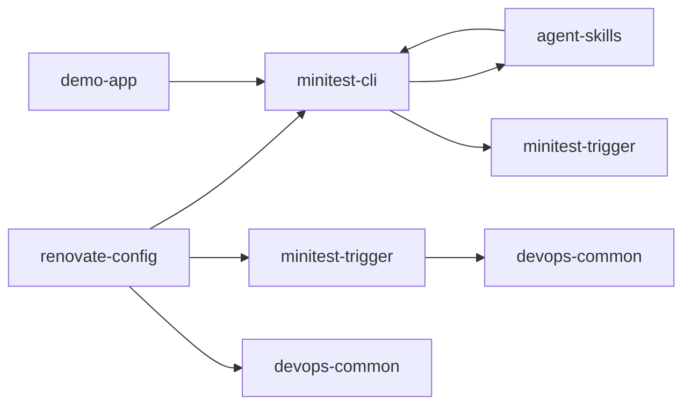

# Pre-flight预探索报告

> **预探索阶段完成时间**：2026-07-08
> **分析对象数量**：6个
> **任务规模**：中型（5-10个分析对象）

---

## 1. 代码仓库顶层目录结构

| 仓库名 | 根目录文件数 | 核心子目录 | 入口文件 | 依赖文件 |
|-------|------------|-----------|---------|---------|
| minitest-cli | 12 | src/minitest_cli/ (commands/, core/, api/, models/, utils/), tests/, .github/workflows/ | src/minitest_cli/main.py | pyproject.toml, uv.lock |
| minitest-trigger | 11 | src/, .github/workflows/ | src/main.ts | package.json, package-lock.json |
| agent-skills | 3 | skills/minitest-cli/ | skills/minitest-cli/SKILL.md | metadata.json |
| renovate-config | 2 | - | default.json | - |
| devops-common | 3 | .github/actions/ (12个Action) | .github/actions/affected-pytest/action.yml | - |
| demo-app | 8 | android/, ios/, lib/, test/, web/, linux/, macos/, windows/ | lib/main.dart | pubspec.yaml, pubspec.lock |

---

## 2. 核心入口文件路径

| 仓库名 | 类型 | 文件路径 | 说明 |
|-------|------|---------|------|
| minitest-cli | CLI入口 | src/minitest_cli/main.py | Typer命令行入口，注册所有子命令 |
| minitest-cli | API入口 | src/minitest_cli/api/client.py | ApiClient异步HTTP客户端 |
| minitest-cli | 配置入口 | src/minitest_cli/core/config.py | pydantic-settings配置管理 |
| minitest-cli | 认证入口 | src/minitest_cli/core/auth.py | 凭证管理与认证流程 |
| minitest-cli | 输出工具 | src/minitest_cli/utils/output.py | stdout/stderr分离输出 |
| minitest-trigger | Action入口 | action.yml | GitHub Action定义 |
| minitest-trigger | 主逻辑 | src/main.ts | Action主入口，调用各模块 |
| minitest-trigger | API调用 | src/api.ts | API请求封装 |
| minitest-trigger | 验证逻辑 | src/validate.ts | 构建验证（iOS/Android/Web） |
| minitest-trigger | OIDC处理 | src/ci-metadata.ts | CI元数据提取，OIDC claims解析 |
| agent-skills | Skill定义 | skills/minitest-cli/SKILL.md | AI Agent使用CLI的权威指令源 |
| agent-skills | Skill元数据 | skills/minitest-cli/metadata.json | Skill注册元数据 |
| renovate-config | 配置文件 | default.json | Renovate依赖更新策略配置 |
| devops-common | 核心Action | .github/actions/affected-pytest/action.yml | 选择性测试Action |
| demo-app | 主入口 | lib/main.dart | Flutter应用主入口 |
| demo-app | 游戏控制 | lib/controllers/game_controller.dart | 扫雷游戏核心逻辑 |

---

## 3. 跨仓库依赖关系



### 依赖关系说明

| 依赖方向 | 依赖类型 | 说明 |
|---------|---------|------|
| minitest-cli → agent-skills | 文档同步 | CLI命令变更需同步更新Skill文档 |
| agent-skills → minitest-cli | 使用依赖 | Skill文档描述CLI命令用法 |
| minitest-cli → minitest-trigger | 平台集成 | CLI触发的测试可通过Action集成到CI |
| minitest-trigger → devops-common | Action复用 | 使用affected-pytest等共享Action |
| renovate-config → minitest-cli | 配置应用 | Renovate策略应用于CLI仓库 |
| renovate-config → minitest-trigger | 配置应用 | Renovate策略应用于Trigger仓库 |
| renovate-config → devops-common | 配置应用 | Renovate策略应用于devops-common仓库 |
| demo-app → minitest-cli | 测试目标 | Demo应用是CLI测试的目标对象 |

---

## 4. 关键术语预识别

| 术语/概念 | 首次出现位置 | 初步定义 | 跨模块关联 |
|----------|-------------|---------|-----------|
| Mini AI Agent | minitest-cli | Minitest的核心AI测试代理，零脚本执行测试 | agent-skills、minitest-trigger |
| User Story | minitest-cli | 用户故事，包含验收标准的测试用例定义 | agent-skills、demo-app |
| Acceptance Criteria | minitest-cli | 验收标准，定义测试通过/失败的判定规则 | agent-skills |
| Test Profile | minitest-cli | 测试配置文件，包含Persona、设备、环境变量 | agent-skills |
| @qa.minitap.ai | agent-skills | 共享收件箱域名，自动读取OTP验证码 | minitest-cli |
| OIDC | minitest-trigger | GitHub OIDC认证，短期JWT token替代API Key | minitest-cli |
| BYO (Bring Your Own) | agent-skills | 用户自有账户模式，支持非minitap域名账户 | minitest-cli |
| flow-types | minitest-cli | 测试流程类型，定义测试执行方式 | agent-skills |
| affected-pytest | devops-common | 基于变更影响的选择性测试策略 | minitest-cli |
| playbook | minitest-cli | onboarding引导流程，7步完成首次测试 | agent-skills |

---

## 5. 关键配置文件清单

| 仓库名 | 配置文件 | 作用 |
|-------|---------|------|
| minitest-cli | pyproject.toml | Python项目配置，包含依赖、命令入口 |
| minitest-cli | .env.example | 环境变量示例 |
| minitest-cli | uv.lock | 依赖锁定文件 |
| minitest-trigger | package.json | Node.js项目配置 |
| minitest-trigger | action.yml | GitHub Action定义 |
| minitest-trigger | tsconfig.json | TypeScript配置 |
| agent-skills | metadata.json | Skill元数据注册 |
| renovate-config | default.json | Renovate依赖更新策略 |
| devops-common | .github/actions/*/action.yml | 共享GitHub Actions |
| demo-app | pubspec.yaml | Flutter项目配置 |

---

## 6. 预探索阶段耗时统计

| 步骤 | 耗时 | 说明 |
|------|------|------|
| 目录结构探索 | ~5分钟 | 使用LS工具遍历6个仓库 |
| 核心文件识别 | ~3分钟 | 识别入口文件和关键模块 |
| 依赖关系分析 | ~2分钟 | 分析跨仓库依赖 |
| 术语提取 | ~3分钟 | 从目录和文件命名提取关键术语 |
| 报告生成 | ~5分钟 | 编写preflight-exploration.md |
| **总计** | **~18分钟** | 预探索阶段总耗时 |

---

## 7. 预探索结果使用建议

### 子代理prompt注入内容

以下内容应作为共享上下文注入所有子代理prompt：

```
【共享上下文 - Pre-flight预探索结果】

## 分析对象概览

本次分析包含6个对象：
- minitest-cli（Python CLI工具，核心入口：src/minitest_cli/main.py）
- minitest-trigger（GitHub Action，核心入口：src/main.ts）
- agent-skills（AI Agent Skills，核心入口：skills/minitest-cli/SKILL.md）
- renovate-config（依赖更新配置，核心文件：default.json）
- devops-common（共享CI Actions，核心Action：affected-pytest）
- demo-app（Flutter示例应用，核心入口：lib/main.dart）

## 关键术语

- Mini AI Agent：零脚本AI测试代理
- User Story：测试用例定义，包含验收标准
- Test Profile：测试配置文件（Persona、设备、环境变量）
- @qa.minitap.ai：共享收件箱，自动读取OTP
- OIDC：GitHub OIDC无密钥认证
- BYO：用户自有账户模式

## 跨模块关联

- CLI与Skills：命令变更需同步更新SKILL.md
- CLI与Trigger：CLI测试可通过Action集成到CI
- Trigger与devops-common：使用affected-pytest等共享Action
- Renovate与所有仓库：统一依赖更新策略

## 分析注意事项

- minitest-cli使用Typer框架，支持--json输出和stdout/stderr分离
- minitest-trigger使用GitHub OIDC认证，API Key作为备选
- agent-skills的SKILL.md是AI Agent使用CLI的权威指令源
- devops-common包含12个共享GitHub Actions，重点关注affected-pytest
- demo-app是Flutter跨平台项目，包含Android/iOS/web/linux/macos/windows平台
```

---

[CMD-LOG] | level=INFO | cmd=preflight | step=S3 | event=PREFLIGHT_COMPLETE | session=spec-preflight-practice-20260708 | msg=Pre-flight预探索阶段完成，生成完整预探索报告，包含6个分析对象的结构概览、核心入口文件、跨仓库依赖关系、关键术语预识别
