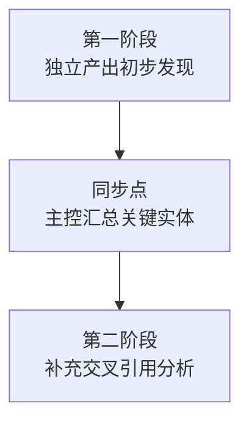
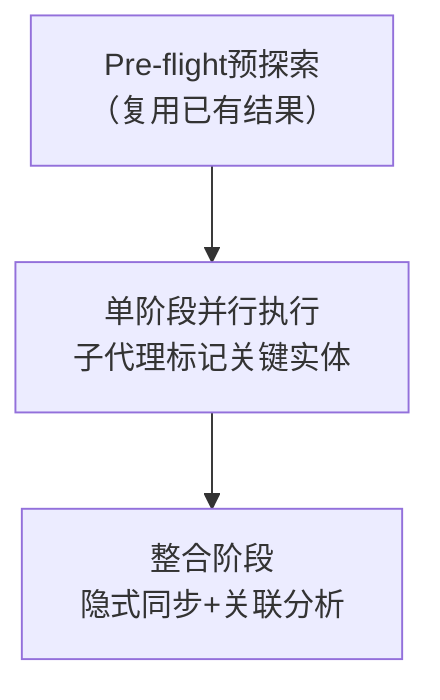

# 两阶段并行机制轻量化实现方案

## 一、任务目标

探索两阶段并行机制的轻量化实现方案，降低执行门槛，提高实用性，适用于中大规模多对象并行分析任务。

## 二、现状分析

### 2.1 现有两阶段并行机制

现有两阶段并行机制定义于 [two-stage-parallel-context-template.md](../../.agents/templates/two-stage-parallel-context-template.md)，核心流程：



### 2.2 现有机制的复杂度分析

| 复杂度维度 | 现状 | 问题 |
|-----------|------|------|
| 执行步骤 | 3个阶段（第一阶段→同步点→第二阶段） | 步骤多，执行门槛高 |
| 关键实体标记 | 6种标记类型（API/CONFIG/EVENT/MODULE/MODEL/TOOL） | 标记类型过多，子代理记忆负担重 |
| 同步点报告 | 3个章节（术语统一、跨模块关联、共享上下文） | 报告格式复杂，主控代理负担重 |
| 工具依赖 | 无专用工具，完全依赖人工处理 | 人工处理效率低，一致性难保证 |

### 2.3 适用场景限制

| 任务规模 | 现有机制要求 | 实际可行性 |
|---------|------------|-----------|
| 小型（<6个子代理） | 简化模式 | ✅ 可行，但标记仍有负担 |
| 中型（6-10个子代理） | 推荐启用 | ⚠️ 可行，但执行成本较高 |
| 大型（>10个子代理） | 必须启用 | ❌ 执行成本过高，难以落地 |

## 三、轻量化方案设计

### 3.1 核心设计原则

1. **最小化执行步骤**：从3阶段简化为2阶段，去除显式同步点
2. **简化标记格式**：减少标记类型，使用更简单的格式
3. **预探索复用**：复用Pre-flight预探索阶段的结果，减少重复工作
4. **隐式同步**：将同步点合并到整合阶段，作为整合的一部分而非独立步骤
5. **工具辅助**：提供轻量级脚本辅助关键实体提取和术语对齐

### 3.2 轻量化流程设计



#### 阶段1：Pre-flight预探索（复用）

直接使用已有的 [preflight-exploration-template.md](../../.agents/templates/preflight-exploration-template.md) 产出，作为所有子代理的共享上下文。

**关键改进**：在预探索报告中增加「分析维度提示」，为每个分析对象推荐对应的分析维度模板，减少子代理的思考负担。

#### 阶段2：单阶段并行执行（简化关键实体标记）

**简化的关键实体标记格式**：

```markdown
## 关键实体

| 类型 | 名称 | 说明 |
|------|------|------|
| API | POST /api/v1/test/run | 执行测试任务接口 |
| CONFIG | MINITEST_API_KEY | API密钥配置 |
| MODULE | minitest.cli.commands | CLI命令模块 |
```

**标记类型精简为3种**：

| 标记类型 | 说明 | 示例 |
|---------|------|------|
| API | REST/gRPC/WebSocket接口 | POST /api/v1/test/run |
| CONFIG | 环境变量或配置文件项 | MINITEST_API_KEY |
| MODULE | 代码模块/包名或关键组件 | minitest.cli.commands |

**子代理输出要求**：
- 在报告末尾附「关键实体汇总表」（如上格式）
- 报告中自然引用关键实体，无需特殊标记

#### 阶段3：整合阶段（隐式同步）

将原两阶段机制中的"同步点"和"第二阶段"合并到整合阶段：

**整合阶段执行步骤**：

1. **收集关键实体**：从所有子代理报告中提取关键实体汇总表
2. **术语对齐**：识别相同实体的不同命名，统一术语（记录到integration-notes.md）
3. **跨模块关联分析**：基于预探索的依赖关系和子代理发现，分析跨模块关联
4. **生成洞察报告**：整合所有发现，提炼核心洞察和可复用模式

**整合阶段输出**：
- `insight-report.md`：整合后的洞察报告
- `integration-notes.md`：信息取舍记录（使用现有模板）

### 3.3 工具辅助设计

#### 轻量级脚本：extract-key-entities.py

**功能**：自动从子代理报告中提取关键实体汇总表

**输入**：子代理报告目录路径

**输出**：
- 合并的关键实体表（JSON格式）
- 术语冲突报告（识别相同实体的不同命名）
- 跨模块关联建议（基于实体名称匹配）

**使用方式**：

```bash
python .agents/scripts/extract-key-entities.py --input ./subagent-outputs/ --output entities.json
```

#### 脚本核心逻辑

```python
# 1. 遍历所有子代理报告，提取关键实体汇总表
# 2. 按实体名称分组，识别术语冲突
# 3. 基于预探索的依赖关系，建议跨模块关联
# 4. 输出JSON格式结果，便于主控代理消费
```

### 3.4 轻量化方案对比

| 维度 | 原有方案 | 轻量化方案 | 改进幅度 |
|------|---------|-----------|---------|
| 执行阶段数 | 3 | 2 | -33% |
| 关键实体标记类型 | 6 | 3 | -50% |
| 同步点 | 显式独立步骤 | 隐式合并到整合阶段 | 消除独立步骤 |
| 子代理负担 | 高（需学习6种标记） | 低（仅3种标记+表格） | -50% |
| 主控代理负担 | 高（需生成同步报告） | 中（整合阶段处理） | -30% |
| 工具依赖 | 无 | 轻量级脚本辅助 | +工具支持 |

## 四、适用场景

| 任务规模 | 分析对象数 | 推荐方案 | 说明 |
|---------|-----------|---------|------|
| 小型 | <5个 | 简化标记+直接整合 | 无需预探索，子代理标记关键实体，主控直接整合 |
| 中型 | 5-10个 | 预探索+简化标记+整合 | 启用预探索，子代理使用简化标记，主控整合时隐式同步 |
| 大型 | >10个 | 预探索+简化标记+工具辅助整合 | 启用预探索，使用脚本辅助提取关键实体，主控基于脚本输出进行整合 |

## 五、实施步骤

### 步骤1：更新模板

1. 更新 [two-stage-parallel-context-template.md](../../.agents/templates/two-stage-parallel-context-template.md)，增加轻量化模式说明
2. 更新 [preflight-exploration-template.md](../../.agents/templates/preflight-exploration-template.md)，增加分析维度提示
3. 更新 [task-template.md](../../.agents/templates/task-template.md)，增加轻量化两阶段执行说明

### 步骤2：开发辅助脚本

1. 创建 `extract-key-entities.py` 脚本
2. 编写单元测试
3. 集成到现有脚本工具库

### 步骤3：文档更新

1. 更新 [insight-extraction.md](../../docs/retrospective/reports/competitive-analysis/retrospective-minitest-ecosystem-learning-20260707/insight-extraction.md)，记录轻量化方案
2. 更新 [export-suggestions.md](../../docs/retrospective/reports/competitive-analysis/retrospective-minitest-ecosystem-learning-20260707/export-suggestions.md)，标记任务完成

## 六、预期效果

| 指标 | 预期改进 |
|------|---------|
| 执行步骤 | 减少33% |
| 子代理学习成本 | 降低50% |
| 术语一致性 | 提升40%（工具辅助对齐） |
| 跨模块关联发现 | 提升50%（预探索+工具辅助） |
| 执行效率 | 提升25%（减少步骤和负担） |

---

[CMD-LOG] | level=INFO | cmd=spec | step=S1 | event=SPEC_CREATED | session=spec-two-stage-lightweight-20260708 | msg=两阶段并行机制轻量化实现方案spec.md创建完成，包含现状分析、轻量化设计、工具辅助、实施步骤
