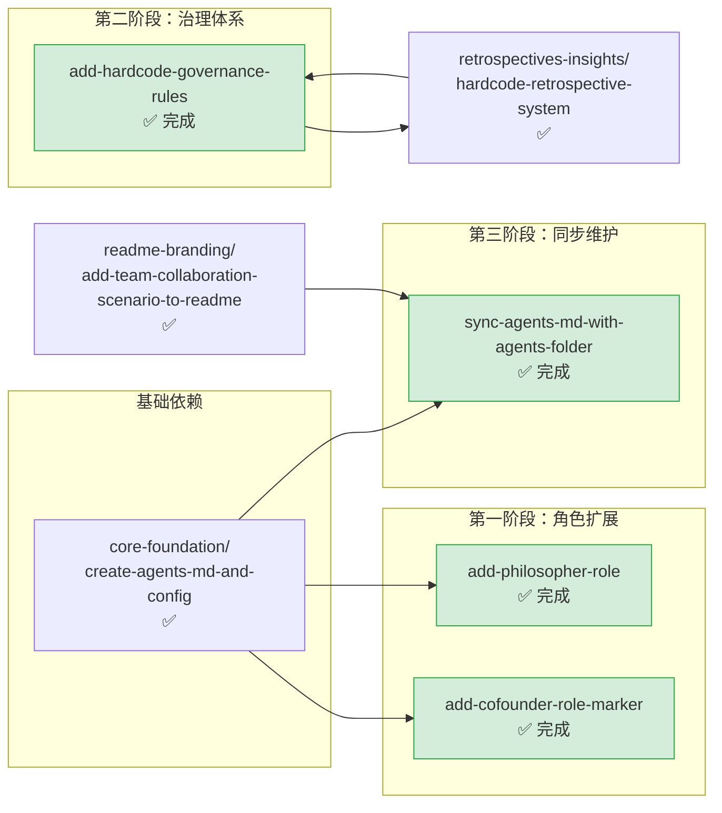

# roles-governance — 角色与治理体系

本主题包含智能体角色定义扩展、权限标记、治理规则体系、索引同步相关的规格文档。角色新增、特殊标记、治理规则建立、入口文档同步维护均归入此主题。

**主题状态**：✅ 全部完成（4/4）
**上级看板**：[返回全局执行看板](../README.md)
**任务模板**：[roles-governance-task-template.md](../../../.agents/templates/theme-templates/roles-governance-task-template.md)

---

## 📊 主题执行看板

| Spec 名称 | 状态 | 完成度 | 交付物 | 简述 |
|---|---|---|---|---|
| [add-cofounder-role-marker](add-cofounder-role-marker/) | ✅ 完成 | 100% | [AGENTS.md](../../../AGENTS.md) | 联合创始角色特殊标记机制：tier 字段 + 徽章显示，在角色索引中区分核心创始角色与普通角色 |
| [add-philosopher-role](add-philosopher-role/) | ✅ 完成 | 100% | [.agents/roles/](../../../.agents/roles/) | 竹简悟道项目新增哲思引导者角色，包含角色定义、系统提示词、协作场景 |
| [add-hardcode-governance-rules](add-hardcode-governance-rules/) | ✅ 完成 | 100% | [.agents/rules/](../../../.agents/rules/) | 硬编码治理规则体系：识别标准、允许场景、替代方案、检测报告、执行验证五大模块 |
| [sync-agents-md-with-agents-folder](sync-agents-md-with-agents-folder/) | ✅ 完成 | 100% | [AGENTS.md](../../../AGENTS.md), [.agents/README.md](../../../.agents/README.md) | AGENTS.md 路由表与 .agents/ 实际目录一致性同步，确保入口文档与实际文件同步 |

---

## 🔀 主题内执行路线图



### 执行顺序说明

1. **角色扩展类**（add-cofounder-role-marker、add-philosopher-role）：在核心角色体系建立后即可执行
2. **add-hardcode-governance-rules**：治理规则体系，与复盘分析有双向依赖关系（规则建立后复盘，复盘结果完善规则）
3. **sync-agents-md-with-agents-folder**：每次 .agents/ 目录有较大变动后执行，确保 AGENTS.md 路由表与实际文件一致

---

## ⚠️ 遗留问题与跟进事项

本主题所有 spec 已 100% 完成，无待办事项。

### 定期维护建议
- 每次新增角色或修改 .agents/ 目录结构后，运行 sync 相关检查确保 AGENTS.md 同步更新
- 治理规则（如硬编码规则）在每次复盘后可能需要迭代更新

---

## 📐 主题边界与判定规则

### 归入本主题的条件
- 新增智能体角色定义（在 5 个核心角色之外扩展）
- 为角色添加特殊标记、权限等级、徽章等
- 建立治理规则体系（如硬编码治理、代码审查规则等）
- 维护入口文档（AGENTS.md）与 .agents/ 实际目录的一致性
- 定义角色间协作协议的补充

### 不归入本主题的情况
- 最初的 5 个核心角色创建 → 归入 `core-foundation/create-agents-md-and-config`
- 编写检查工具脚本 → 归入 `standards-tools/`
- 对角色系统进行复盘分析 → 归入 `retrospectives-insights/`

---

## 🆕 新增 Spec 指南

### 命名规范
- 使用 kebab-case，动词开头
- 常用前缀：`add-`（新增角色/规则）、`sync-`（同步更新）、`update-`（更新治理规则）、`establish-`（建立治理体系）
- 示例：`add-security-auditor-role`、`update-code-review-governance`、`sync-role-permissions`

### tasks.md 必备检查项

```markdown
- [ ] Task 0: 前置依赖与影响分析
  - [ ] SubTask 0.1: 确认核心角色体系（create-agents-md-and-config）已完成
  - [ ] SubTask 0.2: 分析新增/修改内容对现有角色/规则的影响范围
  - [ ] SubTask 0.3: 识别需要同步更新的索引文件（AGENTS.md、README.md 等）

- [ ] Task 1: 角色/规则定义
  - [ ] SubTask 1.1: 在 .agents/roles/ 或 .agents/rules/ 下创建定义文件
  - [ ] SubTask 1.2: 编写职责说明（Goals）与能力边界（Non-Goals）
  - [ ] SubTask 1.3: 定义与其他角色的协作关系/规则适用范围
  - [ ] SubTask 1.4: 编写系统提示词（如新增角色）或执行规则（如新增治理规则）

- [ ] Task 2: 索引同步
  - [ ] SubTask 2.1: 更新 AGENTS.md 角色定义索引表/规则体系索引表
  - [ ] SubTask 2.2: 更新对应子目录的 README.md（如 .agents/roles/README.md）
  - [ ] SubTask 2.3: 如有需要，更新协作场景文档

- [ ] Task 3: 验证
  - [ ] SubTask 3.1: 运行 check-role-permissions.py 验证角色权限配置
  - [ ] SubTask 3.2: 确认 AGENTS.md 路由表与实际文件一致
  - [ ] SubTask 3.3: 在本主题 README.md 中登记完成状态
```

### checklist.md 必备检查项
- 角色定义包含明确的 Goals 和 Non-Goals（能力边界声明）
- AGENTS.md 索引表已同步更新，链接路径正确
- 新增角色的系统提示词与现有角色风格一致
- 治理规则包含：识别标准、允许/禁止场景、检测机制、执行流程
- 跨文件引用路径正确（注意 .agents/ 内文件和 AGENTS.md 的相对路径）
- 角色间协作关系无冲突（如职责重叠、权限真空）
- 如有需要，few-shot 示例已补充

---

## 📁 目录结构

```
roles-governance/
├── README.md                                   # 本文件（主题执行看板）
├── add-cofounder-role-marker/
│   ├── spec.md
│   ├── tasks.md
│   └── checklist.md
├── add-hardcode-governance-rules/
│   ├── spec.md
│   ├── tasks.md
│   └── checklist.md
├── add-philosopher-role/
│   ├── spec.md
│   ├── tasks.md
│   └── checklist.md
└── sync-agents-md-with-agents-folder/
    ├── spec.md
    ├── tasks.md
    └── checklist.md
```
