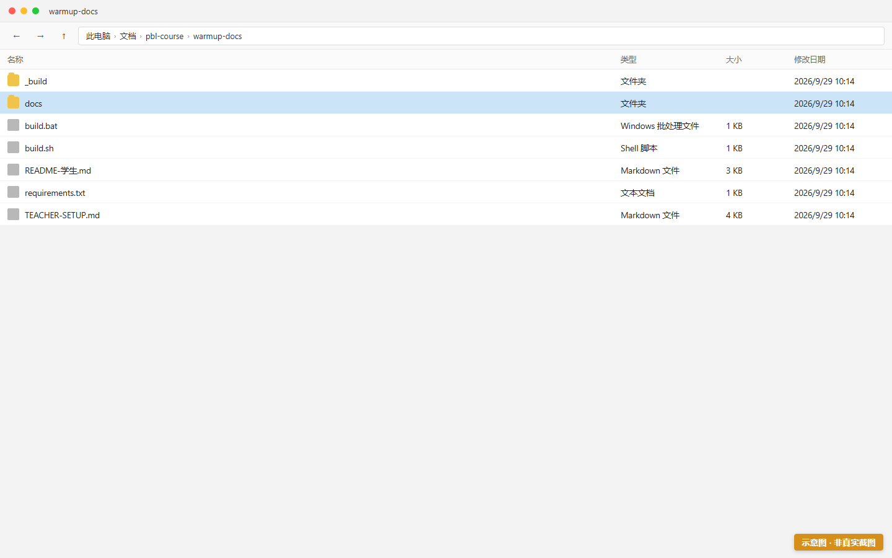
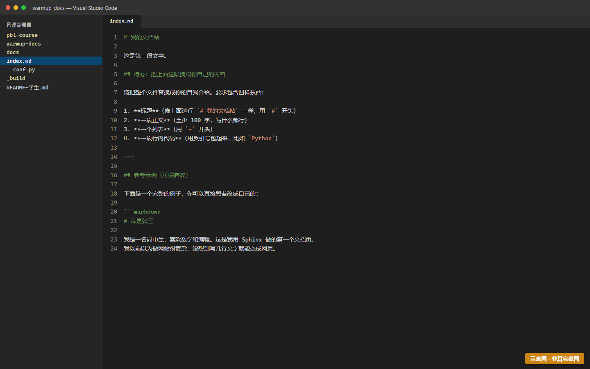
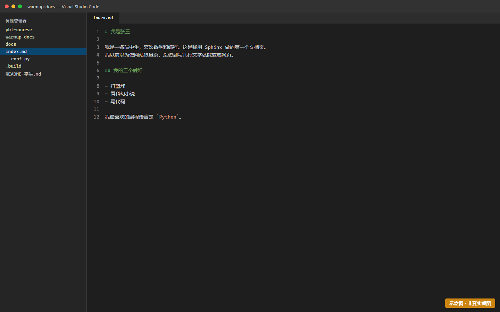
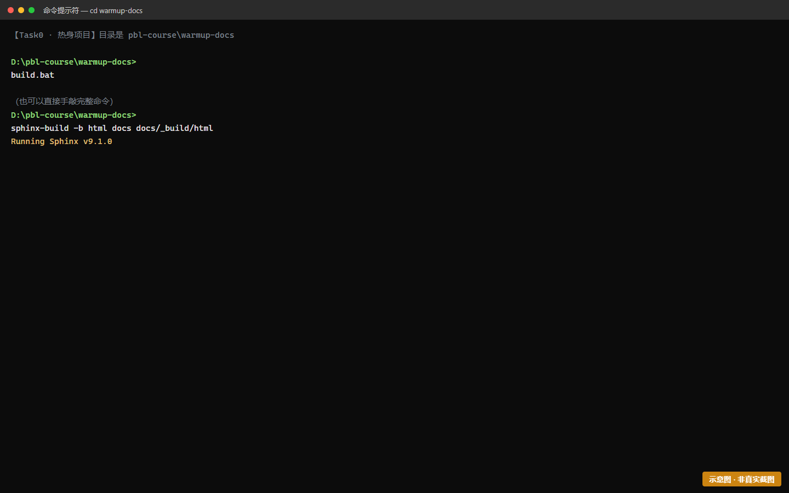
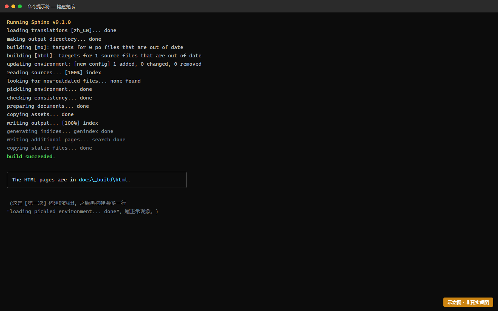
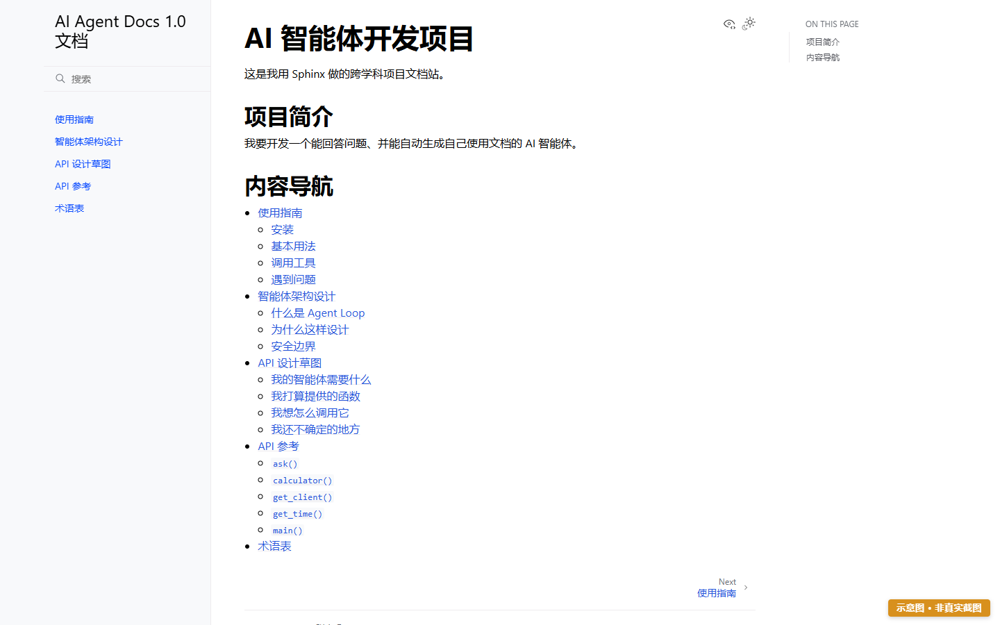

# Task0 — 30 分钟零代码文档站成功体验

> 时长：30 分钟 | 难度：★☆☆☆☆ | 前置：无
> 🎯 **本任务唯一目标**：让你在浏览器里看到自己写的文字变成网页，建立"我能做出东西"的信心。
>
> ⛔ **本任务禁止**：写 Python、装软件（pip/venv）、用 Git。谁在这些上浪费时间，谁就搞错了任务重点。

---

## 一、你要做什么（一句话）

用 Markdown 写一页自我介绍，让它在浏览器里变成网页。

---

## 二、开始之前

请从老师那里拿到**热身项目文件夹**（一个已经配置好的最小 Sphinx 项目）。它长这样：

```
warmup-docs/
├── conf.py          ← 配置文件（别动它，本任务不碰配置）
├── index.md         ← 【你唯一要改的文件】
└── _build/          ← 构建结果（自动生成，别手动改）
```



> 🖼 **S0-1 · 热身项目 warmup-docs 的文件夹结构**
>
> ⚠️ 本图为**示意图**（HTML 合成），用于帮助理解画面结构，**不是真实运行截图**。
> 你的实际界面会与本图有差异（版本号、路径、配色等），以你屏幕上看到的为准。
>

> 💡 **为什么只有一个文件要改？** 老师已经帮你把环境准备好了。
> 你的任务不是"配环境"，而是"看到文字变成网页"。配环境是 Task1 的事。

---

## 三、操作步骤

### 步骤 1：打开 `index.md`

用任意文本编辑器打开它（VS Code、Notepad++、记事本都行）。
你会看到里面有一些现成的文字，像这样：

```markdown
# 我的文档站

这是第一段文字。
```



> 🖼 **S0-2 · 在编辑器中打开 index.md**
>
> ⚠️ 本图为**示意图**（HTML 合成），用于帮助理解画面结构，**不是真实运行截图**。
> 你的实际界面会与本图有差异（版本号、路径、配色等），以你屏幕上看到的为准。
>

---

### 步骤 2：写一页介绍你自己

把 `index.md` 的内容**全部替换**成你自己的版本。要求包含四样东西：

```markdown
# 我是张三

我是一名高中生，喜欢数学和编程。这是我用 Sphinx 做的第一个文档页。

## 我的三个爱好

- 打篮球
- 看科幻小说
- 写代码

我最喜欢的编程语言是 `Python`。
```

**四个必备元素**（验收会检查）：
1. `#` 开头的**标题**
2. **一段正文**（≥100 字，写什么都行）
3. `-` 开头的**列表**
4. **反引号**包起来的**行内代码**（如 `` `Python` ``）



> 🖼 **S0-3 · 学生写好的 index.md 内容**
>
> ⚠️ 本图为**示意图**（HTML 合成），用于帮助理解画面结构，**不是真实运行截图**。
> 你的实际界面会与本图有差异（版本号、路径、配色等），以你屏幕上看到的为准。
>

> 💡 **为什么要写四样东西？** 因为这四样正好对应 Markdown 最常用的四种能力。你现在练手，后面写正式文档就是它们的扩展。

---

### 步骤 3：构建成网页

打开命令行（Windows：Git Bash 或 PowerShell；Mac：终端），**切到热身项目所在目录**，执行：

```bash
sphinx-build -b html . _build/html
```



> 🖼 **S0-4 · 在命令行中执行构建命令**
>
> ⚠️ 本图为**示意图**（HTML 合成），用于帮助理解画面结构，**不是真实运行截图**。
> 你的实际界面会与本图有差异（版本号、路径、配色等），以你屏幕上看到的为准。
>

**成功的标志**：终端输出一堆 `reading sources... [100%]`、`writing output...` 之类的信息，最后**没有红色的 ERROR**。



> 🖼 **S0-5 · 构建成功的终端输出（首次构建）**
>
> ⚠️ 本图为**示意图**（HTML 合成），用于帮助理解画面结构，**不是真实运行截图**。
> 你的实际界面会与本图有差异（版本号、路径、配色等），以你屏幕上看到的为准。
>

---

### 步骤 4：打开你的网页

用文件管理器进到 `_build/html/` 目录，**双击 `index.html`**（或右键用浏览器打开）。

🎉 你应该看到自己的名字、爱好列表，`Python` 显示成代码样式。



> 🖼 **S0-6 · 浏览器中打开的成果页面**
>
> ⚠️ 本图为**示意图**（HTML 合成），用于帮助理解画面结构，**不是真实运行截图**。
> 你的实际界面会与本图有差异（版本号、路径、配色等），以你屏幕上看到的为准。
>
> 📖 原画面说明：浏览器中打开的成果页面

**截图留存**：这个截图要交给老师（TR-0.1 的验收证据）。

---

## 四、常见报错

| 现象 | 原因 | 怎么办 |
|---|---|---|
| `command not found: sphinx-build` | 没在正确的环境里，或依赖没装好 | 告诉老师，让老师检查环境。**这不是你要解决的问题**（本任务零配置） |
| `WARNING: document isn't included in any toctree` | 只是警告，不影响 | 忽略它，网页照样能打开 |
| 网页打开是空白 / 404 | 打开的文件不对 | 确认打开的是 `_build/html/index.html`，不是 `_build/` 下的其他文件 |
| 中文显示成方框 | 字体问题 | 告诉老师（属于环境问题） |
| Rebuild 后网页没变化 | 浏览器缓存 | 按 `Ctrl+F5`（Mac：`Cmd+Shift+R`）强制刷新 |

---

## 五、完成标志（自检）

- [ ] `index.md` 里有我写的标题、正文（≥100 字）、列表、行内代码
- [ ] 我执行了 `sphinx-build` 命令，没有 ERROR
- [ ] 我在浏览器里看到了自己的网页
- [ ] 我截图了，能交给老师
- [ ] **全程我没有装任何软件、没写 Python、没用 Git** ✓

---

## 六、任务结束语

如果你现在想说一句"**原来写文档就是写文字，不是搞环境**"——那这个任务就成功了。

接下来 Task1 才开始真正装环境。**今天你只需要记住一件事：这件事你能做。**

---
[← 返回手册目录](README.md) | [下一个：Task1 环境搭建 →](task-1-env.md)
