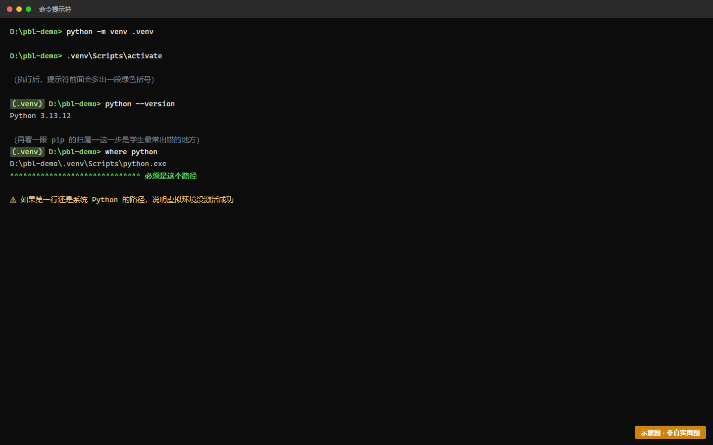
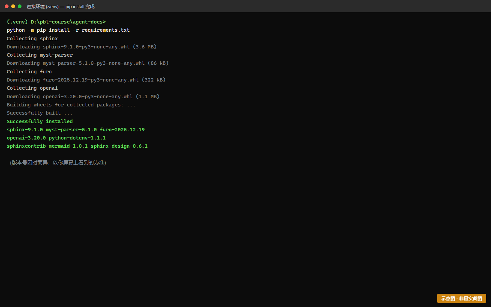
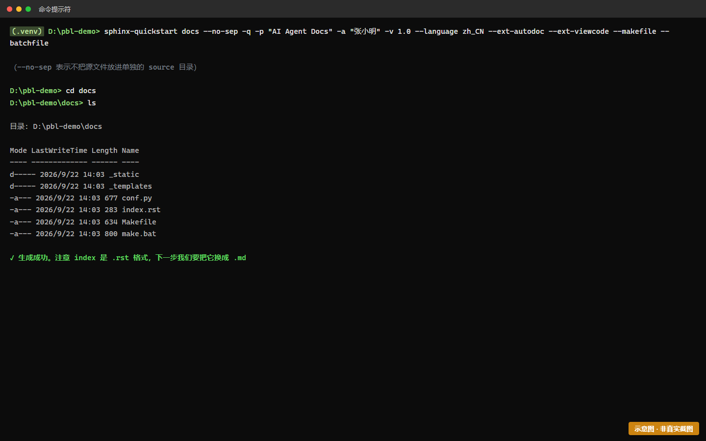
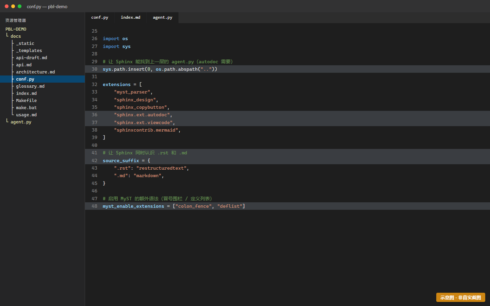
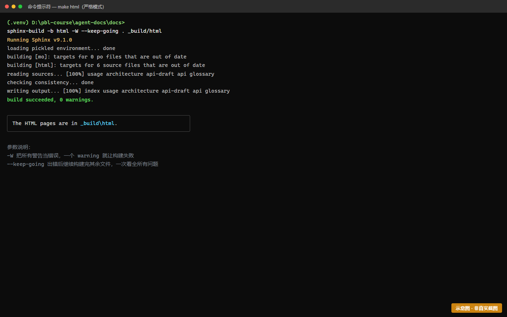

# Task1 — 环境搭建与 Sphinx 初始化

> 时长：1–2 课时 | 难度：★★★☆☆ | 前置：[Task0](task-0-warmup.md)
> 🎯 **目标**：搭好开发环境，跑出一个能构建的空文档站。
>
> ⚠️ **这是全项目最容易卡住的一步**。卡住很正常，请配合"常见报错"小节逐条排查。

---

## 一、操作步骤

### 步骤 1：建项目目录 + 虚拟环境

先在命令行里建一个你项目的文件夹（名字随意，这里用 `my-agent`）：

```bash
mkdir my-agent
cd my-agent
```

然后建 Python 虚拟环境（它把你的依赖和电脑上其他 Python 项目隔离开）：

```bash
# Windows (Git Bash)
python -m venv .venv
source .venv/Scripts/activate

# Windows (PowerShell)
python -m venv .venv
.venv\Scripts\Activate.ps1

# macOS / Linux
python -m venv .venv
source .venv/bin/activate
```

**成功的标志**：命令行提示符前面出现 `(.venv)`。



> 🖼 **S1-1 · 虚拟环境激活成功（提示符含 .venv）**
>
> ⚠️ 本图为**示意图**（HTML 合成），用于帮助理解画面结构，**不是真实运行截图**。
> 你的实际界面会与本图有差异（版本号、路径、配色等），以你屏幕上看到的为准。
>
> 📖 原画面说明：虚拟环境激活成功（提示符含 .venv）

---

### 步骤 2：安装依赖

```bash
pip install sphinx myst-parser sphinx-design sphinx-copybutton python-dotenv openai
```

| 包名 | 干什么用的 |
|---|---|
| `sphinx` | 文档引擎本体 |
| `myst-parser` | 让你能用 Markdown 写 Sphinx 文档（不然只能写 reST） |
| `sphinx-design` | 提供好看的卡片、标签等组件 |
| `sphinx-copybutton` | 代码块右上角加"复制"按钮 |
| `python-dotenv` | 从 `.env` 文件读环境变量（保护你的 API Key） |
| `openai` | 调用大模型的 SDK |



> 🖼 **S1-2 · pip install 完成（出现 Successfully installed）**
>
> ⚠️ 本图为**示意图**（HTML 合成），用于帮助理解画面结构，**不是真实运行截图**。
> 你的实际界面会与本图有差异（版本号、路径、配色等），以你屏幕上看到的为准。
>

**顺手存一份依赖清单**（方便复现）：

```bash
pip freeze > requirements.txt
```

---

### 步骤 3：初始化 Sphinx 项目

**用这条非交互命令**（比默认的交互式问答省事，不会卡在问题上）：

```bash
sphinx-quickstart docs --no-sep -q -p "AI Agent Docs" -a "你的名字" \
  -v 1.0 --language zh_CN --ext-autodoc --ext-viewcode --makefile --batchfile
```

参数解释：
- `docs` — 文档放进 `docs/` 目录
- `--no-sep` — 源代码和构建结果分开存放（推荐）
- `-q` — 安静模式，不逐项问你
- `-p` / `-a` — 项目名 / 作者名
- `--language zh_CN` — 界面用中文
- `--ext-autodoc` — **关键参数**！开启后能把代码自动抽进文档（Task5 要用）

**成功的标志**：`docs/` 目录下生成了 `conf.py`、`index.rst`、`Makefile`。



> 🖼 **S1-3 · sphinx-quickstart 生成的文件**
>
> ⚠️ 本图为**示意图**（HTML 合成），用于帮助理解画面结构，**不是真实运行截图**。
> 你的实际界面会与本图有差异（版本号、路径、配色等），以你屏幕上看到的为准。
>
> 📖 原画面说明：sphinx-quickstart 生成的文件

> ⚠️ **如果你的 Sphinx 版本低于 7.0**，`--no-sep` 参数不存在。此时去掉它，改用 `sphinx-quickstart docs` 交互式回答，在"Separate source and build directories"那问选 `y`。

---

### 步骤 4：配置 conf.py

打开 `docs/conf.py`，找到 `extensions = []` 这一行，改成：

```python
extensions = [
    "myst_parser",
    "sphinx_design",
    "sphinx_copybutton",
    "sphinx.ext.autodoc",
]

# 让 Sphinx 同时认识 .rst 和 .md
source_suffix = {
    ".rst": "restructuredtext",
    ".md": "markdown",
}

# 启用 MyST 的额外语法
myst_enable_extensions = ["colon_fence", "deflist"]

# 换一个现代主题
html_theme = "furo"
```

> 💡 **为什么主题要换？** 默认主题 `alabaster` 比较老旧。`furo` 是现代文档站的常见选择，看起来专业很多。它需要额外安装：`pip install furo`



> 🖼 **S1-4 · 修改后的 conf.py（高亮处为改动行）**
>
> ⚠️ 本图为**示意图**（HTML 合成），用于帮助理解画面结构，**不是真实运行截图**。
> 你的实际界面会与本图有差异（版本号、路径、配色等），以你屏幕上看到的为准。
>
> 📖 原画面说明：修改后的 conf.py

---

### 步骤 5：建 .gitignore（重要！）

在**项目根目录**（`my-agent/`，不是 `docs/`）新建文件 `.gitignore`，写入：

```gitignore
.venv/
_build/
__pycache__/
.env
```

> 🔒 **`.env` 那一行是保命的**。Task4 你会把 API Key 写进 `.env`，如果不排除，密钥会被推到公开的 GitHub 上。这是真实世界里最常出的事故之一，现在养成习惯。

---

### 步骤 6：构建验证

```bash
sphinx-build -b html docs docs/_build/html
```

看到 `build succeeded` 之类的输出，且 `docs/_build/html/index.html` 存在，就成功了。



> 🖼 **S1-5 · 严格模式构建成功（0 warnings）**
>
> ⚠️ 本图为**示意图**（HTML 合成），用于帮助理解画面结构，**不是真实运行截图**。
> 你的实际界面会与本图有差异（版本号、路径、配色等），以你屏幕上看到的为准。
>

---

## 二、常见报错

| 报错 | 原因 | 解决 |
|---|---|---|
| `'python' 不是内部或外部命令` | Python 没装或没加进 PATH | Windows 重装 Python，勾选 "Add Python to PATH" |
| `Activate.ps1 无法加载，因为在此系统上禁止运行脚本` | PowerShell 执行策略限制 | 改用 Git Bash；或以管理员运行 `Set-ExecutionPolicy RemoteSigned` |
| `No module named 'sphinx'` | 虚拟环境没激活，或包装到别处了 | 确认提示符有 `(.venv)`；没有就重新执行激活命令 |
| `Unknown directive type "toctree"` + 一堆 WARNING | 用了 `.md` 但没装/没启用 myst-parser | 检查 `pip list \| grep myst` 和 `conf.py` 的 `extensions` |
| `Theme error: no theme named 'furo'` | 没装 furo | `pip install furo` |
| 中文全是方框/乱码 | 编码问题 | 文件保存为 UTF-8；Windows 下执行 `chcp 65001` |
| `sphinx-quickstart: error: no such option: --no-sep` | Sphinx < 7.0 | 去掉该参数，用交互式模式 |
| 构建成功但页面还是空的 | 只看 `_build/html/` 里的过期文件 | 重新构建；或改 `index.rst` 内容后再构建 |

---

## 三、完成标志（自检）

- [ ] 命令行提示符前有 `(.venv)`
- [ ] `pip install` 成功，`requirements.txt` 已生成
- [ ] `docs/` 目录下有 `conf.py`、`index.rst`
- [ ] `conf.py` 里已加上 4 个 extensions + `source_suffix` + `html_theme = "furo"`
- [ ] 根目录有 `.gitignore`，且含 `.env` 和 `.venv/`
- [ ] 执行 `sphinx-build` 成功，`docs/_build/html/index.html` 存在

**对应验收标准**：TR-1.1（构建成功）、TR-1.2（.gitignore 正确）

---
[← 上一个：Task0 热身](task-0-warmup.md) | [返回手册目录](README.md) | [下一个：Task2 文档先行 →](task-2-docs.md)
